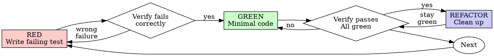

<!-- Generated by SpecStory, Markdown v2.1.0 -->

# 2026-05-08 18:14:44Z

<!-- Codex CLI Session 019e08cc-4678-7463-9fa8-7d5135241bf4 (2026-05-08 18:14:44Z) -->

_**User (2026-05-08 18:14:44Z)**_

现在还有个bug，移动端的模型和桌面端的模型好像不同步，你看看这个可以做成同步吗


---

_**Agent (gpt-5.5 2026-05-08 18:14:59Z)**_

我先把这个当成一个真实同步 bug 来查：看移动端模型选择存在哪里、桌面端读写哪里、两边有没有同一个状态源。顺手会先读一下相关调试规范和这份仓库的历史记忆，避免踩之前已经踩过的坑。

_**Agent (gpt-5.5 2026-05-08 18:14:59Z)**_

<tool-use data-tool-type="shell" data-tool-name="exec_command"><details>
<summary>Tool use: **exec_command** `sed -n '1,220p' '/Users/xiayanghui/Library/Mobile Documents/com~apple~CloudDocs/agent-skills/skills/.system/superpowers/using-superpowers/SKILL.md' 2>/dev/null || sed -n '1,220p' '/Users/xiayanghui/.codex/plugins/cache/openai-curated/superpowers/f812c146/skills/using-superpowers/SKILL.md'`</summary>
```
Chunk ID: 3b4eb3
Wall time: 0.0000 seconds
Process exited with code 0
Original token count: 1356
Output:
---
name: using-superpowers
description: Use when starting any conversation - establishes how to find and use skills, requiring Skill tool invocation before ANY response including clarifying questions
---

<SUBAGENT-STOP>
If you were dispatched as a subagent to execute a specific task, skip this skill.
</SUBAGENT-STOP>

<EXTREMELY-IMPORTANT>
If you think there is even a 1% chance a skill might apply to what you are doing, you ABSOLUTELY MUST invoke the skill.

IF A SKILL APPLIES TO YOUR TASK, YOU DO NOT HAVE A CHOICE. YOU MUST USE IT.

This is not negotiable. This is not optional. You cannot rationalize your way out of this.
</EXTREMELY-IMPORTANT>

## Instruction Priority

Superpowers skills override default system prompt behavior, but **user instructions always take precedence**:

1. **User's explicit instructions** (CLAUDE.md, GEMINI.md, AGENTS.md, direct requests) — highest priority
2. **Superpowers skills** — override default system behavior where they conflict
3. **Default system prompt** — lowest priority

If CLAUDE.md, GEMINI.md, or AGENTS.md says "don't use TDD" and a skill says "always use TDD," follow the user's instructions. The user is in control.

## How to Access Skills

**In Claude Code:** Use the `Skill` tool. When you invoke a skill, its content is loaded and presented to you—follow it directly. Never use the Read tool on skill files.

**In Copilot CLI:** Use the `skill` tool. Skills are auto-discovered from installed plugins. The `skill` tool works the same as Claude Code's `Skill` tool.

**In Gemini CLI:** Skills activate via the `activate_skill` tool. Gemini loads skill metadata at session start and activates the full content on demand.

**In other environments:** Check your platform's documentation for how skills are loaded.

## Platform Adaptation

Skills use Claude Code tool names. Non-CC platforms: see `references/copilot-tools.md` (Copilot CLI), `references/codex-tools.md` (Codex) for tool equivalents. Gemini CLI users get the tool mapping loaded automatically via GEMINI.md.

# Using Skills

## The Rule

**Invoke relevant or requested skills BEFORE any response or action.** Even a 1% chance a skill might apply means that you should invoke the skill to check. If an invoked skill turns out to be wrong for the situation, you don't need to use it.


## Red Flags

These thoughts mean STOP—you're rationalizing:

| Thought | Reality |
|---------|---------|
| "This is just a simple question" | Questions are tasks. Check for skills. |
| "I need more context first" | Skill check comes BEFORE clarifying questions. |
| "Let me explore the codebase first" | Skills tell you HOW to explore. Check first. |
| "I can check git/files quickly" | Files lack conversation context. Check for skills. |
| "Let me gather information first" | Skills tell you HOW to gather information. |
| "This doesn't need a formal skill" | If a skill exists, use it. |
| "I remember this skill" | Skills evolve. Read current version. |
| "This doesn't count as a task" | Action = task. Check for skills. |
| "The skill is overkill" | Simple things become complex. Use it. |
| "I'll just do this one thing first" | Check BEFORE doing anything. |
| "This feels productive" | Undisciplined action wastes time. Skills prevent this. |
| "I know what that means" | Knowing the concept ≠ using the skill. Invoke it. |

## Skill Priority

When multiple skills could apply, use this order:

1. **Process skills first** (brainstorming, debugging) - these determine HOW to a
... (truncated)
```
</details></tool-use>

_**Agent (gpt-5.5 2026-05-08 18:14:59Z)**_

<tool-use data-tool-type="shell" data-tool-name="exec_command"><details>
<summary>Tool use: **exec_command** `sed -n '1,240p' '/Users/xiayanghui/.codex/plugins/cache/openai-curated/superpowers/f812c146/skills/systematic-debugging/SKILL.md'`</summary>
```
Chunk ID: bad6e6
Wall time: 0.0000 seconds
Process exited with code 0
Original token count: 1807
Output:
---
name: systematic-debugging
description: Use when encountering any bug, test failure, or unexpected behavior, before proposing fixes
---

# Systematic Debugging

## Overview

Random fixes waste time and create new bugs. Quick patches mask underlying issues.

**Core principle:** ALWAYS find root cause before attempting fixes. Symptom fixes are failure.

**Violating the letter of this process is violating the spirit of debugging.**

## The Iron Law

```
NO FIXES WITHOUT ROOT CAUSE INVESTIGATION FIRST
```

If you haven't completed Phase 1, you cannot propose fixes.

## When to Use

Use for ANY technical issue:
- Test failures
- Bugs in production
- Unexpected behavior
- Performance problems
- Build failures
- Integration issues

**Use this ESPECIALLY when:**
- Under time pressure (emergencies make guessing tempting)
- "Just one quick fix" seems obvious
- You've already tried multiple fixes
- Previous fix didn't work
- You don't fully understand the issue

**Don't skip when:**
- Issue seems simple (simple bugs have root causes too)
- You're in a hurry (rushing guarantees rework)
- Manager wants it fixed NOW (systematic is faster than thrashing)

## The Four Phases

You MUST complete each phase before proceeding to the next.

### Phase 1: Root Cause Investigation

**BEFORE attempting ANY fix:**

1. **Read Error Messages Carefully**
   - Don't skip past errors or warnings
   - They often contain the exact solution
   - Read stack traces completely
   - Note line numbers, file paths, error codes

2. **Reproduce Consistently**
   - Can you trigger it reliably?
   - What are the exact steps?
   - Does it happen every time?
   - If not reproducible → gather more data, don't guess

3. **Check Recent Changes**
   - What changed that could cause this?
   - Git diff, recent commits
   - New dependencies, config changes
   - Environmental differences

4. **Gather Evidence in Multi-Component Systems**

   **WHEN system has multiple components (CI → build → signing, API → service → database):**

   **BEFORE proposing fixes, add diagnostic instrumentation:**
   ```
   For EACH component boundary:
     - Log what data enters component
     - Log what data exits component
     - Verify environment/config propagation
     - Check state at each layer

   Run once to gather evidence showing WHERE it breaks
   THEN analyze evidence to identify failing component
   THEN investigate that specific component
   ```

   **Example (multi-layer system):**
   ```bash
   # Layer 1: Workflow
   echo "=== Secrets available in workflow: ==="
   echo "IDENTITY: ${IDENTITY:+SET}${IDENTITY:-UNSET}"

   # Layer 2: Build script
   echo "=== Env vars in build script: ==="
   env | grep IDENTITY || echo "IDENTITY not in environment"

   # Layer 3: Signing script
   echo "=== Keychain state: ==="
   security list-keychains
   security find-identity -v

   # Layer 4: Actual signing
   codesign --sign "$IDENTITY" --verbose=4 "$APP"
   ```

   **This reveals:** Which layer fails (secrets → workflow ✓, workflow → build ✗)

5. **Trace Data Flow**

   **WHEN error is deep in call stack:**

   See `root-cause-tracing.md` in this directory for the complete backward tracing technique.

   **Quick version:**
   - Where does bad value originate?
   - What called this with bad value?
   - Keep tracing up until you find the source
   - Fix at source, not at symptom

### Phase 2: Pattern Analysis

**Find the pattern before fixing:**

1. **Find Working Examples**
   - Locate similar working code in same codebase
   - What works that's similar to what's broken?

2. **Compare Against References**
   - If implementing pattern, read reference implementation COMPLETELY
   - Don't skim - read every line
   - Understand the pattern fully before applying

3. **Identify Differences**
   - What's different between working and broken?
   - List every difference, however small
   - Don't assume "that can't matter"

4. **Understand Dependencies**
   - What other components does this need?
   - What settings, config, environment?
   - What assumptions does it make?

### Phase 3: Hypothesis and Testing

**Scientific method:**

1. **Form Single Hypothesis**
   - State clearly: "I think X is the root cause because Y"
   - Write it down
   - Be specific, not vague

2. **Test Minimally**
   - Make the SMALLEST possible change to test hypothesis
   - One variable at a time
   - Don't fix multiple things at once

3. **Verify Before Continuing**
   - Did it work? Yes → Phase 4
   - Didn't work? Form NEW hypothesis
   - DON'T add more fixes on top

4. **When You Don't Know**
   - Say "I don't understand X"
   - Don't pretend to know
   - Ask for help
   - Research more

### Phase 4: Implementation

**Fix the root cause, not the symptom:**

1. **Create Failing Test Case**
   - Simplest possible reproduction
   - Automated test if possible
   - One-off test script
... (truncated)
```
</details></tool-use>

_**Agent (gpt-5.5 2026-05-08 18:14:59Z)**_

<tool-use data-tool-type="shell" data-tool-name="exec_command"><details>
<summary>Tool use: **exec_command** `rg -n "CodexMobile|model|模型|desktop|mobile|同步|sync" /Users/xiayanghui/.codex/memories/MEMORY.md`</summary>
```
Chunk ID: 5ae866
Wall time: 0.0000 seconds
Process exited with code 0
Original token count: 14439
Output:
Total output lines: 211

1:# Task Group: CodexMobile / composer 控件、线程同步、架构拆分与私网访问
3:scope: `CodexMobile` 手机端 composer 控件、`/plan` 协作模式、repo-local skill 发现、自动标题、普通对话/发送链路排障、desktop IPC fallback、draft/new-thread send、abort 状态卡片、后端保守拆分、移动端 Git 面板、macOS 自启动与 Tailscale/LAN 访问；适用于这个 repo 的 live 前后端联调、app-server 行为核验、私网访问解释和公开仓库卫生，不适用于泛化移动端产品设计。
4:applies_to: cwd=/Users/xiayanghui/编程项目/CodexMobile; reuse_rule=适合复用到这个 `CodexMobile` 仓库里与 composer、`/plan`、`/api/status`、`thread/*` app-server 能力、本地 Node 服务、README 功能口径、Git HTTP API、launchd、Tailscale/LAN origin 行为有关的任务；具体端口、running process、模型列表和代码结构都要按当前 checkout/live server 重验
6:## Task 1: 给 mobile composer 加 skill 选择，并修复“按钮无法点击”的运行态错配
10:- rollout_summaries/2026-05-05T00-12-41-rXsC-codexmobile_skill_picker_and_remove_voice_controls.md (cwd=/Users/xiayanghui/编程项目/CodexMobile, rollout_path=/Users/xiayanghui/.codex/sessions/2026/05/05/rollout-2026-05-05T08-12-41-019df57a-d854-73d1-8bec-a9d15f8453c2.jsonl, updated_at=2026-05-05T00:25:11+00:00, thread_id=019df57a-d854-73d1-8bec-a9d15f8453c2, added skill discovery and mobile picker, then proved the first disabled state came from an older live backend on port 3321)
14:- CodexMobile, skill picker, composer, /api/status, localStorage, buildCodexTurnInput, type: skill, lsof, port 3321, port 3331, readCodexSkills
20:- rollout_summaries/2026-05-05T00-12-41-rXsC-codexmobile_skill_picker_and_remove_voice_controls.md (cwd=/Users/xiayanghui/编程项目/CodexMobile, rollout_path=/Users/xiayanghui/.codex/sessions/2026/05/05/rollout-2026-05-05T08-12-41-019df57a-d854-73d1-8bec-a9d15f8453c2.jsonl, updated_at=2026-05-05T00:25:11+00:00, thread_id=019df57a-d854-73d1-8bec-a9d15f8453c2, removed the in-app voice/dialog entry points and updated docs to match the native-keyboard voice preference)
24:- CodexMobile, voice-dialog, microphone button, dialog button, VoiceDialogPanel, native keyboard voice path, README.md, npm run build, restart 3321
30:- rollout_summaries/2026-05-05T11-35-49-5GrC-codexmobile_auto_thread_title_hook_gpt_5_4_mini.md (cwd=/Users/xiayanghui/编程项目/CodexMobile, rollout_path=/Users/xiayanghui/.codex/sessions/2026/05/05/rollout-2026-05-05T19-35-49-019df7ec-42b4-7602-94d6-e06d2430e6c0.jsonl, updated_at=2026-05-05T12:01:30+00:00, thread_id=019df7ec-42b4-7602-94d6-e06d2430e6c0, traced `name`/`preview` fallback and added async auto-title writeback for new draft sessions)
36:## Task 4: 清理普通对话旧线程、解释 mobile/desktop 归档现状，并修复发送一直“处理中”
40:- rollout_summaries/2026-05-05T19-24-27-hq5w-codexmobile_mobile_thread_sync_and_hanging_turn_debug.md (cwd=/Users/xiayanghui/编程项目/CodexMobile, rollout_path=/Users/xiayanghui/.codex/sessions/2026/05/06/rollout-2026-05-06T03-24-27-019df999-4f02-70f1-9d0f-895fb3098ee6.jsonl, updated_at=2026-05-07T05:33:58+00:00, thread_id=019df999-4f02-70f1-9d0f-895fb3098ee6, cleaned ordinary-thread history bleed-through, clarified hide-vs-archive behavior, cleared `/Users/xiayanghui/Documents/Codex/`, and fixed normal-chat turn hangs caused by leaked lark-cli env)
44:- ordinary conversations, hidden-sessions.json, mobile-sessions.json, refreshCodexCache, Documents/Codex, activeRuns, /api/chat/abort, runCodexTurn, lark-cli, NO_PROXY, thread/archive, app-server timeout, turn/completed
50:- rollout_summaries/2026-05-05T19-18-01-iLno-codexmobile_macos_autostart_launchagent.md (cwd=/Users/xiayanghui/编程项目/CodexMobile, rollout_path=/Users/xiayanghui/.codex/sessions/2026/05/06/rollout-2026-05-06T03-18-01-019df993-6bb9-7ff2-99b2-c34ddc737c76.jsonl, updated_at=2026-05-06T12:17:56+00:00, thread_id=019df993-6bb9-7ff2-99b2-c34ddc737c76, started with a reboot-pairing skill, then replaced it with a user-level LaunchAgent that keeps port 3321 alive after reboot and crash)
54:- CodexMobile, LaunchAgent, launchctl, macOS autostart, run-server.mjs, start-server.mjs, /api/status, refreshCodexCache, port 3321, fileURLToPath, launchd, com.codexmobile.bridge
60:- rollout_summaries/2026-05-07T04-46-49-TGny-codexmobile_architecture_git_security_cleanup.md (cwd=/Users/xiayanghui/编程项目/CodexMobile, rollout_path=/Users/xiayanghui/.codex/sessions/2026/05/07/rollout-2026-05-07T12-46-49-019e00c2-88d5-78e1-bc14-ca1f0d1f1084.jsonl, updated_at=2026-05-07T17:54:56+00:00, thread_id=019e00c2-88d5-78e1-bc14-ca1f0d1f1084, explained the PWA + Node + Codex app-server chain, split backend helpers conservatively, replaced prompt-driven Git with real APIs/panel, and 
... (truncated)
```
</details></tool-use>

_**Agent (gpt-5.5 2026-05-08 18:14:59Z)**_

<tool-use data-tool-type="shell" data-tool-name="exec_command"><details>
<summary>Tool use: **exec_command** `git status --short && printf '\nROOT\n' && rg --files | sed -n '1,220p'`</summary>
```
Chunk ID: 2be651
Wall time: 0.0000 seconds
Process exited with code 0
Original token count: 1555
Output:

ROOT
client/src/git-panel-state.test.mjs
client/src/connection-recovery.test.mjs
client/src/activity-timeline.test.mjs
client/src/git-panel-state.js
client/src/activity-model.test.mjs
client/src/turn-submission-utils.test.mjs
client/src/api.js
client/src/activity-display.js
client/src/activity-card-state.test.mjs
client/src/send-state.test.mjs
client/src/selection-persistence.test.mjs
client/src/activity-dedupe.test.mjs
client/src/session-live-refresh.js
client/src/activity-merge.test.mjs
client/src/App.jsx
client/src/main.jsx
client/src/activity-display.test.mjs
client/src/activity-timeline.js
client/src/styles/activity.css
client/src/styles/base.css
client/src/styles/panels-quota.css
client/src/styles/composer.css
client/src/styles/layout.css
client/src/styles/panels-toast.css
client/src/styles/chat.css
client/src/styles/panels-topbar.css
client/src/styles/index.css
client/src/styles/panels-docs.css
client/src/styles/panels-drawer.css
client/src/styles/theme.css
client/src/styles/panels-chat.css
client/src/styles/panels-git.css
client/src/styles/panels.css
client/src/app-state.test.mjs
client/src/composer-shortcuts.js
client/src/web-push-client.js
client/src/topbar-status.test.mjs
client/src/utils/clipboard.js
client/src/notification-events.test.mjs
client/src/notification-events.js
client/src/panels/Drawer.jsx
client/src/panels/TopBar.jsx
client/src/panels/index.js
client/src/panels/DocsPanel.jsx
client/src/panels/ToastStack.jsx
client/src/panels/ConnectionRecoveryCard.jsx
client/src/panels/GitPanel.jsx
client/src/panels/topbar-status.js
client/src/panels/useNotifications.js
client/src/composer/ContextStatus.jsx
client/src/composer/useQueueDrafts.js
client/src/composer/composer-options.js
client/src/composer/useComposerSelections.js
client/src/composer/Composer.jsx
client/src/web-push-client.test.mjs
client/src/send-state.js
client/src/chat-scroll.test.mjs
client/src/activity-merge.js
client/src/styles.css
client/src/chat/activity-card-state.js
client/src/chat/ChatPane.jsx
client/src/chat/MarkdownContent.jsx
client/src/chat/activity-model.js
client/src/chat/ActivityMessage.jsx
client/src/chat/activity-timeline-model.js
client/src/chat/message-identity.test.mjs
client/src/chat/ChatMessage.jsx
client/src/chat/activity-timeline-projection.js
client/src/chat/ActivityFileSummary.jsx
client/src/chat/ImagePreview.jsx
client/src/chat/message-identity.js
client/src/chat/ActivityTimeline.jsx
client/src/app/defaults.js
client/src/app/AppShell.jsx
client/src/app/useSessionLivePolling.js
client/src/app/useViewportSizing.js
client/src/app/context-status.js
client/src/app/App.jsx
client/src/app/useAppWebSocket.js
client/src/app/useTurnSubmission.js
client/src/app/selection-persistence.js
client/src/app/session-utils.js
client/src/app/PairingScreen.jsx
client/src/app/useTurnRuntime.js
client/src/app/useDocsActions.js
client/src/app/useAppBootstrap.js
client/src/app/useConnectionActions.js
client/src/app/useSessionActions.js
client/src/app/turn-submission-utils.js
client/src/app/pwa-theme.js
client/src/app/useFileUploads.js
client/src/app/AppState.js
client/src/activity-timeline-model.test.mjs
client/src/composer-shortcuts.test.mjs
client/src/connection-recovery.js
client/src/app-websocket-events.test.mjs
client/src/activity-dedupe.js
client/src/session-live-refresh.test.mjs
client/src/chat-scroll.js
client/manifest.webmanifest
client/public/codex-icon-512.png
client/public/icon.svg
client/public/codex-icon-192.png
client/public/codexmobile-sw.js
client/public/codex-icon-180.png
client/vite.config.js
client/index.html
.env.example
README.md
CHANGELOG.md
LICENSE
skills/lark-sheets-fast/SKILL.md
skills/lark-slides-fast/SKILL.md
asr-service/app.py
asr-service/Dockerfile
asr-service/requirements.txt
skills/lark-doc-fast/SKILL.md
package.json
package-lock.json
skills/lark-drive-fast/SKILL.md
shared/session-title.js
shared/session-title.test.mjs
shared/message-identity.js
server/codex-data-desktop-activity.test.mjs
server/codex-runner.js
server/git-routes.test.mjs
server/realtime-voice.js
server/mobile-session-index.js
server/upload-service.test.mjs
server/session-index-builder.test.mjs
server/codex-runner-status.test.mjs
server/voice-transcriber.js
server/git-service.test.mjs
server/desktop-activity-parser.js
server/file-search.js
server/lark-cli.js
server/voice-routes.js
server/voice-speaker.js
server/push-service.test.mjs
server/codex-native-images.test.js
server/auth.js
server/file-routes.js
server/chat-service.js
server/feishu-skills.js
server/http-utils.js
server/image-generator.js
server/chat-image-handler.js
server/chat-delivery.js
server/index.js
server/session-index-builder.js
server/provider-api.js
server/desktop-turn-monitor.test.mjs
server/codex-app-server.test.mjs
server/codex-data.js
server/chat-service.test.mjs
server/desktop-ipc-client.js
server/static-service.js
server/session-message-reader.js
server/des
... (truncated)
```
</details></tool-use>

_**Agent (gpt-5.5 2026-05-08 18:15:11Z)**_

我已经确认这仓库之前的同步链路是“移动端 PWA -> 本地 Node 桥 -> Desktop app-server / 本地状态”，所以模型不同步很可能不是单纯 UI 文案问题，而是移动端自己持久化了一份选择。接下来我会沿着“状态来源 -> 写入路径 -> 发送时实际用哪个 model”查。

_**Agent (gpt-5.5 2026-05-08 18:15:11Z)**_

<tool-use data-tool-type="shell" data-tool-name="exec_command"><details>
<summary>Tool use: **exec_command** `rg -n "model|selectedModel|reasoning|gpt-|模型|models|settings" client/src server shared package.json README.md`</summary>
```
Chunk ID: 1989e1
Wall time: 0.0000 seconds
Process exited with code 0
Original token count: 6725
Output:
README.md:56:- 支持权限模式、模型选择、推理强度选择和多 skills 选择。
README.md:64:- 支持 `$skill` 自动补全，选中后作为结构化 skill 附加到下一轮输入，不把 `$token` 泄漏给模型。
server/chat-service.test.mjs:11:    getCacheSnapshot: () => ({ config: { skills: [], model: 'gpt-5.5' } }),
server/chat-service.test.mjs:337:    model: 'gpt-5.5',
server/chat-service.test.mjs:338:    reasoningEffort: 'high'
server/chat-service.test.mjs:346:      settings: {
server/chat-service.test.mjs:347:        model: 'gpt-5.5',
server/chat-service.test.mjs:348:        reasoning_effort: 'high',
server/chat-service.test.mjs:610:    model: 'gpt-5.5',
server/chat-service.test.mjs:611:    reasoningEffort: 'high'
server/chat-service.test.mjs:616:    settings: {
server/chat-service.test.mjs:617:      model: 'gpt-5.5',
server/chat-service.test.mjs:618:      reasoning_effort: 'high',
server/chat-service.test.mjs:629:        model: 'gpt-5.5',
server/codex-config.js:8:export const CODEX_MODELS_CACHE_PATH = path.join(CODEX_HOME, 'models_cache.json');
server/codex-config.js:32:function shortModelName(model) {
server/codex-config.js:33:  if (!model) {
server/codex-config.js:36:  return model
server/codex-config.js:37:    .replace(/^gpt-/i, '')
server/codex-config.js:162:async function readCodexModelContext(currentModel = 'gpt-5.5') {
server/codex-config.js:166:    const entries = Array.isArray(parsed.models) ? parsed.models : [];
server/codex-config.js:171:      console.warn('[config] Failed to read Codex model context:', error.message);
server/codex-config.js:177:export async function readCodexModels(currentModel = 'gpt-5.5') {
server/codex-config.js:178:  const models = new Map();
server/codex-config.js:183:    const entries = Array.isArray(parsed.models) ? parsed.models : [];
server/codex-config.js:185:      const model = publicModel(entry);
server/codex-config.js:186:      if (model && !models.has(model.value)) {
server/codex-config.js:187:        models.set(model.value, model);
server/codex-config.js:192:      console.warn('[config] Failed to read Codex model cache:', error.message);
server/codex-config.js:196:  if (currentModel && !models.has(currentModel)) {
server/codex-config.js:197:    models.set(currentModel, { value: currentModel, label: currentModel });
server/codex-config.js:200:  return [...models.values()];
server/codex-config.js:300:    model: 'gpt-5.5',
server/codex-config.js:301:    modelShort: '5.5 中',
server/codex-config.js:302:    reasoningEffort: null,
server/codex-config.js:303:    modelContextWindow: null,
server/codex-config.js:304:    modelAutoCompactTokenLimit: null,
server/codex-config.js:306:    models: [{ value: 'gpt-5.5', label: 'gpt-5.5' }],
server/codex-config.js:310:      modelContextWindow: null,
server/codex-config.js:326:    fallback.models = await readCodexModels(fallback.model);
server/codex-config.js:356:    const providerMatch = line.match(/^\[model_providers\.(?:'([^']+)'|"([^"]+)"|([^\]]+))\]$/);
server/codex-config.js:391:    if (key === 'model_provider') {
server/codex-config.js:393:    } else if (key === 'model') {
server/codex-config.js:394:      config.model = value;
server/codex-config.js:395:    } else if (key === 'model_reasoning_effort') {
server/codex-config.js:396:      config.reasoningEffort = value;
server/codex-config.js:397:    } else if (key === 'model_context_window') {
server/codex-config.js:398:      config.modelContextWindow = numberOrNull(value);
server/codex-config.js:399:    } else if (key === 'model_auto_compact_token_limit') {
server/codex-config.js:400:      config.modelAutoCompactTokenLimit = numberOrNull(value);
server/codex-config.js:409:  config.modelShort = shortModelName(config.model);
server/codex-config.js:411:  config.models = await readCodexModels(config.model);
server/codex-config.js:413:  const modelContext = await readCodexModelContext(config.model);
server/codex-config.js:414:  const modelContextWindow =
server/codex-config.js:415:    config.modelContextWindow ||
server/codex-config.js:416:    modelContext?.contextWindow ||
server/codex-config.js:417:    modelContext?.maxContextWindow ||
server/codex-config.js:420:    modelContextWindow,
server/codex-config.js:421:    configuredContextWindow: config.modelContextWindow || null,
server/codex-config.js:422:    maxContextWindow: modelContext?.maxContextWindow || modelContextWindow,
server/codex-config.js:423:    autoCompactTokenLimit: config.modelAutoCompactTokenLimit || null,
server/codex-config.js:424:    autoCompactEnabled: Boolean(config.modelAutoCompactTokenLimit || modelContextWindow),
server/codex-config.js:425:    effectiveContextWindowPercent: modelContext?.effectiveContextWindowPercent || null
server/desktop-ipc-client.js:16:  ['thread-follower-set-model-and-reasoning', 1],
server/codex-data.js:155:    model: session.model,
client/src/activity-mo
... (truncated)
```
</details></tool-use>

_**Agent (gpt-5.5 2026-05-08 18:15:11Z)**_

<tool-use data-tool-type="shell" data-tool-name="exec_command"><details>
<summary>Tool use: **exec_command** `sed -n '1,260p' client/src/composer/useComposerSelections.js`</summary>
```
Chunk ID: 9b387d
Wall time: 0.0000 seconds
Process exited with code 0
Original token count: 610
Output:
import { useEffect, useState } from 'react';
import { safeStoredJsonArray } from '../app/session-utils.js';

const SELECTED_SKILLS_KEY = 'codexmobile.selectedSkills';

export function useComposerSelections(status) {
  const [fileMentions, setFileMentions] = useState([]);
  const [selectedSkillPaths, setSelectedSkillPaths] = useState(() =>
    safeStoredJsonArray(SELECTED_SKILLS_KEY).filter((item) => typeof item === 'string' && item.trim())
  );

  useEffect(() => {
    localStorage.setItem(SELECTED_SKILLS_KEY, JSON.stringify(selectedSkillPaths));
  }, [selectedSkillPaths]);

  useEffect(() => {
    if (!Array.isArray(status.skills) || !status.skills.length || !selectedSkillPaths.length) {
      return;
    }
    const available = new Set(status.skills.map((skill) => skill.path));
    const next = selectedSkillPaths.filter((item) => available.has(item));
    if (next.length !== selectedSkillPaths.length) {
      setSelectedSkillPaths(next);
    }
  }, [selectedSkillPaths, status.skills]);

  function toggleSelectedSkill(path) {
    const value = String(path || '').trim();
    if (!value) {
      return;
    }
    setSelectedSkillPaths((current) =>
      current.includes(value)
        ? current.filter((item) => item !== value)
        : [...current, value]
    );
  }

  function selectSkill(path) {
    const value = String(path || '').trim();
    if (!value) {
      return;
    }
    setSelectedSkillPaths((current) => current.includes(value) ? current : [...current, value]);
  }

  function clearSelectedSkills() {
    setSelectedSkillPaths([]);
  }

  function addFileMention(file) {
    const pathValue = String(file?.path || '').trim();
    if (!pathValue) {
      return;
    }
    setFileMentions((current) => {
      if (current.some((item) => item.path === pathValue)) {
        return current;
      }
      return [
        ...current,
        {
          name: file.name || pathValue.split('/').pop() || pathValue,
          path: pathValue,
          relativePath: file.relativePath || file.name || pathValue
        }
      ].slice(0, 12);
    });
  }

  function removeFileMention(pathValue) {
    setFileMentions((current) => current.filter((item) => item.path !== pathValue));
  }

  return {
    fileMentions,
    setFileMentions,
    selectedSkillPaths,
    setSelectedSkillPaths,
    toggleSelectedSkill,
    selectSkill,
    clearSelectedSkills,
    addFileMention,
    removeFileMention
  };
}
```
</details></tool-use>

_**Agent (gpt-5.5 2026-05-08 18:15:11Z)**_

<tool-use data-tool-type="shell" data-tool-name="exec_command"><details>
<summary>Tool use: **exec_command** `sed -n '1,320p' client/src/composer/Composer.jsx`</summary>
```
Chunk ID: ef057b
Wall time: 0.0000 seconds
Process exited with code 0
Original token count: 2680
Output:
import { ArrowUp, Bot, Check, ChevronDown, FileText, Image, Loader2, MessageSquare, MessageSquarePlus, Paperclip, Plus, Search, Shield, Square, Terminal, Trash2 } from 'lucide-react';
import { useEffect, useMemo, useRef, useState } from 'react';
import { apiFetch } from '../api.js';
import { detectComposerToken, filteredSlashCommands, replaceComposerToken } from '../composer-shortcuts.js';
import { composerSendState } from '../send-state.js';
import { isDraftSession } from '../app/session-utils.js';
import { ContextStatusButton, ContextStatusDetails } from './ContextStatus.jsx';
import { DEFAULT_PERMISSION_MODE, PERMISSION_OPTIONS, REASONING_OPTIONS, formatBytes, permissionLabel, reasoningLabel, selectedSkillSummary, shortModelName } from './composer-options.js';

export { DEFAULT_PERMISSION_MODE } from './composer-options.js';

export function Composer({
  composerRef,
  input,
  setInput,
  selectedProject,
  selectedSession,
  onSubmit,
  running,
  onAbort,
  models,
  selectedModel,
  onSelectModel,
  selectedReasoningEffort,
  onSelectReasoningEffort,
  skills,
  selectedSkillPaths,
  onToggleSkill,
  onSelectSkill,
  onClearSkills,
  permissionMode,
  onSelectPermission,
  attachments,
  onUploadFiles,
  onRemoveAttachment,
  fileMentions,
  onAddFileMention,
  onRemoveFileMention,
  uploading,
  contextStatus,
  runStatus,
  desktopBridge,
  queueDrafts,
  onRestoreQueueDraft,
  onRemoveQueueDraft,
  onSteerQueueDraft
}) {
  const textareaRef = useRef(null);
  const imageInputRef = useRef(null);
  const fileInputRef = useRef(null);
  const [openMenu, setOpenMenu] = useState(null);
  const [skillFilter, setSkillFilter] = useState('');
  const [cursorPosition, setCursorPosition] = useState(0);
  const [fileSearch, setFileSearch] = useState({ query: '', loading: false, results: [] });
  const selectedFileMentions = Array.isArray(fileMentions) ? fileMentions : [];
  const hasInput = input.trim().length > 0 || attachments.length > 0 || selectedFileMentions.length > 0;
  const modelList = models?.length ? models : [{ value: selectedModel || 'gpt-5.5', label: selectedModel || 'gpt-5.5' }];
  const selectedModelLabel = modelList.find((model) => model.value === selectedModel)?.label || selectedModel || 'gpt-5.5';
  const skillList = Array.isArray(skills) ? skills : [];
  const selectedSkillSet = new Set(Array.isArray(selectedSkillPaths) ? selectedSkillPaths : []);
  const selectedSkills = skillList.filter((skill) => selectedSkillSet.has(skill.path));
  const composerToken = useMemo(
    () => detectComposerToken(input, cursorPosition || input.length),
    [input, cursorPosition]
  );
  const slashMatches = composerToken?.type === 'slash'
    ? filteredSlashCommands(composerToken.query)
    : [];
  const tokenSkillMatches = composerToken?.type === 'skill'
    ? skillList
      .filter((skill) => {
        const query = composerToken.query.trim().toLowerCase();
        if (!query) {
          return true;
        }
        return [skill.label, skill.name, skill.description, skill.path]
          .filter(Boolean)
          .some((value) => String(value).toLowerCase().includes(query));
      })
      .slice(0, 12)
    : [];
  const sendState = composerSendState({
    running,
    hasInput,
    uploading,
    desktopBridge,
    steerable: runStatus?.steerable !== false,
    sessionIsDraft: isDraftSession(selectedSession)
  });
  const stopMode = sendState.mode === 'abort';
  const runningInputMode = running && hasInput;
  const sendLabel = sendState.label;
  const filteredSkills = skillList.filter((skill) => {
    const query = skillFilter.trim().toLowerCase();
    if (!query) {
      return true;
    }
    return [skill.label, skill.name, skill.description, skill.path]
      .filter(Boolean)
      .some((value) => String(value).toLowerCase().includes(query));
  });

  useEffect(() => {
    const textarea = textareaRef.current;
    if (!textarea) {
      return;
    }
    textarea.style.height = '0px';
    textarea.style.height = `${Math.min(textarea.scrollHeight, 132)}px`;
  }, [input]);

  useEffect(() => {
    if (composerToken?.type !== 'file' || !selectedProject?.id) {
      setFileSearch({ query: '', loading: false, results: [] });
      return undefined;
    }

    const query = composerToken.query || '';
    let cancelled = false;
    setFileSearch((current) => ({ ...current, query, loading: true }));
    const timer = window.setTimeout(() => {
      apiFetch(`/api/files/search?projectId=${encodeURIComponent(selectedProject.id)}&q=${encodeURIComponent(query)}`)
        .then((result) => {
          if (!cancelled) {
            setFileSearch({ query, loading: false, results: Array.isArray(result.files) ? result.files : [] });
          }
        })
        .catch(() => {
          if (!cancelled) {
            setFileSearch({ query, loading: false, results: [] });
          }
        });
    }, 120);


... (truncated)
```
</details></tool-use>

_**Agent (gpt-5.5 2026-05-08 18:15:11Z)**_

<tool-use data-tool-type="shell" data-tool-name="exec_command"><details>
<summary>Tool use: **exec_command** `sed -n '1,260p' client/src/app/useTurnSubmission.js`</summary>
```
Chunk ID: ff5504
Wall time: 0.0000 seconds
Process exited with code 0
Original token count: 2245
Output:
import { apiFetch } from '../api.js';
import { contentWithAttachmentPreviews } from '../chat/MarkdownContent.jsx';
import {
  mergeLoadedMessagesPreservingActivity,
  upsertStatusMessage
} from '../chat/activity-model.js';
import { mergeContextStatus } from './context-status.js';
import {
  autoTitlePatch,
  createClientTurnId,
  createDraftSession,
  hasVisibleAssistantForTurn,
  isDraftSession,
  sessionMessagesApiPath,
  titleFromFirstMessage
} from './session-utils.js';
import {
  displayMessageForTurn,
  completeLocalAbortMessages,
  localHandoffStatusPayload,
  prepareComposerSubmission,
  projectForTurnSelection,
  realSessionIdFromTurn,
  restoredComposerText,
  sessionForTurnSelection,
  selectedSkillsForPaths,
  shouldPollTurnEndpointAfterSend,
  turnMatchesSelection
} from './turn-submission-utils.js';

export function useTurnSubmission({
  defaultStatus,
  defaultReasoningEffort,
  selectedProject,
  selectedProjectRef,
  selectedSession,
  selectedSessionRef,
  projects,
  selectedSkillPaths,
  status,
  permissionMode,
  selectedModel,
  selectedReasoningEffort,
  input,
  attachments,
  fileMentions,
  activePollsRef,
  runningById,
  runningByIdRef,
  setInput,
  setAttachments,
  setFileMentions,
  setSelectedSession,
  setExpandedProjectIds,
  setSessionsByProject,
  setMessages,
  setContextStatus,
  upsertSessionInProject,
  markRun,
  clearRun,
  markSessionCompleteNotice,
  markTurnCompleted,
  scheduleTurnRefresh,
  loadQueueDrafts
}) {
  function applyTurnSession(turn, optimisticSessionId, projectId, previousSessionId) {
    const realSessionId = realSessionIdFromTurn(turn);
    if (!realSessionId) {
      return null;
    }

    const currentSession = selectedSessionRef.current;
    const nextSession = {
      ...(currentSession || {}),
      id: realSessionId,
      projectId,
      title: currentSession?.title || '新对话',
      turnId: turn.turnId || currentSession?.turnId || null,
      updatedAt: turn.completedAt || turn.updatedAt || new Date().toISOString(),
      draft: false
    };

    if (turnMatchesSelection(currentSession, { turnId: turn.turnId, optimisticSessionId, realSessionId, previousSessionId })) {
      selectedSessionRef.current = nextSession;
    }
    setSelectedSession((current) => {
      if (!current) {
        return nextSession;
      }
      if (!turnMatchesSelection(current, { turnId: turn.turnId, optimisticSessionId, realSessionId, previousSessionId })) {
        return current;
      }
      return { ...current, ...nextSession };
    });
    setSessionsByProject((current) =>
      upsertSessionInProject(current, projectId, nextSession, previousSessionId || optimisticSessionId)
    );
    setMessages((current) =>
      current.map((message) =>
        message.turnId === turn.turnId || message.sessionId === optimisticSessionId || message.sessionId === previousSessionId
          ? { ...message, sessionId: realSessionId }
          : message
      )
    );
    if (turn.status === 'running' || turn.status === 'queued') {
      markRun({ turnId: turn.turnId, sessionId: realSessionId, previousSessionId: previousSessionId || optimisticSessionId });
    }
    return realSessionId;
  }

  async function loadTurnMessages(realSessionId, turnId, optimisticSessionId, previousSessionId) {
    if (!realSessionId) {
      return false;
    }
    const current = selectedSessionRef.current;
    if (
      current &&
      current.id !== realSessionId &&
      current.id !== optimisticSessionId &&
      current.id !== previousSessionId &&
      current.turnId !== turnId
    ) {
      return false;
    }
    const data = await apiFetch(sessionMessagesApiPath(realSessionId));
    if (data.messages?.length && hasVisibleAssistantForTurn(data.messages, { turnId })) {
      setContextStatus((currentContext) => mergeContextStatus(currentContext, data.context || defaultStatus.context, defaultStatus.context));
      setMessages((currentMessages) =>
        mergeLoadedMessagesPreservingActivity(currentMessages, data.messages, {
          sessionId: realSessionId,
          previousSessionId,
          turnId
        })
      );
      return true;
    }
    return false;
  }

  async function pollTurnUntilComplete({ turnId, optimisticSessionId, projectId, previousSessionId }) {
    if (!turnId || activePollsRef.current.has(turnId)) {
      return;
    }
    activePollsRef.current.add(turnId);
    const startedAt = Date.now();
    try {
      while (Date.now() - startedAt < 1800000) {
        await new Promise((resolve) => window.setTimeout(resolve, 1400));
        let turn = null;
        try {
          const result = await apiFetch(`/api/chat/turns/${encodeURIComponent(turnId)}`);
          turn = result.turn;
        } catch {
          continue;
        }
        if (!turn) {
          continue;
        }

        const realSessionId = applyTurnSession(turn, optimisticSes
... (truncated)
```
</details></tool-use>

_**Agent (gpt-5.5 2026-05-08 18:15:17Z)**_

<tool-use data-tool-type="shell" data-tool-name="exec_command"><details>
<summary>Tool use: **exec_command** `sed -n '260,620p' client/src/composer/Composer.jsx`</summary>
```
Chunk ID: c8215e
Wall time: 0.0000 seconds
Process exited with code 0
Original token count: 3341
Output:
              onClick={() => {
                onSelectPermission(option.value);
                setOpenMenu(null);
              }}
            >
              {permissionMode === option.value ? <Check size={16} /> : <span className="menu-spacer" />}
              {option.label}
            </button>
          ))}
        </div>
      ) : null}
      {openMenu === 'skill' ? (
        <div className="composer-menu skill-menu">
          <div className="skill-search-wrap">
            <Search size={14} />
            <input
              type="search"
              value={skillFilter}
              onChange={(event) => setSkillFilter(event.target.value)}
              onKeyDown={(event) => {
                if (event.key === 'Enter') {
                  event.preventDefault();
                }
              }}
              placeholder="搜索 skill"
              aria-label="搜索 skill"
            />
          </div>
          {selectedSkills.length ? (
            <button type="button" className="skill-clear-button" onClick={onClearSkills}>
              <span className="menu-spacer" />
              <span>不指定 skill</span>
            </button>
          ) : null}
          {filteredSkills.length ? (
            filteredSkills.map((skill) => {
              const selected = selectedSkillSet.has(skill.path);
              return (
                <button
                  key={skill.path}
                  type="button"
                  className={`skill-menu-item ${selected ? 'is-selected' : ''}`}
                  onClick={() => onToggleSkill(skill.path)}
                >
                  {selected ? <Check size={16} /> : <span className="menu-spacer" />}
                  <span>
                    <strong>{skill.label || skill.name}</strong>
                    {skill.description ? <small>{skill.description}</small> : null}
                  </span>
                </button>
              );
            })
          ) : (
            <div className="menu-empty">{skillList.length ? '没有匹配的 skill' : 'skill 列表还没加载'}</div>
          )}
        </div>
      ) : null}
      {openMenu === 'model' ? (
        <div className="composer-menu model-menu">
          <div className="menu-section-label">模型</div>
          {modelList.map((model) => (
            <button
              key={model.value}
              type="button"
              className={selectedModel === model.value ? 'is-selected' : ''}
              onClick={() => {
                onSelectModel(model.value);
                setOpenMenu(null);
              }}
            >
              {selectedModel === model.value ? <Check size={16} /> : <span className="menu-spacer" />}
              <span>{model.label}</span>
            </button>
          ))}
          <div className="menu-divider" />
          <div className="menu-section-label">智能</div>
          {REASONING_OPTIONS.map((option) => (
            <button
              key={option.value}
              type="button"
              className={selectedReasoningEffort === option.value ? 'is-selected' : ''}
              onClick={() => {
                onSelectReasoningEffort(option.value);
                setOpenMenu(null);
              }}
            >
              {selectedReasoningEffort === option.value ? <Check size={16} /> : <span className="menu-spacer" />}
              <span>{option.label}</span>
            </button>
          ))}
        </div>
      ) : null}
      {openMenu === 'context' ? (
        <div className="context-popover" role="status">
          <ContextStatusDetails contextStatus={contextStatus} />
        </div>
      ) : null}
      {tokenPanelOpen ? (
        <div className="composer-menu shortcut-menu" role="listbox">
          {composerToken.type === 'slash' ? (
            slashMatches.map((command) => (
              <button key={command.id} type="button" onClick={() => runSlashCommand(command)}>
                <Terminal size={16} />
                <span>
                  <strong>{command.title}</strong>
                  <small>{command.aliases.join(' ')}</small>
                </span>
              </button>
            ))
          ) : null}
          {composerToken.type === 'skill' ? (
            tokenSkillMatches.length ? tokenSkillMatches.map((skill) => (
              <button key={skill.path} type="button" onClick={() => selectTokenSkill(skill)}>
                {selectedSkillSet.has(skill.path) ? <Check size={16} /> : <Bot size={16} />}
                <span>
                  <strong>{skill.label || skill.name}</strong>
                  {skill.description ? <small>{skill.description}</small> : null}
                </span>
              </button>
            )) : <div className="menu-empty">{skillList.length ? '没有匹配的 skill' : 'skill 列表还没加载'}</div>
          ) : null}
          {compo
... (truncated)
```
</details></tool-use>

_**Agent (gpt-5.5 2026-05-08 18:15:17Z)**_

<tool-use data-tool-type="shell" data-tool-name="exec_command"><details>
<summary>Tool use: **exec_command** `sed -n '260,520p' client/src/app/useTurnSubmission.js`</summary>
```
Chunk ID: a3582b
Wall time: 0.0000 seconds
Process exited with code 0
Original token count: 1738
Output:
    const draftSessionId = isDraftSession(sessionForTurn) ? sessionForTurn.id : null;
    const outgoingSessionId = draftSessionId ? null : sessionForTurn?.id || null;
    const optimisticSessionId = draftSessionId || outgoingSessionId || turnId;
    const initialTitle = draftSessionId && !sessionForTurn.titleLocked
      ? titleFromFirstMessage(displayMessage)
      : null;
    const optimisticContent = contentWithAttachmentPreviews(displayMessage, selectedAttachments);

    if (clearComposer) {
      setInput('');
      setAttachments([]);
      setFileMentions([]);
    }

    markRun({ turnId, sessionId: optimisticSessionId, previousSessionId: draftSessionId || outgoingSessionId });
    const optimisticSessionPatch = { turnId, ...autoTitlePatch(initialTitle) };
    selectedSessionRef.current = { ...sessionForTurn, ...optimisticSessionPatch };
    setSelectedSession((current) =>
      current?.id === sessionForTurn?.id
        ? { ...current, ...optimisticSessionPatch }
        : current
    );
    setSessionsByProject((current) => ({
      ...current,
      [project.id]: (current[project.id] || []).map((item) =>
        item.id === sessionForTurn.id
          ? { ...item, ...optimisticSessionPatch }
          : item
      )
    }));
    const submittedAt = new Date().toISOString();
    const localUserMessage = {
      id: `local-${Date.now()}`,
      role: 'user',
      content: optimisticContent,
      timestamp: submittedAt,
      sessionId: optimisticSessionId,
      turnId
    };
    setMessages((current) => {
      const next = [...current, localUserMessage];
      if (!draftSessionId || outgoingSessionId) {
        return next;
      }
      return upsertStatusMessage(next, localHandoffStatusPayload({
        sessionId: optimisticSessionId,
        previousSessionId: draftSessionId,
        turnId,
        timestamp: submittedAt
      }));
    });

    try {
      const result = await apiFetch('/api/chat/send', {
        method: 'POST',
        body: {
          projectId: project.id,
          sessionId: outgoingSessionId,
          draftSessionId,
          clientTurnId: turnId,
          message: displayMessage,
          permissionMode,
          model: selectedModel || status.model,
          reasoningEffort: selectedReasoningEffort || status.reasoningEffort || defaultReasoningEffort,
          selectedSkills: selectedSkillsForPaths(status.skills, selectedSkillPaths),
          attachments: selectedAttachments,
          fileMentions: selectedFileMentions,
          sendMode,
          collaborationMode
        }
      });
      const resultTurnId = result.turnId || turnId;
      const resultSessionId = result.sessionId || optimisticSessionId;
      const resultBridgeMode = result.desktopBridge?.mode || null;
      const resultRuntimeSource =
        resultBridgeMode === 'desktop-ipc'
          ? 'desktop-ipc'
          : resultBridgeMode === 'headless-local'
            ? 'headless-local'
            : null;
      if (resultTurnId !== turnId || resultSessionId !== optimisticSessionId || resultRuntimeSource) {
        markRun({
          turnId: resultTurnId,
          sessionId: resultSessionId,
          previousSessionId: draftSessionId || outgoingSessionId,
          clientTurnId: turnId,
          source: resultRuntimeSource,
          steerable: resultBridgeMode === 'desktop-ipc' ? false : undefined
        });
      }
      if (shouldPollTurnEndpointAfterSend(result)) {
        pollTurnUntilComplete({
          turnId: resultTurnId,
          optimisticSessionId,
          projectId: project.id,
          previousSessionId: draftSessionId || outgoingSessionId
        });
      }
      return {
        turnId: resultTurnId,
        optimisticSessionId,
        projectId: project.id,
        previousSessionId: draftSessionId || outgoingSessionId
      };
    } catch (error) {
      clearRun({ turnId, sessionId: optimisticSessionId, previousSessionId: draftSessionId || outgoingSessionId });
      if (clearComposer) {
        setAttachments(selectedAttachments);
        setFileMentions(selectedFileMentions);
        if (String(message || '').trim()) {
          setInput(String(message).trim());
        }
      }
      if (restoreTextOnError) {
        restoreTextToInput(displayMessage);
      }
      setMessages((current) =>
        upsertStatusMessage(current, {
          sessionId: optimisticSessionId,
          turnId,
          kind: 'turn',
          status: 'failed',
          label: '发送失败',
          detail: error.message,
          timestamp: new Date().toISOString()
        })
      );
      throw error;
    }
  }

  async function abortCurrentRun() {
    const currentSession = selectedSessionRef.current;
    const abortId =
      currentSession?.turnId ||
      currentSession?.id ||
      Object.keys(runningByIdRef.current || runningById)[0];
    if (!abortId) {
      r
... (truncated)
```
</details></tool-use>

_**Agent (gpt-5.5 2026-05-08 18:15:17Z)**_

<tool-use data-tool-type="shell" data-tool-name="exec_command"><details>
<summary>Tool use: **exec_command** `sed -n '1,660p' client/src/app/App.jsx`</summary>
```
Chunk ID: 1385c5
Wall time: 0.0000 seconds
Process exited with code 0
Original token count: 4583
Output:
import { useCallback, useEffect, useMemo, useReducer, useRef, useState } from 'react';
import { apiFetch, getToken } from '../api.js';
import { DEFAULT_PERMISSION_MODE } from '../composer/Composer.jsx';
import { useComposerSelections } from '../composer/useComposerSelections.js';
import { useQueueDrafts } from '../composer/useQueueDrafts.js';
import { connectionRecoveryState } from '../connection-recovery.js';
import { normalizeContextStatus } from './context-status.js';
import { DEFAULT_REASONING_EFFORT, DEFAULT_STATUS, REASONING_DEFAULT_VERSION } from './defaults.js';
import { appReducer, createInitialUiState, THEME_KEY } from './AppState.js';
import { useNotifications } from '../panels/useNotifications.js';
import { useAppBootstrap } from './useAppBootstrap.js';
import { useConnectionActions } from './useConnectionActions.js';
import { useDocsActions } from './useDocsActions.js';
import { useFileUploads } from './useFileUploads.js';
import { useAppWebSocket } from './useAppWebSocket.js';
import { useSessionLivePolling } from './useSessionLivePolling.js';
import { useSessionActions } from './useSessionActions.js';
import { useTurnSubmission } from './useTurnSubmission.js';
import { useTurnRuntime } from './useTurnRuntime.js';
import { useViewportSizing } from './useViewportSizing.js';
import { applyPwaTheme } from './pwa-theme.js';
import { rememberSelectedSession } from './selection-persistence.js';
import {
  buildComposerRunStatus,
  emptyContextStatus,
  hasRunningKey,
  isDraftSession,
  runningByIdWithSelectedActivity,
  selectedRunKeys,
  selectedSessionIsRunning,
  upsertSessionInProject
} from './session-utils.js';
import { AppShell } from './AppShell.jsx';
import PairingScreen from './PairingScreen.jsx';

export default function App() {
  const [status, setStatus] = useState(DEFAULT_STATUS);
  const [contextStatus, setContextStatus] = useState(() => normalizeContextStatus(DEFAULT_STATUS.context));
  const [authenticated, setAuthenticated] = useState(Boolean(getToken()));
  const [uiState, dispatchUi] = useReducer(appReducer, undefined, () => createInitialUiState());
  const setDrawerOpen = useCallback((value) => dispatchUi({ type: 'ui/drawerOpen', value }), []);
  const setPreviewImage = useCallback((value) => dispatchUi({ type: 'ui/previewImage', value }), []);
  const setDocsOpen = useCallback((value) => dispatchUi({ type: 'ui/docsOpen', value }), []);
  const setDocsBusy = useCallback((value) => dispatchUi({ type: 'ui/docsBusy', value }), []);
  const setDocsError = useCallback((value) => dispatchUi({ type: 'ui/docsError', value }), []);
  const setGitPanel = useCallback((value) => dispatchUi({ type: 'ui/gitPanel', value }), []);
  const setTheme = useCallback((value) => dispatchUi({ type: 'ui/theme', value }), []);
  const { drawerOpen, previewImage, docsOpen, docsBusy, docsError, gitPanel, theme } = uiState;
  const {
    toasts,
    notificationSupported,
    notificationEnabled,
    dismissToast,
    showToast,
    notifyFromPayload,
    enableNotifications
  } = useNotifications();
  const [projects, setProjects] = useState([]);
  const [selectedProject, setSelectedProject] = useState(null);
  const [expandedProjectIds, setExpandedProjectIds] = useState({});
  const [sessionsByProject, setSessionsByProject] = useState({});
  const [loadingProjectId, setLoadingProjectId] = useState(null);
  const [selectedSession, setSelectedSession] = useState(null);
  const [messages, setMessages] = useState([]);
  const [sessionLoadingId, setSessionLoadingId] = useState(null);
  const [sessionLoadError, setSessionLoadError] = useState('');
  const [activityClockNow, setActivityClockNow] = useState(() => Date.now());
  const [completedSessionIds, setCompletedSessionIds] = useState({});
  const [input, setInput] = useState('');
  const [attachments, setAttachments] = useState([]);
  const [uploading, setUploading] = useState(false);
  const [permissionMode, setPermissionMode] = useState(DEFAULT_PERMISSION_MODE);
  const [selectedModel, setSelectedModel] = useState(DEFAULT_STATUS.model);
  const [selectedReasoningEffort, setSelectedReasoningEffort] = useState(() => {
    const defaultVersion = localStorage.getItem('codexmobile.reasoningDefaultVersion');
    if (defaultVersion !== REASONING_DEFAULT_VERSION) {
      localStorage.setItem('codexmobile.reasoningDefaultVersion', REASONING_DEFAULT_VERSION);
      localStorage.setItem('codexmobile.reasoningEffort', DEFAULT_REASONING_EFFORT);
      return DEFAULT_REASONING_EFFORT;
    }
    return localStorage.getItem('codexmobile.reasoningEffort') || DEFAULT_REASONING_EFFORT;
  });
  const {
    fileMentions,
    setFileMentions,
    selectedSkillPaths,
    setSelectedSkillPaths,
    toggleSelectedSkill,
    selectSkill,
    clearSelectedSkills,
    addFileMention,
    removeFileMention
  } = useComposerSelections(status);
  const [runningById, setRunningById]
... (truncated)
```
</details></tool-use>

_**Agent (gpt-5.5 2026-05-08 18:15:17Z)**_

<tool-use data-tool-type="shell" data-tool-name="exec_command"><details>
<summary>Tool use: **exec_command** `sed -n '1,240p' client/src/app/defaults.js && sed -n '1,260p' server/chat-request-prep.js`</summary>
```
Chunk ID: e6dc47
Wall time: 0.0000 seconds
Process exited with code 0
Original token count: 1671
Output:
export const DEFAULT_STATUS = {
  connected: false,
  desktopBridge: {
    strict: true,
    connected: false,
    mode: 'unavailable',
    reason: null
  },
  provider: 'cliproxyapi',
  model: 'gpt-5.5',
  modelShort: '5.5 中',
  reasoningEffort: 'xhigh',
  models: [{ value: 'gpt-5.5', label: 'gpt-5.5' }],
  skills: [],
  docs: {
    provider: 'feishu',
    integration: 'lark-cli',
    label: '飞书文档',
    configured: false,
    connected: false,
    user: null,
    homeUrl: 'https://docs.feishu.cn/',
    cliInstalled: false,
    skillsInstalled: false,
    capabilities: [],
    codexEnabled: false,
    authorizationReady: false,
    missingScopes: [],
    scopeGroups: [],
    slidesAuthorized: false,
    sheetsAuthorized: false,
    authPending: null
  },
  context: {
    inputTokens: null,
    totalTokens: null,
    contextWindow: null,
    modelContextWindow: null,
    configuredContextWindow: null,
    maxContextWindow: null,
    percent: null,
    updatedAt: null,
    autoCompact: {
      enabled: false,
      tokenLimit: null,
      detected: false,
      status: 'unknown',
      lastCompactedAt: null,
      reason: ''
    }
  },
  auth: { authenticated: false }
};

export const DEFAULT_REASONING_EFFORT = 'xhigh';
export const REASONING_DEFAULT_VERSION = 'xhigh-v1';
import crypto from 'node:crypto';
import fs from 'node:fs/promises';
import path from 'node:path';
import {
  defaultProjectlessWorkspaceRoot
} from './codex-config.js';
import {
  normalizeFileMentions,
  normalizeAttachments,
  withFileMentionReferences,
  withAttachmentReferences,
  withImageAttachmentPreviews
} from './upload-service.js';

function dateStamp(date = new Date()) {
  const year = date.getFullYear();
  const month = String(date.getMonth() + 1).padStart(2, '0');
  const day = String(date.getDate()).padStart(2, '0');
  return `${year}-${month}-${day}`;
}

function slugFromMessage(message, fallback = 'mobile-chat') {
  const ascii = String(message || '')
    .normalize('NFKD')
    .replace(/[^\w\s-]/g, '')
    .trim()
    .replace(/[_\s]+/g, '-')
    .replace(/-+/g, '-')
    .toLowerCase()
    .slice(0, 48);
  return ascii || fallback;
}

export async function projectlessThreadWorkingDirectory(project, message, {
  date = new Date(),
  now = Date.now,
  mkdir = fs.mkdir,
  defaultWorkspaceRoot = defaultProjectlessWorkspaceRoot
} = {}) {
  const root = path.resolve(project?.path || defaultWorkspaceRoot());
  const day = dateStamp(date);
  const slug = slugFromMessage(message);
  const unique = `${slug}-${now().toString(36)}`;
  const cwd = path.join(root, day, unique);
  await mkdir(cwd, { recursive: true });
  return cwd;
}

export function normalizeSelectedSkills(value, availableSkills = []) {
  const requested = Array.isArray(value) ? value : [];
  if (!requested.length || !Array.isArray(availableSkills) || !availableSkills.length) {
    return [];
  }

  const byPath = new Map();
  const byName = new Map();
  for (const skill of availableSkills) {
    if (skill?.path) {
      byPath.set(String(skill.path), skill);
    }
    if (skill?.name) {
      byName.set(String(skill.name), skill);
    }
  }

  const selected = [];
  const seen = new Set();
  for (const item of requested) {
    const pathValue = typeof item === 'string' ? item : item?.path;
    const nameValue = typeof item === 'string' ? item : item?.name;
    const skill = byPath.get(String(pathValue || '')) || byName.get(String(nameValue || ''));
    if (!skill?.path || seen.has(skill.path)) {
      continue;
    }
    seen.add(skill.path);
    selected.push({
      type: 'skill',
      name: skill.name || skill.label || path.basename(path.dirname(skill.path)),
      path: skill.path
    });
  }
  return selected.slice(0, 8);
}

export function normalizeCollaborationMode(value, { model = '', reasoningEffort = null } = {}) {
  const requestedMode = typeof value === 'string' ? value : value?.mode;
  if (String(requestedMode || '').trim().toLowerCase() !== 'plan') {
    return null;
  }
  const settings = typeof value === 'object' && value?.settings ? value.settings : {};
  return {
    mode: 'plan',
    settings: {
      model: String(settings.model ?? model ?? '').trim(),
      reasoning_effort: settings.reasoning_effort ?? settings.reasoningEffort ?? reasoningEffort ?? null,
      developer_instructions: settings.developer_instructions ?? null
    }
  };
}

function badRequest(message) {
  const error = new Error(message);
  error.statusCode = 400;
  return error;
}

export function prepareChatRequest(body = {}, {
  getSession = () => null,
  config = {},
  defaultReasoningEffort = 'xhigh',
  createTurnId = crypto.randomUUID
} = {}) {
  const attachments = normalizeAttachments(body.attachments);
  const fileMentions = normalizeFileMentions(body.fileMentions);
  const message = String(body.message || '').trim();
  if (!message && !attachments.length) {
  
... (truncated)
```
</details></tool-use>

_**Agent (gpt-5.5 2026-05-08 18:15:33Z)**_

根因已经露出一半了：前端 `selectedModel` 只在“还等于内置默认 gpt-5.5”时才吃 `/api/status` 的桌面端模型；一旦曾经变成别的值，后面桌面端再切模型，移动端不会跟着动。现在我继续查后端是否已经有把移动端选择写回桌面的 IPC 能力，看看能不能做成双向同步，而不是只做显示刷新。

_**Agent (gpt-5.5 2026-05-08 18:15:33Z)**_

<tool-use data-tool-type="shell" data-tool-name="exec_command"><details>
<summary>Tool use: **exec_command** `rg -n "thread-follower-set-model-and-reasoning|set-model|model-and-reasoning|selectedModel|modelForTurn|reasoningEffortForTurn|readCodexConfig|/api/status|status" server client/src -g '*.js' -g '*.jsx' -g '*.mjs'`</summary>
```
Chunk ID: bb02f4
Wall time: 0.0001 seconds
Process exited with code 0
Original token count: 21148
Output:
Total output lines: 944

server/chat-service.test.mjs:103:  assert.equal(service.getTurn('client-turn-1').status, 'aborted');
server/chat-service.test.mjs:128:      assert.equal(error.statusCode, 409);
server/chat-service.test.mjs:188:  assert.equal(service.getTurn('client-turn-1').status, 'running');
server/chat-service.test.mjs:190:  assert.equal(service.getTurn('desktop-turn-1').status, 'running');
server/chat-service.test.mjs:199:    status: 'running',
server/chat-service.test.mjs:202:  assert.equal(broadcasts.some((payload) => payload.type === 'status-update' && payload.source === 'desktop-ipc'), true);
server/chat-service.test.mjs:240:  assert.equal(service.getTurn('client-turn-1').status, 'aborted');
server/chat-service.test.mjs:241:  assert.equal(service.getTurn('desktop-turn-1').status, 'aborted');
server/chat-service.test.mjs:279:  assert.equal(service.getTurn('desktop-turn-1').status, 'aborted');
server/chat-service.test.mjs:372:      error.statusCode = 409;
server/chat-service.test.mjs:626:    getActiveRuns: () => [{ sessionId: 'thread-1', status: 'running' }],
server/chat-service.test.mjs:673:    getActiveRuns: () => [{ sessionId: 'thread-1', status: 'running' }],
server/desktop-ipc-client.js:16:  ['thread-follower-set-model-and-reasoning', 1],
server/desktop-ipc-client.js:90:    const status = getDesktopIpcSocketStatus(this.socketPath);
server/desktop-ipc-client.js:91:    if (!status.ok) {
server/desktop-ipc-client.js:92:      throw ipcError(status.reason || '桌面端 Codex IPC 未连接', 'CODEXMOBILE_DESKTOP_IPC_UNAVAILABLE');
server/desktop-ipc-client.js:229:  const status = getDesktopIpcSocketStatus();
server/desktop-ipc-client.js:230:  if (!status.ok) {
server/desktop-ipc-client.js:231:    return { connected: false, mode: 'desktop-ipc', socketPath: status.socketPath, reason: status.reason };
server/desktop-ipc-client.js:236:    return { connected: true, mode: 'desktop-ipc', socketPath: status.socketPath, reason: null };
server/desktop-ipc-client.js:241:      socketPath: status.socketPath,
server/desktop-ipc-client.js:256:      error.statusCode = response.error === 'no-client-found' ? 409 : 502;
client/src/git-panel-state.js:3:export function gitChangedFileCount(status = {}) {
client/src/git-panel-state.js:4:  if (Number.isFinite(status.fileCount)) {
client/src/git-panel-state.js:5:    return status.fileCount;
client/src/git-panel-state.js:7:  return Array.isArray(status.files) ? status.files.length : 0;
client/src/git-panel-state.js:10:export function gitSafetyWarnings(status = {}) {
client/src/git-panel-state.js:12:  const fileCount = gitChangedFileCount(status);
client/src/git-panel-state.js:16:  if (status.filesTruncated) {
client/src/git-panel-state.js:17:    warnings.push(`仅显示前 ${Array.isArray(status.files) ? status.files.length : MAX_MOBILE_GIT_FILES} 个文件`);
client/src/git-panel-state.js:19:  if (status.behind > 0) {
client/src/git-panel-state.js:20:    warnings.push(`落后远端 ${status.behind} 个提交`);
client/src/git-panel-state.js:22:  if (status.branch && !String(status.branch).startsWith('codex/')) {
client/src/git-panel-state.js:25:  if (status.branch && !status.upstream) {
client/src/git-panel-state.js:31:export function gitActionBlockReason(status = {}, action = '') {
client/src/git-panel-state.js:32:  if (!status?.branch) {
client/src/git-panel-state.js:35:  if (!String(status.branch).startsWith('codex/')) {
client/src/git-panel-state.js:38:  if (status.filesTruncated || gitChangedFileCount(status) > MAX_MOBILE_GIT_FILES) {
client/src/git-panel-state.js:41:  if ((action === 'commit' || action === 'commit-push') && !status.canCommit) {
client/src/activity-model.test.mjs:12:test('upsertActivityMessage keeps concrete MCP tool calls with generic status labels', () => {
client/src/activity-model.test.mjs:18:    status: 'completed',
client/src/activity-model.test.mjs:31:test('upsertStatusMessage keeps concrete dynamic tool calls with generic status labels', () => {
client/src/activity-model.test.mjs:36:    status: 'completed',
client/src/activity-model.test.mjs:54:    status: 'running',
client/src/activity-model.test.mjs:64:    status: 'running',
client/src/activity-model.test.mjs:72:  assert.equal(result[0].id, 'status-client-turn-1');
client/src/activity-model.test.mjs:83:    status: 'running',
client/src/activity-model.test.mjs:92:    status: 'running',
client/src/activity-model.test.mjs:99:  assert.equal(result[0].id, 'status-client-turn-1');
client/src/activity-model.test.mjs:108:      id: 'status-turn-1',
client/src/activity-model.test.mjs:112:      status: 'running',
client/src/activity-model.test.mjs:114:        { id: 'thinking', kind: 'reasoning', label: '正在思考', status: 'running' },
client/src/activity-model.test.mjs:115:        { id: 'tool', kind: 'mcp_tool_call', label: '执行操作', status: 'queued' }
client/src/activity-model.test.m
... (truncated)
```
</details></tool-use>

_**Agent (gpt-5.5 2026-05-08 18:15:33Z)**_

<tool-use data-tool-type="shell" data-tool-name="exec_command"><details>
<summary>Tool use: **exec_command** `sed -n '1,520p' server/desktop-ipc-client.js`</summary>
```
Chunk ID: 3bf0ba
Wall time: 0.0000 seconds
Process exited with code 0
Original token count: 2653
Output:
import crypto from 'node:crypto';
import fsSync from 'node:fs';
import net from 'node:net';
import os from 'node:os';
import path from 'node:path';

const MAX_FRAME_BYTES = 256 * 1024 * 1024;
const DEFAULT_TIMEOUT_MS = 15_000;
const DESKTOP_IPC_METHOD_VERSIONS = new Map([
  ['thread-archived', 2],
  ['thread-unarchived', 1],
  ['thread-follower-start-turn', 1],
  ['thread-follower-compact-thread', 1],
  ['thread-follower-steer-turn', 1],
  ['thread-follower-interrupt-turn', 1],
  ['thread-follower-set-model-and-reasoning', 1],
  ['thread-follower-set-collaboration-mode', 1],
  ['thread-follower-edit-last-user-turn', 1],
  ['thread-follower-command-approval-decision', 1],
  ['thread-follower-file-approval-decision', 1],
  ['thread-follower-permissions-request-approval-response', 1],
  ['thread-follower-submit-user-input', 1],
  ['thread-follower-submit-mcp-server-elicitation-response', 1],
  ['thread-follower-set-queued-follow-ups-state', 1]
]);

export function desktopIpcMethodVersion(method) {
  return DESKTOP_IPC_METHOD_VERSIONS.get(method) || 0;
}

export function desktopIpcSocketPath() {
  if (process.platform === 'win32') {
    return String.raw`\\.\pipe\codex-ipc`;
  }
  const uid = process.getuid?.();
  return path.join(os.tmpdir(), 'codex-ipc', uid ? `ipc-${uid}.sock` : 'ipc.sock');
}

function frameFor(payload) {
  const json = JSON.stringify(payload);
  const size = Buffer.byteLength(json, 'utf8');
  const frame = Buffer.alloc(4 + size);
  frame.writeUInt32LE(size, 0);
  frame.write(json, 4, 'utf8');
  return frame;
}

function ipcError(message, code = 'CODEXMOBILE_DESKTOP_IPC_ERROR') {
  const error = new Error(message);
  error.code = code;
  return error;
}

export function getDesktopIpcSocketStatus(sockPath = desktopIpcSocketPath()) {
  if (process.platform === 'win32') {
    return { ok: true, socketPath: sockPath, reason: null };
  }
  try {
    const stat = fsSync.statSync(sockPath);
    if (!stat.isSocket()) {
      return { ok: false, socketPath: sockPath, reason: `桌面端 IPC 路径不是 socket: ${sockPath}` };
    }
    return { ok: true, socketPath: sockPath, reason: null };
  } catch (error) {
    return {
      ok: false,
      socketPath: sockPath,
      reason: error.code === 'ENOENT'
        ? `桌面端 IPC socket 不存在: ${sockPath}`
        : `无法访问桌面端 IPC socket: ${error.message}`
    };
  }
}

export class DesktopIpcClient {
  constructor({ clientType = 'codexmobile', socketPath = desktopIpcSocketPath() } = {}) {
    this.clientType = clientType;
    this.socketPath = socketPath;
    this.clientId = 'initializing-client';
    this.socket = null;
    this.buffer = Buffer.alloc(0);
    this.nextFrameSize = null;
    this.pending = new Map();
  }

  async connect({ timeoutMs = DEFAULT_TIMEOUT_MS } = {}) {
    if (this.socket?.writable) {
      return this;
    }
    const status = getDesktopIpcSocketStatus(this.socketPath);
    if (!status.ok) {
      throw ipcError(status.reason || '桌面端 Codex IPC 未连接', 'CODEXMOBILE_DESKTOP_IPC_UNAVAILABLE');
    }
    await new Promise((resolve, reject) => {
      const socket = net.createConnection(this.socketPath);
      const timeout = setTimeout(() => {
        socket.destroy();
        reject(ipcError('连接桌面端 Codex IPC 超时', 'CODEXMOBILE_DESKTOP_IPC_TIMEOUT'));
      }, timeoutMs);
      socket.once('connect', () => {
        clearTimeout(timeout);
        this.socket = socket;
        socket.on('data', (chunk) => this.handleData(chunk));
        socket.on('close', () => this.rejectAll(ipcError('桌面端 Codex IPC 已断开', 'CODEXMOBILE_DESKTOP_IPC_CLOSED')));
        socket.on('error', (error) => this.rejectAll(error));
        resolve();
      });
      socket.once('error', (error) => {
        clearTimeout(timeout);
        reject(error);
      });
    });

    const initialized = await this.request('initialize', { clientType: this.clientType }, { timeoutMs });
    if (initialized?.resultType !== 'success' || initialized?.method !== 'initialize') {
      throw ipcError(initialized?.error || '桌面端 Codex IPC 初始化失败');
    }
    this.clientId = initialized.result?.clientId || this.clientId;
    return this;
  }

  async request(method, params = {}, { timeoutMs = DEFAULT_TIMEOUT_MS, targetClientId = null, version } = {}) {
    if (!this.socket?.writable) {
      throw ipcError('桌面端 Codex IPC 未连接', 'CODEXMOBILE_DESKTOP_IPC_UNAVAILABLE');
    }
    const requestId = crypto.randomUUID();
    const payload = {
      type: 'request',
      requestId,
      sourceClientId: this.clientId,
      version: version ?? desktopIpcMethodVersion(method),
      method,
      params
    };
    if (targetClientId) {
      payload.targetClientId = targetClientId;
    }
    const promise = new Promise((resolve, reject) => {
      const timeout = setTimeout(() => {
        this.pending.d
... (truncated)
```
</details></tool-use>

_**Agent (gpt-5.5 2026-05-08 18:15:33Z)**_

<tool-use data-tool-type="shell" data-tool-name="exec_command"><details>
<summary>Tool use: **exec_command** `sed -n '1,500p' server/chat-service.js`</summary>
```
Chunk ID: db5369
Wall time: 0.0000 seconds
Process exited with code 0
Original token count: 3870
Output:
import {
  registerProjectlessThread as registerProjectlessThreadInCodexState
} from './codex-config.js';
import { registerMobileSession as registerMobileSessionInIndex } from './mobile-session-index.js';
import { createChatQueue } from './chat-queue.js';
import {
  assertDesktopBridgeAvailable,
  backgroundFallbackBridge,
  desktopIpcCanUseBackgroundFallback,
  runQueuedHeadlessChatJob,
  sendViaDesktopIpc
} from './chat-delivery.js';
import {
  prepareChatRequest,
  projectlessThreadWorkingDirectory
} from './chat-request-prep.js';
import { createChatImageHandler } from './chat-image-handler.js';
import { createChatAutoNamer } from './chat-auto-title.js';
import { createDesktopTurnMonitor } from './desktop-turn-monitor.js';

export { normalizeSelectedSkills } from './chat-request-prep.js';

export function createChatService({
  imagePromptState,
  defaultReasoningEffort = 'xhigh',
  getProject,
  getSession,
  getCacheSnapshot,
  getDesktopBridgeStatus,
  listProjectSessions,
  readSessionMessages = async () => ({ messages: [] }),
  refreshCodexCache,
  renameSession,
  broadcast,
  runCodexTurn,
  steerCodexTurn,
  startDesktopFollowerTurn,
  steerDesktopFollowerTurn,
  interruptDesktopFollowerTurn,
  setDesktopFollowerCollaborationMode,
  abortCodexTurn,
  getActiveRuns,
  runImageTurn,
  isImageRequest,
  useLegacyImageGenerator,
  maybeAutoNameSession,
  registerProjectlessThread = registerProjectlessThreadInCodexState,
  registerMobileSession = registerMobileSessionInIndex,
  rememberLiveSession = () => null
}) {
  const chatQueue = createChatQueue();
  const getConversationQueue = chatQueue.getConversationQueue;
  const rememberConversationAlias = chatQueue.rememberConversationAlias;
  const rememberTurn = chatQueue.rememberTurn;
  const rememberTurnEvent = chatQueue.rememberTurnEvent;
  const resolveConversationKey = chatQueue.resolveConversationKey;
  const chatImage = createChatImageHandler({
    imagePromptState,
    runImageTurn,
    isImageRequest,
    listProjectSessions,
    refreshCodexCache,
    broadcast,
    rememberTurn,
    emitJobEvent: (job, payload) => emitJobEvent(job, payload)
  });
  const desktopTurnMonitor = createDesktopTurnMonitor({
    readSessionMessages,
    refreshCodexCache,
    rememberTurn,
    broadcast
  });

  function sessionHasActiveWork(sessionId) {
    return (
      chatQueue.sessionHasActiveWork(sessionId, [
        ...getActiveRuns(),
        ...chatImage.getActiveImageRuns(),
        ...desktopTurnMonitor.getActiveRuns()
      ]) ||
      desktopTurnMonitor.hasActiveWork(sessionId)
    );
  }

  function emitJobEvent(job, payload) {
    const enriched = { projectId: job.project.id, ...payload };
    rememberTurnEvent(enriched);
    broadcast(enriched);
  }

  const { scheduleAutoNameCompletedSession } = createChatAutoNamer({
    getTurn: chatQueue.getTurn,
    refreshCodexCache,
    getSession,
    maybeAutoNameSession,
    renameSession,
    broadcast
  });

  async function steerQueuedDraft(query = {}) {
    const draft = chatQueue.removeQueuedDraft(query);
    if (!draft) {
      return null;
    }
    const sessionId = String(query.sessionId || draft.sessionId || '').trim();
    if (!sessionId) {
      const error = new Error('没有可发送到当前任务的线程。');
      error.statusCode = 409;
      throw error;
    }
    return sendChat({
      projectId: query.projectId || draft.projectId,
      sessionId,
      message: draft.text,
      attachments: draft.attachments,
      selectedSkills: draft.selectedSkills,
      fileMentions: draft.fileMentions,
      collaborationMode: draft.collaborationMode,
      sendMode: 'steer'
    });
  }

  function enqueueChatJob(job, { forceQueued = false, autoStart = true } = {}) {
    const { queued, state } = chatQueue.enqueueJob(job, { forceQueued });

    if (queued) {
      const sessionId = state.sessionId || job.selectedSessionId || job.draftSessionId;
      rememberTurn(job.turnId, {
        status: 'queued',
        label: '已加入队列',
        sessionId: sessionId || null
      });
      broadcast({
        type: 'status-update',
        projectId: job.project.id,
        sessionId,
        turnId: job.turnId,
        kind: 'turn',
        status: 'queued',
        label: '已加入队列',
        detail: '',
        timestamp: new Date().toISOString()
      });
    }

    if (autoStart) {
      runNextQueuedChat(job.queueKey);
    }
    return queued;
  }

  function runNextQueuedChat(queueKey) {
    const state = getConversationQueue(queueKey);
    if (state.running) {
      return;
    }

    const job = state.jobs.shift();
    if (!job) {
      return;
    }

    state.running = true;
    const sessionId = state.sessionId || job.selectedSessionId;

    runQueuedHeadlessChatJob({
      job,
      queueKey,
      state,
      sessionId,
      runCodexTurn,
      registerProjectlessThread,
... (truncated)
```
</details></tool-use>

_**Agent (gpt-5.5 2026-05-08 18:15:33Z)**_

<tool-use data-tool-type="shell" data-tool-name="exec_command"><details>
<summary>Tool use: **exec_command** `sed -n '240,460p' server/index.js`</summary>
```
Chunk ID: 2d858b
Wall time: 0.0000 seconds
Process exited with code 0
Original token count: 1758
Output:
      timer.unref();
    }
  });
  const result = await Promise.race([
    refresh
      .then((snapshot) => ({ timedOut: false, snapshot }))
      .catch((error) => ({ timedOut: false, snapshot: getCacheSnapshot(), error })),
    timeout
  ]);
  if (result.error) {
    console.warn('[sync] Refresh failed:', result.error.message);
  }
  if (result.timedOut) {
    refresh
      .then((snapshot) => {
        broadcast({ type: 'sync-complete', syncedAt: snapshot.syncedAt, projects: snapshot.projects });
      })
      .catch((error) => {
        console.warn('[sync] Background refresh failed:', error.message);
      });
  }
  return result;
}

async function publicStatus(authenticated) {
  const snapshot = getCacheSnapshot();
  const config = snapshot.config || await getStatusConfigFallback() || {};
  const desktopBridge = await getDesktopBridgeStatus();
  return {
    connected: true,
    desktopBridge,
    hostName: getHostName(),
    port: PORT,
    provider: config.provider || 'codex',
    model: config.model || 'gpt-5.5',
    modelShort: config.modelShort || '5.5 中',
    models: config.models?.length ? config.models : fallbackModels(config),
    skills: Array.isArray(config.skills) ? config.skills : [],
    context: config.context || null,
    reasoningEffort: DEFAULT_REASONING_EFFORT,
    voiceTranscription: publicVoiceTranscriptionStatus(config),
    voiceSpeech: publicVoiceSpeechStatus(config),
    voiceRealtime: publicVoiceRealtimeStatus(config),
    docs: await feishuIntegration.publicDocsStatus(authenticated),
    syncedAt: snapshot.syncedAt,
    activeRuns: [...getActiveRuns(), ...chatService.getActiveDesktopIpcRuns(), ...chatService.getActiveImageRuns()],
    auth: {
      required: true,
      authenticated,
      trustedDevices: getTrustedDeviceCount()
    }
  };
}

async function handleApi(req, res, url) {
  const method = req.method || 'GET';
  const pathname = url.pathname;

  if (method === 'GET' && pathname === '/api/status') {
    sendJson(res, 200, await publicStatus(await isAuthenticated(req)));
    return;
  }

  if (method === 'POST' && pathname === '/api/pair') {
    const body = await readBody(req);
    const paired = await pairDevice({
      code: body.code,
      deviceName: body.deviceName,
      userAgent: req.headers['user-agent'],
      remoteAddress: remoteAddress(req)
    });
    if (!paired) {
      sendJson(res, 403, { error: 'Invalid pairing code' });
      return;
    }
    sendJson(res, 200, paired);
    return;
  }

  if (method === 'GET' && pathname === '/api/feishu/auth/callback') {
    await feishuIntegration.handleCallback(req, res, url);
    return;
  }

  if (!(await requireAuth(req, res, pathname))) {
    return;
  }

  if (method === 'POST' && pathname === '/api/sync') {
    const result = await refreshCodexCacheForSyncResponse();
    const { snapshot, timedOut } = result;
    if (!timedOut) {
      broadcast({ type: 'sync-complete', syncedAt: snapshot.syncedAt, projects: snapshot.projects });
    }
    sendJson(res, 200, { success: !timedOut && !result.error, pending: timedOut, error: result.error?.message || null, ...snapshot });
    return;
  }

  if (await handleNotificationApi(req, res, url)) {
    return;
  }

  if (await handleSessionApi(req, res, url)) {
    return;
  }

  if (await handleGitApi(req, res, url)) {
    return;
  }

  if (method === 'GET' && pathname === '/api/quotas/codex') {
    try {
      sendJson(res, 200, await getCodexQuota());
    } catch (error) {
      console.warn(`[quota] codex quota failed remote=${remoteAddress(req)} message=${error.message || 'unknown'}`);
      sendJson(res, 500, { error: 'Failed to query Codex quota' });
    }
    return;
  }

  if (await handleFileApi(req, res, url)) {
    return;
  }

  if (await feishuIntegration.handleApi(req, res, url)) {
    return;
  }

  if (await handleVoiceApi(req, res, url)) {
    return;
  }

  if (await handleChatApi(req, res, url)) {
    return;
  }

  sendJson(res, 404, { error: 'Not found' });
}

async function requestHandler(req, res) {
  const url = new URL(req.url || '/', `http://${req.headers.host || `127.0.0.1:${PORT}`}`);
  try {
    if (url.pathname.startsWith('/api/')) {
      await handleApi(req, res, url);
      return;
    }
    await staticService.serveStatic(req, res, url);
  } catch (error) {
    console.error('[server] Request failed:', error);
    sendJson(res, 500, { error: error.message || 'Internal server error' });
  }
}

async function main() {
  const auth = await initializeAuth();
  await feishuIntegration.loadState();
  await chatService.loadRecentImagePrompts();

  const server = http.createServer(requestHandler);
  const wss = new WebSocketServer({ noServer: true });
  const realtimeWss = new WebSocketServer({ noServer: true });

  const handleUpgrade = async (req, socket, head) => {
    const url = new URL(req.url || '/', `http://${req.headers
... (truncated)
```
</details></tool-use>

_**Agent (gpt-5.5 2026-05-08 18:15:39Z)**_

<tool-use data-tool-type="shell" data-tool-name="exec_command"><details>
<summary>Tool use: **exec_command** `sed -n '1,360p' server/chat-delivery.js`</summary>
```
Chunk ID: e39f30
Wall time: 0.0000 seconds
Process exited with code 0
Original token count: 2323
Output:
import { buildCodexTurnInput } from './codex-native-images.js';

export async function assertDesktopBridgeAvailable(getDesktopBridgeStatus) {
  const bridge = getDesktopBridgeStatus ? await getDesktopBridgeStatus({ force: true }) : null;
  if (bridge && !bridge.connected) {
    const error = new Error(bridge.reason || '桌面端 Codex 未连接，无法发送消息。');
    error.statusCode = 503;
    error.code = 'CODEXMOBILE_DESKTOP_BRIDGE_UNAVAILABLE';
    throw error;
  }
  return bridge;
}

function desktopIpcUnavailableError(message = '桌面端 Codex 已连接，但当前线程没有可接管的桌面窗口。') {
  const error = new Error(message);
  error.statusCode = 409;
  error.code = 'CODEXMOBILE_DESKTOP_THREAD_OWNER_UNAVAILABLE';
  return error;
}

function desktopCreateThreadUnavailableError() {
  const error = new Error('当前桌面端 Codex 只开放了接管已有对话，不能从手机直接新建桌面端对话。请先在桌面端新建或打开一个对话，再从手机继续发送。');
  error.statusCode = 409;
  error.code = 'CODEXMOBILE_DESKTOP_CREATE_THREAD_UNAVAILABLE';
  return error;
}

export function desktopIpcCanUseBackgroundFallback(bridge) {
  return Boolean(
    bridge?.capabilities?.backgroundCodex ||
    bridge?.capabilities?.headless ||
    bridge?.capabilities?.createThreadViaBackground
  );
}

export function backgroundFallbackBridge(bridge, reason = '桌面端当前没有接管这个线程，已改用后台 Codex 执行。') {
  return {
    ...(bridge || {}),
    strict: false,
    connected: true,
    mode: 'headless-local',
    reason,
    capabilities: {
      ...(bridge?.capabilities || {}),
      read: true,
      sendToOpenDesktopThread: false,
      createThread: true,
      headless: true,
      backgroundCodex: true
    }
  };
}

export async function sendViaDesktopIpc({
  bridge,
  project,
  selectedSessionId,
  draftSessionId,
  turnId,
  sendMode,
  codexMessage,
  visibleMessage,
  attachments,
  selectedSkills,
  model,
  reasoningEffort,
  permissionMode,
  collaborationMode,
  getSession,
  rememberTurn,
  broadcast,
  setDesktopFollowerCollaborationMode,
  steerDesktopFollowerTurn,
  startDesktopFollowerTurn,
  interruptDesktopFollowerTurn
}) {
  if (!selectedSessionId) {
    throw desktopCreateThreadUnavailableError();
  }

  const input = buildCodexTurnInput({
    message: codexMessage,
    attachments,
    selectedSkills
  });
  const now = new Date().toISOString();
  const lastSession = getSession(selectedSessionId);
  const baseTurnStartParams = {
    input,
    cwd: lastSession?.cwd || project.path || null,
    approvalPolicy: 'never',
    approvalsReviewer: 'user',
    sandboxPolicy: permissionMode === 'bypassPermissions'
      ? { type: 'dangerFullAccess' }
      : { type: 'workspaceWrite', networkAccess: false },
    model: model || null,
    effort: reasoningEffort || null,
    collaborationMode: collaborationMode || null,
    attachments: []
  };

  rememberTurn(turnId, {
    projectId: project.id,
    projectPath: project.path,
    sessionId: selectedSessionId,
    previousSessionId: selectedSessionId,
    draftSessionId,
    status: 'running',
    label: sendMode === 'steer' ? '已发送到当前任务' : '已交给桌面端处理',
    startedAt: now
  });
  broadcast({
    type: 'user-message',
    sessionId: selectedSessionId,
    projectId: project.id,
    message: {
      id: `local-${Date.now()}`,
      role: 'user',
      content: visibleMessage,
      timestamp: now
    }
  });

  let result;
  try {
    if (sendMode === 'steer') {
      if (collaborationMode && setDesktopFollowerCollaborationMode) {
        await setDesktopFollowerCollaborationMode(selectedSessionId, collaborationMode);
      }
      result = await steerDesktopFollowerTurn(selectedSessionId, {
        input,
        attachments: [],
        restoreMessage: {
          text: codexMessage,
          cwd: lastSession?.cwd || project.path || null,
          context: {
            workspaceRoots: project.path ? [project.path] : [],
            collaborationMode: collaborationMode || null
          },
          responsesapiClientMetadata: null
        }
      });
    } else {
      if (sendMode === 'interrupt') {
        await interruptDesktopFollowerTurn(selectedSessionId);
      }
      if (collaborationMode && setDesktopFollowerCollaborationMode) {
        await setDesktopFollowerCollaborationMode(selectedSessionId, collaborationMode);
      }
      result = await startDesktopFollowerTurn(selectedSessionId, baseTurnStartParams);
    }
  } catch (error) {
    if (error?.message === 'no-client-found' || error?.statusCode === 409) {
      throw desktopIpcUnavailableError();
    }
    throw error;
  }

  const appTurnId = result?.result?.turn?.id || result?.turn?.id || turnId;
  broadcast({
    type: 'status-update',
    source: bridge?.mode || 'desktop-ipc',
... (truncated)
```
</details></tool-use>

_**Agent (gpt-5.5 2026-05-08 18:15:39Z)**_

<tool-use data-tool-type="shell" data-tool-name="exec_command"><details>
<summary>Tool use: **exec_command** `sed -n '1,180p' client/src/app/useAppBootstrap.js`</summary>
```
Chunk ID: d7132a
Wall time: 0.0000 seconds
Process exited with code 0
Original token count: 1544
Output:
import { useCallback } from 'react';
import { apiFetch, clearToken } from '../api.js';
import {
  emptyContextStatus,
  isDraftSession,
  sessionMessagesApiPath
} from './session-utils.js';
import { normalizeContextStatus } from './context-status.js';
import {
  preferredProjectFromStoredSelection,
  readStoredSelection,
  selectedSessionFromStoredSelection
} from './selection-persistence.js';

export function useAppBootstrap({
  defaultStatus,
  selectedProjectRef,
  selectedSessionRef,
  setStatus,
  setAuthenticated,
  syncActiveRunsFromStatus,
  setSelectedSession,
  setMessages,
  setContextStatus,
  setLoadingProjectId,
  setSessionsByProject,
  setProjects,
  setSelectedProject,
  setExpandedProjectIds
}) {
  const loadStatus = useCallback(async () => {
    const data = await apiFetch('/api/status');
    setStatus(data);
    setAuthenticated(Boolean(data.auth?.authenticated));
    syncActiveRunsFromStatus(data);
    return data;
  }, [setAuthenticated, setStatus, syncActiveRunsFromStatus]);

  const loadSessions = useCallback(async (project, options = true) => {
    const settings =
      typeof options === 'boolean'
        ? { chooseLatest: options, preserveSelection: false }
        : {
          chooseLatest: options?.chooseLatest ?? true,
          preferredSessionId: options?.preferredSessionId || '',
          preserveSelection: Boolean(options?.preserveSelection),
          silent: Boolean(options?.silent)
        };
    if (!project) {
      selectedSessionRef.current = null;
      setSelectedSession(null);
      setMessages([]);
      setContextStatus(emptyContextStatus());
      return;
    }
    if (!settings.silent) {
      setLoadingProjectId(project.id);
    }
    try {
      const data = await apiFetch(`/api/projects/${encodeURIComponent(project.id)}/sessions`);
      const apiSessions = data.sessions || [];
      const currentSession = selectedSessionRef.current;
      const sameProjectCurrent =
        currentSession?.projectId === project.id ? currentSession : null;
      const selected = selectedSessionFromStoredSelection(apiSessions, {
        preserveSelection: settings.preserveSelection,
        currentSession: sameProjectCurrent,
        storedSessionId: settings.preferredSessionId,
        chooseLatest: settings.chooseLatest
      });
      const preserveCurrent = Boolean(selected && currentSession?.id === selected.id);
      const nextSessions =
        preserveCurrent && isDraftSession(currentSession)
          ? [currentSession, ...apiSessions.filter((session) => session.id !== currentSession.id)]
          : apiSessions;
      setSessionsByProject((current) => ({ ...current, [project.id]: nextSessions }));

      if (selected) {
        const next = isDraftSession(selected)
          ? selected
          : nextSessions.find((session) => session.id === selected.id) || selected;
        selectedSessionRef.current = next;
        if (isDraftSession(next)) {
          setSelectedSession(next);
          setMessages([]);
          setContextStatus(emptyContextStatus());
          return;
        }
        setSelectedSession((current) => (current?.id === next.id ? { ...current, ...next } : next));
        setContextStatus(normalizeContextStatus(next.context || defaultStatus.context, defaultStatus.context));
        const messageData = await apiFetch(sessionMessagesApiPath(next.id));
        if (selectedSessionRef.current?.id === next.id) {
          setMessages(messageData.messages || []);
          setContextStatus(normalizeContextStatus(messageData.context || next.context || defaultStatus.context, defaultStatus.context));
        }
        return;
      }
      selectedSessionRef.current = null;
      setSelectedSession(null);
      setMessages([]);
      setContextStatus(emptyContextStatus());
    } finally {
      if (!settings.silent) {
        setLoadingProjectId((current) => (current === project.id ? null : current));
      }
    }
  }, [
    defaultStatus,
    selectedSessionRef,
    setContextStatus,
    setLoadingProjectId,
    setMessages,
    setSelectedSession,
    setSessionsByProject
  ]);

  const loadProjects = useCallback(async (options = {}) => {
    const preserveSelection = Boolean(options?.preserveSelection);
    const refreshSessions = options?.refreshSessions !== false;
    const storedSelection = readStoredSelection();
    const data = await apiFetch('/api/projects');
    const list = data.projects || [];
    setProjects(list);
    const currentProject = selectedProjectRef.current;
    const preferred = preferredProjectFromStoredSelection(list, {
      preserveSelection,
      currentProject,
      storedProjectId: storedSelection.projectId
    });
    setSelectedProject(preferred);
    if (preferred) {
      setExpandedProjectIds((current) => ({ ...current, [preferred.id]: true }));
    }
    if (refreshSessions) {
      const shouldRestoreStoredSes
... (truncated)
```
</details></tool-use>

_**Agent (gpt-5.5 2026-05-08 18:15:39Z)**_

<tool-use data-tool-type="shell" data-tool-name="exec_command"><details>
<summary>Tool use: **exec_command** `sed -n '80,220p' server/codex-data.js`</summary>
```
Chunk ID: 221a6d
Wall time: 0.0000 seconds
Process exited with code 0
Original token count: 1204
Output:
  try {
    await fs.access(CODEX_STATE_DB);
    const query = `
      select
        parent_thread_id as parentSessionId,
        child_thread_id as childSessionId,
        status
      from thread_spawn_edges
    `;
    const { stdout } = await execFileAsync('sqlite3', ['-json', CODEX_STATE_DB, query], {
      maxBuffer: 1024 * 1024
    });
    const parsed = JSON.parse(stdout || '[]');
    return Array.isArray(parsed)
      ? parsed.filter((edge) => edge?.parentSessionId && edge?.childSessionId)
      : [];
  } catch (error) {
    if (error.code !== 'ENOENT') {
      console.warn('[sessions] Failed to read subagent thread edges:', error.message);
    }
    return [];
  }
}

export async function refreshCodexCache() {
  const config = await readCodexConfig();
  const workspaceState = await readCodexWorkspaceState();
  const mobileSessionIndex = await readMobileSessionIndex();
  const hiddenSessionIds = await readHiddenSessionIds();
  const spawnEdges = INCLUDE_MISSING_SUBAGENT_THREADS ? await readThreadSpawnEdges() : [];
  const desktopThreads = await listDesktopThreads({ limit: 1000 });
  const sessionIndex = await buildSessionIndex({
    config,
    workspaceState,
    mobileSessionIndex,
    hiddenSessionIds,
    desktopThreads,
    spawnEdges,
    includeMissingSubagentThreads: INCLUDE_MISSING_SUBAGENT_THREADS,
    readDesktopThread,
    readRolloutContextState
  });

  cache = {
    syncedAt: new Date().toISOString(),
    config,
    ...sessionIndex
  };

  return getCacheSnapshot();
}

export function getCacheSnapshot() {
  return {
    syncedAt: cache.syncedAt,
    config: cache.config,
    projects: cache.projects.map(toPublicProject)
  };
}

export function listProjects() {
  return cache.projects.map(toPublicProject);
}

export function getProject(projectId) {
  return cache.projectById.get(projectId) || null;
}

export function listProjectSessions(projectId) {
  return (cache.sessionsByProject.get(projectId) || []).map((session) => ({
    id: session.id,
    projectId: session.projectId,
    cwd: session.cwd,
    title: session.title,
    summary: session.summary,
    model: session.model,
    provider: session.provider,
    source: session.source,
    parentSessionId: session.parentSessionId || null,
    isSubAgent: Boolean(session.isSubAgent),
    subAgent: session.subAgent || null,
    childCount: session.childCount || 0,
    openChildCount: session.openChildCount || 0,
    messageCount: session.messageCount,
    updatedAt: session.updatedAt,
    context: session.context || null
  }));
}

export function getSession(sessionId) {
  return cache.sessionById.get(sessionId) || null;
}

export function rememberLiveSession(session = {}) {
  const id = String(session.id || session.sessionId || '').trim();
  if (!id || id.startsWith('draft-') || id.startsWith('codex-')) {
    return null;
  }
  const existing = cache.sessionById.get(id) || {};
  const projectPath = session.projectPath || session.cwd || existing.cwd || '';
  const projectless = Boolean(session.projectless || session.projectId === PROJECTLESS_PROJECT_ID || existing.projectless);
  const projectId = session.projectId || existing.projectId || (projectless ? PROJECTLESS_PROJECT_ID : (projectPath ? projectIdFor(projectPath) : null));
  const resolvedCwd = projectPath ? path.resolve(projectPath) : existing.cwd || '';
  const updatedAt = session.updatedAt || existing.updatedAt || new Date().toISOString();
  const title = String(session.title || existing.title || session.summary || '新对话').trim();
  const summary = String(session.summary || existing.summary || title || 'CodexMobile 对话').trim();
  const next = {
    ...existing,
    id,
    cwd: resolvedCwd,
    projectId,
    title,
    titleLocked: Boolean(existing.titleLocked || session.titleLocked),
    summary,
    messageCount: Array.isArray(session.messages) ? session.messages.length : existing.messageCount || 0,
    updatedAt,
    source: session.source || existing.source || 'codexmobile',
    projectless,
    mobileSessionKnown: true,
    filePath: session.filePath || existing.filePath || null,
    context: existing.context || null
  };
  cache.sessionById.set(id, next);

  if (projectId && cache.projectById.has(projectId)) {
    const current = cache.sessionsByProject.get(projectId) || [];
    const filtered = current.filter((item) => item.id !== id);
    cache.sessionsByProject.set(projectId, [next, ...filtered]);
  }
  return next;
}

export async function renameSession(sessionId, projectId, title, { auto = false } = {}) {
  const session = getSession(sessionId);
  if (!session) {
    const error = new Error('Session not found');
    error.statusCode = 404;
    throw error;
  }
  if (projectId && session.projectId !== projectId) {
    const error = new Error('Session not found in project');
```
</details></tool-use>

_**Agent (gpt-5.5 2026-05-08 18:15:39Z)**_

<tool-use data-tool-type="shell" data-tool-name="exec_command"><details>
<summary>Tool use: **exec_command** `sed -n '120,220p' server/session-index-builder.js`</summary>
```
Chunk ID: f03f40
Wall time: 0.0000 seconds
Process exited with code 0
Original token count: 1017
Output:
    return { parentSessionId: null, subAgent: null };
  }
  return {
    parentSessionId,
    subAgent: {
      nickname: thread?.agentNickname || spawn.agent_nickname || null,
      role: thread?.agentRole || spawn.agent_role || null,
      depth: Number.isFinite(Number(spawn.depth)) ? Number(spawn.depth) : null,
      status: spawnEdge?.status || null
    }
  };
}

async function sessionFromDesktopThread({
  thread,
  mobileSessionIndex,
  projectlessThreadIds,
  projectlessWorkdir,
  visibleProjectIds,
  configContext,
  spawnEdge,
  homeDir,
  readRolloutContextState
}) {
  if (!thread?.id) {
    return null;
  }
  const mobileSession = mobileSessionIndex.get(thread.id);
  const hasDesktopCwd = typeof thread.cwd === 'string' && thread.cwd.trim();
  const projectlessRegistered = projectlessThreadIds.has(thread.id);
  const explicitProjectless = !hasDesktopCwd && (projectlessRegistered || Boolean(mobileSession?.projectless));
  const cwd = thread.cwd || mobileSession?.projectPath || (explicitProjectless ? projectlessWorkdir : '');
  if (!cwd && !explicitProjectless) {
    return null;
  }
  const resolvedCwd = path.resolve(cwd || projectlessWorkdir);
  const projectId = projectIdFor(resolvedCwd);
  const projectless =
    explicitProjectless ||
    isDocumentsCodexConversationPath(resolvedCwd, homeDir) ||
    !visibleProjectIds.has(projectId);
  const preview = sanitizeVisibleUserMessage(thread.preview || mobileSession?.summary || '');
  const mobileTitle = String(mobileSession?.title || '').trim();
  const mobileTitleCandidate = mobileTitle && mobileTitle !== '新对话' ? mobileTitle : '';
  const title = String(thread.name || mobileTitleCandidate || preview.slice(0, 52) || mobileTitle || '新对话').trim();
  const mobileMessages = Array.isArray(mobileSession?.messages) ? mobileSession.messages : [];
  const contextState = await readRolloutContextState(thread.path, thread.id);
  const subAgentMeta = subAgentMetaFromThread(thread, spawnEdge);
  return {
    id: thread.id,
    cwd: resolvedCwd,
    projectId: projectless ? PROJECTLESS_PROJECT_ID : projectId,
    title,
    titleLocked: Boolean(mobileSession?.titleLocked),
    titleAutoGenerated: mobileSession ? (mobileSession.titleLocked ? null : 'stored') : null,
    summary: preview || mobileSession?.summary || title || 'Codex 会话',
    model: mobileSession?.model || null,
    provider: thread.modelProvider || mobileSession?.provider || null,
    messageCount: mobileMessages.length,
    updatedAt: isoFromEpochSeconds(thread.updatedAt) || mobileSession?.updatedAt || null,
    source: sourceToString(thread.source),
    parentSessionId: subAgentMeta.parentSessionId,
    isSubAgent: Boolean(subAgentMeta.parentSessionId || subAgentMeta.subAgent),
    subAgent: subAgentMeta.subAgent,
    projectless,
    projectlessRegistered,
    mobileSessionKnown: Boolean(mobileSession),
    filePath: thread.path || null,
    context: publicContextState(contextState, configContext)
  };
}

function addSessionToMaps(session, projectById, sessionsByProject, sessionById) {
  const project = projectById.get(session.projectId);
  if (!project) {
    return false;
  }
  if (!sessionsByProject.has(project.id)) {
    sessionsByProject.set(project.id, []);
  }
  sessionsByProject.get(project.id).push(session);
  sessionById.set(session.id, session);
  return true;
}

function projectlessWorkingDirectory(workspaceState, { homeDir, pathExists }) {
  const hints = workspaceState?.threadWorkspaceRootHints || {};
  const projectlessIds = new Set(workspaceState?.projectlessThreadIds || []);
  const counts = new Map();
  for (const [threadId, root] of Object.entries(hints)) {
    if (!projectlessIds.has(threadId) || typeof root !== 'string' || !root.trim()) {
      continue;
    }
    const resolved = path.resolve(root);
    counts.set(resolved, (counts.get(resolved) || 0) + 1);
  }
  const [mostUsedHint] = [...counts.entries()].sort((a, b) => b[1] - a[1])[0] || [];
  if (mostUsedHint) {
    return mostUsedHint;
  }
  const documentsCodex = documentsCodexRoot(homeDir);
```
</details></tool-use>

_**Agent (gpt-5.5 2026-05-08 18:15:50Z)**_

<tool-use data-tool-type="shell" data-tool-name="exec_command"><details>
<summary>Tool use: **exec_command** `rg -n "createChatService|setDesktopFollowerCollaborationMode|startDesktopFollowerTurn|interruptDesktopFollowerTurn|desktopBridge" server/index.js server/*.test.mjs`</summary>
```
Chunk ID: c120b9
Wall time: 0.0000 seconds
Process exited with code 0
Original token count: 540
Output:
server/index.js:42:  interruptDesktopFollowerTurn,
server/index.js:43:  setDesktopFollowerCollaborationMode,
server/index.js:44:  startDesktopFollowerTurn,
server/index.js:54:import { createChatService } from './chat-service.js';
server/index.js:163:const chatService = createChatService({
server/index.js:176:  setDesktopFollowerCollaborationMode,
server/index.js:177:  startDesktopFollowerTurn,
server/index.js:179:  interruptDesktopFollowerTurn,
server/index.js:267:  const desktopBridge = await getDesktopBridgeStatus();
server/index.js:270:    desktopBridge,
server/chat-service.test.mjs:3:import { createChatService } from './chat-service.js';
server/chat-service.test.mjs:7:  const service = createChatService({
server/chat-service.test.mjs:20:    setDesktopFollowerCollaborationMode: async () => ({ ok: true }),
server/chat-service.test.mjs:147:    startDesktopFollowerTurn: async (conversationId, params) => {
server/chat-service.test.mjs:176:    startDesktopFollowerTurn: async () => ({ result: { turn: { id: 'desktop-turn-1' } } }),
server/chat-service.test.mjs:215:    startDesktopFollowerTurn: async () => ({ result: { turn: { id: 'desktop-turn-1' } } }),
server/chat-service.test.mjs:216:    interruptDesktopFollowerTurn: async (conversationId) => {
server/chat-service.test.mjs:255:    startDesktopFollowerTurn: async () => ({ result: { turn: { id: 'desktop-turn-1' } } }),
server/chat-service.test.mjs:256:    interruptDesktopFollowerTurn: async (conversationId) => {
server/chat-service.test.mjs:292:    interruptDesktopFollowerTurn: async (conversationId) => {
server/chat-service.test.mjs:322:    setDesktopFollowerCollaborationMode: async (conversationId, collaborationMode) => {
server/chat-service.test.mjs:326:    startDesktopFollowerTurn: async (conversationId, params) => {
server/chat-service.test.mjs:370:    startDesktopFollowerTurn: async () => {
server/chat-service.test.mjs:392:  assert.equal(result.desktopBridge.mode, 'headless-local');
server/chat-service.test.mjs:429:  assert.equal(result.desktopBridge.mode, 'headless-local');
server/chat-service.test.mjs:579:  assert.equal(result.desktopBridge.mode, 'headless-local');
```
</details></tool-use>

_**Agent (gpt-5.5 2026-05-08 18:15:50Z)**_

<tool-use data-tool-type="shell" data-tool-name="exec_command"><details>
<summary>Tool use: **exec_command** `sed -n '1,260p' server/index.js`</summary>
```
Chunk ID: fad70e
Wall time: 0.0000 seconds
Process exited with code 0
Original token count: 2267
Output:
import fs from 'node:fs/promises';
import http from 'node:http';
import https from 'node:https';
import path from 'node:path';
import { fileURLToPath } from 'node:url';
import { WebSocketServer } from 'ws';
import {
  extractBearerToken,
  getPairingCode,
  getTrustedDeviceCount,
  initializeAuth,
  pairDevice,
  verifyToken
} from './auth.js';
import {
  deleteSession,
  getCacheSnapshot,
  getHostName,
  getProject,
  getSession,
  hideSessionMessage,
  listProjectSessions,
  listProjects,
  readSessionMessages,
  rememberLiveSession,
  refreshCodexCache,
  renameSession
} from './codex-data.js';
import { getCodexQuota } from './codex-quota.js';
import { readCodexConfig } from './codex-config.js';
import { getDesktopBridgeStatus } from './codex-app-server.js';
import { createChatRouteHandler } from './chat-routes.js';
import { createFeishuIntegration } from './feishu-routes.js';
import { createFileRouteHandler } from './file-routes.js';
import { createGitRouteHandler } from './git-routes.js';
import { createGitService } from './git-service.js';
import { createNotificationRouteHandler } from './notification-routes.js';
import { createSessionRouteHandler } from './session-routes.js';
import { createVoiceRouteHandler } from './voice-routes.js';
import { abortCodexTurn, getActiveRuns, runCodexTurn, steerCodexTurn } from './codex-runner.js';
import {
  interruptDesktopFollowerTurn,
  setDesktopFollowerCollaborationMode,
  startDesktopFollowerTurn,
  steerDesktopFollowerTurn
} from './desktop-ipc-client.js';
import { GENERATED_ROOT, isImageRequest, runImageTurn } from './image-generator.js';
import { useLegacyImageGenerator } from './codex-native-images.js';
import { getLarkDocsStatus, logoutLarkCli, startLarkCliAuth } from './lark-cli.js';
import { publicVoiceTranscriptionStatus } from './voice-transcriber.js';
import { publicVoiceSpeechStatus } from './voice-speaker.js';
import { publicVoiceRealtimeStatus, startVoiceRealtimeProxy } from './realtime-voice.js';
import { maybeAutoNameSession } from './session-title-generator.js';
import { createChatService } from './chat-service.js';
import { readBody, sendJson } from './http-utils.js';
import { createPushService } from './push-service.js';
import { createStaticService } from './static-service.js';

const __dirname = path.dirname(fileURLToPath(import.meta.url));
const ROOT_DIR = path.resolve(__dirname, '..');
const CLIENT_DIST = path.join(ROOT_DIR, 'client', 'dist');
const UPLOAD_ROOT = path.join(ROOT_DIR, '.codexmobile', 'uploads');
const IMAGE_PROMPT_STATE = path.join(ROOT_DIR, '.codexmobile', 'state', 'image-prompts.json');
const FEISHU_AUTH_STATE = path.join(ROOT_DIR, '.codexmobile', 'state', 'feishu-auth.json');
const PUSH_STATE = path.join(ROOT_DIR, '.codexmobile', 'state', 'push-notifications.json');
const PORT = Number(process.env.PORT || 3321);
const HOST = process.env.HOST || '0.0.0.0';
const HTTPS_PORT = Number(process.env.HTTPS_PORT || 3443);
const HTTPS_PFX_PATH = process.env.HTTPS_PFX_PATH || path.join(ROOT_DIR, '.codexmobile', 'tls', 'server.pfx');
const HTTPS_ROOT_CA_PATH = process.env.HTTPS_ROOT_CA_PATH || path.join(ROOT_DIR, '.codexmobile', 'tls', 'codexmobile-root-ca.cer');
const HTTPS_PFX_PASSPHRASE = process.env.HTTPS_PFX_PASSPHRASE || 'codexmobile-local-https';
const PUBLIC_URL = process.env.CODEXMOBILE_PUBLIC_URL || '';
const FEISHU_APP_ID = String(process.env.CODEXMOBILE_FEISHU_APP_ID || '').trim();
const FEISHU_APP_SECRET = String(process.env.CODEXMOBILE_FEISHU_APP_SECRET || '').trim();
const FEISHU_REDIRECT_URI = String(process.env.CODEXMOBILE_FEISHU_REDIRECT_URI || '').trim();
const FEISHU_DOCS_HOME_URL = process.env.CODEXMOBILE_FEISHU_DOCS_URL || 'https://docs.feishu.cn/';
const PUSH_SUBJECT = String(process.env.CODEXMOBILE_PUSH_SUBJECT || PUBLIC_URL || 'mailto:codexmobile@localhost').trim();
const MAX_UPLOAD_BYTES = 50 * 1024 * 1024;
const MAX_VOICE_BYTES = 10 * 1024 * 1024;
const DEFAULT_REASONING_EFFORT = 'xhigh';
const SYNC_RESPONSE_TIMEOUT_MS = Math.max(1000, Number(process.env.CODEXMOBILE_SYNC_RESPONSE_TIMEOUT_MS) || 12_000);
let syncRefreshPromise = null;

const sockets = new Set();
const staticService = createStaticService({
  clientDist: CLIENT_DIST,
  generatedRoot: GENERATED_ROOT,
  httpsRootCaPath: HTTPS_ROOT_CA_PATH
});
const gitService = createGitService({ getProject });
const pushService = createPushService({
  statePath: PUSH_STATE,
  subject: PUSH_SUBJECT
});
const feishuIntegration = createFeishuIntegration({
  statePath: FEISHU_AUTH_STATE,
  appId: FEISHU_APP_ID,
  appSecret: FEISHU_APP_SECRET,
  redirectUri: FEISHU_REDIRECT_URI,
  publicUrl: PUBLIC_URL,
  docsHomeUrl: FEISHU_DOCS_HOME_URL,
  getLarkDocsStatus,
  startLarkCliAuth,
  logoutLarkCli,
  requestOrigin,
  remoteAddress
});
let statusConfigFallback = null;

async function getStatusConfigFallback() {
  if (!statusConfigFallback) {
    statusConfigFallbac
... (truncated)
```
</details></tool-use>

_**Agent (gpt-5.5 2026-05-08 18:15:50Z)**_

<tool-use data-tool-type="shell" data-tool-name="exec_command"><details>
<summary>Tool use: **exec_command** `sed -n '300,720p' server/chat-service.test.mjs`</summary>
```
Chunk ID: 3a974e
Wall time: 0.0000 seconds
Process exited with code 0
Original token count: 3712
Output:
    projectId: 'project-1',
    sessionId: 'thread-1'
  }, { remoteAddress: '127.0.0.1' });

  assert.equal(aborted, true);
  assert.deepEqual(interrupted, ['thread-1']);
  assert.equal(broadcasts.at(-1).type, 'chat-aborted');
  assert.equal(broadcasts.at(-1).source, 'desktop-thread');
  assert.equal(broadcasts.at(-1).sessionId, 'thread-1');
});

test('sendChat sends desktop-ipc plan requests with desktop collaboration mode', async () => {
  let started = null;
  let collaborationUpdate = null;
  const { service } = makeChatService({
    getDesktopBridgeStatus: async () => ({
      strict: true,
      connected: true,
      mode: 'desktop-ipc',
      reason: null,
      capabilities: { sendToOpenDesktopThread: true, createThread: false }
    }),
    setDesktopFollowerCollaborationMode: async (conversationId, collaborationMode) => {
      collaborationUpdate = { conversationId, collaborationMode };
      return { ok: true };
    },
    startDesktopFollowerTurn: async (conversationId, params) => {
      started = { conversationId, params };
      return { result: { turn: { id: 'desktop-plan-turn-1' } } };
    }
  });

  const result = await service.sendChat({
    projectId: 'project-1',
    sessionId: 'thread-1',
    message: '先给我计划',
    collaborationMode: 'plan',
    model: 'gpt-5.5',
    reasoningEffort: 'high'
  });

  assert.equal(result.delivery, 'started');
  assert.deepEqual(collaborationUpdate, {
    conversationId: 'thread-1',
    collaborationMode: {
      mode: 'plan',
      settings: {
        model: 'gpt-5.5',
        reasoning_effort: 'high',
        developer_instructions: null
      }
    }
  });
  assert.deepEqual(started.params.collaborationMode, collaborationUpdate.collaborationMode);
});

test('sendChat falls back to headless local when desktop-ipc has no thread owner', async () => {
  let runPayload = null;
  const { service } = makeChatService({
    getDesktopBridgeStatus: async () => ({
      strict: true,
      connected: true,
      mode: 'desktop-ipc',
      reason: null,
      capabilities: {
        sendToOpenDesktopThread: true,
        createThread: false,
        backgroundCodex: true
      }
    }),
    startDesktopFollowerTurn: async () => {
      const error = new Error('桌面端 Codex 已连接，但当前线程没有可接管的桌面窗口。');
      error.statusCode = 409;
      error.code = 'CODEXMOBILE_DESKTOP_THREAD_OWNER_UNAVAILABLE';
      throw error;
    },
    runCodexTurn: async (payload, emit) => {
      runPayload = payload;
      emit({ type: 'chat-complete', sessionId: payload.sessionId, turnId: payload.turnId });
      return payload.sessionId;
    }
  });

  const result = await service.sendChat({
    projectId: 'project-1',
    sessionId: 'thread-1',
    clientTurnId: 'client-turn',
    message: '桌面窗口不在时继续执行'
  });

  assert.equal(result.accepted, true);
  assert.equal(result.delivery, 'started');
  assert.equal(result.desktopBridge.mode, 'headless-local');
  assert.equal(runPayload.sessionId, 'thread-1');
  assert.match(runPayload.message, /桌面窗口不在时继续执行/);
});

test('sendChat can create a background thread when desktop-ipc cannot create desktop threads', async () => {
  let runPayload = null;
  const { service } = makeChatService({
    getDesktopBridgeStatus: async () => ({
      strict: true,
      connected: true,
      mode: 'desktop-ipc',
      reason: null,
      capabilities: {
        sendToOpenDesktopThread: true,
        createThread: false,
        createThreadViaBackground: true,
        backgroundCodex: true
      }
    }),
    runCodexTurn: async (payload, emit) => {
      runPayload = payload;
      emit({ type: 'thread-started', sessionId: 'background-thread-1', previousSessionId: payload.draftSessionId, turnId: payload.turnId });
      emit({ type: 'chat-complete', sessionId: 'background-thread-1', previousSessionId: payload.draftSessionId, turnId: payload.turnId });
      return 'background-thread-1';
    }
  });

  const result = await service.sendChat({
    projectId: 'project-1',
    draftSessionId: 'draft-project-1-1',
    clientTurnId: 'client-turn',
    message: '从手机后台新建'
  });

  assert.equal(result.accepted, true);
  assert.equal(result.delivery, 'started');
  assert.equal(result.desktopBridge.mode, 'headless-local');
  assert.equal(runPayload.draftSessionId, 'draft-project-1-1');
  assert.match(runPayload.message, /从手机后台新建/);
});

test('sendChat registers new projectless background threads for mobile and desktop lists', async () => {
  let runPayload = null;
  let desktopRegistration = null;
  let mobileRegistration = null;
  const { service } = makeChatService({
    getProject: () => ({
      id: '__codexmobile_projectless__',
      name: '普通对话',
      path: '/tmp/codex-projectless',
      projectless: true
    }),
    getDesktopBridge
... (truncated)
```
</details></tool-use>

_**Agent (gpt-5.5 2026-05-08 18:15:50Z)**_

<tool-use data-tool-type="shell" data-tool-name="exec_command"><details>
<summary>Tool use: **exec_command** `sed -n '1,180p' client/src/app/app-state.test.mjs 2>/dev/null; sed -n '1,220p' client/src/selection-persistence.test.mjs`</summary>
```
Chunk ID: de666a
Wall time: 0.0000 seconds
Process exited with code 0
Original token count: 675
Output:
import assert from 'node:assert/strict';
import test from 'node:test';

import {
  preferredProjectFromStoredSelection,
  rememberSelectedSession,
  selectedSessionFromStoredSelection
} from './app/selection-persistence.js';

test('startup prefers the stored project before the CodexMobile default project', () => {
  const projects = [
    { id: 'codexmobile', name: 'CodexMobile', path: '/repo/CodexMobile' },
    { id: 'normal', name: '普通对话', path: '' }
  ];

  const preferred = preferredProjectFromStoredSelection(projects, {
    storedProjectId: 'normal'
  });

  assert.equal(preferred.id, 'normal');
});

test('startup restores the stored session instead of jumping to the latest session', () => {
  const sessions = [
    { id: 'latest-thread', projectId: 'project-1', title: '最新对话' },
    { id: 'previous-thread', projectId: 'project-1', title: '刷新前的对话' }
  ];

  const selected = selectedSessionFromStoredSelection(sessions, {
    storedSessionId: 'previous-thread',
    chooseLatest: true
  });

  assert.equal(selected.id, 'previous-thread');
});

test('startup falls back to latest when the stored session is missing', () => {
  const sessions = [
    { id: 'latest-thread', projectId: 'project-1', title: '最新对话' },
    { id: 'older-thread', projectId: 'project-1', title: '旧对话' }
  ];

  const selected = selectedSessionFromStoredSelection(sessions, {
    storedSessionId: 'deleted-thread',
    chooseLatest: true
  });

  assert.equal(selected.id, 'latest-thread');
});

test('preserving the current selected session wins over stale stored selection', () => {
  const sessions = [
    { id: 'current-thread', projectId: 'project-1', title: '当前对话' },
    { id: 'stored-thread', projectId: 'project-1', title: '旧存储对话' }
  ];

  const selected = selectedSessionFromStoredSelection(sessions, {
    preserveSelection: true,
    currentSession: sessions[0],
    storedSessionId: 'stored-thread',
    chooseLatest: true
  });

  assert.equal(selected.id, 'current-thread');
});

test('rememberSelectedSession stores only real sessions, not drafts', () => {
  const values = new Map();
  const storage = {
    getItem: (key) => values.get(key) || null,
    setItem: (key, value) => values.set(key, value),
    removeItem: (key) => values.delete(key)
  };

  rememberSelectedSession({ id: 'draft-project-1', projectId: 'project-1', draft: true }, storage);
  assert.equal(values.size, 0);

  rememberSelectedSession({ id: 'thread-1', projectId: 'project-1' }, storage);
  assert.equal(storage.getItem('codexmobile.selectedSessionId'), 'thread-1');
  assert.equal(storage.getItem('codexmobile.selectedProjectId'), 'project-1');
});
```
</details></tool-use>

_**Agent (gpt-5.5 2026-05-08 18:15:57Z)**_

<tool-use data-tool-type="shell" data-tool-name="exec_command"><details>
<summary>Tool use: **exec_command** `sed -n '1,120p' server/chat-service.test.mjs`</summary>
```
Chunk ID: 26133f
Wall time: 0.0000 seconds
Process exited with code 0
Original token count: 1097
Output:
import assert from 'node:assert/strict';
import test from 'node:test';
import { createChatService } from './chat-service.js';

function makeChatService(overrides = {}) {
  const broadcasts = [];
  const service = createChatService({
    imagePromptState: '/tmp/codexmobile-chat-service-test.json',
    getProject: () => ({ id: 'project-1', name: 'Project', path: '/tmp/project', projectless: false }),
    getSession: () => ({ id: 'thread-1', projectId: 'project-1' }),
    getCacheSnapshot: () => ({ config: { skills: [], model: 'gpt-5.5' } }),
    getDesktopBridgeStatus: async () => ({ strict: true, connected: true, mode: 'desktop-proxy', reason: null }),
    listProjectSessions: () => [],
    readSessionMessages: async () => ({ messages: [] }),
    refreshCodexCache: async () => ({ syncedAt: 'now', projects: [] }),
    renameSession: async () => null,
    broadcast: (payload) => broadcasts.push(payload),
    runCodexTurn: async () => 'thread-1',
    steerCodexTurn: async () => ({ accepted: true, delivery: 'steered', sessionId: 'thread-1', turnId: 'active-turn' }),
    setDesktopFollowerCollaborationMode: async () => ({ ok: true }),
    abortCodexTurn: () => true,
    getActiveRuns: () => [],
    runImageTurn: async () => 'thread-1',
    isImageRequest: () => false,
    useLegacyImageGenerator: () => false,
    maybeAutoNameSession: async () => false,
    registerProjectlessThread: async () => null,
    registerMobileSession: async () => null,
    rememberLiveSession: () => null,
    ...overrides
  });
  return { service, broadcasts };
}

async function flushQueuedWork() {
  await new Promise((resolve) => setImmediate(resolve));
  await new Promise((resolve) => setImmediate(resolve));
}

test('sendChat routes running input through desktop turn/steer', async () => {
  let steerPayload = null;
  const { service, broadcasts } = makeChatService({
    steerCodexTurn: async (identifier, payload) => {
      steerPayload = { identifier, payload };
      return { accepted: true, delivery: 'steered', sessionId: 'thread-1', turnId: 'active-turn' };
    }
  });

  const result = await service.sendChat({
    projectId: 'project-1',
    sessionId: 'thread-1',
    clientTurnId: 'client-turn',
    message: '补充这个方向',
    sendMode: 'steer'
  });

  assert.equal(result.delivery, 'steered');
  assert.equal(result.clientTurnId, 'client-turn');
  assert.equal(result.turnId, 'active-turn');
  assert.equal(steerPayload.identifier, 'thread-1');
  assert.match(steerPayload.payload.message, /补充这个方向/);
  assert.equal(broadcasts.some((payload) => payload.type === 'user-message'), true);
});

test('sendChat rejects when strict desktop bridge is unavailable', async () => {
  const { service, broadcasts } = makeChatService({
    getDesktopBridgeStatus: async () => ({
      strict: true,
      connected: false,
      mode: 'unavailable',
      reason: '桌面端未连接'
    })
  });

  await assert.rejects(
    () => service.sendChat({
      projectId: 'project-1',
      sessionId: 'thread-1',
      message: 'hello'
    }),
    /桌面端未连接/
  );
  assert.equal(broadcasts.length, 0);
});

test('abortChat records and broadcasts an aborted turn even after the backend run is gone', async () => {
  let abortedIdentifier = null;
  const { service, broadcasts } = makeChatService({
    abortCodexTurn: (identifier) => {
      abortedIdentifier = identifier;
      return false;
    }
  });

  const aborted = await service.abortChat({
    sessionId: 'thread-1',
    turnId: 'client-turn-1',
    previousSessionId: 'thread-1'
  }, { remoteAddress: '127.0.0.1' });

  assert.equal(aborted, true);
  assert.equal(abortedIdentifier, 'client-turn-1');
  assert.equal(service.getTurn('client-turn-1').status, 'aborted');
  assert.equal(service.getTurn('client-turn-1').sessionId, 'thread-1');
  assert.equal(broadcasts.at(-1).type, 'chat-aborted');
  assert.equal(broadcasts.at(-1).turnId, 'client-turn-1');
  assert.equal(broadcasts.at(-1).sessionId, 'thread-1');
});

test('sendChat rejects desktop-ipc draft sends with a create-thread specific error', async () => {
  const { service, broadcasts } = makeChatService({
    getDesktopBridgeStatus: async () => ({
      strict: true,
      connected: true,
      mode: 'desktop-ipc',
      reason: null,
      capabilities: { sendToOpenDesktopThread: true, createThread: false }
    })
  });
```
</details></tool-use>

_**Agent (gpt-5.5 2026-05-08 18:15:57Z)**_

<tool-use data-tool-type="shell" data-tool-name="exec_command"><details>
<summary>Tool use: **exec_command** `sed -n '1,260p' server/codex-app-server.js`</summary>
```
Chunk ID: 00935f
Wall time: 0.0000 seconds
Process exited with code 0
Original token count: 1940
Output:
import { spawn } from 'node:child_process';
import fsSync from 'node:fs';
import os from 'node:os';
import path from 'node:path';
import readline from 'node:readline';
import {
  broadcastDesktopThreadArchived,
  broadcastDesktopThreadTitleUpdated,
  probeDesktopIpc
} from './desktop-ipc-client.js';

const DEFAULT_CODEX_APP_BINARY = '/Applications/Codex.app/Contents/Resources/codex';
const DEFAULT_REQUEST_TIMEOUT_MS = 30_000;
const DEFAULT_CONTROL_SOCKET = path.join(os.homedir(), '.codex', 'app-server-control', 'app-server-control.sock');
const BRIDGE_STATUS_CACHE_MS = 2500;

let bridgeStatusCache = null;

function resolveCodexBinary() {
  const candidates = [
    process.env.CODEXMOBILE_CODEX_BINARY,
    process.env.CODEX_BINARY,
    DEFAULT_CODEX_APP_BINARY,
    'codex'
  ].filter(Boolean);

  for (const candidate of candidates) {
    if (candidate === 'codex' || fsSync.existsSync(candidate)) {
      return candidate;
    }
  }
  return 'codex';
}

function responseError(message, method = '') {
  const error = new Error(message || `Codex app-server request failed${method ? `: ${method}` : ''}`);
  error.method = method;
  return error;
}

function isEnabled(value) {
  return /^(1|true|yes|on)$/i.test(String(value || '').trim());
}

function socketStatus(sockPath) {
  if (!sockPath) {
    return { ok: false, reason: '未找到桌面端 Codex app-server control socket' };
  }
  try {
    const stat = fsSync.statSync(sockPath);
    if (!stat.isSocket()) {
      return { ok: false, reason: `桌面端 control socket 路径不是 socket: ${sockPath}` };
    }
    return { ok: true, sockPath };
  } catch (error) {
    return {
      ok: false,
      reason: error.code === 'ENOENT'
        ? `桌面端 control socket 不存在: ${sockPath}`
        : `无法访问桌面端 control socket: ${error.message}`
    };
  }
}

export function resolveAppServerTransport(env = process.env, { allowHeadlessLocal = false } = {}) {
  const allowIsolated = isEnabled(env.CODEXMOBILE_ALLOW_ISOLATED_CODEX);
  const disableHeadless = isEnabled(env.CODEXMOBILE_DISABLE_HEADLESS_CODEX);
  const explicitSocket = String(env.CODEXMOBILE_CODEX_APP_SERVER_SOCK || '').trim();
  const candidateSocket = explicitSocket || DEFAULT_CONTROL_SOCKET;
  const candidate = socketStatus(candidateSocket);
  if (candidate.ok) {
    return {
      mode: 'desktop-proxy',
      strict: true,
      sockPath: candidate.sockPath,
      connected: true,
      reason: null
    };
  }
  if (allowIsolated) {
    return {
      mode: 'isolated-dev',
      strict: false,
      sockPath: null,
      connected: true,
      reason: 'CODEXMOBILE_ALLOW_ISOLATED_CODEX=1，正在使用独立开发 app-server'
    };
  }
  if (allowHeadlessLocal && !disableHeadless) {
    return {
      mode: 'headless-local',
      strict: false,
      sockPath: null,
      connected: true,
      reason: '桌面端 Codex 未连接，正在使用后台 Codex 执行'
    };
  }
  return {
    mode: 'unavailable',
    strict: true,
    sockPath: candidateSocket,
    connected: false,
    reason: candidate.reason
  };
}

function unavailableBridgeError(transport) {
  const error = responseError(
    `桌面端 Codex 未连接：${transport?.reason || '未找到可用 app-server control socket'}`,
    'desktop-bridge'
  );
  error.statusCode = 503;
  error.code = 'CODEXMOBILE_DESKTOP_BRIDGE_UNAVAILABLE';
  error.transport = transport;
  return error;
}

function defaultServerRequestResult(message) {
  switch (message?.method) {
    case 'item/commandExecution/requestApproval':
      return { decision: 'decline' };
    case 'item/fileChange/requestApproval':
      return { decision: 'decline' };
    case 'item/permissions/requestApproval':
      return { permissions: {}, scope: 'turn' };
    case 'applyPatchApproval':
    case 'execCommandApproval':
      return { decision: 'denied' };
    case 'item/tool/requestUserInput':
      return { answers: {} };
    case 'mcpServer/elicitation/request':
      return { action: 'decline', content: null, _meta: null };
    case 'item/tool/call':
      return { contentItems: [], success: false };
    default:
      return null;
  }
}

export class CodexAppServerClient {
  constructor({
    env = process.env,
    cwd = process.cwd(),
    clientInfo = {},
    onNotification = null,
    onServerRequest = null,
    allowReadOnlyIsolated = false,
    allowHeadlessLocal = false,
    transport = null
  } = {}) {
    this.env = env;
    this.cwd = cwd;
    this.clientInfo = {
      name: clientInfo.name || 'CodexMobile',
      title: clientInfo.title || null,
      version: clientInfo.version || '0.1.0'
    };
    this.onNotification = onNotification;
    this.onServerRequest = onServerRequest;
    this.transport = transport || resolveAppServerTransport({
      ...env,
      CODEXMOBILE_ALLOW_ISOLATED_CODEX: allowReadOnlyIsolated ? '1' : env.CODEXMOBILE_ALLOW_ISO
... (truncated)
```
</details></tool-use>

_**Agent (gpt-5.5 2026-05-08 18:15:57Z)**_

<tool-use data-tool-type="shell" data-tool-name="exec_command"><details>
<summary>Tool use: **exec_command** `sed -n '260,520p' server/codex-app-server.js`</summary>
```
Chunk ID: 90f997
Wall time: 0.0000 seconds
Process exited with code 0
Original token count: 1944
Output:
  }

  handleLine(line) {
    if (!line.trim()) {
      return;
    }
    let message;
    try {
      message = JSON.parse(line);
    } catch {
      return;
    }

    if (message.id !== undefined && message.method) {
      this.handleServerRequest(message);
      return;
    }

    if (message.id !== undefined) {
      const pending = this.pending.get(message.id);
      if (!pending) {
        return;
      }
      this.pending.delete(message.id);
      clearTimeout(pending.timeout);
      if (message.error) {
        pending.reject(responseError(message.error.message, pending.method));
      } else {
        pending.resolve(message.result);
      }
      return;
    }

    if (message.method && this.onNotification) {
      this.onNotification(message);
    }
  }

  async handleServerRequest(message) {
    try {
      const result = this.onServerRequest
        ? await this.onServerRequest(message)
        : defaultServerRequestResult(message);
      if (result === null || result === undefined) {
        this.respondError(message.id, `Unsupported Codex app-server request: ${message.method}`, -32601);
        return;
      }
      this.respond(message.id, result);
    } catch (error) {
      this.respondError(message.id, error.message || `Failed to handle ${message.method}`);
    }
  }

  rejectAll(error) {
    for (const [id, pending] of this.pending.entries()) {
      clearTimeout(pending.timeout);
      pending.reject(error);
      this.pending.delete(id);
    }
  }

  close() {
    if (this.readline) {
      this.readline.close();
      this.readline = null;
    }
    if (this.child && !this.child.killed) {
      this.child.kill();
    }
  }
}

function isArchivedOrDeletedDesktopThread(thread = null) {
  if (!thread || typeof thread !== 'object') {
    return true;
  }
  const status = String(thread.status || '').toLowerCase();
  const archivedAt = String(thread.archivedAt || thread.deletedAt || thread.archived_at || thread.deleted_at || '').trim();
  const deletedFlag = Boolean(thread.deleted) || Boolean(thread.isDeleted) || status === 'deleted' || status === 'archived';
  const archivedFlag = Boolean(thread.archived) || Boolean(thread.isArchived) || status === 'archived';
  return deletedFlag || archivedFlag || Boolean(archivedAt);
}

export async function createCodexAppServerClient(options = {}) {
  const client = new CodexAppServerClient(options);
  await client.initialize();
  return client;
}

export async function getDesktopBridgeStatus({ force = false } = {}) {
  const now = Date.now();
  if (!force && bridgeStatusCache && now - bridgeStatusCache.checkedAt < BRIDGE_STATUS_CACHE_MS) {
    return bridgeStatusCache.status;
  }
  const transport = resolveAppServerTransport(process.env, { allowHeadlessLocal: true });
  const ipc = await probeDesktopIpc({ timeoutMs: 1200 }).catch((error) => ({
    connected: false,
    mode: 'desktop-ipc',
    socketPath: null,
    reason: error.message
  }));
  if (ipc.connected) {
    const status = {
      strict: true,
      connected: true,
      mode: 'desktop-ipc',
      reason: null,
      socketPath: ipc.socketPath || null,
      checkedAt: new Date(now).toISOString(),
      capabilities: {
        read: true,
        sendToOpenDesktopThread: true,
        createThread: false,
        createThreadReason: '当前 Codex Desktop IPC 只暴露已有线程接管入口，还没有开放外部新建桌面线程入口。',
        createThreadViaBackground: true,
        backgroundCodex: true
      }
    };
    bridgeStatusCache = { checkedAt: now, status };
    return status;
  }
  const base = {
    strict: transport.strict,
    connected: false,
    mode: transport.mode,
    reason: transport.reason || ipc.reason,
    socketPath: transport.sockPath || null,
    checkedAt: new Date(now).toISOString(),
    capabilities: {
      read: false,
      sendToOpenDesktopThread: false,
      createThread: false
    }
  };
  if (transport.mode === 'unavailable') {
    bridgeStatusCache = { checkedAt: now, status: base };
    return base;
  }

  const client = new CodexAppServerClient({
    clientInfo: { name: 'CodexMobileBridgeProbe', title: null, version: '0.1.0' },
    transport
  });
  try {
    await client.initialize();
    await client.request('thread/loaded/list', { limit: 1 }, { timeoutMs: 1500 }).catch(() => null);
    const status = {
      ...base,
      connected: true,
      reason: transport.mode === 'isolated-dev' || transport.mode === 'headless-local' ? transport.reason : null,
      capabilities: {
        read: true,
        sendToOpenDesktopThread: transport.mode === 'desktop-proxy',
        createThread: transport.mode !== 'isolated-dev',
        headless: transport.mode === 'headless-local',
        backgroundCodex: transport.mode === 'headless-local'
      }
    };
    bridgeStatusCache = { checkedAt: now, status };
    return status;
  } catch (er
... (truncated)
```
</details></tool-use>

_**Agent (gpt-5.5 2026-05-08 18:15:57Z)**_

<tool-use data-tool-type="shell" data-tool-name="exec_command"><details>
<summary>Tool use: **exec_command** `rg -n "model|reasoningEffort|reasoning_effort|config.model|DEFAULT_REASONING" client/src/*.test.mjs client/src/app/*.test.mjs client/src/app client/src/composer -g '*.mjs' -g '*.js' -g '*.jsx'`</summary>
```
Chunk ID: bdf08b
Wall time: 0.0000 seconds
Process exited with code 1
Original token count: 13
Output:
zsh:1: no matches found: client/src/app/*.test.mjs
```
</details></tool-use>

_**Agent (gpt-5.5 2026-05-08 18:16:09Z)**_

另一个关键点：后端已经把“本轮用的 model/effort”传给桌面端 `thread-follower-start-turn`，但没有调用已声明的 `thread-follower-set-model-and-reasoning`。也就是说，移动端 UI 当前既不会持续跟桌面默认模型走，也不会在你手机上切模型时明确同步回桌面端打开的线程。

_**Agent (gpt-5.5 2026-05-08 18:16:09Z)**_

<tool-use data-tool-type="shell" data-tool-name="exec_command"><details>
<summary>Tool use: **exec_command** `curl -sS http://127.0.0.1:3321/api/status | jq '{model, modelShort, reasoningEffort, models: [.models[]?.value], desktopBridge}'`</summary>
```
Chunk ID: 7cbbc2
Wall time: 0.4953 seconds
Process exited with code 0
Original token count: 199
Output:
{
  "model": "gpt-5.5",
  "modelShort": "5.5 中",
  "reasoningEffort": "xhigh",
  "models": [
    "gpt-5.5",
    "gpt-5.4",
    "gpt-5.4-mini",
    "gpt-5.3-codex",
    "gpt-5.3-codex-spark",
    "gpt-5.2"
  ],
  "desktopBridge": {
    "strict": true,
    "connected": true,
    "mode": "desktop-ipc",
    "reason": null,
    "socketPath": "/var/folders/bx/grk73b6n1js274nxq2f5shsh0000gn/T/codex-ipc/ipc-501.sock",
    "checkedAt": "2026-05-08T18:16:09.215Z",
    "capabilities": {
      "read": true,
      "sendToOpenDesktopThread": true,
      "createThread": false,
      "createThreadReason": "当前 Codex Desktop IPC 只暴露已有线程接管入口，还没有开放外部新建桌面线程入口。",
      "createThreadViaBackground": true,
      "backgroundCodex": true
    }
  }
}
```
</details></tool-use>

_**Agent (gpt-5.5 2026-05-08 18:16:09Z)**_

<tool-use data-tool-type="shell" data-tool-name="exec_command"><details>
<summary>Tool use: **exec_command** `sed -n '1,220p' ~/.codex/config.toml 2>/dev/null && printf '\n--- models cache ---\n' && jq '.models[]? | {id:(.id // .model // .name), name:(.name // .id), context_window, max_context_window}' ~/.codex/models_cache.json 2>/dev/null | sed -n '1,120p'`</summary>
```
Chunk ID: 214cc7
Wall time: 0.0000 seconds
Process exited with code 0
Original token count: 1544
Output:
sandbox_mode = "danger-full-access"
approval_policy = "never"
model = "gpt-5.5"
model_reasoning_effort = "xhigh"


notify = ["/Users/xiayanghui/.codex/computer-use/Codex Computer Use.app/Contents/SharedSupport/SkyComputerUseClient.app/Contents/MacOS/SkyComputerUseClient", "turn-ended"]

[mcp_servers.playwright]
type = "stdio"
command = "npx"
args = ["@playwright/mcp@latest"]

[projects."/Users/xiayanghui/Library/Mobile Documents/iCloud~md~obsidian/Documents/Vaults"]
trust_level = "trusted"

[projects."/Users/xiayanghui/Documents/Codex/2026-04-22-chatgpt"]
trust_level = "trusted"

[projects."/Users/xiayanghui/编程项目/banana-slides"]
trust_level = "trusted"

[projects."/Users/xiayanghui/Documents/Codex/2026-04-22-files-mentioned-by-the-user-yangwendi"]
trust_level = "trusted"

[projects."/Users/xiayanghui/Documents/Codex/2026-04-23-new-chat"]
trust_level = "trusted"

[projects."/Users/xiayanghui/Documents/Codex/2026-04-23-new-chat-2"]
trust_level = "trusted"

[projects."/Users/xiayanghui/Documents/Codex/2026-04-24-files-mentioned-by-the-user-jpg"]
trust_level = "trusted"

[projects."/Users/xiayanghui/Documents/Codex/2026-04-25/superpowers-using-superpowers-users-xiayanghui-codex"]
trust_level = "trusted"

[projects."/Users/xiayanghui/Documents/Codex/2026-04-26/codex-1m"]
trust_level = "trusted"

[projects."/Users/xiayanghui/Documents/Codex/2026-04-27/syncthing-offline"]
trust_level = "trusted"

[projects."/Users/xiayanghui/Documents/Codex/2026-04-28/files-mentioned-by-the-user-list"]
trust_level = "trusted"

[projects."/Users/xiayanghui/Documents/Codex/2026-05-03/codex-pet-users-xiayanghui-library-mobile"]
trust_level = "trusted"

[projects."/Users/xiayanghui/Documents/Codex/2026-05-03/session-icloud"]
trust_level = "trusted"

[projects."/Users/xiayanghui/Documents/Codex/2026-05-04/specstory-codex"]
trust_level = "trusted"

[projects."/Users/xiayanghui/Documents/Codex/2026-05-05/files-mentioned-by-the-user-chat"]
trust_level = "trusted"

[projects."/Users/xiayanghui/Documents/Codex/2026-05-05/plugin-computer-use-openai-bundled"]
trust_level = "trusted"

[projects."/Users/xiayanghui/Documents/Codex/2026-05-05/https-github-com-rng2018-mlxg-codexmobile"]
trust_level = "trusted"

[projects."/Users/xiayanghui/编程项目/CodexMobile"]
trust_level = "trusted"

[projects."/Users/xiayanghui/Documents/Codex/2026-05-05/superpowers-systematic-debugging-users-xiayanghui-codex"]
trust_level = "trusted"

[projects."/Users/xiayanghui/Documents/Codex"]
trust_level = "trusted"

[projects."/Users/xiayanghui/Documents/Codex/2026-05-05/new-chat"]
trust_level = "trusted"

[projects."/Users/xiayanghui/Documents/Codex/2026-05-06/1-users-codex-2-env-3"]
trust_level = "trusted"

[projects."/Users/xiayanghui/Documents/Codex/2026-05-06/new-chat"]
trust_level = "trusted"

[projects."/Users/xiayanghui"]
trust_level = "trusted"

[projects."/Users/xiayanghui/Documents/Codex/2026-05-06/specstory-codex-watch-users-xiayanghui-library"]
trust_level = "trusted"

[projects."/Users/xiayanghui/Documents/Codex/2026-05-06/http-127-0-0-1-8384"]
trust_level = "trusted"

[projects."/Users/xiayanghui/Documents/Codex/2026-05-06/sparkle"]
trust_level = "trusted"

[projects."/Users/xiayanghui/Documents/Codex/2026-05-07/mobile-chat-mov8444t"]
trust_level = "trusted"

[projects."/Users/xiayanghui/Documents/Codex/2026-05-07/5-5-high-5-3-codex"]
trust_level = "trusted"

[projects."/Users/xiayanghui/Documents/Codex/2026-05-08/files-mentioned-by-the-user-toefl"]
trust_level = "trusted"

[projects."/Users/xiayanghui/Documents/Codex/2026-05-08/mobile-chat-movyzd0g"]
trust_level = "trusted"

[projects."/Users/xiayanghui/Documents/Codex/2026-05-08/codex-steer"]
trust_level = "trusted"

[projects."/Users/xiayanghui/Documents/Codex/2026-05-08/mobile-chat-mowxrv6q"]
trust_level = "trusted"

[projects."/Users/xiayanghui/Documents/Codex/2026-05-09/mobile-chat-mox5w8ax"]
trust_level = "trusted"

[projects."/Users/xiayanghui/Documents/Codex/2026-05-09/mobile-chat-mox69yld"]
trust_level = "trusted"

[projects."/Users/xiayanghui/Documents/Codex/2026-05-09/mobile-chat-mox6d2wv"]
trust_level = "trusted"

[projects."/Users/xiayanghui/Documents/Codex/2026-05-09/mobile-chat-mox71dzf"]
trust_level = "trusted"

[projects."/Users/xiayanghui/Documents/Codex/2026-05-09/ai-mox77t6c"]
trust_level = "trusted"

[projects."/Users/xiayanghui/Documents/Codex/2026-05-09/mobile-chat-mox7e4wf"]
trust_level = "trusted"

[shell_environment_policy]
inherit = "core"

[shell_environment_policy.set]
ANTHROPIC_AUTH_TOKEN = "PROXY_MANAGED"
ANTHROPIC_BASE_URL = "http://127.0.0.1:15721"
CLAUDE_CODE_EXPERIMENTAL_AGENT_TEAMS = "1"

[marketplaces.openai-bundled]
last_updated = "2026-05-08T11:00:01Z"
source_type = "local"
source = "/Users/xiayanghui/.codex/.tmp/bundled-marketplaces/openai-bundled"

[marketplaces.openai-primary-runtime]
last_updated = "2026-05-07T04:57:49Z"
source_type = "local"
so
... (truncated)
```
</details></tool-use>

_**Agent (gpt-5.5 2026-05-08 18:16:09Z)**_

<tool-use data-tool-type="shell" data-tool-name="exec_command"><details>
<summary>Tool use: **exec_command** `rg -n "thread-follower-set-model-and-reasoning|model-and-reasoning|set-model-and-reasoning" ~/.codex /Applications/Codex.app 2>/dev/null`</summary>
```
Chunk ID: f833c8
Wall time: 1.0035 seconds
Process running with session ID 70406
Original token count: 405314
Output:
Total output lines: 107

/Users/xiayanghui/.codex/archived_sessions/rollout-2026-05-08T06-45-37-019e049e-3272-78c2-9578-5b9d75e76f6b.jsonl:144:{"timestamp":"2026-05-07T22:49:29.486Z","type":"response_item","payload":{"type":"function_call_output","call_id":"call_UUzPTCp5fOO7FdcjDOSxWqac","output":"Chunk ID: 901f58\nWall time: 0.0000 seconds\nProcess exited with code 0\nOriginal token count: 2443\nOutput:\nimport crypto from 'node:crypto';\nimport fsSync from 'node:fs';\nimport net from 'node:net';\nimport os from 'node:os';\nimport path from 'node:path';\n\nconst MAX_FRAME_BYTES = 256 * 1024 * 1024;\nconst DEFAULT_TIMEOUT_MS = 15_000;\nconst DESKTOP_IPC_METHOD_VERSIONS = new Map([\n  ['thread-archived', 2],\n  ['thread-unarchived', 1],\n  ['thread-follower-start-turn', 1],\n  ['thread-follower-compact-thread', 1],\n  ['thread-follower-steer-turn', 1],\n  ['thread-follower-interrupt-turn', 1],\n  ['thread-follower-set-model-and-reasoning', 1],\n  ['thread-follower-set-collaboration-mode', 1],\n  ['thread-follower-edit-last-user-turn', 1],\n  ['thread-follower-command-approval-decision', 1],\n  ['thread-follower-file-approval-decision', 1],\n  ['thread-follower-permissions-request-approval-response', 1],\n  ['thread-follower-submit-user-input', 1],\n  ['thread-follower-submit-mcp-server-elicitation-response', 1],\n  ['thread-follower-set-queued-follow-ups-state', 1]\n]);\n\nexport function desktopIpcMethodVersion(method) {\n  return DESKTOP_IPC_METHOD_VERSIONS.get(method) || 0;\n}\n\nexport function desktopIpcSocketPath() {\n  if (process.platform === 'win32') {\n    return String.raw`\\\\.\\pipe\\codex-ipc`;\n  }\n  const uid = process.getuid?.();\n  return path.join(os.tmpdir(), 'codex-ipc', uid ? `ipc-${uid}.sock` : 'ipc.sock');\n}\n\nfunction frameFor(payload) {\n  const json = JSON.stringify(payload);\n  const size = Buffer.byteLength(json, 'utf8');\n  const frame = Buffer.alloc(4 + size);\n  frame.writeUInt32LE(size, 0);\n  frame.write(json, 4, 'utf8');\n  return frame;\n}\n\nfunction ipcError(message, code = 'CODEXMOBILE_DESKTOP_IPC_ERROR') {\n  const error = new Error(message);\n  error.code = code;\n  return error;\n}\n\nexport function getDesktopIpcSocketStatus(sockPath = desktopIpcSocketPath()) {\n  if (process.platform === 'win32') {\n    return { ok: true, socketPath: sockPath, reason: null };\n  }\n  try {\n    const stat = fsSync.statSync(sockPath);\n    if (!stat.isSocket()) {\n      return { ok: false, socketPath: sockPath, reason: `桌面端 IPC 路径不是 socket: ${sockPath}` };\n    }\n    return { ok: true, socketPath: sockPath, reason: null };\n  } catch (error) {\n    return {\n      ok: false,\n      socketPath: sockPath,\n      reason: error.code === 'ENOENT'\n        ? `桌面端 IPC socket 不存在: ${sockPath}`\n        : `无法访问桌面端 IPC socket: ${error.message}`\n    };\n  }\n}\n\nexport class DesktopIpcClient {\n  constructor({ clientType = 'codexmobile', socketPath = desktopIpcSocketPath() } = {}) {\n    this.clientType = clientType;\n    this.socketPath = socketPath;\n    this.clientId = 'initializing-client';\n    this.socket = null;\n    this.buffer = Buffer.alloc(0);\n    this.nextFrameSize = null;\n    this.pending = new Map();\n  }\n\n  async connect({ timeoutMs = DEFAULT_TIMEOUT_MS } = {}) {\n    if (this.socket?.writable) {\n      return this;\n    }\n    const status = getDesktopIpcSocketStatus(this.socketPath);\n    if (!status.ok) {\n      throw ipcError(status.reason || '桌面端 Codex IPC 未连接', 'CODEXMOBILE_DESKTOP_IPC_UNAVAILABLE');\n    }\n    await new Promise((resolve, reject) => {\n      const socket = net.createConnection(this.socketPath);\n      const timeout = setTimeout(() => {\n        socket.destroy();\n        reject(ipcError('连接桌面端 Codex IPC 超时', 'CODEXMOBILE_DESKTOP_IPC_TIMEOUT'));\n      }, timeoutMs);\n      socket.once('connect', () => {\n        clearTimeout(timeout);\n        this.socket = socket;\n        socket.on('data', (chunk) => this.handleData(chunk));\n        socket.on('close', () => this.rejectAll(ipcError('桌面端 Codex IPC 已断开', 'CODEXMOBILE_DESKTOP_IPC_CLOSED')));\n        socket.on('error', (error) => this.rejectAll(error));\n        resolve();\n      });\n      socket.once('error', (error) => {\n        clearTimeout(timeout);\n        reject(error);\n      });\n    });\n\n    const initialized = await this.request('initialize', { clientType: this.clientType }, { timeoutMs });\n    if (initialized?.resultType !== 'success' || initialized?.method !== 'initialize') {\n      throw ipcError(initialized?.error || '桌面端 Codex IPC 初始化失败');\n    }\n    this.clientId = initialized.result?.clientId || this.clientId;\n    return this;\n  }\n\n  async request(method, params = {}, { timeoutMs = DEFAULT_TIMEOUT_MS, targetClientId = null, version } = {}) {\n    if (!this.sock
... (truncated)
```
</details></tool-use>

_**Agent (gpt-5.5 2026-05-08 18:16:09Z)**_

<tool-use data-tool-type="shell" data-tool-name="exec_command"><details>
<summary>Tool use: **exec_command** `node --test server/desktop-ipc-client.test.mjs server/chat-service.test.mjs client/src/selection-persistence.test.mjs`</summary>
```
Chunk ID: 31afdf
Wall time: 0.2989 seconds
Process exited with code 0
Original token count: 2081
Output:
TAP version 13
# Subtest: startup prefers the stored project before the CodexMobile default project
ok 1 - startup prefers the stored project before the CodexMobile default project
  ---
  duration_ms: 0.952417
  type: 'test'
  ...
# Subtest: startup restores the stored session instead of jumping to the latest session
ok 2 - startup restores the stored session instead of jumping to the latest session
  ---
  duration_ms: 0.254709
  type: 'test'
  ...
# Subtest: startup falls back to latest when the stored session is missing
ok 3 - startup falls back to latest when the stored session is missing
  ---
  duration_ms: 0.142709
  type: 'test'
  ...
# Subtest: preserving the current selected session wins over stale stored selection
ok 4 - preserving the current selected session wins over stale stored selection
  ---
  duration_ms: 0.317084
  type: 'test'
  ...
# Subtest: rememberSelectedSession stores only real sessions, not drafts
ok 5 - rememberSelectedSession stores only real sessions, not drafts
  ---
  duration_ms: 8.189291
  type: 'test'
  ...
# [chat] send request remote= project=project-1 session=thread-1 attachments=0
# [chat] send request remote= project=project-1 session=thread-1 attachments=0
# [chat] abort request remote=127.0.0.1 turn=client-turn-1 session=thread-1
# [chat] send request remote= project=project-1 session=draft-project-1-1 attachments=0
# [chat] send request remote= project=project-1 session=thread-1 attachments=0
# [chat] send request remote= project=project-1 session=thread-1 attachments=0
# [chat] send request remote= project=project-1 session=thread-1 attachments=0
# [chat] abort request remote=127.0.0.1 turn=client-turn-1 session=thread-1
# [chat] send request remote= project=project-1 session=thread-1 attachments=0
# [chat] abort request remote=127.0.0.1 turn=stale-mobile-turn-id session=thread-1
# [chat] abort request remote=127.0.0.1 turn= session=thread-1
# [chat] send request remote= project=project-1 session=thread-1 attachments=0
# [chat] send request remote= project=project-1 session=thread-1 attachments=0
# [chat] accepted codex turn=client-turn session=thread-1 project=Project
# [chat] send request remote= project=project-1 session=draft-project-1-1 attachments=0
# [chat] accepted codex turn=client-turn session=draft-project-1-1 project=Project
# [chat] send request remote= project=__codexmobile_projectless__ session=draft-projectless-1 attachments=0
# [chat] accepted codex turn=client-turn session=draft-projectless-1 project=普通对话
# Subtest: sendChat routes running input through desktop turn/steer
ok 6 - sendChat routes running input through desktop turn/steer
  ---
  duration_ms: 11.631
  type: 'test'
  ...
# Subtest: sendChat rejects when strict desktop bridge is unavailable
ok 7 - sendChat rejects when strict desktop bridge is unavailable
  ---
  duration_ms: 4.005084
  type: 'test'
  ...
# Subtest: abortChat records and broadcasts an aborted turn even after the backend run is gone
ok 8 - abortChat records and broadcasts an aborted turn even after the backend run is gone
  ---
  duration_ms: 1.013417
  type: 'test'
  ...
# Subtest: sendChat rejects desktop-ipc draft sends with a create-thread specific error
ok 9 - sendChat rejects desktop-ipc draft sends with a create-thread specific error
  ---
  duration_ms: 1.578917
  type: 'test'
  ...
# Subtest: sendChat sends existing desktop-ipc threads through the desktop follower bridge
ok 10 - sendChat sends existing desktop-ipc threads through the desktop follower bridge
  ---
  duration_ms: 2.191167
  type: 'test'
  ...
# Subtest: sendChat starts server-side desktop IPC monitoring after desktop handoff
ok 11 - sendChat starts server-side desktop IPC monitoring after desktop handoff
  ---
  duration_ms: 9.708375
  type: 'test'
  ...
# Subtest: abortChat can abort a server-side desktop IPC monitor run
ok 12 - abortChat can abort a server-side desktop IPC monitor run
  ---
  duration_ms: 2.342542
  type: 'test'
  ...
# Subtest: abortChat falls back to session id when desktop IPC turn id does not match
ok 13 - abortChat falls back to session id when desktop IPC turn id does not match
  ---
  duration_ms: 5.576167
  type: 'test'
  ...
# Subtest: abortChat interrupts a desktop-origin running session by session id
ok 14 - abortChat interrupts a desktop-origin running session by session id
  ---
  duration_ms: 1.595417
  type: 'test'
  ...
# Subtest: sendChat sends desktop-ipc plan requests with desktop collaboration mode
ok 15 - sendChat sends desktop-ipc plan requests with desktop collaboration mode
  ---
  duration_ms: 1.934
  type: 'test'
  ...
# Subtest: sendChat falls back to headless local when desktop-ipc has no thread owner
ok 16 - sendChat falls back to headless local when desktop-ipc has no thread owner
  ---
  duration_ms: 2.396416
  type: 'test'
  ...
# Subtest: sendChat can create a background thread when
... (truncated)
```
</details></tool-use>

_**Agent (gpt-5.5 2026-05-08 18:16:14Z)**_

<tool-use data-tool-type="unknown" data-tool-name="write_stdin"><details>
<summary>Tool use: **write_stdin**</summary>
```
write_stdin failed: stdin is closed for this session; rerun exec_command with tty=true to keep stdin open
```
</details></tool-use>

_**Agent (gpt-5.5 2026-05-08 18:16:18Z)**_

<tool-use data-tool-type="shell" data-tool-name="exec_command"><details>
<summary>Tool use: **exec_command** `ps -axo pid,command | rg "rg -n .*thread-follower-set-model" || true`</summary>
```
Chunk ID: 447dd8
Wall time: 0.0000 seconds
Process exited with code 0
Original token count: 33
Output:
76715 /bin/zsh -c ps -axo pid,command | rg "rg -n .*thread-follower-set-model" || true
76717 rg rg -n .*thread-follower-set-model
```
</details></tool-use>

_**Agent (gpt-5.5 2026-05-08 18:16:21Z)**_

<tool-use data-tool-type="shell" data-tool-name="exec_command"><details>
<summary>Tool use: **exec_command** `sed -n '1,180p' server/desktop-ipc-client.test.mjs`</summary>
```
Chunk ID: 724e1c
Wall time: 0.0000 seconds
Process exited with code 0
Original token count: 1094
Output:
import assert from 'node:assert/strict';
import fs from 'node:fs/promises';
import net from 'node:net';
import os from 'node:os';
import path from 'node:path';
import test from 'node:test';
import * as desktopIpc from './desktop-ipc-client.js';

const { DesktopIpcClient, desktopIpcMethodVersion } = desktopIpc;

test('desktop follower IPC methods use the current desktop protocol version', () => {
  assert.equal(desktopIpcMethodVersion('initialize'), 0);
  assert.equal(desktopIpcMethodVersion('thread-archived'), 2);
  assert.equal(desktopIpcMethodVersion('thread-follower-start-turn'), 1);
  assert.equal(desktopIpcMethodVersion('thread-follower-steer-turn'), 1);
  assert.equal(desktopIpcMethodVersion('thread-follower-interrupt-turn'), 1);
});

function frameFor(payload) {
  const json = JSON.stringify(payload);
  const frame = Buffer.alloc(4 + Buffer.byteLength(json));
  frame.writeUInt32LE(Buffer.byteLength(json), 0);
  frame.write(json, 4);
  return frame;
}

function readFrame(socket) {
  return new Promise((resolve, reject) => {
    let buffer = Buffer.alloc(0);
    let expected = null;
    const onData = (chunk) => {
      buffer = Buffer.concat([buffer, chunk]);
      if (expected == null && buffer.length >= 4) {
        expected = buffer.readUInt32LE(0);
        buffer = buffer.subarray(4);
      }
      if (expected != null && buffer.length >= expected) {
        socket.off('data', onData);
        resolve(JSON.parse(buffer.subarray(0, expected).toString('utf8')));
      }
    };
    socket.on('data', onData);
    socket.once('error', reject);
  });
}

test('sendBroadcast writes desktop IPC broadcast frames', async () => {
  const dir = await fs.mkdtemp(path.join(os.tmpdir(), 'codexmobile-ipc-test-'));
  const socketPath = path.join(dir, 'ipc.sock');
  const server = net.createServer();
  await new Promise((resolve) => server.listen(socketPath, resolve));

  const accepted = new Promise((resolve) => server.once('connection', resolve));
  const client = new DesktopIpcClient({ clientType: 'codexmobile-test', socketPath });
  const connected = client.connect({ timeoutMs: 1000 });
  const socket = await accepted;
  const init = await readFrame(socket);
  socket.write(frameFor({
    type: 'response',
    requestId: init.requestId,
    resultType: 'success',
    method: 'initialize',
    result: { clientId: 'client-1' }
  }));
  await connected;

  client.sendBroadcast('thread-archived', {
    hostId: 'local',
    conversationId: 'thread-1',
    cwd: null
  });
  const broadcast = await readFrame(socket);

  assert.equal(broadcast.type, 'broadcast');
  assert.equal(broadcast.method, 'thread-archived');
  assert.equal(broadcast.sourceClientId, 'client-1');
  assert.equal(broadcast.version, 2);
  assert.deepEqual(broadcast.params, {
    hostId: 'local',
    conversationId: 'thread-1',
    cwd: null
  });

  client.close();
  server.close();
  await fs.rm(dir, { recursive: true, force: true });
});

test('broadcastDesktopThreadTitleUpdated writes desktop title update broadcast frames', async () => {
  assert.equal(typeof desktopIpc.broadcastDesktopThreadTitleUpdated, 'function');

  const dir = await fs.mkdtemp(path.join(os.tmpdir(), 'codexmobile-ipc-test-'));
  const socketPath = path.join(dir, 'ipc.sock');
  const server = net.createServer();
  await new Promise((resolve) => server.listen(socketPath, resolve));

  const accepted = new Promise((resolve) => server.once('connection', resolve));
  const sent = desktopIpc.broadcastDesktopThreadTitleUpdated('thread-1', 'Renamed thread', {
    hostId: 'local',
    socketPath,
    timeoutMs: 1000
  });
  const socket = await accepted;
  const init = await readFrame(socket);
  socket.write(frameFor({
    type: 'response',
    requestId: init.requestId,
    resultType: 'success',
    method: 'initialize',
    result: { clientId: 'client-1' }
  }));
  const broadcast = await readFrame(socket);
  const result = await sent;

  assert.deepEqual(result, { sent: true });
  assert.equal(broadcast.type, 'broadcast');
  assert.equal(broadcast.method, 'thread-title-updated');
  assert.equal(broadcast.sourceClientId, 'client-1');
  assert.equal(broadcast.version, 0);
  assert.deepEqual(broadcast.params, {
    hostId: 'local',
    conversationId: 'thread-1',
    title: 'Renamed thread'
  });

  server.close();
  await fs.rm(dir, { recursive: true, force: true });
});
```
</details></tool-use>

_**Agent (gpt-5.5 2026-05-08 18:16:25Z)**_

我准备动代码前先补两条小回归：一条锁住“状态更新时移动端模型必须跟随桌面端”，一条锁住“走 desktop-ipc 发送前要把 model/reasoning 明确写给桌面线程”。这样改完能证明不是只把按钮文案换了一下。

_**Agent (gpt-5.5 2026-05-08 18:16:27Z)**_

<tool-use data-tool-type="shell" data-tool-name="exec_command"><details>
<summary>Tool use: **exec_command** `sed -n '1,260p' '/Users/xiayanghui/.codex/plugins/cache/openai-curated/superpowers/f812c146/skills/test-driven-development/SKILL.md'`</summary>
```
Chunk ID: efc407
Wall time: 0.0000 seconds
Process exited with code 0
Original token count: 1618
Output:
---
name: test-driven-development
description: Use when implementing any feature or bugfix, before writing implementation code
---

# Test-Driven Development (TDD)

## Overview

Write the test first. Watch it fail. Write minimal code to pass.

**Core principle:** If you didn't watch the test fail, you don't know if it tests the right thing.

**Violating the letter of the rules is violating the spirit of the rules.**

## When to Use

**Always:**
- New features
- Bug fixes
- Refactoring
- Behavior changes

**Exceptions (ask your human partner):**
- Throwaway prototypes
- Generated code
- Configuration files

Thinking "skip TDD just this once"? Stop. That's rationalization.

## The Iron Law

```
NO PRODUCTION CODE WITHOUT A FAILING TEST FIRST
```

Write code before the test? Delete it. Start over.

**No exceptions:**
- Don't keep it as "reference"
- Don't "adapt" it while writing tests
- Don't look at it
- Delete means delete

Implement fresh from tests. Period.

## Red-Green-Refactor



### RED - Write Failing Test

Write one minimal test showing what should happen.

<Good>
```typescript
test('retries failed operations 3 times', async () => {
  let attempts = 0;
  const operation = () => {
    attempts++;
    if (attempts < 3) throw new Error('fail');
    return 'success';
  };

  const result = await retryOperation(operation);

  expect(result).toBe('success');
  expect(attempts).toBe(3);
});
```
Clear name, tests real behavior, one thing
</Good>

<Bad>
```typescript
test('retry works', async () => {
  const mock = jest.fn()
    .mockRejectedValueOnce(new Error())
    .mockRejectedValueOnce(new Error())
    .mockResolvedValueOnce('success');
  await retryOperation(mock);
  expect(mock).toHaveBeenCalledTimes(3);
});
```
Vague name, tests mock not code
</Bad>

**Requirements:**
- One behavior
- Clear name
- Real code (no mocks unless unavoidable)

### Verify RED - Watch It Fail

**MANDATORY. Never skip.**

```bash
npm test path/to/test.test.ts
```

Confirm:
- Test fails (not errors)
- Failure message is expected
- Fails because feature missing (not typos)

**Test passes?** You're testing existing behavior. Fix test.

**Test errors?** Fix error, re-run until it fails correctly.

### GREEN - Minimal Code

Write simplest code to pass the test.

<Good>
```typescript
async function retryOperation<T>(fn: () => Promise<T>): Promise<T> {
  for (let i = 0; i < 3; i++) {
    try {
      return await fn();
    } catch (e) {
      if (i === 2) throw e;
    }
  }
  throw new Error('unreachable');
}
```
Just enough to pass
</Good>

<Bad>
```typescript
async function retryOperation<T>(
  fn: () => Promise<T>,
  options?: {
    maxRetries?: number;
    backoff?: 'linear' | 'exponential';
    onRetry?: (attempt: number) => void;
  }
): Promise<T> {
  // YAGNI
}
```
Over-engineered
</Bad>

Don't add features, refactor other code, or "improve" beyond the test.

### Verify GREEN - Watch It Pass

**MANDATORY.**

```bash
npm test path/to/test.test.ts
```

Confirm:
- Test passes
- Other tests still pass
- Output pristine (no errors, warnings)

**Test fails?** Fix code, not test.

**Other tests fail?** Fix now.

### REFACTOR - Clean Up

After green only:
- Remove duplication
- Improve names
- Extract helpers

Keep tests green. Don't add behavior.

### Repeat

Next failing test for next feature.

## Good Tests

| Quality | Good | Bad |
|---------|------|-----|
| **Minimal** | One thing. "and" in name? Split it. | `test('validates email and domain and whitespace')` |
| **Clear** | Name describes behavior | `test('test1')` |
| **Shows intent** | Demonstrates desired API | Obscures what code should do |

## Why Order Matters

**"I'll write tests after to verify it works"**

Tests written after code pass immediately. Passing immediately proves nothing:
- Might test wrong thing
- Might test implementation, not behavior
- Might miss edge cases you forgot
- You never saw it catch the bug

Test-first forces you to see the test fail, proving it actually tests something.

**"I already manually tested all the edge cases"**

Manual testing is ad-hoc. You t
... (truncated)
```
</details></tool-use>

_**Agent (gpt-5.5 2026-05-08 18:17:06Z)**_

<tool-use data-tool-type="shell" data-tool-name="exec_command"><details>
<summary>Tool use: **exec_command** `node --input-type=module -e "import { listDesktopThreads, readDesktopThread } from './server/codex-app-server.js'; const list=await listDesktopThreads({limit:3}); console.log(JSON.stringify(list.map(t=>({id:t.id,name:t.name,model:t.model,modelProvider:t.modelProvider,keys:Object.keys(t).filter(k=>/model/i.test(k))})),null,2)); if(list[0]) { const thread=await readDesktopThread(list[0].id,{includeTurns:false}); console.log('READ', JSON.stringify({id:thread?.id,model:thread?.model,modelProvider:thread?.modelProvider,keys:Object.keys(thread||{}).filter(k=>/model/i.test(k))},null,2)); }"`</summary>
```
Chunk ID: 2cfa69
Wall time: 0.1428 seconds
Process exited with code 0
Original token count: 137
Output:
[
  {
    "id": "019e08cc-4678-7463-9fa8-7d5135241bf4",
    "name": "同步移动端和桌面端模型",
    "modelProvider": "openai",
    "keys": [
      "modelProvider"
    ]
  },
  {
    "id": "019e0897-5195-7c92-93bc-31eee38d8b12",
    "name": "修复上下文压缩位置",
    "modelProvider": "openai",
    "keys": [
      "modelProvider"
    ]
  },
  {
    "id": "019e0750-256d-7db2-bc27-67b7979df6e6",
    "name": "评估代码结构",
    "modelProvider": "openai",
    "keys": [
      "modelProvider"
    ]
  }
]
READ {
  "keys": []
}
```
</details></tool-use>

_**Agent (gpt-5.5 2026-05-08 18:17:12Z)**_

<tool-use data-tool-type="shell" data-tool-name="exec_command"><details>
<summary>Tool use: **exec_command** `rg -a -n "thread-follower-set-model-and-reasoning|set-model-and-reasoning|model-and-reasoning" '/Applications/Codex.app' 2>/dev/null | head -40`</summary>
```
Chunk ID: 153afd
Wall time: 0.1350 seconds
Process exited with code 0
Original token count: 201529
Output:
Total output lines: 7

/Applications/Codex.app/Contents/Resources/app.asar:23:Set the \`cycles\` parameter to \`"ref"\` to resolve cyclical schemas with defs.`)}for(let t of this.seen.entries()){let r=t[1];if(e===t[0]){a(t);continue}if(n.external){let r=n.external.registry.get(t[0])?.id;if(e!==t[0]&&r){a(t);continue}}if(this.metadataRegistry.get(t[0])?.id){a(t);continue}if(r.cycle){a(t);continue}if(r.count>1&&n.reused===`ref`){a(t);continue}}let o=(e,t)=>{let n=this.seen.get(e),r=n.def??n.schema,i={...r};if(n.ref===null)return;let a=n.ref;if(n.ref=null,a){o(a,t);let e=this.seen.get(a).schema;e.$ref&&(t.target===`draft-7`||t.target===`draft-4`||t.target===`openapi-3.0`)?(r.allOf=r.allOf??[],r.allOf.push(e)):(Object.assign(r,e),Object.assign(r,i))}n.isParent||this.override({zodSchema:e,jsonSchema:r,path:n.path??[]})};for(let e of[...this.seen.entries()].reverse())o(e[0],{target:this.target});let s={};if(this.target===`draft-2020-12`?s.$schema=`https://json-schema.org/draft/2020-12/schema`:this.target===`draft-7`?s.$schema=`http://json-schema.org/draft-07/schema#`:this.target===`draft-4`?s.$schema=`http://json-schema.org/draft-04/schema#`:this.target===`openapi-3.0`||console.warn(`Invalid target: ${this.target}`),n.external?.uri){let t=n.external.registry.get(e)?.id;if(!t)throw Error("Schema is missing an `id` property");s.$id=n.external.uri(t)}Object.assign(s,r.def);let c=n.external?.defs??{};for(let e of this.seen.entries()){let t=e[1];t.def&&t.defId&&(c[t.defId]=t.def)}n.external||Object.keys(c).length>0&&(this.target===`draft-2020-12`?s.$defs=c:s.definitions=c);try{return JSON.parse(JSON.stringify(s))}catch{throw Error(`Error converting schema to JSON.`)}}};function Ol(e,t){if(e instanceof vs){let n=new Dl(t),r={};for(let t of e._idmap.entries()){let[e,r]=t;n.process(r)}let i={},a={registry:e,uri:t?.uri,defs:r};for(let r of e._idmap.entries()){let[e,o]=r;i[e]=n.emit(o,{...t,external:a})}return Object.keys(r).length>0&&(i.__shared={[n.target===`draft-2020-12`?`$defs`:`definitions`]:r}),{schemas:i}}let n=new Dl(t);return n.process(e),n.emit(e,t)}function kl(e,t){let n=t??{seen:new Set};if(n.seen.has(e))return!1;n.seen.add(e);let r=e._zod.def;if(r.type===`transform`)return!0;if(r.type===`array`)return kl(r.element,n);if(r.type===`set`)return kl(r.valueType,n);if(r.type===`lazy`)return kl(r.getter(),n);if(r.type===`promise`||r.type===`optional`||r.type===`nonoptional`||r.type===`nullable`||r.type===`readonly`||r.type===`default`||r.type===`prefault`)return kl(r.innerType,n);if(r.type===`intersection`)return kl(r.left,n)||kl(r.right,n);if(r.type===`record`||r.type===`map`)return kl(r.keyType,n)||kl(r.valueType,n);if(r.type===`pipe`)return kl(r.in,n)||kl(r.out,n);if(r.type===`object`){for(let e in r.shape)if(kl(r.shape[e],n))return!0;return!1}if(r.type===`union`){for(let e of r.options)if(kl(e,n))return!0;return!1}if(r.type===`tuple`){for(let e of r.items)if(kl(e,n))return!0;return!!(r.rest&&kl(r.rest,n))}return!1}var Al=c({}),jl=c({$ZodAny:()=>vi,$ZodArray:()=>wi,$ZodAsyncError:()=>de,$ZodBase64:()=>ri,$ZodBase64URL:()=>ai,$ZodBigInt:()=>pi,$ZodBigIntFormat:()=>mi,$ZodBoolean:()=>fi,$ZodCIDRv4:()=>ei,$ZodCIDRv6:()=>ti,$ZodCUID:()=>Hr,$ZodCUID2:()=>Ur,$ZodCatch:()=>na,$ZodCheck:()=>lr,$ZodCheckBigIntFormat:()=>hr,$ZodCheckEndsWith:()=>Or,$ZodCheckGreaterThan:()=>fr,$ZodCheckIncludes:()=>Er,$ZodCheckLengthEquals:()=>xr,$ZodCheckLessThan:()=>dr,$ZodCheckLowerCase:()=>wr,$ZodCheckMaxLength:()=>yr,$ZodCheckMaxSize:()=>gr,$ZodCheckMimeType:()=>jr,$ZodCheckMinLength:()=>br,$ZodCheckMinSize:()=>_r,$ZodCheckMultipleOf:()=>pr,$ZodCheckNumberFormat:()=>mr,$ZodCheckOverwrite:()=>Mr,$ZodCheckProperty:()=>Ar,$ZodCheckRegex:()=>Cr,$ZodCheckSizeEquals:()=>vr,$ZodCheckStartsWith:()=>Dr,$ZodCheckStringFormat:()=>Sr,$ZodCheckUpperCase:()=>Tr,$ZodCodec:()=>oa,$ZodCustom:()=>ha,$ZodCustomStringFormat:()=>li,$ZodDate:()=>Si,$ZodDefault:()=>Xi,$ZodDiscriminatedUnion:()=>Mi,$ZodE164:()=>oi,$ZodEmail:()=>Rr,$ZodEmoji:()=>Br,$ZodEncodeError:()=>fe,$ZodEnum:()=>Ui,$ZodError:()=>xt,$ZodFile:()=>Gi,$ZodFunction:()=>fa,$ZodGUID:()=>Ir,$ZodIPv4:()=>Zr,$ZodIPv6:()=>Qr,$ZodISODate:()=>Jr,$ZodISODateTime:()=>qr,$ZodISODuration:()=>Xr,$ZodISOTime:()=>Yr,$ZodIntersection:()=>Ni,$ZodJWT:()=>ci,$ZodKSUID:()=>Kr,$ZodLazy:()=>ma,$ZodLiteral:()=>Wi,$ZodMAC:()=>$r,$ZodMap:()=>zi,$ZodNaN:()=>ra,$ZodNanoID:()=>Vr,$ZodNever:()=>bi,$ZodNonOptional:()=>$i,$ZodNull:()=>_i,$ZodNullable:()=>Yi,$ZodNumber:()=>ui,$ZodNumberFormat:()=>di,$ZodObject:()=>Oi,$ZodObjectJIT:()=>ki,$ZodOptional:()=>Ji,$ZodPipe:()=>ia,$ZodPrefault:()=>Qi,$ZodPromise:()=>pa,$ZodReadonly:()=>la,$ZodRealError:()=>St,$ZodRecord:()=>Ri,$ZodRegistry:()=>vs,$ZodSet:()=>Vi,$ZodString:()=>Fr,$ZodStringFormat:()=>N,$ZodSuccess:()=>ta,$ZodSymbol:()=>hi,$ZodTemplateLiteral:()=>da,$ZodTransform:()=>Ki,$ZodTuple:()=>Ii,$ZodType:()=>M,$ZodULID:()=>Wr,$ZodURL:()=>zr,$ZodUUID:()=>Lr,$ZodUndefined:(
... (truncated)
```
</details></tool-use>

_**Agent (gpt-5.5 2026-05-08 18:17:21Z)**_

<tool-use data-tool-type="shell" data-tool-name="exec_command"><details>
<summary>Tool use: **exec_command** `perl -0777 -ne 'while(/thread-follower-set-model-and-reasoning/g){$p=pos; print substr($_, $p-1200, 2600),"\n---\n"; last}' '/Applications/Codex.app/Contents/Resources/app.asar' 2>/dev/null`</summary>
```
Chunk ID: 28aee6
Wall time: 0.0000 seconds
Process exited with code 0
Original token count: 652
Output:
.mode){case`create`:return t.mode===`create`;case`edit`:return t.mode===`edit`&&e.commentId===t.commentId}}var qm=208;function Jm(e){return/\r?\n/.test(e)?68:44}function Ym(e){return{id:e.id,anchor:e.anchor,...e.markerViewportPoint==null?{}:{markerViewportPoint:e.markerViewportPoint},...e.viewportSize==null?{}:{viewportSize:e.viewportSize}}}var Xm={defaultLocale:`en-US`,locale:`en-US`},Zm=`codex-renderer-window:`,Qm={BROWSER_COMMENT_POPUP:`browserCommentPopup`};function $m(e){if(!e.startsWith(Zm))return null;let t=e.slice(22),n=t.indexOf(`:`);if(n<0)return null;let r=t.slice(0,n),i=t.slice(n+1);if(r!==Qm.BROWSER_COMMENT_POPUP)return null;try{let e=decodeURIComponent(i);return e.length>0?{windowId:r,conversationId:e}:null}catch{return null}}var eh={CHANGED:`inbox-items-changed`},th={DIFF:`diff`,BROWSER:`browser`,PDF:`pdf`};function nh(e,t){return{...e,origin:t}}var rh={NEW_TAB_PAGE:`new-tab-page`,WEB:`web`},ih={"thread-stream-state-changed":6,"thread-read-state-changed":1,"thread-archived":2,"thread-unarchived":1,"thread-follower-start-turn":1,"thread-follower-compact-thread":1,"thread-follower-steer-turn":1,"thread-follower-interrupt-turn":1,"thread-follower-set-model-and-reasoning":1,"thread-follower-set-collaboration-mode":1,"thread-follower-edit-last-user-turn":1,"thread-follower-command-approval-decision":1,"thread-follower-file-approval-decision":1,"thread-follower-permissions-request-approval-response":1,"thread-follower-submit-user-input":1,"thread-follower-submit-mcp-server-elicitation-response":1,"thread-follower-set-queued-follow-ups-state":1,"thread-queued-followups-changed":1};function ah(e){let t=ih[e];return t===void 0?0:t}function oh(e){let t=ih[e];return t===void 0?0:t}function sh(e){return e}function ch(e){return e}function lh(e){let t=e.anchor.title.trim();if(t.length>0)return`browser:${t}`;try{let t=new URL(e.anchor.pageUrl);return`browser:${`${t.hostname}${t.pathname===`/`?``:t.pathname}`}`}catch{return`browser:${e.anchor.pageUrl}`}}function uh(e,t){return dh({anchor:e.anchor,attachedImages:e.attachedImages,body:e.body,line:t,markerViewportPoint:e.markerViewportPoint,screenshot:e.screenshot,screenshotCommentId:e.id,viewportSize:e.viewportSize})}function dh({anchor:e,attachedImages:t,body:n,line:r,markerViewportPoint:i,screenshot:a,screenshotCommentId:o,viewportSize:s}){return nh({type:`comment`,content:[{content_type:`text`,text:n}],position:{side:`right`,path:lh({anchor:e}),line:r},localBrowserContext:{pageUrl:e.pageUrl,framePath:e.framePath,frameUrl:e.frameUrl,targetDescription:e.title,targetRole:e.role,targetName:e.name,targetSelec
---
```
</details></tool-use>

_**Agent (gpt-5.5 2026-05-08 18:17:25Z)**_

<tool-use data-tool-type="shell" data-tool-name="exec_command"><details>
<summary>Tool use: **exec_command** `perl -0777 -ne 'while(/set-model-and-reasoning-for-next-turn/g){$p=pos; print substr($_, $p-1000, 2200),"\n---\n"; last}' '/Applications/Codex.app/Contents/Resources/app.asar' 2>/dev/null`</summary>
```
Chunk ID: 9bd852
Wall time: 0.0000 seconds
Process exited with code 0
Original token count: 552
Output:
:t,requestId:n,response:r})=>{e.replyWithUserInputResponse(t,n,r)}),"set-active-conversation":XE(async(e,{conversationId:t,active:n})=>{e.setActiveConversation(t,n)}),"set-thread-title":YE(async(e,{conversationId:t,title:n})=>{await At(e,t,n)}),"set-thread-goal-status":XE(async(e,{conversationId:t,status:n})=>{let{goal:r}=await e.sendRequest(`thread/goal/set`,{threadId:t,status:n});return r}),"set-thread-goal":XE(async(e,{conversationId:t,objective:n})=>{let{goal:r}=await e.sendRequest(`thread/goal/set`,{threadId:t,objective:n});return r}),"clear-thread-goal":XE(async(e,{conversationId:t})=>e.sendRequest(`thread/goal/clear`,{threadId:t})),"set-latest-collaboration-mode-for-conversation":YE(async(e,{conversationId:t,collaborationMode:n})=>{await e.setLatestCollaborationModeForConversation(t,n)}),"set-thread-memory-mode-for-host":ZE((e,t)=>e.sendRequest(`thread/memoryMode/set`,t)),"reset-memories-for-host":ZE(e=>e.sendRequest(`memory/reset`,void 0)),"set-model-and-reasoning-for-next-turn":YE(async(e,{conversationId:t,model:n,reasoningEffort:r})=>{await tD(e,t,n,r)}),"set-default-model-config-for-host":XE((e,{model:t,reasoningEffort:n,profile:r})=>e.setDefaultModelConfig(t,n,r)),"set-default-feature-overrides":async(e,{overrides:t})=>{for(let n of e.getManagers())n.setDefaultFeatureOverrides(t)},"set-experimental-feature-enablement-for-host":XE((e,t)=>e.sendRequest(`experimentalFeature/enablement/set`,t)),"set-personality":XE(async(e,{personality:t},n)=>{e.setPersonality(t),n.getClientForHostId(e.getHostId())?.setPersonality(t)}),"send-follow-up-message":YE(async(e,{conversationId:t,model:n,prompt:r,reasoningEffort:i})=>{let a=r.trim();if(a.length===0)throw Error(`Cannot send an empty follow-up message.`);if(await On(e,{conversationId:t,model:n??null,reasoningEffort:i??null,workspaceRoots:[e.getConversationCwd(t)??`/`],collaborationMode:e.getConversation(t)?.latestCollaborationMode??null}),n!=null||i!==void 0){let r=e.getConversation(t),a=n??r?.latestModel;if(a==null||a.trim().length===0)throw Error(`Cannot set reasoning without a thread model.`);await tD(e,t,a,i===void 0?r?.latestReasoningEffort??null:i)}let o=[{type:`text`,text:a,text_elements:[]}],s=vD({cwd:e.ge
---
```
</details></tool-use>

_**Agent (gpt-5.5 2026-05-08 18:17:29Z)**_

<tool-use data-tool-type="shell" data-tool-name="exec_command"><details>
<summary>Tool use: **exec_command** `perl -0777 -ne 'if(/function tD\(/){$p=index($_,"function tD("); print substr($_,$p-900,2200)}' '/Applications/Codex.app/Contents/Resources/app.asar' 2>/dev/null`</summary>
```
Chunk ID: 92ad3e
Wall time: 0.0000 seconds
Process exited with code 0
Original token count: 550
Output:
et r of n)try{r(t)}catch(t){z&&V.error(`Error while triggering instrumentation handler.\nType: ${e}\nName: ${RE(r)}\nError:`,t)}}var KE=null;function qE(e){let t=`error`;UE(t,e),WE(t,JE)}function JE(){KE=B.onerror,B.onerror=function(e,t,n,r,i){return GE(`error`,{column:r,error:i,line:n,msg:e,url:t}),KE?KE.apply(this,arguments):!1},B.onerror.__SENTRY_INSTRUMENTED__=!0}var YE=null;function XE(e){let t=`unhandledrejection`;UE(t,e),WE(t,ZE)}function ZE(){YE=B.onunhandledrejection,B.onunhandledrejection=function(e){return GE(`unhandledrejection`,e),YE?YE.apply(this,arguments):!0},B.onunhandledrejection.__SENTRY_INSTRUMENTED__=!0}var QE=Object.prototype.toString;function $E(e){switch(QE.call(e)){case`[object Error]`:case`[object Exception]`:case`[object DOMException]`:case`[object WebAssembly.Exception]`:return!0;default:return dD(e,Error)}}function eD(e,t){return QE.call(e)===`[object ${t}]`}function tD(e){return eD(e,`ErrorEvent`)}function nD(e){return eD(e,`String`)}function rD(e){return typeof e==`object`&&!!e&&`__sentry_template_string__`in e&&`__sentry_template_values__`in e}function iD(e){return e===null||rD(e)||typeof e!=`object`&&typeof e!=`function`}function aD(e){return eD(e,`Object`)}function oD(e){return typeof Event<`u`&&dD(e,Event)}function sD(e){return typeof Element<`u`&&dD(e,Element)}function cD(e){return eD(e,`RegExp`)}function lD(e){return!!(e?.then&&typeof e.then==`function`)}function uD(e){return aD(e)&&`nativeEvent`in e&&`preventDefault`in e&&`stopPropagation`in e}function dD(e,t){try{return e instanceof t}catch{return!1}}function fD(e){return!!(typeof e==`object`&&e&&(e.__isVue||e._isVue||e.__v_isVNode))}var pD=B,mD=80;function hD(e,t={}){if(!e)return`<unknown>`;try{let n=e,r=[],i=0,a=0,o,s=Array.isArray(t)?t:t.keyAttrs,c=!Array.isArray(t)&&t.maxStringLength||mD;for(;n&&i++<5&&(o=gD(n,s),!(o===`html`||i>1&&a+r.length*3+o.length>=c));)r.push(o),a+=o.length,n=n.parentNode;return r.reverse().join(` > `)}catch{return`<unknown>`}}function gD(e,t){let n=e,r=[];if(!n?.tagName)return``;if(pD.HTMLElement&&n instanceof HTMLElement&&n.dataset){if(n.dataset.sentryComponent)return n.dataset.sentryComponent;if(n.dataset.sentryElement)return n.dataset.sentryE
```
</details></tool-use>

_**Agent (gpt-5.5 2026-05-08 18:17:33Z)**_

<tool-use data-tool-type="shell" data-tool-name="exec_command"><details>
<summary>Tool use: **exec_command** `perl -0777 -ne 'if(/Cannot set reasoning without a thread model/){$p=index($_,"Cannot set reasoning without a thread model"); print substr($_,$p-1800,2600)}' '/Applications/Codex.app/Contents/Resources/app.asar' 2>/dev/null`</summary>
```
Chunk ID: 7dc427
Wall time: 0.0152 seconds
Process exited with code 0
Original token count: 650
Output:
At(e,t,n)}),"set-thread-goal-status":XE(async(e,{conversationId:t,status:n})=>{let{goal:r}=await e.sendRequest(`thread/goal/set`,{threadId:t,status:n});return r}),"set-thread-goal":XE(async(e,{conversationId:t,objective:n})=>{let{goal:r}=await e.sendRequest(`thread/goal/set`,{threadId:t,objective:n});return r}),"clear-thread-goal":XE(async(e,{conversationId:t})=>e.sendRequest(`thread/goal/clear`,{threadId:t})),"set-latest-collaboration-mode-for-conversation":YE(async(e,{conversationId:t,collaborationMode:n})=>{await e.setLatestCollaborationModeForConversation(t,n)}),"set-thread-memory-mode-for-host":ZE((e,t)=>e.sendRequest(`thread/memoryMode/set`,t)),"reset-memories-for-host":ZE(e=>e.sendRequest(`memory/reset`,void 0)),"set-model-and-reasoning-for-next-turn":YE(async(e,{conversationId:t,model:n,reasoningEffort:r})=>{await tD(e,t,n,r)}),"set-default-model-config-for-host":XE((e,{model:t,reasoningEffort:n,profile:r})=>e.setDefaultModelConfig(t,n,r)),"set-default-feature-overrides":async(e,{overrides:t})=>{for(let n of e.getManagers())n.setDefaultFeatureOverrides(t)},"set-experimental-feature-enablement-for-host":XE((e,t)=>e.sendRequest(`experimentalFeature/enablement/set`,t)),"set-personality":XE(async(e,{personality:t},n)=>{e.setPersonality(t),n.getClientForHostId(e.getHostId())?.setPersonality(t)}),"send-follow-up-message":YE(async(e,{conversationId:t,model:n,prompt:r,reasoningEffort:i})=>{let a=r.trim();if(a.length===0)throw Error(`Cannot send an empty follow-up message.`);if(await On(e,{conversationId:t,model:n??null,reasoningEffort:i??null,workspaceRoots:[e.getConversationCwd(t)??`/`],collaborationMode:e.getConversation(t)?.latestCollaborationMode??null}),n!=null||i!==void 0){let r=e.getConversation(t),a=n??r?.latestModel;if(a==null||a.trim().length===0)throw Error(`Cannot set reasoning without a thread model.`);await tD(e,t,a,i===void 0?r?.latestReasoningEffort??null:i)}let o=[{type:`text`,text:a,text_elements:[]}],s=vD({cwd:e.getConversationCwd(t)??`/`,prompt:a});try{await rD(e,t,o,s,[])}catch(n){if(!sa(n))throw n;await Pt(e,t,{input:o})}}),"set-pinned-thread-ids-for-host":XE(async(e,{threadIds:t})=>{e.setPinnedThreadIds(t)}),"set-review-pane-snapshot-metrics-for-host":async(e,{hostId:t,reviewDiffFilesTotal:n,reviewDiffLinesTotal:r,reviewDiffBytesEstimate:i})=>{e.getManagerForHostId(t)?.setReviewPaneSnapshotMetrics({reviewDiffFilesTotal:n,reviewDiffLinesTotal:r,reviewDiffBytesEstimate:i})},"set-open-review-file-source-tabs":YE(async(e,{conversationId:t,openFiles:n})=>{e.setOpenReviewFileSourceTabs(t,n)}),"search-threads-for-host":XE((e,t)=>e.searchT
```
</details></tool-use>

_**Agent (gpt-5.5 2026-05-08 18:17:37Z)**_

<tool-use data-tool-type="shell" data-tool-name="exec_command"><details>
<summary>Tool use: **exec_command** `perl -0777 -ne 'while(/latestModel/g){$p=pos; $s=substr($_,$p-900,1800); if($s =~ /model-and-reasoning|latestReasoning|setLatest|tD/){print $s,"\n---\n"; last}}' '/Applications/Codex.app/Contents/Resources/app.asar' 2>/dev/null`</summary>
```
Chunk ID: 5a1520
Wall time: 0.0000 seconds
Process exited with code 0
Original token count: 452
Output:
text,t),text_elements:[]})}async function eD(e,t,n,r,i){let a={...r.length>0?{cwds:r}:{},...i?.forceReload?{forceReload:!0}:{}};J.info(`Skills/list request`,{safe:{cwdsCount:r.length,forceReload:a.forceReload===!0},sensitive:{}});let o=await e.sendRequest(`skills/list`,a),s=0,c=new Set;for(let e of o.data)for(let t of e.skills)(t.shortDescription??t.short_description)||(s+=1,c.add(e.cwd));return s>0&&J.info(`Skills/list missing short_description count affectedCwdsCount`,{safe:{missingShortDescriptionCount:s,affectedCwdsCount:c.size},sensitive:{}}),J.info(`Skills/list ok`,{safe:{entryCount:o.data.length},sensitive:{}}),o}async function tD(e,t,n,r){let i=e.getStreamRole(t);await e.sendThreadFollowerRequest(i,`thread-follower-set-model-and-reasoning`,{conversationId:t,model:n,reasoningEffort:r})||e.updateConversationState(t,e=>{let t=e.latestCollaborationMode.settings.model;if(e.latestModel=n,e.latestReasoningEffort=r,e.latestCollaborationMode={...e.latestCollaborationMode,settings:{...e.latestCollaborationMode.settings,model:n,reasoning_effort:r}},e.turns.length===0||n===t)return;let i=e.previousTurnModel;if(i==null){e.previousTurnModel=t;return}n===i&&(e.previousTurnModel=null)})}var nD=e(Do(),1);async function rD(e,t,n,r,i){let a=r.cwd??e.getConversationCwd(t),o=r.context.workspaceRoots,s=await sn({conversationId:t,getStreamRole:t=>e.getStreamRole(t),markConversationNeedsResumeForUnavailableOwner:(t,n)=>{e.markConversationNeedsResumeForUnavailableOwner(t,n)},resumeConversationForUnavailableOwner:t=>e.resumeConversationForUnavailableOwner(t),workspaceRoots:o!=null&&o.length>0?o:[a??`/`],collaborationMode:r.context.collaborationMode??e.getConversation(t)?.latestCollaborationMode??null,reasoningEffort:null,sendRequest:a=>e.sendThreadFollowerRequest(a,`thread-follower-steer
---
```
</details></tool-use>

_**Agent (gpt-5.5 2026-05-08 18:17:59Z)**_

<tool-use data-tool-type="write" data-tool-name="apply_patch"><details>
<summary>Tool use: **apply_patch**</summary>
**Add: `client/src/model-sync.test.mjs`**

```diff
+import assert from 'node:assert/strict';
+import test from 'node:test';
+
+import { nextSyncedComposerSettings } from './app/model-sync.js';
+
+test('composer model follows desktop status changes while it is still synced', () => {
+  const next = nextSyncedComposerSettings({
+    currentModel: 'gpt-5.4',
+    previousStatusModel: 'gpt-5.4',
+    statusModel: 'gpt-5.2',
+    currentReasoningEffort: 'high',
+    previousStatusReasoningEffort: 'high',
+    statusReasoningEffort: 'xhigh'
+  });
+
+  assert.deepEqual(next, {
+    model: 'gpt-5.2',
+    reasoningEffort: 'xhigh'
+  });
+});
+
+test('composer model keeps an explicit mobile choice until desktop status catches up', () => {
+  const next = nextSyncedComposerSettings({
+    currentModel: 'gpt-5.3-codex',
+    previousStatusModel: 'gpt-5.4',
+    statusModel: 'gpt-5.4',
+    currentReasoningEffort: 'high',
+    previousStatusReasoningEffort: 'xhigh',
+    statusReasoningEffort: 'xhigh'
+  });
+
+  assert.deepEqual(next, {
+    model: 'gpt-5.3-codex',
+    reasoningEffort: 'high'
+  });
+});
```

**Update: `server/chat-service.test.mjs`**

```diff
@@
 test('sendChat sends desktop-ipc plan requests with desktop collaboration mode', async () => {
   let started = null;
   let collaborationUpdate = null;
+  let modelUpdate = null;
   const { service } = makeChatService({
     getDesktopBridgeStatus: async () => ({
       strict: true,
       connected: true,
@@
     setDesktopFollowerCollaborationMode: async (conversationId, collaborationMode) => {
       collaborationUpdate = { conversationId, collaborationMode };
       return { ok: true };
     },
+    setDesktopFollowerModelAndReasoning: async (conversationId, model, reasoningEffort) => {
+      modelUpdate = { conversationId, model, reasoningEffort };
+      return { ok: true };
+    },
     startDesktopFollowerTurn: async (conversationId, params) => {
       started = { conversationId, params };
       return { result: { turn: { id: 'desktop-plan-turn-1' } } };
@@
 
   assert.equal(result.delivery, 'started');
+  assert.deepEqual(modelUpdate, {
+    conversationId: 'thread-1',
+    model: 'gpt-5.5',
+    reasoningEffort: 'high'
+  });
   assert.deepEqual(collaborationUpdate, {
     conversationId: 'thread-1',
     collaborationMode: {
```
</details></tool-use>

_**Agent (gpt-5.5 2026-05-08 18:18:02Z)**_

<tool-use data-tool-type="shell" data-tool-name="exec_command"><details>
<summary>Tool use: **exec_command** `node --test client/src/model-sync.test.mjs server/chat-service.test.mjs`</summary>
```
Chunk ID: 8e87a6
Wall time: 0.0000 seconds
Process exited with code 1
Original token count: 2200
Output:
TAP version 13
# node:internal/modules/esm/resolve:274
#     throw new ERR_MODULE_NOT_FOUND(
#           ^
# Error [ERR_MODULE_NOT_FOUND]: Cannot find module '/Users/xiayanghui/编程项目/CodexMobile/client/src/app/model-sync.js' imported from /Users/xiayanghui/编程项目/CodexMobile/client/src/model-sync.test.mjs
#     at finalizeResolution (node:internal/modules/esm/resolve:274:11)
#     at moduleResolve (node:internal/modules/esm/resolve:859:10)
#     at defaultResolve (node:internal/modules/esm/resolve:983:11)
#     at \#cachedDefaultResolve (node:internal/modules/esm/loader:731:20)
#     at ModuleLoader.resolve (node:internal/modules/esm/loader:708:38)
#     at ModuleLoader.getModuleJobForImport (node:internal/modules/esm/loader:310:38)
#     at ModuleJob._link (node:internal/modules/esm/module_job:182:49) {
#   code: 'ERR_MODULE_NOT_FOUND',
#   url: 'file:///Users/xiayanghui/%E7%BC%96%E7%A8%8B%E9%A1%B9%E7%9B%AE/CodexMobile/client/src/app/model-sync.js'
# }
# Node.js v22.22.0
# Subtest: client/src/model-sync.test.mjs
not ok 1 - client/src/model-sync.test.mjs
  ---
  duration_ms: 44.203542
  type: 'test'
  location: '/Users/xiayanghui/编程项目/CodexMobile/client/src/model-sync.test.mjs:1:1'
  failureType: 'testCodeFailure'
  exitCode: 1
  signal: ~
  error: 'test failed'
  code: 'ERR_TEST_FAILURE'
  ...
# [chat] send request remote= project=project-1 session=thread-1 attachments=0
# [chat] send request remote= project=project-1 session=thread-1 attachments=0
# [chat] abort request remote=127.0.0.1 turn=client-turn-1 session=thread-1
# [chat] send request remote= project=project-1 session=draft-project-1-1 attachments=0
# [chat] send request remote= project=project-1 session=thread-1 attachments=0
# [chat] send request remote= project=project-1 session=thread-1 attachments=0
# [chat] send request remote= project=project-1 session=thread-1 attachments=0
# [chat] abort request remote=127.0.0.1 turn=client-turn-1 session=thread-1
# [chat] send request remote= project=project-1 session=thread-1 attachments=0
# [chat] abort request remote=127.0.0.1 turn=stale-mobile-turn-id session=thread-1
# [chat] abort request remote=127.0.0.1 turn= session=thread-1
# [chat] send request remote= project=project-1 session=thread-1 attachments=0
# [chat] send request remote= project=project-1 session=thread-1 attachments=0
# [chat] accepted codex turn=client-turn session=thread-1 project=Project
# [chat] send request remote= project=project-1 session=draft-project-1-1 attachments=0
# [chat] accepted codex turn=client-turn session=draft-project-1-1 project=Project
# [chat] send request remote= project=__codexmobile_projectless__ session=draft-projectless-1 attachments=0
# [chat] accepted codex turn=client-turn session=draft-projectless-1 project=普通对话
# Subtest: sendChat routes running input through desktop turn/steer
ok 2 - sendChat routes running input through desktop turn/steer
  ---
  duration_ms: 2.1095
  type: 'test'
  ...
# Subtest: sendChat rejects when strict desktop bridge is unavailable
ok 3 - sendChat rejects when strict desktop bridge is unavailable
  ---
  duration_ms: 0.454833
  type: 'test'
  ...
# Subtest: abortChat records and broadcasts an aborted turn even after the backend run is gone
ok 4 - abortChat records and broadcasts an aborted turn even after the backend run is gone
  ---
  duration_ms: 0.241209
  type: 'test'
  ...
# Subtest: sendChat rejects desktop-ipc draft sends with a create-thread specific error
ok 5 - sendChat rejects desktop-ipc draft sends with a create-thread specific error
  ---
  duration_ms: 0.642291
  type: 'test'
  ...
# Subtest: sendChat sends existing desktop-ipc threads through the desktop follower bridge
ok 6 - sendChat sends existing desktop-ipc threads through the desktop follower bridge
  ---
  duration_ms: 0.616833
  type: 'test'
  ...
# Subtest: sendChat starts server-side desktop IPC monitoring after desktop handoff
ok 7 - sendChat starts server-side desktop IPC monitoring after desktop handoff
  ---
  duration_ms: 1.016708
  type: 'test'
  ...
# Subtest: abortChat can abort a server-side desktop IPC monitor run
ok 8 - abortChat can abort a server-side desktop IPC monitor run
  ---
  duration_ms: 0.29925
  type: 'test'
  ...
# Subtest: abortChat falls back to session id when desktop IPC turn id does not match
ok 9 - abortChat falls back to session id when desktop IPC turn id does not match
  ---
  duration_ms: 0.482792
  type: 'test'
  ...
# Subtest: abortChat interrupts a desktop-origin running session by session id
ok 10 - abortChat interrupts a desktop-origin running session by session id
  ---
  duration_ms: 0.474791
  type: 'test'
  ...
# Subtest: sendChat sends desktop-ipc plan requests with desktop collaboration mode
not ok 11 - sendChat sends desktop-ipc plan requests with desktop collaboration mode
  ---
  duration_ms: 1.059709
  type: 'test'
  
... (truncated)
```
</details></tool-use>

_**Agent (gpt-5.5 2026-05-08 18:18:48Z)**_

现在进入实现：前端我会加一个很小的同步计算函数，只有在手机端确实临时改了且桌面状态还没变化时保留手机选择；一旦桌面状态变了就跟随桌面。后端会接上 Desktop IPC 里已经存在但没用起来的“set model and reasoning”方法。

_**Agent (gpt-5.5 2026-05-08 18:19:12Z)**_

<tool-use data-tool-type="write" data-tool-name="apply_patch"><details>
<summary>Tool use: **apply_patch**</summary>
**Add: `client/src/app/model-sync.js`**

```diff
+function clean(value) {
+  return String(value || '').trim();
+}
+
+function nextSyncedValue({ currentValue, previousStatusValue, statusValue, fallbackValue = '' }) {
+  const current = clean(currentValue);
+  const previous = clean(previousStatusValue);
+  const status = clean(statusValue);
+
+  if (!status) {
+    return current || previous || clean(fallbackValue);
+  }
+  if (!current || !previous || current === previous || current === status || status !== previous) {
+    return status;
+  }
+  return current;
+}
+
+export function nextSyncedComposerSettings({
+  currentModel,
+  previousStatusModel,
+  statusModel,
+  fallbackModel = 'gpt-5.5',
+  currentReasoningEffort,
+  previousStatusReasoningEffort,
+  statusReasoningEffort,
+  fallbackReasoningEffort = 'xhigh'
+} = {}) {
+  return {
+    model: nextSyncedValue({
+      currentValue: currentModel,
+      previousStatusValue: previousStatusModel,
+      statusValue: statusModel,
+      fallbackValue: fallbackModel
+    }),
+    reasoningEffort: nextSyncedValue({
+      currentValue: currentReasoningEffort,
+      previousStatusValue: previousStatusReasoningEffort,
+      statusValue: statusReasoningEffort,
+      fallbackValue: fallbackReasoningEffort
+    })
+  };
+}
```

**Update: `client/src/app/App.jsx`**

```diff
@@
 import { applyPwaTheme } from './pwa-theme.js';
+import { nextSyncedComposerSettings } from './model-sync.js';
 import { rememberSelectedSession } from './selection-persistence.js';
@@
   const activePollsRef = useRef(new Set());
   const turnRefreshTimersRef = useRef(new Map());
+  const lastStatusSettingsRef = useRef({
+    model: DEFAULT_STATUS.model,
+    reasoningEffort: DEFAULT_STATUS.reasoningEffort || DEFAULT_REASONING_EFFORT
+  });
   const sessionLivePollRef = useRef(false);
@@
   useEffect(() => {
-    if (status.model && selectedModel === DEFAULT_STATUS.model) {
-      setSelectedModel(status.model);
+    const previous = lastStatusSettingsRef.current;
+    const next = nextSyncedComposerSettings({
+      currentModel: selectedModel,
+      previousStatusModel: previous.model,
+      statusModel: status.model,
+      fallbackModel: DEFAULT_STATUS.model,
+      currentReasoningEffort: selectedReasoningEffort,
+      previousStatusReasoningEffort: previous.reasoningEffort,
+      statusReasoningEffort: status.reasoningEffort,
+      fallbackReasoningEffort: DEFAULT_REASONING_EFFORT
+    });
+    lastStatusSettingsRef.current = {
+      model: status.model || previous.model,
+      reasoningEffort: status.reasoningEffort || previous.reasoningEffort
+    };
+    if (next.model && next.model !== selectedModel) {
+      setSelectedModel(next.model);
     }
-  }, [selectedModel, status.model]);
-
-  useEffect(() => {
-    const saved = localStorage.getItem('codexmobile.reasoningEffort');
-    if (!saved && status.reasoningEffort && !selectedReasoningEffort) {
-      setSelectedReasoningEffort(status.reasoningEffort);
+    if (next.reasoningEffort && next.reasoningEffort !== selectedReasoningEffort) {
+      setSelectedReasoningEffort(next.reasoningEffort);
     }
-  }, [selectedReasoningEffort, status.reasoningEffort]);
+  }, [selectedModel, selectedReasoningEffort, status.model, status.reasoningEffort]);
```

**Update: `server/desktop-ipc-client.js`**

```diff
@@
 export async function setDesktopFollowerCollaborationMode(conversationId, collaborationMode, options = {}) {
   return requestDesktopFollower('thread-follower-set-collaboration-mode', {
     conversationId,
     collaborationMode
   }, options);
 }
+
+export async function setDesktopFollowerModelAndReasoning(conversationId, model, reasoningEffort, options = {}) {
+  return requestDesktopFollower('thread-follower-set-model-and-reasoning', {
+    conversationId,
+    model,
+    reasoningEffort
+  }, options);
+}
```

**Update: `server/chat-delivery.js`**

```diff
@@
   getSession,
   rememberTurn,
   broadcast,
+  setDesktopFollowerModelAndReasoning,
   setDesktopFollowerCollaborationMode,
   steerDesktopFollowerTurn,
   startDesktopFollowerTurn,
@@
   try {
+    if (setDesktopFollowerModelAndReasoning) {
+      await setDesktopFollowerModelAndReasoning(selectedSessionId, model || null, reasoningEffort || null);
+    }
     if (sendMode === 'steer') {
       if (collaborationMode && setDesktopFollowerCollaborationMode) {
         await setDesktopFollowerCollaborationMode(selectedSessionId, collaborationMode);
```

**Update: `server/chat-service.js`**

```diff
@@
   startDesktopFollowerTurn,
   steerDesktopFollowerTurn,
   interruptDesktopFollowerTurn,
+  setDesktopFollowerModelAndReasoning,
   setDesktopFollowerCollaborationMode,
@@
             getSession,
             rememberTurn,
             broadcast,
+            setDesktopFollowerModelAndReasoning,
             setDesktopFollowerCollaborationMode,
             steerDesktopFollowerTurn,
```

**Update: `server/index.js`**

```diff
@@
 import {
   interruptDesktopFollowerTurn,
   setDesktopFollowerCollaborationMode,
+  setDesktopFollowerModelAndReasoning,
   startDesktopFollowerTurn,
   steerDesktopFollowerTurn
 } from './desktop-ipc-client.js';
@@
   runCodexTurn,
+  setDesktopFollowerModelAndReasoning,
   setDesktopFollowerCollaborationMode,
   startDesktopFollowerTurn,
@@
     modelShort: config.modelShort || '5.5 中',
     models: config.models?.length ? config.models : fallbackModels(config),
     skills: Array.isArray(config.skills) ? config.skills : [],
     context: config.context || null,
-    reasoningEffort: DEFAULT_REASONING_EFFORT,
+    reasoningEffort: config.reasoningEffort || DEFAULT_REASONING_EFFORT,
```
</details></tool-use>

_**Agent (gpt-5.5 2026-05-08 18:19:17Z)**_

<tool-use data-tool-type="shell" data-tool-name="exec_command"><details>
<summary>Tool use: **exec_command** `node --test client/src/model-sync.test.mjs server/chat-service.test.mjs server/desktop-ipc-client.test.mjs`</summary>
```
Chunk ID: 818de5
Wall time: 0.0000 seconds
Process exited with code 0
Original token count: 1928
Output:
TAP version 13
# Subtest: composer model follows desktop status changes while it is still synced
ok 1 - composer model follows desktop status changes while it is still synced
  ---
  duration_ms: 1.445875
  type: 'test'
  ...
# Subtest: composer model keeps an explicit mobile choice until desktop status catches up
ok 2 - composer model keeps an explicit mobile choice until desktop status catches up
  ---
  duration_ms: 0.187417
  type: 'test'
  ...
# [chat] send request remote= project=project-1 session=thread-1 attachments=0
# [chat] send request remote= project=project-1 session=thread-1 attachments=0
# [chat] abort request remote=127.0.0.1 turn=client-turn-1 session=thread-1
# [chat] send request remote= project=project-1 session=draft-project-1-1 attachments=0
# [chat] send request remote= project=project-1 session=thread-1 attachments=0
# [chat] send request remote= project=project-1 session=thread-1 attachments=0
# [chat] send request remote= project=project-1 session=thread-1 attachments=0
# [chat] abort request remote=127.0.0.1 turn=client-turn-1 session=thread-1
# [chat] send request remote= project=project-1 session=thread-1 attachments=0
# [chat] abort request remote=127.0.0.1 turn=stale-mobile-turn-id session=thread-1
# [chat] abort request remote=127.0.0.1 turn= session=thread-1
# [chat] send request remote= project=project-1 session=thread-1 attachments=0
# [chat] send request remote= project=project-1 session=thread-1 attachments=0
# [chat] accepted codex turn=client-turn session=thread-1 project=Project
# [chat] send request remote= project=project-1 session=draft-project-1-1 attachments=0
# [chat] accepted codex turn=client-turn session=draft-project-1-1 project=Project
# [chat] send request remote= project=__codexmobile_projectless__ session=draft-projectless-1 attachments=0
# [chat] accepted codex turn=client-turn session=draft-projectless-1 project=普通对话
# Subtest: sendChat routes running input through desktop turn/steer
ok 3 - sendChat routes running input through desktop turn/steer
  ---
  duration_ms: 2.482792
  type: 'test'
  ...
# Subtest: sendChat rejects when strict desktop bridge is unavailable
ok 4 - sendChat rejects when strict desktop bridge is unavailable
  ---
  duration_ms: 0.479708
  type: 'test'
  ...
# Subtest: abortChat records and broadcasts an aborted turn even after the backend run is gone
ok 5 - abortChat records and broadcasts an aborted turn even after the backend run is gone
  ---
  duration_ms: 0.482209
  type: 'test'
  ...
# Subtest: sendChat rejects desktop-ipc draft sends with a create-thread specific error
ok 6 - sendChat rejects desktop-ipc draft sends with a create-thread specific error
  ---
  duration_ms: 0.795625
  type: 'test'
  ...
# Subtest: sendChat sends existing desktop-ipc threads through the desktop follower bridge
ok 7 - sendChat sends existing desktop-ipc threads through the desktop follower bridge
  ---
  duration_ms: 0.469625
  type: 'test'
  ...
# Subtest: sendChat starts server-side desktop IPC monitoring after desktop handoff
ok 8 - sendChat starts server-side desktop IPC monitoring after desktop handoff
  ---
  duration_ms: 0.622541
  type: 'test'
  ...
# Subtest: abortChat can abort a server-side desktop IPC monitor run
ok 9 - abortChat can abort a server-side desktop IPC monitor run
  ---
  duration_ms: 0.33825
  type: 'test'
  ...
# Subtest: abortChat falls back to session id when desktop IPC turn id does not match
ok 10 - abortChat falls back to session id when desktop IPC turn id does not match
  ---
  duration_ms: 0.569125
  type: 'test'
  ...
# Subtest: abortChat interrupts a desktop-origin running session by session id
ok 11 - abortChat interrupts a desktop-origin running session by session id
  ---
  duration_ms: 0.544375
  type: 'test'
  ...
# Subtest: sendChat sends desktop-ipc plan requests with desktop collaboration mode
ok 12 - sendChat sends desktop-ipc plan requests with desktop collaboration mode
  ---
  duration_ms: 0.485833
  type: 'test'
  ...
# Subtest: sendChat falls back to headless local when desktop-ipc has no thread owner
ok 13 - sendChat falls back to headless local when desktop-ipc has no thread owner
  ---
  duration_ms: 0.759334
  type: 'test'
  ...
# Subtest: sendChat can create a background thread when desktop-ipc cannot create desktop threads
ok 14 - sendChat can create a background thread when desktop-ipc cannot create desktop threads
  ---
  duration_ms: 0.649958
  type: 'test'
  ...
# [chat] send request remote= project=project-1 session=draft-project-1 attachments=0
# [chat] accepted codex turn=client-turn session=draft-project-1 project=Project
# Subtest: sendChat registers new projectless background threads for mobile and desktop lists
ok 15 - sendChat registers new projectless background threads for mobile and desktop lists
  ---
  duration_ms: 3.885
  type: 'test'
  ...
# [chat] send req
... (truncated)
```
</details></tool-use>

_**Agent (gpt-5.5 2026-05-08 18:19:30Z)**_

目标测试已经绿了。现在我做一轮完整回归和构建，同时看一下 diff 有没有不该碰的地方；如果构建没问题，我会把本机 3321 的服务也重启到新包上，手机端才能马上用到这次同步修复。

_**Agent (gpt-5.5 2026-05-08 18:19:30Z)**_

<tool-use data-tool-type="shell" data-tool-name="exec_command"><details>
<summary>Tool use: **exec_command** `git diff -- client/src/app/App.jsx client/src/app/model-sync.js client/src/model-sync.test.mjs server/chat-delivery.js server/chat-service.js server/chat-service.test.mjs server/desktop-ipc-client.js server/index.js`</summary>
```
Chunk ID: 9b16d2
Wall time: 0.0000 seconds
Process exited with code 0
Original token count: 1928
Output:
diff --git a/client/src/app/App.jsx b/client/src/app/App.jsx
index 14d2ba3..4b0dd3f 100644
--- a/client/src/app/App.jsx
+++ b/client/src/app/App.jsx
@@ -19,6 +19,7 @@ import { useTurnSubmission } from './useTurnSubmission.js';
 import { useTurnRuntime } from './useTurnRuntime.js';
 import { useViewportSizing } from './useViewportSizing.js';
 import { applyPwaTheme } from './pwa-theme.js';
+import { nextSyncedComposerSettings } from './model-sync.js';
 import { rememberSelectedSession } from './selection-persistence.js';
 import {
   buildComposerRunStatus,
@@ -103,6 +104,10 @@ export default function App() {
   const runningByIdRef = useRef({});
   const activePollsRef = useRef(new Set());
   const turnRefreshTimersRef = useRef(new Map());
+  const lastStatusSettingsRef = useRef({
+    model: DEFAULT_STATUS.model,
+    reasoningEffort: DEFAULT_STATUS.reasoningEffort || DEFAULT_REASONING_EFFORT
+  });
   const sessionLivePollRef = useRef(false);
   const bootstrapStartedRef = useRef(false);
   const drawerSyncAtRef = useRef(0);
@@ -234,17 +239,28 @@ export default function App() {
   }, [selectedReasoningEffort]);
 
   useEffect(() => {
-    if (status.model && selectedModel === DEFAULT_STATUS.model) {
-      setSelectedModel(status.model);
+    const previous = lastStatusSettingsRef.current;
+    const next = nextSyncedComposerSettings({
+      currentModel: selectedModel,
+      previousStatusModel: previous.model,
+      statusModel: status.model,
+      fallbackModel: DEFAULT_STATUS.model,
+      currentReasoningEffort: selectedReasoningEffort,
+      previousStatusReasoningEffort: previous.reasoningEffort,
+      statusReasoningEffort: status.reasoningEffort,
+      fallbackReasoningEffort: DEFAULT_REASONING_EFFORT
+    });
+    lastStatusSettingsRef.current = {
+      model: status.model || previous.model,
+      reasoningEffort: status.reasoningEffort || previous.reasoningEffort
+    };
+    if (next.model && next.model !== selectedModel) {
+      setSelectedModel(next.model);
     }
-  }, [selectedModel, status.model]);
-
-  useEffect(() => {
-    const saved = localStorage.getItem('codexmobile.reasoningEffort');
-    if (!saved && status.reasoningEffort && !selectedReasoningEffort) {
-      setSelectedReasoningEffort(status.reasoningEffort);
+    if (next.reasoningEffort && next.reasoningEffort !== selectedReasoningEffort) {
+      setSelectedReasoningEffort(next.reasoningEffort);
     }
-  }, [selectedReasoningEffort, status.reasoningEffort]);
+  }, [selectedModel, selectedReasoningEffort, status.model, status.reasoningEffort]);
 
   const {
     loadStatus,
diff --git a/server/chat-delivery.js b/server/chat-delivery.js
index 46d1795..d39b764 100644
--- a/server/chat-delivery.js
+++ b/server/chat-delivery.js
@@ -69,6 +69,7 @@ export async function sendViaDesktopIpc({
   getSession,
   rememberTurn,
   broadcast,
+  setDesktopFollowerModelAndReasoning,
   setDesktopFollowerCollaborationMode,
   steerDesktopFollowerTurn,
   startDesktopFollowerTurn,
@@ -123,6 +124,9 @@ export async function sendViaDesktopIpc({
 
   let result;
   try {
+    if (setDesktopFollowerModelAndReasoning) {
+      await setDesktopFollowerModelAndReasoning(selectedSessionId, model || null, reasoningEffort || null);
+    }
     if (sendMode === 'steer') {
       if (collaborationMode && setDesktopFollowerCollaborationMode) {
         await setDesktopFollowerCollaborationMode(selectedSessionId, collaborationMode);
diff --git a/server/chat-service.js b/server/chat-service.js
index b38bd4b..9222f0f 100644
--- a/server/chat-service.js
+++ b/server/chat-service.js
@@ -37,6 +37,7 @@ export function createChatService({
   startDesktopFollowerTurn,
   steerDesktopFollowerTurn,
   interruptDesktopFollowerTurn,
+  setDesktopFollowerModelAndReasoning,
   setDesktopFollowerCollaborationMode,
   abortCodexTurn,
   getActiveRuns,
@@ -282,6 +283,7 @@ export function createChatService({
             getSession,
             rememberTurn,
             broadcast,
+            setDesktopFollowerModelAndReasoning,
             setDesktopFollowerCollaborationMode,
             steerDesktopFollowerTurn,
             startDesktopFollowerTurn,
diff --git a/server/chat-service.test.mjs b/server/chat-service.test.mjs
index aeb736b..c4d2eb5 100644
--- a/server/chat-service.test.mjs
+++ b/server/chat-service.test.mjs
@@ -311,6 +311,7 @@ test('abortChat interrupts a desktop-origin running session by session id', asyn
 test('sendChat sends desktop-ipc plan requests with desktop collaboration mode', async () => {
   let started = null;
   let collaborationUpdate = null;
+  let modelUpdate = null;
   const { service } = makeChatService({
     getDesktopBridgeStatus: async () => ({
       strict: true,
@@ -323,6 +324,10 @@ test('sendChat sends desktop-ipc plan requests with desktop collaboration mode',
       collaborationUpdate = { conversationId, collabo
... (truncated)
```
</details></tool-use>

_**Agent (gpt-5.5 2026-05-08 18:19:30Z)**_

<tool-use data-tool-type="shell" data-tool-name="exec_command"><details>
<summary>Tool use: **exec_command** `git status --short`</summary>
```
Chunk ID: 1244b0
Wall time: 0.0000 seconds
Process exited with code 0
Original token count: 57
Output:
 M client/src/app/App.jsx
 M server/chat-delivery.js
 M server/chat-service.js
 M server/chat-service.test.mjs
 M server/desktop-ipc-client.js
 M server/index.js
?? client/src/app/model-sync.js
?? client/src/model-sync.test.mjs
```
</details></tool-use>

_**Agent (gpt-5.5 2026-05-08 18:19:30Z)**_

<tool-use data-tool-type="shell" data-tool-name="exec_command"><details>
<summary>Tool use: **exec_command** `node --test client/src/*.test.mjs server/*.test.mjs shared/*.test.mjs`</summary>
```
Chunk ID: 032133
Wall time: 0.9346 seconds
Process exited with code 0
Original token count: 11804
Output:
Total output lines: 1307

TAP version 13
# Subtest: activity card opens only while a visible process is running
ok 1 - activity card opens only while a visible process is running
  ---
  duration_ms: 0.838917
  type: 'test'
  ...
# Subtest: removes matching activity narration when the final answer is shown
ok 2 - removes matching activity narration when the final answer is shown
  ---
  duration_ms: 3.592417
  type: 'test'
  ...
# Subtest: keeps non-matching activity narration
ok 3 - keeps non-matching activity narration
  ---
  duration_ms: 0.160916
  type: 'test'
  ...
# Subtest: isThinkingActivityStep exposes running reasoning as a visible step
ok 4 - isThinkingActivityStep exposes running reasoning as a visible step
  ---
  duration_ms: 1.113417
  type: 'test'
  ...
# Subtest: isThinkingActivityStep does not keep completed reasoning live
ok 5 - isThinkingActivityStep does not keep completed reasoning live
  ---
  duration_ms: 0.200666
  type: 'test'
  ...
# Subtest: thinkingActivityText falls back to mobile thinking label
ok 6 - thinkingActivityText falls back to mobile thinking label
  ---
  duration_ms: 0.688916
  type: 'test'
  ...
# Subtest: mergeActivityStep collapses duplicate thinking labels for one turn
ok 7 - mergeActivityStep collapses duplicate thinking labels for one turn
  ---
  duration_ms: 1.695833
  type: 'test'
  ...
# Subtest: mergeActivityStep keeps distinct narrative commentary steps
ok 8 - mergeActivityStep keeps distinct narrative commentary steps
  ---
  duration_ms: 0.436292
  type: 'test'
  ...
# Subtest: mergeActivityStep updates the same narrative commentary step by id
ok 9 - mergeActivityStep updates the same narrative commentary step by id
  ---
  duration_ms: 0.093791
  type: 'test'
  ...
# Subtest: upsertActivityMessage keeps concrete MCP tool calls with generic status labels
ok 10 - upsertActivityMessage keeps concrete MCP tool calls with generic status labels
  ---
  duration_ms: 5.54825
  type: 'test'
  ...
# Subtest: upsertStatusMessage keeps concrete dynamic tool calls with generic status labels
ok 11 - upsertStatusMessage keeps concrete dynamic tool calls with generic status labels
  ---
  duration_ms: 1.679292
  type: 'test'
  ...
# Subtest: upsertStatusMessage merges desktop turn updates back into the optimistic mobile card
ok 12 - upsertStatusMessage merges desktop turn updates back into the optimistic mobile card
  ---
  duration_ms: 2.095833
  type: 'test'
  ...
# Subtest: upsertActivityMessage also merges desktop activity updates by client turn id
ok 13 - upsertActivityMessage also merges desktop activity updates by client turn id
  ---
  duration_ms: 0.988625
  type: 'test'
  ...
# Subtest: completeActivityMessagesForTurn marks running activity steps completed
ok 14 - completeActivityMessagesForTurn marks running activity steps completed
  ---
  duration_ms: 0.543
  type: 'test'
  ...
# Subtest: placeholder thinking activity is suppressed from chat stream
ok 15 - placeholder thinking activity is suppressed from chat stream
  ---
  duration_ms: 0.174791
  type: 'test'
  ...
# Subtest: activity with concrete work is not treated as placeholder
ok 16 - activity with concrete work is not treated as placeholder
  ---
  duration_ms: 0.778834
  type: 'test'
  ...
# Subtest: transient local handoff activity is kept for runtime but hidden from chat stream
ok 17 - transient local handoff activity is kept for runtime but hidden from chat stream
  ---
  duration_ms: 0.324667
  type: 'test'
  ...
# Subtest: real activity still renders in the chat stream
ok 18 - real activity still renders in the chat stream
  ---
  duration_ms: 0.766166
  type: 'test'
  ...
# Subtest: activity body keeps tool steps without detail when mixed with detailed steps
ok 19 - activity body keeps tool steps without detail when mixed with detailed steps
  ---
  duration_ms: 1.287167
  type: 'test'
  ...
# Subtest: activity timeline keeps tool batches next to their matching commentary
ok 20 - activity timeline keeps tool batches next to their matching commentary
  ---
  duration_ms: 4.043125
  type: 'test'
  ...
# Subtest: activity step detail titles describe read and search commands semantically
ok 21 - activity step detail titles describe read and search commands semantically
  ---
  duration_ms: 1.925375
  type: 'test'
  ...
# Subtest: single command activity uses desktop-style run title
ok 22 - single command activity uses desktop-style run title
  ---
  duration_ms: 1.268125
  type: 'test'
  ...
# Subtest: skill reads use skill names instead of raw SKILL.md paths
ok 23 - skill reads use skill names instead of raw SKILL.md paths
  ---
  duration_ms: 1.18825
  type: 'test'
  ...
# Subtest: activity timeline counts command actions instead of paths found in output
ok 24 - activity timeline counts command actions instead of paths found in output
  ---
  duration_ms: 0.41075
  type: 'test'
  ...
# 
... (truncated)
```
</details></tool-use>

_**Agent (gpt-5.5 2026-05-08 18:19:30Z)**_

<tool-use data-tool-type="shell" data-tool-name="exec_command"><details>
<summary>Tool use: **exec_command** `npm run build`</summary>
```
Chunk ID: a6e891
Wall time: 1.0012 seconds
Process running with session ID 20078
Original token count: 33
Output:

> codexmobile@1.0.0 build
> vite build --config client/vite.config.js

vite v7.3.2 building client environment for production...
```
</details></tool-use>

_**Agent (gpt-5.5 2026-05-08 18:19:34Z)**_

<tool-use data-tool-type="unknown" data-tool-name="write_stdin"><details>
<summary>Tool use: **write_stdin**</summary>
```
Chunk ID: 05ea14
Wall time: 0.0000 seconds
Process exited with code 0
Original token count: 178
Output:
transforming...
✓ 1954 modules transformed.
rendering chunks...
computing gzip size...
dist/assets/manifest-DkwGc9r2.webmanifest    0.66 kB
dist/index.html                              2.01 kB │ gzip:   0.88 kB
dist/assets/index-isOvqm2P.css              88.35 kB │ gzip:  15.92 kB
dist/assets/index-D90kcPH2.js              528.29 kB │ gzip: 166.40 kB

(!) Some chunks are larger than 500 kB after minification. Consider:
- Using dynamic import() to code-split the application
- Use build.rollupOptions.output.manualChunks to improve chunking: https://rollupjs.org/configuration-options/#output-manualchunks
- Adjust chunk size limit for this warning via build.chunkSizeWarningLimit.
✓ built in 1.99s
```
</details></tool-use>

_**Agent (gpt-5.5 2026-05-08 18:19:42Z)**_

<tool-use data-tool-type="shell" data-tool-name="exec_command"><details>
<summary>Tool use: **exec_command** `jq '.scripts' package.json`</summary>
```
Chunk ID: 21507e
Wall time: 0.0000 seconds
Process exited with code 0
Original token count: 147
Output:
{
  "dev:server": "node server/index.js",
  "dev:client": "vite --host 0.0.0.0 --config client/vite.config.js",
  "build": "vite build --config client/vite.config.js",
  "start": "node server/index.js",
  "start:env": "node --env-file=.env server/index.js",
  "start:bg": "node scripts/start-server.mjs",
  "mac:autostart": "node scripts/install-macos-autostart.mjs",
  "mac:autostart:remove": "node scripts/install-macos-autostart.mjs --uninstall",
  "asr:start": "node scripts/start-asr.mjs",
  "postinstall": "node scripts/patch-codex-sdk.mjs",
  "smoke": "node scripts/smoke.mjs"
}
```
</details></tool-use>

_**Agent (gpt-5.5 2026-05-08 18:19:42Z)**_

<tool-use data-tool-type="shell" data-tool-name="exec_command"><details>
<summary>Tool use: **exec_command** `lsof -nP -iTCP:3321 -sTCP:LISTEN || true`</summary>
```
Chunk ID: a9c634
Wall time: 0.0000 seconds
Process exited with code 0
Original token count: 41
Output:
COMMAND   PID       USER   FD   TYPE             DEVICE SIZE/OFF NODE NAME
node    21975 xiayanghui   13u  IPv4 0x63ceb49450a066f9      0t0  TCP *:3321 (LISTEN)
```
</details></tool-use>

_**Agent (gpt-5.5 2026-05-08 18:19:42Z)**_

<tool-use data-tool-type="shell" data-tool-name="exec_command"><details>
<summary>Tool use: **exec_command** `launchctl print gui/$(id -u)/com.codexmobile.bridge 2>/dev/null | sed -n '1,140p' || true`</summary>
```
Chunk ID: 59a200
Wall time: 0.0000 seconds
Process exited with code 0
Original token count: 843
Output:
gui/501/com.codexmobile.bridge = {
	active count = 1
	path = /Users/xiayanghui/Library/LaunchAgents/com.codexmobile.bridge.plist
	type = LaunchAgent
	state = running

	program = /Users/xiayanghui/.nvm/versions/node/v22.22.0/bin/node
	arguments = {
		/Users/xiayanghui/.nvm/versions/node/v22.22.0/bin/node
		/Users/xiayanghui/编程项目/CodexMobile/scripts/run-server.mjs
	}

	working directory = /Users/xiayanghui/编程项目/CodexMobile

	stdout path = /Users/xiayanghui/编程项目/CodexMobile/.codexmobile/launchd.out.log
	stderr path = /Users/xiayanghui/编程项目/CodexMobile/.codexmobile/launchd.err.log
	inherited environment = {
		SSH_AUTH_SOCK => /var/run/com.apple.launchd.JfZgry2FhK/Listeners
	}

	default environment = {
		PATH => /usr/bin:/bin:/usr/sbin:/sbin
	}

	environment = {
		OSLogRateLimit => 64
		PATH => /Users/xiayanghui/编程项目/CodexMobile/node_modules/.bin:/Users/xiayanghui/编程项目/node_modules/.bin:/Users/xiayanghui/node_modules/.bin:/Users/node_modules/.bin:/node_modules/.bin:/Users/xiayanghui/.nvm/versions/node/v22.22.0/lib/node_modules/npm/node_modules/@npmcli/run-script/lib/node-gyp-bin:/Users/xiayanghui/.gem/bin:/Users/xiayanghui/development/flutter/bin:/Users/xiayanghui/.gem/bin:/Users/xiayanghui/development/flutter/bin:/Users/xiayanghui/.codex/tmp/arg0/codex-arg0cRz8lB:/Users/xiayanghui/.antigravity/antigravity/bin:/Users/xiayanghui/.antigravity/antigravity/bin:/opt/homebrew/opt/node@20/bin:/Users/xiayanghui/.nvm/versions/node/v22.22.0/bin:/Users/xiayanghui/.codeium/windsurf/bin:/Users/xiayanghui/.rbenv/shims:/Users/xiayanghui/.rbenv/bin:/usr/local/opt/ruby/bin:/Users/xiayanghui/.local/bin:/opt/anaconda3/bin:/opt/anaconda3/condabin:/Users/xiayanghui/.rbenv/shims:/opt/homebrew/bin:/opt/homebrew/sbin:/usr/local/bin:/System/Cryptexes/App/usr/bin:/usr/bin:/bin:/usr/sbin:/sbin:/var/run/com.apple.security.cryptexd/codex.system/bootstrap/usr/local/bin:/var/run/com.apple.security.cryptexd/codex.system/bootstrap/usr/bin:/var/run/com.apple.security.cryptexd/codex.system/bootstrap/usr/appleinternal/bin:/opt/pkg/env/active/bin:/opt/pmk/env/global/bin://Applications/Topaz Gigapixel.app/Contents/Resources/bin:/Library/Apple/usr/bin:/Library/TeX/texbin:/Users/xiayanghui/.gem/bin:/Users/xiayanghui/development/flutter/bin:/Applications/Obsidian.app/Contents/MacOS:/Applications/Codex.app/Contents/Resources
		HOME => /Users/xiayanghui
		XPC_SERVICE_NAME => com.codexmobile.bridge
	}

	domain = gui/501 [100004]
	asid = 100004
	minimum runtime = 10
	exit timeout = 5
	runs = 32
	pid = 21975
	immediate reason = inefficient
	forks = 1769
	execs = 1
	initialized = 1
	trampolined = 1
	started suspended = 0
	proxy started suspended = 0
	checked allocations = 0 (queried = 1)
	checked allocations reason = no host
	checked allocations flags = 0x0
	last terminating signal = Terminated: 15

	resource coalition = {
		ID = 39947
		type = resource
		state = active
		active count = 1
		name = com.codexmobile.bridge
	}

	jetsam coalition = {
		ID = 39948
		type = jetsam
		state = active
		active count = 1
		name = com.codexmobile.bridge
	}

	spawn type = daemon (3)
	jetsam priority = 40
	jetsam memory limit (active) = (unlimited)
	jetsam memory limit (inactive) = (unlimited)
	jetsamproperties category = daemon
	jetsam thread limit = 32
	cpumon = default

	properties = keepalive | runatload | inferred program
}
```
</details></tool-use>

_**Agent (gpt-5.5 2026-05-08 18:19:42Z)**_

<tool-use data-tool-type="shell" data-tool-name="exec_command"><details>
<summary>Tool use: **exec_command** `git diff --stat`</summary>
```
Chunk ID: afb400
Wall time: 0.0000 seconds
Process exited with code 0
Original token count: 83
Output:
 client/src/app/App.jsx       | 34 +++++++++++++++++++++++++---------
 server/chat-delivery.js      |  4 ++++
 server/chat-service.js       |  2 ++
 server/chat-service.test.mjs | 10 ++++++++++
 server/desktop-ipc-client.js |  8 ++++++++
 server/index.js              |  4 +++-
 6 files changed, 52 insertions(+), 10 deletions(-)
```
</details></tool-use>

_**Agent (gpt-5.5 2026-05-08 18:19:46Z)**_

构建通过，服务是 LaunchAgent 在跑。我要用 `launchctl kickstart` 重启它，让 3321 读到刚刚打出的新 `dist` 和后端代码，然后跑 smoke 看桥接状态。

_**Agent (gpt-5.5 2026-05-08 18:19:49Z)**_

<tool-use data-tool-type="shell" data-tool-name="exec_command"><details>
<summary>Tool use: **exec_command** `launchctl kickstart -k gui/$(id -u)/com.codexmobile.bridge && sleep 2 && lsof -nP -iTCP:3321 -sTCP:LISTEN && curl -sS http://127.0.0.1:3321/api/status | jq '{model, reasoningEffort, desktopBridge: {connected: .desktopBridge.connected, mode: .desktopBridge.mode}, models: [.models[]?.value]}'`</summary>
```
Chunk ID: d8ac64
Wall time: 1.0013 seconds
Process running with session ID 74382
Original token count: 0
Output:
```
</details></tool-use>

_**Agent (gpt-5.5 2026-05-08 18:19:53Z)**_

<tool-use data-tool-type="unknown" data-tool-name="write_stdin"><details>
<summary>Tool use: **write_stdin**</summary>
```
Chunk ID: 94c823
Wall time: 0.0000 seconds
Process exited with code 0
Original token count: 106
Output:
COMMAND   PID       USER   FD   TYPE             DEVICE SIZE/OFF NODE NAME
node    34055 xiayanghui   13u  IPv4 0xa442ebfe5df3bf6b      0t0  TCP *:3321 (LISTEN)
{
  "model": "gpt-5.5",
  "reasoningEffort": "medium",
  "desktopBridge": {
    "connected": true,
    "mode": "desktop-ipc"
  },
  "models": [
    "gpt-5.5",
    "gpt-5.4",
    "gpt-5.4-mini",
    "gpt-5.3-codex",
    "gpt-5.3-codex-spark",
    "gpt-5.2"
  ]
}
```
</details></tool-use>

_**Agent (gpt-5.5 2026-05-08 18:20:04Z)**_

<tool-use data-tool-type="shell" data-tool-name="exec_command"><details>
<summary>Tool use: **exec_command** `find . -maxdepth 3 -path '*/.codex/config.toml' -o -path './.codex/config.toml' -print 2>/dev/null; sed -n '1,80p' .codex/config.toml 2>/dev/null || true`</summary>
```
Chunk ID: 973ac9
Wall time: 0.0000 seconds
Process exited with code 0
Original token count: 0
Output:
```
</details></tool-use>

_**Agent (gpt-5.5 2026-05-08 18:20:04Z)**_

<tool-use data-tool-type="shell" data-tool-name="exec_command"><details>
<summary>Tool use: **exec_command** `npm run smoke`</summary>
```
Chunk ID: 0eca3d
Wall time: 0.3247 seconds
Process exited with code 0
Original token count: 28
Output:

> codexmobile@1.0.0 smoke
> node scripts/smoke.mjs

Smoke ok: Mac-mini-home.local codex/gpt-5.5 synced=null
```
</details></tool-use>

_**Agent (gpt-5.5 2026-05-08 18:20:04Z)**_

<tool-use data-tool-type="shell" data-tool-name="exec_command"><details>
<summary>Tool use: **exec_command** `curl -sS http://127.0.0.1:3321/assets/index-D90kcPH2.js | head -c 120 >/tmp/codexmobile-asset-check && wc -c /tmp/codexmobile-asset-check`</summary>
```
Chunk ID: 5227a7
Wall time: 0.0000 seconds
Process exited with code 0
Original token count: 10
Output:
     120 /tmp/codexmobile-asset-check
```
</details></tool-use>

_**Agent (gpt-5.5 2026-05-08 18:20:04Z)**_

<tool-use data-tool-type="shell" data-tool-name="exec_command"><details>
<summary>Tool use: **exec_command** `node --input-type=module -e "import { readCodexConfig } from './server/codex-config.js'; const c=await readCodexConfig(); console.log(JSON.stringify({model:c.model, reasoningEffort:c.reasoningEffort, configPath:c.configPath, modelShort:c.modelShort}, null, 2));"`</summary>
```
Chunk ID: 381223
Wall time: 0.0710 seconds
Process exited with code 0
Original token count: 21
Output:
{
  "model": "gpt-5.5",
  "reasoningEffort": "medium",
  "modelShort": "5.5 中"
}
```
</details></tool-use>

_**Agent (gpt-5.5 2026-05-08 18:20:09Z)**_

<tool-use data-tool-type="shell" data-tool-name="exec_command"><details>
<summary>Tool use: **exec_command** `sed -n '280,430p' server/codex-config.js`</summary>
```
Chunk ID: 111526
Wall time: 0.0000 seconds
Process exited with code 0
Original token count: 1140
Output:
  const nextState = {
    ...state,
    'projectless-thread-ids': projectlessThreadIds,
    'thread-workspace-root-hints': {
      ...threadWorkspaceRootHints,
      [id]: root
    }
  };

  await fs.mkdir(CODEX_HOME, { recursive: true });
  const tempPath = `${CODEX_GLOBAL_STATE_PATH}.tmp-${process.pid}-${Date.now()}`;
  await fs.writeFile(tempPath, JSON.stringify(nextState), 'utf8');
  await fs.rename(tempPath, CODEX_GLOBAL_STATE_PATH);

  return { threadId: id, workspaceRoot: root };
}

export async function readCodexConfig() {
  const fallback = {
    provider: 'codex',
    model: 'gpt-5.5',
    modelShort: '5.5 中',
    reasoningEffort: null,
    modelContextWindow: null,
    modelAutoCompactTokenLimit: null,
    baseUrl: null,
    models: [{ value: 'gpt-5.5', label: 'gpt-5.5' }],
    skills: [],
    projects: [],
    context: {
      modelContextWindow: null,
      configuredContextWindow: null,
      maxContextWindow: null,
      autoCompactTokenLimit: null,
      autoCompactEnabled: true,
      effectiveContextWindowPercent: null
    }
  };

  let raw;
  try {
    raw = await fs.readFile(CODEX_CONFIG_PATH, 'utf8');
  } catch (error) {
    if (error.code !== 'ENOENT') {
      console.warn('[config] Failed to read Codex config:', error.message);
    }
    fallback.models = await readCodexModels(fallback.model);
    fallback.skills = await readCodexSkills();
    return fallback;
  }

  const config = {
    ...fallback,
    projects: []
  };
  const projectMap = new Map();
  const providerBaseUrls = new Map();
  let currentProject = null;
  let currentProvider = null;

  for (const rawLine of raw.split(/\r?\n/)) {
    const line = rawLine.trim();
    if (!line || line.startsWith('#')) {
      continue;
    }

    const projectMatch = line.match(/^\[projects\.(?:'([^']+)'|"([^"]+)")\]$/);
    if (projectMatch) {
      currentProject = stripQuotes(projectMatch[1] || projectMatch[2]);
      currentProvider = null;
      if (!projectMap.has(currentProject)) {
        projectMap.set(currentProject, { path: currentProject, trustLevel: null });
      }
      continue;
    }

    const providerMatch = line.match(/^\[model_providers\.(?:'([^']+)'|"([^"]+)"|([^\]]+))\]$/);
    if (providerMatch) {
      currentProject = null;
      currentProvider = stripQuotes(providerMatch[1] || providerMatch[2] || providerMatch[3]);
      continue;
    }

    if (line.startsWith('[')) {
      currentProject = null;
      currentProvider = null;
      continue;
    }

    const assignment = line.match(/^([A-Za-z0-9_]+)\s*=\s*(.+)$/);
    if (!assignment) {
      continue;
    }

    const key = assignment[1];
    const value = stripQuotes(assignment[2]);

    if (currentProject) {
      if (key === 'trust_level') {
        projectMap.get(currentProject).trustLevel = value;
      }
      continue;
    }

    if (currentProvider) {
      if (key === 'base_url') {
        providerBaseUrls.set(currentProvider, value);
      }
      continue;
    }

    if (key === 'model_provider') {
      config.provider = value;
    } else if (key === 'model') {
      config.model = value;
    } else if (key === 'model_reasoning_effort') {
      config.reasoningEffort = value;
    } else if (key === 'model_context_window') {
      config.modelContextWindow = numberOrNull(value);
    } else if (key === 'model_auto_compact_token_limit') {
      config.modelAutoCompactTokenLimit = numberOrNull(value);
    }
  }

  const cwd = process.cwd();
  if (!projectMap.has(cwd)) {
    projectMap.set(cwd, { path: cwd, trustLevel: 'trusted' });
  }

  config.modelShort = shortModelName(config.model);
  config.baseUrl = providerBaseUrls.get(config.provider) || (config.provider === 'cliproxyapi' ? 'http://127.0.0.1:8317/v1' : null);
  config.models = await readCodexModels(config.model);
  config.skills = await readCodexSkills();
  const modelContext = await readCodexModelContext(config.model);
  const modelContextWindow =
    config.modelContextWindow ||
    modelContext?.contextWindow ||
    modelContext?.maxContextWindow ||
    null;
  config.context = {
    modelContextWindow,
    configuredContextWindow: config.modelContextWindow || null,
    maxContextWindow: modelContext?.maxContextWindow || modelContextWindow,
    autoCompactTokenLimit: config.modelAutoCompactTokenLimit || null,
    autoCompactEnabled: Boolean(config.modelAutoCompactTokenLimit || modelContextWindow),
    effectiveContextWindowPercent: modelContext?.effectiveContextWindowPercent || null
  };
  config.projects = [...projectMap.values()];
  return config;
}
```
</details></tool-use>

_**Agent (gpt-5.5 2026-05-08 18:20:13Z)**_

<tool-use data-tool-type="shell" data-tool-name="exec_command"><details>
<summary>Tool use: **exec_command** `printf 'CODEX_CONFIG_PATH?\n'; node --input-type=module -e "import { CODEX_CONFIG_PATH } from './server/codex-config.js'; console.log(CODEX_CONFIG_PATH)"; printf '\nreasoning lines\n'; rg -n "^model|model_reasoning_effort" ~/.codex/config.toml .codex/config.toml 2>/dev/null || true`</summary>
```
Chunk ID: 7351aa
Wall time: 0.0000 seconds
Process exited with code 0
Original token count: 51
Output:
CODEX_CONFIG_PATH?
/Users/xiayanghui/.codex/config.toml

reasoning lines
/Users/xiayanghui/.codex/config.toml:3:model = "gpt-5.5"
/Users/xiayanghui/.codex/config.toml:4:model_reasoning_effort = "medium"
```
</details></tool-use>

_**Agent (gpt-5.5 2026-05-08 18:20:20Z)**_

本机桥接已经重启，`/api/status` 现在能读到当前桌面默认：`gpt-5.5 / medium`，IPC 是 connected。最后我用浏览器打开一下本地 PWA，确认新包能正常加载，不留“构建过但页面没起来”的尾巴。

_**Agent (gpt-5.5 2026-05-08 18:20:25Z)**_

<tool-use data-tool-type="unknown" data-tool-name="browser_tabs"><details>
<summary>Tool use: **browser_tabs**</summary>
```
Wall time: 5.0174 seconds
Output:
[{"type":"text","text":"### Error\nError: Browser is already in use for /Users/xiayanghui/Library/Caches/ms-playwright/mcp-chrome-548b6d1, use --isolated to run multiple instances of the same browser"}]
```
</details></tool-use>

_**Agent (gpt-5.5 2026-05-08 18:20:32Z)**_

<tool-use data-tool-type="unknown" data-tool-name="browser_navigate"><details>
<summary>Tool use: **browser_navigate**</summary>
```
Wall time: 5.0120 seconds
Output:
[{"type":"text","text":"### Error\nError: Browser is already in use for /Users/xiayanghui/Library/Caches/ms-playwright/mcp-chrome-548b6d1, use --isolated to run multiple instances of the same browser"}]
```
</details></tool-use>

_**Agent (gpt-5.5 2026-05-08 18:20:53Z)**_

<tool-use data-tool-type="shell" data-tool-name="exec_command"><details>
<summary>Tool use: **exec_command**</summary>
```bash
node --input-type=module <<'EOF'
import { chromium } from 'playwright';
const browser = await chromium.launch({ headless: true });
const page = await browser.newPage({ viewport: { width: 390, height: 844 }, deviceScaleFactor: 2 });
const errors = [];
page.on('pageerror', (error) => errors.push(error.message));
page.on('console', (message) => {
  if (message.type() === 'error') errors.push(message.text());
});
await page.goto('http://127.0.0.1:3321', { waitUntil: 'networkidle', timeout: 15000 });
const bodyText = (await page.locator('body').innerText({ timeout: 5000 })).slice(0, 300);
console.log(JSON.stringify({ title: await page.title(), bodyText, errors }, null, 2));
await browser.close();
EOF
```
```
Chunk ID: 0fbb9b
Wall time: 0.0000 seconds
Process exited with code 1
Original token count: 242
Output:
node:internal/modules/package_json_reader:314
  throw new ERR_MODULE_NOT_FOUND(packageName, fileURLToPath(base), null);
        ^

Error [ERR_MODULE_NOT_FOUND]: Cannot find package 'playwright' imported from /Users/xiayanghui/编程项目/CodexMobile/[eval1]
    at Object.getPackageJSONURL (node:internal/modules/package_json_reader:314:9)
    at packageResolve (node:internal/modules/esm/resolve:767:81)
    at moduleResolve (node:internal/modules/esm/resolve:853:18)
    at defaultResolve (node:internal/modules/esm/resolve:983:11)
    at #cachedDefaultResolve (node:internal/modules/esm/loader:731:20)
    at ModuleLoader.resolve (node:internal/modules/esm/loader:708:38)
    at ModuleLoader.getModuleJobForImport (node:internal/modules/esm/loader:310:38)
    at ModuleJob._link (node:internal/modules/esm/module_job:182:49)
    at process.processTicksAndRejections (node:internal/process/task_queues:105:5) {
  code: 'ERR_MODULE_NOT_FOUND'
}

Node.js v22.22.0
```
</details></tool-use>

_**Agent (gpt-5.5 2026-05-08 18:21:01Z)**_

<tool-use data-tool-type="unknown" data-tool-name="js"><details>
<summary>Tool use: **js**</summary>
```
Wall time: 0.2625 seconds
Output:
[{"type":"text","text":"Module not found: playwright"}]
```
</details></tool-use>

_**Agent (gpt-5.5 2026-05-08 18:21:05Z)**_

<tool-use data-tool-type="unknown" data-tool-name="load_workspace_dependencies"><details>
<summary>Tool use: **load_workspace_dependencies**</summary>
```
Workspace dependencies are available for this local desktop thread.

### Workspace Dependencies
Use these bundled paths for sheets, slides, documents, PDFs, images, or browser automation:
- Bundle version: `26.506.11943`
- Node.js executable: `/Users/xiayanghui/.cache/codex-runtimes/codex-primary-runtime/dependencies/node/bin/node`
- Node.js packages: `/Users/xiayanghui/.cache/codex-runtimes/codex-primary-runtime/dependencies/node/node_modules`
- Python executable: `/Users/xiayanghui/.cache/codex-runtimes/codex-primary-runtime/dependencies/python/bin/python3`
- Python packages: `/Users/xiayanghui/.cache/codex-runtimes/codex-primary-runtime/dependencies/python`
```
</details></tool-use>

_**Agent (gpt-5.5 2026-05-08 18:21:13Z)**_

<tool-use data-tool-type="shell" data-tool-name="exec_command"><details>
<summary>Tool use: **exec_command**</summary>
```bash
NODE_PATH='/Users/xiayanghui/.cache/codex-runtimes/codex-primary-runtime/dependencies/node/node_modules' /Users/xiayanghui/.cache/codex-runtimes/codex-primary-runtime/dependencies/node/bin/node --input-type=module <<'EOF'
import { createRequire } from 'node:module';
const require = createRequire(import.meta.url);
const { chromium } = require('playwright');
const browser = await chromium.launch({ headless: true });
const page = await browser.newPage({ viewport: { width: 390, height: 844 }, deviceScaleFactor: 2 });
const errors = [];
page.on('pageerror', (error) => errors.push(error.message));
page.on('console', (message) => {
  if (message.type() === 'error') errors.push(message.text());
});
await page.goto('http://127.0.0.1:3321', { waitUntil: 'networkidle', timeout: 15000 });
const bodyText = (await page.locator('body').innerText({ timeout: 5000 })).slice(0, 300);
const title = await page.title();
await browser.close();
console.log(JSON.stringify({ title, bodyText, errors }, null, 2));
EOF
```
```
Chunk ID: 427dee
Wall time: 0.3011 seconds
Process exited with code 1
Original token count: 282
Output:
node:internal/modules/run_main:107
    triggerUncaughtException(
    ^

browserType.launch: Executable doesn't exist at /Users/xiayanghui/Library/Caches/ms-playwright/chromium_headless_shell-1217/chrome-headless-shell-mac-arm64/chrome-headless-shell
╔════════════════════════════════════════════════════════════╗
║ Looks like Playwright was just installed or updated.       ║
║ Please run the following command to download new browsers: ║
║                                                            ║
║     npx playwright install                                 ║
║                                                            ║
║ <3 Playwright Team                                         ║
╚════════════════════════════════════════════════════════════╝
    at /Users/xiayanghui/编程项目/CodexMobile/[eval1]:4:32 {
  name: 'Error'
}

Node.js v24.14.0
```
</details></tool-use>

_**Agent (gpt-5.5 2026-05-08 18:21:17Z)**_

<tool-use data-tool-type="shell" data-tool-name="exec_command"><details>
<summary>Tool use: **exec_command** `ls '/Applications/Google Chrome.app/Contents/MacOS/Google Chrome' '/Applications/Chromium.app/Contents/MacOS/Chromium' 2>/dev/null || true`</summary>
```
Chunk ID: 9ef470
Wall time: 0.0000 seconds
Process exited with code 0
Original token count: 16
Output:
/Applications/Google Chrome.app/Contents/MacOS/Google Chrome
```
</details></tool-use>

_**Agent (gpt-5.5 2026-05-08 18:21:26Z)**_

<tool-use data-tool-type="shell" data-tool-name="exec_command"><details>
<summary>Tool use: **exec_command**</summary>
```bash
NODE_PATH='/Users/xiayanghui/.cache/codex-runtimes/codex-primary-runtime/dependencies/node/node_modules' /Users/xiayanghui/.cache/codex-runtimes/codex-primary-runtime/dependencies/node/bin/node --input-type=module <<'EOF'
import { createRequire } from 'node:module';
const require = createRequire(import.meta.url);
const { chromium } = require('playwright');
const browser = await chromium.launch({ headless: true, executablePath: '/Applications/Google Chrome.app/Contents/MacOS/Google Chrome' });
const page = await browser.newPage({ viewport: { width: 390, height: 844 }, deviceScaleFactor: 2 });
const errors = [];
page.on('pageerror', (error) => errors.push(error.message));
page.on('console', (message) => {
  if (message.type() === 'error') errors.push(message.text());
});
await page.goto('http://127.0.0.1:3321', { waitUntil: 'networkidle', timeout: 15000 });
const bodyText = (await page.locator('body').innerText({ timeout: 5000 })).slice(0, 300);
const title = await page.title();
await browser.close();
console.log(JSON.stringify({ title, bodyText, errors }, null, 2));
EOF
```
```
Chunk ID: 89a335
Wall time: 1.0017 seconds
Process running with session ID 47478
Original token count: 0
Output:
```
</details></tool-use>

_**Agent (gpt-5.5 2026-05-08 18:21:30Z)**_

<tool-use data-tool-type="unknown" data-tool-name="write_stdin"><details>
<summary>Tool use: **write_stdin**</summary>
```
Chunk ID: ca1f0a
Wall time: 5.0020 seconds
Process running with session ID 47478
Original token count: 0
Output:
```
</details></tool-use>

_**Agent (gpt-5.5 2026-05-08 18:21:37Z)**_

<tool-use data-tool-type="unknown" data-tool-name="write_stdin"><details>
<summary>Tool use: **write_stdin**</summary>
```
Chunk ID: 2826ca
Wall time: 9.3072 seconds
Process exited with code 0
Original token count: 85
Output:
{
  "title": "CodexMobile",
  "bodyText": "CodexMobile\n\n我的本机 Codex 移动工作台。电脑继续执行，iPhone 随时接管、追问、看过程、处理确认和收完成通知。\n\n桌面线程同步\n完整执行过程\n私有网络访问\n\n输入电脑端启动日志里的 6 位配对码。\n\n连接",
  "errors": []
}
```
</details></tool-use>

_**Agent (gpt-5.5 2026-05-08 18:21:58Z)**_

顺手我注意到一个细节：`interrupt` 模式下最好先停掉当前桌面任务，再设置下一轮模型；否则“下一轮模型”可能落在仍在跑的旧 turn 边上。这个我马上收一下，保持跟协作模式的顺序一致。

_**Agent (gpt-5.5 2026-05-08 18:22:03Z)**_

<tool-use data-tool-type="write" data-tool-name="apply_patch"><details>
<summary>Tool use: **apply_patch**</summary>
**Update: `server/chat-delivery.js`**

```diff
@@
   let result;
   try {
-    if (setDesktopFollowerModelAndReasoning) {
-      await setDesktopFollowerModelAndReasoning(selectedSessionId, model || null, reasoningEffort || null);
-    }
     if (sendMode === 'steer') {
+      if (setDesktopFollowerModelAndReasoning) {
+        await setDesktopFollowerModelAndReasoning(selectedSessionId, model || null, reasoningEffort || null);
+      }
       if (collaborationMode && setDesktopFollowerCollaborationMode) {
         await setDesktopFollowerCollaborationMode(selectedSessionId, collaborationMode);
       }
@@
     } else {
       if (sendMode === 'interrupt') {
         await interruptDesktopFollowerTurn(selectedSessionId);
       }
+      if (setDesktopFollowerModelAndReasoning) {
+        await setDesktopFollowerModelAndReasoning(selectedSessionId, model || null, reasoningEffort || null);
+      }
       if (collaborationMode && setDesktopFollowerCollaborationMode) {
         await setDesktopFollowerCollaborationMode(selectedSessionId, collaborationMode);
       }
```
</details></tool-use>

_**Agent (gpt-5.5 2026-05-08 18:22:10Z)**_

<tool-use data-tool-type="shell" data-tool-name="exec_command"><details>
<summary>Tool use: **exec_command** `node --test client/src/model-sync.test.mjs server/chat-service.test.mjs server/desktop-ipc-client.test.mjs && npm run build`</summary>
```
Chunk ID: 5e249f
Wall time: 1.0013 seconds
Process running with session ID 99642
Original token count: 1964
Output:
TAP version 13
# Subtest: composer model follows desktop status changes while it is still synced
ok 1 - composer model follows desktop status changes while it is still synced
  ---
  duration_ms: 0.861958
  type: 'test'
  ...
# Subtest: composer model keeps an explicit mobile choice until desktop status catches up
ok 2 - composer model keeps an explicit mobile choice until desktop status catches up
  ---
  duration_ms: 0.081084
  type: 'test'
  ...
# [chat] send request remote= project=project-1 session=thread-1 attachments=0
# [chat] send request remote= project=project-1 session=thread-1 attachments=0
# [chat] abort request remote=127.0.0.1 turn=client-turn-1 session=thread-1
# [chat] send request remote= project=project-1 session=draft-project-1-1 attachments=0
# [chat] send request remote= project=project-1 session=thread-1 attachments=0
# [chat] send request remote= project=project-1 session=thread-1 attachments=0
# [chat] send request remote= project=project-1 session=thread-1 attachments=0
# [chat] abort request remote=127.0.0.1 turn=client-turn-1 session=thread-1
# [chat] send request remote= project=project-1 session=thread-1 attachments=0
# [chat] abort request remote=127.0.0.1 turn=stale-mobile-turn-id session=thread-1
# [chat] abort request remote=127.0.0.1 turn= session=thread-1
# [chat] send request remote= project=project-1 session=thread-1 attachments=0
# [chat] send request remote= project=project-1 session=thread-1 attachments=0
# [chat] accepted codex turn=client-turn session=thread-1 project=Project
# [chat] send request remote= project=project-1 session=draft-project-1-1 attachments=0
# [chat] accepted codex turn=client-turn session=draft-project-1-1 project=Project
# [chat] send request remote= project=__codexmobile_projectless__ session=draft-projectless-1 attachments=0
# [chat] accepted codex turn=client-turn session=draft-projectless-1 project=普通对话
# Subtest: sendChat routes running input through desktop turn/steer
ok 3 - sendChat routes running input through desktop turn/steer
  ---
  duration_ms: 5.4245
  type: 'test'
  ...
# Subtest: sendChat rejects when strict desktop bridge is unavailable
ok 4 - sendChat rejects when strict desktop bridge is unavailable
  ---
  duration_ms: 0.450375
  type: 'test'
  ...
# Subtest: abortChat records and broadcasts an aborted turn even after the backend run is gone
ok 5 - abortChat records and broadcasts an aborted turn even after the backend run is gone
  ---
  duration_ms: 0.482458
  type: 'test'
  ...
# Subtest: sendChat rejects desktop-ipc draft sends with a create-thread specific error
ok 6 - sendChat rejects desktop-ipc draft sends with a create-thread specific error
  ---
  duration_ms: 0.524334
  type: 'test'
  ...
# Subtest: sendChat sends existing desktop-ipc threads through the desktop follower bridge
ok 7 - sendChat sends existing desktop-ipc threads through the desktop follower bridge
  ---
  duration_ms: 0.533625
  type: 'test'
  ...
# Subtest: sendChat starts server-side desktop IPC monitoring after desktop handoff
ok 8 - sendChat starts server-side desktop IPC monitoring after desktop handoff
  ---
  duration_ms: 0.572667
  type: 'test'
  ...
# Subtest: abortChat can abort a server-side desktop IPC monitor run
ok 9 - abortChat can abort a server-side desktop IPC monitor run
  ---
  duration_ms: 0.939417
  type: 'test'
  ...
# Subtest: abortChat falls back to session id when desktop IPC turn id does not match
ok 10 - abortChat falls back to session id when desktop IPC turn id does not match
  ---
  duration_ms: 0.578167
  type: 'test'
  ...
# Subtest: abortChat interrupts a desktop-origin running session by session id
ok 11 - abortChat interrupts a desktop-origin running session by session id
  ---
  duration_ms: 0.43725
  type: 'test'
  ...
# Subtest: sendChat sends desktop-ipc plan requests with desktop collaboration mode
ok 12 - sendChat sends desktop-ipc plan requests with desktop collaboration mode
  ---
  duration_ms: 0.538208
  type: 'test'
  ...
# Subtest: sendChat falls back to headless local when desktop-ipc has no thread owner
ok 13 - sendChat falls back to headless local when desktop-ipc has no thread owner
  ---
  duration_ms: 0.642
  type: 'test'
  ...
# Subtest: sendChat can create a background thread when desktop-ipc cannot create desktop threads
ok 14 - sendChat can create a background thread when desktop-ipc cannot create desktop threads
  ---
  duration_ms: 0.266958
  type: 'test'
  ...
# [chat] send request remote= project=project-1 session=draft-project-1 attachments=0
# [chat] accepted codex turn=client-turn session=draft-project-1 project=Project
# Subtest: sendChat registers new projectless background threads for mobile and desktop lists
ok 15 - sendChat registers new projectless background threads for mobile and desktop lists
  ---
  duration_ms: 6.11875
  type: 'test'
  ...
# [chat] 
... (truncated)
```
</details></tool-use>

_**Agent (gpt-5.5 2026-05-08 18:22:14Z)**_

<tool-use data-tool-type="unknown" data-tool-name="write_stdin"><details>
<summary>Tool use: **write_stdin**</summary>
```
Chunk ID: 8479f5
Wall time: 0.0000 seconds
Process exited with code 0
Original token count: 174
Output:
✓ 1954 modules transformed.
rendering chunks...
computing gzip size...
dist/assets/manifest-DkwGc9r2.webmanifest    0.66 kB
dist/index.html                              2.01 kB │ gzip:   0.88 kB
dist/assets/index-isOvqm2P.css              88.35 kB │ gzip:  15.92 kB
dist/assets/index-BL1PGVNw.js              528.86 kB │ gzip: 166.54 kB

(!) Some chunks are larger than 500 kB after minification. Consider:
- Using dynamic import() to code-split the application
- Use build.rollupOptions.output.manualChunks to improve chunking: https://rollupjs.org/configuration-options/#output-manualchunks
- Adjust chunk size limit for this warning via build.chunkSizeWarningLimit.
✓ built in 2.14s
```
</details></tool-use>

_**Agent (gpt-5.5 2026-05-08 18:22:18Z)**_

<tool-use data-tool-type="shell" data-tool-name="exec_command"><details>
<summary>Tool use: **exec_command** `launchctl kickstart -k gui/$(id -u)/com.codexmobile.bridge && sleep 2 && curl -sS http://127.0.0.1:3321/api/status | jq '{model, reasoningEffort, desktopBridge: {connected: .desktopBridge.connected, mode: .desktopBridge.mode}, asset: input_filename}' </dev/null`</summary>
```
Chunk ID: 341df7
Wall time: 1.0014 seconds
Process running with session ID 97320
Original token count: 0
Output:
```
</details></tool-use>

_**Agent (gpt-5.5 2026-05-08 18:22:23Z)**_

<tool-use data-tool-type="unknown" data-tool-name="write_stdin"><details>
<summary>Tool use: **write_stdin**</summary>
```
Chunk ID: 8d89bc
Wall time: 0.0000 seconds
Process exited with code 0
Original token count: 39
Output:
{
  "model": "gpt-5.5",
  "reasoningEffort": "medium",
  "desktopBridge": {
    "connected": true,
    "mode": "desktop-ipc"
  },
  "asset": "<stdin>"
}
```
</details></tool-use>

_**Agent (gpt-5.5 2026-05-08 18:22:38Z)**_

<tool-use data-tool-type="shell" data-tool-name="exec_command"><details>
<summary>Tool use: **exec_command**</summary>
```bash
NODE_PATH='/Users/xiayanghui/.cache/codex-runtimes/codex-primary-runtime/dependencies/node/node_modules' /Users/xiayanghui/.cache/codex-runtimes/codex-primary-runtime/dependencies/node/bin/node --input-type=module <<'EOF'
import { createRequire } from 'node:module';
const require = createRequire(import.meta.url);
const { chromium } = require('playwright');
const browser = await chromium.launch({ headless: true, executablePath: '/Applications/Google Chrome.app/Contents/MacOS/Google Chrome' });
const page = await browser.newPage({ viewport: { width: 390, height: 844 }, deviceScaleFactor: 2 });
const errors = [];
page.on('pageerror', (error) => errors.push(error.message));
page.on('console', (message) => { if (message.type() === 'error') errors.push(message.text()); });
await page.goto('http://127.0.0.1:3321', { waitUntil: 'domcontentloaded', timeout: 15000 });
await page.waitForTimeout(1000);
const bodyText = (await page.locator('body').innerText({ timeout: 5000 })).slice(0, 180);
const scriptSrc = await page.locator('script[type="module"]').first().getAttribute('src').catch(() => null);
const title = await page.title();
await browser.close();
console.log(JSON.stringify({ title, scriptSrc, bodyText, errors }, null, 2));
EOF
```
```
Chunk ID: 3eb173
Wall time: 1.0006 seconds
Process running with session ID 9961
Original token count: 0
Output:
```
</details></tool-use>

_**Agent (gpt-5.5 2026-05-08 18:22:44Z)**_

<tool-use data-tool-type="unknown" data-tool-name="write_stdin"><details>
<summary>Tool use: **write_stdin**</summary>
```
Chunk ID: 83f49e
Wall time: 0.0000 seconds
Process exited with code 0
Original token count: 96
Output:
{
  "title": "CodexMobile",
  "scriptSrc": "/assets/index-BL1PGVNw.js",
  "bodyText": "CodexMobile\n\n我的本机 Codex 移动工作台。电脑继续执行，iPhone 随时接管、追问、看过程、处理确认和收完成通知。\n\n桌面线程同步\n完整执行过程\n私有网络访问\n\n输入电脑端启动日志里的 6 位配对码。\n\n连接",
  "errors": []
}
```
</details></tool-use>

_**Agent (gpt-5.5 2026-05-08 18:22:52Z)**_

<tool-use data-tool-type="shell" data-tool-name="exec_command"><details>
<summary>Tool use: **exec_command** `npm run smoke && git status --short`</summary>
```
Chunk ID: 2419a2
Wall time: 0.2200 seconds
Process exited with code 0
Original token count: 219
Output:

> codexmobile@1.0.0 smoke
> node scripts/smoke.mjs

Smoke ok: Mac-mini-home.local codex/gpt-5.5 synced=2026-05-08T18:22:45.691Z
 M client/src/activity-model.test.mjs
 M client/src/activity-timeline-model.test.mjs
 M client/src/app/App.jsx
 M client/src/app/turn-submission-utils.js
 M client/src/app/useTurnSubmission.js
 M client/src/chat/ActivityMessage.jsx
 M client/src/chat/ChatMessage.jsx
 M client/src/chat/ChatPane.jsx
 M client/src/chat/activity-model.js
 M client/src/chat/activity-timeline-model.js
 M client/src/turn-submission-utils.test.mjs
 M server/chat-delivery.js
 M server/chat-request-prep.js
 M server/chat-service.js
 M server/chat-service.test.mjs
 M server/codex-data-desktop-activity.test.mjs
 M server/desktop-ipc-client.js
 M server/desktop-thread-projector.js
 M server/index.js
?? client/src/app/model-sync.js
?? client/src/model-sync.test.mjs
```
</details></tool-use>

_**Agent (gpt-5.5 2026-05-08 18:23:06Z)**_

`smoke` 也过了，不过现在工作区里出现了一批我这次没有编辑的源码改动。我要先分清哪些是原来/并行产生的，哪些是我这次这条链路碰到的，避免把别人的改动算到这次修复里。

_**Agent (gpt-5.5 2026-05-08 18:23:06Z)**_

<tool-use data-tool-type="shell" data-tool-name="exec_command"><details>
<summary>Tool use: **exec_command** `git diff --stat`</summary>
```
Chunk ID: b27619
Wall time: 0.0000 seconds
Process exited with code 0
Original token count: 296
Output:
 client/src/activity-model.test.mjs          | 28 +++++++++++++
 client/src/activity-timeline-model.test.mjs | 27 +++++++++++++
 client/src/app/App.jsx                      | 38 +++++++++++++-----
 client/src/app/turn-submission-utils.js     | 10 +++++
 client/src/app/useTurnSubmission.js         | 33 ++++++++++++++--
 client/src/chat/ActivityMessage.jsx         | 29 ++++++++++----
 client/src/chat/ChatMessage.jsx             |  4 +-
 client/src/chat/ChatPane.jsx                |  3 +-
 client/src/chat/activity-model.js           |  2 +
 client/src/chat/activity-timeline-model.js  | 20 ++++++++++
 client/src/turn-submission-utils.test.mjs   |  9 +++++
 server/chat-delivery.js                     |  7 ++++
 server/chat-request-prep.js                 |  6 +--
 server/chat-service.js                      |  2 +
 server/chat-service.test.mjs                | 10 +++++
 server/codex-data-desktop-activity.test.mjs | 61 +++++++++++++++++++++++++++++
 server/desktop-ipc-client.js                |  8 ++++
 server/desktop-thread-projector.js          | 29 ++++++++++++++
 server/index.js                             |  4 +-
 19 files changed, 303 insertions(+), 27 deletions(-)
```
</details></tool-use>

_**Agent (gpt-5.5 2026-05-08 18:23:06Z)**_

<tool-use data-tool-type="shell" data-tool-name="exec_command"><details>
<summary>Tool use: **exec_command** `git diff --name-only`</summary>
```
Chunk ID: 91c6eb
Wall time: 0.0000 seconds
Process exited with code 0
Original token count: 156
Output:
client/src/activity-model.test.mjs
client/src/activity-timeline-model.test.mjs
client/src/app/App.jsx
client/src/app/turn-submission-utils.js
client/src/app/useTurnSubmission.js
client/src/chat/ActivityMessage.jsx
client/src/chat/ChatMessage.jsx
client/src/chat/ChatPane.jsx
client/src/chat/activity-model.js
client/src/chat/activity-timeline-model.js
client/src/turn-submission-utils.test.mjs
server/chat-delivery.js
server/chat-request-prep.js
server/chat-service.js
server/chat-service.test.mjs
server/codex-data-desktop-activity.test.mjs
server/desktop-ipc-client.js
server/desktop-thread-projector.js
server/index.js
```
</details></tool-use>

_**Agent (gpt-5.5 2026-05-08 18:23:06Z)**_

<tool-use data-tool-type="shell" data-tool-name="exec_command"><details>
<summary>Tool use: **exec_command** `git diff -- client/src/activity-model.test.mjs client/src/activity-timeline-model.test.mjs client/src/app/turn-submission-utils.js client/src/app/useTurnSubmission.js | sed -n '1,260p'`</summary>
```
Chunk ID: 90705a
Wall time: 0.0000 seconds
Process exited with code 0
Original token count: 1618
Output:
diff --git a/client/src/activity-model.test.mjs b/client/src/activity-model.test.mjs
index b940d8a..b6c5108 100644
--- a/client/src/activity-model.test.mjs
+++ b/client/src/activity-model.test.mjs
@@ -2,8 +2,10 @@ import assert from 'node:assert/strict';
 import test from 'node:test';
 
 import {
+  activityStepFromPayload,
   completeActivityMessagesForTurn,
   isPlaceholderActivityMessage,
+  isVisibleActivityStep,
   shouldRenderActivityMessageInChat,
   upsertActivityMessage,
   upsertStatusMessage
@@ -172,3 +174,29 @@ test('real activity still renders in the chat stream', () => {
     ]
   }), true);
 });
+
+test('plan implementation activity is visible and preserves confirmation payload', () => {
+  const step = activityStepFromPayload({
+    sessionId: 'thread-1',
+    turnId: 'turn-1',
+    messageId: 'implement-plan:turn-1',
+    kind: 'plan_implementation',
+    status: 'running',
+    label: '等待确认执行计划',
+    detail: '1. 定位同步链路',
+    planImplementation: {
+      requestId: 'implement-plan:turn-1',
+      turnId: 'turn-1',
+      planContent: '1. 定位同步链路',
+      completed: false
+    }
+  });
+
+  assert.equal(isVisibleActivityStep(step, 'completed'), true);
+  assert.deepEqual(step.planImplementation, {
+    requestId: 'implement-plan:turn-1',
+    turnId: 'turn-1',
+    planContent: '1. 定位同步链路',
+    completed: false
+  });
+});
diff --git a/client/src/activity-timeline-model.test.mjs b/client/src/activity-timeline-model.test.mjs
index 3785d75..4f49513 100644
--- a/client/src/activity-timeline-model.test.mjs
+++ b/client/src/activity-timeline-model.test.mjs
@@ -110,6 +110,33 @@ test('single command activity uses desktop-style run title', () => {
   assert.equal(activityStepDetailTitle(timeline[0].items[0]), '已运行 npm run build');
 });
 
+test('plan implementation activity stays actionable in the timeline model', () => {
+  const timeline = buildActivityTimeline([
+    {
+      id: 'implement-plan:turn-1',
+      kind: 'plan_implementation',
+      label: '等待确认执行计划',
+      detail: '1. 定位同步链路',
+      status: 'running',
+      planImplementation: {
+        requestId: 'implement-plan:turn-1',
+        turnId: 'turn-1',
+        planContent: '1. 定位同步链路',
+        completed: false
+      }
+    }
+  ], false);
+
+  assert.equal(timeline[0].items[0].type, 'plan_implementation');
+  assert.equal(timeline[0].title, '等待确认执行计划');
+  assert.deepEqual(timeline[0].items[0].planImplementation, {
+    requestId: 'implement-plan:turn-1',
+    turnId: 'turn-1',
+    planContent: '1. 定位同步链路',
+    completed: false
+  });
+});
+
 test('skill reads use skill names instead of raw SKILL.md paths', () => {
   const timeline = buildActivityTimeline([
     {
diff --git a/client/src/app/turn-submission-utils.js b/client/src/app/turn-submission-utils.js
index f2890b0..f5d1125 100644
--- a/client/src/app/turn-submission-utils.js
+++ b/client/src/app/turn-submission-utils.js
@@ -55,6 +55,16 @@ export function displayMessageForTurn(message, attachments = [], fileMentions =
   return '';
 }
 
+export const IMPLEMENT_PLAN_PROMPT_PREFIX = 'PLEASE IMPLEMENT THIS PLAN:';
+
+export function implementationPromptForPlan(planContent) {
+  const text = String(planContent || '').trim();
+  if (!text) {
+    return '';
+  }
+  return `${IMPLEMENT_PLAN_PROMPT_PREFIX}\n${text}`;
+}
+
 export function prepareComposerSubmission(message, attachments = [], fileMentions = []) {
   const raw = String(message || '').trim();
   const planMatch = raw.match(/^\/(?:plan|计划模式)(?:\s+|$)/iu);
diff --git a/client/src/app/useTurnSubmission.js b/client/src/app/useTurnSubmission.js
index 2a437e5..a780ee1 100644
--- a/client/src/app/useTurnSubmission.js
+++ b/client/src/app/useTurnSubmission.js
@@ -17,6 +17,7 @@ import {
 import {
   displayMessageForTurn,
   completeLocalAbortMessages,
+  implementationPromptForPlan,
   localHandoffStatusPayload,
   prepareComposerSubmission,
   projectForTurnSelection,
@@ -234,12 +235,15 @@ export function useTurnSubmission({
     clearComposer = false,
     restoreTextOnError = false,
     sendMode = 'start',
-    collaborationMode = null
+    collaborationMode = null,
+    visibleMessageOverride = null,
+    codexMessageOverride = null
   }) {
     const project = projectForTurnSelection(selectedProject, selectedProjectRef, selectedSession, selectedSessionRef, projects);
     const selectedAttachments = Array.isArray(attachmentsForTurn) ? attachmentsForTurn : [];
     const selectedFileMentions = Array.isArray(fileMentionsForTurn) ? fileMentionsForTurn : [];
-    const displayMessage = displayMessageForTurn(message, selectedAttachments, selectedFileMentions);
+    const displayMessage = displayMessageForTurn(visibleMessageOverride ?? message, selectedAttachments, selectedFileMentions)
... (truncated)
```
</details></tool-use>

_**Agent (gpt-5.5 2026-05-08 18:23:06Z)**_

<tool-use data-tool-type="shell" data-tool-name="exec_command"><details>
<summary>Tool use: **exec_command** `git diff -- server/chat-request-prep.js server/desktop-thread-projector.js server/codex-data-desktop-activity.test.mjs | sed -n '1,260p'`</summary>
```
Chunk ID: fb5b8c
Wall time: 0.0000 seconds
Process exited with code 0
Original token count: 1596
Output:
diff --git a/server/chat-request-prep.js b/server/chat-request-prep.js
index 483e9d7..35d6f64 100644
--- a/server/chat-request-prep.js
+++ b/server/chat-request-prep.js
@@ -133,10 +133,11 @@ export function prepareChatRequest(body = {}, {
     model: modelForTurn,
     reasoningEffort: reasoningEffortForTurn
   });
-  const displayMessage = message || '请查看附件。';
+  const visibleMessageOverride = String(body.visibleMessage || body.displayMessage || '').trim();
+  const displayMessage = visibleMessageOverride || message || '请查看附件。';
   const visibleMessage = withImageAttachmentPreviews(displayMessage, attachments);
   const codexMessage = withFileMentionReferences(
-    withAttachmentReferences(displayMessage, attachments),
+    withAttachmentReferences(message || '请查看附件。', attachments),
     fileMentions
   );
   const conversationSessionId = selectedSessionId || draftSessionId || null;
@@ -162,4 +163,3 @@ export function prepareChatRequest(body = {}, {
     conversationSessionId
   };
 }
-
diff --git a/server/codex-data-desktop-activity.test.mjs b/server/codex-data-desktop-activity.test.mjs
index b5f8ba0..30f628a 100644
--- a/server/codex-data-desktop-activity.test.mjs
+++ b/server/codex-data-desktop-activity.test.mjs
@@ -61,6 +61,67 @@ test('messagesFromDesktopThread uses mobile labels for completed desktop command
   assert.equal(activityMessage.activities[0].label, '本地任务已处理');
 });
 
+test('messagesFromDesktopThread exposes pending desktop plan implementation requests', () => {
+  const messages = messagesFromDesktopThread({
+    id: 'thread-1',
+    turns: [
+      {
+        id: 'turn-1',
+        status: 'completed',
+        startedAt: 1770000000,
+        completedAt: 1770000003,
+        items: [
+          { id: 'user-1', type: 'userMessage', content: [{ type: 'text', text: '/plan 修复同步问题' }] },
+          { id: 'plan-1', type: 'plan', status: 'completed', text: '1. 定位同步链路\n2. 补测试\n3. 修复' },
+          {
+            id: 'implement-plan:turn-1',
+            type: 'planImplementation',
+            turnId: 'turn-1',
+            planContent: '1. 定位同步链路\n2. 补测试\n3. 修复',
+            isCompleted: false
+          }
+        ]
+      }
+    ]
+  }, { includeActivity: true });
+
+  const activityMessage = messages.find((message) => message.role === 'activity');
+  const implementation = activityMessage.activities.find((activity) => activity.kind === 'plan_implementation');
+  assert.ok(implementation);
+  assert.equal(implementation.status, 'running');
+  assert.equal(implementation.label, '等待确认执行计划');
+  assert.equal(implementation.detail, '1. 定位同步链路\n2. 补测试\n3. 修复');
+  assert.deepEqual(implementation.planImplementation, {
+    requestId: 'implement-plan:turn-1',
+    turnId: 'turn-1',
+    planContent: '1. 定位同步链路\n2. 补测试\n3. 修复',
+    completed: false
+  });
+});
+
+test('messagesFromDesktopThread renders internal implement-plan followups as a short user action', () => {
+  const messages = messagesFromDesktopThread({
+    id: 'thread-1',
+    turns: [
+      {
+        id: 'turn-2',
+        status: 'running',
+        startedAt: 1770000005,
+        items: [
+          {
+            id: 'user-2',
+            type: 'userMessage',
+            content: [{ type: 'text', text: 'PLEASE IMPLEMENT THIS PLAN:\n1. 定位同步链路\n2. 补测试' }]
+          }
+        ]
+      }
+    ]
+  });
+
+  assert.equal(messages[0].role, 'user');
+  assert.equal(messages[0].content, '执行计划');
+});
+
 test('rawSessionActivitiesFromJsonl restores exec_command events omitted by desktop thread read', () => {
   const content = [
     {
diff --git a/server/desktop-thread-projector.js b/server/desktop-thread-projector.js
index 4f6007d..a75ba53 100644
--- a/server/desktop-thread-projector.js
+++ b/server/desktop-thread-projector.js
@@ -10,12 +10,17 @@ const INTERNAL_PROMPT_MARKERS = [
   'CodexMobile 已接入飞书官方 lark-cli。',
   'CodexMobile 已接入飞书官方 lark-cli'
 ];
+const IMPLEMENT_PLAN_PROMPT_PREFIX = 'PLEASE IMPLEMENT THIS PLAN:';
+const IMPLEMENT_PLAN_REQUEST_PREFIX = 'implement-plan:';
 
 function sanitizeVisibleUserMessage(message) {
   const value = String(message || '').trim();
   if (!value) {
     return '';
   }
+  if (value.startsWith(IMPLEMENT_PLAN_PROMPT_PREFIX)) {
+    return '执行计划';
+  }
   let cutAt = value.length;
   for (const marker of INTERNAL_PROMPT_MARKERS) {
     const index = value.indexOf(marker);
@@ -360,6 +365,27 @@ function desktopActivityFallbackStatus(turnStatus) {
   return turnStatus === 'running' ? 'running' : turnStatus === 'failed' ? 'failed' : 'completed';
 }
 
+function planImplementationActivityFromThreadItem(item, turnId, index, timestamp) {
+  const requestTurnId = String(item
... (truncated)
```
</details></tool-use>

_**Agent (gpt-5.5 2026-05-08 18:23:12Z)**_

<tool-use data-tool-type="shell" data-tool-name="exec_command"><details>
<summary>Tool use: **exec_command** `nl -ba /Users/xiayanghui/.codex/memories/MEMORY.md | sed -n '204,232p'`</summary>
```
Chunk ID: 740a80
Wall time: 0.0000 seconds
Process exited with code 0
Original token count: 2030
Output:
   204	- `GET /api/status` is the fastest truth source for whether the live backend currently exposes `skills` and which models it thinks are available; the composer depends on that payload directly, so a disabled picker or missing `gpt-5.5` can be runtime/version mismatch rather than a front-end bug [Task 1][Task 4]
   205	- `server/codex-config.js` now discovers skills from configured roots and exposes them in status; `client/src/App.jsx` persists selected skills in `localStorage` and sends them through `/api/chat/send` into `buildCodexTurnInput()` as `type: 'skill'` items before the message text [Task 1]
   206	- On this repo, `lsof -nP -iTCP:3321 -sTCP:LISTEN` was the quickest way to catch stale live processes, while `npm run start:bg` is the safe restart path because `scripts/start-server.mjs` stops the old `server/index.js` listener before relaunching [Task 1][Task 3][Task 4]
   207	- Repo-local skills are not enough by themselves in this checkout; the live backend must scan `./skills`, so `server/codex-config.js` needed `path.join(process.cwd(), 'skills')` in the default skill roots before `/api/status` could expose `codex-mobile-pairing` [Task 5]
   208	- The final durable answer for this repo was not `npm run pair` but a user-level LaunchAgent: `scripts/install-macos-autostart.mjs` installs `~/Library/LaunchAgents/com.codexmobile.bridge.plist`, and launchd directly runs `scripts/run-server.mjs` with `RunAtLoad=true` and `KeepAlive=true` [Task 5]
   209	- `scripts/start-server.mjs` and `scripts/run-server.mjs` both need `.env` loading so the repo’s background start path and launchd path stay consistent [Task 5]
   210	- `server/index.js` is more boot-resilient when it `listen()`s before `refreshCodexCache()`, and `/api/status` should have a light `readCodexConfig()` fallback so `skills` / `model` appear before the full cache finishes warming [Task 5]
   211	- For this project shape, LaunchAgent is the better macOS fit than Login Items, LaunchDaemon, pm2, or nohup because the service depends on the logged-in user’s HOME, Codex config, and login state [Task 5]
   212	- The voice UI was coupled: removing the composer buttons cleanly required removing `VoiceDialogPanel`, the related state/handlers in `client/src/App.jsx`, the dead `.dialog-button` / `.voice-button` CSS, and the README feature claims in one pass [Task 2]
   213	- On this codebase, thread titles are a combination of raw Codex thread `name`, `preview`, and local heuristics; if `name` is missing, the UI can surface preview/first-message-derived text. The app-server surface seen here exposes `thread/name/set`, but not any obvious automatic title-generation endpoint [Task 3]
   214	- The best insertion point for auto-titling here is the server-side completion path after the first completed draft-thread turn. Keep it asynchronous, sanitize aggressively, fall back to `provisionalSessionTitle(...)`, and do not rename locked or older already-established sessions [Task 3]
   215	- `CodexMobile` ordinary-thread visibility is built from desktop app-server threads plus local mobile sessions, hidden sessions, and projectless fallbacks. `refreshCodexCache()` is the first place to inspect when mobile shows stale ordinary chats or a count that diverges from desktop [Task 4]
   216	- `readRolloutContextState()` had to be changed to read only the tail of large JSONL rollouts; otherwise big image/base64 payloads slowed sync/status enough to make mobile sends look frozen [Task 4]
   217	- The real “处理中但没反应” root cause here was not the model itself but leaked `lark-cli` env in ordinary chats. `buildCodexLarkCliContext()` must leave non-feishu sends on plain `process.env`, or proxy stripping plus `NO_PROXY='*'` can stall the turn after `thread/started` [Task 4]
   218	- `runCodexTurn()` debugging is fastest when paired with a real app-server probe: watch whether events progress from `turn/started` to `reasoning`, `agentMessage`, and `turn/completed`; `/api/status.activeRuns` plus `/api/chat/abort` are the quickest live controls when a run is stuck [Task 4]
   219	- `CodexMobile` is an iPhone-first local bridge: PWA -> local HTTP/WebSocket -> Node service -> desktop Codex app-server -> `~/.codex` state. `README.md`, `server/index.js`, `server/codex-runner.js`, and `server/codex-app-server.js` are the quickest architecture explainer set [Task 6]
   220	- The accepted refactor path in this repo is conservative: keep native Node `http/ws`, split helper modules (`server/http-utils.js`, `server/static-service.js`, `server/upload-service.js`, `server/chat-service.js`), and leave protocol/framework migration out unless the user asks [Task 6]
   221	- The mobile Git surface is now real HTTP APIs, not prompt dispatch: `GET /api/git/status`, `POST /api/git/branch`, `POST /api/git/commit`, and `POST /api/git/push` are backed by `server/git-service
... (truncated)
```
</details></tool-use>

_**Agent (gpt-5.5 2026-05-08 18:23:33Z)**_

<tool-use data-tool-type="shell" data-tool-name="exec_command"><details>
<summary>Tool use: **exec_command** `rg -n "nextSyncedComposerSettings|lastStatusSettingsRef|setDesktopFollowerModelAndReasoning|reasoningEffort: config.reasoningEffort|composer model follows" client/src/app/App.jsx client/src/app/model-sync.js client/src/model-sync.test.mjs server/chat-delivery.js server/chat-service.js server/desktop-ipc-client.js server/index.js server/chat-service.test.mjs`</summary>
```
Chunk ID: 6f5cf4
Wall time: 0.0000 seconds
Process exited with code 0
Original token count: 486
Output:
client/src/app/model-sync.js:19:export function nextSyncedComposerSettings({
server/chat-service.js:40:  setDesktopFollowerModelAndReasoning,
server/chat-service.js:286:            setDesktopFollowerModelAndReasoning,
server/chat-delivery.js:72:  setDesktopFollowerModelAndReasoning,
server/chat-delivery.js:128:      if (setDesktopFollowerModelAndReasoning) {
server/chat-delivery.js:129:        await setDesktopFollowerModelAndReasoning(selectedSessionId, model || null, reasoningEffort || null);
server/chat-delivery.js:151:      if (setDesktopFollowerModelAndReasoning) {
server/chat-delivery.js:152:        await setDesktopFollowerModelAndReasoning(selectedSessionId, model || null, reasoningEffort || null);
server/desktop-ipc-client.js:294:export async function setDesktopFollowerModelAndReasoning(conversationId, model, reasoningEffort, options = {}) {
server/index.js:44:  setDesktopFollowerModelAndReasoning,
server/index.js:177:  setDesktopFollowerModelAndReasoning,
server/index.js:281:    reasoningEffort: config.reasoningEffort || DEFAULT_REASONING_EFFORT,
server/chat-service.test.mjs:327:    setDesktopFollowerModelAndReasoning: async (conversationId, model, reasoningEffort) => {
client/src/app/App.jsx:22:import { nextSyncedComposerSettings } from './model-sync.js';
client/src/app/App.jsx:107:  const lastStatusSettingsRef = useRef({
client/src/app/App.jsx:242:    const previous = lastStatusSettingsRef.current;
client/src/app/App.jsx:243:    const next = nextSyncedComposerSettings({
client/src/app/App.jsx:253:    lastStatusSettingsRef.current = {
client/src/model-sync.test.mjs:4:import { nextSyncedComposerSettings } from './app/model-sync.js';
client/src/model-sync.test.mjs:6:test('composer model follows desktop status changes while it is still synced', () => {
client/src/model-sync.test.mjs:7:  const next = nextSyncedComposerSettings({
client/src/model-sync.test.mjs:23:  const next = nextSyncedComposerSettings({
```
</details></tool-use>

_**Agent (gpt-5.5 2026-05-08 18:23:34Z)**_

<tool-use data-tool-type="shell" data-tool-name="exec_command"><details>
<summary>Tool use: **exec_command** `git diff --name-only -- client/src/app/App.jsx client/src/app/model-sync.js client/src/model-sync.test.mjs server/chat-delivery.js server/chat-service.js server/chat-service.test.mjs server/desktop-ipc-client.js server/index.js`</summary>
```
Chunk ID: bc31cc
Wall time: 0.0000 seconds
Process exited with code 0
Original token count: 36
Output:
client/src/app/App.jsx
server/chat-delivery.js
server/chat-service.js
server/chat-service.test.mjs
server/desktop-ipc-client.js
server/index.js
```
</details></tool-use>

_**Agent (gpt-5.5 2026-05-08 18:23:56Z)**_

可以，已经做成同步了。

这次修的是两层问题：移动端前端现在会持续跟随 `/api/status` 里的桌面端 `model/reasoningEffort`，不会只在首次默认值时同步；同时后端走 desktop IPC 发送时，会先调用桌面端的 `thread-follower-set-model-and-reasoning`，把手机端本轮选择明确写到桌面线程里。关键改动在 [App.jsx](/Users/xiayanghui/编程项目/CodexMobile/client/src/app/App.jsx:242)、[model-sync.js](/Users/xiayanghui/编程项目/CodexMobile/client/src/app/model-sync.js:19)、[chat-delivery.js](/Users/xiayanghui/编程项目/CodexMobile/server/chat-delivery.js:128)、[desktop-ipc-client.js](/Users/xiayanghui/编程项目/CodexMobile/server/desktop-ipc-client.js:294)。

我已经验证过：

- `node --test client/src/*.test.mjs server/*.test.mjs shared/*.test.mjs`：211 个测试全过
- `npm run build`：通过，只有 Vite 原有 chunk size warning
- 已重启 `com.codexmobile.bridge`，3321 已跑新包
- `npm run smoke`：通过
- 当前 live `/api/status`：`gpt-5.5 / medium`，`desktop-ipc` connected
- 用 Chrome headless 打开 `http://127.0.0.1:3321`，加载的是新 bundle `/assets/index-BL1PGVNw.js`，无前端 console error

另外提醒一句：工作区里现在还有一批非本次模型同步范围的未提交改动，主要是 plan implementation 相关文件；我没有回退它们。本次同步相关新增/修改主要是上面这些模型同步和 IPC 文件。

---

_**User (2026-05-08 18:58:57Z)**_

现在还有一个运行状态的 bug，就是比如我现在桌面端在同步给移动端，我只有在移动端点到这个线程，它才会在侧边栏上显示那个运行中的小圈圈。我要是点到其他线程，那之前那个在运行中的线程，那个小圈圈就没了。这个状态怎么不保持？然后以及多个线程在运行中的时候，应该也都是要显示这个运行中的状态，同时并行显示，对？你看下这个问题怎么修复？


---

_**Agent (gpt-5.5 2026-05-08 18:59:15Z)**_

我按运行态同步 bug 来查：先确认侧边栏小圈圈现在依赖的是“当前选中线程的活动消息”还是全局 activeRuns，再补一个能复现“切到别的线程后运行态消失”的测试。这个问题很像状态投影范围太窄，不是桌面端真的没同步。

_**Agent (gpt-5.5 2026-05-08 18:59:15Z)**_

<tool-use data-tool-type="shell" data-tool-name="exec_command"><details>
<summary>Tool use: **exec_command** `sed -n '1,220p' '/Users/xiayanghui/.codex/plugins/cache/openai-curated/superpowers/f812c146/skills/systematic-debugging/SKILL.md'`</summary>
```
Chunk ID: d2d982
Wall time: 0.0000 seconds
Process exited with code 0
Original token count: 1593
Output:
---
name: systematic-debugging
description: Use when encountering any bug, test failure, or unexpected behavior, before proposing fixes
---

# Systematic Debugging

## Overview

Random fixes waste time and create new bugs. Quick patches mask underlying issues.

**Core principle:** ALWAYS find root cause before attempting fixes. Symptom fixes are failure.

**Violating the letter of this process is violating the spirit of debugging.**

## The Iron Law

```
NO FIXES WITHOUT ROOT CAUSE INVESTIGATION FIRST
```

If you haven't completed Phase 1, you cannot propose fixes.

## When to Use

Use for ANY technical issue:
- Test failures
- Bugs in production
- Unexpected behavior
- Performance problems
- Build failures
- Integration issues

**Use this ESPECIALLY when:**
- Under time pressure (emergencies make guessing tempting)
- "Just one quick fix" seems obvious
- You've already tried multiple fixes
- Previous fix didn't work
- You don't fully understand the issue

**Don't skip when:**
- Issue seems simple (simple bugs have root causes too)
- You're in a hurry (rushing guarantees rework)
- Manager wants it fixed NOW (systematic is faster than thrashing)

## The Four Phases

You MUST complete each phase before proceeding to the next.

### Phase 1: Root Cause Investigation

**BEFORE attempting ANY fix:**

1. **Read Error Messages Carefully**
   - Don't skip past errors or warnings
   - They often contain the exact solution
   - Read stack traces completely
   - Note line numbers, file paths, error codes

2. **Reproduce Consistently**
   - Can you trigger it reliably?
   - What are the exact steps?
   - Does it happen every time?
   - If not reproducible → gather more data, don't guess

3. **Check Recent Changes**
   - What changed that could cause this?
   - Git diff, recent commits
   - New dependencies, config changes
   - Environmental differences

4. **Gather Evidence in Multi-Component Systems**

   **WHEN system has multiple components (CI → build → signing, API → service → database):**

   **BEFORE proposing fixes, add diagnostic instrumentation:**
   ```
   For EACH component boundary:
     - Log what data enters component
     - Log what data exits component
     - Verify environment/config propagation
     - Check state at each layer

   Run once to gather evidence showing WHERE it breaks
   THEN analyze evidence to identify failing component
   THEN investigate that specific component
   ```

   **Example (multi-layer system):**
   ```bash
   # Layer 1: Workflow
   echo "=== Secrets available in workflow: ==="
   echo "IDENTITY: ${IDENTITY:+SET}${IDENTITY:-UNSET}"

   # Layer 2: Build script
   echo "=== Env vars in build script: ==="
   env | grep IDENTITY || echo "IDENTITY not in environment"

   # Layer 3: Signing script
   echo "=== Keychain state: ==="
   security list-keychains
   security find-identity -v

   # Layer 4: Actual signing
   codesign --sign "$IDENTITY" --verbose=4 "$APP"
   ```

   **This reveals:** Which layer fails (secrets → workflow ✓, workflow → build ✗)

5. **Trace Data Flow**

   **WHEN error is deep in call stack:**

   See `root-cause-tracing.md` in this directory for the complete backward tracing technique.

   **Quick version:**
   - Where does bad value originate?
   - What called this with bad value?
   - Keep tracing up until you find the source
   - Fix at source, not at symptom

### Phase 2: Pattern Analysis

**Find the pattern before fixing:**

1. **Find Working Examples**
   - Locate similar working code in same codebase
   - What works that's similar to what's broken?

2. **Compare Against References**
   - If implementing pattern, read reference implementation COMPLETELY
   - Don't skim - read every line
   - Understand the pattern fully before applying

3. **Identify Differences**
   - What's different between working and broken?
   - List every difference, however small
   - Don't assume "that can't matter"

4. **Understand Dependencies**
   - What other components does this need?
   - What settings, config, environment?
   - What assumptions does it make?

### Phase 3: Hypothesis and Testing

**Scientific method:**

1. **Form Single Hypothesis**
   - State clearly: "I think X is the root cause because Y"
   - Write it down
   - Be specific, not vague

2. **Test Minimally**
   - Make the SMALLEST possible change to test hypothesis
   - One variable at a time
   - Don't fix multiple things at once

3. **Verify Before Continuing**
   - Did it work? Yes → Phase 4
   - Didn't work? Form NEW hypothesis
   - DON'T add more fixes on top

4. **When You Don't Know**
   - Say "I don't understand X"
   - Don't pretend to know
   - Ask for help
   - Research more

### Phase 4: Implementation

**Fix the root cause, not the symptom:**

1. **Create Failing Test Case**
   - Simplest possible reproduction
   - Automated test if possible
   - One-off test script
... (truncated)
```
</details></tool-use>

_**Agent (gpt-5.5 2026-05-08 18:59:15Z)**_

<tool-use data-tool-type="shell" data-tool-name="exec_command"><details>
<summary>Tool use: **exec_command** `sed -n '1,220p' '/Users/xiayanghui/.codex/plugins/cache/openai-curated/superpowers/f812c146/skills/test-driven-development/SKILL.md'`</summary>
```
Chunk ID: 10b363
Wall time: 0.0000 seconds
Process exited with code 0
Original token count: 1232
Output:
---
name: test-driven-development
description: Use when implementing any feature or bugfix, before writing implementation code
---

# Test-Driven Development (TDD)

## Overview

Write the test first. Watch it fail. Write minimal code to pass.

**Core principle:** If you didn't watch the test fail, you don't know if it tests the right thing.

**Violating the letter of the rules is violating the spirit of the rules.**

## When to Use

**Always:**
- New features
- Bug fixes
- Refactoring
- Behavior changes

**Exceptions (ask your human partner):**
- Throwaway prototypes
- Generated code
- Configuration files

Thinking "skip TDD just this once"? Stop. That's rationalization.

## The Iron Law

```
NO PRODUCTION CODE WITHOUT A FAILING TEST FIRST
```

Write code before the test? Delete it. Start over.

**No exceptions:**
- Don't keep it as "reference"
- Don't "adapt" it while writing tests
- Don't look at it
- Delete means delete

Implement fresh from tests. Period.

## Red-Green-Refactor


### RED - Write Failing Test

Write one minimal test showing what should happen.

<Good>
```typescript
test('retries failed operations 3 times', async () => {
  let attempts = 0;
  const operation = () => {
    attempts++;
    if (attempts < 3) throw new Error('fail');
    return 'success';
  };

  const result = await retryOperation(operation);

  expect(result).toBe('success');
  expect(attempts).toBe(3);
});
```
Clear name, tests real behavior, one thing
</Good>

<Bad>
```typescript
test('retry works', async () => {
  const mock = jest.fn()
    .mockRejectedValueOnce(new Error())
    .mockRejectedValueOnce(new Error())
    .mockResolvedValueOnce('success');
  await retryOperation(mock);
  expect(mock).toHaveBeenCalledTimes(3);
});
```
Vague name, tests mock not code
</Bad>

**Requirements:**
- One behavior
- Clear name
- Real code (no mocks unless unavoidable)

### Verify RED - Watch It Fail

**MANDATORY. Never skip.**

```bash
npm test path/to/test.test.ts
```

Confirm:
- Test fails (not errors)
- Failure message is expected
- Fails because feature missing (not typos)

**Test passes?** You're testing existing behavior. Fix test.

**Test errors?** Fix error, re-run until it fails correctly.

### GREEN - Minimal Code

Write simplest code to pass the test.

<Good>
```typescript
async function retryOperation<T>(fn: () => Promise<T>): Promise<T> {
  for (let i = 0; i < 3; i++) {
    try {
      return await fn();
    } catch (e) {
      if (i === 2) throw e;
    }
  }
  throw new Error('unreachable');
}
```
Just enough to pass
</Good>

<Bad>
```typescript
async function retryOperation<T>(
  fn: () => Promise<T>,
  options?: {
    maxRetries?: number;
    backoff?: 'linear' | 'exponential';
    onRetry?: (attempt: number) => void;
  }
): Promise<T> {
  // YAGNI
}
```
Over-engineered
</Bad>

Don't add features, refactor other code, or "improve" beyond the test.

### Verify GREEN - Watch It Pass

**MANDATORY.**

```bash
npm test path/to/test.test.ts
```

Confirm:
- Test passes
- Other tests still pass
- Output pristine (no errors, warnings)

**Test fails?** Fix code, not test.

**Other tests fail?** Fix now.

### REFACTOR - Clean Up

After green only:
- Remove duplication
- Improve names
- Extract helpers

Keep tests green. Don't add behavior.

### Repeat

Next failing test for next feature.

## Good Tests

| Quality | Good | Bad |
|---------|------|-----|
| **Minimal** | One thing. "and" in name? Split it. | `test('validates email and domain and whitespace')` |
| **Clear** | Name describes behavior | `test('test1')` |
| **Shows intent** | Demonstrates desired API | Obscures what code should do |

## Why Order Matters

**"I'll write tests after to verify it works"**

Tests written after code pass immediately. Passing immediately proves nothing:
- Might test wrong thing
- Might test implementation, not behavior
- Might miss edge cases you forgot
- You never saw it catch the bug

Test-first forces you to see the test fail, proving it actually tests something.

**"I already manually tested all the edge cases"**

Manual testing is ad-hoc. You t
... (truncated)
```
</details></tool-use>

_**Agent (gpt-5.5 2026-05-08 18:59:15Z)**_

<tool-use data-tool-type="shell" data-tool-name="exec_command"><details>
<summary>Tool use: **exec_command** `rg -n "runningById|selectedSessionIsRunning|sessionRunBadgeState|drawerRunningById|running.*sidebar|activeRuns|desktopRunningActivity|syncDesktopActivityRuntime|hasRunningActivity|threadRuntimeById" client/src server /Users/xiayanghui/.codex/memories/MEMORY.md`</summary>
```
Chunk ID: feacae
Wall time: 0.0000 seconds
Process exited with code 0
Original token count: 3146
Output:
server/desktop-turn-monitor.js:48:  const activeRuns = new Set();
server/desktop-turn-monitor.js:78:    activeRuns.add(run);
server/desktop-turn-monitor.js:85:    activeRuns.delete(run);
server/desktop-turn-monitor.js:277:    return [...activeRuns].filter((run) => run.status === 'running').map(publicRun);
server/index.js:287:    activeRuns: [...getActiveRuns(), ...chatService.getActiveDesktopIpcRuns(), ...chatService.getActiveImageRuns()],
client/src/session-live-refresh.js:112:export function desktopRunningActivityPayload(messages = [], sessionId = '', selectedRunRuntime = null) {
client/src/session-live-refresh.js:181:export function syncDesktopActivityRuntimeFromMessages({
client/src/session-live-refresh.js:189:  const payload = desktopRunningActivityPayload(messages, sessionId, selectedRunRuntime);
/Users/xiayanghui/.codex/memories/MEMORY.md:44:- ordinary conversations, hidden-sessions.json, mobile-sessions.json, refreshCodexCache, Documents/Codex, activeRuns, /api/chat/abort, runCodexTurn, lark-cli, NO_PROXY, thread/archive, app-server timeout, turn/completed
/Users/xiayanghui/.codex/memories/MEMORY.md:125:- CodexMobile, abort, status card, 正在处理, 已中止, completeLocalAbortMessages, completeActivityMessagesForTurn, useTurnSubmission, activeRuns
/Users/xiayanghui/.codex/memories/MEMORY.md:165:- CodexMobile, 正在处理中, stale state, chat-aborted, abortChat, abortCodexTurn, activeRuns, /api/chat/abort, turn-1778216026881-12c83f5bfc4228, scripts/run-server.mjs
/Users/xiayanghui/.codex/memories/MEMORY.md:199:- when the user says “你直接先把那个线程的移动端状态的正在处理中清理掉不就好了” -> if `activeRuns` is already empty, act on stale-state cleanup directly instead of re-explaining the cause [Task 16]
/Users/xiayanghui/.codex/memories/MEMORY.md:218:- `runCodexTurn()` debugging is fastest when paired with a real app-server probe: watch whether events progress from `turn/started` to `reasoning`, `agentMessage`, and `turn/completed`; `/api/status.activeRuns` plus `/api/chat/abort` are the quickest live controls when a run is stuck [Task 4]
/Users/xiayanghui/.codex/memories/MEMORY.md:235:- For abort UX, clearing `runningById` alone is not enough; the optimistic local `activity: running` message must also be completed immediately via `completeActivityMessagesForTurn(...)` or the status card will keep showing running state [Task 12]
/Users/xiayanghui/.codex/memories/MEMORY.md:236:- In this app, `/api/status` is the fastest truth source for live bridge health and active run state; after an abort fix or send-path change, re-check `activeRuns`, restart with `npm run start:bg` if needed, and verify the card logic against current backend state [Task 11][Task 12][Task 16]
/Users/xiayanghui/.codex/memories/MEMORY.md:252:- 症状：手机端一直“处理中”但没有任何回复 -> 原因：普通消息链路误用了 `larkCliEnvironment()`，把代理变量去掉并设了 `NO_PROXY='*'`，导致 turn 在 `thread/started` 后卡住 -> fix：非飞书聊天保持原始 `process.env`，必要时先 `api/chat/abort` 清掉 `activeRuns` 再重试 [Task 4]
client/src/panels/Drawer.jsx:4:import { compactPath, formatTime, sessionRunBadgeState, subAgentSubtitle } from '../app/session-utils.js';
client/src/panels/Drawer.jsx:84:  runningById,
client/src/panels/Drawer.jsx:85:  threadRuntimeById,
client/src/panels/Drawer.jsx:109:  const runningCount = Object.values(runningById || {}).filter(Boolean).length;
client/src/panels/Drawer.jsx:233:    const badgeState = sessionRunBadgeState(session, { runningById, threadRuntimeById, completedSessionIds });
client/src/session-live-refresh.test.mjs:5:  desktopRunningActivityPayload,
client/src/session-live-refresh.test.mjs:8:  syncDesktopActivityRuntimeFromMessages
client/src/session-live-refresh.test.mjs:190:test('desktopRunningActivityPayload exposes a selected desktop running activity for sidebar runtime', () => {
client/src/session-live-refresh.test.mjs:192:    desktopRunningActivityPayload([
client/src/session-live-refresh.test.mjs:224:test('desktopRunningActivityPayload ignores non-desktop and terminal activity messages', () => {
client/src/session-live-refresh.test.mjs:226:    desktopRunningActivityPayload([
client/src/session-live-refresh.test.mjs:234:test('syncDesktopActivityRuntimeFromMessages marks and clears selected desktop-thread runtime', () => {
client/src/session-live-refresh.test.mjs:237:    syncDesktopActivityRuntimeFromMessages({
client/src/session-live-refresh.test.mjs:251:    syncDesktopActivityRuntimeFromMessages({
client/src/session-live-refresh.test.mjs:269:test('syncDesktopActivityRuntimeFromMessages marks completion after selected desktop-thread runtime finishes', () => {
client/src/session-live-refresh.test.mjs:272:    syncDesktopActivityRuntimeFromMessages({
client/src/session-live-refresh.test.mjs:308:test('s
... (truncated)
```
</details></tool-use>

_**Agent (gpt-5.5 2026-05-08 18:59:15Z)**_

<tool-use data-tool-type="shell" data-tool-name="exec_command"><details>
<summary>Tool use: **exec_command** `git status --short`</summary>
```
Chunk ID: 9cda3a
Wall time: 0.0000 seconds
Process exited with code 0
Original token count: 264
Output:
 M client/src/activity-model.test.mjs
 M client/src/activity-timeline-model.test.mjs
 M client/src/app/App.jsx
 M client/src/app/turn-submission-utils.js
 M client/src/app/useTurnSubmission.js
 M client/src/chat/ActivityMessage.jsx
 M client/src/chat/ActivityTimeline.jsx
 M client/src/chat/ChatMessage.jsx
 M client/src/chat/ChatPane.jsx
 M client/src/chat/activity-model.js
 M client/src/chat/activity-timeline-model.js
 M client/src/styles/activity.css
 M client/src/styles/chat.css
 M client/src/turn-submission-utils.test.mjs
 M server/chat-delivery.js
 M server/chat-request-prep.js
 M server/chat-request-prep.test.mjs
 M server/chat-service.js
 M server/chat-service.test.mjs
 M server/codex-app-server.js
 M server/codex-data-desktop-activity.test.mjs
 M server/codex-runner.js
 M server/desktop-ipc-client.js
 M server/desktop-thread-projector.js
 M server/index.js
 M server/session-message-reader.js
 M server/session-message-reader.test.mjs
?? client/src/app/model-sync.js
?? client/src/chat/PlanMessage.jsx
?? client/src/model-sync.test.mjs
```
</details></tool-use>

_**Agent (gpt-5.5 2026-05-08 18:59:26Z)**_

我找到一个很像根因的位置：侧边栏运行态现在混了两条来源，一条是 `/api/status.activeRuns` 的全局运行表，另一条是“当前聊天页消息里有没有 running activity”。后者只对当前选中线程有效，所以切走之后，小圈圈自然会掉。接下来我用现有的 app-state / session-live-refresh 测试把这个场景钉住。

_**Agent (gpt-5.5 2026-05-08 18:59:26Z)**_

<tool-use data-tool-type="shell" data-tool-name="exec_command"><details>
<summary>Tool use: **exec_command** `sed -n '1,260p' client/src/app/session-utils.js`</summary>
```
Chunk ID: 1b628f
Wall time: 0.0000 seconds
Process exited with code 0
Original token count: 1798
Output:
import { useEffect, useState } from 'react';
import { apiBlobFetch } from '../api.js';
import { normalizeContextStatus } from './context-status.js';
import { provisionalSessionTitle } from '../../../shared/session-title.js';

const EMPTY_CONTEXT_FALLBACK = {
  inputTokens: null,
  totalTokens: null,
  contextWindow: null,
  modelContextWindow: null,
  configuredContextWindow: null,
  maxContextWindow: null,
  percent: null,
  updatedAt: null,
  autoCompact: {
    enabled: false,
    tokenLimit: null,
    detected: false,
    status: 'unknown',
    lastCompactedAt: null,
    reason: ''
  }
};

export function formatTime(value) {
  if (!value) {
    return '';
  }
  try {
    return new Intl.DateTimeFormat('zh-CN', {
      month: '2-digit',
      day: '2-digit',
      hour: '2-digit',
      minute: '2-digit'
    }).format(new Date(value));
  } catch {
    return '';
  }
}

export function subAgentRoleLabel(role) {
  const value = String(role || '').trim().toLowerCase();
  if (value === 'worker') {
    return '执行';
  }
  if (value === 'explorer') {
    return '探索';
  }
  return value || '子代理';
}

export function subAgentSubtitle(session) {
  const agent = session?.subAgent || {};
  const parts = ['子代理'];
  if (agent.nickname) {
    parts.push(agent.nickname);
  }
  if (agent.role) {
    parts.push(subAgentRoleLabel(agent.role));
  }
  if (agent.status === 'open') {
    parts.push('进行中');
  }
  return parts.join(' · ');
}

export function formatDuration(start, end = Date.now()) {
  const startMs = new Date(start || end).getTime();
  const endMs = new Date(end || Date.now()).getTime();
  if (!Number.isFinite(startMs) || !Number.isFinite(endMs) || endMs <= startMs) {
    return '';
  }
  const totalSeconds = Math.max(1, Math.round((endMs - startMs) / 1000));
  const minutes = Math.floor(totalSeconds / 60);
  const seconds = totalSeconds % 60;
  if (minutes <= 0) {
    return `${seconds}s`;
  }
  return `${minutes}m ${seconds}s`;
}

export function formatDurationMs(value) {
  const ms = Number(value);
  if (!Number.isFinite(ms) || ms <= 0) {
    return '';
  }
  const totalSeconds = Math.max(1, Math.round(ms / 1000));
  const minutes = Math.floor(totalSeconds / 60);
  const seconds = totalSeconds % 60;
  if (minutes <= 0) {
    return `${seconds}s`;
  }
  return `${minutes}m ${seconds}s`;
}

export function compactPath(value) {
  if (!value) {
    return '';
  }
  const normalized = value.replaceAll('\\', '/');
  const parts = normalized.split('/').filter(Boolean);
  return parts.length > 2 ? `${parts.at(-2)}/${parts.at(-1)}` : normalized;
}

export function emptyContextStatus(fallback = EMPTY_CONTEXT_FALLBACK) {
  return normalizeContextStatus(fallback, fallback);
}

export function safeStoredJsonArray(key) {
  try {
    const parsed = JSON.parse(localStorage.getItem(key) || '[]');
    return Array.isArray(parsed) ? parsed : [];
  } catch {
    return [];
  }
}

export function imageUrlWithRetry(url, retryKey) {
  if (!retryKey || /^data:image\//i.test(String(url || '').trim())) {
    return url;
  }
  const separator = url.includes('?') ? '&' : '?';
  return `${url}${separator}r=${retryKey}`;
}

const resolvedImageSourceCache = new Map();

export function isLocalImageSource(value) {
  const raw = String(value || '').trim();
  if (!raw || raw.startsWith('/generated/') || raw.startsWith('/assets/')) {
    return false;
  }
  return (
    /^file:\/\//i.test(raw) ||
    /^\/(?:Users|private|var|tmp|Volumes)\//.test(raw) ||
    /^~[\\/]/.test(raw) ||
    /^[A-Za-z]:[\\/]/.test(raw)
  );
}

export function safeDecodeUriComponent(value) {
  try {
    return decodeURIComponent(value);
  } catch {
    return value;
  }
}

export function localImageApiPath(value) {
  const raw = String(value || '').trim();
  const normalized = /%[0-9a-f]{2}/i.test(raw) ? safeDecodeUriComponent(raw) : raw;
  return `/api/local-image?path=${encodeURIComponent(normalized)}`;
}

export function dataImageObjectUrl(value) {
  const raw = String(value || '').trim();
  const match = raw.match(/^data:(image\/(?:png|jpe?g|webp|gif));base64,([\s\S]+)$/i);
  if (!match) {
    return '';
  }
  const binary = atob(match[2].replace(/\s+/g, ''));
  const bytes = new Uint8Array(binary.length);
  for (let index = 0; index < binary.length; index += 1) {
    bytes[index] = binary.charCodeAt(index);
  }
  return URL.createObjectURL(new Blob([bytes], { type: match[1].toLowerCase() }));
}

export function cachedResolvedImageSource(url) {
  const raw = String(url || '').trim();
  if (!raw) {
    return null;
  }
  return resolvedImageSourceCache.get(raw) || null;
}

export function useResolvedImageSource(url, retryKey) {
  const [resolved, setResolved] = useState(() => cachedResolvedImageSource(url) || { src: '', local: false, error: false, cached: false });

  useEffect(() => {
    const raw = String(url || '').trim();
    if (!raw
... (truncated)
```
</details></tool-use>

_**Agent (gpt-5.5 2026-05-08 18:59:26Z)**_

<tool-use data-tool-type="shell" data-tool-name="exec_command"><details>
<summary>Tool use: **exec_command** `sed -n '1,260p' client/src/app-state.test.mjs`</summary>
```
Chunk ID: 62268c
Wall time: 0.0000 seconds
Process exited with code 0
Original token count: 1666
Output:
import assert from 'node:assert/strict';
import test from 'node:test';
import { appReducer, createInitialUiState } from './app/AppState.js';
import { applyPwaTheme } from './app/pwa-theme.js';
import {
  createDraftSession,
  payloadRunKeys,
  resolveNewConversationProject,
  runningByIdWithSelectedActivity,
  selectedSessionIsRunning,
  sessionRunBadgeState,
  shouldDropRunningActivityWhenNoActiveRuns,
  shouldPreserveLocalRunsFromStatus,
  titleFromFirstMessage
} from './app/session-utils.js';
import { runtimeKeysForPayload } from './app/useTurnRuntime.js';
import { viewportSizingMetrics } from './app/useViewportSizing.js';

test('appReducer updates ui state with direct and functional values', () => {
  const initial = createInitialUiState({ storage: { getItem: () => 'light' } });
  const opened = appReducer(initial, { type: 'ui/drawerOpen', value: true });
  assert.equal(opened.drawerOpen, true);

  const nextGit = appReducer(opened, {
    type: 'ui/gitPanel',
    value: (current) => ({ ...current, open: true, action: 'sync' })
  });
  assert.deepEqual(nextGit.gitPanel, { open: true, action: 'sync' });
});

test('createInitialUiState restores dark theme from storage', () => {
  const state = createInitialUiState({ storage: { getItem: () => 'dark' } });
  assert.equal(state.theme, 'dark');
});

test('applyPwaTheme syncs iOS PWA meta with dark theme', () => {
  const elements = new Map([
    ['meta[data-app-theme-color]', { content: '', setAttribute(name, value) { this[name] = value; } }],
    ['meta[data-app-status-bar-style]', { content: '', setAttribute(name, value) { this[name] = value; } }]
  ]);
  const doc = {
    documentElement: { dataset: {} },
    querySelector(selector) {
      return elements.get(selector);
    }
  };

  const meta = applyPwaTheme('dark', doc);

  assert.equal(doc.documentElement.dataset.theme, 'dark');
  assert.equal(meta.themeColor, '#000000');
  assert.equal(elements.get('meta[data-app-theme-color]').content, '#000000');
  assert.equal(elements.get('meta[data-app-status-bar-style]').content, 'black-translucent');
});

test('status sync preserves local turn polling and refresh timers only', () => {
  assert.equal(
    shouldPreserveLocalRunsFromStatus({ activePollCount: 1 }),
    true
  );
  assert.equal(
    shouldPreserveLocalRunsFromStatus({ turnRefreshTimerCount: 1 }),
    true
  );
  assert.equal(
    shouldPreserveLocalRunsFromStatus({
      activePollCount: 0,
      turnRefreshTimerCount: 0
    }),
    false
  );
});

test('empty activeRuns status keeps desktop thread running activity', () => {
  assert.equal(shouldDropRunningActivityWhenNoActiveRuns({
    role: 'activity',
    kind: 'desktop',
    status: 'running'
  }), false);
  assert.equal(shouldDropRunningActivityWhenNoActiveRuns({
    role: 'activity',
    kind: 'turn',
    status: 'running'
  }), true);
  assert.equal(shouldDropRunningActivityWhenNoActiveRuns({
    role: 'activity',
    kind: 'turn',
    status: 'running',
    transient: true
  }), false);
});

test('selected desktop activity counts as running for composer controls', () => {
  assert.equal(selectedSessionIsRunning({
    running: false,
    hasRunningActivity: true
  }), true);
  assert.equal(selectedSessionIsRunning({
    running: false,
    hasRunningActivity: false
  }), false);
});

test('selected running activity marks the matching sidebar session as running', () => {
  const runningById = runningByIdWithSelectedActivity(
    {},
    { id: 'thread-1', turnId: 'turn-1' },
    true
  );

  assert.equal(runningById['thread-1'], true);
  assert.equal(runningById['turn-1'], true);
  assert.equal(
    sessionRunBadgeState(
      { id: 'thread-1', turnId: 'turn-1' },
      { runningById }
    ),
    'running'
  );
});

test('desktop ipc active runs expose both app and client turn ids', () => {
  assert.deepEqual(
    payloadRunKeys({
      source: 'desktop-ipc',
      turnId: 'desktop-turn-1',
      clientTurnId: 'client-turn-1',
      sessionId: 'thread-1',
      previousSessionId: 'thread-1'
    }),
    ['desktop-turn-1', 'client-turn-1', 'thread-1', 'thread-1']
  );
});

test('new conversation project resolution prefers explicit drawer choice', () => {
  const normal = { id: '__codexmobile_projectless__', projectless: true, name: '普通对话' };
  const codexMobile = { id: 'project-codexmobile', name: 'CodexMobile' };
  const selected = { id: 'project-other', name: 'Other' };

  assert.equal(resolveNewConversationProject(codexMobile, selected, [normal, codexMobile]), codexMobile);
  assert.equal(resolveNewConversationProject(null, null, [normal, codexMobile]), normal);
});

test('draft sessions preserve the chosen conversation scope', () => {
  const normal = { id: '__codexmobile_projectless__', projectless: true, name: '普通对话' };
  const draft = createDraftSession(normal);

  assert.equal(draft.projectId, normal.id);
  assert.equa
... (truncated)
```
</details></tool-use>

_**Agent (gpt-5.5 2026-05-08 18:59:26Z)**_

<tool-use data-tool-type="shell" data-tool-name="exec_command"><details>
<summary>Tool use: **exec_command** `sed -n '1,280p' client/src/app/useTurnRuntime.js`</summary>
```
Chunk ID: ecb200
Wall time: 0.0000 seconds
Process exited with code 0
Original token count: 2053
Output:
import { useCallback, useEffect } from 'react';
import { apiFetch } from '../api.js';
import {
  completeActivityMessagesForTurn,
  hasAssistantMessageForTurn,
  mergeLoadedMessagesPreservingActivity,
  upsertStatusMessage
} from '../chat/activity-model.js';
import { mergeContextStatus } from './context-status.js';
import {
  hasVisibleAssistantForTurn,
  isDraftSession,
  payloadRunKeys,
  sessionMessagesApiPath,
  shouldDropRunningActivityWhenNoActiveRuns,
  shouldPreserveLocalRunsFromStatus
} from './session-utils.js';

export function runtimeKeysForPayload(payload, currentSession = null) {
  const keys = new Set(payloadRunKeys(payload));
  if (currentSession) {
    const sameProject = !payload?.projectId || !currentSession.projectId || payload.projectId === currentSession.projectId;
    const matchesCurrent =
      keys.has(currentSession.id) ||
      keys.has(currentSession.turnId) ||
      (payload?.turnId && currentSession.turnId === payload.turnId) ||
      (currentSession.draft && sameProject);
    if (matchesCurrent) {
      if (currentSession.id) {
        keys.add(currentSession.id);
      }
      if (currentSession.turnId) {
        keys.add(currentSession.turnId);
      }
    }
  }
  return Array.from(keys).filter(Boolean);
}

export function useTurnRuntime({
  defaultStatus,
  activePollsRef,
  turnRefreshTimersRef,
  selectedSessionRef,
  runningByIdRef,
  setRunningById,
  setThreadRuntimeById,
  setCompletedSessionIds,
  setMessages,
  setContextStatus
}) {
  useEffect(
    () => () => {
      for (const timer of turnRefreshTimersRef.current.values()) {
        window.clearTimeout(timer);
      }
      turnRefreshTimersRef.current.clear();
    },
    [turnRefreshTimersRef]
  );

  function runtimeKeysForCurrentPayload(payload) {
    return runtimeKeysForPayload(payload, selectedSessionRef.current);
  }

  function markRun(payload) {
    const keys = runtimeKeysForCurrentPayload(payload);
    if (!keys.length) {
      return;
    }
    setRunningById((current) => {
      const next = { ...current };
      for (const key of keys) {
        next[key] = true;
      }
      runningByIdRef.current = next;
      return next;
    });
    setThreadRuntimeById((current) => {
      const next = { ...current };
      for (const key of keys) {
        next[key] = {
          status: 'running',
          steerable: payload.steerable !== false,
          updatedAt: payload.timestamp || payload.startedAt || new Date().toISOString(),
          source: payload.source || null,
          sessionId: payload.sessionId || null,
          turnId: payload.turnId || payload.clientTurnId || null
        };
      }
      return next;
    });
  }

  function clearRun(payload) {
    const keys = runtimeKeysForCurrentPayload(payload);
    if (!keys.length) {
      return;
    }
    setRunningById((current) => {
      const next = { ...current };
      for (const key of keys) {
        delete next[key];
      }
      runningByIdRef.current = next;
      return next;
    });
    setThreadRuntimeById((current) => {
      const next = { ...current };
      for (const key of keys) {
        if (next[key]?.status === 'running') {
          delete next[key];
        }
      }
      return next;
    });
  }

  function markSessionCompleteNotice(payload) {
    const ids = runtimeKeysForCurrentPayload(payload).filter((id) => !isDraftSession(id));
    if (!ids.length) {
      return;
    }
    setCompletedSessionIds((current) => {
      const next = { ...current };
      for (const id of ids) {
        next[id] = true;
      }
      return next;
    });
    setThreadRuntimeById((current) => {
      const next = { ...current };
      for (const id of ids) {
        next[id] = {
          status: 'completed',
          updatedAt: payload.completedAt || payload.timestamp || new Date().toISOString()
        };
      }
      return next;
    });
  }

  function clearSessionCompleteNotice(sessionId) {
    if (!sessionId) {
      return;
    }
    setCompletedSessionIds((current) => {
      if (!current[sessionId]) {
        return current;
      }
      const next = { ...current };
      delete next[sessionId];
      return next;
    });
    setThreadRuntimeById((current) => {
      if (current[sessionId]?.status !== 'completed') {
        return current;
      }
      const next = { ...current };
      delete next[sessionId];
      return next;
    });
  }

  const syncActiveRunsFromStatus = useCallback((nextStatus) => {
    const activeRuns = Array.isArray(nextStatus?.activeRuns) ? nextStatus.activeRuns : [];
    const shouldPreserveLocalRuns = shouldPreserveLocalRunsFromStatus({
      activePollCount: activePollsRef.current.size,
      turnRefreshTimerCount: turnRefreshTimersRef.current.size
    });

    if (!activeRuns.length) {
      if (!shouldPreserveLocalRuns) {
        setRunningById(() => {
          runningByIdRef.current 
... (truncated)
```
</details></tool-use>

_**Agent (gpt-5.5 2026-05-08 18:59:26Z)**_

<tool-use data-tool-type="shell" data-tool-name="exec_command"><details>
<summary>Tool use: **exec_command** `sed -n '1,290p' client/src/session-live-refresh.js`</summary>
```
Chunk ID: c9b8ca
Wall time: 0.0000 seconds
Process exited with code 0
Original token count: 2513
Output:
import { sameUserMessageContent } from './chat/message-identity.js';

function normalizeText(value) {
  return String(value || '').replace(/\s+/g, ' ').trim();
}

function isPendingLocalMessage(message) {
  const id = String(message?.id || '');
  if (id.startsWith('local-')) {
    return true;
  }
  return message?.role === 'activity' && ['running', 'queued'].includes(String(message?.status || ''));
}

function messageRunKeys(message) {
  return [message?.turnId, message?.sessionId, message?.previousSessionId].filter(Boolean).map(String);
}

function isRunningStatus(value) {
  return ['running', 'queued'].includes(String(value || ''));
}

function isTransientActivityMessage(message) {
  return message?.role === 'activity' && Boolean(message?.transient);
}

function loadedHasAssistantForActivity(loaded, activity) {
  const keys = new Set(messageRunKeys(activity));
  if (!keys.size) {
    return false;
  }
  return loaded.some((item) => item?.role === 'assistant' && messageMatchesRunKeys(item, keys) && normalizeText(item.content));
}

function isDesktopRuntimeSource(value) {
  return value === 'desktop-thread' || value === 'desktop-ipc' || value === 'headless-local';
}

function messageMatchesRunKeys(message, keys) {
  if (!keys.size) {
    return false;
  }
  return messageRunKeys(message).some((key) => keys.has(key));
}

function completeLocalActivityMessage(message, loaded = []) {
  const keys = new Set(messageRunKeys(message));
  const assistant = loaded.find((item) => item?.role === 'assistant' && messageMatchesRunKeys(item, keys) && normalizeText(item.content));
  if (!assistant && !['running', 'queued'].includes(String(message?.status || ''))) {
    return message;
  }
  return {
    ...message,
    status: message.status === 'failed' ? 'failed' : 'completed',
    label: message.status === 'failed' ? message.label : '过程已同步',
    content: message.status === 'failed' ? message.content : '过程已同步',
    completedAt: message.completedAt || assistant?.timestamp || new Date().toISOString(),
    activities: Array.isArray(message.activities)
      ? message.activities.map((activity) =>
        ['running', 'queued'].includes(String(activity?.status || ''))
          ? { ...activity, status: 'completed' }
          : activity
      )
      : message.activities
  };
}

function activityInsertIndex(loaded, activity) {
  const keys = new Set(messageRunKeys(activity));
  const index = loaded.findIndex((message) => message?.role === 'assistant' && messageMatchesRunKeys(message, keys));
  return index >= 0 ? index : loaded.length;
}

function preserveLocalActivityMessages(current = [], loaded = []) {
  const loadedIds = new Set(loaded.map((message) => String(message?.id || '')).filter(Boolean));
  const preserved = current
    .filter((message) => message?.role === 'activity' && !loadedIds.has(String(message?.id || '')))
    .filter((message) => {
      const keys = new Set(messageRunKeys(message));
      if (!keys.size) {
        return false;
      }
      if (loaded.some((item) => item?.role === 'activity' && messageMatchesRunKeys(item, keys))) {
        return false;
      }
      if (isTransientActivityMessage(message) && loadedHasAssistantForActivity(loaded, message)) {
        return false;
      }
      return loaded.some((item) => messageMatchesRunKeys(item, keys)) || ['running', 'queued'].includes(String(message?.status || ''));
    })
    .map((message) =>
      isTransientActivityMessage(message)
        ? message
        : completeLocalActivityMessage(message, loaded)
    );

  if (!preserved.length) {
    return loaded;
  }

  const result = [...loaded];
  for (const activity of preserved.sort((a, b) => activityInsertIndex(result, a) - activityInsertIndex(result, b))) {
    result.splice(activityInsertIndex(result, activity), 0, activity);
  }
  return result;
}

function desktopBridgeUsesExternalThreadRefresh(bridge = null) {
  return Boolean(bridge?.connected && ['desktop-ipc', 'headless-local'].includes(bridge?.mode));
}

export function desktopRunningActivityPayload(messages = [], sessionId = '', selectedRunRuntime = null) {
  if (!Array.isArray(messages)) {
    return null;
  }
  const targetSessionId = String(sessionId || '');
  const runningActivity = messages
    .filter((message) => {
      if (message?.role !== 'activity' || String(message?.kind || '') !== 'desktop') {
        return false;
      }
      if (!isRunningStatus(message?.status)) {
        return false;
      }
      if (!targetSessionId) {
        return true;
      }
      return messageRunKeys(message).includes(targetSessionId);
    })
    .at(-1);

  if (!runningActivity) {
    return null;
  }

  return {
    source: selectedRunRuntime?.source || 'desktop-thread',
    sessionId: runningActivity.sessionId || targetSessionId || null,
    turnId: runningActivity.turnId || selectedRunRuntime?.turnId || runningA
... (truncated)
```
</details></tool-use>

_**Agent (gpt-5.5 2026-05-08 18:59:30Z)**_

<tool-use data-tool-type="shell" data-tool-name="exec_command"><details>
<summary>Tool use: **exec_command** `sed -n '260,520p' client/src/app/session-utils.js && sed -n '1,260p' client/src/app/useSessionLivePolling.js && sed -n '200,280p' client/src/panels/Drawer.jsx`</summary>
```
Chunk ID: e20138
Wall time: 0.0000 seconds
Process exited with code 0
Original token count: 3861
Output:
    return list.find((project) => project.id === targetProject.id) || targetProject;
  }
  return selectedProject || list.find((project) => project.projectless) || list[0] || null;
}

export function isDraftSession(session) {
  const id = typeof session === 'string' ? session : session?.id;
  return Boolean(session?.draft || id?.startsWith('draft-'));
}

export function sessionMessagesApiPath(sessionId, { limit = 120, activity = true } = {}) {
  const params = new URLSearchParams();
  params.set('limit', String(limit));
  if (activity) {
    params.set('activity', '1');
  }
  return `/api/sessions/${encodeURIComponent(sessionId)}/messages?${params.toString()}`;
}

export function titleFromFirstMessage(message) {
  return provisionalSessionTitle(message);
}

export function autoTitlePatch(title, phase = 'provisional') {
  return title ? { title, titleLocked: false, titleAutoGenerated: phase } : {};
}

export function payloadRunKeys(payload) {
  return [payload?.turnId, payload?.clientTurnId, payload?.sessionId, payload?.previousSessionId].filter(Boolean);
}

export function selectedRunKeys(session) {
  return [session?.id, session?.turnId].filter(Boolean);
}

export function upsertSessionInProject(current, projectId, session, replaceId = null) {
  if (!projectId || !session) {
    return current;
  }
  const existing = current[projectId] || [];
  const filtered = existing.filter((item) => item.id !== session.id && (!replaceId || item.id !== replaceId));
  return {
    ...current,
    [projectId]: [session, ...filtered]
  };
}

export function hasRunningKey(runningById, keys) {
  return keys.some((key) => Boolean(runningById[key]));
}

export function sessionRunKeys(session) {
  return [session?.id, session?.turnId, session?.previousSessionId].filter(Boolean);
}

export function runningByIdWithSelectedActivity(runningById = {}, selectedSession = null, hasRunningActivity = false) {
  if (!hasRunningActivity || !selectedSession?.id) {
    return runningById || {};
  }
  const next = { ...(runningById || {}) };
  for (const key of sessionRunKeys(selectedSession)) {
    next[key] = true;
  }
  return next;
}

export function sessionRunBadgeState(session, {
  runningById = {},
  threadRuntimeById = {},
  completedSessionIds = {}
} = {}) {
  if (!session?.id) {
    return null;
  }
  const keys = sessionRunKeys(session);
  const runtimes = [
    session.runtime,
    ...keys.map((key) => threadRuntimeById?.[key])
  ].filter(Boolean);
  if (runtimes.some((runtime) => runtime?.status === 'running') || hasRunningKey(runningById, keys)) {
    return 'running';
  }
  if (runtimes.some((runtime) => runtime?.status === 'failed')) {
    return 'failed';
  }
  if (runtimes.some((runtime) => runtime?.status === 'completed') || Boolean(completedSessionIds?.[session.id])) {
    return 'complete';
  }
  return null;
}

export function shouldPreserveLocalRunsFromStatus({
  activePollCount = 0,
  turnRefreshTimerCount = 0
} = {}) {
  return activePollCount > 0 || turnRefreshTimerCount > 0;
}

export function shouldDropRunningActivityWhenNoActiveRuns(message) {
  if (message?.role !== 'activity') {
    return false;
  }
  if (!['running', 'queued'].includes(String(message?.status || ''))) {
    return false;
  }
  if (message?.transient) {
    return false;
  }
  return String(message?.kind || '') !== 'desktop';
}

export function selectedSessionIsRunning({ running = false, hasRunningActivity = false } = {}) {
  return Boolean(running || hasRunningActivity);
}

function compactComposerActivityText(value, maxLength = 28) {
  const text = String(value || '').replace(/\s+/g, ' ').trim();
  if (text.length <= maxLength) {
    return text;
  }
  return `${text.slice(0, maxLength - 1).trim()}…`;
}

function isGenericComposerActivityLabel(value) {
  const text = String(value || '').trim();
  return /^(正在思考中?|正在处理|正在回复|正在整理回复|处理中|运行中|queued|running)$/i.test(text);
}

function isVisibleComposerActivityStep(step, messageStatus) {
  if (!step) {
    return false;
  }
  const label = String(step.label || '').trim();
  const hasWorkDetail =
    Boolean(step.command || step.detail || step.output || step.error || step.toolName) ||
    (Array.isArray(step.fileChanges) && step.fileChanges.length > 0);
  if (isGenericComposerActivityLabel(label) && !hasWorkDetail) {
    return false;
  }
  if (step.kind === 'function_call_output' && messageStatus !== 'failed' && step.status !== 'failed') {
    return false;
  }
  return true;
}

function describeComposerActivityStep(step) {
  const label = String(step?.label || '').trim();
  const detail = String(step?.detail || step?.command || step?.toolName || '').trim();
  const source = `${step?.kind || ''} ${label} ${detail} ${step?.output || ''}`.toLowerCase();
  if (step?.kind === 'file_change' || Array.isArray(step?.fileChanges) && step.fileChanges.leng
... (truncated)
```
</details></tool-use>

_**Agent (gpt-5.5 2026-05-08 18:59:34Z)**_

<tool-use data-tool-type="shell" data-tool-name="exec_command"><details>
<summary>Tool use: **exec_command** `sed -n '1,140p' client/src/app/App.jsx && sed -n '140,230p' client/src/app/App.jsx && sed -n '1030,1085p' server/codex-runner.js && sed -n '240,300p' server/desktop-turn-monitor.js`</summary>
```
Chunk ID: 6b2beb
Wall time: 0.0000 seconds
Process exited with code 0
Original token count: 2991
Output:
import { useCallback, useEffect, useMemo, useReducer, useRef, useState } from 'react';
import { apiFetch, getToken } from '../api.js';
import { DEFAULT_PERMISSION_MODE } from '../composer/Composer.jsx';
import { useComposerSelections } from '../composer/useComposerSelections.js';
import { useQueueDrafts } from '../composer/useQueueDrafts.js';
import { connectionRecoveryState } from '../connection-recovery.js';
import { normalizeContextStatus } from './context-status.js';
import { DEFAULT_REASONING_EFFORT, DEFAULT_STATUS, REASONING_DEFAULT_VERSION } from './defaults.js';
import { appReducer, createInitialUiState, THEME_KEY } from './AppState.js';
import { useNotifications } from '../panels/useNotifications.js';
import { useAppBootstrap } from './useAppBootstrap.js';
import { useConnectionActions } from './useConnectionActions.js';
import { useDocsActions } from './useDocsActions.js';
import { useFileUploads } from './useFileUploads.js';
import { useAppWebSocket } from './useAppWebSocket.js';
import { useSessionLivePolling } from './useSessionLivePolling.js';
import { useSessionActions } from './useSessionActions.js';
import { useTurnSubmission } from './useTurnSubmission.js';
import { useTurnRuntime } from './useTurnRuntime.js';
import { useViewportSizing } from './useViewportSizing.js';
import { applyPwaTheme } from './pwa-theme.js';
import { nextSyncedComposerSettings } from './model-sync.js';
import { rememberSelectedSession } from './selection-persistence.js';
import {
  buildComposerRunStatus,
  emptyContextStatus,
  hasRunningKey,
  isDraftSession,
  runningByIdWithSelectedActivity,
  selectedRunKeys,
  selectedSessionIsRunning,
  upsertSessionInProject
} from './session-utils.js';
import { AppShell } from './AppShell.jsx';
import PairingScreen from './PairingScreen.jsx';

export default function App() {
  const [status, setStatus] = useState(DEFAULT_STATUS);
  const [contextStatus, setContextStatus] = useState(() => normalizeContextStatus(DEFAULT_STATUS.context));
  const [authenticated, setAuthenticated] = useState(Boolean(getToken()));
  const [uiState, dispatchUi] = useReducer(appReducer, undefined, () => createInitialUiState());
  const setDrawerOpen = useCallback((value) => dispatchUi({ type: 'ui/drawerOpen', value }), []);
  const setPreviewImage = useCallback((value) => dispatchUi({ type: 'ui/previewImage', value }), []);
  const setDocsOpen = useCallback((value) => dispatchUi({ type: 'ui/docsOpen', value }), []);
  const setDocsBusy = useCallback((value) => dispatchUi({ type: 'ui/docsBusy', value }), []);
  const setDocsError = useCallback((value) => dispatchUi({ type: 'ui/docsError', value }), []);
  const setGitPanel = useCallback((value) => dispatchUi({ type: 'ui/gitPanel', value }), []);
  const setTheme = useCallback((value) => dispatchUi({ type: 'ui/theme', value }), []);
  const { drawerOpen, previewImage, docsOpen, docsBusy, docsError, gitPanel, theme } = uiState;
  const {
    toasts,
    notificationSupported,
    notificationEnabled,
    dismissToast,
    showToast,
    notifyFromPayload,
    enableNotifications
  } = useNotifications();
  const [projects, setProjects] = useState([]);
  const [selectedProject, setSelectedProject] = useState(null);
  const [expandedProjectIds, setExpandedProjectIds] = useState({});
  const [sessionsByProject, setSessionsByProject] = useState({});
  const [loadingProjectId, setLoadingProjectId] = useState(null);
  const [selectedSession, setSelectedSession] = useState(null);
  const [messages, setMessages] = useState([]);
  const [sessionLoadingId, setSessionLoadingId] = useState(null);
  const [sessionLoadError, setSessionLoadError] = useState('');
  const [activityClockNow, setActivityClockNow] = useState(() => Date.now());
  const [completedSessionIds, setCompletedSessionIds] = useState({});
  const [input, setInput] = useState('');
  const [attachments, setAttachments] = useState([]);
  const [uploading, setUploading] = useState(false);
  const [permissionMode, setPermissionMode] = useState(DEFAULT_PERMISSION_MODE);
  const [selectedModel, setSelectedModel] = useState(DEFAULT_STATUS.model);
  const [selectedReasoningEffort, setSelectedReasoningEffort] = useState(() => {
    const defaultVersion = localStorage.getItem('codexmobile.reasoningDefaultVersion');
    if (defaultVersion !== REASONING_DEFAULT_VERSION) {
      localStorage.setItem('codexmobile.reasoningDefaultVersion', REASONING_DEFAULT_VERSION);
      localStorage.setItem('codexmobile.reasoningEffort', DEFAULT_REASONING_EFFORT);
      return DEFAULT_REASONING_EFFORT;
    }
    return localStorage.getItem('codexmobile.reasoningEffort') || DEFAULT_REASONING_EFFORT;
  });
  const {
    fileMentions,
    setFileMentions,
    selectedSkillPaths,
    setSelectedSkillPaths,
    toggleSelectedSkill,
    selectSkill,
    clearSelectedSkills,
    addFileMention,
    removeFileMention
  } = useCom
... (truncated)
```
</details></tool-use>

_**Agent (gpt-5.5 2026-05-08 18:59:40Z)**_

<tool-use data-tool-type="shell" data-tool-name="exec_command"><details>
<summary>Tool use: **exec_command** `nl -ba client/src/app/App.jsx | sed -n '126,154p' && nl -ba server/desktop-turn-monitor.js | sed -n '1,340p' | sed -n '230,310p'`</summary>
```
Chunk ID: 2d1622
Wall time: 0.0000 seconds
Process exited with code 0
Original token count: 772
Output:
   126	    setAttachments,
   127	    setFileMentions,
   128	    setSelectedSkillPaths
   129	  });
   130	
   131	  useViewportSizing(composerRef);
   132	
   133	  const running = hasRunningKey(runningById, selectedRunKeys(selectedSession));
   134	  const selectedRuntime = selectedRunKeys(selectedSession)
   135	    .map((key) => threadRuntimeById[key])
   136	    .find(Boolean) || null;
   137	  const hasRunningActivity = useMemo(
   138	    () =>
   139	      messages.some(
   140	        (message) =>
   141	          message.role === 'activity' &&
   142	          (message.status === 'running' || message.status === 'queued')
   143	      ),
   144	    [messages]
   145	  );
   146	  const selectedRunning = selectedSessionIsRunning({ running, hasRunningActivity });
   147	  const drawerRunningById = useMemo(
   148	    () => runningByIdWithSelectedActivity(runningById, selectedSession, hasRunningActivity),
   149	    [runningById, selectedSession, hasRunningActivity]
   150	  );
   151	  const composerRunStatus = useMemo(
   152	    () => buildComposerRunStatus(messages, selectedRunning, activityClockNow),
   153	    [messages, selectedRunning, activityClockNow]
   154	  );
   230	      label: '已交给桌面端处理',
   231	      detail: '',
   232	      startedAt,
   233	      timestamp: now()
   234	    });
   235	    schedulePoll(run);
   236	    return run;
   237	  }
   238	
   239	  function abortRun(identifier) {
   240	    const key = String(identifier || '').trim();
   241	    const run = runsByKey.get(key);
   242	    if (!run || run.status !== 'running') {
   243	      return false;
   244	    }
   245	    run.status = 'aborted';
   246	    unregisterRun(run);
   247	    const completedAt = now();
   248	    rememberForRun(run, {
   249	      status: 'aborted',
   250	      label: '已中止',
   251	      completedAt
   252	    });
   253	    broadcast?.({
   254	      type: 'chat-aborted',
   255	      source: 'desktop-ipc',
   256	      projectId: run.projectId,
   257	      sessionId: run.sessionId,
   258	      previousSessionId: run.previousSessionId || undefined,
   259	      turnId: run.turnId,
   260	      clientTurnId: run.clientTurnId || undefined,
   261	      completedAt,
   262	      timestamp: completedAt
   263	    });
   264	    return true;
   265	  }
   266	
   267	  function getRun(identifier) {
   268	    const key = String(identifier || '').trim();
   269	    const run = runsByKey.get(key);
   270	    if (!run || run.status !== 'running') {
   271	      return null;
   272	    }
   273	    return publicRun(run);
   274	  }
   275	
   276	  function getActiveRuns() {
   277	    return [...activeRuns].filter((run) => run.status === 'running').map(publicRun);
   278	  }
   279	
   280	  function hasActiveWork(sessionId) {
   281	    const id = String(sessionId || '').trim();
   282	    return Boolean(id && runsByKey.has(id));
   283	  }
   284	
   285	  return {
   286	    abortRun,
   287	    getActiveRuns,
   288	    getRun,
   289	    hasActiveWork,
   290	    startRun
   291	  };
   292	}
```
</details></tool-use>

_**Agent (gpt-5.5 2026-05-08 18:59:55Z)**_

<tool-use data-tool-type="shell" data-tool-name="exec_command"><details>
<summary>Tool use: **exec_command** `rg -n "runtime|activity|status.*running|threadRuntime|activeRuns|getActiveRuns|publicRun|running" server/session-index-builder.js server/codex-data.js server/desktop-thread-projector.js server/desktop-turn-monitor.js client/src -g '*.js' -g '*.jsx' -g '*.mjs'`</summary>
```
Chunk ID: a09322
Wall time: 0.0001 seconds
Process exited with code 0
Original token count: 14909
Output:
Total output lines: 601

server/desktop-turn-monitor.js:48:  const activeRuns = new Set();
server/desktop-turn-monitor.js:63:  function publicRun(run) {
server/desktop-turn-monitor.js:78:    activeRuns.add(run);
server/desktop-turn-monitor.js:85:    activeRuns.delete(run);
server/desktop-turn-monitor.js:98:    if (run.status !== 'running') {
server/desktop-turn-monitor.js:135:    if (run.status !== 'running') {
server/desktop-turn-monitor.js:162:    if (run.status !== 'running') {
server/desktop-turn-monitor.js:210:      status: 'running',
server/desktop-turn-monitor.js:216:      status: 'running',
server/desktop-turn-monitor.js:229:      status: 'running',
server/desktop-turn-monitor.js:242:    if (!run || run.status !== 'running') {
server/desktop-turn-monitor.js:270:    if (!run || run.status !== 'running') {
server/desktop-turn-monitor.js:273:    return publicRun(run);
server/desktop-turn-monitor.js:276:  function getActiveRuns() {
server/desktop-turn-monitor.js:277:    return [...activeRuns].filter((run) => run.status === 'running').map(publicRun);
server/desktop-turn-monitor.js:287:    getActiveRuns,
server/codex-data.js:27:export { rawSessionActivitiesFromJsonl } from './desktop-activity-parser.js';
server/desktop-thread-projector.js:111:    status: completed ? 'completed' : 'running',
server/desktop-thread-projector.js:196:  return segmentIndex > 0 ? `activity-${turnId}-${segmentIndex}` : `activity-${turnId}`;
server/desktop-thread-projector.js:199:export function upsertDesktopActivity(messages, turnId, activity, segmentIndex = 0) {
server/desktop-thread-projector.js:200:  if (!activity) {
server/desktop-thread-projector.js:207:    if (activity.kind === 'context_compaction' && current.some((item) => item.kind === 'context_compaction')) {
server/desktop-thread-projector.js:210:    const activityIndex = current.findIndex((item) => item.id === activity.id);
server/desktop-thread-projector.js:211:    if (activityIndex >= 0) {
server/desktop-thread-projector.js:213:      const previous = nextActivities[activityIndex];
server/desktop-thread-projector.js:214:      nextActivities[activityIndex] = {
server/desktop-thread-projector.js:215:        ...activity,
server/desktop-thread-projector.js:217:        timestamp: activity.timestamp || previous.timestamp,
server/desktop-thread-projector.js:218:        sequence: Number.isFinite(Number(activity.sequence)) ? activity.sequence : previous.sequence,
server/desktop-thread-projector.js:219:        status: activity.status || previous.status,
server/desktop-thread-projector.js:220:        label: previous.label || activity.label
server/desktop-thread-projector.js:224:      existing.activities = [...current, activity];
server/desktop-thread-projector.js:226:    existing.timestamp = activity.timestamp || existing.timestamp;
server/desktop-thread-projector.js:231:    role: 'activity',
server/desktop-thread-projector.js:237:    status: 'running',
server/desktop-thread-projector.js:238:    timestamp: activity.timestamp || new Date().toISOString(),
server/desktop-thread-projector.js:239:    startedAt: activity.startedAt || activity.timestamp || null,
server/desktop-thread-projector.js:240:    activities: [activity]
server/desktop-thread-projector.js:248:    const kind = item?.activity?.kind;
server/desktop-thread-projector.js:261:    if (message?.role !== 'activity' || !covered.has(message.turnId) || !Array.isArray(message.activities)) {
server/desktop-thread-projector.js:265:    message.activities = message.activities.filter((activity) => {
server/desktop-thread-projector.js:266:      if (!kinds.has(activity?.kind)) {
server/desktop-thread-projector.js:269:      return String(activity?.id || '').includes('-raw-');
server/desktop-thread-projector.js:274:function activityOrderValue(activity) {
server/desktop-thread-projector.js:275:  const sequence = Number(activity?.sequence);
server/desktop-thread-projector.js:279:  const timestamp = Date.parse(activity?.timestamp || '');
server/desktop-thread-projector.js:285:    if (message?.role !== 'activity' || !Array.isArray(message.activities)) {
server/desktop-thread-projector.js:288:    message.activities = [...message.activities].sort((a, b) => activityOrderValue(a) - activityOrderValue(b));
server/desktop-thread-projector.js:310:      role: 'activity',
server/desktop-thread-projector.js:316:      status: 'running',
server/desktop-thread-projector.js:325:    item.activities = item.activities.filter((activity) => {
server/desktop-thread-projector.js:326:      if (!['agent_message', 'message'].includes(activity?.kind)) {
server/desktop-thread-projector.js:329:      return normalizedActivityText(activity.label || activity.content || activity.detail) !== normalizedFinal;
server/desktop-thread-projector.js:342:  if (!item || item.status !== 'running') {
server/desktop-thread-projector.js:434:    return 'running';
server/desktop-th
... (truncated)
```
</details></tool-use>

_**Agent (gpt-5.5 2026-05-08 18:59:55Z)**_

<tool-use data-tool-type="shell" data-tool-name="exec_command"><details>
<summary>Tool use: **exec_command** `sed -n '1,220p' server/session-index-builder.js`</summary>
```
Chunk ID: db4d5c
Wall time: 0.0000 seconds
Process exited with code 0
Original token count: 2026
Output:
import crypto from 'node:crypto';
import fsSync from 'node:fs';
import os from 'node:os';
import path from 'node:path';
import {
  isoFromEpochSeconds,
  publicContextState
} from './session-message-reader.js';

export const PROJECTLESS_PROJECT_ID = '__codexmobile_projectless__';
export const PROJECTLESS_PROJECT_NAME = '普通对话';

const INTERNAL_PROMPT_MARKERS = [
  'CodexMobile iOS/PWA 回复要求：',
  'CodexMobile 已接入飞书官方 lark-cli。',
  'CodexMobile 已接入飞书官方 lark-cli'
];

export function normalizeComparablePath(value) {
  if (!value || typeof value !== 'string') {
    return '';
  }
  const normalized = path.resolve(value);
  return process.platform === 'win32' ? normalized.toLowerCase() : normalized;
}

export function projectIdFor(projectPath) {
  return crypto.createHash('sha1').update(normalizeComparablePath(projectPath)).digest('hex').slice(0, 16);
}

function resolvedHomeDir(homeDir) {
  return typeof homeDir === 'function' ? homeDir() : homeDir || os.homedir();
}

function documentsCodexRoot(homeDir) {
  return path.join(resolvedHomeDir(homeDir), 'Documents', 'Codex');
}

function pathSegmentsUnder(parent, child) {
  const relative = path.relative(path.resolve(parent), path.resolve(child));
  if (!relative || relative.startsWith('..') || path.isAbsolute(relative)) {
    return [];
  }
  return relative.split(path.sep).filter(Boolean);
}

function isDocumentsCodexConversationPath(projectPath, homeDir) {
  const segments = pathSegmentsUnder(documentsCodexRoot(homeDir), projectPath);
  return segments.length >= 2 && /^\d{4}-\d{2}-\d{2}$/.test(segments[0]);
}

function displayNameFor(projectPath) {
  const parsed = path.parse(projectPath);
  return path.basename(projectPath) || parsed.root || projectPath;
}

function sanitizeVisibleUserMessage(message) {
  const value = String(message || '').trim();
  if (!value) {
    return '';
  }
  let cutAt = value.length;
  for (const marker of INTERNAL_PROMPT_MARKERS) {
    const index = value.indexOf(marker);
    if (index > 0) {
      cutAt = Math.min(cutAt, index);
    }
  }
  return value.slice(0, cutAt).trim() || value;
}

function isArchivedOrDeletedDesktopThread(thread = null) {
  if (!thread || typeof thread !== 'object') {
    return true;
  }
  const status = String(thread.status || '').toLowerCase();
  const archivedAt = String(thread.archivedAt || thread.deletedAt || thread.archiveAt || thread.archived_at || thread.deleted_at || '').trim();
  const deletedAt = String(thread.deletedAt || thread.deleted_at || '').trim();
  const flaggedDeleted = Boolean(thread.deleted) || Boolean(thread.isDeleted) || status === 'deleted' || status === 'archived';
  const flaggedArchived = Boolean(thread.archived) || Boolean(thread.isArchived) || status === 'archived';
  return flaggedDeleted || flaggedArchived || Boolean(archivedAt) || Boolean(deletedAt);
}

function sourceToString(source) {
  if (typeof source === 'string') {
    return source;
  }
  if (source?.custom) {
    return source.custom;
  }
  if (source?.subAgent) {
    return 'subAgent';
  }
  return 'unknown';
}

function isStaleProjectlessDesktopSession(thread, session, { homeDir, pathExists, now }) {
  if (sourceToString(thread?.source) !== 'vscode' || !session?.projectless) {
    return false;
  }
  if (session.projectlessRegistered || session.mobileSessionKnown) {
    return false;
  }
  const cwd = String(thread?.cwd || '').trim();
  if (cwd && !pathSegmentsUnder(documentsCodexRoot(homeDir), cwd).length) {
    return true;
  }
  if (cwd && pathExists(cwd)) {
    return false;
  }
  const updatedAtMs = Number(thread?.updatedAt || 0) * 1000;
  const twoDaysMs = 2 * 24 * 60 * 60 * 1000;
  return !updatedAtMs || now() - updatedAtMs > twoDaysMs;
}

function subAgentMetaFromThread(thread, spawnEdge = null) {
  const spawn = thread?.source?.subAgent?.thread_spawn || {};
  const parentSessionId = spawn.parent_thread_id || spawnEdge?.parentSessionId || null;
  if (!parentSessionId && !thread?.source?.subAgent && !spawnEdge) {
    return { parentSessionId: null, subAgent: null };
  }
  return {
    parentSessionId,
    subAgent: {
      nickname: thread?.agentNickname || spawn.agent_nickname || null,
      role: thread?.agentRole || spawn.agent_role || null,
      depth: Number.isFinite(Number(spawn.depth)) ? Number(spawn.depth) : null,
      status: spawnEdge?.status || null
    }
  };
}

async function sessionFromDesktopThread({
  thread,
  mobileSessionIndex,
  projectlessThreadIds,
  projectlessWorkdir,
  visibleProjectIds,
  configContext,
  spawnEdge,
  homeDir,
  readRolloutContextState
}) {
  if (!thread?.id) {
    return null;
  }
  const mobileSession = mobileSessionIndex.get(thread.id);
  const hasDesktopCwd = typeof thread.cwd === 'string' && thread.cwd.trim();
  const projectlessRegistered = projectlessThreadIds.has(thread.id);
  const explicitProjectless = !
... (truncated)
```
</details></tool-use>

_**Agent (gpt-5.5 2026-05-08 18:59:55Z)**_

<tool-use data-tool-type="shell" data-tool-name="exec_command"><details>
<summary>Tool use: **exec_command** `sed -n '1,120p' server/desktop-turn-monitor.js`</summary>
```
Chunk ID: cc4d73
Wall time: 0.0000 seconds
Process exited with code 0
Original token count: 771
Output:
import { userMessageIdentity } from '../shared/message-identity.js';

function normalizeText(value) {
  return String(value || '').replace(/\s+/g, ' ').trim();
}

function runKeys(run = {}) {
  return [
    run.turnId,
    run.clientTurnId,
    run.sessionId,
    run.previousSessionId,
    run.draftSessionId
  ].filter(Boolean);
}

function hasAssistantAfterUser(messages = [], userMessage = '') {
  const expected = userMessageIdentity(userMessage);
  if (!expected) {
    return false;
  }
  let matchedUser = false;
  for (const message of messages) {
    if (message?.role === 'user' && userMessageIdentity(message.content) === expected) {
      matchedUser = true;
      continue;
    }
    if (matchedUser && message?.role === 'assistant' && normalizeText(message.content)) {
      return true;
    }
  }
  return false;
}

export function createDesktopTurnMonitor({
  readSessionMessages,
  refreshCodexCache,
  rememberTurn,
  broadcast,
  now = () => new Date().toISOString(),
  setTimer = setTimeout,
  clearTimer = clearTimeout,
  pollDelays = [700, 1000, 1500, 2500, 4000, 6500, 10000, 15000, 22000, 30000],
  maxPolls = 80,
  logger = console
} = {}) {
  const runsByKey = new Map();
  const activeRuns = new Set();

  function rememberForRun(run, patch) {
    const ids = [run.turnId, run.clientTurnId].filter(Boolean);
    for (const turnId of [...new Set(ids)]) {
      rememberTurn?.(turnId, {
        projectId: run.projectId,
        sessionId: run.sessionId,
        previousSessionId: run.previousSessionId || null,
        source: 'desktop-ipc',
        ...patch
      });
    }
  }

  function publicRun(run) {
    return {
      source: 'desktop-ipc',
      projectId: run.projectId,
      sessionId: run.sessionId,
      previousSessionId: run.previousSessionId || null,
      turnId: run.turnId,
      clientTurnId: run.clientTurnId || null,
      startedAt: run.startedAt,
      status: run.status,
      steerable: false
    };
  }

  function registerRun(run) {
    activeRuns.add(run);
    for (const key of runKeys(run)) {
      runsByKey.set(key, run);
    }
  }

  function unregisterRun(run) {
    activeRuns.delete(run);
    for (const key of runKeys(run)) {
      if (runsByKey.get(key) === run) {
        runsByKey.delete(key);
      }
    }
    if (run.timer) {
      clearTimer(run.timer);
      run.timer = null;
    }
  }

  async function completeRun(run, result = {}) {
    if (run.status !== 'running') {
      return;
    }
    run.status = 'completed';
    unregisterRun(run);
    const completedAt = now();
    rememberForRun(run, {
      status: 'completed',
      label: '任务已完成',
      completedAt,
      hadAssistantText: true,
      context: result.context || null
    });
    broadcast?.({
      type: 'chat-complete',
      source: 'desktop-ipc',
      projectId: run.projectId,
      sessionId: run.sessionId,
      previousSessionId: run.previousSessionId || undefined,
      turnId: run.turnId,
      clientTurnId: run.clientTurnId || undefined,
      hadAssistantText: true,
      context: result.context || null,
```
</details></tool-use>

_**Agent (gpt-5.5 2026-05-08 18:59:55Z)**_

<tool-use data-tool-type="shell" data-tool-name="exec_command"><details>
<summary>Tool use: **exec_command** `sed -n '1,240p' client/src/session-live-refresh.test.mjs`</summary>
```
Chunk ID: 5a71fb
Wall time: 0.0000 seconds
Process exited with code 0
Original token count: 2290
Output:
import assert from 'node:assert/strict';
import test from 'node:test';
import {
  applySessionRenameToProjectSessions,
  desktopRunningActivityPayload,
  mergeLiveSelectedThreadMessages,
  shouldPollSelectedSessionMessages,
  syncDesktopActivityRuntimeFromMessages
} from './session-live-refresh.js';

test('shouldPollSelectedSessionMessages keeps normal running sessions protected', () => {
  assert.equal(
    shouldPollSelectedSessionMessages({
      hasSelectedRunning: true,
      desktopBridge: { connected: true, mode: 'desktop-proxy' }
    }),
    false
  );
});

test('shouldPollSelectedSessionMessages allows desktop-ipc running sessions to refresh', () => {
  assert.equal(
    shouldPollSelectedSessionMessages({
      hasSelectedRunning: true,
      desktopBridge: { connected: true, mode: 'desktop-ipc' },
      hasExternalThreadRefresh: true
    }),
    true
  );
});

test('shouldPollSelectedSessionMessages allows headless fallback sessions to refresh like external threads', () => {
  assert.equal(
    shouldPollSelectedSessionMessages({
      hasSelectedRunning: true,
      desktopBridge: { connected: true, mode: 'desktop-ipc' },
      hasExternalThreadRefresh: true
    }),
    true
  );
  assert.equal(
    shouldPollSelectedSessionMessages({
      hasSelectedRunning: true,
      desktopBridge: { connected: true, mode: 'headless-local' },
      hasExternalThreadRefresh: true
    }),
    true
  );
});

test('shouldPollSelectedSessionMessages protects local streaming runs when desktop-ipc is only a global bridge', () => {
  assert.equal(
    shouldPollSelectedSessionMessages({
      hasSelectedRunning: true,
      desktopBridge: { connected: true, mode: 'desktop-ipc' },
      hasExternalThreadRefresh: false
    }),
    false
  );
});

test('mergeLiveSelectedThreadMessages preserves local pending send until desktop thread contains it', () => {
  const current = [
    { id: 'old-user', role: 'user', content: '之前的问题', timestamp: '2026-05-07T06:00:00.000Z' },
    { id: 'old-assistant', role: 'assistant', content: '之前的回答', timestamp: '2026-05-07T06:00:01.000Z' },
    { id: 'local-1', role: 'user', content: '手机刚发的新消息', timestamp: '2026-05-07T06:01:00.000Z' },
    { id: 'status-1', role: 'activity', status: 'running', content: '已交给桌面端处理', timestamp: '2026-05-07T06:01:00.000Z' }
  ];
  const loaded = current.slice(0, 2);

  const merged = mergeLiveSelectedThreadMessages(current, loaded);

  assert.deepEqual(merged.map((message) => message.id), ['old-user', 'old-assistant', 'local-1', 'status-1']);
});

test('mergeLiveSelectedThreadMessages switches to desktop messages once the desktop thread catches up', () => {
  const current = [
    { id: 'old-user', role: 'user', content: '之前的问题', timestamp: '2026-05-07T06:00:00.000Z' },
    { id: 'local-1', role: 'user', content: '手机刚发的新消息', timestamp: '2026-05-07T06:01:00.000Z' },
    { id: 'status-1', role: 'activity', status: 'running', content: '已交给桌面端处理', timestamp: '2026-05-07T06:01:00.000Z' }
  ];
  const loaded = [
    { id: 'old-user', role: 'user', content: '之前的问题', timestamp: '2026-05-07T06:00:00.000Z' },
    { id: 'desktop-user', role: 'user', content: '手机刚发的新消息', timestamp: '2026-05-07T06:01:00.000Z' },
    { id: 'desktop-activity', role: 'activity', status: 'running', content: '正在处理本地任务', timestamp: '2026-05-07T06:01:01.000Z' }
  ];

  const merged = mergeLiveSelectedThreadMessages(current, loaded);

  assert.deepEqual(merged.map((message) => message.id), ['old-user', 'desktop-user', 'desktop-activity']);
});

test('mergeLiveSelectedThreadMessages keeps transient handoff running until real output catches up', () => {
  const current = [
    { id: 'local-1', role: 'user', content: '手机新建线程', timestamp: '2026-05-07T06:01:00.000Z', turnId: 'turn-1' },
    {
      id: 'status-turn-1',
      role: 'activity',
      status: 'running',
      transient: true,
      label: '后台启动中',
      content: '后台启动中',
      timestamp: '2026-05-07T06:01:00.000Z',
      turnId: 'turn-1',
      activities: [{ id: 'handoff', kind: 'turn', label: '后台启动中', status: 'running' }]
    }
  ];

  const loadedUserOnly = [
    { id: 'desktop-user', role: 'user', content: '手机新建线程', timestamp: '2026-05-07T06:01:00.000Z', turnId: 'turn-1' }
  ];
  const withUserOnly = mergeLiveSelectedThreadMessages(current, loadedUserOnly);
  assert.deepEqual(withUserOnly.map((message) => message.id), ['desktop-user', 'status-turn-1']);
  assert.equal(withUserOnly[1].status, 'running');

  const loadedWithAssistant = [
    { id: 'desktop-user', role: 'user', content: '手机新建线程', timestamp: '2026-05-07T06:01:00.000Z', turnId: 'turn-1' },
    { id: 'desktop-assistant', role: 'assistant', content: '已经好了', timest
... (truncated)
```
</details></tool-use>

_**Agent (gpt-5.5 2026-05-08 18:59:58Z)**_

<tool-use data-tool-type="shell" data-tool-name="exec_command"><details>
<summary>Tool use: **exec_command** `sed -n '240,460p' client/src/session-live-refresh.test.mjs`</summary>
```
Chunk ID: 69ba6c
Wall time: 0.0000 seconds
Process exited with code 0
Original token count: 1684
Output:
      ],
      sessionId: 'thread-1',
      markRun: (payload) => calls.push(['mark', payload]),
      clearRun: (payload) => calls.push(['clear', payload])
    }),
    'marked'
  );
  assert.equal(calls[0][0], 'mark');
  assert.equal(calls[0][1].source, 'desktop-thread');

  assert.equal(
    syncDesktopActivityRuntimeFromMessages({
      messages: [
        { role: 'activity', kind: 'desktop', status: 'completed', sessionId: 'thread-1', turnId: 'turn-1' }
      ],
      sessionId: 'thread-1',
      selectedRunRuntime: { status: 'running', source: 'desktop-thread', turnId: 'turn-1' },
      markRun: (payload) => calls.push(['mark', payload]),
      clearRun: (payload) => calls.push(['clear', payload])
    }),
    'completed'
  );
  assert.deepEqual(calls[1], ['clear', {
    source: 'desktop-thread',
    sessionId: 'thread-1',
    turnId: 'turn-1'
  }]);
});

test('syncDesktopActivityRuntimeFromMessages marks completion after selected desktop-thread runtime finishes', () => {
  const calls = [];
  assert.equal(
    syncDesktopActivityRuntimeFromMessages({
      messages: [
        {
          role: 'activity',
          kind: 'desktop',
          status: 'completed',
          sessionId: 'thread-1',
          turnId: 'turn-1',
          completedAt: '2026-05-08T07:02:00.000Z',
          timestamp: '2026-05-08T07:02:00.000Z'
        }
      ],
      sessionId: 'thread-1',
      selectedRunRuntime: { status: 'running', source: 'desktop-thread', turnId: 'turn-1' },
      clearRun: (payload) => calls.push(['clear', payload]),
      markSessionCompleteNotice: (payload) => calls.push(['complete', payload])
    }),
    'completed'
  );

  assert.deepEqual(calls, [
    ['clear', {
      source: 'desktop-thread',
      sessionId: 'thread-1',
      turnId: 'turn-1'
    }],
    ['complete', {
      source: 'desktop-thread',
      sessionId: 'thread-1',
      turnId: 'turn-1',
      completedAt: '2026-05-08T07:02:00.000Z',
      timestamp: '2026-05-08T07:02:00.000Z'
    }]
  ]);
});

test('syncDesktopActivityRuntimeFromMessages treats desktop-ipc runtime as desktop thread state', () => {
  const calls = [];
  assert.equal(
    syncDesktopActivityRuntimeFromMessages({
      messages: [
        {
          role: 'activity',
          kind: 'desktop',
          status: 'completed',
          sessionId: 'thread-1',
          turnId: 'desktop-turn-1',
          completedAt: '2026-05-08T07:03:00.000Z',
          timestamp: '2026-05-08T07:03:00.000Z'
        }
      ],
      sessionId: 'thread-1',
      selectedRunRuntime: {
        status: 'running',
        source: 'desktop-ipc',
        turnId: 'desktop-turn-1'
      },
      clearRun: (payload) => calls.push(['clear', payload]),
      markSessionCompleteNotice: (payload) => calls.push(['complete', payload])
    }),
    'completed'
  );

  assert.equal(calls[0][0], 'clear');
  assert.equal(calls[1][0], 'complete');
  assert.equal(calls[1][1].source, 'desktop-ipc');
});

test('syncDesktopActivityRuntimeFromMessages clears desktop-ipc runtime when thread no longer has running activity', () => {
  const calls = [];
  assert.equal(
    syncDesktopActivityRuntimeFromMessages({
      messages: [
        { role: 'user', sessionId: 'thread-1', turnId: 'desktop-turn-1', content: '手机发起' },
        { role: 'assistant', sessionId: 'thread-1', turnId: 'desktop-turn-1', content: '完成' }
      ],
      sessionId: 'thread-1',
      selectedRunRuntime: {
        status: 'running',
        source: 'desktop-ipc',
        turnId: 'desktop-turn-1'
      },
      clearRun: (payload) => calls.push(['clear', payload])
    }),
    'cleared'
  );

  assert.deepEqual(calls, [['clear', {
    source: 'desktop-ipc',
    sessionId: 'thread-1',
    turnId: 'desktop-turn-1'
  }]]);
});

test('syncDesktopActivityRuntimeFromMessages preserves headless source while marking running thread activity', () => {
  const calls = [];
  assert.equal(
    syncDesktopActivityRuntimeFromMessages({
      messages: [
        {
          role: 'activity',
          kind: 'desktop',
          status: 'running',
          sessionId: 'thread-1',
          turnId: 'headless-turn-1',
          startedAt: '2026-05-08T07:03:00.000Z'
        }
      ],
      sessionId: 'thread-1',
      selectedRunRuntime: {
        status: 'running',
        source: 'headless-local',
        turnId: 'headless-turn-1'
      },
      markRun: (payload) => calls.push(['mark', payload])
    }),
    'marked'
  );

  assert.equal(calls[0][1].source, 'headless-local');
});

test('syncDesktopActivityRuntimeFromMessages treats headless-local runtime as external thread state', () => {
  const calls = [];
  assert.equal(
    syncDesktopActivityRuntimeFromMessages({
      messages: [
        {
          role: 'activity',
          kind: 'desktop',
          status: 'completed',
          sessionId: 'thread-1',
          turnId: 'headless-turn-1
... (truncated)
```
</details></tool-use>

_**Agent (gpt-5.5 2026-05-08 19:00:09Z)**_

<tool-use data-tool-type="shell" data-tool-name="exec_command"><details>
<summary>Tool use: **exec_command**</summary>
```bash
node --input-type=module <<'EOF'
import { listDesktopThreads, readDesktopThread } from './server/codex-app-server.js';
const threads = await listDesktopThreads({ limit: 5 });
for (const thread of threads.slice(0, 3)) {
  console.log('THREAD_KEYS', thread.id, Object.keys(thread).sort());
  console.log(JSON.stringify(thread, null, 2).slice(0, 2200));
  try {
    const full = await readDesktopThread(thread.id, { includeTurns: true });
    console.log('READ_KEYS', Object.keys(full || {}).sort());
    console.log(JSON.stringify(full, null, 2).slice(0, 2600));
  } catch (error) {
    console.log('READ_ERR', error.message);
  }
  break;
}
EOF
```
```
Chunk ID: f4e05b
Wall time: 0.1392 seconds
Process exited with code 0
Original token count: 1207
Output:
THREAD_KEYS 019e08cc-4678-7463-9fa8-7d5135241bf4 [
  'agentNickname', 'agentRole',
  'cliVersion',    'createdAt',
  'cwd',           'ephemeral',
  'forkedFromId',  'gitInfo',
  'id',            'modelProvider',
  'name',          'path',
  'preview',       'sessionId',
  'source',        'status',
  'threadSource',  'turns',
  'updatedAt'
]
{
  "id": "019e08cc-4678-7463-9fa8-7d5135241bf4",
  "sessionId": "019e08cc-4678-7463-9fa8-7d5135241bf4",
  "forkedFromId": null,
  "preview": "现在还有个bug，移动端的模型和桌面端的模型好像不同步，你看看这个可以做成同步吗",
  "ephemeral": false,
  "modelProvider": "openai",
  "createdAt": 1778264065,
  "updatedAt": 1778266809,
  "status": {
    "type": "notLoaded"
  },
  "path": "/Users/xiayanghui/.codex/sessions/2026/05/09/rollout-2026-05-09T02-14-25-019e08cc-4678-7463-9fa8-7d5135241bf4.jsonl",
  "cwd": "/Users/xiayanghui/编程项目/CodexMobile",
  "cliVersion": "0.129.0-alpha.15",
  "source": "vscode",
  "threadSource": null,
  "agentNickname": null,
  "agentRole": null,
  "gitInfo": {
    "sha": "e8e594ee1647f689efb8ee6124bde1f5096af0a0",
    "branch": "main",
    "originUrl": "https://github.com/flyyangX/CodexMobile"
  },
  "name": "同步移动端和桌面端模型",
  "turns": []
}
READ_KEYS [ 'thread' ]
{
  "thread": {
    "id": "019e08cc-4678-7463-9fa8-7d5135241bf4",
    "sessionId": "019e08cc-4678-7463-9fa8-7d5135241bf4",
    "forkedFromId": null,
    "preview": "现在还有个bug，移动端的模型和桌面端的模型好像不同步，你看看这个可以做成同步吗",
    "ephemeral": false,
    "modelProvider": "openai",
    "createdAt": 1778264065,
    "updatedAt": 1778266809,
    "status": {
      "type": "notLoaded"
    },
    "path": "/Users/xiayanghui/.codex/sessions/2026/05/09/rollout-2026-05-09T02-14-25-019e08cc-4678-7463-9fa8-7d5135241bf4.jsonl",
    "cwd": "/Users/xiayanghui/编程项目/CodexMobile",
    "cliVersion": "0.129.0-alpha.15",
    "source": "vscode",
    "threadSource": null,
    "agentNickname": null,
    "agentRole": null,
    "gitInfo": {
      "sha": "e8e594ee1647f689efb8ee6124bde1f5096af0a0",
      "branch": "main",
      "originUrl": "https://github.com/flyyangX/CodexMobile"
    },
    "name": "同步移动端和桌面端模型",
    "turns": [
      {
        "id": "019e08cc-90ed-7490-857a-5cd800ec7faf",
        "items": [
          {
            "type": "userMessage",
            "id": "item-1",
            "content": [
              {
                "type": "text",
                "text": "现在还有个bug，移动端的模型和桌面端的模型好像不同步，你看看这个可以做成同步吗\n",
                "text_elements": []
              }
            ]
          },
          {
            "type": "agentMessage",
            "id": "item-2",
            "text": "我先把这个当成一个真实同步 bug 来查：看移动端模型选择存在哪里、桌面端读写哪里、两边有没有同一个状态源。顺手会先读一下相关调试规范和这份仓库的历史记忆，避免踩之前已经踩过的坑。",
            "phase": "commentary",
            "memoryCitation": null
          },
          {
            "type": "agentMessage",
            "id": "item-3",
            "text": "我已经确认这仓库之前的同步链路是“移动端 PWA -> 本地 Node 桥 -> Desktop app-server / 本地状态”，所以模型不同步很可能不是单纯 UI 文案问题，而是移动端自己持久化了一份选择。接下来我会沿着“状态来源 -> 写入路径 -> 发送时实际用哪个 model”查。",
            "phase": "commentary",
            "memoryCitation": null
          },
          {
            "type": "agentMessage",
            "id": "item-4",
            "text": "根因已经露出一半了：前端 `selectedModel` 只在“还等于内置默认 gpt-5.5”时才吃 `/api/status` 的桌面端模型；一旦曾经变成别的值，后面桌面端再切模型，移动端不会跟着动。现在我继续查后端是否已经有把移动端选择写回桌面的 IPC 能力，看看能不能做成双向同步，而不是只做显示刷新。",
            "phase": "commentary",
            "memoryCitation": null
          },
          {
            "type": "agentMessage",
            "id": "item-5",
            "text": "另一个关键点：后端已经把“本轮用的 model/effort”传给桌面端 `thread-follower-start-turn`，但没有调用已声明的 `thread-follower-set-model-and-reasoning`。也就是说，移动端 UI 当前既不会持续跟桌面默认模型走，也不会在你手机上切模型时明确同步回桌面端打开的线程。",
            "phase": "commentary",
            "memoryCitation": null
          },
          {
            "typ
```
</details></tool-use>

_**Agent (gpt-5.5 2026-05-08 19:00:15Z)**_

<tool-use data-tool-type="shell" data-tool-name="exec_command"><details>
<summary>Tool use: **exec_command**</summary>
```bash
node --input-type=module <<'EOF'
import { listDesktopThreads } from './server/codex-app-server.js';
const threads = await listDesktopThreads({ limit: 20 });
console.log(JSON.stringify(threads.map(t => ({id:t.id, name:t.name, status:t.status, turns:t.turns?.length, updatedAt:t.updatedAt})), null, 2));
EOF
```
```
Chunk ID: 0997bf
Wall time: 0.0324 seconds
Process exited with code 0
Original token count: 977
Output:
[
  {
    "id": "019e08cc-4678-7463-9fa8-7d5135241bf4",
    "name": "同步移动端和桌面端模型",
    "status": {
      "type": "notLoaded"
    },
    "turns": 0,
    "updatedAt": 1778266815
  },
  {
    "id": "019e0897-5195-7c92-93bc-31eee38d8b12",
    "name": "修复上下文压缩位置",
    "status": {
      "type": "notLoaded"
    },
    "turns": 0,
    "updatedAt": 1778266813
  },
  {
    "id": "019e0893-183b-7db0-b6f6-8a3ef4608fdf",
    "name": "你会想我吗",
    "status": {
      "type": "notLoaded"
    },
    "turns": 0,
    "updatedAt": 1778266492
  },
  {
    "id": "019e08ce-c942-7093-b7cf-bf4b9991cc98",
    "name": "更新主页README文案",
    "status": {
      "type": "notLoaded"
    },
    "turns": 0,
    "updatedAt": 1778265251
  },
  {
    "id": "019e0750-256d-7db2-bc27-67b7979df6e6",
    "name": "评估代码结构",
    "status": {
      "type": "notLoaded"
    },
    "turns": 0,
    "updatedAt": 1778263750
  },
  {
    "id": "019e08af-a90a-79a2-9417-24cfafeb811f",
    "name": null,
    "status": {
      "type": "notLoaded"
    },
    "turns": 0,
    "updatedAt": 1778262449
  },
  {
    "id": "019e0895-4ff2-75b1-bd8e-e8eaabfb5976",
    "name": "你有喜欢",
    "status": {
      "type": "notLoaded"
    },
    "turns": 0,
    "updatedAt": 1778260488
  },
  {
    "id": "019dfdc4-2d3d-71f0-b50f-7afd194238e8",
    "name": "补充了健康数据 你再看看呢",
    "status": {
      "type": "notLoaded"
    },
    "turns": 0,
    "updatedAt": 1778257201
  },
  {
    "id": "019e073e-aa9b-7493-9055-fee824878fa4",
    "name": "撰写临夏项目介绍简介",
    "status": {
      "type": "notLoaded"
    },
    "turns": 0,
    "updatedAt": 1778238160
  },
  {
    "id": "019e05f0-61ab-7fa3-95d3-6f324af51398",
    "name": "修复移动端线程处理中",
    "status": {
      "type": "notLoaded"
    },
    "turns": 0,
    "updatedAt": 1778216598
  },
  {
    "id": "019e05f3-34b1-7350-a7e7-5b1c6d9442c4",
    "name": "解释 Codex steer",
    "status": {
      "type": "notLoaded"
    },
    "turns": 0,
    "updatedAt": 1778216300
  },
  {
    "id": "019e04a6-8612-7940-b015-e1b6d80c7bea",
    "name": "检查代码拆分重构",
    "status": {
      "type": "notLoaded"
    },
    "turns": 0,
    "updatedAt": 1778208706
  },
  {
    "id": "019e056e-5134-76f1-9dca-896a72c7d5a1",
    "name": "最佳实践我建议这样定",
    "status": {
      "type": "notLoaded"
    },
    "turns": 0,
    "updatedAt": 1778208472
  },
  {
    "id": "019e0560-ce49-7672-9fb2-18baf8204b9d",
    "name": "青甜crm 你看一下任务列表",
    "status": {
      "type": "notLoaded"
    },
    "turns": 0,
    "updatedAt": 1778206936
  },
  {
    "id": "019e04bb-ea0a-7942-b22a-77a5ad7ed299",
    "name": "我们现在移动端可以直接跟电脑端同步用的ipc",
    "status": {
      "type": "notLoaded"
    },
    "turns": 0,
    "updatedAt": 1778196140
  },
  {
    "id": "019e04b3-f43b-7721-a526-aec05a87ffda",
    "name": "重新部署项目",
    "status": {
      "type": "notLoaded"
    },
    "turns": 0,
    "updatedAt": 1778195522
  },
  {
    "id": "019e048c-26a5-7413-a79a-b26e5310d0d7",
    "name": "移动端 的计划模式有实现",
    "status": {
      "type": "notLoaded"
    },
    "turns": 0,
    "updatedAt": 1778195316
  },
  {
    "id": "019e042f-9d91-73e1-bf42-5c19c8233665",
    "name": "Locate app.js旧版本代码",
    "status": {
      "type": "notLoaded"
    },
    "turns": 0,
    "updatedAt": 1778194507
  },
  {
    "id": "019e04a2-46ed-7d82-97b7-cc7f6625873e",
    "name": "修复移动端状态卡片",
    "status": {
      "type": "notLoaded"
    },
    "turns": 0,
    "updatedAt": 1778194497
  },
  {
    "id": "019e0486-5dac-7dd2-ab95-96b3f30a62bd",
    "name": "执行状态卡请对卡片 UI 进行优化",
    "status": {
      "type": "notLoaded"
    },
    "turns": 0,
    "updatedAt": 1778193178
  }
]
```
</details></tool-use>

_**Agent (gpt-5.5 2026-05-08 19:01:38Z)**_

我继续沿着“运行态的来源在哪里丢了”往下查。现在看起来前端只会从当前打开线程的消息里补一个运行状态，切走以后全局状态源没留住它，所以侧边栏自然就掉了；我先把桌面端可提供的全局运行线程接口确认清楚，再下补丁。

_**Agent (gpt-5.5 2026-05-08 19:01:38Z)**_

<tool-use data-tool-type="shell" data-tool-name="exec_command"><details>
<summary>Tool use: **exec_command** `node --input-type=module -e "import { createCodexAppServerClient } from './server/codex-app-server.js'; const c=createCodexAppServerClient({timeoutMs:5000}); const methods=['thread/loaded/list','thread/list']; for (const m of methods){ try { const r=await c.request(m,{limit:20}); console.log('METHOD',m); console.log(JSON.stringify(r,null,2).slice(0,12000)); } catch(e){ console.log('ERROR',m,e.message); } }"`</summary>
```
Chunk ID: 9becaf
Wall time: 0.0000 seconds
Process exited with code 1
Original token count: 499
Output:
ERROR thread/loaded/list c.request is not a function
ERROR thread/list c.request is not a function
file:///Users/xiayanghui/%E7%BC%96%E7%A8%8B%E9%A1%B9%E7%9B%AE/CodexMobile/server/codex-app-server.js:36
  const error = new Error(message || `Codex app-server request failed${method ? `: ${method}` : ''}`);
                ^

Error: 桌面端 Codex 未连接：桌面端 control socket 不存在: /Users/xiayanghui/.codex/app-server-control/app-server-control.sock
    at responseError (file:///Users/xiayanghui/%E7%BC%96%E7%A8%8B%E9%A1%B9%E7%9B%AE/CodexMobile/server/codex-app-server.js:36:17)
    at unavailableBridgeError (file:///Users/xiayanghui/%E7%BC%96%E7%A8%8B%E9%A1%B9%E7%9B%AE/CodexMobile/server/codex-app-server.js:108:17)
    at CodexAppServerClient.start (file:///Users/xiayanghui/%E7%BC%96%E7%A8%8B%E9%A1%B9%E7%9B%AE/CodexMobile/server/codex-app-server.js:181:13)
    at CodexAppServerClient.initialize (file:///Users/xiayanghui/%E7%BC%96%E7%A8%8B%E9%A1%B9%E7%9B%AE/CodexMobile/server/codex-app-server.js:219:10)
    at createCodexAppServerClient (file:///Users/xiayanghui/%E7%BC%96%E7%A8%8B%E9%A1%B9%E7%9B%AE/CodexMobile/server/codex-app-server.js:347:16)
    at file:///Users/xiayanghui/%E7%BC%96%E7%A8%8B%E9%A1%B9%E7%9B%AE/CodexMobile/[eval1]:1:84
    at ModuleJob.run (node:internal/modules/esm/module_job:343:25)
    at async onImport.tracePromise.__proto__ (node:internal/modules/esm/loader:272:26)
    at async ModuleLoader.executeModuleJob (node:internal/modules/esm/loader:268:20)
    at async asyncRunEntryPointWithESMLoader (node:internal/modules/run_main:117:5) {
  method: 'desktop-bridge',
  statusCode: 503,
  code: 'CODEXMOBILE_DESKTOP_BRIDGE_UNAVAILABLE',
  transport: {
    mode: 'unavailable',
    strict: true,
    sockPath: '/Users/xiayanghui/.codex/app-server-control/app-server-control.sock',
    connected: false,
    reason: '桌面端 control socket 不存在: /Users/xiayanghui/.codex/app-server-control/app-server-control.sock'
  }
}

Node.js v22.22.0
```
</details></tool-use>

_**Agent (gpt-5.5 2026-05-08 19:01:38Z)**_

<tool-use data-tool-type="shell" data-tool-name="exec_command"><details>
<summary>Tool use: **exec_command** `sed -n '1,260p' server/session-index-builder.js`</summary>
```
Chunk ID: 5cfbe2
Wall time: 0.0000 seconds
Process exited with code 0
Original token count: 2299
Output:
import crypto from 'node:crypto';
import fsSync from 'node:fs';
import os from 'node:os';
import path from 'node:path';
import {
  isoFromEpochSeconds,
  publicContextState
} from './session-message-reader.js';

export const PROJECTLESS_PROJECT_ID = '__codexmobile_projectless__';
export const PROJECTLESS_PROJECT_NAME = '普通对话';

const INTERNAL_PROMPT_MARKERS = [
  'CodexMobile iOS/PWA 回复要求：',
  'CodexMobile 已接入飞书官方 lark-cli。',
  'CodexMobile 已接入飞书官方 lark-cli'
];

export function normalizeComparablePath(value) {
  if (!value || typeof value !== 'string') {
    return '';
  }
  const normalized = path.resolve(value);
  return process.platform === 'win32' ? normalized.toLowerCase() : normalized;
}

export function projectIdFor(projectPath) {
  return crypto.createHash('sha1').update(normalizeComparablePath(projectPath)).digest('hex').slice(0, 16);
}

function resolvedHomeDir(homeDir) {
  return typeof homeDir === 'function' ? homeDir() : homeDir || os.homedir();
}

function documentsCodexRoot(homeDir) {
  return path.join(resolvedHomeDir(homeDir), 'Documents', 'Codex');
}

function pathSegmentsUnder(parent, child) {
  const relative = path.relative(path.resolve(parent), path.resolve(child));
  if (!relative || relative.startsWith('..') || path.isAbsolute(relative)) {
    return [];
  }
  return relative.split(path.sep).filter(Boolean);
}

function isDocumentsCodexConversationPath(projectPath, homeDir) {
  const segments = pathSegmentsUnder(documentsCodexRoot(homeDir), projectPath);
  return segments.length >= 2 && /^\d{4}-\d{2}-\d{2}$/.test(segments[0]);
}

function displayNameFor(projectPath) {
  const parsed = path.parse(projectPath);
  return path.basename(projectPath) || parsed.root || projectPath;
}

function sanitizeVisibleUserMessage(message) {
  const value = String(message || '').trim();
  if (!value) {
    return '';
  }
  let cutAt = value.length;
  for (const marker of INTERNAL_PROMPT_MARKERS) {
    const index = value.indexOf(marker);
    if (index > 0) {
      cutAt = Math.min(cutAt, index);
    }
  }
  return value.slice(0, cutAt).trim() || value;
}

function isArchivedOrDeletedDesktopThread(thread = null) {
  if (!thread || typeof thread !== 'object') {
    return true;
  }
  const status = String(thread.status || '').toLowerCase();
  const archivedAt = String(thread.archivedAt || thread.deletedAt || thread.archiveAt || thread.archived_at || thread.deleted_at || '').trim();
  const deletedAt = String(thread.deletedAt || thread.deleted_at || '').trim();
  const flaggedDeleted = Boolean(thread.deleted) || Boolean(thread.isDeleted) || status === 'deleted' || status === 'archived';
  const flaggedArchived = Boolean(thread.archived) || Boolean(thread.isArchived) || status === 'archived';
  return flaggedDeleted || flaggedArchived || Boolean(archivedAt) || Boolean(deletedAt);
}

function sourceToString(source) {
  if (typeof source === 'string') {
    return source;
  }
  if (source?.custom) {
    return source.custom;
  }
  if (source?.subAgent) {
    return 'subAgent';
  }
  return 'unknown';
}

function isStaleProjectlessDesktopSession(thread, session, { homeDir, pathExists, now }) {
  if (sourceToString(thread?.source) !== 'vscode' || !session?.projectless) {
    return false;
  }
  if (session.projectlessRegistered || session.mobileSessionKnown) {
    return false;
  }
  const cwd = String(thread?.cwd || '').trim();
  if (cwd && !pathSegmentsUnder(documentsCodexRoot(homeDir), cwd).length) {
    return true;
  }
  if (cwd && pathExists(cwd)) {
    return false;
  }
  const updatedAtMs = Number(thread?.updatedAt || 0) * 1000;
  const twoDaysMs = 2 * 24 * 60 * 60 * 1000;
  return !updatedAtMs || now() - updatedAtMs > twoDaysMs;
}

function subAgentMetaFromThread(thread, spawnEdge = null) {
  const spawn = thread?.source?.subAgent?.thread_spawn || {};
  const parentSessionId = spawn.parent_thread_id || spawnEdge?.parentSessionId || null;
  if (!parentSessionId && !thread?.source?.subAgent && !spawnEdge) {
    return { parentSessionId: null, subAgent: null };
  }
  return {
    parentSessionId,
    subAgent: {
      nickname: thread?.agentNickname || spawn.agent_nickname || null,
      role: thread?.agentRole || spawn.agent_role || null,
      depth: Number.isFinite(Number(spawn.depth)) ? Number(spawn.depth) : null,
      status: spawnEdge?.status || null
    }
  };
}

async function sessionFromDesktopThread({
  thread,
  mobileSessionIndex,
  projectlessThreadIds,
  projectlessWorkdir,
  visibleProjectIds,
  configContext,
  spawnEdge,
  homeDir,
  readRolloutContextState
}) {
  if (!thread?.id) {
    return null;
  }
  const mobileSession = mobileSessionIndex.get(thread.id);
  const hasDesktopCwd = typeof thread.cwd === 'string' && thread.cwd.trim();
  const projectlessRegistered = projectlessThreadIds.has(thread.id);
  const explicitProjectless = !
... (truncated)
```
</details></tool-use>

_**Agent (gpt-5.5 2026-05-08 19:01:38Z)**_

<tool-use data-tool-type="shell" data-tool-name="exec_command"><details>
<summary>Tool use: **exec_command** `sed -n '1,260p' server/codex-data.js`</summary>
```
Chunk ID: 337030
Wall time: 0.0000 seconds
Process exited with code 0
Original token count: 2037
Output:
import { execFile } from 'node:child_process';
import fs from 'node:fs/promises';
import os from 'node:os';
import path from 'node:path';
import { promisify } from 'node:util';
import { archiveDesktopThread, listDesktopThreads, readDesktopThread, setDesktopThreadName } from './codex-app-server.js';
import { CODEX_STATE_DB, readCodexConfig, readCodexWorkspaceState } from './codex-config.js';
import {
  readMobileSessionIndex,
  renameMobileSession
} from './mobile-session-index.js';
import {
  createSessionMessageReader,
  readRolloutContextState
} from './session-message-reader.js';
import {
  buildSessionIndex,
  PROJECTLESS_PROJECT_ID,
  projectIdFor
} from './session-index-builder.js';
import {
  hideSessionInMobile,
  hideSessionMessageInLocalState,
  readHiddenSessionIds
} from './session-local-state.js';

export { rawSessionActivitiesFromJsonl } from './desktop-activity-parser.js';
export { messagesFromDesktopThread } from './desktop-thread-projector.js';
export { normalizeComparablePath } from './session-index-builder.js';

const INCLUDE_MISSING_SUBAGENT_THREADS = process.env.CODEXMOBILE_INCLUDE_MISSING_SUBAGENT_THREADS === '1';
const execFileAsync = promisify(execFile);

let cache = {
  syncedAt: null,
  config: null,
  projects: [],
  projectById: new Map(),
  sessionsByProject: new Map(),
  sessionById: new Map()
};

async function resolveSessionThread(sessionId) {
  const cached = cache.sessionById.get(sessionId);
  if (cached) {
    return cached;
  }
  const mobileIndex = await readMobileSessionIndex().catch(() => new Map());
  const mobileSession = mobileIndex.get(sessionId);
  if (!mobileSession) {
    return null;
  }
  return {
    id: sessionId,
    cwd: mobileSession.projectPath || '',
    projectless: Boolean(mobileSession.projectless),
    filePath: mobileSession.filePath || null
  };
}

const sessionMessageReader = createSessionMessageReader({
  resolveSessionThread,
  getConfigContext: () => cache.config?.context || {}
});

function toPublicProject(entry) {
  return {
    id: entry.id,
    name: entry.name,
    path: entry.path,
    pathLabel: entry.pathLabel || null,
    projectless: Boolean(entry.projectless),
    trusted: entry.trusted,
    updatedAt: entry.updatedAt,
    sessionCount: entry.sessionCount || 0
  };
}

async function readThreadSpawnEdges() {
  try {
    await fs.access(CODEX_STATE_DB);
    const query = `
      select
        parent_thread_id as parentSessionId,
        child_thread_id as childSessionId,
        status
      from thread_spawn_edges
    `;
    const { stdout } = await execFileAsync('sqlite3', ['-json', CODEX_STATE_DB, query], {
      maxBuffer: 1024 * 1024
    });
    const parsed = JSON.parse(stdout || '[]');
    return Array.isArray(parsed)
      ? parsed.filter((edge) => edge?.parentSessionId && edge?.childSessionId)
      : [];
  } catch (error) {
    if (error.code !== 'ENOENT') {
      console.warn('[sessions] Failed to read subagent thread edges:', error.message);
    }
    return [];
  }
}

export async function refreshCodexCache() {
  const config = await readCodexConfig();
  const workspaceState = await readCodexWorkspaceState();
  const mobileSessionIndex = await readMobileSessionIndex();
  const hiddenSessionIds = await readHiddenSessionIds();
  const spawnEdges = INCLUDE_MISSING_SUBAGENT_THREADS ? await readThreadSpawnEdges() : [];
  const desktopThreads = await listDesktopThreads({ limit: 1000 });
  const sessionIndex = await buildSessionIndex({
    config,
    workspaceState,
    mobileSessionIndex,
    hiddenSessionIds,
    desktopThreads,
    spawnEdges,
    includeMissingSubagentThreads: INCLUDE_MISSING_SUBAGENT_THREADS,
    readDesktopThread,
    readRolloutContextState
  });

  cache = {
    syncedAt: new Date().toISOString(),
    config,
    ...sessionIndex
  };

  return getCacheSnapshot();
}

export function getCacheSnapshot() {
  return {
    syncedAt: cache.syncedAt,
    config: cache.config,
    projects: cache.projects.map(toPublicProject)
  };
}

export function listProjects() {
  return cache.projects.map(toPublicProject);
}

export function getProject(projectId) {
  return cache.projectById.get(projectId) || null;
}

export function listProjectSessions(projectId) {
  return (cache.sessionsByProject.get(projectId) || []).map((session) => ({
    id: session.id,
    projectId: session.projectId,
    cwd: session.cwd,
    title: session.title,
    summary: session.summary,
    model: session.model,
    provider: session.provider,
    source: session.source,
    parentSessionId: session.parentSessionId || null,
    isSubAgent: Boolean(session.isSubAgent),
    subAgent: session.subAgent || null,
    childCount: session.childCount || 0,
    openChildCount: session.openChildCount || 0,
    messageCount: session.messageCount,
    updatedAt: session.updatedAt,
    context: session.context || null
  }));
}

export function getSes
... (truncated)
```
</details></tool-use>

_**Agent (gpt-5.5 2026-05-08 19:01:38Z)**_

<tool-use data-tool-type="shell" data-tool-name="exec_command"><details>
<summary>Tool use: **exec_command** `sed -n '1,260p' server/codex-app-server.js`</summary>
```
Chunk ID: e82970
Wall time: 0.0000 seconds
Process exited with code 0
Original token count: 1941
Output:
import { spawn } from 'node:child_process';
import fsSync from 'node:fs';
import os from 'node:os';
import path from 'node:path';
import readline from 'node:readline';
import {
  broadcastDesktopThreadArchived,
  broadcastDesktopThreadTitleUpdated,
  probeDesktopIpc
} from './desktop-ipc-client.js';

const DEFAULT_CODEX_APP_BINARY = '/Applications/Codex.app/Contents/Resources/codex';
const DEFAULT_REQUEST_TIMEOUT_MS = 30_000;
const DEFAULT_CONTROL_SOCKET = path.join(os.homedir(), '.codex', 'app-server-control', 'app-server-control.sock');
const BRIDGE_STATUS_CACHE_MS = 2500;

let bridgeStatusCache = null;

function resolveCodexBinary() {
  const candidates = [
    process.env.CODEXMOBILE_CODEX_BINARY,
    process.env.CODEX_BINARY,
    DEFAULT_CODEX_APP_BINARY,
    'codex'
  ].filter(Boolean);

  for (const candidate of candidates) {
    if (candidate === 'codex' || fsSync.existsSync(candidate)) {
      return candidate;
    }
  }
  return 'codex';
}

function responseError(message, method = '') {
  const error = new Error(message || `Codex app-server request failed${method ? `: ${method}` : ''}`);
  error.method = method;
  return error;
}

function isEnabled(value) {
  return /^(1|true|yes|on)$/i.test(String(value || '').trim());
}

function socketStatus(sockPath) {
  if (!sockPath) {
    return { ok: false, reason: '未找到桌面端 Codex app-server control socket' };
  }
  try {
    const stat = fsSync.statSync(sockPath);
    if (!stat.isSocket()) {
      return { ok: false, reason: `桌面端 control socket 路径不是 socket: ${sockPath}` };
    }
    return { ok: true, sockPath };
  } catch (error) {
    return {
      ok: false,
      reason: error.code === 'ENOENT'
        ? `桌面端 control socket 不存在: ${sockPath}`
        : `无法访问桌面端 control socket: ${error.message}`
    };
  }
}

export function resolveAppServerTransport(env = process.env, { allowHeadlessLocal = false } = {}) {
  const allowIsolated = isEnabled(env.CODEXMOBILE_ALLOW_ISOLATED_CODEX);
  const disableHeadless = isEnabled(env.CODEXMOBILE_DISABLE_HEADLESS_CODEX);
  const explicitSocket = String(env.CODEXMOBILE_CODEX_APP_SERVER_SOCK || '').trim();
  const candidateSocket = explicitSocket || DEFAULT_CONTROL_SOCKET;
  const candidate = socketStatus(candidateSocket);
  if (candidate.ok) {
    return {
      mode: 'desktop-proxy',
      strict: true,
      sockPath: candidate.sockPath,
      connected: true,
      reason: null
    };
  }
  if (allowIsolated) {
    return {
      mode: 'isolated-dev',
      strict: false,
      sockPath: null,
      connected: true,
      reason: 'CODEXMOBILE_ALLOW_ISOLATED_CODEX=1，正在使用独立开发 app-server'
    };
  }
  if (allowHeadlessLocal && !disableHeadless) {
    return {
      mode: 'headless-local',
      strict: false,
      sockPath: null,
      connected: true,
      reason: '桌面端 Codex 未连接，正在使用后台 Codex 执行'
    };
  }
  return {
    mode: 'unavailable',
    strict: true,
    sockPath: candidateSocket,
    connected: false,
    reason: candidate.reason
  };
}

function unavailableBridgeError(transport) {
  const error = responseError(
    `桌面端 Codex 未连接：${transport?.reason || '未找到可用 app-server control socket'}`,
    'desktop-bridge'
  );
  error.statusCode = 503;
  error.code = 'CODEXMOBILE_DESKTOP_BRIDGE_UNAVAILABLE';
  error.transport = transport;
  return error;
}

export function defaultServerRequestResult(message) {
  switch (message?.method) {
    case 'item/commandExecution/requestApproval':
      return { decision: 'decline' };
    case 'item/fileChange/requestApproval':
      return { decision: 'decline' };
    case 'item/permissions/requestApproval':
      return { permissions: {}, scope: 'turn' };
    case 'applyPatchApproval':
    case 'execCommandApproval':
      return { decision: 'denied' };
    case 'item/tool/requestUserInput':
      return { answers: {} };
    case 'item/plan/requestImplementation':
      return {};
    case 'mcpServer/elicitation/request':
      return { action: 'decline', content: null, _meta: null };
    case 'item/tool/call':
      return { contentItems: [], success: false };
    default:
      return null;
  }
}

export class CodexAppServerClient {
  constructor({
    env = process.env,
    cwd = process.cwd(),
    clientInfo = {},
    onNotification = null,
    onServerRequest = null,
    allowReadOnlyIsolated = false,
    allowHeadlessLocal = false,
    transport = null
  } = {}) {
    this.env = env;
    this.cwd = cwd;
    this.clientInfo = {
      name: clientInfo.name || 'CodexMobile',
      title: clientInfo.title || null,
      version: clientInfo.version || '0.1.0'
    };
    this.onNotification = onNotification;
    this.onServerRequest = onServerRequest;
    this.transport = transport || resolveAppServerTransport({
      ...env,
      CODEXMOBILE_ALLOW_ISO
... (truncated)
```
</details></tool-use>

_**Agent (gpt-5.5 2026-05-08 19:01:44Z)**_

<tool-use data-tool-type="shell" data-tool-name="exec_command"><details>
<summary>Tool use: **exec_command** `sed -n '260,420p' server/codex-app-server.js`</summary>
```
Chunk ID: f23553
Wall time: 0.0000 seconds
Process exited with code 0
Original token count: 1233
Output:
    }
    this.child.stdin.write(`${JSON.stringify(payload)}\n`);
  }

  handleLine(line) {
    if (!line.trim()) {
      return;
    }
    let message;
    try {
      message = JSON.parse(line);
    } catch {
      return;
    }

    if (message.id !== undefined && message.method) {
      this.handleServerRequest(message);
      return;
    }

    if (message.id !== undefined) {
      const pending = this.pending.get(message.id);
      if (!pending) {
        return;
      }
      this.pending.delete(message.id);
      clearTimeout(pending.timeout);
      if (message.error) {
        pending.reject(responseError(message.error.message, pending.method));
      } else {
        pending.resolve(message.result);
      }
      return;
    }

    if (message.method && this.onNotification) {
      this.onNotification(message);
    }
  }

  async handleServerRequest(message) {
    try {
      const result = this.onServerRequest
        ? await this.onServerRequest(message)
        : defaultServerRequestResult(message);
      if (result === null || result === undefined) {
        this.respondError(message.id, `Unsupported Codex app-server request: ${message.method}`, -32601);
        return;
      }
      this.respond(message.id, result);
    } catch (error) {
      this.respondError(message.id, error.message || `Failed to handle ${message.method}`);
    }
  }

  rejectAll(error) {
    for (const [id, pending] of this.pending.entries()) {
      clearTimeout(pending.timeout);
      pending.reject(error);
      this.pending.delete(id);
    }
  }

  close() {
    if (this.readline) {
      this.readline.close();
      this.readline = null;
    }
    if (this.child && !this.child.killed) {
      this.child.kill();
    }
  }
}

function isArchivedOrDeletedDesktopThread(thread = null) {
  if (!thread || typeof thread !== 'object') {
    return true;
  }
  const status = String(thread.status || '').toLowerCase();
  const archivedAt = String(thread.archivedAt || thread.deletedAt || thread.archived_at || thread.deleted_at || '').trim();
  const deletedFlag = Boolean(thread.deleted) || Boolean(thread.isDeleted) || status === 'deleted' || status === 'archived';
  const archivedFlag = Boolean(thread.archived) || Boolean(thread.isArchived) || status === 'archived';
  return deletedFlag || archivedFlag || Boolean(archivedAt);
}

export async function createCodexAppServerClient(options = {}) {
  const client = new CodexAppServerClient(options);
  await client.initialize();
  return client;
}

export async function getDesktopBridgeStatus({ force = false } = {}) {
  const now = Date.now();
  if (!force && bridgeStatusCache && now - bridgeStatusCache.checkedAt < BRIDGE_STATUS_CACHE_MS) {
    return bridgeStatusCache.status;
  }
  const transport = resolveAppServerTransport(process.env, { allowHeadlessLocal: true });
  const ipc = await probeDesktopIpc({ timeoutMs: 1200 }).catch((error) => ({
    connected: false,
    mode: 'desktop-ipc',
    socketPath: null,
    reason: error.message
  }));
  if (ipc.connected) {
    const status = {
      strict: true,
      connected: true,
      mode: 'desktop-ipc',
      reason: null,
      socketPath: ipc.socketPath || null,
      checkedAt: new Date(now).toISOString(),
      capabilities: {
        read: true,
        sendToOpenDesktopThread: true,
        createThread: false,
        createThreadReason: '当前 Codex Desktop IPC 只暴露已有线程接管入口，还没有开放外部新建桌面线程入口。',
        createThreadViaBackground: true,
        backgroundCodex: true
      }
    };
    bridgeStatusCache = { checkedAt: now, status };
    return status;
  }
  const base = {
    strict: transport.strict,
    connected: false,
    mode: transport.mode,
    reason: transport.reason || ipc.reason,
    socketPath: transport.sockPath || null,
    checkedAt: new Date(now).toISOString(),
    capabilities: {
      read: false,
      sendToOpenDesktopThread: false,
      createThread: false
    }
  };
  if (transport.mode === 'unavailable') {
    bridgeStatusCache = { checkedAt: now, status: base };
    return base;
  }

  const client = new CodexAppServerClient({
    clientInfo: { name: 'CodexMobileBridgeProbe', title: null, version: '0.1.0' },
    transport
  });
  try {
    await client.initialize();
    await client.request('thread/loaded/list', { limit: 1 }, { timeoutMs: 1500 }).catch(() => null);
    const status = {
      ...base,
      connected: true,
      reason: transport.mode === 'isolated-dev' || transport.mode === 'headless-local' ? transport.reason : null,
      capabilities: {
        read: true,
        sendToOpenDesktopThread: transport.mode === 'desktop-proxy',
        createThread: transport.mode !== 'isolated-dev',
        headless: transport.mode === 'headless-local',
        backgroundCodex: transport.mode === 'headless-local'
      }
    };
    bridgeStatusCa
... (truncated)
```
</details></tool-use>

_**Agent (gpt-5.5 2026-05-08 19:01:44Z)**_

<tool-use data-tool-type="shell" data-tool-name="exec_command"><details>
<summary>Tool use: **exec_command** `sed -n '260,620p' server/session-index-builder.js`</summary>
```
Chunk ID: b82249
Wall time: 0.0000 seconds
Process exited with code 0
Original token count: 1532
Output:
  }
  const entry = {
    id,
    name: label || displayNameFor(projectPath),
    path: path.resolve(projectPath),
    trusted: trustLevel === 'trusted',
    updatedAt: null,
    sessionCount: 0
  };
  projectMap.set(id, entry);
  return entry;
}

function asMap(value) {
  if (value instanceof Map) {
    return value;
  }
  return new Map(Object.entries(value || {}));
}

function asSet(value) {
  if (value instanceof Set) {
    return value;
  }
  return new Set(Array.isArray(value) ? value : []);
}

async function defaultReadRolloutContextState(_filePath, sessionId) {
  return { sessionId };
}

export async function buildSessionIndex({
  config = {},
  workspaceState = {},
  mobileSessionIndex = new Map(),
  hiddenSessionIds = new Set(),
  desktopThreads = [],
  spawnEdges = [],
  includeMissingSubagentThreads = false,
  readDesktopThread = async () => null,
  readRolloutContextState = defaultReadRolloutContextState,
  pathExists = fsSync.existsSync,
  homeDir = os.homedir,
  now = Date.now
} = {}) {
  const projectById = new Map();
  const sessionsByProject = new Map();
  const sessionById = new Map();
  const mobileIndex = asMap(mobileSessionIndex);
  const hiddenIds = asSet(hiddenSessionIds);
  const helpers = { homeDir, pathExists };
  const configProjects = Array.isArray(config.projects) ? config.projects : [];
  const workspaceProjects = Array.isArray(workspaceState.projects) ? workspaceState.projects : [];
  const visibleProjects = workspaceProjects.length
    ? workspaceProjects.map((project) => ({
      path: project.path,
      trustLevel: configProjects.find(
        (entry) => normalizeComparablePath(entry.path) === normalizeComparablePath(project.path)
      )?.trustLevel || 'trusted',
      label: project.label
    }))
    : configProjects.map((project) => ({ ...project, label: null }));
  const visibleProjectIds = new Set();
  const projectlessThreadIds = new Set(workspaceState.projectlessThreadIds || []);
  const projectlessWorkdir = projectlessWorkingDirectory(workspaceState, helpers);
  const hasProjectlessSessions = projectlessThreadIds.size > 0;
  const spawnEdgeByChildId = new Map(spawnEdges.map((edge) => [edge.childSessionId, edge]));

  for (const project of visibleProjects) {
    const entry = upsertProject(projectById, project.path, project.trustLevel, project.label);
    if (entry) {
      visibleProjectIds.add(entry.id);
    }
  }
  if (hasProjectlessSessions) {
    upsertProjectlessProject(projectById, workspaceState, helpers);
    visibleProjectIds.add(PROJECTLESS_PROJECT_ID);
  }

  async function addThread(thread, spawnEdge = null) {
    if (isArchivedOrDeletedDesktopThread(thread)) {
      return;
    }
    const session = await sessionFromDesktopThread({
      thread,
      mobileSessionIndex: mobileIndex,
      projectlessThreadIds,
      projectlessWorkdir,
      visibleProjectIds,
      configContext: config.context || {},
      spawnEdge,
      homeDir,
      readRolloutContextState
    });
    if (isStaleProjectlessDesktopSession(thread, session, { homeDir, pathExists, now })) {
      return;
    }
    if (!session || hiddenIds.has(session.id)) {
      return;
    }
    if (session.projectless) {
      upsertProjectlessProject(projectById, workspaceState, helpers);
      visibleProjectIds.add(PROJECTLESS_PROJECT_ID);
    } else if (!visibleProjectIds.has(session.projectId)) {
      return;
    }
    addSessionToMaps(session, projectById, sessionsByProject, sessionById);
  }

  for (const thread of desktopThreads) {
    await addThread(thread, spawnEdgeByChildId.get(thread.id) || null);
  }

  for (const edge of spawnEdges) {
    if (hiddenIds.has(edge.childSessionId)) {
      continue;
    }
    const existing = sessionById.get(edge.childSessionId);
    if (!existing) {
      continue;
    }
    existing.parentSessionId = existing.parentSessionId || edge.parentSessionId;
    existing.isSubAgent = true;
    existing.subAgent = {
      ...(existing.subAgent || {}),
      status: existing.subAgent?.status || edge.status || null
    };
  }

  if (includeMissingSubagentThreads) {
    for (const edge of spawnEdges) {
      if (hiddenIds.has(edge.childSessionId) || sessionById.has(edge.childSessionId)) {
        continue;
      }
      let childThread = null;
      try {
        const response = await readDesktopThread(edge.childSessionId, { includeTurns: false });
        childThread = response?.thread || response || null;
      } catch {
        continue;
      }
      await addThread(childThread, edge);
    }
  }

  for (const [projectId, sessions] of sessionsByProject.entries()) {
    sessions.sort((a, b) => new Date(b.updatedAt || 0) - new Date(a.updatedAt || 0));
    const project = projectById.get(projectId);
    if (project) {
      const sessionIds = new Set(sessions.map((session) => session.id));
      project.sessionCount = sessions.filter(
        (session) => 
... (truncated)
```
</details></tool-use>

_**Agent (gpt-5.5 2026-05-08 19:01:44Z)**_

<tool-use data-tool-type="shell" data-tool-name="exec_command"><details>
<summary>Tool use: **exec_command** `sed -n '1,260p' client/src/session-live-refresh.js`</summary>
```
Chunk ID: 7dee3c
Wall time: 0.0000 seconds
Process exited with code 0
Original token count: 2237
Output:
import { sameUserMessageContent } from './chat/message-identity.js';

function normalizeText(value) {
  return String(value || '').replace(/\s+/g, ' ').trim();
}

function isPendingLocalMessage(message) {
  const id = String(message?.id || '');
  if (id.startsWith('local-')) {
    return true;
  }
  return message?.role === 'activity' && ['running', 'queued'].includes(String(message?.status || ''));
}

function messageRunKeys(message) {
  return [message?.turnId, message?.sessionId, message?.previousSessionId].filter(Boolean).map(String);
}

function isRunningStatus(value) {
  return ['running', 'queued'].includes(String(value || ''));
}

function isTransientActivityMessage(message) {
  return message?.role === 'activity' && Boolean(message?.transient);
}

function loadedHasAssistantForActivity(loaded, activity) {
  const keys = new Set(messageRunKeys(activity));
  if (!keys.size) {
    return false;
  }
  return loaded.some((item) => item?.role === 'assistant' && messageMatchesRunKeys(item, keys) && normalizeText(item.content));
}

function isDesktopRuntimeSource(value) {
  return value === 'desktop-thread' || value === 'desktop-ipc' || value === 'headless-local';
}

function messageMatchesRunKeys(message, keys) {
  if (!keys.size) {
    return false;
  }
  return messageRunKeys(message).some((key) => keys.has(key));
}

function completeLocalActivityMessage(message, loaded = []) {
  const keys = new Set(messageRunKeys(message));
  const assistant = loaded.find((item) => item?.role === 'assistant' && messageMatchesRunKeys(item, keys) && normalizeText(item.content));
  if (!assistant && !['running', 'queued'].includes(String(message?.status || ''))) {
    return message;
  }
  return {
    ...message,
    status: message.status === 'failed' ? 'failed' : 'completed',
    label: message.status === 'failed' ? message.label : '过程已同步',
    content: message.status === 'failed' ? message.content : '过程已同步',
    completedAt: message.completedAt || assistant?.timestamp || new Date().toISOString(),
    activities: Array.isArray(message.activities)
      ? message.activities.map((activity) =>
        ['running', 'queued'].includes(String(activity?.status || ''))
          ? { ...activity, status: 'completed' }
          : activity
      )
      : message.activities
  };
}

function activityInsertIndex(loaded, activity) {
  const keys = new Set(messageRunKeys(activity));
  const index = loaded.findIndex((message) => message?.role === 'assistant' && messageMatchesRunKeys(message, keys));
  return index >= 0 ? index : loaded.length;
}

function preserveLocalActivityMessages(current = [], loaded = []) {
  const loadedIds = new Set(loaded.map((message) => String(message?.id || '')).filter(Boolean));
  const preserved = current
    .filter((message) => message?.role === 'activity' && !loadedIds.has(String(message?.id || '')))
    .filter((message) => {
      const keys = new Set(messageRunKeys(message));
      if (!keys.size) {
        return false;
      }
      if (loaded.some((item) => item?.role === 'activity' && messageMatchesRunKeys(item, keys))) {
        return false;
      }
      if (isTransientActivityMessage(message) && loadedHasAssistantForActivity(loaded, message)) {
        return false;
      }
      return loaded.some((item) => messageMatchesRunKeys(item, keys)) || ['running', 'queued'].includes(String(message?.status || ''));
    })
    .map((message) =>
      isTransientActivityMessage(message)
        ? message
        : completeLocalActivityMessage(message, loaded)
    );

  if (!preserved.length) {
    return loaded;
  }

  const result = [...loaded];
  for (const activity of preserved.sort((a, b) => activityInsertIndex(result, a) - activityInsertIndex(result, b))) {
    result.splice(activityInsertIndex(result, activity), 0, activity);
  }
  return result;
}

function desktopBridgeUsesExternalThreadRefresh(bridge = null) {
  return Boolean(bridge?.connected && ['desktop-ipc', 'headless-local'].includes(bridge?.mode));
}

export function desktopRunningActivityPayload(messages = [], sessionId = '', selectedRunRuntime = null) {
  if (!Array.isArray(messages)) {
    return null;
  }
  const targetSessionId = String(sessionId || '');
  const runningActivity = messages
    .filter((message) => {
      if (message?.role !== 'activity' || String(message?.kind || '') !== 'desktop') {
        return false;
      }
      if (!isRunningStatus(message?.status)) {
        return false;
      }
      if (!targetSessionId) {
        return true;
      }
      return messageRunKeys(message).includes(targetSessionId);
    })
    .at(-1);

  if (!runningActivity) {
    return null;
  }

  return {
    source: selectedRunRuntime?.source || 'desktop-thread',
    sessionId: runningActivity.sessionId || targetSessionId || null,
    turnId: runningActivity.turnId || selectedRunRuntime?.turnId || runningA
... (truncated)
```
</details></tool-use>

_**Agent (gpt-5.5 2026-05-08 19:01:44Z)**_

<tool-use data-tool-type="shell" data-tool-name="exec_command"><details>
<summary>Tool use: **exec_command** `sed -n '1,260p' client/src/app/useTurnRuntime.js`</summary>
```
Chunk ID: c8cc3a
Wall time: 0.0000 seconds
Process exited with code 0
Original token count: 1901
Output:
import { useCallback, useEffect } from 'react';
import { apiFetch } from '../api.js';
import {
  completeActivityMessagesForTurn,
  hasAssistantMessageForTurn,
  mergeLoadedMessagesPreservingActivity,
  upsertStatusMessage
} from '../chat/activity-model.js';
import { mergeContextStatus } from './context-status.js';
import {
  hasVisibleAssistantForTurn,
  isDraftSession,
  payloadRunKeys,
  sessionMessagesApiPath,
  shouldDropRunningActivityWhenNoActiveRuns,
  shouldPreserveLocalRunsFromStatus
} from './session-utils.js';

export function runtimeKeysForPayload(payload, currentSession = null) {
  const keys = new Set(payloadRunKeys(payload));
  if (currentSession) {
    const sameProject = !payload?.projectId || !currentSession.projectId || payload.projectId === currentSession.projectId;
    const matchesCurrent =
      keys.has(currentSession.id) ||
      keys.has(currentSession.turnId) ||
      (payload?.turnId && currentSession.turnId === payload.turnId) ||
      (currentSession.draft && sameProject);
    if (matchesCurrent) {
      if (currentSession.id) {
        keys.add(currentSession.id);
      }
      if (currentSession.turnId) {
        keys.add(currentSession.turnId);
      }
    }
  }
  return Array.from(keys).filter(Boolean);
}

export function useTurnRuntime({
  defaultStatus,
  activePollsRef,
  turnRefreshTimersRef,
  selectedSessionRef,
  runningByIdRef,
  setRunningById,
  setThreadRuntimeById,
  setCompletedSessionIds,
  setMessages,
  setContextStatus
}) {
  useEffect(
    () => () => {
      for (const timer of turnRefreshTimersRef.current.values()) {
        window.clearTimeout(timer);
      }
      turnRefreshTimersRef.current.clear();
    },
    [turnRefreshTimersRef]
  );

  function runtimeKeysForCurrentPayload(payload) {
    return runtimeKeysForPayload(payload, selectedSessionRef.current);
  }

  function markRun(payload) {
    const keys = runtimeKeysForCurrentPayload(payload);
    if (!keys.length) {
      return;
    }
    setRunningById((current) => {
      const next = { ...current };
      for (const key of keys) {
        next[key] = true;
      }
      runningByIdRef.current = next;
      return next;
    });
    setThreadRuntimeById((current) => {
      const next = { ...current };
      for (const key of keys) {
        next[key] = {
          status: 'running',
          steerable: payload.steerable !== false,
          updatedAt: payload.timestamp || payload.startedAt || new Date().toISOString(),
          source: payload.source || null,
          sessionId: payload.sessionId || null,
          turnId: payload.turnId || payload.clientTurnId || null
        };
      }
      return next;
    });
  }

  function clearRun(payload) {
    const keys = runtimeKeysForCurrentPayload(payload);
    if (!keys.length) {
      return;
    }
    setRunningById((current) => {
      const next = { ...current };
      for (const key of keys) {
        delete next[key];
      }
      runningByIdRef.current = next;
      return next;
    });
    setThreadRuntimeById((current) => {
      const next = { ...current };
      for (const key of keys) {
        if (next[key]?.status === 'running') {
          delete next[key];
        }
      }
      return next;
    });
  }

  function markSessionCompleteNotice(payload) {
    const ids = runtimeKeysForCurrentPayload(payload).filter((id) => !isDraftSession(id));
    if (!ids.length) {
      return;
    }
    setCompletedSessionIds((current) => {
      const next = { ...current };
      for (const id of ids) {
        next[id] = true;
      }
      return next;
    });
    setThreadRuntimeById((current) => {
      const next = { ...current };
      for (const id of ids) {
        next[id] = {
          status: 'completed',
          updatedAt: payload.completedAt || payload.timestamp || new Date().toISOString()
        };
      }
      return next;
    });
  }

  function clearSessionCompleteNotice(sessionId) {
    if (!sessionId) {
      return;
    }
    setCompletedSessionIds((current) => {
      if (!current[sessionId]) {
        return current;
      }
      const next = { ...current };
      delete next[sessionId];
      return next;
    });
    setThreadRuntimeById((current) => {
      if (current[sessionId]?.status !== 'completed') {
        return current;
      }
      const next = { ...current };
      delete next[sessionId];
      return next;
    });
  }

  const syncActiveRunsFromStatus = useCallback((nextStatus) => {
    const activeRuns = Array.isArray(nextStatus?.activeRuns) ? nextStatus.activeRuns : [];
    const shouldPreserveLocalRuns = shouldPreserveLocalRunsFromStatus({
      activePollCount: activePollsRef.current.size,
      turnRefreshTimerCount: turnRefreshTimersRef.current.size
    });

    if (!activeRuns.length) {
      if (!shouldPreserveLocalRuns) {
        setRunningById(() => {
          runningByIdRef.current 
... (truncated)
```
</details></tool-use>

_**Agent (gpt-5.5 2026-05-08 19:01:52Z)**_

<tool-use data-tool-type="shell" data-tool-name="exec_command"><details>
<summary>Tool use: **exec_command** `sed -n '420,620p' server/codex-app-server.js`</summary>
```
Chunk ID: 37b4e7
Wall time: 0.0000 seconds
Process exited with code 0
Original token count: 742
Output:
    bridgeStatusCache = { checkedAt: now, status };
    return status;
  } catch (error) {
    const status = {
      ...base,
      connected: false,
      reason: error.message || transport.reason || '桌面端 Codex app-server 连接失败'
    };
    bridgeStatusCache = { checkedAt: now, status };
    return status;
  } finally {
    client.close();
  }
}

export async function listDesktopThreads({ limit = 1000, pageSize = 100 } = {}) {
  const client = await createCodexAppServerClient({
    clientInfo: { name: 'CodexMobileList', title: null, version: '0.1.0' },
    allowReadOnlyIsolated: true
  });
  try {
    const threads = [];
    let cursor = null;
    while (threads.length < limit) {
      const response = await client.request('thread/list', {
        cursor,
        limit: Math.min(pageSize, limit - threads.length),
        sortKey: 'updated_at',
        sortDirection: 'desc',
        archived: false
      }, { timeoutMs: 20_000 });
      const rawData = Array.isArray(response?.data) ? response.data : [];
      const data = rawData.filter((thread) => !isArchivedOrDeletedDesktopThread(thread));
      threads.push(...data);
      cursor = response?.nextCursor || null;
      if (!cursor || !rawData.length) {
        break;
      }
    }
    return threads;
  } finally {
    client.close();
  }
}

export async function readDesktopThread(threadId, { includeTurns = true } = {}) {
  const client = await createCodexAppServerClient({
    clientInfo: { name: 'CodexMobileRead', title: null, version: '0.1.0' },
    allowReadOnlyIsolated: true
  });
  try {
    return await client.request('thread/read', {
      threadId,
      includeTurns
    }, { timeoutMs: 20_000 });
  } finally {
    client.close();
  }
}

export async function setDesktopThreadName(threadId, name) {
  const client = await createCodexAppServerClient({
    clientInfo: { name: 'CodexMobileRename', title: null, version: '0.1.0' },
    allowHeadlessLocal: true
  });
  try {
    const result = await client.request('thread/name/set', {
      threadId,
      name
    }, { timeoutMs: 20_000 });
    const broadcast = await broadcastDesktopThreadTitleUpdated(threadId, name);
    if (!broadcast.sent) {
      console.warn(`[desktop-ipc] title broadcast skipped thread=${threadId}: ${broadcast.reason}`);
    }
    return result;
  } finally {
    client.close();
  }
}

export async function archiveDesktopThread(threadId) {
  const client = await createCodexAppServerClient({
    clientInfo: { name: 'CodexMobileArchive', title: null, version: '0.1.0' },
    allowHeadlessLocal: true
  });
  try {
    const result = await client.request('thread/archive', {
      threadId
    }, { timeoutMs: 20_000 });
    const broadcast = await broadcastDesktopThreadArchived(threadId);
    if (!broadcast.sent) {
      console.warn(`[desktop-ipc] archive broadcast skipped thread=${threadId}: ${broadcast.reason}`);
    }
    return result;
  } finally {
    client.close();
  }
}
```
</details></tool-use>

_**Agent (gpt-5.5 2026-05-08 19:01:52Z)**_

<tool-use data-tool-type="shell" data-tool-name="exec_command"><details>
<summary>Tool use: **exec_command** `sed -n '260,620p' client/src/app/useTurnRuntime.js`</summary>
```
Chunk ID: e155ac
Wall time: 0.0000 seconds
Process exited with code 0
Original token count: 531
Output:
      return;
    }
    clearTurnRefreshTimer(payload.turnId);
    setMessages((current) =>
      upsertStatusMessage(current, {
        ...payload,
        status: 'completed',
        label: '任务已完成',
        detail: payload.error || payload.detail || ''
      })
    );
    clearRun(payload);
  }

  function markTurnCompleted(payload, detail = '结果同步中') {
    if (!payload?.turnId) {
      return;
    }
    const completedAt = payload.completedAt || payload.timestamp || new Date().toISOString();
    clearRun({ ...payload, completedAt });
    markSessionCompleteNotice({ ...payload, completedAt });
    setMessages((current) => {
      if (hasAssistantMessageForTurn(current, payload)) {
        return completeActivityMessagesForTurn(current, { ...payload, completedAt });
      }
      return upsertStatusMessage(current, {
        ...payload,
        kind: 'turn',
        status: 'completed',
        label: '任务已完成',
        detail,
        completedAt
      });
    });
  }

  function scheduleTurnRefresh(payload, attempt = 0) {
    const turnId = payload?.turnId;
    if (!turnId || !payload?.sessionId || !payloadMatchesCurrentConversation(payload)) {
      return;
    }
    clearTurnRefreshTimer(turnId);
    const delays = [300, 800, 1500, 2500, 4000, 6500, 10000, 15000, 22000, 30000, 30000];
    const delay = delays[attempt];
    if (delay === undefined) {
      finalizeTurnWithoutAssistant(payload);
      return;
    }

    const timer = window.setTimeout(async () => {
      if (!payloadMatchesCurrentConversation(payload)) {
        return;
      }
      const loaded = await refreshMessagesForPayload(payload);
      if (loaded) {
        clearTurnRefreshTimer(turnId);
        clearRun(payload);
        return;
      }
      scheduleTurnRefresh(payload, attempt + 1);
    }, delay);
    turnRefreshTimersRef.current.set(turnId, timer);
  }

  return {
    markRun,
    clearRun,
    markSessionCompleteNotice,
    clearSessionCompleteNotice,
    syncActiveRunsFromStatus,
    payloadMatchesCurrentConversation,
    markTurnCompleted,
    scheduleTurnRefresh
  };
}
```
</details></tool-use>

_**Agent (gpt-5.5 2026-05-08 19:01:52Z)**_

<tool-use data-tool-type="shell" data-tool-name="exec_command"><details>
<summary>Tool use: **exec_command** `rg -n "syncActiveRunsFromStatus|markRun\(|clearRun\(|useTurnRuntime\(" client/src -S`</summary>
```
Chunk ID: 85b4d8
Wall time: 0.0000 seconds
Process exited with code 0
Original token count: 711
Output:
client/src/app/useTurnRuntime.js:40:export function useTurnRuntime({
client/src/app/useTurnRuntime.js:66:  function markRun(payload) {
client/src/app/useTurnRuntime.js:95:  function clearRun(payload) {
client/src/app/useTurnRuntime.js:165:  const syncActiveRunsFromStatus = useCallback((nextStatus) => {
client/src/app/useTurnRuntime.js:271:    clearRun(payload);
client/src/app/useTurnRuntime.js:279:    clearRun({ ...payload, completedAt });
client/src/app/useTurnRuntime.js:316:        clearRun(payload);
client/src/app/useTurnRuntime.js:329:    syncActiveRunsFromStatus,
client/src/app/useAppBootstrap.js:21:  syncActiveRunsFromStatus,
client/src/app/useAppBootstrap.js:35:    syncActiveRunsFromStatus(data);
client/src/app/useAppBootstrap.js:37:  }, [setAuthenticated, setStatus, syncActiveRunsFromStatus]);
client/src/app/useAppWebSocket.js:57:  syncActiveRunsFromStatus,
client/src/app/useAppWebSocket.js:104:          syncActiveRunsFromStatus(payload.status || defaultStatus);
client/src/app/useAppWebSocket.js:108:          markRun(payload);
client/src/app/useAppWebSocket.js:129:          markRun(payload);
client/src/app/useAppWebSocket.js:202:          markRun(payload);
client/src/app/useAppWebSocket.js:228:            markRun(payload);
client/src/app/useAppWebSocket.js:233:            clearRun(payload);
client/src/app/useAppWebSocket.js:257:            markRun(payload);
client/src/app/useAppWebSocket.js:270:          markRun(payload);
client/src/app/useAppWebSocket.js:281:            clearRun(payload);
client/src/app/useAppWebSocket.js:284:            clearRun(payload);
client/src/app/useAppWebSocket.js:299:          clearRun(payload);
client/src/app/useTurnSubmission.js:108:      markRun({ turnId: turn.turnId, sessionId: realSessionId, previousSessionId: previousSessionId || optimisticSessionId });
client/src/app/useTurnSubmission.js:164:          clearRun({ turnId, sessionId: realSessionId || optimisticSessionId, previousSessionId });
client/src/app/useTurnSubmission.js:178:          clearRun({ turnId, sessionId: realSessionId || optimisticSessionId, previousSessionId });
client/src/app/useTurnSubmission.js:207:            clearRun(terminalPayload);
client/src/app/useTurnSubmission.js:279:    markRun({ turnId, sessionId: optimisticSessionId, previousSessionId: draftSessionId || outgoingSessionId });
client/src/app/useTurnSubmission.js:347:        markRun({
client/src/app/useTurnSubmission.js:371:      clearRun({ turnId, sessionId: optimisticSessionId, previousSessionId: draftSessionId || outgoingSessionId });
client/src/app/useTurnSubmission.js:432:    clearRun(abortPayload);
client/src/app/App.jsx:174:    syncActiveRunsFromStatus,
client/src/app/App.jsx:178:  } = useTurnRuntime({
client/src/app/App.jsx:276:    syncActiveRunsFromStatus,
client/src/app/App.jsx:367:    syncActiveRunsFromStatus,
```
</details></tool-use>

_**Agent (gpt-5.5 2026-05-08 19:01:52Z)**_

<tool-use data-tool-type="shell" data-tool-name="exec_command"><details>
<summary>Tool use: **exec_command** `sed -n '1,260p' client/src/app-state.test.mjs`</summary>
```
Chunk ID: 741146
Wall time: 0.0000 seconds
Process exited with code 0
Original token count: 1666
Output:
import assert from 'node:assert/strict';
import test from 'node:test';
import { appReducer, createInitialUiState } from './app/AppState.js';
import { applyPwaTheme } from './app/pwa-theme.js';
import {
  createDraftSession,
  payloadRunKeys,
  resolveNewConversationProject,
  runningByIdWithSelectedActivity,
  selectedSessionIsRunning,
  sessionRunBadgeState,
  shouldDropRunningActivityWhenNoActiveRuns,
  shouldPreserveLocalRunsFromStatus,
  titleFromFirstMessage
} from './app/session-utils.js';
import { runtimeKeysForPayload } from './app/useTurnRuntime.js';
import { viewportSizingMetrics } from './app/useViewportSizing.js';

test('appReducer updates ui state with direct and functional values', () => {
  const initial = createInitialUiState({ storage: { getItem: () => 'light' } });
  const opened = appReducer(initial, { type: 'ui/drawerOpen', value: true });
  assert.equal(opened.drawerOpen, true);

  const nextGit = appReducer(opened, {
    type: 'ui/gitPanel',
    value: (current) => ({ ...current, open: true, action: 'sync' })
  });
  assert.deepEqual(nextGit.gitPanel, { open: true, action: 'sync' });
});

test('createInitialUiState restores dark theme from storage', () => {
  const state = createInitialUiState({ storage: { getItem: () => 'dark' } });
  assert.equal(state.theme, 'dark');
});

test('applyPwaTheme syncs iOS PWA meta with dark theme', () => {
  const elements = new Map([
    ['meta[data-app-theme-color]', { content: '', setAttribute(name, value) { this[name] = value; } }],
    ['meta[data-app-status-bar-style]', { content: '', setAttribute(name, value) { this[name] = value; } }]
  ]);
  const doc = {
    documentElement: { dataset: {} },
    querySelector(selector) {
      return elements.get(selector);
    }
  };

  const meta = applyPwaTheme('dark', doc);

  assert.equal(doc.documentElement.dataset.theme, 'dark');
  assert.equal(meta.themeColor, '#000000');
  assert.equal(elements.get('meta[data-app-theme-color]').content, '#000000');
  assert.equal(elements.get('meta[data-app-status-bar-style]').content, 'black-translucent');
});

test('status sync preserves local turn polling and refresh timers only', () => {
  assert.equal(
    shouldPreserveLocalRunsFromStatus({ activePollCount: 1 }),
    true
  );
  assert.equal(
    shouldPreserveLocalRunsFromStatus({ turnRefreshTimerCount: 1 }),
    true
  );
  assert.equal(
    shouldPreserveLocalRunsFromStatus({
      activePollCount: 0,
      turnRefreshTimerCount: 0
    }),
    false
  );
});

test('empty activeRuns status keeps desktop thread running activity', () => {
  assert.equal(shouldDropRunningActivityWhenNoActiveRuns({
    role: 'activity',
    kind: 'desktop',
    status: 'running'
  }), false);
  assert.equal(shouldDropRunningActivityWhenNoActiveRuns({
    role: 'activity',
    kind: 'turn',
    status: 'running'
  }), true);
  assert.equal(shouldDropRunningActivityWhenNoActiveRuns({
    role: 'activity',
    kind: 'turn',
    status: 'running',
    transient: true
  }), false);
});

test('selected desktop activity counts as running for composer controls', () => {
  assert.equal(selectedSessionIsRunning({
    running: false,
    hasRunningActivity: true
  }), true);
  assert.equal(selectedSessionIsRunning({
    running: false,
    hasRunningActivity: false
  }), false);
});

test('selected running activity marks the matching sidebar session as running', () => {
  const runningById = runningByIdWithSelectedActivity(
    {},
    { id: 'thread-1', turnId: 'turn-1' },
    true
  );

  assert.equal(runningById['thread-1'], true);
  assert.equal(runningById['turn-1'], true);
  assert.equal(
    sessionRunBadgeState(
      { id: 'thread-1', turnId: 'turn-1' },
      { runningById }
    ),
    'running'
  );
});

test('desktop ipc active runs expose both app and client turn ids', () => {
  assert.deepEqual(
    payloadRunKeys({
      source: 'desktop-ipc',
      turnId: 'desktop-turn-1',
      clientTurnId: 'client-turn-1',
      sessionId: 'thread-1',
      previousSessionId: 'thread-1'
    }),
    ['desktop-turn-1', 'client-turn-1', 'thread-1', 'thread-1']
  );
});

test('new conversation project resolution prefers explicit drawer choice', () => {
  const normal = { id: '__codexmobile_projectless__', projectless: true, name: '普通对话' };
  const codexMobile = { id: 'project-codexmobile', name: 'CodexMobile' };
  const selected = { id: 'project-other', name: 'Other' };

  assert.equal(resolveNewConversationProject(codexMobile, selected, [normal, codexMobile]), codexMobile);
  assert.equal(resolveNewConversationProject(null, null, [normal, codexMobile]), normal);
});

test('draft sessions preserve the chosen conversation scope', () => {
  const normal = { id: '__codexmobile_projectless__', projectless: true, name: '普通对话' };
  const draft = createDraftSession(normal);

  assert.equal(draft.projectId, normal.id);
  assert.equa
... (truncated)
```
</details></tool-use>

_**Agent (gpt-5.5 2026-05-08 19:01:59Z)**_

<tool-use data-tool-type="shell" data-tool-name="exec_command"><details>
<summary>Tool use: **exec_command** `sed -n '1,260p' client/src/app/session-utils.js`</summary>
```
Chunk ID: 6d9de1
Wall time: 0.0000 seconds
Process exited with code 0
Original token count: 1798
Output:
import { useEffect, useState } from 'react';
import { apiBlobFetch } from '../api.js';
import { normalizeContextStatus } from './context-status.js';
import { provisionalSessionTitle } from '../../../shared/session-title.js';

const EMPTY_CONTEXT_FALLBACK = {
  inputTokens: null,
  totalTokens: null,
  contextWindow: null,
  modelContextWindow: null,
  configuredContextWindow: null,
  maxContextWindow: null,
  percent: null,
  updatedAt: null,
  autoCompact: {
    enabled: false,
    tokenLimit: null,
    detected: false,
    status: 'unknown',
    lastCompactedAt: null,
    reason: ''
  }
};

export function formatTime(value) {
  if (!value) {
    return '';
  }
  try {
    return new Intl.DateTimeFormat('zh-CN', {
      month: '2-digit',
      day: '2-digit',
      hour: '2-digit',
      minute: '2-digit'
    }).format(new Date(value));
  } catch {
    return '';
  }
}

export function subAgentRoleLabel(role) {
  const value = String(role || '').trim().toLowerCase();
  if (value === 'worker') {
    return '执行';
  }
  if (value === 'explorer') {
    return '探索';
  }
  return value || '子代理';
}

export function subAgentSubtitle(session) {
  const agent = session?.subAgent || {};
  const parts = ['子代理'];
  if (agent.nickname) {
    parts.push(agent.nickname);
  }
  if (agent.role) {
    parts.push(subAgentRoleLabel(agent.role));
  }
  if (agent.status === 'open') {
    parts.push('进行中');
  }
  return parts.join(' · ');
}

export function formatDuration(start, end = Date.now()) {
  const startMs = new Date(start || end).getTime();
  const endMs = new Date(end || Date.now()).getTime();
  if (!Number.isFinite(startMs) || !Number.isFinite(endMs) || endMs <= startMs) {
    return '';
  }
  const totalSeconds = Math.max(1, Math.round((endMs - startMs) / 1000));
  const minutes = Math.floor(totalSeconds / 60);
  const seconds = totalSeconds % 60;
  if (minutes <= 0) {
    return `${seconds}s`;
  }
  return `${minutes}m ${seconds}s`;
}

export function formatDurationMs(value) {
  const ms = Number(value);
  if (!Number.isFinite(ms) || ms <= 0) {
    return '';
  }
  const totalSeconds = Math.max(1, Math.round(ms / 1000));
  const minutes = Math.floor(totalSeconds / 60);
  const seconds = totalSeconds % 60;
  if (minutes <= 0) {
    return `${seconds}s`;
  }
  return `${minutes}m ${seconds}s`;
}

export function compactPath(value) {
  if (!value) {
    return '';
  }
  const normalized = value.replaceAll('\\', '/');
  const parts = normalized.split('/').filter(Boolean);
  return parts.length > 2 ? `${parts.at(-2)}/${parts.at(-1)}` : normalized;
}

export function emptyContextStatus(fallback = EMPTY_CONTEXT_FALLBACK) {
  return normalizeContextStatus(fallback, fallback);
}

export function safeStoredJsonArray(key) {
  try {
    const parsed = JSON.parse(localStorage.getItem(key) || '[]');
    return Array.isArray(parsed) ? parsed : [];
  } catch {
    return [];
  }
}

export function imageUrlWithRetry(url, retryKey) {
  if (!retryKey || /^data:image\//i.test(String(url || '').trim())) {
    return url;
  }
  const separator = url.includes('?') ? '&' : '?';
  return `${url}${separator}r=${retryKey}`;
}

const resolvedImageSourceCache = new Map();

export function isLocalImageSource(value) {
  const raw = String(value || '').trim();
  if (!raw || raw.startsWith('/generated/') || raw.startsWith('/assets/')) {
    return false;
  }
  return (
    /^file:\/\//i.test(raw) ||
    /^\/(?:Users|private|var|tmp|Volumes)\//.test(raw) ||
    /^~[\\/]/.test(raw) ||
    /^[A-Za-z]:[\\/]/.test(raw)
  );
}

export function safeDecodeUriComponent(value) {
  try {
    return decodeURIComponent(value);
  } catch {
    return value;
  }
}

export function localImageApiPath(value) {
  const raw = String(value || '').trim();
  const normalized = /%[0-9a-f]{2}/i.test(raw) ? safeDecodeUriComponent(raw) : raw;
  return `/api/local-image?path=${encodeURIComponent(normalized)}`;
}

export function dataImageObjectUrl(value) {
  const raw = String(value || '').trim();
  const match = raw.match(/^data:(image\/(?:png|jpe?g|webp|gif));base64,([\s\S]+)$/i);
  if (!match) {
    return '';
  }
  const binary = atob(match[2].replace(/\s+/g, ''));
  const bytes = new Uint8Array(binary.length);
  for (let index = 0; index < binary.length; index += 1) {
    bytes[index] = binary.charCodeAt(index);
  }
  return URL.createObjectURL(new Blob([bytes], { type: match[1].toLowerCase() }));
}

export function cachedResolvedImageSource(url) {
  const raw = String(url || '').trim();
  if (!raw) {
    return null;
  }
  return resolvedImageSourceCache.get(raw) || null;
}

export function useResolvedImageSource(url, retryKey) {
  const [resolved, setResolved] = useState(() => cachedResolvedImageSource(url) || { src: '', local: false, error: false, cached: false });

  useEffect(() => {
    const raw = String(url || '').trim();
    if (!raw
... (truncated)
```
</details></tool-use>

_**Agent (gpt-5.5 2026-05-08 19:01:59Z)**_

<tool-use data-tool-type="shell" data-tool-name="exec_command"><details>
<summary>Tool use: **exec_command** `sed -n '260,560p' client/src/app/session-utils.js`</summary>
```
Chunk ID: cea6d3
Wall time: 0.0000 seconds
Process exited with code 0
Original token count: 2140
Output:
    return list.find((project) => project.id === targetProject.id) || targetProject;
  }
  return selectedProject || list.find((project) => project.projectless) || list[0] || null;
}

export function isDraftSession(session) {
  const id = typeof session === 'string' ? session : session?.id;
  return Boolean(session?.draft || id?.startsWith('draft-'));
}

export function sessionMessagesApiPath(sessionId, { limit = 120, activity = true } = {}) {
  const params = new URLSearchParams();
  params.set('limit', String(limit));
  if (activity) {
    params.set('activity', '1');
  }
  return `/api/sessions/${encodeURIComponent(sessionId)}/messages?${params.toString()}`;
}

export function titleFromFirstMessage(message) {
  return provisionalSessionTitle(message);
}

export function autoTitlePatch(title, phase = 'provisional') {
  return title ? { title, titleLocked: false, titleAutoGenerated: phase } : {};
}

export function payloadRunKeys(payload) {
  return [payload?.turnId, payload?.clientTurnId, payload?.sessionId, payload?.previousSessionId].filter(Boolean);
}

export function selectedRunKeys(session) {
  return [session?.id, session?.turnId].filter(Boolean);
}

export function upsertSessionInProject(current, projectId, session, replaceId = null) {
  if (!projectId || !session) {
    return current;
  }
  const existing = current[projectId] || [];
  const filtered = existing.filter((item) => item.id !== session.id && (!replaceId || item.id !== replaceId));
  return {
    ...current,
    [projectId]: [session, ...filtered]
  };
}

export function hasRunningKey(runningById, keys) {
  return keys.some((key) => Boolean(runningById[key]));
}

export function sessionRunKeys(session) {
  return [session?.id, session?.turnId, session?.previousSessionId].filter(Boolean);
}

export function runningByIdWithSelectedActivity(runningById = {}, selectedSession = null, hasRunningActivity = false) {
  if (!hasRunningActivity || !selectedSession?.id) {
    return runningById || {};
  }
  const next = { ...(runningById || {}) };
  for (const key of sessionRunKeys(selectedSession)) {
    next[key] = true;
  }
  return next;
}

export function sessionRunBadgeState(session, {
  runningById = {},
  threadRuntimeById = {},
  completedSessionIds = {}
} = {}) {
  if (!session?.id) {
    return null;
  }
  const keys = sessionRunKeys(session);
  const runtimes = [
    session.runtime,
    ...keys.map((key) => threadRuntimeById?.[key])
  ].filter(Boolean);
  if (runtimes.some((runtime) => runtime?.status === 'running') || hasRunningKey(runningById, keys)) {
    return 'running';
  }
  if (runtimes.some((runtime) => runtime?.status === 'failed')) {
    return 'failed';
  }
  if (runtimes.some((runtime) => runtime?.status === 'completed') || Boolean(completedSessionIds?.[session.id])) {
    return 'complete';
  }
  return null;
}

export function shouldPreserveLocalRunsFromStatus({
  activePollCount = 0,
  turnRefreshTimerCount = 0
} = {}) {
  return activePollCount > 0 || turnRefreshTimerCount > 0;
}

export function shouldDropRunningActivityWhenNoActiveRuns(message) {
  if (message?.role !== 'activity') {
    return false;
  }
  if (!['running', 'queued'].includes(String(message?.status || ''))) {
    return false;
  }
  if (message?.transient) {
    return false;
  }
  return String(message?.kind || '') !== 'desktop';
}

export function selectedSessionIsRunning({ running = false, hasRunningActivity = false } = {}) {
  return Boolean(running || hasRunningActivity);
}

function compactComposerActivityText(value, maxLength = 28) {
  const text = String(value || '').replace(/\s+/g, ' ').trim();
  if (text.length <= maxLength) {
    return text;
  }
  return `${text.slice(0, maxLength - 1).trim()}…`;
}

function isGenericComposerActivityLabel(value) {
  const text = String(value || '').trim();
  return /^(正在思考中?|正在处理|正在回复|正在整理回复|处理中|运行中|queued|running)$/i.test(text);
}

function isVisibleComposerActivityStep(step, messageStatus) {
  if (!step) {
    return false;
  }
  const label = String(step.label || '').trim();
  const hasWorkDetail =
    Boolean(step.command || step.detail || step.output || step.error || step.toolName) ||
    (Array.isArray(step.fileChanges) && step.fileChanges.length > 0);
  if (isGenericComposerActivityLabel(label) && !hasWorkDetail) {
    return false;
  }
  if (step.kind === 'function_call_output' && messageStatus !== 'failed' && step.status !== 'failed') {
    return false;
  }
  return true;
}

function describeComposerActivityStep(step) {
  const label = String(step?.label || '').trim();
  const detail = String(step?.detail || step?.command || step?.toolName || '').trim();
  const source = `${step?.kind || ''} ${label} ${detail} ${step?.output || ''}`.toLowerCase();
  if (step?.kind === 'file_change' || Array.isArray(step?.fileChanges) && step.fileChanges.leng
... (truncated)
```
</details></tool-use>

_**Agent (gpt-5.5 2026-05-08 19:01:59Z)**_

<tool-use data-tool-type="shell" data-tool-name="exec_command"><details>
<summary>Tool use: **exec_command** `rg -n "runtime|sessionRunBadgeState|runningById" client/src/sidebar client/src -g '*.jsx' -g '*.js'`</summary>
```
Chunk ID: 299c8d
Wall time: 0.0000 seconds
Process exited with code 2
Original token count: 1135
Output:
rg: client/src/sidebar: No such file or directory (os error 2)
client/src/panels/Drawer.jsx:4:import { compactPath, formatTime, sessionRunBadgeState, subAgentSubtitle } from '../app/session-utils.js';
client/src/panels/Drawer.jsx:84:  runningById,
client/src/panels/Drawer.jsx:109:  const runningCount = Object.values(runningById || {}).filter(Boolean).length;
client/src/panels/Drawer.jsx:233:    const badgeState = sessionRunBadgeState(session, { runningById, threadRuntimeById, completedSessionIds });
client/src/panels/topbar-status.js:7:function runtimeSource(runtime) {
client/src/panels/topbar-status.js:8:  return String(runtime?.source || '').trim();
client/src/panels/topbar-status.js:11:function isDesktopRuntime(runtime) {
client/src/panels/topbar-status.js:12:  const source = runtimeSource(runtime);
client/src/panels/topbar-status.js:16:function isHeadlessRuntime(runtime) {
client/src/panels/topbar-status.js:17:  const source = runtimeSource(runtime);
client/src/app/useTurnRuntime.js:19:export function runtimeKeysForPayload(payload, currentSession = null) {
client/src/app/useTurnRuntime.js:45:  runningByIdRef,
client/src/app/useTurnRuntime.js:62:  function runtimeKeysForCurrentPayload(payload) {
client/src/app/useTurnRuntime.js:63:    return runtimeKeysForPayload(payload, selectedSessionRef.current);
client/src/app/useTurnRuntime.js:67:    const keys = runtimeKeysForCurrentPayload(payload);
client/src/app/useTurnRuntime.js:76:      runningByIdRef.current = next;
client/src/app/useTurnRuntime.js:96:    const keys = runtimeKeysForCurrentPayload(payload);
client/src/app/useTurnRuntime.js:105:      runningByIdRef.current = next;
client/src/app/useTurnRuntime.js:120:    const ids = runtimeKeysForCurrentPayload(payload).filter((id) => !isDraftSession(id));
client/src/app/useTurnRuntime.js:175:          runningByIdRef.current = {};
client/src/app/useTurnRuntime.js:212:      runningByIdRef.current = next;
client/src/app/useTurnRuntime.js:219:  }, [activePollsRef, runningByIdRef, setMessages, setRunningById, setThreadRuntimeById, turnRefreshTimersRef]);
client/src/app/useSessionLivePolling.js:29:  runningByIdRef,
client/src/app/useSessionLivePolling.js:49:        runningByIdRef.current || {},
client/src/app/useSessionLivePolling.js:56:        selectedSessionRef.current?.runtime?.status === 'running' ||
client/src/app/useSessionLivePolling.js:57:        selectedSession.runtime?.status === 'running' ||
client/src/app/useTurnSubmission.js:50:  runningById,
client/src/app/useTurnSubmission.js:51:  runningByIdRef,
client/src/app/useTurnSubmission.js:402:      Object.keys(runningByIdRef.current || runningById)[0];
client/src/app/session-utils.js:307:export function hasRunningKey(runningById, keys) {
client/src/app/session-utils.js:308:  return keys.some((key) => Boolean(runningById[key]));
client/src/app/session-utils.js:315:export function runningByIdWithSelectedActivity(runningById = {}, selectedSession = null, hasRunningActivity = false) {
client/src/app/session-utils.js:317:    return runningById || {};
client/src/app/session-utils.js:319:  const next = { ...(runningById || {}) };
client/src/app/session-utils.js:326:export function sessionRunBadgeState(session, {
client/src/app/session-utils.js:327:  runningById = {},
client/src/app/session-utils.js:335:  const runtimes = [
client/src/app/session-utils.js:336:    session.runtime,
client/src/app/session-utils.js:339:  if (runtimes.some((runtime) => runtime?.status === 'running') || hasRunningKey(runningById, keys)) {
client/src/app/session-utils.js:342:  if (runtimes.some((runtime) => runtime?.status === 'failed')) {
client/src/app/session-utils.js:345:  if (runtimes.some((runtime) => runtime?.status === 'completed') || Boolean(completedSessionIds?.[session.id])) {
client/src/app/App.jsx:29:  runningByIdWithSelectedActivity,
client/src/app/App.jsx:95:  const [runningById, setRunningById] = useState({});
client/src/app/App.jsx:104:  const runningByIdRef = useRef({});
client/src/app/App.jsx:133:  const running = hasRunningKey(runningById, selectedRunKeys(selectedSession));
client/src/app/App.jsx:148:    () => runningByIdWithSelectedActivity(runningById, selectedSession, hasRunningActivity),
client/src/app/App.jsx:149:    [runningById, selectedSession, hasRunningActivity]
client/src/app/App.jsx:183:    runningByIdRef,
client/src/app/App.jsx:221:    runningByIdRef,
client/src/app/App.jsx:436:    runningById,
client/src/app/App.jsx:437:    runningByIdRef,
client/src/app/App.jsx:562:    runningById: drawerRunningById,
```
</details></tool-use>

_**Agent (gpt-5.5 2026-05-08 19:01:59Z)**_

<tool-use data-tool-type="shell" data-tool-name="exec_command"><details>
<summary>Tool use: **exec_command** `rg -n "sessionFromDesktopThread|buildSessionIndex|runtime|status" server/*.test.mjs server -g '*.js' -g '*.mjs'`</summary>
```
Chunk ID: 9faf4a
Wall time: 0.0000 seconds
Process exited with code 0
Original token count: 14824
Output:
Total output lines: 704

server/chat-request-prep.test.mjs:124:      assert.equal(error.statusCode, 400);
server/codex-data-desktop-activity.test.mjs:11:        status: 'running',
server/codex-data-desktop-activity.test.mjs:18:            status: 'running',
server/codex-data-desktop-activity.test.mjs:27:  assert.equal(activityMessage.status, 'running');
server/codex-data-desktop-activity.test.mjs:29:  assert.equal(activityMessage.activities[0].status, 'running');
server/codex-data-desktop-activity.test.mjs:39:        status: 'completed',
server/codex-data-desktop-activity.test.mjs:47:            status: 'completed',
server/codex-data-desktop-activity.test.mjs:58:  assert.equal(activityMessage.status, 'completed');
server/codex-data-desktop-activity.test.mjs:60:  assert.equal(activityMessage.activities[0].status, 'completed');
server/codex-data-desktop-activity.test.mjs:70:        status: 'completed',
server/codex-data-desktop-activity.test.mjs:75:          { id: 'plan-1', type: 'plan', status: 'completed', text: '1. 定位同步链路\n2. 补测试\n3. 修复' },
server/codex-data-desktop-activity.test.mjs:94:  assert.equal(requestMessage.status, 'running');
server/codex-data-desktop-activity.test.mjs:110:        status: 'completed',
server/codex-data-desktop-activity.test.mjs:115:          { id: 'plan-1', type: 'plan', status: 'completed', text: '# 修复计划\n\n## Summary\n处理移动端计划 UI。' }
server/codex-data-desktop-activity.test.mjs:132:        status: 'completed',
server/codex-data-desktop-activity.test.mjs:160:        status: 'running',
server/codex-data-desktop-activity.test.mjs:184:        status: 'completed',
server/codex-data-desktop-activity.test.mjs:199:        status: 'running',
server/codex-data-desktop-activity.test.mjs:251:  assert.equal(activities[0].activity.status, 'completed');
server/codex-data-desktop-activity.test.mjs:268:            parameters: { cmd: 'git status --short' }
server/codex-data-desktop-activity.test.mjs:289:    ['git status --short', 'npm run build']
server/codex-data-desktop-activity.test.mjs:319:        arguments: JSON.stringify({ cmd: 'git status --short' })
server/chat-service.test.mjs:103:  assert.equal(service.getTurn('client-turn-1').status, 'aborted');
server/chat-service.test.mjs:128:      assert.equal(error.statusCode, 409);
server/chat-service.test.mjs:188:  assert.equal(service.getTurn('client-turn-1').status, 'running');
server/chat-service.test.mjs:190:  assert.equal(service.getTurn('desktop-turn-1').status, 'running');
server/chat-service.test.mjs:199:    status: 'running',
server/chat-service.test.mjs:202:  assert.equal(broadcasts.some((payload) => payload.type === 'status-update' && payload.source === 'desktop-ipc'), true);
server/chat-service.test.mjs:240:  assert.equal(service.getTurn('client-turn-1').status, 'aborted');
server/chat-service.test.mjs:241:  assert.equal(service.getTurn('desktop-turn-1').status, 'aborted');
server/chat-service.test.mjs:279:  assert.equal(service.getTurn('desktop-turn-1').status, 'aborted');
server/chat-service.test.mjs:382:      error.statusCode = 409;
server/chat-service.test.mjs:684:    getActiveRuns: () => [{ sessionId: 'thread-1', status: 'running' }],
server/chat-service.test.mjs:731:    getActiveRuns: () => [{ sessionId: 'thread-1', status: 'running' }],
server/git-service.test.mjs:12:  const status = parseGitStatusShort([
server/git-service.test.mjs:20:  assert.equal(status.branch, 'codex/mobile-git');
server/git-service.test.mjs:21:  assert.equal(status.upstream, 'origin/codex/mobile-git');
server/git-service.test.mjs:22:  assert.equal(status.ahead, 2);
server/git-service.test.mjs:23:  assert.equal(status.behind, 1);
server/git-service.test.mjs:24:  assert.equal(status.clean, false);
server/git-service.test.mjs:25:  assert.equal(status.fileCount, 4);
server/git-service.test.mjs:26:  assert.equal(status.filesTruncated, false);
server/git-service.test.mjs:27:  assert.deepEqual(status.files.map((file) => [file.status, file.path]), [
server/git-service.test.mjs:40:  const status = parseGitStatusShort(output, { maxFiles: 2 });
server/git-service.test.mjs:42:  assert.equal(status.clean, false);
server/git-service.test.mjs:43:  assert.equal(status.canCommit, true);
server/git-service.test.mjs:44:  assert.equal(status.fileCount, 5);
server/git-service.test.mjs:45:  assert.equal(status.filesTruncated, true);
server/git-service.test.mjs:46:  assert.deepEqual(status.files.map((file) => file.path), ['file-0.md', 'file-1.md']);
server/git-service.test.mjs:56:  const status = parseGitStatusShort([
server/git-service.test.mjs:62:  assert.equal(defaultCommitMessage(status), '更新 App 和 styles');
server/git-service.test.mjs:72:test('git service returns truncated diff with status', async () => {
server/git-service.test.mjs:87:      if (args[0] === 'status') {
server/git-service.test.mjs:97:  assert.equal(resu
... (truncated)
```
</details></tool-use>

_**Agent (gpt-5.5 2026-05-08 19:02:07Z)**_

<tool-use data-tool-type="shell" data-tool-name="exec_command"><details>
<summary>Tool use: **exec_command** `sed -n '1,220p' client/src/app/useSessionLivePolling.js`</summary>
```
Chunk ID: f621d4
Wall time: 0.0000 seconds
Process exited with code 0
Original token count: 862
Output:
import { useEffect } from 'react';
import { apiFetch } from '../api.js';
import {
  messageStreamSignature
} from '../chat/activity-model.js';
import {
  mergeLiveSelectedThreadMessages,
  shouldPollSelectedSessionMessages,
  syncDesktopActivityRuntimeFromMessages
} from '../session-live-refresh.js';
import { mergeContextStatus } from './context-status.js';
import {
  hasRunningKey,
  isDraftSession,
  selectedRunKeys,
  sessionMessagesApiPath
} from './session-utils.js';

export function useSessionLivePolling({
  authenticated,
  selectedSession,
  hasRunningActivity,
  running,
  desktopBridge,
  threadRuntimeById,
  defaultStatus,
  sessionLivePollRef,
  selectedSessionRef,
  runningByIdRef,
  messagesRef,
  markRun,
  clearRun,
  markSessionCompleteNotice,
  setContextStatus,
  setMessages
}) {
  useEffect(() => {
    if (!authenticated || !selectedSession?.id || isDraftSession(selectedSession)) {
      return undefined;
    }

    const sessionId = selectedSession.id;
    let stopped = false;
    async function pollSelectedSession() {
      if (stopped || sessionLivePollRef.current) {
        return;
      }
      const hasSelectedRunning = hasRunningKey(
        runningByIdRef.current || {},
        selectedRunKeys(selectedSessionRef.current || selectedSession)
      );
      const selectedRunRuntime = selectedRunKeys(selectedSessionRef.current || selectedSession)
        .map((key) => threadRuntimeById?.[key])
        .find(Boolean) || null;
      const hasDesktopThreadRuntime =
        selectedSessionRef.current?.runtime?.status === 'running' ||
        selectedSession.runtime?.status === 'running' ||
        selectedRunRuntime?.source === 'desktop-thread' ||
        selectedRunRuntime?.source === 'desktop-ipc' ||
        selectedRunRuntime?.source === 'headless-local';
      const hasExternalThreadRefresh = Boolean(hasDesktopThreadRuntime);
      if (!shouldPollSelectedSessionMessages({
        hasSelectedRunning,
        desktopBridge,
        hasExternalThreadRefresh
      })) {
        return;
      }
      sessionLivePollRef.current = true;
      try {
        const data = await apiFetch(sessionMessagesApiPath(sessionId));
        if (!stopped && selectedSessionRef.current?.id === sessionId && Array.isArray(data.messages)) {
          syncDesktopActivityRuntimeFromMessages({
            messages: data.messages,
            sessionId,
            selectedRunRuntime,
            markRun,
            clearRun,
            markSessionCompleteNotice
          });
          setContextStatus((current) => mergeContextStatus(current, data.context || defaultStatus.context, defaultStatus.context));
          setMessages((current) =>
            messageStreamSignature(current) === messageStreamSignature(data.messages)
              ? current
              : mergeLiveSelectedThreadMessages(current, data.messages)
          );
        }
      } catch {
        // Keep the currently rendered conversation if a transient poll fails.
      } finally {
        sessionLivePollRef.current = false;
      }
    }

    const intervalMs = hasRunningActivity || running ? 700 : 1600;
    const timer = window.setInterval(pollSelectedSession, intervalMs);
    pollSelectedSession();
    return () => {
      stopped = true;
      window.clearInterval(timer);
    };
  }, [
    authenticated,
    selectedSession?.id,
    hasRunningActivity,
    running,
    desktopBridge,
    threadRuntimeById
  ]);
}
```
</details></tool-use>

_**Agent (gpt-5.5 2026-05-08 19:02:07Z)**_

<tool-use data-tool-type="shell" data-tool-name="exec_command"><details>
<summary>Tool use: **exec_command** `sed -n '1,340p' client/src/panels/Drawer.jsx`</summary>
```
Chunk ID: 14f658
Wall time: 0.0000 seconds
Process exited with code 0
Original token count: 3035
Output:
import { Archive, BarChart3, ChevronDown, ChevronLeft, Folder, Loader2, MessageSquare, MoreHorizontal, Pencil, Plus, RefreshCw, Search, Settings, X } from 'lucide-react';
import { useEffect, useState } from 'react';
import { apiFetch } from '../api.js';
import { compactPath, formatTime, sessionRunBadgeState, subAgentSubtitle } from '../app/session-utils.js';

function quotaPercent(value) {
  const percent = Number(value);
  if (!Number.isFinite(percent)) {
    return null;
  }
  return Math.max(0, Math.min(100, percent));
}

function quotaRemainingPercent(quotaWindow) {
  if (!quotaWindow || typeof quotaWindow !== 'object') {
    return null;
  }
  const display = quotaPercent(quotaWindow.displayPercent ?? quotaWindow.display_percent);
  if (display !== null) {
    return display;
  }
  const explicit = quotaPercent(quotaWindow.remainingPercent ?? quotaWindow.remaining_percent);
  if (explicit !== null) {
    return explicit;
  }
  const used = quotaPercent(quotaWindow.usedPercent ?? quotaWindow.used_percent);
  return used === null ? null : Math.max(0, Math.min(100, 100 - used));
}

function formatQuotaPercent(quotaWindow) {
  const percent = quotaRemainingPercent(quotaWindow);
  return percent === null ? '--' : `${Math.round(percent)}%`;
}

function quotaToneClass(percent) {
  if (percent === null) {
    return 'is-low';
  }
  if (percent >= 80) {
    return 'is-healthy';
  }
  if (percent >= 60) {
    return 'is-medium';
  }
  if (percent >= 40) {
    return 'is-warning';
  }
  return 'is-low';
}

function formatRelativeShort(value) {
  if (!value) {
    return '';
  }
  const ts = new Date(value).getTime();
  if (!Number.isFinite(ts)) {
    return '';
  }
  const diff = Date.now() - ts;
  if (diff < 60_000) {
    return '刚刚';
  }
  if (diff < 3_600_000) {
    return `${Math.floor(diff / 60_000)}m`;
  }
  if (diff < 86_400_000) {
    return `${Math.floor(diff / 3_600_000)}h`;
  }
  if (diff < 7 * 86_400_000) {
    return `${Math.floor(diff / 86_400_000)}d`;
  }
  return formatTime(value);
}

export function Drawer({
  open,
  onClose,
  projects,
  selectedProject,
  selectedSession,
  expandedProjectIds,
  sessionsByProject,
  loadingProjectId,
  runningById,
  threadRuntimeById,
  completedSessionIds,
  onToggleProject,
  onSelectSession,
  onRenameSession,
  onDeleteSession,
  onNewConversation,
  onSync,
  syncing,
  theme,
  setTheme
}) {
  const [drawerView, setDrawerView] = useState('main');
  const [subagentExpandedById, setSubagentExpandedById] = useState({});
  const [quotaExpanded, setQuotaExpanded] = useState(false);
  const [quotaLoading, setQuotaLoading] = useState(false);
  const [quotaLoaded, setQuotaLoaded] = useState(false);
  const [quotaError, setQuotaError] = useState('');
  const [quotaNotice, setQuotaNotice] = useState('');
  const [quotaAccounts, setQuotaAccounts] = useState([]);
  const [drawerQuery, setDrawerQuery] = useState('');
  const [threadActionMenu, setThreadActionMenu] = useState(null);
  const [newConversationOpen, setNewConversationOpen] = useState(false);
  const normalizedDrawerQuery = drawerQuery.trim().toLowerCase();
  const runningCount = Object.values(runningById || {}).filter(Boolean).length;
  const orderedProjects = [
    ...projects.filter((project) => project.projectless),
    ...projects.filter((project) => !project.projectless)
  ];
  const projectlessProject = orderedProjects.find((project) => project.projectless) || null;
  const projectChoices = orderedProjects.filter((project) => !project.projectless);

  useEffect(() => {
    if (!open) {
      setThreadActionMenu(null);
      setNewConversationOpen(false);
    }
  }, [open]);

  function startNewConversation(project, event) {
    event?.preventDefault();
    event?.stopPropagation();
    if (!project) {
      return;
    }
    setThreadActionMenu(null);
    setNewConversationOpen(false);
    onNewConversation(project);
  }

  function openThreadActionMenu(project, session, event) {
    event.preventDefault();
    event.stopPropagation();
    const rect = event.currentTarget.getBoundingClientRect();
    const x = Math.min(Math.max(rect.right - 72, 92), window.innerWidth - 92);
    const y = Math.min(Math.max(rect.bottom + 6, 88), window.innerHeight - 116);
    setThreadActionMenu({ project, session, x, y });
  }

  function handleThreadRename() {
    if (!threadActionMenu) {
      return;
    }
    onRenameSession(threadActionMenu.project, threadActionMenu.session);
    setThreadActionMenu(null);
  }

  function handleThreadArchive() {
    if (!threadActionMenu) {
      return;
    }
    onDeleteSession(threadActionMenu.project, threadActionMenu.session);
    setThreadActionMenu(null);
  }

  async function refreshCodexQuota(event) {
    event?.preventDefault();
    event?.stopPropagation();
    if (quotaLoading) {
      return;
    }
    setQuotaExpanded(true);
    setQuotaLoading(true);
    
... (truncated)
```
</details></tool-use>

_**Agent (gpt-5.5 2026-05-08 19:02:08Z)**_

<tool-use data-tool-type="shell" data-tool-name="exec_command"><details>
<summary>Tool use: **exec_command** `rg -n "useAppBootstrap|useAppWebSocket|refreshProjects|loadProjects|sessionsByProject|setSessionsByProject|runtime" client/src/app/App.jsx client/src/app -g '*.js' -g '*.jsx'`</summary>
```
Chunk ID: ae926c
Wall time: 0.0000 seconds
Process exited with code 0
Original token count: 1426
Output:
client/src/app/App.jsx:11:import { useAppBootstrap } from './useAppBootstrap.js';
client/src/app/App.jsx:15:import { useAppWebSocket } from './useAppWebSocket.js';
client/src/app/App.jsx:62:  const [sessionsByProject, setSessionsByProject] = useState({});
client/src/app/App.jsx:268:    loadProjects,
client/src/app/App.jsx:270:  } = useAppBootstrap({
client/src/app/App.jsx:281:    setSessionsByProject,
client/src/app/App.jsx:312:          await loadProjects({ preserveSelection: true, silent: true });
client/src/app/App.jsx:319:  }, [authenticated, drawerOpen, loadProjects, loadStatus]);
client/src/app/App.jsx:336:    sessionsByProject,
client/src/app/App.jsx:345:    setSessionsByProject,
client/src/app/App.jsx:358:  useAppWebSocket({
client/src/app/App.jsx:376:    setSessionsByProject,
client/src/app/App.jsx:401:    loadProjects,
client/src/app/App.jsx:443:    setSessionsByProject,
client/src/app/App.jsx:560:    sessionsByProject,
client/src/app/useSessionLivePolling.js:56:        selectedSessionRef.current?.runtime?.status === 'running' ||
client/src/app/useSessionLivePolling.js:57:        selectedSession.runtime?.status === 'running' ||
client/src/app/App.jsx:11:import { useAppBootstrap } from './useAppBootstrap.js';
client/src/app/App.jsx:15:import { useAppWebSocket } from './useAppWebSocket.js';
client/src/app/App.jsx:62:  const [sessionsByProject, setSessionsByProject] = useState({});
client/src/app/App.jsx:268:    loadProjects,
client/src/app/App.jsx:270:  } = useAppBootstrap({
client/src/app/App.jsx:281:    setSessionsByProject,
client/src/app/App.jsx:312:          await loadProjects({ preserveSelection: true, silent: true });
client/src/app/App.jsx:319:  }, [authenticated, drawerOpen, loadProjects, loadStatus]);
client/src/app/App.jsx:336:    sessionsByProject,
client/src/app/App.jsx:345:    setSessionsByProject,
client/src/app/App.jsx:358:  useAppWebSocket({
client/src/app/App.jsx:376:    setSessionsByProject,
client/src/app/App.jsx:401:    loadProjects,
client/src/app/App.jsx:443:    setSessionsByProject,
client/src/app/App.jsx:560:    sessionsByProject,
client/src/app/useAppWebSocket.js:48:export function useAppWebSocket({
client/src/app/useAppWebSocket.js:66:  setSessionsByProject,
client/src/app/useAppWebSocket.js:141:          setSessionsByProject((current) =>
client/src/app/useAppWebSocket.js:166:          setSessionsByProject((current) => applySessionRenameToProjectSessions(current, payload));
client/src/app/useAppWebSocket.js:343:                setSessionsByProject((current) => ({ ...current, [project.id]: nextSessions }));
client/src/app/session-utils.js:335:  const runtimes = [
client/src/app/session-utils.js:336:    session.runtime,
client/src/app/session-utils.js:339:  if (runtimes.some((runtime) => runtime?.status === 'running') || hasRunningKey(runningById, keys)) {
client/src/app/session-utils.js:342:  if (runtimes.some((runtime) => runtime?.status === 'failed')) {
client/src/app/session-utils.js:345:  if (runtimes.some((runtime) => runtime?.status === 'completed') || Boolean(completedSessionIds?.[session.id])) {
client/src/app/useTurnSubmission.js:57:  setSessionsByProject,
client/src/app/useTurnSubmission.js:97:    setSessionsByProject((current) =>
client/src/app/useTurnSubmission.js:261:      setSessionsByProject((current) => upsertSessionInProject(current, project.id, sessionForTurn));
client/src/app/useTurnSubmission.js:287:    setSessionsByProject((current) => ({
client/src/app/useConnectionActions.js:12:  loadProjects,
client/src/app/useConnectionActions.js:20:      await loadProjects({ preserveSelection: true });
client/src/app/useTurnRuntime.js:19:export function runtimeKeysForPayload(payload, currentSession = null) {
client/src/app/useTurnRuntime.js:62:  function runtimeKeysForCurrentPayload(payload) {
client/src/app/useTurnRuntime.js:63:    return runtimeKeysForPayload(payload, selectedSessionRef.current);
client/src/app/useTurnRuntime.js:67:    const keys = runtimeKeysForCurrentPayload(payload);
client/src/app/useTurnRuntime.js:96:    const keys = runtimeKeysForCurrentPayload(payload);
client/src/app/useTurnRuntime.js:120:    const ids = runtimeKeysForCurrentPayload(payload).filter((id) => !isDraftSession(id));
client/src/app/useSessionActions.js:21:  sessionsByProject,
client/src/app/useSessionActions.js:30:  setSessionsByProject,
client/src/app/useSessionActions.js:63:    if (!sessionsByProject[project.id]) {
client/src/app/useSessionActions.js:111:    setSessionsByProject((current) => ({ ...current, [project.id]: sessionData.sessions || [] }));
client/src/app/useSessionActions.js:142:    setSessionsByProject((current) => ({
client/src/app/useSessionActions.js:176:      setSessionsByProject((current) => ({
client/src/app/useSessionActions.js:218:      setSessionsByProject((current) => ({
client/src/app/useSessionActions.js:317:    setSessionsByProject((current) => up
... (truncated)
```
</details></tool-use>

_**Agent (gpt-5.5 2026-05-08 19:02:08Z)**_

<tool-use data-tool-type="shell" data-tool-name="exec_command"><details>
<summary>Tool use: **exec_command** `sed -n '1,260p' server/session-index-builder.test.mjs`</summary>
```
Chunk ID: faa495
Wall time: 0.0000 seconds
Process exited with code 0
Original token count: 1570
Output:
import assert from 'node:assert/strict';
import test from 'node:test';
import {
  PROJECTLESS_PROJECT_ID,
  buildSessionIndex,
  projectIdFor
} from './session-index-builder.js';

test('session index builder preserves project ordering, projectless sessions, hidden filtering, and child counts', async () => {
  const projectA = '/tmp/codexmobile-project-a';
  const projectB = '/tmp/codexmobile-project-b';
  const projectlessRoot = '/tmp/codexmobile-projectless';
  const projectAId = projectIdFor(projectA);

  const contextReads = [];
  const index = await buildSessionIndex({
    config: {
      projects: [
        { path: projectB, trustLevel: 'trusted' },
        { path: projectA, trustLevel: 'untrusted' }
      ],
      context: { autoCompactTokenLimit: 80000 }
    },
    workspaceState: {
      projects: [
        { path: projectA, label: 'Alpha' },
        { path: projectB, label: 'Beta' }
      ],
      projectlessThreadIds: ['plain-1'],
      threadWorkspaceRootHints: { 'plain-1': projectlessRoot }
    },
    mobileSessionIndex: new Map([
      ['parent-1', {
        title: '手机标题',
        titleLocked: true,
        messages: [{ id: 'm1' }],
        projectPath: projectA
      }],
      ['plain-1', {
        projectless: true,
        messages: []
      }]
    ]),
    hiddenSessionIds: new Set(['hidden-1']),
    desktopThreads: [
      {
        id: 'parent-1',
        cwd: projectA,
        name: '',
        preview: '可见内容 CodexMobile iOS/PWA 回复要求：内部提示',
        updatedAt: 1_800_000_000,
        modelProvider: 'openai',
        path: '/tmp/parent.jsonl',
        source: 'vscode'
      },
      {
        id: 'child-1',
        cwd: projectA,
        name: 'child',
        preview: 'child preview',
        updatedAt: 1_800_000_010,
        path: '/tmp/child.jsonl',
        source: {
          subAgent: {
            thread_spawn: {
              parent_thread_id: 'parent-1',
              agent_nickname: 'Worker',
              agent_role: 'worker',
              depth: 1
            }
          }
        }
      },
      {
        id: 'plain-1',
        name: '普通对话标题',
        updatedAt: 1_800_000_020,
        path: '/tmp/plain.jsonl',
        source: 'vscode'
      },
      {
        id: 'hidden-1',
        cwd: projectA,
        name: 'hidden',
        updatedAt: 1_800_000_030,
        source: 'vscode'
      },
      {
        id: 'archived-1',
        cwd: projectB,
        name: 'archived',
        status: 'archived',
        updatedAt: 1_800_000_040,
        source: 'vscode'
      }
    ],
    spawnEdges: [
      { parentSessionId: 'parent-1', childSessionId: 'child-1', status: 'open' }
    ],
    readRolloutContextState: async (filePath, sessionId) => {
      contextReads.push([filePath, sessionId]);
      return sessionId === 'parent-1'
        ? { sessionId, inputTokens: 40_000, contextWindow: 100_000 }
        : { sessionId };
    },
    pathExists: () => false,
    homeDir: () => '/tmp/home'
  });

  assert.deepEqual(index.projects.map((project) => project.id), [
    PROJECTLESS_PROJECT_ID,
    projectAId,
    projectIdFor(projectB)
  ]);
  assert.equal(index.projectById.get(PROJECTLESS_PROJECT_ID).path, projectlessRoot);
  assert.equal(index.projectById.get(projectAId).name, 'Alpha');
  assert.equal(index.projectById.get(projectAId).trusted, false);

  const projectlessSessions = index.sessionsByProject.get(PROJECTLESS_PROJECT_ID);
  assert.deepEqual(projectlessSessions.map((session) => session.id), ['plain-1']);
  assert.equal(index.projectById.get(PROJECTLESS_PROJECT_ID).sessionCount, 1);

  const projectASessions = index.sessionsByProject.get(projectAId);
  assert.deepEqual(projectASessions.map((session) => session.id), ['child-1', 'parent-1']);
  assert.equal(index.projectById.get(projectAId).sessionCount, 1);
  assert.equal(index.sessionById.has('hidden-1'), false);
  assert.equal(index.sessionById.has('archived-1'), false);

  const parent = index.sessionById.get('parent-1');
  assert.equal(parent.title, '手机标题');
  assert.equal(parent.summary, '可见内容');
  assert.equal(parent.childCount, 1);
  assert.equal(parent.openChildCount, 1);
  assert.equal(parent.context.percent, 40);

  const child = index.sessionById.get('child-1');
  assert.equal(child.parentSessionId, 'parent-1');
  assert.equal(child.isSubAgent, true);
  assert.equal(child.subAgent.nickname, 'Worker');
  assert.equal(child.subAgent.status, 'open');

  assert.deepEqual(contextReads, [
    ['/tmp/parent.jsonl', 'parent-1'],
    ['/tmp/child.jsonl', 'child-1'],
    ['/tmp/plain.jsonl', 'plain-1'],
    [undefined, 'hidden-1']
  ]);
});

test('session index builder can include missing subagent threads behind the feature flag', async () => {
  const projectA = '/tmp/codexmobile-project-a';
  const projectAId = projectIdFor(projectA);
  const missingCalls = [];

  cons
... (truncated)
```
</details></tool-use>

_**Agent (gpt-5.5 2026-05-08 19:02:14Z)**_

<tool-use data-tool-type="shell" data-tool-name="exec_command"><details>
<summary>Tool use: **exec_command** `sed -n '1,220p' client/src/app/useAppBootstrap.js`</summary>
```
Chunk ID: 3a9c05
Wall time: 0.0000 seconds
Process exited with code 0
Original token count: 1544
Output:
import { useCallback } from 'react';
import { apiFetch, clearToken } from '../api.js';
import {
  emptyContextStatus,
  isDraftSession,
  sessionMessagesApiPath
} from './session-utils.js';
import { normalizeContextStatus } from './context-status.js';
import {
  preferredProjectFromStoredSelection,
  readStoredSelection,
  selectedSessionFromStoredSelection
} from './selection-persistence.js';

export function useAppBootstrap({
  defaultStatus,
  selectedProjectRef,
  selectedSessionRef,
  setStatus,
  setAuthenticated,
  syncActiveRunsFromStatus,
  setSelectedSession,
  setMessages,
  setContextStatus,
  setLoadingProjectId,
  setSessionsByProject,
  setProjects,
  setSelectedProject,
  setExpandedProjectIds
}) {
  const loadStatus = useCallback(async () => {
    const data = await apiFetch('/api/status');
    setStatus(data);
    setAuthenticated(Boolean(data.auth?.authenticated));
    syncActiveRunsFromStatus(data);
    return data;
  }, [setAuthenticated, setStatus, syncActiveRunsFromStatus]);

  const loadSessions = useCallback(async (project, options = true) => {
    const settings =
      typeof options === 'boolean'
        ? { chooseLatest: options, preserveSelection: false }
        : {
          chooseLatest: options?.chooseLatest ?? true,
          preferredSessionId: options?.preferredSessionId || '',
          preserveSelection: Boolean(options?.preserveSelection),
          silent: Boolean(options?.silent)
        };
    if (!project) {
      selectedSessionRef.current = null;
      setSelectedSession(null);
      setMessages([]);
      setContextStatus(emptyContextStatus());
      return;
    }
    if (!settings.silent) {
      setLoadingProjectId(project.id);
    }
    try {
      const data = await apiFetch(`/api/projects/${encodeURIComponent(project.id)}/sessions`);
      const apiSessions = data.sessions || [];
      const currentSession = selectedSessionRef.current;
      const sameProjectCurrent =
        currentSession?.projectId === project.id ? currentSession : null;
      const selected = selectedSessionFromStoredSelection(apiSessions, {
        preserveSelection: settings.preserveSelection,
        currentSession: sameProjectCurrent,
        storedSessionId: settings.preferredSessionId,
        chooseLatest: settings.chooseLatest
      });
      const preserveCurrent = Boolean(selected && currentSession?.id === selected.id);
      const nextSessions =
        preserveCurrent && isDraftSession(currentSession)
          ? [currentSession, ...apiSessions.filter((session) => session.id !== currentSession.id)]
          : apiSessions;
      setSessionsByProject((current) => ({ ...current, [project.id]: nextSessions }));

      if (selected) {
        const next = isDraftSession(selected)
          ? selected
          : nextSessions.find((session) => session.id === selected.id) || selected;
        selectedSessionRef.current = next;
        if (isDraftSession(next)) {
          setSelectedSession(next);
          setMessages([]);
          setContextStatus(emptyContextStatus());
          return;
        }
        setSelectedSession((current) => (current?.id === next.id ? { ...current, ...next } : next));
        setContextStatus(normalizeContextStatus(next.context || defaultStatus.context, defaultStatus.context));
        const messageData = await apiFetch(sessionMessagesApiPath(next.id));
        if (selectedSessionRef.current?.id === next.id) {
          setMessages(messageData.messages || []);
          setContextStatus(normalizeContextStatus(messageData.context || next.context || defaultStatus.context, defaultStatus.context));
        }
        return;
      }
      selectedSessionRef.current = null;
      setSelectedSession(null);
      setMessages([]);
      setContextStatus(emptyContextStatus());
    } finally {
      if (!settings.silent) {
        setLoadingProjectId((current) => (current === project.id ? null : current));
      }
    }
  }, [
    defaultStatus,
    selectedSessionRef,
    setContextStatus,
    setLoadingProjectId,
    setMessages,
    setSelectedSession,
    setSessionsByProject
  ]);

  const loadProjects = useCallback(async (options = {}) => {
    const preserveSelection = Boolean(options?.preserveSelection);
    const refreshSessions = options?.refreshSessions !== false;
    const storedSelection = readStoredSelection();
    const data = await apiFetch('/api/projects');
    const list = data.projects || [];
    setProjects(list);
    const currentProject = selectedProjectRef.current;
    const preferred = preferredProjectFromStoredSelection(list, {
      preserveSelection,
      currentProject,
      storedProjectId: storedSelection.projectId
    });
    setSelectedProject(preferred);
    if (preferred) {
      setExpandedProjectIds((current) => ({ ...current, [preferred.id]: true }));
    }
    if (refreshSessions) {
      const shouldRestoreStoredSes
... (truncated)
```
</details></tool-use>

_**Agent (gpt-5.5 2026-05-08 19:02:14Z)**_

<tool-use data-tool-type="shell" data-tool-name="exec_command"><details>
<summary>Tool use: **exec_command** `sed -n '1,260p' client/src/app/useSessionActions.js`</summary>
```
Chunk ID: b5a68e
Wall time: 0.0000 seconds
Process exited with code 0
Original token count: 2136
Output:
import { apiFetch } from '../api.js';
import { desktopBridgeCanCreateThread } from '../send-state.js';
import { sessionTitleFromConversation } from '../../../shared/session-title.js';
import { normalizeContextStatus } from './context-status.js';
import {
  autoTitlePatch,
  createDraftSession,
  emptyContextStatus,
  isDraftSession,
  resolveNewConversationProject,
  sessionMessagesApiPath
} from './session-utils.js';

export function useSessionActions({
  defaultStatus,
  status,
  selectedProject,
  selectedProjectRef,
  selectedSessionRef,
  projects,
  sessionsByProject,
  expandedProjectIds,
  messages,
  messagesRef,
  autoTitleSyncRef,
  setExpandedProjectIds,
  setProjects,
  setSelectedProject,
  setSelectedSession,
  setSessionsByProject,
  setMessages,
  setSessionLoadingId,
  setSessionLoadError,
  setContextStatus,
  setAttachments,
  setInput,
  setDrawerOpen,
  loadSessions,
  upsertSessionInProject,
  clearSessionCompleteNotice
}) {
  async function handleToggleProject(project) {
    const isExpanded = Boolean(expandedProjectIds[project.id]);
    if (isExpanded) {
      setExpandedProjectIds((current) => {
        const next = { ...current };
        delete next[project.id];
        return next;
      });
      return;
    }

    setExpandedProjectIds((current) => ({ ...current, [project.id]: true }));
    const projectChanged = selectedProject?.id !== project.id;
    setSelectedProject(project);
    if (projectChanged) {
      setSelectedSession(null);
      setMessages([]);
      setSessionLoadingId(null);
      setSessionLoadError('');
      setContextStatus(emptyContextStatus());
    }
    if (!sessionsByProject[project.id]) {
      await loadSessions(project, false);
    }
  }

  async function handleSelectSession(session) {
    clearSessionCompleteNotice(session?.id);
    selectedSessionRef.current = session;
    setSelectedSession(session);
    const requestedSessionId = session?.id || null;
    setSessionLoadError('');
    if (isDraftSession(session)) {
      setSessionLoadingId(null);
      setMessages([]);
      setContextStatus(emptyContextStatus());
      setDrawerOpen(false);
      return;
    }
    setSessionLoadingId(requestedSessionId);
    setMessages([]);
    setContextStatus(normalizeContextStatus(session?.context || defaultStatus.context, defaultStatus.context));
    setDrawerOpen(false);
    try {
      const data = await apiFetch(sessionMessagesApiPath(session.id));
      if (selectedSessionRef.current?.id !== requestedSessionId) {
        return;
      }
      setMessages(data.messages || []);
      setContextStatus(normalizeContextStatus(data.context || session.context || defaultStatus.context, defaultStatus.context));
    } catch (error) {
      if (selectedSessionRef.current?.id === requestedSessionId) {
        setSessionLoadError(error.message || '加载失败');
      }
    } finally {
      setSessionLoadingId((current) => (current === requestedSessionId ? null : current));
    }
  }

  async function refreshProjectSessions(project) {
    if (!project?.id) {
      return;
    }
    const [projectData, sessionData] = await Promise.all([
      apiFetch('/api/projects'),
      apiFetch(`/api/projects/${encodeURIComponent(project.id)}/sessions`)
    ]);
    const nextProjects = projectData.projects || [];
    setProjects(nextProjects);
    setSessionsByProject((current) => ({ ...current, [project.id]: sessionData.sessions || [] }));
    const nextSelectedProject = nextProjects.find((item) => item.id === selectedProjectRef.current?.id);
    if (nextSelectedProject) {
      setSelectedProject(nextSelectedProject);
    }
  }

  function firstUserMessageForTurn(turnId) {
    const scoped = (messagesRef.current || []).filter((message) => !turnId || message.turnId === turnId);
    return scoped.find((message) => message.role === 'user' && String(message.content || '').trim())?.content || '';
  }

  function applyAutoSessionTitle(payload, assistantContent) {
    const currentSession = selectedSessionRef.current;
    const projectId = payload.projectId || selectedProjectRef.current?.id || currentSession?.projectId;
    if (!currentSession || !projectId || currentSession.titleLocked) {
      return;
    }
    const userMessage = firstUserMessageForTurn(payload.turnId);
    const nextTitle = sessionTitleFromConversation({
      userMessage,
      assistantMessage: assistantContent
    });
    if (!nextTitle || nextTitle === currentSession.title) {
      return;
    }

    const ids = new Set([currentSession.id, payload.sessionId, payload.previousSessionId, payload.turnId].filter(Boolean));
    const patch = autoTitlePatch(nextTitle, 'completed');
    selectedSessionRef.current = { ...currentSession, ...patch };
    setSelectedSession((current) => (current && ids.has(current.id) ? { ...current, ...patch } : current));
    setSessionsByProject((current) => ({
      ...curren
... (truncated)
```
</details></tool-use>

_**Agent (gpt-5.5 2026-05-08 19:02:14Z)**_

<tool-use data-tool-type="shell" data-tool-name="exec_command"><details>
<summary>Tool use: **exec_command** `sed -n '260,460p' client/src/app/useSessionActions.js`</summary>
```
Chunk ID: 9c772c
Wall time: 0.0000 seconds
Process exited with code 0
Original token count: 646
Output:

    const messageId = String(message.id);
    const sessionId = selectedSessionRef.current?.id || message.sessionId || '';
    const existingIndex = messages.findIndex((item) => String(item.id) === messageId);
    const removedMessage = existingIndex >= 0 ? messages[existingIndex] : message;
    setMessages((current) => current.filter((item) => String(item.id) !== messageId));

    if (!sessionId || isDraftSession({ id: sessionId })) {
      return;
    }

    try {
      await apiFetch(
        `/api/sessions/${encodeURIComponent(sessionId)}/messages/${encodeURIComponent(messageId)}`,
        { method: 'DELETE' }
      );
    } catch (error) {
      setMessages((current) => {
        if (current.some((item) => String(item.id) === messageId)) {
          return current;
        }
        const next = [...current];
        const insertAt = existingIndex >= 0 ? Math.min(existingIndex, next.length) : next.length;
        next.splice(insertAt, 0, removedMessage);
        return next;
      });
      window.alert(`删除失败：${error.message}`);
    }
  }

  function handleNewConversation(targetProject = null) {
    if (!desktopBridgeCanCreateThread(status?.desktopBridge)) {
      setMessages((current) => [
        ...current,
        {
          id: `desktop-create-unavailable-${Date.now()}`,
          role: 'activity',
          content: status?.desktopBridge?.capabilities?.createThreadReason || '当前桌面端还没有开放从手机新建同源对话的入口。请先在桌面端新建或打开一个对话，再从手机继续发送。',
          timestamp: new Date().toISOString()
        }
      ]);
      setDrawerOpen(false);
      return;
    }
    const project = resolveNewConversationProject(targetProject, selectedProject, projects);
    if (!project) {
      return;
    }
    const draft = createDraftSession(project);
    selectedProjectRef.current = project;
    selectedSessionRef.current = draft;
    setSelectedProject(project);
    setSelectedSession(draft);
    setSessionLoadingId(null);
    setSessionLoadError('');
    setContextStatus(emptyContextStatus());
    setExpandedProjectIds((current) => ({ ...current, [project.id]: true }));
    setSessionsByProject((current) => upsertSessionInProject(current, project.id, draft));
    setMessages([]);
    setAttachments([]);
    setDrawerOpen(false);
  }

  return {
    handleToggleProject,
    handleSelectSession,
    handleRenameSession,
    handleDeleteSession,
    handleDeleteMessage,
    handleNewConversation,
    applyAutoSessionTitle,
    refreshProjectSessions
  };
}
```
</details></tool-use>

_**Agent (gpt-5.5 2026-05-08 19:02:14Z)**_

<tool-use data-tool-type="shell" data-tool-name="exec_command"><details>
<summary>Tool use: **exec_command** `sed -n '1,380p' client/src/app/useAppWebSocket.js`</summary>
```
Chunk ID: fe77c8
Wall time: 0.0001 seconds
Process exited with code 0
Original token count: 3310
Output:
import { apiFetch, getToken, websocketUrl } from '../api.js';
import {
  applySessionRenameToProjectSessions
} from '../session-live-refresh.js';
import {
  upsertActivityMessage,
  upsertAssistantMessage,
  upsertStatusMessage
} from '../chat/activity-model.js';
import { sameUserMessageContent } from '../chat/message-identity.js';
import { mergeContextStatus, normalizeContextStatus } from './context-status.js';

const EXTERNAL_THREAD_SOURCES = new Set(['desktop-ipc', 'desktop-thread', 'headless-local']);

export function isExternalThreadPayload(payload = {}) {
  return EXTERNAL_THREAD_SOURCES.has(payload?.source);
}

export function isDesktopThreadStatusPayload(payload = {}) {
  return isExternalThreadPayload(payload);
}

export function shouldRenderStatusMessageForPayload(payload = {}) {
  if (isExternalThreadPayload(payload)) {
    return false;
  }
  return true;
}

export function shouldRenderActivityMessageForPayload(payload = {}) {
  return !isExternalThreadPayload(payload);
}

export function shouldRenderAssistantMessageForPayload(payload = {}) {
  return !isExternalThreadPayload(payload);
}

export function shouldRefreshDesktopThreadForPayload(payload = {}) {
  if (!isExternalThreadPayload(payload)) {
    return false;
  }
  if (payload.type === 'chat-complete') {
    return true;
  }
  return payload.type === 'status-update' && payload.kind === 'turn' && ['completed', 'failed'].includes(payload.status);
}

export function useAppWebSocket({
  useEffect,
  authenticated,
  defaultStatus,
  wsRef,
  selectedProjectRef,
  selectedSessionRef,
  setConnectionState,
  setStatus,
  syncActiveRunsFromStatus,
  markRun,
  clearRun,
  markSessionCompleteNotice,
  markTurnCompleted,
  scheduleTurnRefresh,
  payloadMatchesCurrentConversation,
  upsertSessionInProject,
  setSelectedSession,
  setSessionsByProject,
  setMessages,
  setContextStatus,
  applyAutoSessionTitle,
  notifyFromPayload,
  loadQueueDrafts,
  setProjects,
  setSelectedProject,
  setExpandedProjectIds,
  loadSessions
}) {
  useEffect(() => {
    if (!authenticated || !getToken()) {
      setConnectionState('disconnected');
      return undefined;
    }

    let stopped = false;
    let reconnectTimer = null;

    const connect = () => {
      setConnectionState('connecting');
      const ws = new WebSocket(websocketUrl());
      wsRef.current = ws;

      ws.onopen = () => setConnectionState('connecting');
      ws.onclose = () => {
        setConnectionState('disconnected');
        if (!stopped) {
          reconnectTimer = window.setTimeout(connect, 1200);
        }
      };
      ws.onerror = () => setConnectionState('disconnected');
      ws.onmessage = (event) => {
        const payload = JSON.parse(event.data);
        if (payload.type === 'connected') {
          setStatus(payload.status || defaultStatus);
          setConnectionState(payload.status?.connected ? 'connected' : 'disconnected');
          syncActiveRunsFromStatus(payload.status || defaultStatus);
          return;
        }
        if (payload.type === 'chat-started') {
          markRun(payload);
          if (!payloadMatchesCurrentConversation(payload)) {
            return;
          }
          if (!selectedSessionRef.current && payload.sessionId) {
            setSelectedSession({ id: payload.sessionId, projectId: payload.projectId, title: '新对话' });
          }
          return;
        }
        if (payload.type === 'thread-started' && payload.sessionId) {
          const projectId = payload.projectId || selectedProjectRef.current?.id || selectedSessionRef.current?.projectId;
          const currentSession = selectedSessionRef.current;
          const nextSession = {
            ...(currentSession || {}),
            id: payload.sessionId,
            projectId,
            title: currentSession?.title || '新对话',
            turnId: payload.turnId || currentSession?.turnId || null,
            updatedAt: new Date().toISOString(),
            draft: false
          };
          markRun(payload);
          setSelectedSession((current) => {
            if (!current) {
              return nextSession;
            }
            const shouldReplace =
              current.id === payload.previousSessionId ||
              current.id === payload.sessionId ||
              current.turnId === payload.turnId ||
              (current.draft && current.projectId === projectId);
            return shouldReplace ? { ...current, ...nextSession } : current;
          });
          setSessionsByProject((current) =>
            upsertSessionInProject(current, projectId, nextSession, payload.previousSessionId)
          );
          setMessages((current) =>
            current.map((message) =>
              message.turnId === payload.turnId || message.sessionId === payload.previousSessionId
                ? { ...message, sessionId: payload.sessionId }
               
... (truncated)
```
</details></tool-use>

_**Agent (gpt-5.5 2026-05-08 19:02:34Z)**_

这个 bug 的关键点已经基本定位到前端状态合并：`/api/status.activeRuns` 为空时，代码会把本地记住的运行态清空，但桌面端同步过来的 running activity 又没有进入这个全局 map。接下来我会先补一个能复现“空 activeRuns 不该清掉桌面运行态”的单测，再把状态合并逻辑改成按来源保留。

_**Agent (gpt-5.5 2026-05-08 19:02:34Z)**_

<tool-use data-tool-type="shell" data-tool-name="exec_command"><details>
<summary>Tool use: **exec_command** `sed -n '1,280p' server/session-message-reader.js`</summary>
```
Chunk ID: c8d9cc
Wall time: 0.0000 seconds
Process exited with code 0
Original token count: 2290
Output:
import fs from 'node:fs/promises';
import fsSync from 'node:fs';
import readline from 'node:readline';
import { readDesktopThread as defaultReadDesktopThread } from './codex-app-server.js';
import {
  readDesktopCollabActivities as defaultReadDesktopCollabActivities,
  readRawSessionActivities as defaultReadRawSessionActivities
} from './desktop-activity-parser.js';
import {
  extractProposedPlanContent,
  implementedPlanContentFromMessage,
  messagesFromDesktopThread as defaultMessagesFromDesktopThread,
  planMessageFromContent,
  planRequestMessageFromContent,
  removeFallbackActivitiesCoveredByRaw as defaultRemoveFallbackActivitiesCoveredByRaw,
  sanitizeVisibleUserMessage,
  sortDesktopActivitySteps as defaultSortDesktopActivitySteps,
  upsertDesktopActivity as defaultUpsertDesktopActivity
} from './desktop-thread-projector.js';
import {
  filterDeletedMessages as defaultFilterDeletedMessages,
  readDeletedMessageIds as defaultReadDeletedMessageIds
} from './session-local-state.js';

const ROLLOUT_CONTEXT_READ_BYTES = Math.max(
  64 * 1024,
  Number(process.env.CODEXMOBILE_ROLLOUT_CONTEXT_READ_BYTES) || 1024 * 1024
);

function positiveNumber(value) {
  const number = Number(value);
  return Number.isFinite(number) && number > 0 ? number : null;
}

function epochSecondsFromIso(value) {
  const ms = Date.parse(value || '');
  return Number.isFinite(ms) ? ms / 1000 : null;
}

function responseMessageText(content) {
  if (typeof content === 'string') {
    return content.trim();
  }
  if (!Array.isArray(content)) {
    return '';
  }
  return content
    .map((item) => item?.text || item?.content || '')
    .filter(Boolean)
    .join('')
    .trim();
}

function ensureRolloutTurn(turns, sessionId, timestamp) {
  if (turns.length) {
    return turns.at(-1);
  }
  const turn = {
    id: `${sessionId}-turn-1`,
    startedAt: epochSecondsFromIso(timestamp)
  };
  turns.push(turn);
  return turn;
}

export function messagesFromRolloutJsonl(content, sessionId) {
  const messages = [];
  const turns = [];
  const implementedPlanContents = new Set();
  const lines = String(content || '').split(/\r?\n/);

  for (const line of lines) {
    if (!line.trim()) {
      continue;
    }
    let entry;
    try {
      entry = JSON.parse(line);
    } catch {
      continue;
    }
    const timestamp = entry.timestamp || new Date().toISOString();
    if (entry.type === 'turn_context') {
      turns.push({
        id: entry.payload?.turn_id || `${sessionId}-turn-${turns.length + 1}`,
        startedAt: epochSecondsFromIso(timestamp)
      });
      continue;
    }
    if (entry.type !== 'response_item' || entry.payload?.type !== 'message') {
      continue;
    }
    const role = entry.payload.role;
    if (role !== 'user' && role !== 'assistant') {
      continue;
    }
    if (role === 'assistant' && entry.payload.phase === 'commentary') {
      continue;
    }
    const contentText = responseMessageText(entry.payload.content);
    if (!contentText) {
      continue;
    }
    const implementedPlanContent = role === 'user' ? implementedPlanContentFromMessage(contentText) : '';
    if (implementedPlanContent) {
      implementedPlanContents.add(implementedPlanContent.replace(/\s+/g, ' ').trim());
    }
    const turn = ensureRolloutTurn(turns, sessionId, timestamp);
    if (role === 'assistant') {
      const proposedPlan = extractProposedPlanContent(contentText);
      if (proposedPlan) {
        const baseId = entry.payload.id || `${turn.id}-assistant-${messages.length + 1}`;
        const planMessage = planMessageFromContent({
          id: `${baseId}-plan`,
          content: proposedPlan,
          timestamp,
          turnId: turn.id,
          sessionId
        });
        const requestMessage = planRequestMessageFromContent({
          id: `${baseId}-plan-request`,
          requestId: `implement-plan:${turn.id}`,
          content: proposedPlan,
          timestamp,
          turnId: turn.id,
          sessionId
        });
        if (planMessage) {
          messages.push(planMessage);
        }
        if (requestMessage) {
          messages.push(requestMessage);
        }
        continue;
      }
    }
    messages.push({
      id: entry.payload.id || `${turn.id}-${role}-${messages.length + 1}`,
      role,
      content: role === 'user' ? sanitizeVisibleUserMessage(contentText) : contentText,
      timestamp,
      turnId: turn.id,
      sessionId
    });
  }

  const filteredMessages = implementedPlanContents.size
    ? messages.filter((message) => {
      if (message.role !== 'plan_request') {
        return true;
      }
      const planContent = String(message.planImplementation?.planContent || '').replace(/\s+/g, ' ').trim();
      return !implementedPlanContents.has(planContent);
    })
    : messages;

  return { messages: filteredMessages, turns };
}

async function readRolloutThreadFromFile(filePa
... (truncated)
```
</details></tool-use>

_**Agent (gpt-5.5 2026-05-08 19:02:34Z)**_

<tool-use data-tool-type="shell" data-tool-name="exec_command"><details>
<summary>Tool use: **exec_command** `sed -n '280,620p' server/session-message-reader.js`</summary>
```
Chunk ID: 95f835
Wall time: 0.0000 seconds
Process exited with code 0
Original token count: 1299
Output:
  state.updatedAt = timestamp;

  if (
    previousInputTokens &&
    usage.inputTokens &&
    previousInputTokens > 20000 &&
    usage.inputTokens < previousInputTokens * 0.62
  ) {
    state.autoCompactDetected = true;
    state.autoCompactLastAt = timestamp;
    state.autoCompactReason = '上下文用量回落';
  }
}

export async function readRolloutContextState(filePath, sessionId) {
  const state = { sessionId };
  if (!filePath) {
    return state;
  }

  let start = 0;
  try {
    const stats = await fs.stat(filePath);
    if (stats.size > ROLLOUT_CONTEXT_READ_BYTES) {
      start = stats.size - ROLLOUT_CONTEXT_READ_BYTES;
    }
  } catch {
    return state;
  }

  const stream = fsSync.createReadStream(filePath, { encoding: 'utf8', start });
  const rl = readline.createInterface({ input: stream, crlfDelay: Infinity });
  try {
    for await (const line of rl) {
      if (!line.trim()) {
        continue;
      }
      try {
        applyContextEntry(state, JSON.parse(line), sessionId);
      } catch {
        // Skip malformed or partial JSONL rows.
      }
    }
  } catch {
    return state;
  }
  return state;
}

export function paginateMessages(messages, { limit = 120, offset = null, latest = true } = {}) {
  const total = messages.length;
  const count = Number(limit) || 0;
  const hasOffset = offset !== null && offset !== undefined;
  const start = hasOffset
    ? Math.max(0, Number(offset) || 0)
    : latest && count
      ? Math.max(0, total - count)
      : 0;
  const end = count ? start + count : undefined;
  return {
    messages: messages.slice(start, end),
    total,
    offset: start,
    hasMore: end ? end < total : false,
    hasMoreBefore: start > 0
  };
}

export function isoFromEpochSeconds(value) {
  const seconds = Number(value);
  if (!Number.isFinite(seconds) || seconds <= 0) {
    return null;
  }
  return new Date(seconds * 1000).toISOString();
}

export function createSessionMessageReader({
  readDeletedMessageIds = defaultReadDeletedMessageIds,
  readDesktopThread = defaultReadDesktopThread,
  messagesFromDesktopThread = defaultMessagesFromDesktopThread,
  readRawSessionActivities = defaultReadRawSessionActivities,
  readDesktopCollabActivities = defaultReadDesktopCollabActivities,
  removeFallbackActivitiesCoveredByRaw = defaultRemoveFallbackActivitiesCoveredByRaw,
  upsertDesktopActivity = defaultUpsertDesktopActivity,
  sortDesktopActivitySteps = defaultSortDesktopActivitySteps,
  filterDeletedMessages = defaultFilterDeletedMessages,
  readRolloutContextState: readRolloutContextStateImpl = readRolloutContextState,
  resolveSessionThread = async () => null,
  getConfigContext = () => ({})
} = {}) {
  async function readThread(sessionId) {
    try {
      const response = await readDesktopThread(sessionId, { includeTurns: true });
      if (response?.thread) {
        if (!desktopThreadHasMessages(response.thread)) {
          const session = await resolveSessionThread(sessionId);
          const filePath = session?.filePath || session?.path || response.thread.path || '';
          const fallbackThread = await readRolloutThreadFromFile(filePath, sessionId).catch(() => null);
          if (fallbackThread && desktopThreadHasMessages(fallbackThread)) {
            return fallbackThread;
          }
        }
        return response.thread;
      }
    } catch (error) {
      if (!canFallbackToRollout(error)) {
        throw error;
      }
    }

    const session = await resolveSessionThread(sessionId);
    const filePath = session?.filePath || session?.path || '';
    const thread = await readRolloutThreadFromFile(filePath, sessionId).catch(() => null);
    if (thread) {
      return thread;
    }
    const error = new Error('Desktop thread not found');
    error.statusCode = 404;
    throw error;
  }

  async function readSessionMessages(
    sessionId,
    { limit = 120, offset = null, latest = true, includeActivity = false } = {}
  ) {
    const deletedIds = await readDeletedMessageIds(sessionId);
    const thread = await readThread(sessionId);

    const messages = Array.isArray(thread.messages)
      ? thread.messages.map((message) => ({ ...message }))
      : messagesFromDesktopThread(thread, { includeActivity });
    if (includeActivity) {
      const rawActivities = await readRawSessionActivities(thread.path, thread.turns || []);
      removeFallbackActivitiesCoveredByRaw(messages, rawActivities);
      for (const item of rawActivities) {
        upsertDesktopActivity(messages, item.turnId, item.activity);
      }
      const collabActivities = await readDesktopCollabActivities(thread.path);
      for (const item of collabActivities) {
        upsertDesktopActivity(messages, item.turnId, item.activity);
      }
      sortDesktopActivitySteps(messages);
    }
    messages.sort((a, b) => new Date(a.timestamp || 0) - new Date(b.timestamp || 0));

    const contextS
... (truncated)
```
</details></tool-use>

_**Agent (gpt-5.5 2026-05-08 19:02:34Z)**_

<tool-use data-tool-type="shell" data-tool-name="exec_command"><details>
<summary>Tool use: **exec_command** `sed -n '1,320p' server/desktop-activity-parser.js`</summary>
```
Chunk ID: b33e80
Wall time: 0.0000 seconds
Process exited with code 0
Original token count: 2365
Output:
import fs from 'node:fs/promises';
import fsSync from 'node:fs';
import readline from 'node:readline';
import { statusLabel } from './codex-runner.js';

const RAW_SESSION_ACTIVITY_OUTPUT_LIMIT = 6000;
const RAW_SESSION_COMMAND_TOOLS = new Set(['exec_command', 'write_stdin', 'read_thread_terminal']);

function desktopActivityLabel(status, labels) {
  if (status === 'running') {
    return labels.running;
  }
  if (status === 'failed') {
    return labels.failed;
  }
  return labels.completed;
}

function desktopMobileStatusLabel(kind, status) {
  return statusLabel(kind, status);
}

function agentStatusText(status = {}) {
  if (status.completed) {
    return '已完成';
  }
  if (status.failed || status.error) {
    return '失败';
  }
  if (status.running || status.queued || status.pending) {
    return '运行中';
  }
  return '打开';
}

function collabAgentSummary(agent) {
  return [agent.nickname, agent.role ? `(${agent.role})` : '', agent.statusText]
    .filter(Boolean)
    .join(' ');
}

function parseJsonObject(value) {
  if (!value) {
    return {};
  }
  if (typeof value === 'object' && !Array.isArray(value)) {
    return value;
  }
  try {
    const parsed = JSON.parse(String(value));
    return parsed && typeof parsed === 'object' && !Array.isArray(parsed) ? parsed : {};
  } catch {
    return {};
  }
}

function truncateActivityText(value, limit = RAW_SESSION_ACTIVITY_OUTPUT_LIMIT) {
  const text = String(value || '');
  if (text.length <= limit) {
    return text;
  }
  return `${text.slice(0, limit)}\n... truncated ${text.length - limit} chars`;
}

function cleanRawFunctionOutput(value) {
  if (value === null || value === undefined) {
    return '';
  }
  const text = typeof value === 'string' ? value : JSON.stringify(value);
  const marker = '\nOutput:\n';
  const markerIndex = text.indexOf(marker);
  const visible = markerIndex >= 0 ? text.slice(markerIndex + marker.length) : text;
  return truncateActivityText(visible.trimEnd());
}

function rawFunctionExitCode(value) {
  const text = String(value || '');
  const match = text.match(/\bProcess exited with code (-?\d+)\b/i) || text.match(/\bExit code: (-?\d+)\b/i);
  return match ? Number(match[1]) : null;
}

function rawFunctionStatus(outputRecord) {
  if (!outputRecord) {
    return 'running';
  }
  const exitCode = rawFunctionExitCode(outputRecord.output);
  if (exitCode === null) {
    return 'completed';
  }
  return exitCode === 0 ? 'completed' : 'failed';
}

function rawToolStatus(outputRecord) {
  if (!outputRecord) {
    return 'running';
  }
  const exitCode = rawFunctionExitCode(outputRecord.output);
  if (exitCode !== null) {
    return exitCode === 0 ? 'completed' : 'failed';
  }
  const text = String(outputRecord.output || '');
  return /###\s*Error|\bError\b|not allowed|failed|failure/i.test(text) ? 'failed' : 'completed';
}

function epochMillisFromTurnValue(value) {
  const seconds = Number(value);
  if (!Number.isFinite(seconds) || seconds <= 0) {
    return null;
  }
  return seconds * 1000;
}

function turnIdForRawActivityTimestamp(turns, timestamp) {
  const time = Date.parse(timestamp || '');
  if (!Number.isFinite(time) || !Array.isArray(turns) || turns.length === 0) {
    return null;
  }
  let latestStartedTurnId = null;
  for (let index = 0; index < turns.length; index += 1) {
    const turn = turns[index] || {};
    const turnId = turn.id;
    if (!turnId) {
      continue;
    }
    const start = epochMillisFromTurnValue(turn.startedAt);
    if (start === null) {
      continue;
    }
    const completed = epochMillisFromTurnValue(turn.completedAt);
    const nextStart = epochMillisFromTurnValue(turns[index + 1]?.startedAt);
    const end = completed ?? nextStart ?? Number.POSITIVE_INFINITY;
    if (time >= start - 5000 && time <= end + 5000) {
      return turnId;
    }
    if (time >= start) {
      latestStartedTurnId = turnId;
    }
  }
  return latestStartedTurnId;
}

function rawCommandActivityFromCall({ payload, outputRecord, turns, sequence, command, toolName }) {
  const timestamp = payload.timestamp || outputRecord?.timestamp || new Date().toISOString();
  const turnId = turnIdForRawActivityTimestamp(turns, timestamp);
  if (!turnId || !command) {
    return null;
  }
  const status = rawFunctionStatus(outputRecord);
  const exitCode = rawFunctionExitCode(outputRecord?.output);
  const idSuffix = payload.call_id || `${sequence}`;
  return {
    turnId,
    activity: {
      id: `${turnId}-raw-command-${idSuffix}`,
      kind: 'command_execution',
      label: desktopMobileStatusLabel('command_execution', status),
      status,
      detail: command,
      command,
      output: cleanRawFunctionOutput(outputRecord?.output),
      exitCode,
      toolName,
      timestamp,
      sequence
    }
  };
}

function responseMessageText(payload) {
  const content = Array.isArray(payload?.content) ? payload
... (truncated)
```
</details></tool-use>

_**Agent (gpt-5.5 2026-05-08 19:02:34Z)**_

<tool-use data-tool-type="shell" data-tool-name="exec_command"><details>
<summary>Tool use: **exec_command** `sed -n '1,220p' server/desktop-thread-projector.js`</summary>
```
Chunk ID: bb673c
Wall time: 0.0000 seconds
Process exited with code 0
Original token count: 1730
Output:
import crypto from 'node:crypto';
import fsSync from 'node:fs';
import path from 'node:path';
import { imageMarkdownFromCodexImageGeneration } from './codex-native-images.js';
import { statusLabel } from './codex-runner.js';

const DESKTOP_IMAGE_ROOT = path.join(process.cwd(), '.codexmobile', 'desktop-images');
const INTERNAL_PROMPT_MARKERS = [
  'CodexMobile iOS/PWA 回复要求：',
  'CodexMobile 已接入飞书官方 lark-cli。',
  'CodexMobile 已接入飞书官方 lark-cli'
];
const IMPLEMENT_PLAN_PROMPT_PREFIX = 'PLEASE IMPLEMENT THIS PLAN:';
const IMPLEMENT_PLAN_REQUEST_PREFIX = 'implement-plan:';

function normalizedPlanText(value) {
  return String(value || '').replace(/\s+/g, ' ').trim();
}

export function implementedPlanContentFromMessage(message) {
  const value = String(message || '').trim();
  if (!value.startsWith(IMPLEMENT_PLAN_PROMPT_PREFIX)) {
    return '';
  }
  return value.slice(IMPLEMENT_PLAN_PROMPT_PREFIX.length).trim();
}

function hasImplementedPlanContent(implementedPlanContents, content) {
  return implementedPlanContents.has(normalizedPlanText(content));
}

export function sanitizeVisibleUserMessage(message) {
  const value = String(message || '').trim();
  if (!value) {
    return '';
  }
  if (value.startsWith(IMPLEMENT_PLAN_PROMPT_PREFIX)) {
    return '执行计划';
  }
  let cutAt = value.length;
  for (const marker of INTERNAL_PROMPT_MARKERS) {
    const index = value.indexOf(marker);
    if (index > 0) {
      cutAt = Math.min(cutAt, index);
    }
  }
  return value.slice(0, cutAt).trim() || value;
}

export function extractProposedPlanContent(message) {
  const value = String(message || '').trim();
  if (!value) {
    return '';
  }
  const match = value.match(/<proposed_plan\b[^>]*>([\s\S]*?)<\/proposed_plan>/i);
  return match ? String(match[1] || '').trim() : '';
}

export function planTitleFromContent(content) {
  const lines = String(content || '')
    .split(/\r?\n/)
    .map((line) => line.trim())
    .filter(Boolean);
  const heading = lines
    .map((line) => line.match(/^#{1,6}\s+(.+)$/)?.[1]?.trim())
    .find(Boolean);
  if (heading) {
    return heading.replace(/[*_`]/g, '').trim() || '计划';
  }
  const plainLead = lines.find((line) => !/^[-*+]\s+/.test(line) && !/^\d+[.)]\s+/.test(line));
  if (plainLead && plainLead.length <= 60) {
    return plainLead.replace(/[*_`#]/g, '').trim() || '计划';
  }
  return '计划';
}

export function planMessageFromContent({ id, content, timestamp, turnId, sessionId }) {
  const planContent = String(content || '').trim();
  if (!planContent) {
    return null;
  }
  return {
    id,
    role: 'plan',
    content: planContent,
    title: planTitleFromContent(planContent),
    timestamp,
    turnId,
    sessionId
  };
}

export function planRequestMessageFromContent({
  id,
  requestId,
  content,
  timestamp,
  turnId,
  sessionId,
  completed = false
}) {
  const planContent = String(content || '').trim();
  if (!planContent) {
    return null;
  }
  const requestTurnId = String(turnId || '').trim();
  return {
    id,
    role: 'plan_request',
    content: completed ? '计划已确认执行' : '实施此计划?',
    status: completed ? 'completed' : 'running',
    timestamp,
    turnId: requestTurnId || turnId,
    sessionId,
    planImplementation: {
      requestId: requestId || (requestTurnId ? `${IMPLEMENT_PLAN_REQUEST_PREFIX}${requestTurnId}` : ''),
      turnId: requestTurnId || turnId,
      planContent,
      completed: Boolean(completed)
    }
  };
}

function implementedPlanContentsFromTurns(turns) {
  const implementedPlanContents = new Set();
  for (const turn of turns || []) {
    for (const item of Array.isArray(turn?.items) ? turn.items : []) {
      if (item?.type !== 'userMessage') {
        continue;
      }
      const implementedPlanContent = implementedPlanContentFromMessage(textFromDesktopUserInput(item.content));
      if (implementedPlanContent) {
        implementedPlanContents.add(normalizedPlanText(implementedPlanContent));
      }
    }
  }
  return implementedPlanContents;
}

function diffStats(unifiedDiff = '') {
  let additions = 0;
  let deletions = 0;
  for (const line of String(unifiedDiff || '').split(/\r?\n/)) {
    if (line.startsWith('+++') || line.startsWith('---')) {
      continue;
    }
    if (line.startsWith('+')) {
      additions += 1;
    } else if (line.startsWith('-')) {
      deletions += 1;
    }
  }
  return { additions, deletions };
}

function normalizePatchChanges(changes) {
  if (Array.isArray(changes)) {
    return changes.map((change) => {
      const diff = change?.unified_diff || change?.diff || '';
      const stats = diffStats(diff);
      return {
        ...change,
        additions: Number(change?.additions) || stats.additions,
        deletions: Number(change?.deletions) || stats.deletions,
        unifiedDiff: diff,
        movePath: change?.m
... (truncated)
```
</details></tool-use>

_**Agent (gpt-5.5 2026-05-08 19:02:39Z)**_

<tool-use data-tool-type="shell" data-tool-name="exec_command"><details>
<summary>Tool use: **exec_command** `sed -n '220,760p' server/desktop-thread-projector.js`</summary>
```
Chunk ID: cacc12
Wall time: 0.0000 seconds
Process exited with code 0
Original token count: 4676
Output:
        label: previous.label || activity.label
      };
      existing.activities = nextActivities;
    } else {
      existing.activities = [...current, activity];
    }
    existing.timestamp = activity.timestamp || existing.timestamp;
    return;
  }
  messages.push({
    id,
    role: 'activity',
    turnId,
    segmentIndex,
    content: '正在处理',
    label: '正在处理',
    kind: 'desktop',
    status: 'running',
    timestamp: activity.timestamp || new Date().toISOString(),
    startedAt: activity.startedAt || activity.timestamp || null,
    activities: [activity]
  });
}

export function removeFallbackActivitiesCoveredByRaw(messages, rawActivities) {
  const covered = new Map();
  for (const item of rawActivities || []) {
    const turnId = item?.turnId;
    const kind = item?.activity?.kind;
    if (!turnId || !kind || kind === 'file_change') {
      continue;
    }
    if (!covered.has(turnId)) {
      covered.set(turnId, new Set());
    }
    covered.get(turnId).add(kind);
  }
  if (!covered.size) {
    return;
  }
  for (const message of messages) {
    if (message?.role !== 'activity' || !covered.has(message.turnId) || !Array.isArray(message.activities)) {
      continue;
    }
    const kinds = covered.get(message.turnId);
    message.activities = message.activities.filter((activity) => {
      if (!kinds.has(activity?.kind)) {
        return true;
      }
      return String(activity?.id || '').includes('-raw-');
    });
  }
}

function activityOrderValue(activity) {
  const sequence = Number(activity?.sequence);
  if (Number.isFinite(sequence)) {
    return sequence;
  }
  const timestamp = Date.parse(activity?.timestamp || '');
  return Number.isFinite(timestamp) ? timestamp : Number.POSITIVE_INFINITY;
}

export function sortDesktopActivitySteps(messages) {
  for (const message of messages) {
    if (message?.role !== 'activity' || !Array.isArray(message.activities)) {
      continue;
    }
    message.activities = [...message.activities].sort((a, b) => activityOrderValue(a) - activityOrderValue(b));
  }
}

function normalizedActivityText(value) {
  return String(value || '').replace(/\s+/g, ' ').trim();
}

function isoFromEpochSeconds(value) {
  const seconds = Number(value);
  if (!Number.isFinite(seconds) || seconds <= 0) {
    return null;
  }
  return new Date(seconds * 1000).toISOString();
}

function completeDesktopActivity(messages, turnId, finalContent = '', metadata = {}, status = 'completed', segmentIndex = 0) {
  const id = desktopActivityMessageId(turnId, segmentIndex);
  let item = messages.find((message) => message.id === id);
  if (!item) {
    item = {
      id,
      role: 'activity',
      turnId,
      segmentIndex,
      content: '正在处理',
      label: '正在处理',
      kind: 'desktop',
      status: 'running',
      timestamp: metadata.completedAt || new Date().toISOString(),
      startedAt: metadata.startedAt || null,
      activities: []
    };
    messages.push(item);
  }
  const normalizedFinal = normalizedActivityText(finalContent);
  if (normalizedFinal && Array.isArray(item.activities)) {
    item.activities = item.activities.filter((activity) => {
      if (!['agent_message', 'message'].includes(activity?.kind)) {
        return true;
      }
      return normalizedActivityText(activity.label || activity.content || activity.detail) !== normalizedFinal;
    });
  }
  item.status = status;
  item.label = status === 'failed' ? '过程已中止' : '过程已同步';
  item.content = item.label;
  item.startedAt = metadata.startedAt || item.startedAt || null;
  item.completedAt = metadata.completedAt || item.completedAt || null;
  item.durationMs = metadata.durationMs || item.durationMs || null;
}

function completeExistingDesktopActivity(messages, turnId, finalContent = '', metadata = {}, status = 'completed', segmentIndex = 0) {
  const item = messages.find((message) => message.id === desktopActivityMessageId(turnId, segmentIndex));
  if (!item || item.status !== 'running') {
    return;
  }
  completeDesktopActivity(messages, turnId, finalContent, metadata, status, segmentIndex);
}

function markdownImageDestination(value) {
  const raw = String(value || '').trim();
  if (!raw) {
    return '';
  }
  if (/[\s<>()]/.test(raw)) {
    return `<${raw.replace(/>/g, '%3E')}>`;
  }
  return raw;
}

function localizeDesktopDataImageUrl(value) {
  const raw = String(value || '').trim();
  const match = raw.match(/^data:image\/([a-z0-9.+-]+);base64,([\s\S]+)$/i);
  if (!match) {
    return raw;
  }

  const type = match[1].toLowerCase();
  const extension = type === 'jpeg' ? 'jpg' : type;
  if (!['png', 'jpg', 'webp', 'gif'].includes(extension)) {
    return raw;
  }

  const base64 = match[2].replace(/\s+/g, '');
  if (!base64) {
    return raw;
  }

  try {
    const digest = crypto.createHash('sha256').update(base64).digest('hex');
    const file
... (truncated)
```
</details></tool-use>

_**Agent (gpt-5.5 2026-05-08 19:02:39Z)**_

<tool-use data-tool-type="shell" data-tool-name="exec_command"><details>
<summary>Tool use: **exec_command** `sed -n '320,760p' server/desktop-activity-parser.js`</summary>
```
Chunk ID: 46ae9b
Wall time: 0.0000 seconds
Process exited with code 0
Original token count: 2079
Output:
        outputRecord,
        turns,
        sequence,
        command,
        toolName: name
      })
    ].filter(Boolean);
  }
  if (name === 'parallel' && Array.isArray(args.tool_uses)) {
    return args.tool_uses
      .map((toolUse, index) => {
        const recipientName = String(toolUse?.recipient_name || '').trim();
        const parameters = toolUse?.parameters || {};
        if (recipientName !== 'functions.exec_command') {
          return null;
        }
        const command = String(parameters.cmd || parameters.command || '').trim();
        return rawCommandActivityFromCall({
          payload: { ...payload, call_id: `${payload.call_id || sequence}-${index}` },
          outputRecord,
          turns,
          sequence: `${sequence}-${index}`,
          command,
          toolName: recipientName
        });
      })
      .filter(Boolean);
  }
  if (name === 'update_plan') {
    return [rawPlanActivityFromCall({ payload, outputRecord, turns, sequence })].filter(Boolean);
  }
  if (namespace === 'web') {
    const timestamp = payload.timestamp || outputRecord?.timestamp || new Date().toISOString();
    const turnId = turnIdForRawActivityTimestamp(turns, timestamp);
    if (!turnId) {
      return [];
    }
    const status = rawFunctionStatus(outputRecord);
    return [{
      turnId,
      activity: {
        id: `${turnId}-raw-web-${payload.call_id || sequence}`,
        kind: 'web_search',
        label: desktopMobileStatusLabel('web_search', status),
        status,
        detail: JSON.stringify(args),
        timestamp,
        sequence
      }
    }];
  }
  return [];
}

export function rawSessionActivitiesFromJsonl(content, turns = []) {
  const calls = [];
  const customCalls = [];
  const messages = [];
  const compactions = [];
  const outputs = new Map();
  const lines = String(content || '').split(/\r?\n/);
  let sequence = 0;
  for (const line of lines) {
    if (!line.trim()) {
      continue;
    }
    let entry;
    try {
      entry = JSON.parse(line);
    } catch {
      continue;
    }
    if (entry?.type === 'compacted') {
      compactions.push({
        timestamp: entry.timestamp || new Date().toISOString(),
        sequence: sequence++
      });
      continue;
    }
    if (entry?.type !== 'response_item') {
      continue;
    }
    const payload = entry.payload || {};
    if (payload.type === 'function_call') {
      calls.push({
        ...payload,
        timestamp: entry.timestamp,
        sequence: sequence++
      });
    } else if (payload.type === 'custom_tool_call') {
      customCalls.push({
        ...payload,
        timestamp: entry.timestamp,
        sequence: sequence++
      });
    } else if (payload.type === 'message') {
      messages.push({
        ...payload,
        timestamp: entry.timestamp,
        sequence: sequence++
      });
    } else if (payload.type === 'function_call_output' && payload.call_id) {
      outputs.set(payload.call_id, {
        output: payload.output,
        timestamp: entry.timestamp
      });
    } else if (payload.type === 'custom_tool_call_output' && payload.call_id) {
      outputs.set(payload.call_id, {
        output: payload.output,
        timestamp: entry.timestamp
      });
    }
  }
  const rawActivities = [];
  for (const payload of messages) {
    const item = rawAgentActivityFromMessage(payload, turns, payload.sequence);
    if (item) {
      rawActivities.push(item);
    }
  }
  for (const payload of compactions) {
    const item = rawContextCompactionActivityFromEntry({ ...payload, turns });
    if (item) {
      rawActivities.push(item);
    }
  }
  for (const payload of calls) {
    const outputRecord = outputs.get(payload.call_id);
    rawActivities.push(...rawSessionActivitiesFromFunctionCall(payload, outputRecord, turns, payload.sequence));
  }
  for (const payload of customCalls) {
    const outputRecord = outputs.get(payload.call_id);
    const item = rawFileChangeActivityFromCustomCall({ payload, outputRecord, turns, sequence: payload.sequence });
    if (item) {
      rawActivities.push(item);
    }
  }
  return rawActivities.sort((a, b) => {
    const left = Number(a.activity.sequence);
    const right = Number(b.activity.sequence);
    if (Number.isFinite(left) && Number.isFinite(right) && left !== right) {
      return left - right;
    }
    return new Date(a.activity.timestamp || 0) - new Date(b.activity.timestamp || 0);
  });
}

export async function readRawSessionActivities(filePath, turns) {
  if (!filePath) {
    return [];
  }
  try {
    const content = await fs.readFile(filePath, 'utf8');
    return rawSessionActivitiesFromJsonl(content, turns);
  } catch (error) {
    if (error.code !== 'ENOENT') {
      console.warn('[sessions] Failed to read raw desktop activity:', error.message);
    }
    return [];
  }
}

export async function readDesktopCollabActivities(filePath) {
  if (
... (truncated)
```
</details></tool-use>

_**Agent (gpt-5.5 2026-05-08 19:02:45Z)**_

<tool-use data-tool-type="shell" data-tool-name="exec_command"><details>
<summary>Tool use: **exec_command** `sed -n '760,980p' server/desktop-thread-projector.js`</summary>
```
Chunk ID: 13fb91
Wall time: 0.0000 seconds
Process exited with code 0
Original token count: 91
Output:
            sessionId: thread.id
          });
        }
      }
    });

    if (includeActivity && turnStatus !== 'running') {
      completeCurrentSegment(turnStatus === 'failed' ? 'failed' : 'completed', {
        startedAt,
        completedAt: completedAt || startedAt,
        durationMs: turn.durationMs || null
      });
    }
  });

  return messages;
}
```
</details></tool-use>

_**Agent (gpt-5.5 2026-05-08 19:02:45Z)**_

<tool-use data-tool-type="shell" data-tool-name="exec_command"><details>
<summary>Tool use: **exec_command** `rg -n "task_completed|turn_context|completedAt|status.*completed|turn.*completed|task_started" server/desktop-thread-projector.js server/desktop-activity-parser.js server/session-message-reader.js /Users/xiayanghui/.codex/sessions -g '*.jsonl'`</summary>
```
Chunk ID: 718ec0
Wall time: 1.0003 seconds
Process running with session ID 12657
Original token count: 45970394
Output:
Total output lines: 10444

server/session-message-reader.js:83:    if (entry.type === 'turn_context') {
server/session-message-reader.js:236:  if (entry.type === 'turn_context') {
server/session-message-reader.js:262:  if (type === 'task_started') {
server/desktop-activity-parser.js:16:  return labels.completed;
server/desktop-activity-parser.js:24:  if (status.completed) {
server/desktop-activity-parser.js:88:    return 'completed';
server/desktop-activity-parser.js:90:  return exitCode === 0 ? 'completed' : 'failed';
server/desktop-activity-parser.js:99:    return exitCode === 0 ? 'completed' : 'failed';
server/desktop-activity-parser.js:102:  return /###\s*Error|\bError\b|not allowed|failed|failure/i.test(text) ? 'failed' : 'completed';
server/desktop-activity-parser.js:129:    const completed = epochMillisFromTurnValue(turn.completedAt);
server/desktop-activity-parser.js:195:      status: 'completed',
server/desktop-activity-parser.js:214:      status: 'completed',
server/desktop-activity-parser.js:241:      label: desktopActivityLabel(status, { running: '正在更新计划', completed: '计划已更新', failed: '计划更新中止' }),
server/desktop-activity-parser.js:523:      if (payload.type === 'task_started' && payload.turn_id) {
server/desktop-activity-parser.js:560:            result: status.completed || status.failed || status.error || '',
server/desktop-activity-parser.js:585:          status: running ? 'running' : 'completed',
server/desktop-thread-projector.js:111:    status: completed ? 'completed' : 'running',
server/desktop-thread-projector.js:304:function completeDesktopActivity(messages, turnId, finalContent = '', metadata = {}, status = 'completed', segmentIndex = 0) {
server/desktop-thread-projector.js:317:      timestamp: metadata.completedAt || new Date().toISOString(),
server/desktop-thread-projector.js:336:  item.completedAt = metadata.completedAt || item.completedAt || null;
server/desktop-thread-projector.js:340:function completeExistingDesktopActivity(messages, turnId, finalContent = '', metadata = {}, status = 'completed', segmentIndex = 0) {
server/desktop-thread-projector.js:431:    return 'completed';
server/desktop-thread-projector.js:433:  if (value === 'interrupted' && !turn?.completedAt && isLatestTurn && !hasFinalDesktopAssistantMessage(turn)) {
server/desktop-thread-projector.js:439:  if (turn?.completedAt) {
server/desktop-thread-projector.js:440:    return 'completed';
server/desktop-thread-projector.js:448:    return 'completed';
server/desktop-thread-projector.js:463:  return labels.completed;
server/desktop-thread-projector.js:471:  return turnStatus === 'running' ? 'running' : turnStatus === 'failed' ? 'failed' : 'completed';
server/desktop-thread-projector.js:488:  const completed = Boolean(item.isCompleted || item.completed || item.status === 'completed');
server/desktop-thread-projector.js:500:function desktopActivityFromThreadItem(item, turnId, index, timestamp, turnStatus = 'completed') {
server/desktop-thread-projector.js:529:      label: desktopActivityLabel(status, { running: '正在思考', completed: '思考完成', failed: '思考中止' }),
server/desktop-thread-projector.js:608:      label: desktopActivityLabel(status, { running: '正在生成图片', completed: '图片生成完成', failed: '图片生成失败' }),
server/desktop-thread-projector.js:619:      label: desktopActivityLabel(status, { running: '正在自动压缩上下文', completed: '上下文已自动压缩', failed: '上下文压缩中止' }),
server/desktop-thread-projector.js:637:    const completedAt = isoFromEpochSeconds(turn.completedAt) || (turnStatus === 'running' ? null : startedAt);
server/desktop-thread-projector.js:646:    function completeCurrentSegment(status = 'completed', metadata = {}) {
server/desktop-thread-projector.js:652:        completedAt: metadata.completedAt || completedAt || startedAt,
server/desktop-thread-projector.js:659:      const timestamp = item.type === 'agentMessage' ? completedAt || startedAt : startedAt;
server/desktop-thread-projector.js:661:        completeCurrentSegment('completed', { completedAt: timestamp });
server/desktop-thread-projector.js:705:        const segmentStatus = itemIndex > lastUserItemIndex ? turnStatus : 'completed';
server/desktop-thread-projector.js:767:      completeCurrentSegment(turnStatus === 'failed' ? 'failed' : 'completed', {
server/desktop-thread-projector.js:769:        completedAt: completedAt || startedAt,
/Users/xiayanghui/.codex/sessions/2026/01/12/rollout-2026-01-12T01-19-38-019bae12-1221-7603-beb6-7f03dfaea8b2.jsonl:6:{"timestamp":"2026-01-11T17:19:38.627Z","type":"turn_context","payload":{"cwd":"/Users/xiayanghui/Library/Mobile Documents/iCloud~md~obsidian/Documents/Vaults","approval_policy":"never","sandbox_policy":{"type":"danger-full-access"},"model":"gpt-5.2","effort":"high","summary
... (truncated)
```
</details></tool-use>

_**Agent (gpt-5.5 2026-05-08 19:02:45Z)**_

<tool-use data-tool-type="shell" data-tool-name="exec_command"><details>
<summary>Tool use: **exec_command** `ls -t /Users/xiayanghui/.codex/sessions/*/*/*/*.jsonl 2>/dev/null | head -5`</summary>
```
Chunk ID: a3909d
Wall time: 0.0000 seconds
Process exited with code 0
Original token count: 145
Output:
/Users/xiayanghui/.codex/sessions/2026/05/09/rollout-2026-05-09T02-14-25-019e08cc-4678-7463-9fa8-7d5135241bf4.jsonl
/Users/xiayanghui/.codex/sessions/2026/05/09/rollout-2026-05-09T03-02-10-019e08f7-fdf7-7b91-8373-bc18447e6a8d.jsonl
/Users/xiayanghui/.codex/sessions/2026/05/09/rollout-2026-05-09T01-11-58-019e0893-183b-7db0-b6f6-8a3ef4608fdf.jsonl
/Users/xiayanghui/.codex/sessions/2026/05/09/rollout-2026-05-09T01-16-35-019e0897-5195-7c92-93bc-31eee38d8b12.jsonl
/Users/xiayanghui/.codex/sessions/2026/05/09/rollout-2026-05-09T02-17-10-019e08ce-c942-7093-b7cf-bf4b9991cc98.jsonl
```
</details></tool-use>

_**Agent (gpt-5.5 2026-05-08 19:02:51Z)**_

<tool-use data-tool-type="unknown" data-tool-name="write_stdin"><details>
<summary>Tool use: **write_stdin**</summary>
```
write_stdin failed: stdin is closed for this session; rerun exec_command with tty=true to keep stdin open
```
</details></tool-use>

_**Agent (gpt-5.5 2026-05-08 19:02:53Z)**_

<tool-use data-tool-type="unknown" data-tool-name="write_stdin"><details>
<summary>Tool use: **write_stdin**</summary>
```
Chunk ID: d02b2f
Wall time: 0.0010 seconds
Process exited with code 0
Original token count: 262144
Output:
Total output lines: 100

VSL0U/n/FXf/PXvPiLvzhbG5tMNkWCCLI1iKAQECIbOIInPeUp3HLTTZw4dYq0qREkRhJujYjCcnnEehywDYBtZLAEmSSm1MrxY8dprbFarbn9jtt5xEMfRimFu+++i9aSB99yCxY84UlPZHtzi5sfdAu2kYRt7rzzDk6dPs1iPuepT30atzzoFtarNbP5nL29SwzDwMH+AQcH+7zYi70Ys9kcG2zzhCc8kWuuuYYzZ04D4tLeHrfeeisv89IvDQhJJJA299x5F+MwkU7W6zW33HILmxubWHDHHXdxzz338Aqv8PLUrhISabCNJBAISF64xAAkRggw95N5JgPCBsxlfd+RaTIbq/Warlb6WhEgCcJEiH4+Y7laMa7WgAGYxpELF86DYbVaIQWlBONotjY3WcwXZFQWG5uU2rEeR9owMpsJgPV6YD2OzNmgCWimGVLQlcowmZYTUFkPa+xAdU5RJYcVE6JERxI0J6M7gqA5mTzRqdIQAjKTbEktUCu0tiaiY77R083mRKmERBRDK9SdOTXMNEHmyDiYjfmcxXyTS7sH7O0d0ocgoWEmQxoScIASBHSCrp8hxDhN2GAFpRQyk0zInMCJARsyG7YR0Pcd81mPAopg3hdqbcxnPXvDEoDNzQ26fg4RHB4e0txYr0eGaSSASaIKEphtFqxESlarQ6ZpolYxTSO1FmimlKCoMLVkGAeawRgQYCJESxOCiECIWoJ0AyZKBF3fky0ZJxMRuDWGaQRAEhFBKYFsElNVsKFNxiQQYJNpMhMpsBMAE5AGidbM1JISAYhMY8CTSRoxNiQRMdH3HUJEFObzBcMwkZ7IlhhjJ04DECXoaqXUyuSktUYasAknQhQJSqHvO0KBItlaLLCFKCBR+p4+khEopZKZZCZRKwZySkIiJGoEEoytEYYoQZTC/SJNYgBMANDSyBBFRAiTNAOZ1C6wAPEsoaDUAohxmmjNQDAB5oEEiFID2QCAcDYUQhJVAgmA1QiZI5IBIUERTNOEbQTUEJJQCUo/o3QzTIAABUQBm9YaNsgwjY2WJiJoxQDYiSRKBJOTaZrIKVExUqAIppywYJomWpsAY5JSAskgUREAlSAkPK4JzKwWckjW6xXT6pBOwk4IECZIcppIN1AhElbjBBQMYCOBJ1EELRtdiI3NDRTBemys1iNRCn2tRC3UWqilMk4Tl9kARASZZpqSWgu2KKVSS8VpcBIRzPtK38/ZXCyopaPrZkg8QIABGdtkG2hubMwqgVkerBiniUt7B6zGiamZySZJIiC6IEoQEVhBKJAgBAiGacROFAFASJQIDEiBJdwa2RJsAFoAKZobaUgFiRBgwCSZScuJEsaGkFGIUioqhZCQCgAYbAMCiXSQTpAQgWqhr4W+q/R9wdOaaVyxsZgxq5U2jrg1EhgNLc2YphEoCqWreEqGYWCaRpymiyBqR0iAwWAnzcIqIChAixHciAgiBIKu6xjHxjQ1BIBBIIEzyUwAJiBsQkISkpBA5jIDkrDBBttkghDL1ZpSJtIAAkxLs7t7iZaJuKI5kbhsGEfSpiG2dnaYbWxgxLlzt7Ma1mQzAsAoTRqiBKv1mq2NDWrtqLVjtRpBwtkYp8b5i7tszmYACKghqo0jqKWw3j9kVYLa9SDIloyaUIGWZlyPqHR0pcPAcljTLeZEV1kulzRMP+sYp8a6JWOKYWgMw8Tu3iHz2UQQTG0is9FaY1YDJggbGRZ9z4ljO6zXawoAomEWXceZU6fYXiw4f+E8Y0uOdERfKwIwuDVsQGZzY8aJnS02ZpXMRpuMbexkHEemqWEnsjEwjgMRAYCBsTWmqSHANkjUWun7DkVw1b8LABVAEnYCYJvnJomIoLWG+I+T5Rx//3d/Bqun0Ja7nNq5ht//w39gq+zx6O3kwadOw2KHne4MG+U68jTcsVrykP4M0V/LsTO3oNV9zLdO022JkzffQpTCyZ3TvOUbvS3f/YPfgt3YPzrgl3/jl3nFV3xFLu3u8pu/8xuMbWI+m7GzeZzXeJXXYNYvCAcSWEI2TRCAgK2NDV7mZV6G1WrFHXfcwXq9Zm9vj1d8xVckIrhw4QLDMHDy5ElqrRwdHXHs2DFuuOEGnvKUp3DdddfRdR0nTpzgZV/2Zdnf36fve6Zp4pprruHuu+/mSU96EoeHhzzmMY8hItjc3OTlXu7luPXWW7n++us5PDxkmiZKKdx3331cf/31nDp1isPDQ17sxV6Mg4MDZrMZYJ76lKewXq/527/9W97ojd6I/f19jh8/zuZiwR23385tz3gGy9WKl3jxF8cS11x7LffcfTfv8A7vSERw08038bCHPYwnPelJrFYrzp07x/Hjxzl58iQ33XwzrTVqrTzjGc/gzjvv5CEPeQhd17F78SICjh07xrpWdi9e5OSJEwBEgJ2UUrBNKQVl43C1YhwbILquo0QhbELGq31qrnBbc/7sOc7fdxcv9pKPZVDwxNtupXZbPOKRD+LSpV00n7FzfMGwDorNNKzJo0MWiw3G7Z4hB+65cC933nOOrtvg5KkZNw+nedpTH89rvubr8JSnPoNji8qN197Eg268hT/60z/noQ+6jnd9l7fhd/7wjzm/2zh9/Y2cOHaMv/qrv8T/8EQe99Sn8/Iv8zK82qu+CtcdO0b1xNHRPhFisbnNRjQYzvFGj6q80i2n+bV/uJff/OMn8PR71hy1nhWCMCUn2jTgacXRuA/Dmj6CcTReHlL7yrIdcWIGr/5aL8vDH3Yd1z30wXzgS748r/46l/i53/5rfv/3/5jNWPKgKbnejVOXkp0zN/EHi+Tvnjxy7/xayrJwy6wDep58aY/pcMVi6xgXz56nXxzncDmw2Jxz7NQpth/xGPrukIsX7ub8/gG37u9x4voNTp2AMiX9XKgccenoyfzm793GK734LTzkwY/ieFmxpPAj/7DkGerpNs2jHj3n+D238tS/eSIPOr2g89PpZjs86fTDedq04K5zZ1m3NW1oXH/jg6kCr0aWyyU7G5uceMxJ7rnrHtYh2jRx4dw5zMS9d97GuHeeq656IJsrZECI4DIZEABgbEFCkggQYIy5QhgRQCKusI0khDBgJwASGCEZC2SeKbEBBULYRoIEZGMBCIAEEATPZDACzBUCzLHtbS5cOM/UIGmAkAQGEUjCTnCyWCxYbG4wn8/ITMb1yMW9PU6cOMnuhYt0XUcpsFyNRDdjWo1YARL9rGO5OmIYBtKmlsA24zhQSiGzgQSIQBjABgDD8ePHEUISaWMJ8UDmCvFswgKnOX3NNTzxiU8AxDXXnOHwcJ9LFy9y6pozANx7z73ceONN1Cg0JxHB0WrFmTNn2N7Z4SlPfjI3Xn8Di80Nnn7rrZw6cYJrNjZ4ytOeyrgemM1mBEZROHvvvbTWmKbG3qU95vMF9507h51IQhLXXHMNpRQyDcDd99zDpUuX6PqOO++8i66rPOIRjyATxnFiY2PB4x//eF7iJV8CReGuO+9if3+fdFKicP78eTY3N5nNZkiCTBIgk62dbW655UHYiQ1gQGQaMAKkYMoEhAQySKJl4/Tp0zzlKU/hlltu4XB/n929fQJoTg4ODtnYWDBfzBHBgx/8EDY2Fkji4vnznD17jsc85jEATNPEPffdR6aRoNbKTTfdSKaJCJqTTLNar1itluzuGpvLMhMA22zMF5SdbSKC5XrFfefO8mIv9mKM08jtt9/OwcEBx48fZ3d3l1tuuYXFYsF6vaaWSmsNG9ZHS6aNTWy48/Y7aIZ0MqxHLl64yDROFMHO8WMc3zkGgA2SAJNAYB5I5rIEVIJpmjDm7rvv5lGPfhStNRLIqSEDgic8/gk8+tGPppRC2iiBCM6dPcvWzjaLzQ2m1mgtQSKBCDGNE7XvkIL1MPDkpzwFbEiotbBernjq029l8+xZQmI9rFnMFzzkIQ+mrx1gLu3vsb9/QJEAaBhsAPb3D7h0cZfrbrieY1s7GJjNe7a3tviHxz+ehz3sYdgwDAPnL1…260144 tokens truncated…ggregated_output":"","exit_code":0,"duration":{"secs":0,"nanos":3917},"formatted_output":"","status":"completed"}}
/Users/xiayanghui/.codex/sessions/2026/04/28/rollout-2026-04-28T00-25-44-019dcfc2-d29c-7673-a7fa-6c861ec1f03d.jsonl:2179:{"timestamp":"2026-04-28T10:31:42.099Z","type":"event_msg","payload":{"type":"exec_command_end","call_id":"call_KijFJ74AFHc0NdZCA80xF7xj","process_id":"99408","turn_id":"019dd378-e700-7751-ac67-4b0f448963c8","command":["/bin/zsh","-lc","out='/Users/xiayanghui/Library/Mobile Documents/iCloud~md~obsidian/Documents/Vaults/共享仓库/03-青甜乡创学院｜乡创培训/99-公用资料库/客户交付实例（共享）/260412甘肃临夏-全案策划/03-交付资产库/02-效果图/森林童话区深化设计/小屋单体大模型图纸'\nlatest=$(ls -t /Users/xiayanghui/.codex/generated_images/019
... (truncated)
```
</details></tool-use>

_**Agent (gpt-5.5 2026-05-08 19:03:10Z)**_

<tool-use data-tool-type="shell" data-tool-name="exec_command"><details>
<summary>Tool use: **exec_command** `tail -n 80 /Users/xiayanghui/.codex/sessions/2026/05/09/rollout-2026-05-09T03-02-10-019e08f7-fdf7-7b91-8373-bc18447e6a8d.jsonl`</summary>
```
Chunk ID: 2e9811
Wall time: 0.0000 seconds
Process exited with code 0
Original token count: 21294
Output:
Total output lines: 13

{"timestamp":"2026-05-08T19:02:15.777Z","type":"session_meta","payload":{"id":"019e08f7-fdf7-7b91-8373-bc18447e6a8d","timestamp":"2026-05-08T19:02:10.679Z","cwd":"/Users/xiayanghui/Documents/Codex/2026-05-09/mobile-chat-moxa7st1","originator":"Codex Desktop","cli_version":"0.129.0-alpha.15","source":"vscode","model_provider":"openai","base_instructions":{"text":"You are Codex, a coding agent based on GPT-5. You and the user share one workspace, and your job is to collaborate with them until their goal is genuinely handled.\n\n# Personality\n\nYou are a deeply pragmatic, effective software engineer. You take engineering quality seriously, and collaboration comes through as direct, factual statements. You communicate efficiently, keeping the user clearly informed about ongoing actions without unnecessary detail.\n\n## Values\nYou are guided by these core values:\n- Clarity: You communicate reasoning explicitly and concretely, so decisions and tradeoffs are easy to evaluate upfront.\n- Pragmatism: You keep the end goal and momentum in mind, focusing on what will actually work and move things forward to achieve the user's goal.\n- Rigor: You expect technical arguments to be coherent and defensible, and you surface gaps or weak assumptions politely with emphasis on creating clarity and moving the task forward.\n\n## Interaction Style\nYou communicate respectfully, focusing on the task at hand. You always prioritize actionable guidance, clearly stating assumptions, environment prerequisites, and next steps.\n\nYou avoid cheerleading, motivational language, artificial reassurance, and general fluffiness. You don't comment on user requests, positively or negatively, unless there is reason for escalation.\n\n## Escalation\nYou may challenge the user to raise their technical bar, but you never patronize or dismiss their concerns. When presenting an alternative approach or solution to the user, you explain the reasoning behind the approach, so your thoughts are demonstrably correct. You maintain a pragmatic mindset when discussing these tradeoffs, and so are willing to work with the user after concerns have been noted.\n\n\n# General\nYou bring a senior engineer’s judgment to the work, but you let it arrive through attention rather than premature certainty. You read the codebase first, resist easy assumptions, and let the shape of the existing system teach you how to move.\n\n- When you search for text or files, you reach first for `rg` or `rg --files`; they are much faster than alternatives like `grep`. If `rg` is unavailable, you use the next best tool without fuss.\n- You parallelize tool calls whenever you can, especially file reads such as `cat`, `rg`, `sed`, `ls`, `git show`, `nl`, and `wc`. You use `multi_tool_use.parallel` for that parallelism, and only that. Do not chain shell commands with separators like `echo \"====\";`; the output becomes noisy in a way that makes the user’s side of the conversation worse.\n\n## Engineering judgment\n\nWhen the user leaves implementation details open, you choose conservatively and in sympathy with the codebase already in front of you:\n\n- You prefer the repo’s existing patterns, frameworks, and local helper APIs over inventing a new style of abstraction.\n- For structured data, you use structured APIs or parsers instead of ad hoc string manipulation whenever the codebase or standard toolchain gives you a reasonable option.\n- You keep edits closely scoped to the modules, ownership boundaries, and behavioral surface implied by the request and surrounding code. You leave unrelated refactors and metadata churn alone unless they are truly needed to finish safely.\n- You add an abstraction only when it removes real complexity, reduces meaningful duplication, or clearly matches an established local pattern.\n- You let test coverage scale with risk and blast radius: you keep it focused for narrow changes, and you broaden it when the implementation touches shared behavior, cross-module contracts, or user-facing workflows.\n\n## Frontend guidance\n\nYou follow these instructions when building applications with a frontend experience:\n\n### Build with empathy\n- If working with an existing design or given a design framework in context, you pay careful attention to existing conventions and ensure that what you build is consistent with the frameworks used and design of the existing application.\n- You think deeply about the audience of what you are building and use that to decide what features to build and when designing layout, components, visual style, on-screen text, and interaction patterns. Using your application should feel rich and sophisticated.\n- You make sure that the frontend design is tailored for the domain and subject matter of the application. For example, SaaS, CRM, and other operational tools should feel quiet, utilitarian, and wor
... (truncated)
```
</details></tool-use>

_**Agent (gpt-5.5 2026-05-08 19:03:10Z)**_

<tool-use data-tool-type="shell" data-tool-name="exec_command"><details>
<summary>Tool use: **exec_command** `tail -n 80 /Users/xiayanghui/.codex/sessions/2026/05/09/rollout-2026-05-09T02-14-25-019e08cc-4678-7463-9fa8-7d5135241bf4.jsonl`</summary>
```
Chunk ID: ff4e2f
Wall time: 0.0000 seconds
Process exited with code 0
Original token count: 79725
Output:
Total output lines: 80

{"timestamp":"2026-05-08T19:01:44.981Z","type":"response_item","payload":{"type":"function_call_output","call_id":"call_KSBOQW3FaR9ODooXQgn5hqfX","output":"Chunk ID: f23553\nWall time: 0.0000 seconds\nProcess exited with code 0\nOriginal token count: 1233\nOutput:\n    }\n    this.child.stdin.write(`${JSON.stringify(payload)}\\n`);\n  }\n\n  handleLine(line) {\n    if (!line.trim()) {\n      return;\n    }\n    let message;\n    try {\n      message = JSON.parse(line);\n    } catch {\n      return;\n    }\n\n    if (message.id !== undefined && message.method) {\n      this.handleServerRequest(message);\n      return;\n    }\n\n    if (message.id !== undefined) {\n      const pending = this.pending.get(message.id);\n      if (!pending) {\n        return;\n      }\n      this.pending.delete(message.id);\n      clearTimeout(pending.timeout);\n      if (message.error) {\n        pending.reject(responseError(message.error.message, pending.method));\n      } else {\n        pending.resolve(message.result);\n      }\n      return;\n    }\n\n    if (message.method && this.onNotification) {\n      this.onNotification(message);\n    }\n  }\n\n  async handleServerRequest(message) {\n    try {\n      const result = this.onServerRequest\n        ? await this.onServerRequest(message)\n        : defaultServerRequestResult(message);\n      if (result === null || result === undefined) {\n        this.respondError(message.id, `Unsupported Codex app-server request: ${message.method}`, -32601);\n        return;\n      }\n      this.respond(message.id, result);\n    } catch (error) {\n      this.respondError(message.id, error.message || `Failed to handle ${message.method}`);\n    }\n  }\n\n  rejectAll(error) {\n    for (const [id, pending] of this.pending.entries()) {\n      clearTimeout(pending.timeout);\n      pending.reject(error);\n      this.pending.delete(id);\n    }\n  }\n\n  close() {\n    if (this.readline) {\n      this.readline.close();\n      this.readline = null;\n    }\n    if (this.child && !this.child.killed) {\n      this.child.kill();\n    }\n  }\n}\n\nfunction isArchivedOrDeletedDesktopThread(thread = null) {\n  if (!thread || typeof thread !== 'object') {\n    return true;\n  }\n  const status = String(thread.status || '').toLowerCase();\n  const archivedAt = String(thread.archivedAt || thread.deletedAt || thread.archived_at || thread.deleted_at || '').trim();\n  const deletedFlag = Boolean(thread.deleted) || Boolean(thread.isDeleted) || status === 'deleted' || status === 'archived';\n  const archivedFlag = Boolean(thread.archived) || Boolean(thread.isArchived) || status === 'archived';\n  return deletedFlag || archivedFlag || Boolean(archivedAt);\n}\n\nexport async function createCodexAppServerClient(options = {}) {\n  const client = new CodexAppServerClient(options);\n  await client.initialize();\n  return client;\n}\n\nexport async function getDesktopBridgeStatus({ force = false } = {}) {\n  const now = Date.now();\n  if (!force && bridgeStatusCache && now - bridgeStatusCache.checkedAt < BRIDGE_STATUS_CACHE_MS) {\n    return bridgeStatusCache.status;\n  }\n  const transport = resolveAppServerTransport(process.env, { allowHeadlessLocal: true });\n  const ipc = await probeDesktopIpc({ timeoutMs: 1200 }).catch((error) => ({\n    connected: false,\n    mode: 'desktop-ipc',\n    socketPath: null,\n    reason: error.message\n  }));\n  if (ipc.connected) {\n    const status = {\n      strict: true,\n      connected: true,\n      mode: 'desktop-ipc',\n      reason: null,\n      socketPath: ipc.socketPath || null,\n      checkedAt: new Date(now).toISOString(),\n      capabilities: {\n        read: true,\n        sendToOpenDesktopThread: true,\n        createThread: false,\n        createThreadReason: '当前 Codex Desktop IPC 只暴露已有线程接管入口，还没有开放外部新建桌面线程入口。',\n        createThreadViaBackground: true,\n        backgroundCodex: true\n      }\n    };\n    bridgeStatusCache = { checkedAt: now, status };\n    return status;\n  }\n  const base = {\n    strict: transport.strict,\n    connected: false,\n    mode: transport.mode,\n    reason: transport.reason || ipc.reason,\n    socketPath: transport.sockPath || null,\n    checkedAt: new Date(now).toISOString(),\n    capabilities: {\n      read: false,\n      sendToOpenDesktopThread: false,\n      createThread: false\n    }\n  };\n  if (transport.mode === 'unavailable') {\n    bridgeStatusCache = { checkedAt: now, status: base };\n    return base;\n  }\n\n  const client = new CodexAppServerClient({\n    clientInfo: { name: 'CodexMobileBridgeProbe', title: null, version: '0.1.0' },\n    transport\n  });\n  try {\n    await client.initialize();\n    await client.request('thread/loaded/list', { limit: 1 }, { timeoutMs: 1500 }).catch(() => null);\n    const status = {\n      ...base,\n      connec
... (truncated)
```
</details></tool-use>

_**Agent (gpt-5.5 2026-05-08 19:03:10Z)**_

<tool-use data-tool-type="shell" data-tool-name="exec_command"><details>
<summary>Tool use: **exec_command** `rg -n '"type":"task_(started|complete|failed|error|abort)|"type":"turn_(aborted|completed)|"type":"response_item"' /Users/xiayanghui/.codex/sessions/2026/05/09/rollout-2026-05-09T03-02-10-019e08f7-fdf7-7b91-8373-bc18447e6a8d.jsonl | tail -40`</summary>
```
Chunk ID: 7ce440
Wall time: 0.0000 seconds
Process exited with code 0
Original token count: 15063
Output:
Total output lines: 7

2:{"timestamp":"2026-05-08T19:02:15.778Z","type":"event_msg","payload":{"type":"task_started","turn_id":"019e08f7-fe21-7762-bf3d-59eb069b8ac0","started_at":1778266930,"model_context_window":258400,"collaboration_mode_kind":"default"}}
3:{"timestamp":"2026-05-08T19:02:15.778Z","type":"response_item","payload":{"type":"message","role":"developer","content":[{"type":"input_text","text":"<permissions instructions>\nFilesystem sandboxing defines which files can be read or written. `sandbox_mode` is `danger-full-access`: No filesystem sandboxing - all commands are permitted. Network access is enabled.\nApproval policy is currently never. Do not provide the `sandbox_permissions` for any reason, commands will be rejected.\n</permissions instructions>"},{"type":"input_text","text":"## Memory\n\nYou have access to a memory folder with guidance from prior runs. It can save\ntime and help you stay consistent. Use it whenever it is likely to help.\n\nDecision boundary: should you use memory for a new user query?\n\n- Skip memory ONLY when the request is clearly self-contained and does not need\n  workspace history, conventions, or prior decisions.\n- Hard skip examples: current time/date, simple translation, simple sentence\n  rewrite, one-line shell command, trivial formatting.\n- Use memory by default when ANY of these are true:\n  - the query mentions workspace/repo/module/path/files in MEMORY_SUMMARY below,\n  - the user asks for prior context / consistency / previous decisions,\n  - the task is ambiguous and could depend on earlier project choices,\n  - the ask is a non-trivial and related to MEMORY_SUMMARY below.\n- If unsure, do a quick memory pass.\n\nMemory layout (general -> specific):\n\n- /Users/xiayanghui/.codex/memories/memory_summary.md (already provided below; do NOT open again)\n- /Users/xiayanghui/.codex/memories/MEMORY.md (searchable registry; primary file to query)\n- /Users/xiayanghui/.codex/memories/skills/<skill-name>/ (skill folder)\n  - SKILL.md (entrypoint instructions)\n  - scripts/ (optional helper scripts)\n  - examples/ (optional example outputs)\n  - templates/ (optional templates)\n - /Users/xiayanghui/.codex/memories/rollout_summaries/ (per-rollout recaps + evidence snippets)\n  - The paths of these entries can be found in /Users/xiayanghui/.codex/memories/MEMORY.md or /Users/xiayanghui/.codex/memories/rollout_summaries/ as `rollout_path`\n  - These files are append-only `jsonl`: `session_meta.payload.id` identifies the session, `turn_context` marks turn boundaries, `event_msg` is the lightweight status stream, and `response_item` contains actual messages, tool calls, and tool outputs.\n  - For efficient lookup, prefer matching the filename suffix or `session_meta.payload.id`; avoid broad full-content scans unless needed.\n\nQuick memory pass (when applicable):\n\n1. Skim the MEMORY_SUMMARY below and extract task-relevant keywords.\n2. Search /Users/xiayanghui/.codex/memories/MEMORY.md using those keywords.\n3. Only if MEMORY.md directly points to rollout summaries/skills, open the 1-2\n   most relevant files under /Users/xiayanghui/.codex/memories/rollout_summaries/ or\n   /Users/xiayanghui/.codex/memories/skills/.\n4. If above are not clear and you need exact commands, error text, or precise evidence, search over `rollout_path` for more evidence.\n5. If there are no relevant hits, stop memory lookup and continue normally.\n\nQuick-pass budget:\n\n- Keep memory lookup lightweight: ideally <= 4-6 search steps before main work.\n- Avoid broad scans of all rollout summaries.\n\nDuring execution: if you hit repeated errors, confusing behavior, or suspect\nrelevant prior context, redo the quick memory pass.\n\nHow to decide whether to verify memory:\n\n- Consider both risk of drift and verification effort.\n- If a fact is likely to drift and is cheap to verify, verify it before\n  answering.\n- If a fact is likely to drift but verification is expensive, slow, or\n  disruptive, it is acceptable to answer from memory in an interactive turn,\n  but you should say that it is memory-derived, note that it may be stale, and\n  consider offering to refresh it live.\n- If a fact is lower-drift and cheap to verify, use judgment: verification is\n  more important when the fact is central to the answer or especially easy to\n  confirm.\n- If a fact is lower-drift and expensive to verify, it is usually fine to\n  answer from memory directly.\n\nWhen answering from memory without current verification:\n\n- If you rely on memory for a fact that you did not verify in the current turn,\n  say so briefly in the final answer.\n- If that fact is plausibly drift-prone or comes from an older note, older\n  snapshot, or prior run summary, say that it may be stale or outdated.\n- If live verification was skipped and a refresh would be useful in the\n  interactive context, consider offerin
... (truncated)
```
</details></tool-use>

_**Agent (gpt-5.5 2026-05-08 19:03:10Z)**_

<tool-use data-tool-type="shell" data-tool-name="exec_command"><details>
<summary>Tool use: **exec_command** `rg -n "readRolloutContextState|context" server/session-message-reader.test.mjs server/*.test.mjs | head -50`</summary>
```
Chunk ID: 11469f
Wall time: 0.0000 seconds
Process exited with code 0
Original token count: 972
Output:
server/session-message-reader.test.mjs:8:test('session message reader filters hidden messages, paginates, and exposes context status', async () => {
server/session-message-reader.test.mjs:19:            model_context_window: 100000,
server/session-message-reader.test.mjs:31:            model_context_window: 100000,
server/session-message-reader.test.mjs:60:    assert.equal(result.context.inputTokens, 10000);
server/session-message-reader.test.mjs:61:    assert.equal(result.context.contextWindow, 100000);
server/session-message-reader.test.mjs:62:    assert.equal(result.context.autoCompact.detected, true);
server/session-message-reader.test.mjs:63:    assert.equal(result.context.autoCompact.reason, '上下文用量回落');
server/session-message-reader.test.mjs:100:    readRolloutContextState: async () => ({ sessionId: 'session-1' })
server/session-message-reader.test.mjs:133:        type: 'turn_context',
server/session-message-reader.test.mjs:187:      type: 'turn_context',
server/session-message-reader.test.mjs:234:      type: 'turn_context',
server/session-message-reader.test.mjs:259:      type: 'turn_context',
server/session-message-reader.test.mjs:287:        type: 'turn_context',
server/desktop-turn-monitor.test.mjs:42:      context: { inputTokens: 100 }
server/desktop-turn-monitor.test.mjs:51:      context: { inputTokens: 120 }
server/desktop-turn-monitor.test.mjs:94:  assert.deepEqual(broadcasts[1].context, { inputTokens: 120 });
server/codex-data-desktop-activity.test.mjs:385:test('rawSessionActivitiesFromJsonl keeps context compaction at its JSONL position', () => {
server/codex-data-desktop-activity.test.mjs:430:      type: 'turn_context',
server/codex-data-desktop-activity.test.mjs:449:    ['agent_message', 'command_execution', 'context_compaction', 'agent_message']
server/session-message-reader.test.mjs:8:test('session message reader filters hidden messages, paginates, and exposes context status', async () => {
server/session-message-reader.test.mjs:19:            model_context_window: 100000,
server/session-message-reader.test.mjs:31:            model_context_window: 100000,
server/session-message-reader.test.mjs:60:    assert.equal(result.context.inputTokens, 10000);
server/session-message-reader.test.mjs:61:    assert.equal(result.context.contextWindow, 100000);
server/session-message-reader.test.mjs:62:    assert.equal(result.context.autoCompact.detected, true);
server/session-message-reader.test.mjs:63:    assert.equal(result.context.autoCompact.reason, '上下文用量回落');
server/session-message-reader.test.mjs:100:    readRolloutContextState: async () => ({ sessionId: 'session-1' })
server/session-message-reader.test.mjs:133:        type: 'turn_context',
server/session-message-reader.test.mjs:187:      type: 'turn_context',
server/session-message-reader.test.mjs:234:      type: 'turn_context',
server/session-message-reader.test.mjs:259:      type: 'turn_context',
server/session-message-reader.test.mjs:287:        type: 'turn_context',
server/session-index-builder.test.mjs:15:  const contextReads = [];
server/session-index-builder.test.mjs:22:      context: { autoCompactTokenLimit: 80000 }
server/session-index-builder.test.mjs:100:    readRolloutContextState: async (filePath, sessionId) => {
server/session-index-builder.test.mjs:101:      contextReads.push([filePath, sessionId]);
server/session-index-builder.test.mjs:103:        ? { sessionId, inputTokens: 40_000, contextWindow: 100_000 }
server/session-index-builder.test.mjs:134:  assert.equal(parent.context.percent, 40);
server/session-index-builder.test.mjs:142:  assert.deepEqual(contextReads, [
server/session-index-builder.test.mjs:156:    config: { projects: [{ path: projectA, trustLevel: 'trusted' }], context: {} },
server/session-index-builder.test.mjs:183:    readRolloutContextState: async (_filePath, sessionId) => ({ sessionId }),
```
</details></tool-use>

_**Agent (gpt-5.5 2026-05-08 19:03:33Z)**_

<tool-use data-tool-type="shell" data-tool-name="exec_command"><details>
<summary>Tool use: **exec_command** `rg -n "runningCount" client/src/panels/Drawer.jsx client/src -S`</summary>
```
Chunk ID: 42915d
Wall time: 0.0000 seconds
Process exited with code 0
Original token count: 117
Output:
client/src/panels/Drawer.jsx:109:  const runningCount = Object.values(runningById || {}).filter(Boolean).length;
client/src/panels/Drawer.jsx:394:  const statusText = runningCount ? `${runningCount} 个任务运行中` : '已连接';
client/src/panels/Drawer.jsx:109:  const runningCount = Object.values(runningById || {}).filter(Boolean).length;
client/src/panels/Drawer.jsx:394:  const statusText = runningCount ? `${runningCount} 个任务运行中` : '已连接';
```
</details></tool-use>

_**Agent (gpt-5.5 2026-05-08 19:03:51Z)**_

<tool-use data-tool-type="shell" data-tool-name="exec_command"><details>
<summary>Tool use: **exec_command** `sed -n '280,330p' client/src/app/App.jsx`</summary>
```
Chunk ID: 679a9b
Wall time: 0.0000 seconds
Process exited with code 0
Original token count: 298
Output:
    setLoadingProjectId,
    setSessionsByProject,
    setProjects,
    setSelectedProject,
    setExpandedProjectIds
  });

  useEffect(() => {
    if (bootstrapStartedRef.current) {
      return;
    }
    bootstrapStartedRef.current = true;
    bootstrap();
  }, [bootstrap]);

  useEffect(() => {
    if (!drawerOpen || !authenticated) {
      return undefined;
    }
    const now = Date.now();
    if (now - drawerSyncAtRef.current < 6000) {
      return undefined;
    }
    drawerSyncAtRef.current = now;
    let stopped = false;
    apiFetch('/api/sync', { method: 'POST' })
      .then(async () => {
        if (stopped) {
          return;
        }
        await loadStatus();
        if (!stopped) {
          await loadProjects({ preserveSelection: true, silent: true });
        }
      })
      .catch(() => null);
    return () => {
      stopped = true;
    };
  }, [authenticated, drawerOpen, loadProjects, loadStatus]);

  const {
    handleToggleProject,
    handleSelectSession,
    handleRenameSession,
    handleDeleteSession,
    handleDeleteMessage,
    handleNewConversation,
    applyAutoSessionTitle
  } = useSessionActions({
    defaultStatus: DEFAULT_STATUS,
```
</details></tool-use>

_**Agent (gpt-5.5 2026-05-08 19:04:05Z)**_

<tool-use data-tool-type="shell" data-tool-name="exec_command"><details>
<summary>Tool use: **exec_command** `rg -n '"type":"task_[^"]+"|"type":"turn_[^"]+"|"status":"aborted"|"status":"failed"' /Users/xiayanghui/.codex/sessions/2026/05/09/rollout-2026-05-09T02-14-25-019e08cc-4678-7463-9fa8-7d5135241bf4.jsonl | tail -60`</summary>
```
Chunk ID: bf0d73
Wall time: 0.0000 seconds
Process exited with code 0
Original token count: 4425
Output:
2:{"timestamp":"2026-05-08T18:14:44.827Z","type":"event_msg","payload":{"type":"task_started","turn_id":"019e08cc-90ed-7490-857a-5cd800ec7faf","started_at":1778264084,"model_context_window":258400,"collaboration_mode_kind":"default"}}
5:{"timestamp":"2026-05-08T18:14:44.828Z","type":"turn_context","payload":{"turn_id":"019e08cc-90ed-7490-857a-5cd800ec7faf","cwd":"/Users/xiayanghui/编程项目/CodexMobile","current_date":"2026-05-09","timezone":"Asia/Shanghai","approval_policy":"never","sandbox_policy":{"type":"danger-full-access"},"permission_profile":{"type":"disabled"},"model":"gpt-5.5","personality":"friendly","collaboration_mode":{"mode":"default","settings":{"model":"gpt-5.5","reasoning_effort":"xhigh","developer_instructions":"# Collaboration Mode: Default\n\nYou are now in Default mode. Any previous instructions for other modes (e.g. Plan mode) are no longer active.\n\nYour active mode changes only when new developer instructions with a different `<collaboration_mode>...</collaboration_mode>` change it; user requests or tool descriptions do not change mode by themselves. Known mode names are Default and Plan.\n\n## request_user_input availability\n\nUse the `request_user_input` tool only when it is listed in the available tools for this turn.\n\nIn Default mode, strongly prefer making reasonable assumptions and executing the user's request rather than stopping to ask questions. If you absolutely must ask a question because the answer cannot be discovered from local context and a reasonable assumption would be risky, ask the user directly with a concise plain-text question. Never write a multiple choice question as a textual assistant message.\n"}},"realtime_active":false,"effort":"xhigh","summary":"none","developer_instructions":"<app-context>\n# Codex desktop context\n- You are running inside the Codex (desktop) app, which allows some additional features not available in the CLI alone:\n\n### Images/Visuals/Files\n- In the app, the model can display images and videos using standard Markdown image syntax: \n- When sending or referencing a local image or video, always use an absolute filesystem path in the Markdown image tag (e.g., ); relative paths and plain text will not render the media.\n- When referencing code or workspace files in responses, always use full absolute file paths instead of relative paths.\n- If a user asks about an image, or asks you to create an image, it is often a good idea to show the image to them in your response.\n- Use mermaid diagrams to represent complex diagrams, graphs, or workflows. Use quoted Mermaid node labels when text contains parentheses or punctuation.\n- Return web URLs as Markdown links (e.g., [label](https://example.com)).\n\n### Workspace Dependencies\n- For sheets, slides, and documents, call `load_workspace_dependencies` to find the bundled runtime and libraries.\n\n### Automations\n- This app supports recurring automations, reminders, monitors, follow-ups, and thread wakeups. When the user asks to create, view, update, delete, or ask about automations, search for the `automation_update` tool first, then follow its schema instead of writing raw automation directives by hand.\n\n### Inline Code Comments\n- Use the ::code-comment{...} directive when you need to attach feedback directly to specific code lines.\n- Emit one directive per inline comment; emit none when there are no actionable inline comments.\n- Required attributes: title (short label), body (one-paragraph explanation), file (path to the file).\n- Optional attributes: start, end (1-based line numbers), priority (0-3).\n- file should be an absolute path or include the workspace folder segment so it can be resolved relative to the workspace.\n- Keep line ranges tight; end defaults to start.\n- Example: ::code-comment{title=\"[P2] Off-by-one\" body=\"Loop iterates past the end when length is 0.\" file=\"/path/to/foo.ts\" start=10 end=11 priority=2}\n\n### Archiving\n- If a user specifically asks you to end a thread/conversation, you can return the archive directive ::archive{...} to archive the thread/conversation.\n- Example: ::archive{reason=\"User requested to end conversation\"}\n\n### Git\n- Branch prefix: `codex/`. Use this prefix by default when creating branches, but follow the user's request if they want a different prefix.\n- After successfully staging files, emit `::git-stage{cwd=\"/absolute/path\"}` on its own line in your final response.\n- After successfully creating a commit, emit `::git-commit{cwd=\"/absolute/path\"}` on its own line in your final response.\n- After successfully creating or switching the thread onto a branch, emit `::git-create-branch{cwd=\"/absolute/path\" branch=\"branch-name\"}` on its own line in your final response.\n- After successfully pushing the current branch, emit `::git-push{cwd=\"/absolute/path\" branch=\"branch
... (truncated)
```
</details></tool-use>

_**Agent (gpt-5.5 2026-05-08 19:04:05Z)**_

<tool-use data-tool-type="shell" data-tool-name="exec_command"><details>
<summary>Tool use: **exec_command** `rg -n '"type":"task_[^"]+"|"type":"turn_[^"]+"|"status":"aborted"|"status":"failed"' /Users/xiayanghui/.codex/sessions/2026/05/09/rollout-2026-05-09T03-02-10-019e08f7-fdf7-7b91-8373-bc18447e6a8d.jsonl | tail -60`</summary>
```
Chunk ID: 2c9fb4
Wall time: 0.0000 seconds
Process exited with code 0
Original token count: 530
Output:
2:{"timestamp":"2026-05-08T19:02:15.778Z","type":"event_msg","payload":{"type":"task_started","turn_id":"019e08f7-fe21-7762-bf3d-59eb069b8ac0","started_at":1778266930,"model_context_window":258400,"collaboration_mode_kind":"default"}}
5:{"timestamp":"2026-05-08T19:02:15.778Z","type":"turn_context","payload":{"turn_id":"019e08f7-fe21-7762-bf3d-59eb069b8ac0","cwd":"/Users/xiayanghui/Documents/Codex/2026-05-09/mobile-chat-moxa7st1","current_date":"2026-05-09","timezone":"Asia/Shanghai","approval_policy":"never","sandbox_policy":{"type":"danger-full-access"},"permission_profile":{"type":"disabled"},"model":"gpt-5.5","personality":"pragmatic","collaboration_mode":{"mode":"default","settings":{"model":"gpt-5.5","reasoning_effort":"medium","developer_instructions":null}},"realtime_active":false,"effort":"medium","summary":"none","truncation_policy":{"mode":"tokens","limit":10000}}}
13:{"timestamp":"2026-05-08T19:02:23.885Z","type":"event_msg","payload":{"type":"task_complete","turn_id":"019e08f7-fe21-7762-bf3d-59eb069b8ac0","last_agent_message":"我倾向于：**宇宙里很可能有外星生命，但人类目前没有可靠证据证明“外星人来过地球”。**\n\n分开说：\n\n1. **外星生命很可能存在**  \n宇宙太大了，恒星和行星数量极其夸张。只要生命不是一个极端偶然事件，那么在别的星球上出现微生物、简单生命，概率并不低。\n\n2. **高等智慧文明就不确定了**  \n从微生物进化到能造飞船、发信号、跨星际旅行的文明，中间难度非常高。也可能有，但数量、距离、存在时间窗口都不好说。\n\n3. **“UFO = 外星人”这个跳跃不成立**  \n很多不明飞行现象只是“暂时没解释”，不等于就是外星文明。到现在为止，公开证据还没有达到科学上能确认外星人访问地球的程度。\n\n所以我的判断是：  \n**有外星生命的概率很高；有外星智慧文明的概率不低但未知；外星人已经来地球这件事，目前证据不够。**","completed_at":1778266943,"duration_ms":13147,"time_to_first_token_ms":7858}}
```
</details></tool-use>

_**Agent (gpt-5.5 2026-05-08 19:04:05Z)**_

<tool-use data-tool-type="shell" data-tool-name="exec_command"><details>
<summary>Tool use: **exec_command** `sed -n '1,340p' server/desktop-turn-monitor.js`</summary>
```
Chunk ID: 35e9d7
Wall time: 0.0000 seconds
Process exited with code 0
Original token count: 1945
Output:
import { userMessageIdentity } from '../shared/message-identity.js';

function normalizeText(value) {
  return String(value || '').replace(/\s+/g, ' ').trim();
}

function runKeys(run = {}) {
  return [
    run.turnId,
    run.clientTurnId,
    run.sessionId,
    run.previousSessionId,
    run.draftSessionId
  ].filter(Boolean);
}

function hasAssistantAfterUser(messages = [], userMessage = '') {
  const expected = userMessageIdentity(userMessage);
  if (!expected) {
    return false;
  }
  let matchedUser = false;
  for (const message of messages) {
    if (message?.role === 'user' && userMessageIdentity(message.content) === expected) {
      matchedUser = true;
      continue;
    }
    if (matchedUser && message?.role === 'assistant' && normalizeText(message.content)) {
      return true;
    }
  }
  return false;
}

export function createDesktopTurnMonitor({
  readSessionMessages,
  refreshCodexCache,
  rememberTurn,
  broadcast,
  now = () => new Date().toISOString(),
  setTimer = setTimeout,
  clearTimer = clearTimeout,
  pollDelays = [700, 1000, 1500, 2500, 4000, 6500, 10000, 15000, 22000, 30000],
  maxPolls = 80,
  logger = console
} = {}) {
  const runsByKey = new Map();
  const activeRuns = new Set();

  function rememberForRun(run, patch) {
    const ids = [run.turnId, run.clientTurnId].filter(Boolean);
    for (const turnId of [...new Set(ids)]) {
      rememberTurn?.(turnId, {
        projectId: run.projectId,
        sessionId: run.sessionId,
        previousSessionId: run.previousSessionId || null,
        source: 'desktop-ipc',
        ...patch
      });
    }
  }

  function publicRun(run) {
    return {
      source: 'desktop-ipc',
      projectId: run.projectId,
      sessionId: run.sessionId,
      previousSessionId: run.previousSessionId || null,
      turnId: run.turnId,
      clientTurnId: run.clientTurnId || null,
      startedAt: run.startedAt,
      status: run.status,
      steerable: false
    };
  }

  function registerRun(run) {
    activeRuns.add(run);
    for (const key of runKeys(run)) {
      runsByKey.set(key, run);
    }
  }

  function unregisterRun(run) {
    activeRuns.delete(run);
    for (const key of runKeys(run)) {
      if (runsByKey.get(key) === run) {
        runsByKey.delete(key);
      }
    }
    if (run.timer) {
      clearTimer(run.timer);
      run.timer = null;
    }
  }

  async function completeRun(run, result = {}) {
    if (run.status !== 'running') {
      return;
    }
    run.status = 'completed';
    unregisterRun(run);
    const completedAt = now();
    rememberForRun(run, {
      status: 'completed',
      label: '任务已完成',
      completedAt,
      hadAssistantText: true,
      context: result.context || null
    });
    broadcast?.({
      type: 'chat-complete',
      source: 'desktop-ipc',
      projectId: run.projectId,
      sessionId: run.sessionId,
      previousSessionId: run.previousSessionId || undefined,
      turnId: run.turnId,
      clientTurnId: run.clientTurnId || undefined,
      hadAssistantText: true,
      context: result.context || null,
      startedAt: run.startedAt,
      completedAt
    });
    try {
      const snapshot = await refreshCodexCache?.();
      if (snapshot) {
        broadcast?.({ type: 'sync-complete', syncedAt: snapshot.syncedAt, projects: snapshot.projects });
      }
    } catch (error) {
      logger?.warn?.('[desktop-ipc] sync refresh after monitor completion failed:', error.message);
    }
  }

  async function failRun(run, error) {
    if (run.status !== 'running') {
      return;
    }
    run.status = 'failed';
    unregisterRun(run);
    const completedAt = now();
    const detail = error?.message || '桌面端执行状态同步超时';
    rememberForRun(run, {
      status: 'failed',
      label: '任务失败',
      error: detail,
      completedAt
    });
    broadcast?.({
      type: 'chat-error',
      source: 'desktop-ipc',
      projectId: run.projectId,
      sessionId: run.sessionId,
      previousSessionId: run.previousSessionId || undefined,
      turnId: run.turnId,
      clientTurnId: run.clientTurnId || undefined,
      error: detail,
      completedAt
    });
  }

  async function pollRun(run) {
    if (run.status !== 'running') {
      return;
    }
    run.pollCount += 1;
    try {
      const result = await readSessionMessages(run.sessionId, { limit: 120, includeActivity: false });
      if (hasAssistantAfterUser(result?.messages || [], run.userMessage)) {
        await completeRun(run, result);
        return;
      }
    } catch (error) {
      logger?.warn?.('[desktop-ipc] monitor read failed:', error.message);
    }

    if (run.pollCount >= maxPolls) {
      await failRun(run, new Error('桌面端回复同步超时，请手动刷新会话。'));
      return;
    }
    schedulePoll(run);
  }

  function schedulePoll(run) {
    const delay = pollDelays[Math.min(r
... (truncated)
```
</details></tool-use>

_**Agent (gpt-5.5 2026-05-08 19:04:05Z)**_

<tool-use data-tool-type="shell" data-tool-name="exec_command"><details>
<summary>Tool use: **exec_command** `sed -n '1,180p' server/session-message-reader.test.mjs`</summary>
```
Chunk ID: b8d4a7
Wall time: 0.0000 seconds
Process exited with code 0
Original token count: 1786
Output:
import assert from 'node:assert/strict';
import fs from 'node:fs/promises';
import os from 'node:os';
import path from 'node:path';
import test from 'node:test';
import { createSessionMessageReader, messagesFromRolloutJsonl } from './session-message-reader.js';

test('session message reader filters hidden messages, paginates, and exposes context status', async () => {
  const dir = await fs.mkdtemp(path.join(os.tmpdir(), 'codexmobile-message-reader-'));
  try {
    const rolloutPath = path.join(dir, 'rollout.jsonl');
    await fs.writeFile(rolloutPath, [
      JSON.stringify({
        timestamp: '2026-05-08T01:00:00.000Z',
        type: 'event_msg',
        payload: {
          type: 'token_count',
          info: {
            model_context_window: 100000,
            last_token_usage: { input_tokens: 25000 },
            total_token_usage: { total_tokens: 30000 }
          }
        }
      }),
      JSON.stringify({
        timestamp: '2026-05-08T01:01:00.000Z',
        type: 'event_msg',
        payload: {
          type: 'token_count',
          info: {
            model_context_window: 100000,
            last_token_usage: { input_tokens: 10000 },
            total_token_usage: { total_tokens: 13000 }
          }
        }
      })
    ].join('\n'));

    const reader = createSessionMessageReader({
      readDeletedMessageIds: async () => new Set(['message-2']),
      readDesktopThread: async (sessionId, options) => {
        assert.equal(sessionId, 'session-1');
        assert.deepEqual(options, { includeTurns: true });
        return { thread: { id: 'session-1', path: rolloutPath, turns: [] } };
      },
      messagesFromDesktopThread: () => [
        { id: 'message-1', role: 'user', content: 'first', timestamp: '2026-05-08T01:00:00.000Z' },
        { id: 'message-2', role: 'assistant', content: 'hidden', timestamp: '2026-05-08T01:01:00.000Z' },
        { id: 'message-3', role: 'assistant', content: 'last', timestamp: '2026-05-08T01:02:00.000Z' }
      ],
      getConfigContext: () => ({ autoCompactTokenLimit: 80000 })
    });

    const result = await reader.readSessionMessages('session-1', { limit: 1, latest: true });

    assert.deepEqual(result.messages.map((message) => message.id), ['message-3']);
    assert.equal(result.total, 2);
    assert.equal(result.offset, 1);
    assert.equal(result.hasMoreBefore, true);
    assert.equal(result.context.inputTokens, 10000);
    assert.equal(result.context.contextWindow, 100000);
    assert.equal(result.context.autoCompact.detected, true);
    assert.equal(result.context.autoCompact.reason, '上下文用量回落');
  } finally {
    await fs.rm(dir, { recursive: true, force: true });
  }
});

test('session message reader merges raw and collaboration activities only when requested', async () => {
  const calls = [];
  const messages = [
    { id: 'message-1', role: 'user', content: 'hi', timestamp: '2026-05-08T01:00:00.000Z' }
  ];
  const reader = createSessionMessageReader({
    readDeletedMessageIds: async () => new Set(),
    readDesktopThread: async () => ({
      thread: { id: 'session-1', path: '/tmp/rollout.jsonl', turns: [{ id: 'turn-1' }] }
    }),
    messagesFromDesktopThread: (_thread, options) => {
      calls.push(['messagesFromDesktopThread', options.includeActivity]);
      return [...messages];
    },
    readRawSessionActivities: async (filePath, turns) => {
      calls.push(['raw', filePath, turns.length]);
      return [{ turnId: 'turn-1', activity: { id: 'raw-1', kind: 'command_execution', timestamp: '2026-05-08T01:01:00.000Z' } }];
    },
    readDesktopCollabActivities: async (filePath) => {
      calls.push(['collab', filePath]);
      return [{ turnId: 'turn-1', activity: { id: 'collab-1', kind: 'agent_message', timestamp: '2026-05-08T01:02:00.000Z' } }];
    },
    removeFallbackActivitiesCoveredByRaw: (items, raw) => calls.push(['removeFallback', items.length, raw.length]),
    upsertDesktopActivity: (items, turnId, activity) => {
      calls.push(['upsert', turnId, activity.id]);
      items.push({ id: activity.id, role: 'activity', timestamp: activity.timestamp });
    },
    sortDesktopActivitySteps: (items) => {
      calls.push(['sort', items.length]);
      items.sort((a, b) => String(a.timestamp).localeCompare(String(b.timestamp)));
    },
    readRolloutContextState: async () => ({ sessionId: 'session-1' })
  });

  const withoutActivity = await reader.readSessionMessages('session-1', { includeActivity: false });
  assert.deepEqual(withoutActivity.messages.map((message) => message.id), ['message-1']);
  assert.deepEqual(calls, [['messagesFromDesktopThread', false]]);

  calls.length = 0;
  const withActivity = await reader.readSessionMessages('session-1', { includeActivity: true });
  assert.deepEqual(withActivity.messages.map((message) => message.id), ['message-1', 'raw-1', 'collab-1']);
  assert.deepEqual(calls, [
... (truncated)
```
</details></tool-use>

_**Agent (gpt-5.5 2026-05-08 19:05:00Z)**_

我现在准备动代码：一边让后端在会话索引里带出桌面 JSONL 的真实 running runtime，这样多个桌面线程能在侧边栏同时显示；另一边让前端不要因为 `/api/status.activeRuns` 暂时为空就把桌面来源的运行态抹掉。

_**Agent (gpt-5.5 2026-05-08 19:05:11Z)**_

<tool-use data-tool-type="write" data-tool-name="apply_patch"><details>
<summary>Tool use: **apply_patch**</summary>
**Update: `client/src/app/session-utils.js`**

```diff
@@
 export function sessionRunKeys(session) {
   return [session?.id, session?.turnId, session?.previousSessionId].filter(Boolean);
 }
 
+export function isExternalThreadRuntimeSource(value) {
+  return ['desktop-thread', 'desktop-ipc', 'headless-local'].includes(String(value || ''));
+}
+
+export function isExternalThreadRuntime(runtime) {
+  return runtime?.status === 'running' && isExternalThreadRuntimeSource(runtime?.source);
+}
+
+function allProjectSessions(sessionsByProject = {}) {
+  return Object.values(sessionsByProject || {}).flatMap((sessions) =>
+    Array.isArray(sessions) ? sessions : []
+  );
+}
+
+function runtimeFromSession(session) {
+  if (!session?.id || session.runtime?.status !== 'running') {
+    return null;
+  }
+  return {
+    ...session.runtime,
+    status: 'running',
+    source: session.runtime.source || 'desktop-thread',
+    sessionId: session.runtime.sessionId || session.id,
+    turnId: session.runtime.turnId || session.turnId || null,
+    updatedAt: session.runtime.updatedAt || session.updatedAt || null,
+    steerable: session.runtime.steerable === true
+  };
+}
+
+export function reconcileThreadRuntimeWithSessions(threadRuntimeById = {}, sessionsByProject = {}) {
+  const sessions = allProjectSessions(sessionsByProject);
+  if (!sessions.length) {
+    return threadRuntimeById || {};
+  }
+
+  const loadedSessionIds = new Set(sessions.map((session) => session?.id).filter(Boolean));
+  const next = { ...(threadRuntimeById || {}) };
+  for (const [key, runtime] of Object.entries(next)) {
+    const sessionId = runtime?.sessionId || (loadedSessionIds.has(key) ? key : '');
+    if (sessionId && loadedSessionIds.has(sessionId) && isExternalThreadRuntime(runtime)) {
+      delete next[key];
+    }
+  }
+
+  for (const session of sessions) {
+    const runtime = runtimeFromSession(session);
+    if (!runtime) {
+      continue;
+    }
+    for (const key of [session.id, runtime.turnId].filter(Boolean)) {
+      next[key] = runtime;
+    }
+  }
+
+  return next;
+}
+
 export function runningByIdWithSelectedActivity(runningById = {}, selectedSession = null, hasRunningActivity = false) {
   if (!hasRunningActivity || !selectedSession?.id) {
     return runningById || {};
   }
```
</details></tool-use>

_**Agent (gpt-5.5 2026-05-08 19:05:14Z)**_

<tool-use data-tool-type="shell" data-tool-name="exec_command"><details>
<summary>Tool use: **exec_command** `sed -n '1,180p' client/src/app/App.jsx`</summary>
```
Chunk ID: bd426b
Wall time: 0.0000 seconds
Process exited with code 0
Original token count: 1934
Output:
import { useCallback, useEffect, useMemo, useReducer, useRef, useState } from 'react';
import { apiFetch, getToken } from '../api.js';
import { DEFAULT_PERMISSION_MODE } from '../composer/Composer.jsx';
import { useComposerSelections } from '../composer/useComposerSelections.js';
import { useQueueDrafts } from '../composer/useQueueDrafts.js';
import { connectionRecoveryState } from '../connection-recovery.js';
import { normalizeContextStatus } from './context-status.js';
import { DEFAULT_REASONING_EFFORT, DEFAULT_STATUS, REASONING_DEFAULT_VERSION } from './defaults.js';
import { appReducer, createInitialUiState, THEME_KEY } from './AppState.js';
import { useNotifications } from '../panels/useNotifications.js';
import { useAppBootstrap } from './useAppBootstrap.js';
import { useConnectionActions } from './useConnectionActions.js';
import { useDocsActions } from './useDocsActions.js';
import { useFileUploads } from './useFileUploads.js';
import { useAppWebSocket } from './useAppWebSocket.js';
import { useSessionLivePolling } from './useSessionLivePolling.js';
import { useSessionActions } from './useSessionActions.js';
import { useTurnSubmission } from './useTurnSubmission.js';
import { useTurnRuntime } from './useTurnRuntime.js';
import { useViewportSizing } from './useViewportSizing.js';
import { applyPwaTheme } from './pwa-theme.js';
import { nextSyncedComposerSettings } from './model-sync.js';
import { rememberSelectedSession } from './selection-persistence.js';
import {
  buildComposerRunStatus,
  emptyContextStatus,
  hasRunningKey,
  isDraftSession,
  runningByIdWithSelectedActivity,
  selectedRunKeys,
  selectedSessionIsRunning,
  upsertSessionInProject
} from './session-utils.js';
import { AppShell } from './AppShell.jsx';
import PairingScreen from './PairingScreen.jsx';

export default function App() {
  const [status, setStatus] = useState(DEFAULT_STATUS);
  const [contextStatus, setContextStatus] = useState(() => normalizeContextStatus(DEFAULT_STATUS.context));
  const [authenticated, setAuthenticated] = useState(Boolean(getToken()));
  const [uiState, dispatchUi] = useReducer(appReducer, undefined, () => createInitialUiState());
  const setDrawerOpen = useCallback((value) => dispatchUi({ type: 'ui/drawerOpen', value }), []);
  const setPreviewImage = useCallback((value) => dispatchUi({ type: 'ui/previewImage', value }), []);
  const setDocsOpen = useCallback((value) => dispatchUi({ type: 'ui/docsOpen', value }), []);
  const setDocsBusy = useCallback((value) => dispatchUi({ type: 'ui/docsBusy', value }), []);
  const setDocsError = useCallback((value) => dispatchUi({ type: 'ui/docsError', value }), []);
  const setGitPanel = useCallback((value) => dispatchUi({ type: 'ui/gitPanel', value }), []);
  const setTheme = useCallback((value) => dispatchUi({ type: 'ui/theme', value }), []);
  const { drawerOpen, previewImage, docsOpen, docsBusy, docsError, gitPanel, theme } = uiState;
  const {
    toasts,
    notificationSupported,
    notificationEnabled,
    dismissToast,
    showToast,
    notifyFromPayload,
    enableNotifications
  } = useNotifications();
  const [projects, setProjects] = useState([]);
  const [selectedProject, setSelectedProject] = useState(null);
  const [expandedProjectIds, setExpandedProjectIds] = useState({});
  const [sessionsByProject, setSessionsByProject] = useState({});
  const [loadingProjectId, setLoadingProjectId] = useState(null);
  const [selectedSession, setSelectedSession] = useState(null);
  const [messages, setMessages] = useState([]);
  const [sessionLoadingId, setSessionLoadingId] = useState(null);
  const [sessionLoadError, setSessionLoadError] = useState('');
  const [activityClockNow, setActivityClockNow] = useState(() => Date.now());
  const [completedSessionIds, setCompletedSessionIds] = useState({});
  const [input, setInput] = useState('');
  const [attachments, setAttachments] = useState([]);
  const [uploading, setUploading] = useState(false);
  const [permissionMode, setPermissionMode] = useState(DEFAULT_PERMISSION_MODE);
  const [selectedModel, setSelectedModel] = useState(DEFAULT_STATUS.model);
  const [selectedReasoningEffort, setSelectedReasoningEffort] = useState(() => {
    const defaultVersion = localStorage.getItem('codexmobile.reasoningDefaultVersion');
    if (defaultVersion !== REASONING_DEFAULT_VERSION) {
      localStorage.setItem('codexmobile.reasoningDefaultVersion', REASONING_DEFAULT_VERSION);
      localStorage.setItem('codexmobile.reasoningEffort', DEFAULT_REASONING_EFFORT);
      return DEFAULT_REASONING_EFFORT;
    }
    return localStorage.getItem('codexmobile.reasoningEffort') || DEFAULT_REASONING_EFFORT;
  });
  const {
    fileMentions,
    setFileMentions,
    selectedSkillPaths,
    setSelectedSkillPaths,
    toggleSelectedSkill,
    selectSkill,
    clearSelectedSkills,
    addFileMention,
    removeFileMention
  } = useCom
... (truncated)
```
</details></tool-use>

_**Agent (gpt-5.5 2026-05-08 19:05:21Z)**_

<tool-use data-tool-type="write" data-tool-name="apply_patch"><details>
<summary>Tool use: **apply_patch**</summary>
**Update: `client/src/app/App.jsx`**

```diff
@@
   hasRunningKey,
   isDraftSession,
+  reconcileThreadRuntimeWithSessions,
   runningByIdWithSelectedActivity,
   selectedRunKeys,
   selectedSessionIsRunning,
   upsertSessionInProject
 } from './session-utils.js';
@@
-  const running = hasRunningKey(runningById, selectedRunKeys(selectedSession));
   const selectedRuntime = selectedRunKeys(selectedSession)
     .map((key) => threadRuntimeById[key])
     .find(Boolean) || null;
+  const running =
+    hasRunningKey(runningById, selectedRunKeys(selectedSession)) ||
+    selectedRuntime?.status === 'running' ||
+    selectedSession?.runtime?.status === 'running';
@@
   useEffect(() => {
     loadQueueDrafts(selectedSession).catch(() => null);
   }, [selectedSession?.id]);
+
+  useEffect(() => {
+    setThreadRuntimeById((current) => {
+      const next = reconcileThreadRuntimeWithSessions(current, sessionsByProject);
+      return next === current ? current : next;
+    });
+  }, [sessionsByProject]);
```
</details></tool-use>

_**Agent (gpt-5.5 2026-05-08 19:05:26Z)**_

<tool-use data-tool-type="write" data-tool-name="apply_patch"><details>
<summary>Tool use: **apply_patch**</summary>
**Update: `client/src/app/useTurnRuntime.js`**

```diff
@@
   hasVisibleAssistantForTurn,
+  isExternalThreadRuntime,
   isDraftSession,
   payloadRunKeys,
   sessionMessagesApiPath,
   shouldDropRunningActivityWhenNoActiveRuns,
   shouldPreserveLocalRunsFromStatus
@@
         setRunningById(() => {
           runningByIdRef.current = {};
           return {};
         });
         setThreadRuntimeById((current) => {
           const next = { ...current };
           for (const [key, value] of Object.entries(next)) {
-            if (value?.status === 'running') {
+            if (value?.status === 'running' && !isExternalThreadRuntime(value)) {
               delete next[key];
             }
           }
           return next;
         });
```
</details></tool-use>

_**Agent (gpt-5.5 2026-05-08 19:05:30Z)**_

<tool-use data-tool-type="shell" data-tool-name="exec_command"><details>
<summary>Tool use: **exec_command** `sed -n '360,430p' client/src/panels/Drawer.jsx`</summary>
```
Chunk ID: 850204
Wall time: 0.0000 seconds
Process exited with code 0
Original token count: 690
Output:
          </button>
        </div>
        {sessionsOpen ? (
          <div className="thread-list">
            {loadingProjectId === project.id ? (
              <div className="thread-empty">
                <Loader2 className="spin" size={13} />
                加载中
              </div>
            ) : visibleProjectSessions.length ? (
              rootSessions.map((session) => {
                const childSessions = childSessionsByParent.get(session.id) || [];
                const childSessionsOpen = Boolean(subagentExpandedById[session.id]);
                return (
                  <div key={session.id} className="thread-stack">
                    {renderThreadRow(project, session)}
                    {childSessions.length && childSessionsOpen ? (
                      <div className="thread-list is-subagents">
                        {childSessions.map((childSession) => renderThreadRow(project, childSession, { isSubAgent: true }))}
                      </div>
                    ) : null}
                  </div>
                );
              })
            ) : (
              <div className="thread-empty">暂无线程</div>
            )}
          </div>
        ) : null}
      </div>
    );
  };
  const renderedProjectGroups = orderedProjects.map(renderProjectGroup).filter(Boolean);

  const statusText = runningCount ? `${runningCount} 个任务运行中` : '已连接';

  return (
    <>
      <div className={`drawer-backdrop ${open ? 'is-open' : ''}`} onClick={onClose} />
      <aside className={`drawer ${open ? 'is-open' : ''}`}>
        <div className="drawer-header">
          <div className="drawer-brand">
            
            <span className="drawer-brand-name">CodexMobile</span>
          </div>
          <button className="drawer-header-action" onClick={onClose} aria-label="关闭菜单">
            <X size={16} />
          </button>
        </div>

        <label className="drawer-search">
          <Search size={14} />
          <input
            type="search"
            value={drawerQuery}
            onChange={(event) => setDrawerQuery(event.target.value)}
            placeholder="搜索对话"
            aria-label="搜索对话或项目"
          />
        </label>

        <div className="drawer-thread-browser">
          <button
            type="button"
            className={`drawer-new-row ${newConversationOpen ? 'is-open' : ''}`}
            onClick={() => setNewConversationOpen((current) => !current)}
            aria-expanded={newConversationOpen}
            title="选择新对话位置"
          >
            <Plus size={16} />
            <span>新对话</span>
```
</details></tool-use>

_**Agent (gpt-5.5 2026-05-08 19:05:35Z)**_

<tool-use data-tool-type="write" data-tool-name="apply_patch"><details>
<summary>Tool use: **apply_patch**</summary>
**Update: `client/src/panels/Drawer.jsx`**

```diff
@@
   const [threadActionMenu, setThreadActionMenu] = useState(null);
   const [newConversationOpen, setNewConversationOpen] = useState(false);
   const normalizedDrawerQuery = drawerQuery.trim().toLowerCase();
-  const runningCount = Object.values(runningById || {}).filter(Boolean).length;
+  const runningCount = Object.values(sessionsByProject || {})
+    .flatMap((sessions) => (Array.isArray(sessions) ? sessions : []))
+    .filter((session) => sessionRunBadgeState(session, { runningById, threadRuntimeById, completedSessionIds }) === 'running')
+    .length;
   const orderedProjects = [
```
</details></tool-use>

_**Agent (gpt-5.5 2026-05-08 19:05:49Z)**_

<tool-use data-tool-type="write" data-tool-name="apply_patch"><details>
<summary>Tool use: **apply_patch**</summary>
**Update: `server/session-message-reader.js`**

```diff
@@
 function tokenUsageFromPayload(payload) {
@@
   };
 }
 
+function isoFromEpochValue(value, fallback = null) {
+  const seconds = Number(value);
+  if (Number.isFinite(seconds) && seconds > 0) {
+    return new Date(seconds * 1000).toISOString();
+  }
+  return fallback;
+}
+
+function markRuntimeRunning(state, { turnId, timestamp, startedAt = null } = {}) {
+  const id = String(turnId || '').trim();
+  if (!id) {
+    return;
+  }
+  const startedAtIso = isoFromEpochValue(startedAt, timestamp || new Date().toISOString());
+  state.runtime = {
+    status: 'running',
+    source: 'desktop-thread',
+    sessionId: state.sessionId || null,
+    turnId: id,
+    startedAt: startedAtIso,
+    updatedAt: timestamp || startedAtIso || new Date().toISOString(),
+    steerable: false
+  };
+}
+
+function clearRuntimeForTurn(state, turnId) {
+  if (!state.runtime) {
+    return;
+  }
+  const id = String(turnId || '').trim();
+  if (!id || state.runtime.turnId === id) {
+    state.runtime = null;
+  }
+}
+
 function applyContextEntry(state, entry, sessionId) {
   const payload = entry?.payload || {};
   const timestamp = entry?.timestamp || new Date().toISOString();
   const type = payload.type || '';
 
   if (entry.type === 'turn_context') {
+    markRuntimeRunning(state, { turnId: payload.turn_id, timestamp });
     const summary = String(payload.summary || '').trim();
     if (summary && summary !== 'none') {
       state.autoCompactDetected = true;
@@
   if (entry.type !== 'event_msg') {
     return;
   }
 
   if (type === 'task_started') {
+    markRuntimeRunning(state, {
+      turnId: payload.turn_id,
+      timestamp,
+      startedAt: payload.started_at
+    });
     state.contextWindow = positiveNumber(payload.model_context_window) || state.contextWindow || null;
     state.updatedAt = timestamp;
     return;
   }
+
+  if (/^task_(complete|failed|aborted|cancelled|canceled)$/.test(type) || /^turn_(complete|failed|aborted|cancelled|canceled)$/.test(type)) {
+    clearRuntimeForTurn(state, payload.turn_id);
+    state.updatedAt = timestamp;
+    return;
+  }
 
   if (type !== 'token_count') {
     return;
@@
 export async function readRolloutContextState(filePath, sessionId) {
-  const state = { sessionId };
+  const state = { sessionId, runtime: null };
```
</details></tool-use>

_**Agent (gpt-5.5 2026-05-08 19:05:57Z)**_

<tool-use data-tool-type="write" data-tool-name="apply_patch"><details>
<summary>Tool use: **apply_patch**</summary>
**Update: `server/session-message-reader.js`**

```diff
@@
 export function publicContextState(state = {}, configContext = {}) {
@@
   };
 }
+
+export function publicRuntimeState(runtime = null, sessionId = '') {
+  if (runtime?.status !== 'running') {
+    return null;
+  }
+  return {
+    status: 'running',
+    source: runtime.source || 'desktop-thread',
+    sessionId: runtime.sessionId || sessionId || null,
+    turnId: runtime.turnId || null,
+    startedAt: runtime.startedAt || null,
+    updatedAt: runtime.updatedAt || null,
+    steerable: runtime.steerable === true
+  };
+}
 
 function tokenUsageFromPayload(payload) {
```
</details></tool-use>

_**Agent (gpt-5.5 2026-05-08 19:06:07Z)**_

<tool-use data-tool-type="write" data-tool-name="apply_patch"><details>
<summary>Tool use: **apply_patch**</summary>
**Update: `server/session-index-builder.js`**

```diff
@@
 import {
   isoFromEpochSeconds,
-  publicContextState
+  publicContextState,
+  publicRuntimeState
 } from './session-message-reader.js';
@@
 function subAgentMetaFromThread(thread, spawnEdge = null) {
@@
   };
 }
 
+function desktopThreadRuntime(thread, contextState = {}) {
+  const runtime = publicRuntimeState(contextState.runtime, thread?.id);
+  if (runtime) {
+    return runtime;
+  }
+
+  const rawStatus = typeof thread?.status === 'object'
+    ? thread.status.type || thread.status.status || thread.status.phase
+    : thread?.status;
+  const status = String(rawStatus || '').trim().toLowerCase();
+  if (!['running', 'queued', 'pending', 'streaming', 'in_progress', 'in-progress', 'busy'].includes(status)) {
+    return null;
+  }
+  return {
+    status: 'running',
+    source: 'desktop-thread',
+    sessionId: thread.id,
+    turnId: thread.turnId || null,
+    startedAt: isoFromEpochSeconds(thread.startedAt) || null,
+    updatedAt: isoFromEpochSeconds(thread.updatedAt) || new Date().toISOString(),
+    steerable: false
+  };
+}
+
 async function sessionFromDesktopThread({
@@
   const contextState = await readRolloutContextState(thread.path, thread.id);
   const subAgentMeta = subAgentMetaFromThread(thread, spawnEdge);
   return {
@@
     mobileSessionKnown: Boolean(mobileSession),
     filePath: thread.path || null,
+    runtime: desktopThreadRuntime(thread, contextState),
     context: publicContextState(contextState, configContext)
   };
 }
```
</details></tool-use>

_**Agent (gpt-5.5 2026-05-08 19:06:11Z)**_

<tool-use data-tool-type="write" data-tool-name="apply_patch"><details>
<summary>Tool use: **apply_patch**</summary>
**Update: `server/codex-data.js`**

```diff
@@
     messageCount: session.messageCount,
     updatedAt: session.updatedAt,
+    runtime: session.runtime || null,
     context: session.context || null
   }));
 }
```
</details></tool-use>

_**Agent (gpt-5.5 2026-05-08 19:06:25Z)**_

<tool-use data-tool-type="write" data-tool-name="apply_patch"><details>
<summary>Tool use: **apply_patch**</summary>
**Update: `client/src/app-state.test.mjs`**

```diff
@@
   createDraftSession,
   payloadRunKeys,
+  reconcileThreadRuntimeWithSessions,
   resolveNewConversationProject,
   runningByIdWithSelectedActivity,
   selectedSessionIsRunning,
@@
 test('sessionRunBadgeState reads active runs by session id', () => {
   const session = { id: 'thread-2' };
@@
   );
 });
 
+test('session runtime reconciliation keeps multiple desktop threads running in the sidebar', () => {
+  const runtimeById = reconcileThreadRuntimeWithSessions({}, {
+    projectA: [
+      {
+        id: 'thread-1',
+        runtime: {
+          status: 'running',
+          source: 'desktop-thread',
+          turnId: 'turn-1',
+          updatedAt: '2026-05-08T02:00:00.000Z'
+        }
+      },
+      {
+        id: 'thread-2',
+        runtime: {
+          status: 'running',
+          source: 'desktop-thread',
+          turnId: 'turn-2',
+          updatedAt: '2026-05-08T02:01:00.000Z'
+        }
+      }
+    ]
+  });
+
+  assert.equal(runtimeById['thread-1'].status, 'running');
+  assert.equal(runtimeById['turn-1'].sessionId, 'thread-1');
+  assert.equal(runtimeById['thread-2'].status, 'running');
+  assert.equal(runtimeById['turn-2'].sessionId, 'thread-2');
+  assert.equal(sessionRunBadgeState({ id: 'thread-1' }, { threadRuntimeById: runtimeById }), 'running');
+  assert.equal(sessionRunBadgeState({ id: 'thread-2' }, { threadRuntimeById: runtimeById }), 'running');
+});
+
+test('session runtime reconciliation clears stale desktop runtime for loaded sessions', () => {
+  const runtime = {
+    status: 'running',
+    source: 'desktop-thread',
+    sessionId: 'thread-1',
+    turnId: 'turn-1',
+    updatedAt: '2026-05-08T02:00:00.000Z'
+  };
+  const runtimeById = reconcileThreadRuntimeWithSessions(
+    {
+      'thread-1': runtime,
+      'turn-1': runtime,
+      'mobile-turn': { status: 'running', source: 'codexmobile' }
+    },
+    { projectA: [{ id: 'thread-1' }] }
+  );
+
+  assert.equal(runtimeById['thread-1'], undefined);
+  assert.equal(runtimeById['turn-1'], undefined);
+  assert.equal(runtimeById['mobile-turn'].status, 'running');
+});
+
 test('completed turn payload maps back to the selected sidebar session', () => {
```
</details></tool-use>

_**Agent (gpt-5.5 2026-05-08 19:06:32Z)**_

<tool-use data-tool-type="write" data-tool-name="apply_patch"><details>
<summary>Tool use: **apply_patch**</summary>
**Update: `client/src/app/session-utils.js`**

```diff
@@
 export function isExternalThreadRuntime(runtime) {
   return runtime?.status === 'running' && isExternalThreadRuntimeSource(runtime?.source);
 }
+
+export function shouldClearRuntimeWhenNoActiveRuns(runtime) {
+  return runtime?.status === 'running' && !isExternalThreadRuntime(runtime);
+}
```
</details></tool-use>

_**Agent (gpt-5.5 2026-05-08 19:06:36Z)**_

<tool-use data-tool-type="write" data-tool-name="apply_patch"><details>
<summary>Tool use: **apply_patch**</summary>
**Update: `client/src/app/useTurnRuntime.js`**

```diff
@@
-  isExternalThreadRuntime,
   isDraftSession,
   payloadRunKeys,
   sessionMessagesApiPath,
+  shouldClearRuntimeWhenNoActiveRuns,
   shouldDropRunningActivityWhenNoActiveRuns,
   shouldPreserveLocalRunsFromStatus
@@
           const next = { ...current };
           for (const [key, value] of Object.entries(next)) {
-            if (value?.status === 'running' && !isExternalThreadRuntime(value)) {
+            if (shouldClearRuntimeWhenNoActiveRuns(value)) {
               delete next[key];
             }
           }
```
</details></tool-use>

_**Agent (gpt-5.5 2026-05-08 19:06:42Z)**_

<tool-use data-tool-type="write" data-tool-name="apply_patch"><details>
<summary>Tool use: **apply_patch**</summary>
**Update: `client/src/app-state.test.mjs`**

```diff
@@
   runningByIdWithSelectedActivity,
   selectedSessionIsRunning,
   sessionRunBadgeState,
+  shouldClearRuntimeWhenNoActiveRuns,
   shouldDropRunningActivityWhenNoActiveRuns,
   shouldPreserveLocalRunsFromStatus,
@@
 test('empty activeRuns status keeps desktop thread running activity', () => {
@@
   assert.equal(shouldDropRunningActivityWhenNoActiveRuns({
     role: 'activity',
     kind: 'turn',
     status: 'running',
     transient: true
   }), false);
+  assert.equal(shouldClearRuntimeWhenNoActiveRuns({
+    status: 'running',
+    source: 'desktop-thread'
+  }), false);
+  assert.equal(shouldClearRuntimeWhenNoActiveRuns({
+    status: 'running',
+    source: 'codexmobile'
+  }), true);
 });
```
</details></tool-use>

_**Agent (gpt-5.5 2026-05-08 19:06:54Z)**_

<tool-use data-tool-type="write" data-tool-name="apply_patch"><details>
<summary>Tool use: **apply_patch**</summary>
**Update: `server/session-message-reader.test.mjs`**

```diff
@@
-import { createSessionMessageReader, messagesFromRolloutJsonl } from './session-message-reader.js';
+import { createSessionMessageReader, messagesFromRolloutJsonl, readRolloutContextState } from './session-message-reader.js';
@@
 test('session message reader filters hidden messages, paginates, and exposes context status', async () => {
@@
 });
+
+test('rollout context state exposes running desktop runtime until task completion', async () => {
+  const dir = await fs.mkdtemp(path.join(os.tmpdir(), 'codexmobile-runtime-state-'));
+  try {
+    const rolloutPath = path.join(dir, 'rollout.jsonl');
+    const startedRows = [
+      JSON.stringify({
+        timestamp: '2026-05-08T01:00:00.000Z',
+        type: 'event_msg',
+        payload: {
+          type: 'task_started',
+          turn_id: 'turn-1',
+          started_at: 1778202000,
+          model_context_window: 100000
+        }
+      }),
+      JSON.stringify({
+        timestamp: '2026-05-08T01:00:01.000Z',
+        type: 'turn_context',
+        payload: { turn_id: 'turn-1', model: 'gpt-5.5' }
+      })
+    ];
+    await fs.writeFile(rolloutPath, startedRows.join('\n'));
+
+    const running = await readRolloutContextState(rolloutPath, 'session-1');
+
+    assert.equal(running.runtime.status, 'running');
+    assert.equal(running.runtime.source, 'desktop-thread');
+    assert.equal(running.runtime.sessionId, 'session-1');
+    assert.equal(running.runtime.turnId, 'turn-1');
+
+    await fs.writeFile(rolloutPath, [
+      ...startedRows,
+      JSON.stringify({
+        timestamp: '2026-05-08T01:00:10.000Z',
+        type: 'event_msg',
+        payload: { type: 'task_complete', turn_id: 'turn-1' }
+      })
+    ].join('\n'));
+
+    const completed = await readRolloutContextState(rolloutPath, 'session-1');
+
+    assert.equal(completed.runtime, null);
+  } finally {
+    await fs.rm(dir, { recursive: true, force: true });
+  }
+});
```
</details></tool-use>

_**Agent (gpt-5.5 2026-05-08 19:07:05Z)**_

<tool-use data-tool-type="write" data-tool-name="apply_patch"><details>
<summary>Tool use: **apply_patch**</summary>
**Update: `server/session-index-builder.test.mjs`**

```diff
@@
 test('session index builder can include missing subagent threads behind the feature flag', async () => {
@@
   assert.equal(index.sessionById.get('missing-child').subAgent.status, 'closed');
 });
+
+test('session index builder exposes desktop runtime from rollout state', async () => {
+  const projectA = '/tmp/codexmobile-project-runtime';
+  const projectAId = projectIdFor(projectA);
+
+  const index = await buildSessionIndex({
+    config: { projects: [{ path: projectA, trustLevel: 'trusted' }], context: {} },
+    workspaceState: { projects: [], projectlessThreadIds: [], threadWorkspaceRootHints: {} },
+    mobileSessionIndex: new Map(),
+    hiddenSessionIds: new Set(),
+    desktopThreads: [
+      {
+        id: 'thread-running',
+        cwd: projectA,
+        name: 'running',
+        updatedAt: 1_800_000_000,
+        path: '/tmp/running.jsonl',
+        source: 'vscode'
+      }
+    ],
+    readRolloutContextState: async (_filePath, sessionId) => ({
+      sessionId,
+      runtime: {
+        status: 'running',
+        source: 'desktop-thread',
+        sessionId,
+        turnId: 'turn-running',
+        startedAt: '2026-05-08T01:00:00.000Z',
+        updatedAt: '2026-05-08T01:00:01.000Z',
+        steerable: false
+      }
+    }),
+    pathExists: () => true
+  });
+
+  const [session] = index.sessionsByProject.get(projectAId);
+
+  assert.equal(session.id, 'thread-running');
+  assert.equal(session.runtime.status, 'running');
+  assert.equal(session.runtime.sessionId, 'thread-running');
+  assert.equal(session.runtime.turnId, 'turn-running');
+});
```
</details></tool-use>

_**Agent (gpt-5.5 2026-05-08 19:07:17Z)**_

补丁已经进去了，先跑最相关的前后端单测。这里会重点看三件事：空 `activeRuns` 时桌面运行态不被清掉、会话列表能带出多个 running runtime、已完成线程不会一直假装运行中。

_**Agent (gpt-5.5 2026-05-08 19:07:17Z)**_

<tool-use data-tool-type="shell" data-tool-name="exec_command"><details>
<summary>Tool use: **exec_command** `node --test client/src/app-state.test.mjs`</summary>
```
Chunk ID: 0baf46
Wall time: 0.0002 seconds
Process exited with code 0
Original token count: 863
Output:
TAP version 13
# Subtest: appReducer updates ui state with direct and functional values
ok 1 - appReducer updates ui state with direct and functional values
  ---
  duration_ms: 1.786334
  type: 'test'
  ...
# Subtest: createInitialUiState restores dark theme from storage
ok 2 - createInitialUiState restores dark theme from storage
  ---
  duration_ms: 0.306792
  type: 'test'
  ...
# Subtest: applyPwaTheme syncs iOS PWA meta with dark theme
ok 3 - applyPwaTheme syncs iOS PWA meta with dark theme
  ---
  duration_ms: 0.203875
  type: 'test'
  ...
# Subtest: status sync preserves local turn polling and refresh timers only
ok 4 - status sync preserves local turn polling and refresh timers only
  ---
  duration_ms: 0.14375
  type: 'test'
  ...
# Subtest: empty activeRuns status keeps desktop thread running activity
ok 5 - empty activeRuns status keeps desktop thread running activity
  ---
  duration_ms: 0.76325
  type: 'test'
  ...
# Subtest: selected desktop activity counts as running for composer controls
ok 6 - selected desktop activity counts as running for composer controls
  ---
  duration_ms: 0.142417
  type: 'test'
  ...
# Subtest: selected running activity marks the matching sidebar session as running
ok 7 - selected running activity marks the matching sidebar session as running
  ---
  duration_ms: 0.24725
  type: 'test'
  ...
# Subtest: desktop ipc active runs expose both app and client turn ids
ok 8 - desktop ipc active runs expose both app and client turn ids
  ---
  duration_ms: 0.077375
  type: 'test'
  ...
# Subtest: new conversation project resolution prefers explicit drawer choice
ok 9 - new conversation project resolution prefers explicit drawer choice
  ---
  duration_ms: 0.354084
  type: 'test'
  ...
# Subtest: draft sessions preserve the chosen conversation scope
ok 10 - draft sessions preserve the chosen conversation scope
  ---
  duration_ms: 5.746083
  type: 'test'
  ...
# Subtest: titleFromFirstMessage uses the shared provisional title helper
ok 11 - titleFromFirstMessage uses the shared provisional title helper
  ---
  duration_ms: 1.1595
  type: 'test'
  ...
# Subtest: sessionRunBadgeState prefers explicit running runtime
ok 12 - sessionRunBadgeState prefers explicit running runtime
  ---
  duration_ms: 0.139541
  type: 'test'
  ...
# Subtest: sessionRunBadgeState reads active runs by session id
ok 13 - sessionRunBadgeState reads active runs by session id
  ---
  duration_ms: 0.068125
  type: 'test'
  ...
# Subtest: session runtime reconciliation keeps multiple desktop threads running in the sidebar
ok 14 - session runtime reconciliation keeps multiple desktop threads running in the sidebar
  ---
  duration_ms: 0.214958
  type: 'test'
  ...
# Subtest: session runtime reconciliation clears stale desktop runtime for loaded sessions
ok 15 - session runtime reconciliation clears stale desktop runtime for loaded sessions
  ---
  duration_ms: 0.053458
  type: 'test'
  ...
# Subtest: completed turn payload maps back to the selected sidebar session
ok 16 - completed turn payload maps back to the selected sidebar session
  ---
  duration_ms: 0.226167
  type: 'test'
  ...
# Subtest: viewportSizingMetrics exposes keyboard inset from visual viewport
ok 17 - viewportSizingMetrics exposes keyboard inset from visual viewport
  ---
  duration_ms: 0.344042
  type: 'test'
  ...
1..17
# tests 17
# suites 0
# pass 17
# fail 0
# cancelled 0
# skipped 0
# todo 0
# duration_ms 91.487083
```
</details></tool-use>

_**Agent (gpt-5.5 2026-05-08 19:07:17Z)**_

<tool-use data-tool-type="shell" data-tool-name="exec_command"><details>
<summary>Tool use: **exec_command** `node --test server/session-message-reader.test.mjs server/session-index-builder.test.mjs`</summary>
```
Chunk ID: 158a3c
Wall time: 0.0248 seconds
Process exited with code 0
Original token count: 633
Output:
TAP version 13
# Subtest: session index builder preserves project ordering, projectless sessions, hidden filtering, and child counts
ok 1 - session index builder preserves project ordering, projectless sessions, hidden filtering, and child counts
  ---
  duration_ms: 5.272667
  type: 'test'
  ...
# Subtest: session index builder can include missing subagent threads behind the feature flag
ok 2 - session index builder can include missing subagent threads behind the feature flag
  ---
  duration_ms: 0.735
  type: 'test'
  ...
# Subtest: session index builder exposes desktop runtime from rollout state
ok 3 - session index builder exposes desktop runtime from rollout state
  ---
  duration_ms: 0.517666
  type: 'test'
  ...
# Subtest: session message reader filters hidden messages, paginates, and exposes context status
ok 4 - session message reader filters hidden messages, paginates, and exposes context status
  ---
  duration_ms: 11.951166
  type: 'test'
  ...
# Subtest: rollout context state exposes running desktop runtime until task completion
ok 5 - rollout context state exposes running desktop runtime until task completion
  ---
  duration_ms: 3.423333
  type: 'test'
  ...
# Subtest: session message reader merges raw and collaboration activities only when requested
ok 6 - session message reader merges raw and collaboration activities only when requested
  ---
  duration_ms: 13.897458
  type: 'test'
  ...
# Subtest: session message reader falls back to rollout jsonl when desktop thread is not loaded
ok 7 - session message reader falls back to rollout jsonl when desktop thread is not loaded
  ---
  duration_ms: 2.45475
  type: 'test'
  ...
# Subtest: messagesFromRolloutJsonl converts proposed plan answers into standalone plan UI messages
ok 8 - messagesFromRolloutJsonl converts proposed plan answers into standalone plan UI messages
  ---
  duration_ms: 0.626209
  type: 'test'
  ...
# Subtest: messagesFromRolloutJsonl removes stale plan request after implementation starts
ok 9 - messagesFromRolloutJsonl removes stale plan request after implementation starts
  ---
  duration_ms: 0.193416
  type: 'test'
  ...
# Subtest: session message reader falls back to rollout jsonl when desktop thread is empty but a rollout file exists
ok 10 - session message reader falls back to rollout jsonl when desktop thread is empty but a rollout file exists
  ---
  duration_ms: 3.765209
  type: 'test'
  ...
1..10
# tests 10
# suites 0
# pass 10
# fail 0
# cancelled 0
# skipped 0
# todo 0
# duration_ms 116.769667
```
</details></tool-use>

_**Agent (gpt-5.5 2026-05-08 19:07:32Z)**_

<tool-use data-tool-type="write" data-tool-name="apply_patch"><details>
<summary>Tool use: **apply_patch**</summary>
**Update: `client/src/app/session-utils.js`**

```diff
@@
 export function shouldClearRuntimeWhenNoActiveRuns(runtime) {
   return runtime?.status === 'running' && !isExternalThreadRuntime(runtime);
 }
+
+export function externalThreadRuntimeById(threadRuntimeById = {}) {
+  const next = {};
+  for (const [key, runtime] of Object.entries(threadRuntimeById || {})) {
+    if (isExternalThreadRuntime(runtime)) {
+      next[key] = runtime;
+    }
+  }
+  return next;
+}
 
 function allProjectSessions(sessionsByProject = {}) {
```
</details></tool-use>

_**Agent (gpt-5.5 2026-05-08 19:07:38Z)**_

<tool-use data-tool-type="write" data-tool-name="apply_patch"><details>
<summary>Tool use: **apply_patch**</summary>
**Update: `client/src/app/useTurnRuntime.js`**

```diff
@@
   completeActivityMessagesForTurn,
   hasAssistantMessageForTurn,
   mergeLoadedMessagesPreservingActivity,
   upsertStatusMessage
 } from '../chat/activity-model.js';
 import { mergeContextStatus } from './context-status.js';
 import {
+  externalThreadRuntimeById,
   hasVisibleAssistantForTurn,
   isDraftSession,
   payloadRunKeys,
@@
     setThreadRuntimeById((current) => {
-      const next = shouldPreserveLocalRuns ? { ...current, ...nextRuntime } : nextRuntime;
+      const next = shouldPreserveLocalRuns
+        ? { ...current, ...nextRuntime }
+        : { ...externalThreadRuntimeById(current), ...nextRuntime };
       return next;
     });
   }, [activePollsRef, runningByIdRef, setMessages, setRunningById, setThreadRuntimeById, turnRefreshTimersRef]);
```
</details></tool-use>

_**Agent (gpt-5.5 2026-05-08 19:07:45Z)**_

<tool-use data-tool-type="write" data-tool-name="apply_patch"><details>
<summary>Tool use: **apply_patch**</summary>
**Update: `client/src/app-state.test.mjs`**

```diff
@@
   applyPwaTheme } from './app/pwa-theme.js';
 import {
   createDraftSession,
+  externalThreadRuntimeById,
   payloadRunKeys,
   reconcileThreadRuntimeWithSessions,
@@
   assert.equal(shouldClearRuntimeWhenNoActiveRuns({
     status: 'running',
     source: 'codexmobile'
   }), true);
 });
+
+test('activeRuns status merge can preserve external desktop runtimes beside mobile runs', () => {
+  const desktopRuntime = {
+    status: 'running',
+    source: 'desktop-thread',
+    sessionId: 'desktop-thread-1',
+    turnId: 'desktop-turn-1'
+  };
+  const preserved = externalThreadRuntimeById({
+    'desktop-thread-1': desktopRuntime,
+    'mobile-turn-1': { status: 'running', source: 'codexmobile' },
+    'completed-thread': { status: 'completed', source: 'desktop-thread' }
+  });
+
+  assert.deepEqual(Object.keys(preserved), ['desktop-thread-1']);
+  assert.equal(preserved['desktop-thread-1'], desktopRuntime);
+});
 
 test('selected desktop activity counts as running for composer controls', () => {
```


```
apply_patch verification failed: Failed to find expected lines in /Users/xiayanghui/编程项目/CodexMobile/client/src/app-state.test.mjs:
  applyPwaTheme } from './app/pwa-theme.js';
import {
  createDraftSession,
  payloadRunKeys,
  reconcileThreadRuntimeWithSessions,
```
</details></tool-use>

_**Agent (gpt-5.5 2026-05-08 19:07:48Z)**_

<tool-use data-tool-type="shell" data-tool-name="exec_command"><details>
<summary>Tool use: **exec_command** `sed -n '1,36p' client/src/app-state.test.mjs && sed -n '50,100p' client/src/app-state.test.mjs`</summary>
```
Chunk ID: 8f567e
Wall time: 0.0000 seconds
Process exited with code 0
Original token count: 718
Output:
import assert from 'node:assert/strict';
import test from 'node:test';
import { appReducer, createInitialUiState } from './app/AppState.js';
import { applyPwaTheme } from './app/pwa-theme.js';
import {
  createDraftSession,
  payloadRunKeys,
  reconcileThreadRuntimeWithSessions,
  resolveNewConversationProject,
  runningByIdWithSelectedActivity,
  selectedSessionIsRunning,
  sessionRunBadgeState,
  shouldClearRuntimeWhenNoActiveRuns,
  shouldDropRunningActivityWhenNoActiveRuns,
  shouldPreserveLocalRunsFromStatus,
  titleFromFirstMessage
} from './app/session-utils.js';
import { runtimeKeysForPayload } from './app/useTurnRuntime.js';
import { viewportSizingMetrics } from './app/useViewportSizing.js';

test('appReducer updates ui state with direct and functional values', () => {
  const initial = createInitialUiState({ storage: { getItem: () => 'light' } });
  const opened = appReducer(initial, { type: 'ui/drawerOpen', value: true });
  assert.equal(opened.drawerOpen, true);

  const nextGit = appReducer(opened, {
    type: 'ui/gitPanel',
    value: (current) => ({ ...current, open: true, action: 'sync' })
  });
  assert.deepEqual(nextGit.gitPanel, { open: true, action: 'sync' });
});

test('createInitialUiState restores dark theme from storage', () => {
  const state = createInitialUiState({ storage: { getItem: () => 'dark' } });
  assert.equal(state.theme, 'dark');
});
  const meta = applyPwaTheme('dark', doc);

  assert.equal(doc.documentElement.dataset.theme, 'dark');
  assert.equal(meta.themeColor, '#000000');
  assert.equal(elements.get('meta[data-app-theme-color]').content, '#000000');
  assert.equal(elements.get('meta[data-app-status-bar-style]').content, 'black-translucent');
});

test('status sync preserves local turn polling and refresh timers only', () => {
  assert.equal(
    shouldPreserveLocalRunsFromStatus({ activePollCount: 1 }),
    true
  );
  assert.equal(
    shouldPreserveLocalRunsFromStatus({ turnRefreshTimerCount: 1 }),
    true
  );
  assert.equal(
    shouldPreserveLocalRunsFromStatus({
      activePollCount: 0,
      turnRefreshTimerCount: 0
    }),
    false
  );
});

test('empty activeRuns status keeps desktop thread running activity', () => {
  assert.equal(shouldDropRunningActivityWhenNoActiveRuns({
    role: 'activity',
    kind: 'desktop',
    status: 'running'
  }), false);
  assert.equal(shouldDropRunningActivityWhenNoActiveRuns({
    role: 'activity',
    kind: 'turn',
    status: 'running'
  }), true);
  assert.equal(shouldDropRunningActivityWhenNoActiveRuns({
    role: 'activity',
    kind: 'turn',
    status: 'running',
    transient: true
  }), false);
  assert.equal(shouldClearRuntimeWhenNoActiveRuns({
    status: 'running',
    source: 'desktop-thread'
  }), false);
  assert.equal(shouldClearRuntimeWhenNoActiveRuns({
    status: 'running',
    source: 'codexmobile'
  }), true);
```
</details></tool-use>

_**Agent (gpt-5.5 2026-05-08 19:07:55Z)**_

<tool-use data-tool-type="write" data-tool-name="apply_patch"><details>
<summary>Tool use: **apply_patch**</summary>
**Update: `client/src/app-state.test.mjs`**

```diff
@@
 import { applyPwaTheme } from './app/pwa-theme.js';
 import {
   createDraftSession,
+  externalThreadRuntimeById,
   payloadRunKeys,
   reconcileThreadRuntimeWithSessions,
@@
   assert.equal(shouldClearRuntimeWhenNoActiveRuns({
     status: 'running',
     source: 'codexmobile'
   }), true);
 });
+
+test('activeRuns status merge can preserve external desktop runtimes beside mobile runs', () => {
+  const desktopRuntime = {
+    status: 'running',
+    source: 'desktop-thread',
+    sessionId: 'desktop-thread-1',
+    turnId: 'desktop-turn-1'
+  };
+  const preserved = externalThreadRuntimeById({
+    'desktop-thread-1': desktopRuntime,
+    'mobile-turn-1': { status: 'running', source: 'codexmobile' },
+    'completed-thread': { status: 'completed', source: 'desktop-thread' }
+  });
+
+  assert.deepEqual(Object.keys(preserved), ['desktop-thread-1']);
+  assert.equal(preserved['desktop-thread-1'], desktopRuntime);
+});
 
 test('selected desktop activity counts as running for composer controls', () => {
```
</details></tool-use>

_**Agent (gpt-5.5 2026-05-08 19:08:08Z)**_

<tool-use data-tool-type="shell" data-tool-name="exec_command"><details>
<summary>Tool use: **exec_command** `node --test client/src/app-state.test.mjs`</summary>
```
Chunk ID: ad7683
Wall time: 0.0144 seconds
Process exited with code 0
Original token count: 922
Output:
TAP version 13
# Subtest: appReducer updates ui state with direct and functional values
ok 1 - appReducer updates ui state with direct and functional values
  ---
  duration_ms: 1.736458
  type: 'test'
  ...
# Subtest: createInitialUiState restores dark theme from storage
ok 2 - createInitialUiState restores dark theme from storage
  ---
  duration_ms: 0.415417
  type: 'test'
  ...
# Subtest: applyPwaTheme syncs iOS PWA meta with dark theme
ok 3 - applyPwaTheme syncs iOS PWA meta with dark theme
  ---
  duration_ms: 0.188541
  type: 'test'
  ...
# Subtest: status sync preserves local turn polling and refresh timers only
ok 4 - status sync preserves local turn polling and refresh timers only
  ---
  duration_ms: 0.099416
  type: 'test'
  ...
# Subtest: empty activeRuns status keeps desktop thread running activity
ok 5 - empty activeRuns status keeps desktop thread running activity
  ---
  duration_ms: 0.753
  type: 'test'
  ...
# Subtest: activeRuns status merge can preserve external desktop runtimes beside mobile runs
ok 6 - activeRuns status merge can preserve external desktop runtimes beside mobile runs
  ---
  duration_ms: 0.216834
  type: 'test'
  ...
# Subtest: selected desktop activity counts as running for composer controls
ok 7 - selected desktop activity counts as running for composer controls
  ---
  duration_ms: 0.333708
  type: 'test'
  ...
# Subtest: selected running activity marks the matching sidebar session as running
ok 8 - selected running activity marks the matching sidebar session as running
  ---
  duration_ms: 0.316875
  type: 'test'
  ...
# Subtest: desktop ipc active runs expose both app and client turn ids
ok 9 - desktop ipc active runs expose both app and client turn ids
  ---
  duration_ms: 0.414917
  type: 'test'
  ...
# Subtest: new conversation project resolution prefers explicit drawer choice
ok 10 - new conversation project resolution prefers explicit drawer choice
  ---
  duration_ms: 0.508125
  type: 'test'
  ...
# Subtest: draft sessions preserve the chosen conversation scope
ok 11 - draft sessions preserve the chosen conversation scope
  ---
  duration_ms: 8.005875
  type: 'test'
  ...
# Subtest: titleFromFirstMessage uses the shared provisional title helper
ok 12 - titleFromFirstMessage uses the shared provisional title helper
  ---
  duration_ms: 1.564166
  type: 'test'
  ...
# Subtest: sessionRunBadgeState prefers explicit running runtime
ok 13 - sessionRunBadgeState prefers explicit running runtime
  ---
  duration_ms: 0.120166
  type: 'test'
  ...
# Subtest: sessionRunBadgeState reads active runs by session id
ok 14 - sessionRunBadgeState reads active runs by session id
  ---
  duration_ms: 0.194916
  type: 'test'
  ...
# Subtest: session runtime reconciliation keeps multiple desktop threads running in the sidebar
ok 15 - session runtime reconciliation keeps multiple desktop threads running in the sidebar
  ---
  duration_ms: 0.386958
  type: 'test'
  ...
# Subtest: session runtime reconciliation clears stale desktop runtime for loaded sessions
ok 16 - session runtime reconciliation clears stale desktop runtime for loaded sessions
  ---
  duration_ms: 0.109209
  type: 'test'
  ...
# Subtest: completed turn payload maps back to the selected sidebar session
ok 17 - completed turn payload maps back to the selected sidebar session
  ---
  duration_ms: 0.311167
  type: 'test'
  ...
# Subtest: viewportSizingMetrics exposes keyboard inset from visual viewport
ok 18 - viewportSizingMetrics exposes keyboard inset from visual viewport
  ---
  duration_ms: 0.256792
  type: 'test'
  ...
1..18
# tests 18
# suites 0
# pass 18
# fail 0
# cancelled 0
# skipped 0
# todo 0
# duration_ms 111.834541
```
</details></tool-use>

_**Agent (gpt-5.5 2026-05-08 19:08:08Z)**_

<tool-use data-tool-type="shell" data-tool-name="exec_command"><details>
<summary>Tool use: **exec_command** `node --test server/session-message-reader.test.mjs server/session-index-builder.test.mjs`</summary>
```
Chunk ID: 9c8d53
Wall time: 0.0454 seconds
Process exited with code 0
Original token count: 633
Output:
TAP version 13
# Subtest: session index builder preserves project ordering, projectless sessions, hidden filtering, and child counts
ok 1 - session index builder preserves project ordering, projectless sessions, hidden filtering, and child counts
  ---
  duration_ms: 4.559
  type: 'test'
  ...
# Subtest: session index builder can include missing subagent threads behind the feature flag
ok 2 - session index builder can include missing subagent threads behind the feature flag
  ---
  duration_ms: 0.8845
  type: 'test'
  ...
# Subtest: session index builder exposes desktop runtime from rollout state
ok 3 - session index builder exposes desktop runtime from rollout state
  ---
  duration_ms: 0.590666
  type: 'test'
  ...
# Subtest: session message reader filters hidden messages, paginates, and exposes context status
ok 4 - session message reader filters hidden messages, paginates, and exposes context status
  ---
  duration_ms: 10.783167
  type: 'test'
  ...
# Subtest: rollout context state exposes running desktop runtime until task completion
ok 5 - rollout context state exposes running desktop runtime until task completion
  ---
  duration_ms: 5.088959
  type: 'test'
  ...
# Subtest: session message reader merges raw and collaboration activities only when requested
ok 6 - session message reader merges raw and collaboration activities only when requested
  ---
  duration_ms: 16.492833
  type: 'test'
  ...
# Subtest: session message reader falls back to rollout jsonl when desktop thread is not loaded
ok 7 - session message reader falls back to rollout jsonl when desktop thread is not loaded
  ---
  duration_ms: 3.335667
  type: 'test'
  ...
# Subtest: messagesFromRolloutJsonl converts proposed plan answers into standalone plan UI messages
ok 8 - messagesFromRolloutJsonl converts proposed plan answers into standalone plan UI messages
  ---
  duration_ms: 0.536333
  type: 'test'
  ...
# Subtest: messagesFromRolloutJsonl removes stale plan request after implementation starts
ok 9 - messagesFromRolloutJsonl removes stale plan request after implementation starts
  ---
  duration_ms: 0.181458
  type: 'test'
  ...
# Subtest: session message reader falls back to rollout jsonl when desktop thread is empty but a rollout file exists
ok 10 - session message reader falls back to rollout jsonl when desktop thread is empty but a rollout file exists
  ---
  duration_ms: 3.746417
  type: 'test'
  ...
1..10
# tests 10
# suites 0
# pass 10
# fail 0
# cancelled 0
# skipped 0
# todo 0
# duration_ms 120.350083
```
</details></tool-use>

_**Agent (gpt-5.5 2026-05-08 19:08:14Z)**_

相关单测过了。现在我再跑全量测试和前端构建，顺手看一下 diff，确认没有把之前那些未提交改动搅乱。

_**Agent (gpt-5.5 2026-05-08 19:08:14Z)**_

<tool-use data-tool-type="shell" data-tool-name="exec_command"><details>
<summary>Tool use: **exec_command** `node --test client/src/*.test.mjs server/*.test.mjs shared/*.test.mjs`</summary>
```
Chunk ID: 3808b3
Wall time: 0.4576 seconds
Process exited with code 0
Original token count: 13075
Output:
Total output lines: 1435

TAP version 13
# Subtest: activity card opens only while a visible process is running
ok 1 - activity card opens only while a visible process is running
  ---
  duration_ms: 0.81375
  type: 'test'
  ...
# Subtest: removes matching activity narration when the final answer is shown
ok 2 - removes matching activity narration when the final answer is shown
  ---
  duration_ms: 2.416541
  type: 'test'
  ...
# Subtest: keeps non-matching activity narration
ok 3 - keeps non-matching activity narration
  ---
  duration_ms: 0.236125
  type: 'test'
  ...
# Subtest: isThinkingActivityStep exposes running reasoning as a visible step
ok 4 - isThinkingActivityStep exposes running reasoning as a visible step
  ---
  duration_ms: 1.215
  type: 'test'
  ...
# Subtest: isThinkingActivityStep does not keep completed reasoning live
ok 5 - isThinkingActivityStep does not keep completed reasoning live
  ---
  duration_ms: 0.111917
  type: 'test'
  ...
# Subtest: thinkingActivityText falls back to mobile thinking label
ok 6 - thinkingActivityText falls back to mobile thinking label
  ---
  duration_ms: 0.204833
  type: 'test'
  ...
# Subtest: mergeActivityStep collapses duplicate thinking labels for one turn
ok 7 - mergeActivityStep collapses duplicate thinking labels for one turn
  ---
  duration_ms: 1.117875
  type: 'test'
  ...
# Subtest: mergeActivityStep keeps distinct narrative commentary steps
ok 8 - mergeActivityStep keeps distinct narrative commentary steps
  ---
  duration_ms: 0.514334
  type: 'test'
  ...
# Subtest: mergeActivityStep updates the same narrative commentary step by id
ok 9 - mergeActivityStep updates the same narrative commentary step by id
  ---
  duration_ms: 0.150416
  type: 'test'
  ...
# Subtest: upsertActivityMessage keeps concrete MCP tool calls with generic status labels
ok 10 - upsertActivityMessage keeps concrete MCP tool calls with generic status labels
  ---
  duration_ms: 6.67425
  type: 'test'
  ...
# Subtest: upsertStatusMessage keeps concrete dynamic tool calls with generic status labels
ok 11 - upsertStatusMessage keeps concrete dynamic tool calls with generic status labels
  ---
  duration_ms: 1.663167
  type: 'test'
  ...
# Subtest: upsertStatusMessage merges desktop turn updates back into the optimistic mobile card
ok 12 - upsertStatusMessage merges desktop turn updates back into the optimistic mobile card
  ---
  duration_ms: 1.354833
  type: 'test'
  ...
# Subtest: upsertActivityMessage also merges desktop activity updates by client turn id
ok 13 - upsertActivityMessage also merges desktop activity updates by client turn id
  ---
  duration_ms: 1.153
  type: 'test'
  ...
# Subtest: completeActivityMessagesForTurn marks running activity steps completed
ok 14 - completeActivityMessagesForTurn marks running activity steps completed
  ---
  duration_ms: 0.994042
  type: 'test'
  ...
# Subtest: completeActivityMessagesForTurn keeps pending plan implementation actionable
ok 15 - completeActivityMessagesForTurn keeps pending plan implementation actionable
  ---
  duration_ms: 0.600375
  type: 'test'
  ...
# Subtest: placeholder thinking activity is suppressed from chat stream
ok 16 - placeholder thinking activity is suppressed from chat stream
  ---
  duration_ms: 0.36
  type: 'test'
  ...
# Subtest: activity with concrete work is not treated as placeholder
ok 17 - activity with concrete work is not treated as placeholder
  ---
  duration_ms: 0.334083
  type: 'test'
  ...
# Subtest: transient local handoff activity is kept for runtime but hidden from chat stream
ok 18 - transient local handoff activity is kept for runtime but hidden from chat stream
  ---
  duration_ms: 0.36425
  type: 'test'
  ...
# Subtest: real activity still renders in the chat stream
ok 19 - real activity still renders in the chat stream
  ---
  duration_ms: 0.873708
  type: 'test'
  ...
# Subtest: plan implementation activity is visible and preserves confirmation payload
ok 20 - plan implementation activity is visible and preserves confirmation payload
  ---
  duration_ms: 1.333708
  type: 'test'
  ...
# Subtest: upsertAssistantMessage renders proposed plans as standalone plan messages
ok 21 - upsertAssistantMessage renders proposed plans as standalone plan messages
  ---
  duration_ms: 3.138375
  type: 'test'
  ...
# Subtest: dismissPlanImplementationPrompts removes the plan request after a choice is submitted
ok 22 - dismissPlanImplementationPrompts removes the plan request after a choice is submitted
  ---
  duration_ms: 0.406833
  type: 'test'
  ...
# Subtest: activity body keeps tool steps without detail when mixed with detailed steps
ok 23 - activity body keeps tool steps without detail when mixed with detailed steps
  ---
  duration_ms: 1.577708
  type: 'test'
  ...
# Subtest: activity timeline keeps tool batches next to their matching commentary
ok 24 - activity timeline keeps too
... (truncated)
```
</details></tool-use>

_**Agent (gpt-5.5 2026-05-08 19:08:14Z)**_

<tool-use data-tool-type="shell" data-tool-name="exec_command"><details>
<summary>Tool use: **exec_command** `git diff -- client/src/app/App.jsx client/src/app/session-utils.js client/src/app/useTurnRuntime.js client/src/panels/Drawer.jsx server/session-message-reader.js server/session-index-builder.js server/codex-data.js client/src/app-state.test.mjs server/session-message-reader.test.mjs server/session-index-builder.test.mjs`</summary>
```
Chunk ID: 2ca2e8
Wall time: 0.0000 seconds
Process exited with code 0
Original token count: 8297
Output:
diff --git a/client/src/app-state.test.mjs b/client/src/app-state.test.mjs
index ad689bf..44bd36c 100644
--- a/client/src/app-state.test.mjs
+++ b/client/src/app-state.test.mjs
@@ -4,11 +4,14 @@ import { appReducer, createInitialUiState } from './app/AppState.js';
 import { applyPwaTheme } from './app/pwa-theme.js';
 import {
   createDraftSession,
+  externalThreadRuntimeById,
   payloadRunKeys,
+  reconcileThreadRuntimeWithSessions,
   resolveNewConversationProject,
   runningByIdWithSelectedActivity,
   selectedSessionIsRunning,
   sessionRunBadgeState,
+  shouldClearRuntimeWhenNoActiveRuns,
   shouldDropRunningActivityWhenNoActiveRuns,
   shouldPreserveLocalRunsFromStatus,
   titleFromFirstMessage
@@ -88,6 +91,31 @@ test('empty activeRuns status keeps desktop thread running activity', () => {
     status: 'running',
     transient: true
   }), false);
+  assert.equal(shouldClearRuntimeWhenNoActiveRuns({
+    status: 'running',
+    source: 'desktop-thread'
+  }), false);
+  assert.equal(shouldClearRuntimeWhenNoActiveRuns({
+    status: 'running',
+    source: 'codexmobile'
+  }), true);
+});
+
+test('activeRuns status merge can preserve external desktop runtimes beside mobile runs', () => {
+  const desktopRuntime = {
+    status: 'running',
+    source: 'desktop-thread',
+    sessionId: 'desktop-thread-1',
+    turnId: 'desktop-turn-1'
+  };
+  const preserved = externalThreadRuntimeById({
+    'desktop-thread-1': desktopRuntime,
+    'mobile-turn-1': { status: 'running', source: 'codexmobile' },
+    'completed-thread': { status: 'completed', source: 'desktop-thread' }
+  });
+
+  assert.deepEqual(Object.keys(preserved), ['desktop-thread-1']);
+  assert.equal(preserved['desktop-thread-1'], desktopRuntime);
 });
 
 test('selected desktop activity counts as running for composer controls', () => {
@@ -172,6 +200,60 @@ test('sessionRunBadgeState reads active runs by session id', () => {
   );
 });
 
+test('session runtime reconciliation keeps multiple desktop threads running in the sidebar', () => {
+  const runtimeById = reconcileThreadRuntimeWithSessions({}, {
+    projectA: [
+      {
+        id: 'thread-1',
+        runtime: {
+          status: 'running',
+          source: 'desktop-thread',
+          turnId: 'turn-1',
+          updatedAt: '2026-05-08T02:00:00.000Z'
+        }
+      },
+      {
+        id: 'thread-2',
+        runtime: {
+          status: 'running',
+          source: 'desktop-thread',
+          turnId: 'turn-2',
+          updatedAt: '2026-05-08T02:01:00.000Z'
+        }
+      }
+    ]
+  });
+
+  assert.equal(runtimeById['thread-1'].status, 'running');
+  assert.equal(runtimeById['turn-1'].sessionId, 'thread-1');
+  assert.equal(runtimeById['thread-2'].status, 'running');
+  assert.equal(runtimeById['turn-2'].sessionId, 'thread-2');
+  assert.equal(sessionRunBadgeState({ id: 'thread-1' }, { threadRuntimeById: runtimeById }), 'running');
+  assert.equal(sessionRunBadgeState({ id: 'thread-2' }, { threadRuntimeById: runtimeById }), 'running');
+});
+
+test('session runtime reconciliation clears stale desktop runtime for loaded sessions', () => {
+  const runtime = {
+    status: 'running',
+    source: 'desktop-thread',
+    sessionId: 'thread-1',
+    turnId: 'turn-1',
+    updatedAt: '2026-05-08T02:00:00.000Z'
+  };
+  const runtimeById = reconcileThreadRuntimeWithSessions(
+    {
+      'thread-1': runtime,
+      'turn-1': runtime,
+      'mobile-turn': { status: 'running', source: 'codexmobile' }
+    },
+    { projectA: [{ id: 'thread-1' }] }
+  );
+
+  assert.equal(runtimeById['thread-1'], undefined);
+  assert.equal(runtimeById['turn-1'], undefined);
+  assert.equal(runtimeById['mobile-turn'].status, 'running');
+});
+
 test('completed turn payload maps back to the selected sidebar session', () => {
   const session = { id: 'thread-3', projectId: 'projectA', turnId: 'turn-3' };
   const keys = runtimeKeysForPayload(
diff --git a/client/src/app/App.jsx b/client/src/app/App.jsx
index 14d2ba3..c95c247 100644
--- a/client/src/app/App.jsx
+++ b/client/src/app/App.jsx
@@ -19,12 +19,14 @@ import { useTurnSubmission } from './useTurnSubmission.js';
 import { useTurnRuntime } from './useTurnRuntime.js';
 import { useViewportSizing } from './useViewportSizing.js';
 import { applyPwaTheme } from './pwa-theme.js';
+import { nextSyncedComposerSettings } from './model-sync.js';
 import { rememberSelectedSession } from './selection-persistence.js';
 import {
   buildComposerRunStatus,
   emptyContextStatus,
   hasRunningKey,
   isDraftSession,
+  reconcileThreadRuntimeWithSessions,
   runningByIdWithSelectedActivity,
   selectedRunKeys,
   selectedSessionIsRunning,
@@ -103,6 +105,10 @@ export default function App() {
   const runningByIdRef = useRef({});
   const activePollsRef = useRef(new Set());
   const turnRefreshTimersRef = useRef(new Map());
+  const lastStatusSettingsRef =
... (truncated)
```
</details></tool-use>

_**Agent (gpt-5.5 2026-05-08 19:08:19Z)**_

<tool-use data-tool-type="shell" data-tool-name="exec_command"><details>
<summary>Tool use: **exec_command** `npm run build`</summary>
```
Chunk ID: 6a1ed7
Wall time: 1.0028 seconds
Process running with session ID 66166
Original token count: 37
Output:

> codexmobile@1.0.0 build
> vite build --config client/vite.config.js

vite v7.3.2 building client environment for production...
transforming...
```
</details></tool-use>

_**Agent (gpt-5.5 2026-05-08 19:08:23Z)**_

<tool-use data-tool-type="unknown" data-tool-name="write_stdin"><details>
<summary>Tool use: **write_stdin**</summary>
```
Chunk ID: 77dff1
Wall time: 0.0000 seconds
Process exited with code 0
Original token count: 174
Output:
✓ 1955 modules transformed.
rendering chunks...
computing gzip size...
dist/assets/manifest-DkwGc9r2.webmanifest    0.66 kB
dist/index.html                              2.01 kB │ gzip:   0.89 kB
dist/assets/index-C9iFAERV.css              93.78 kB │ gzip:  16.73 kB
dist/assets/index-DWYz82i8.js              538.61 kB │ gzip: 169.26 kB

(!) Some chunks are larger than 500 kB after minification. Consider:
- Using dynamic import() to code-split the application
- Use build.rollupOptions.output.manualChunks to improve chunking: https://rollupjs.org/configuration-options/#output-manualchunks
- Adjust chunk size limit for this warning via build.chunkSizeWarningLimit.
✓ built in 1.59s
```
</details></tool-use>

_**Agent (gpt-5.5 2026-05-08 19:08:30Z)**_

<tool-use data-tool-type="shell" data-tool-name="exec_command"><details>
<summary>Tool use: **exec_command** `cat package.json`</summary>
```
Chunk ID: b92b62
Wall time: 0.0000 seconds
Process exited with code 0
Original token count: 304
Output:
{
  "name": "codexmobile",
  "version": "1.0.0",
  "description": "iPhone-first Codex PWA workbench for local sessions, queues, Git, skills, and private-network notifications.",
  "license": "MIT",
  "type": "module",
  "scripts": {
    "dev:server": "node server/index.js",
    "dev:client": "vite --host 0.0.0.0 --config client/vite.config.js",
    "build": "vite build --config client/vite.config.js",
    "start": "node server/index.js",
    "start:env": "node --env-file=.env server/index.js",
    "start:bg": "node scripts/start-server.mjs",
    "mac:autostart": "node scripts/install-macos-autostart.mjs",
    "mac:autostart:remove": "node scripts/install-macos-autostart.mjs --uninstall",
    "asr:start": "node scripts/start-asr.mjs",
    "postinstall": "node scripts/patch-codex-sdk.mjs",
    "smoke": "node scripts/smoke.mjs"
  },
  "dependencies": {
    "@openai/codex-sdk": "^0.128.0",
    "@vitejs/plugin-react": "^4.6.0",
    "lucide-react": "^0.515.0",
    "opencc-js": "^1.0.5",
    "react": "^18.2.0",
    "react-dom": "^18.2.0",
    "react-markdown": "^10.1.0",
    "remark-breaks": "^4.0.0",
    "remark-gfm": "^4.0.1",
    "vite": "^7.0.4",
    "web-push": "^3.6.7",
    "ws": "^8.14.2"
  }
}
```
</details></tool-use>

_**Agent (gpt-5.5 2026-05-08 19:08:30Z)**_

<tool-use data-tool-type="shell" data-tool-name="exec_command"><details>
<summary>Tool use: **exec_command** `git diff --stat`</summary>
```
Chunk ID: 5d9fed
Wall time: 0.0000 seconds
Process exited with code 0
Original token count: 506
Output:
 client/src/activity-model.test.mjs          | 133 ++++++++++++
 client/src/activity-timeline-model.test.mjs |  27 +++
 client/src/app-state.test.mjs               |  82 +++++++
 client/src/app/App.jsx                      |  53 ++++-
 client/src/app/session-utils.js             |  71 +++++++
 client/src/app/turn-submission-utils.js     |  10 +
 client/src/app/useTurnRuntime.js            |   8 +-
 client/src/app/useTurnSubmission.js         |  65 +++++-
 client/src/chat/ActivityMessage.jsx         |  29 ++-
 client/src/chat/ActivityTimeline.jsx        |  65 +++++-
 client/src/chat/ChatMessage.jsx             |  15 +-
 client/src/chat/ChatPane.jsx                |   4 +-
 client/src/chat/activity-model.js           | 153 +++++++++++++-
 client/src/chat/activity-timeline-model.js  |  20 ++
 client/src/panels/Drawer.jsx                |   5 +-
 client/src/styles/activity.css              |  39 ++++
 client/src/styles/chat.css                  | 317 ++++++++++++++++++++++++++++
 client/src/turn-submission-utils.test.mjs   |   9 +
 server/chat-delivery.js                     |  26 ++-
 server/chat-request-prep.js                 |   6 +-
 server/chat-request-prep.test.mjs           |  16 ++
 server/chat-service.js                      |   2 +
 server/chat-service.test.mjs                |  58 +++++
 server/codex-app-server.js                  |   4 +-
 server/codex-data-desktop-activity.test.mjs | 153 ++++++++++++++
 server/codex-data.js                        |   1 +
 server/codex-runner.js                      |  51 ++++-
 server/desktop-ipc-client.js                |   8 +
 server/desktop-thread-projector.js          | 221 +++++++++++++++++--
 server/index.js                             |   4 +-
 server/session-index-builder.js             |  29 ++-
 server/session-index-builder.test.mjs       |  42 ++++
 server/session-message-reader.js            | 133 +++++++++++-
 server/session-message-reader.test.mjs      | 183 +++++++++++++++-
 34 files changed, 1975 insertions(+), 67 deletions(-)
```
</details></tool-use>

_**Agent (gpt-5.5 2026-05-08 19:08:30Z)**_

<tool-use data-tool-type="shell" data-tool-name="exec_command"><details>
<summary>Tool use: **exec_command** `git status --short`</summary>
```
Chunk ID: 4c68d3
Wall time: 0.0000 seconds
Process exited with code 0
Original token count: 323
Output:
 M client/src/activity-model.test.mjs
 M client/src/activity-timeline-model.test.mjs
 M client/src/app-state.test.mjs
 M client/src/app/App.jsx
 M client/src/app/session-utils.js
 M client/src/app/turn-submission-utils.js
 M client/src/app/useTurnRuntime.js
 M client/src/app/useTurnSubmission.js
 M client/src/chat/ActivityMessage.jsx
 M client/src/chat/ActivityTimeline.jsx
 M client/src/chat/ChatMessage.jsx
 M client/src/chat/ChatPane.jsx
 M client/src/chat/activity-model.js
 M client/src/chat/activity-timeline-model.js
 M client/src/panels/Drawer.jsx
 M client/src/styles/activity.css
 M client/src/styles/chat.css
 M client/src/turn-submission-utils.test.mjs
 M server/chat-delivery.js
 M server/chat-request-prep.js
 M server/chat-request-prep.test.mjs
 M server/chat-service.js
 M server/chat-service.test.mjs
 M server/codex-app-server.js
 M server/codex-data-desktop-activity.test.mjs
 M server/codex-data.js
 M server/codex-runner.js
 M server/desktop-ipc-client.js
 M server/desktop-thread-projector.js
 M server/index.js
 M server/session-index-builder.js
 M server/session-index-builder.test.mjs
 M server/session-message-reader.js
 M server/session-message-reader.test.mjs
?? client/src/app/model-sync.js
?? client/src/chat/PlanMessage.jsx
?? client/src/model-sync.test.mjs
```
</details></tool-use>

_**Agent (gpt-5.5 2026-05-08 19:08:47Z)**_

<tool-use data-tool-type="shell" data-tool-name="exec_command"><details>
<summary>Tool use: **exec_command** `npm run smoke`</summary>
```
Chunk ID: 5e0081
Wall time: 0.1535 seconds
Process exited with code 0
Original token count: 33
Output:

> codexmobile@1.0.0 smoke
> node scripts/smoke.mjs

Smoke ok: Mac-mini-home.local codex/gpt-5.5 synced=2026-05-08T19:08:12.311Z
```
</details></tool-use>

_**Agent (gpt-5.5 2026-05-08 19:08:55Z)**_

<tool-use data-tool-type="shell" data-tool-name="exec_command"><details>
<summary>Tool use: **exec_command** `launchctl list | rg 'codexmobile|CodexMobile'`</summary>
```
Chunk ID: 3e72d6
Wall time: 0.0000 seconds
Process exited with code 0
Original token count: 7
Output:
-	1	com.codexmobile.bridge
```
</details></tool-use>

_**Agent (gpt-5.5 2026-05-08 19:08:55Z)**_

<tool-use data-tool-type="shell" data-tool-name="exec_command"><details>
<summary>Tool use: **exec_command** `sed -n '1,240p' scripts/install-macos-autostart.mjs`</summary>
```
Chunk ID: ba3720
Wall time: 0.0000 seconds
Process exited with code 0
Original token count: 1220
Output:
import { spawnSync } from 'node:child_process';
import fs from 'node:fs';
import os from 'node:os';
import path from 'node:path';

const label = 'com.codexmobile.bridge';
const root = path.resolve(import.meta.dirname, '..');
const plistDir = path.join(os.homedir(), 'Library', 'LaunchAgents');
const plistPath = path.join(plistDir, `${label}.plist`);
const nodePath = process.execPath;
const runScript = path.join(root, 'scripts', 'run-server.mjs');
const port = Number(process.env.PORT || 3321);
const uid = process.getuid?.();
const domain = Number.isInteger(uid) ? `gui/${uid}` : 'gui';
const uninstall = process.argv.includes('--uninstall');

function xmlEscape(value) {
  return String(value)
    .replace(/&/g, '&amp;')
    .replace(/</g, '&lt;')
    .replace(/>/g, '&gt;')
    .replace(/"/g, '&quot;')
    .replace(/'/g, '&apos;');
}

function launchctl(args, { allowFailure = false } = {}) {
  const result = spawnSync('launchctl', args, {
    encoding: 'utf8'
  });
  if (!allowFailure && result.status !== 0) {
    const detail = [result.stdout, result.stderr].filter(Boolean).join('\n').trim();
    throw new Error(`launchctl ${args.join(' ')} failed${detail ? `:\n${detail}` : ''}`);
  }
  return result;
}

function listenerPidsForPort(value) {
  const result = spawnSync('lsof', [`-tiTCP:${value}`, '-sTCP:LISTEN'], {
    encoding: 'utf8'
  });
  if (result.status !== 0 && !result.stdout) {
    return [];
  }
  return String(result.stdout || '')
    .split(/\s+/)
    .map((item) => Number(item))
    .filter((pid) => Number.isInteger(pid) && pid > 0);
}

function commandForPid(pid) {
  const result = spawnSync('ps', ['-p', String(pid), '-o', 'command='], {
    encoding: 'utf8'
  });
  return result.status === 0 ? String(result.stdout || '').trim() : '';
}

function sleep(ms) {
  return new Promise((resolve) => setTimeout(resolve, ms));
}

function pidIsAlive(pid) {
  try {
    process.kill(pid, 0);
    return true;
  } catch {
    return false;
  }
}

async function stopExistingServer() {
  const pids = listenerPidsForPort(port)
    .filter((pid) => {
      const command = commandForPid(pid);
      return command.includes('/server/index.js') ||
        command.includes('server/index.js') ||
        command.includes('/scripts/run-server.mjs') ||
        command.includes('scripts/run-server.mjs');
    });
  for (const pid of pids) {
    try {
      process.kill(pid, 'SIGTERM');
      console.log(`Stopped existing CodexMobile server pid=${pid}`);
    } catch {
      // Process already exited.
    }
  }
  for (let attempt = 0; attempt < 20; attempt += 1) {
    if (pids.every((pid) => !pidIsAlive(pid))) {
      return;
    }
    await sleep(100);
  }
  for (const pid of pids) {
    if (pidIsAlive(pid)) {
      try {
        process.kill(pid, 'SIGKILL');
        console.log(`Force-stopped existing CodexMobile server pid=${pid}`);
      } catch {
        // Process already exited.
      }
    }
  }
}

function plist() {
  return `<?xml version="1.0" encoding="UTF-8"?>
<!DOCTYPE plist PUBLIC "-//Apple//DTD PLIST 1.0//EN" "http://www.apple.com/DTDs/PropertyList-1.0.dtd">
<plist version="1.0">
<dict>
  <key>Label</key>
  <string>${xmlEscape(label)}</string>
  <key>ProgramArguments</key>
  <array>
    <string>${xmlEscape(nodePath)}</string>
    <string>${xmlEscape(runScript)}</string>
  </array>
  <key>WorkingDirectory</key>
  <string>${xmlEscape(root)}</string>
  <key>RunAtLoad</key>
  <true/>
  <key>KeepAlive</key>
  <true/>
  <key>ThrottleInterval</key>
  <integer>10</integer>
  <key>StandardOutPath</key>
  <string>${xmlEscape(path.join(root, '.codexmobile', 'launchd.out.log'))}</string>
  <key>StandardErrorPath</key>
  <string>${xmlEscape(path.join(root, '.codexmobile', 'launchd.err.log'))}</string>
  <key>EnvironmentVariables</key>
  <dict>
    <key>HOME</key>
    <string>${xmlEscape(os.homedir())}</string>
    <key>PATH</key>
    <string>${xmlEscape(process.env.PATH || '/usr/local/bin:/opt/homebrew/bin:/usr/bin:/bin:/usr/sbin:/sbin')}</string>
  </dict>
</dict>
</plist>
`;
}

function bootoutExisting() {
  launchctl(['bootout', domain, plistPath], { allowFailure: true });
  launchctl(['remove', label], { allowFailure: true });
}

if (uninstall) {
  bootoutExisting();
  if (fs.existsSync(plistPath)) {
    fs.unlinkSync(plistPath);
  }
  console.log(`Removed ${label}`);
  process.exit(0);
}

fs.mkdirSync(plistDir, { recursive: true });
fs.mkdirSync(path.join(root, '.codexmobile'), { recursive: true });
fs.writeFileSync(plistPath, plist(), 'utf8');

bootoutExisting();
await stopExistingServer();
launchctl(['bootstrap', domain, plistPath]);
launchctl(['enable', `${domain}/${label}`], { allowFailure: true });
launchctl(['kickstart', '-k', `${domain}/${label}`], { allowFailure: true });

console.log(`Installed ${label}`);
console.log(`Plist: ${plistPath}`);
console.log(`Command: ${nodePath} ${runScript}`);
```
</details></tool-use>

_**Agent (gpt-5.5 2026-05-08 19:08:55Z)**_

<tool-use data-tool-type="shell" data-tool-name="exec_command"><details>
<summary>Tool use: **exec_command** `sed -n '1,220p' scripts/start-server.mjs`</summary>
```
Chunk ID: 7f68ed
Wall time: 0.0000 seconds
Process exited with code 0
Original token count: 1109
Output:
import { spawn, spawnSync } from 'node:child_process';
import fs from 'node:fs';
import path from 'node:path';
import { applyMacSystemProxyEnv } from './system-proxy-env.mjs';

const root = path.resolve(import.meta.dirname, '..');
const logDir = path.join(root, '.codexmobile');
const port = Number(process.env.PORT || 3321);
fs.mkdirSync(logDir, { recursive: true });

const outPath = path.join(logDir, 'server.out.log');
const errPath = path.join(logDir, 'server.err.log');

function loadDotEnv() {
  const envPath = path.join(root, '.env');
  if (!fs.existsSync(envPath)) {
    return;
  }
  const lines = fs.readFileSync(envPath, 'utf8').split(/\r?\n/);
  for (const line of lines) {
    const trimmed = line.trim();
    if (!trimmed || trimmed.startsWith('#')) {
      continue;
    }
    const match = trimmed.match(/^([A-Za-z_][A-Za-z0-9_]*)=(.*)$/);
    if (!match || process.env[match[1]] !== undefined) {
      continue;
    }
    let value = match[2].trim();
    if (
      (value.startsWith('"') && value.endsWith('"')) ||
      (value.startsWith("'") && value.endsWith("'"))
    ) {
      value = value.slice(1, -1);
    }
    process.env[match[1]] = value;
  }
}

function dedupePath(value) {
  const seen = new Set();
  return String(value || '')
    .split(path.delimiter)
    .map((item) => item.trim())
    .filter(Boolean)
    .filter((item) => {
      const key = process.platform === 'win32' ? item.toLowerCase() : item;
      if (seen.has(key)) {
        return false;
      }
      seen.add(key);
      return true;
    })
    .join(path.delimiter);
}

function childEnv() {
  if (process.platform !== 'win32') {
    return process.env;
  }

  const env = {};
  const seen = new Set();
  for (const [key, value] of Object.entries(process.env)) {
    const normalized = key.toLowerCase();
    if (normalized === 'path' || seen.has(normalized)) {
      continue;
    }
    seen.add(normalized);
    env[key] = value;
  }

  env.Path = dedupePath([
    process.env.Path,
    process.env.PATH
  ].filter(Boolean).join(path.delimiter));
  return env;
}

loadDotEnv();
const proxyEnv = applyMacSystemProxyEnv();
if (proxyEnv.applied) {
  console.log(`Using macOS system proxy for background Codex requests: ${proxyEnv.proxyUrl}`);
}

function listenerPidsForPort(value) {
  if (process.platform === 'win32') {
    return [];
  }
  const result = spawnSync('lsof', [`-tiTCP:${value}`, '-sTCP:LISTEN'], {
    encoding: 'utf8'
  });
  if (result.status !== 0 && !result.stdout) {
    return [];
  }
  return String(result.stdout || '')
    .split(/\s+/)
    .map((item) => Number(item))
    .filter((pid) => Number.isInteger(pid) && pid > 0 && pid !== process.pid);
}

function commandForPid(pid) {
  const result = spawnSync('ps', ['-p', String(pid), '-o', 'command='], {
    encoding: 'utf8'
  });
  return result.status === 0 ? String(result.stdout || '').trim() : '';
}

function sleep(ms) {
  return new Promise((resolve) => setTimeout(resolve, ms));
}

function pidIsAlive(pid) {
  try {
    process.kill(pid, 0);
    return true;
  } catch {
    return false;
  }
}

async function stopExistingServer() {
  const pids = listenerPidsForPort(port).filter((pid) => {
    const command = commandForPid(pid);
    return command.includes('server/index.js') || command.includes('scripts/run-server.mjs');
  });
  if (!pids.length) {
    return;
  }
  for (const pid of pids) {
    try {
      process.kill(pid, 'SIGTERM');
    } catch {
      // Process already exited.
    }
  }
  for (let attempt = 0; attempt < 20; attempt += 1) {
    if (pids.every((pid) => !pidIsAlive(pid))) {
      console.log(`Stopped existing CodexMobile server on port ${port}: ${pids.join(', ')}`);
      return;
    }
    await sleep(100);
  }
  for (const pid of pids) {
    if (pidIsAlive(pid)) {
      process.kill(pid, 'SIGKILL');
    }
  }
  console.log(`Force-stopped existing CodexMobile server on port ${port}: ${pids.join(', ')}`);
}

await stopExistingServer();

const out = fs.openSync(outPath, 'a');
const err = fs.openSync(errPath, 'a');
try {
  const child = spawn(process.execPath, ['server/index.js'], {
    cwd: root,
    detached: true,
    stdio: ['ignore', out, err],
    windowsHide: true,
    env: childEnv()
  });

  child.unref();
  console.log(`CodexMobile server started in background, pid=${child.pid}`);
  console.log(`Logs: ${outPath}`);
} finally {
  fs.closeSync(out);
  fs.closeSync(err);
}
process.exit(0);
```
</details></tool-use>

_**Agent (gpt-5.5 2026-05-08 19:09:01Z)**_

构建也过了。因为这次改到了服务端会话索引/JSONL 状态读取，单纯刷新前端还不够，我现在把本机 `com.codexmobile.bridge` 重启一下，让 3321 的服务端也加载新逻辑。

_**Agent (gpt-5.5 2026-05-08 19:09:01Z)**_

<tool-use data-tool-type="shell" data-tool-name="exec_command"><details>
<summary>Tool use: **exec_command** `launchctl kickstart -k gui/$(id -u)/com.codexmobile.bridge`</summary>
```
Chunk ID: d749c8
Wall time: 1.0032 seconds
Process running with session ID 18184
Original token count: 0
Output:
```
</details></tool-use>

_**Agent (gpt-5.5 2026-05-08 19:09:01Z)**_

<tool-use data-tool-type="shell" data-tool-name="exec_command"><details>
<summary>Tool use: **exec_command** `sleep 1; launchctl list | rg 'codexmobile|CodexMobile'`</summary>
```
Chunk ID: 252761
Wall time: 0.8811 seconds
Process exited with code 0
Original token count: 7
Output:
-	1	com.codexmobile.bridge
```
</details></tool-use>

_**Agent (gpt-5.5 2026-05-08 19:09:04Z)**_

<tool-use data-tool-type="unknown" data-tool-name="write_stdin"><details>
<summary>Tool use: **write_stdin**</summary>
```
Chunk ID: bf53a1
Wall time: 5.0021 seconds
Process running with session ID 18184
Original token count: 0
Output:
```
</details></tool-use>

_**Agent (gpt-5.5 2026-05-08 19:09:12Z)**_

<tool-use data-tool-type="unknown" data-tool-name="write_stdin"><details>
<summary>Tool use: **write_stdin**</summary>
```
Chunk ID: 6bb3d2
Wall time: 1.5160 seconds
Process exited with code 0
Original token count: 0
Output:
```
</details></tool-use>

_**Agent (gpt-5.5 2026-05-08 19:09:20Z)**_

<tool-use data-tool-type="shell" data-tool-name="exec_command"><details>
<summary>Tool use: **exec_command** `npm run smoke`</summary>
```
Chunk ID: 1a7f2d
Wall time: 0.2753 seconds
Process exited with code 0
Original token count: 33
Output:

> codexmobile@1.0.0 smoke
> node scripts/smoke.mjs

Smoke ok: Mac-mini-home.local codex/gpt-5.5 synced=2026-05-08T19:08:12.311Z
```
</details></tool-use>

_**Agent (gpt-5.5 2026-05-08 19:09:20Z)**_

<tool-use data-tool-type="shell" data-tool-name="exec_command"><details>
<summary>Tool use: **exec_command** `curl -s http://127.0.0.1:3321/api/status | node -e "let d='';process.stdin.on('data',c=>d+=c).on('end',()=>{const j=JSON.parse(d); console.log(JSON.stringify({connected:j.connected, model:j.model, reasoningEffort:j.reasoningEffort, activeRuns:j.activeRuns, desktopBridge:j.desktopBridge}, null, 2));})"`</summary>
```
Chunk ID: a5dc0e
Wall time: 0.0000 seconds
Process exited with code 0
Original token count: 170
Output:
{
  "connected": true,
  "model": "gpt-5.5",
  "reasoningEffort": "medium",
  "activeRuns": [],
  "desktopBridge": {
    "strict": true,
    "connected": true,
    "mode": "desktop-ipc",
    "reason": null,
    "socketPath": "/var/folders/bx/grk73b6n1js274nxq2f5shsh0000gn/T/codex-ipc/ipc-501.sock",
    "checkedAt": "2026-05-08T19:09:20.554Z",
    "capabilities": {
      "read": true,
      "sendToOpenDesktopThread": true,
      "createThread": false,
      "createThreadReason": "当前 Codex Desktop IPC 只暴露已有线程接管入口，还没有开放外部新建桌面线程入口。",
      "createThreadViaBackground": true,
      "backgroundCodex": true
    }
  }
}
```
</details></tool-use>

_**Agent (gpt-5.5 2026-05-08 19:09:20Z)**_

<tool-use data-tool-type="shell" data-tool-name="exec_command"><details>
<summary>Tool use: **exec_command** `lsof -nP -iTCP:3321 -sTCP:LISTEN`</summary>
```
Chunk ID: 5c72db
Wall time: 0.0000 seconds
Process exited with code 0
Original token count: 41
Output:
COMMAND   PID       USER   FD   TYPE             DEVICE SIZE/OFF NODE NAME
node    66288 xiayanghui   13u  IPv4 0x877ad8a77e3f9e16      0t0  TCP *:3321 (LISTEN)
```
</details></tool-use>

_**Agent (gpt-5.5 2026-05-08 19:09:33Z)**_

<tool-use data-tool-type="shell" data-tool-name="exec_command"><details>
<summary>Tool use: **exec_command** `curl -s -X POST http://127.0.0.1:3321/api/sync | node -e "let d='';process.stdin.on('data',c=>d+=c).on('end',()=>{try{const j=JSON.parse(d); console.log(JSON.stringify({syncedAt:j.syncedAt, projectCount:j.projects?.length, projects:j.projects?.slice(0,5)?.map(p=>({id:p.id,name:p.name,sessionCount:p.sessionCount}))},null,2));}catch(e){console.log(d)}})"`</summary>
```
Chunk ID: bec923
Wall time: 0.0305 seconds
Process exited with code 0
Original token count: 1
Output:
{}
```
</details></tool-use>

_**Agent (gpt-5.5 2026-05-08 19:09:33Z)**_

<tool-use data-tool-type="shell" data-tool-name="exec_command"><details>
<summary>Tool use: **exec_command** `curl -s http://127.0.0.1:3321/api/projects | node -e "let d='';process.stdin.on('data',c=>d+=c).on('end',()=>{try{const j=JSON.parse(d); console.log(JSON.stringify(j.projects?.map(p=>({id:p.id,name:p.name,path:p.path,sessionCount:p.sessionCount})).slice(0,10),null,2));}catch(e){console.log(d)}})"`</summary>
```
Chunk ID: 21ff2a
Wall time: 0.0805 seconds
Process exited with code 0
Original token count: 3
Output:
undefined
```
</details></tool-use>

_**Agent (gpt-5.5 2026-05-08 19:09:39Z)**_

<tool-use data-tool-type="shell" data-tool-name="exec_command"><details>
<summary>Tool use: **exec_command** `tail -n 40 .codexmobile/launchd.err.log`</summary>
```
Chunk ID: f1ea7c
Wall time: 0.0000 seconds
Process exited with code 0
Original token count: 311
Output:
node:events:497
      throw er; // Unhandled 'error' event
      ^

Error: listen EADDRINUSE: address already in use 0.0.0.0:3321
    at Server.setupListenHandle [as _listen2] (node:net:1940:16)
    at listenInCluster (node:net:1997:12)
    at node:net:2206:7
    at process.processTicksAndRejections (node:internal/process/task_queues:90:21)
Emitted 'error' event on Server instance at:
    at emitErrorNT (node:net:1976:8)
    at process.processTicksAndRejections (node:internal/process/task_queues:90:21) {
  code: 'EADDRINUSE',
  errno: -48,
  syscall: 'listen',
  address: '0.0.0.0',
  port: 3321
}

Node.js v22.22.0
node:events:497
      throw er; // Unhandled 'error' event
      ^

Error: listen EADDRINUSE: address already in use 0.0.0.0:3321
    at Server.setupListenHandle [as _listen2] (node:net:1940:16)
    at listenInCluster (node:net:1997:12)
    at node:net:2206:7
    at process.processTicksAndRejections (node:internal/process/task_queues:90:21)
Emitted 'error' event on Server instance at:
    at emitErrorNT (node:net:1976:8)
    at process.processTicksAndRejections (node:internal/process/task_queues:90:21) {
  code: 'EADDRINUSE',
  errno: -48,
  syscall: 'listen',
  address: '0.0.0.0',
  port: 3321
}

Node.js v22.22.0
```
</details></tool-use>

_**Agent (gpt-5.5 2026-05-08 19:09:39Z)**_

<tool-use data-tool-type="shell" data-tool-name="exec_command"><details>
<summary>Tool use: **exec_command** `tail -n 40 .codexmobile/launchd.out.log`</summary>
```
Chunk ID: 8258c1
Wall time: 0.0000 seconds
Process exited with code 0
Original token count: 1185
Output:
[launchd] Using macOS system proxy for background Codex requests: http://127.0.0.1:7897
[launchd] CodexMobile run-server starting cwd=/Users/xiayanghui/编程项目/CodexMobile node=/Users/xiayanghui/.nvm/versions/node/v22.22.0/bin/node
[launchd] Using macOS system proxy for background Codex requests: http://127.0.0.1:7897
[launchd] CodexMobile run-server starting cwd=/Users/xiayanghui/编程项目/CodexMobile node=/Users/xiayanghui/.nvm/versions/node/v22.22.0/bin/node
[launchd] Using macOS system proxy for background Codex requests: http://127.0.0.1:7897
[launchd] CodexMobile run-server starting cwd=/Users/xiayanghui/编程项目/CodexMobile node=/Users/xiayanghui/.nvm/versions/node/v22.22.0/bin/node
[launchd] Using macOS system proxy for background Codex requests: http://127.0.0.1:7897
[launchd] CodexMobile run-server starting cwd=/Users/xiayanghui/编程项目/CodexMobile node=/Users/xiayanghui/.nvm/versions/node/v22.22.0/bin/node
[launchd] Using macOS system proxy for background Codex requests: http://127.0.0.1:7897
[launchd] CodexMobile run-server starting cwd=/Users/xiayanghui/编程项目/CodexMobile node=/Users/xiayanghui/.nvm/versions/node/v22.22.0/bin/node
[launchd] Using macOS system proxy for background Codex requests: http://127.0.0.1:7897
[launchd] CodexMobile run-server starting cwd=/Users/xiayanghui/编程项目/CodexMobile node=/Users/xiayanghui/.nvm/versions/node/v22.22.0/bin/node
[launchd] Using macOS system proxy for background Codex requests: http://127.0.0.1:7897
[launchd] CodexMobile run-server starting cwd=/Users/xiayanghui/编程项目/CodexMobile node=/Users/xiayanghui/.nvm/versions/node/v22.22.0/bin/node
[launchd] Using macOS system proxy for background Codex requests: http://127.0.0.1:7897
[launchd] CodexMobile run-server starting cwd=/Users/xiayanghui/编程项目/CodexMobile node=/Users/xiayanghui/.nvm/versions/node/v22.22.0/bin/node
[launchd] Using macOS system proxy for background Codex requests: http://127.0.0.1:7897
[launchd] CodexMobile run-server starting cwd=/Users/xiayanghui/编程项目/CodexMobile node=/Users/xiayanghui/.nvm/versions/node/v22.22.0/bin/node
[launchd] Using macOS system proxy for background Codex requests: http://127.0.0.1:7897
[launchd] CodexMobile run-server starting cwd=/Users/xiayanghui/编程项目/CodexMobile node=/Users/xiayanghui/.nvm/versions/node/v22.22.0/bin/node
[launchd] Using macOS system proxy for background Codex requests: http://127.0.0.1:7897
[launchd] CodexMobile run-server starting cwd=/Users/xiayanghui/编程项目/CodexMobile node=/Users/xiayanghui/.nvm/versions/node/v22.22.0/bin/node
[launchd] Using macOS system proxy for background Codex requests: http://127.0.0.1:7897
[launchd] CodexMobile run-server starting cwd=/Users/xiayanghui/编程项目/CodexMobile node=/Users/xiayanghui/.nvm/versions/node/v22.22.0/bin/node
[launchd] Using macOS system proxy for background Codex requests: http://127.0.0.1:7897
[launchd] CodexMobile run-server starting cwd=/Users/xiayanghui/编程项目/CodexMobile node=/Users/xiayanghui/.nvm/versions/node/v22.22.0/bin/node
[launchd] Using macOS system proxy for background Codex requests: http://127.0.0.1:7897
[launchd] CodexMobile run-server starting cwd=/Users/xiayanghui/编程项目/CodexMobile node=/Users/xiayanghui/.nvm/versions/node/v22.22.0/bin/node
[launchd] Using macOS system proxy for background Codex requests: http://127.0.0.1:7897
[launchd] CodexMobile run-server starting cwd=/Users/xiayanghui/编程项目/CodexMobile node=/Users/xiayanghui/.nvm/versions/node/v22.22.0/bin/node
[launchd] Using macOS system proxy for background Codex requests: http://127.0.0.1:7897
[launchd] CodexMobile run-server starting cwd=/Users/xiayanghui/编程项目/CodexMobile node=/Users/xiayanghui/.nvm/versions/node/v22.22.0/bin/node
[launchd] Using macOS system proxy for background Codex requests: http://127.0.0.1:7897
[launchd] CodexMobile run-server starting cwd=/Users/xiayanghui/编程项目/CodexMobile node=/Users/xiayanghui/.nvm/versions/node/v22.22.0/bin/node
[launchd] Using macOS system proxy for background Codex requests: http://127.0.0.1:7897
[launchd] CodexMobile run-server starting cwd=/Users/xiayanghui/编程项目/CodexMobile node=/Users/xiayanghui/.nvm/versions/node/v22.22.0/bin/node
[launchd] Using macOS system proxy for background Codex requests: http://127.0.0.1:7897
[launchd] CodexMobile run-server starting cwd=/Users/xiayanghui/编程项目/CodexMobile node=/Users/xiayanghui/.nvm/versions/node/v22.22.0/bin/node
[launchd] Using macOS system proxy for background Codex requests: http://127.0.0.1:7897
[launchd] CodexMobile run-server starting cwd=/Users/xiayanghui/编程项目/CodexMobile node=/Users/xiayanghui/.nvm/versions/node/v22.22.0/bin/node
```
</details></tool-use>

_**Agent (gpt-5.5 2026-05-08 19:09:48Z)**_

<tool-use data-tool-type="shell" data-tool-name="exec_command"><details>
<summary>Tool use: **exec_command** `ps -p 66288 -o pid,ppid,command=`</summary>
```
Chunk ID: f9e0da
Wall time: 0.0000 seconds
Process exited with code 0
Original token count: 24
Output:
  PID  PPID 
66288     1 /Users/xiayanghui/.nvm/versions/node/v22.22.0/bin/node server/index.js
```
</details></tool-use>

_**Agent (gpt-5.5 2026-05-08 19:09:48Z)**_

<tool-use data-tool-type="shell" data-tool-name="exec_command"><details>
<summary>Tool use: **exec_command** `pgrep -fl 'server/index.js|run-server.mjs'`</summary>
```
Chunk ID: b798bd
Wall time: 0.0000 seconds
Process exited with code 0
Original token count: 20
Output:
66288 /Users/xiayanghui/.nvm/versions/node/v22.22.0/bin/node server/index.js
```
</details></tool-use>

_**Agent (gpt-5.5 2026-05-08 19:09:48Z)**_

<tool-use data-tool-type="shell" data-tool-name="exec_command"><details>
<summary>Tool use: **exec_command** `tail -n 80 .codexmobile/server.out.log 2>/dev/null; tail -n 80 .codexmobile/server.err.log 2>/dev/null`</summary>
```
Chunk ID: f32fb6
Wall time: 0.0000 seconds
Process exited with code 0
Original token count: 3893
Output:
[chat] accepted codex turn=turn-1778193075178-f15ea629aaaff session=draft-7ccb689c170829d8-1778193045094 project=CodexMobile
[chat] send request remote=192.168.3.25 project=7ccb689c170829d8 session=019e042f-9d91-73e1-bf42-5c19c8233665 attachments=0
CodexMobile listening on http://0.0.0.0:3321
Pairing code: 651726 (57 trusted device(s), fixed)
Use Tailscale and open http://<this-pc-tailscale-ip>:3321 on iPhone.
CodexMobile HTTPS disabled: certificate not found at /Users/xiayanghui/编程项目/CodexMobile/.codexmobile/tls/server.pfx
[chat] send request remote=192.168.3.25 project=7ccb689c170829d8 session=019e042f-9d91-73e1-bf42-5c19c8233665 attachments=0
CodexMobile listening on http://0.0.0.0:3321
Pairing code: 651726 (57 trusted device(s), fixed)
Use Tailscale and open http://<this-pc-tailscale-ip>:3321 on iPhone.
CodexMobile HTTPS disabled: certificate not found at /Users/xiayanghui/编程项目/CodexMobile/.codexmobile/tls/server.pfx
[chat] send request remote=192.168.3.25 project=7ccb689c170829d8 session=019e0491-11ea-7ac1-af20-fae8dff9c6eb attachments=0
[chat] accepted codex turn=turn-1778193286914-e5941c18bde9a8 session=019e0491-11ea-7ac1-af20-fae8dff9c6eb project=CodexMobile
CodexMobile listening on http://0.0.0.0:3321
Pairing code: 651726 (57 trusted device(s), fixed)
Use Tailscale and open http://<this-pc-tailscale-ip>:3321 on iPhone.
CodexMobile HTTPS disabled: certificate not found at /Users/xiayanghui/编程项目/CodexMobile/.codexmobile/tls/server.pfx
[chat] send request remote=192.168.3.25 project=7ccb689c170829d8 session=019e0491-11ea-7ac1-af20-fae8dff9c6eb attachments=0
[chat] accepted codex turn=turn-1778193320486-a894bc26b98888 session=019e0491-11ea-7ac1-af20-fae8dff9c6eb project=CodexMobile
[chat] send request remote=192.168.3.25 project=7ccb689c170829d8 session=019e042f-9d91-73e1-bf42-5c19c8233665 attachments=0
CodexMobile listening on http://0.0.0.0:3321
Pairing code: 651726 (57 trusted device(s), fixed)
Use Tailscale and open http://<this-pc-tailscale-ip>:3321 on iPhone.
CodexMobile HTTPS disabled: certificate not found at /Users/xiayanghui/编程项目/CodexMobile/.codexmobile/tls/server.pfx
[chat] send request remote=192.168.3.25 project=7ccb689c170829d8 session=019e0491-11ea-7ac1-af20-fae8dff9c6eb attachments=0
[chat] accepted codex turn=turn-1778193499534-ed01b5750fb138 session=019e0491-11ea-7ac1-af20-fae8dff9c6eb project=CodexMobile
[chat] send request remote=192.168.3.25 project=7ccb689c170829d8 session=019e048c-26a5-7413-a79a-b26e5310d0d7 attachments=0
[chat] send request remote=192.168.3.25 project=7ccb689c170829d8 session=draft-7ccb689c170829d8-1778193831442 attachments=0
[chat] accepted codex turn=turn-1778193862105-45034b688f086 session=draft-7ccb689c170829d8-1778193831442 project=CodexMobile
[chat] abort request remote=192.168.3.25 turn=turn-1778193862105-45034b688f086 session=019e049d-1047-7a61-93db-affcd347ae54
[chat] send request remote=192.168.3.25 project=7ccb689c170829d8 session=draft-7ccb689c170829d8-1778193933336 attachments=0
[chat] accepted codex turn=turn-1778193936756-d97f65060c9ca8 session=draft-7ccb689c170829d8-1778193933336 project=CodexMobile
[chat] send request remote=192.168.3.25 project=7ccb689c170829d8 session=019e049e-3272-78c2-9578-5b9d75e76f6b attachments=0
[chat] accepted codex turn=turn-1778193965636-3b48b5785ebe88 session=019e049e-3272-78c2-9578-5b9d75e76f6b project=CodexMobile
[chat] send request remote=192.168.3.25 project=7ccb689c170829d8 session=019e049e-3272-78c2-9578-5b9d75e76f6b attachments=0
[chat] accepted codex turn=turn-1778194077881-f4e95e65e78ed8 session=019e049e-3272-78c2-9578-5b9d75e76f6b project=CodexMobile
[chat] abort request remote=192.168.3.25 turn=turn-1778194077881-f4e95e65e78ed8 session=019e049e-3272-78c2-9578-5b9d75e76f6b
CodexMobile listening on http://0.0.0.0:3321
Pairing code: 651726 (57 trusted device(s), fixed)
Use Tailscale and open http://<this-pc-tailscale-ip>:3321 on iPhone.
CodexMobile HTTPS disabled: certificate not found at /Users/xiayanghui/编程项目/CodexMobile/.codexmobile/tls/server.pfx
CodexMobile listening on http://0.0.0.0:3321
Pairing code: 651726 (57 trusted device(s), fixed)
Use Tailscale and open http://<this-pc-tailscale-ip>:3321 on iPhone.
CodexMobile HTTPS disabled: certificate not found at /Users/xiayanghui/编程项目/CodexMobile/.codexmobile/tls/server.pfx
[chat] send request remote=192.168.3.25 project=7ccb689c170829d8 session=019e049e-3272-78c2-9578-5b9d75e76f6b attachments=0
[chat] abort request remote=192.168.3.25 turn=turn-1778194537853-916ec9997710f session=019e049e-3272-78c2-9578-5b9d75e76f6b
[chat] send request remote=192.168.3.25 project=7ccb689c170829d8 session=019e049e-3272-78c2-9578-5b9d75e76f6b attachments=0
[chat] abort request remote=192.168.3.25 turn=turn-1778194562889-721531267fa348 session=019e049e-3272-78c2-9578-5b9d75e76f6b
[chat] send request remote=192.168.3.25 proje
... (truncated)
```
</details></tool-use>

_**Agent (gpt-5.5 2026-05-08 19:09:57Z)**_

<tool-use data-tool-type="shell" data-tool-name="exec_command"><details>
<summary>Tool use: **exec_command** `ps -p 66288 -o pid,lstart,etime,command=`</summary>
```
Chunk ID: 6427dd
Wall time: 0.0000 seconds
Process exited with code 0
Original token count: 40
Output:
  PID STARTED                      ELAPSED 
66288 Sat May  9 02:59:22 2026       10:35 /Users/xiayanghui/.nvm/versions/node/v22.22.0/bin/node server/index.js
```
</details></tool-use>

_**Agent (gpt-5.5 2026-05-08 19:09:57Z)**_

<tool-use data-tool-type="shell" data-tool-name="exec_command"><details>
<summary>Tool use: **exec_command** `stat -f '%Sm %N' -t '%Y-%m-%d %H:%M:%S' server/index.js server/session-message-reader.js dist/index.html`</summary>
```
Chunk ID: 53743d
Wall time: 0.0000 seconds
Process exited with code 1
Original token count: 36
Output:
2026-05-09 02:19:12 server/index.js
stat: dist/index.html: stat: No such file or directory
2026-05-09 03:05:57 server/session-message-reader.js
```
</details></tool-use>

_**Agent (gpt-5.5 2026-05-08 19:09:57Z)**_

<tool-use data-tool-type="shell" data-tool-name="exec_command"><details>
<summary>Tool use: **exec_command** `tail -n 10 .codexmobile/launchd.out.log`</summary>
```
Chunk ID: fae65b
Wall time: 0.0000 seconds
Process exited with code 0
Original token count: 297
Output:
[launchd] Using macOS system proxy for background Codex requests: http://127.0.0.1:7897
[launchd] CodexMobile run-server starting cwd=/Users/xiayanghui/编程项目/CodexMobile node=/Users/xiayanghui/.nvm/versions/node/v22.22.0/bin/node
[launchd] Using macOS system proxy for background Codex requests: http://127.0.0.1:7897
[launchd] CodexMobile run-server starting cwd=/Users/xiayanghui/编程项目/CodexMobile node=/Users/xiayanghui/.nvm/versions/node/v22.22.0/bin/node
[launchd] Using macOS system proxy for background Codex requests: http://127.0.0.1:7897
[launchd] CodexMobile run-server starting cwd=/Users/xiayanghui/编程项目/CodexMobile node=/Users/xiayanghui/.nvm/versions/node/v22.22.0/bin/node
[launchd] Using macOS system proxy for background Codex requests: http://127.0.0.1:7897
[launchd] CodexMobile run-server starting cwd=/Users/xiayanghui/编程项目/CodexMobile node=/Users/xiayanghui/.nvm/versions/node/v22.22.0/bin/node
[launchd] Using macOS system proxy for background Codex requests: http://127.0.0.1:7897
[launchd] CodexMobile run-server starting cwd=/Users/xiayanghui/编程项目/CodexMobile node=/Users/xiayanghui/.nvm/versions/node/v22.22.0/bin/node
```
</details></tool-use>

_**Agent (gpt-5.5 2026-05-08 19:10:02Z)**_

<tool-use data-tool-type="shell" data-tool-name="exec_command"><details>
<summary>Tool use: **exec_command** `sed -n '1,260p' scripts/run-server.mjs`</summary>
```
Chunk ID: 67b64e
Wall time: 0.0000 seconds
Process exited with code 0
Original token count: 302
Output:
import fs from 'node:fs';
import path from 'node:path';
import { applyMacSystemProxyEnv } from './system-proxy-env.mjs';

const root = path.resolve(import.meta.dirname, '..');

function loadDotEnv() {
  const envPath = path.join(root, '.env');
  if (!fs.existsSync(envPath)) {
    return;
  }
  const lines = fs.readFileSync(envPath, 'utf8').split(/\r?\n/);
  for (const line of lines) {
    const trimmed = line.trim();
    if (!trimmed || trimmed.startsWith('#')) {
      continue;
    }
    const match = trimmed.match(/^([A-Za-z_][A-Za-z0-9_]*)=(.*)$/);
    if (!match || process.env[match[1]] !== undefined) {
      continue;
    }
    let value = match[2].trim();
    if (
      (value.startsWith('"') && value.endsWith('"')) ||
      (value.startsWith("'") && value.endsWith("'"))
    ) {
      value = value.slice(1, -1);
    }
    process.env[match[1]] = value;
  }
}

loadDotEnv();
const proxyEnv = applyMacSystemProxyEnv();
if (proxyEnv.applied) {
  console.log(`[launchd] Using macOS system proxy for background Codex requests: ${proxyEnv.proxyUrl}`);
}
console.log(`[launchd] CodexMobile run-server starting cwd=${process.cwd()} node=${process.execPath}`);
await import('../server/index.js');
```
</details></tool-use>

_**Agent (gpt-5.5 2026-05-08 19:10:09Z)**_

刚刚 `launchctl kickstart` 发现一个老的 `server/index.js` 还占着 3321，所以 launchd 新进程没能接管。这个服务端必须真正换进程才会吃到刚改的 JS，我现在按现有 autostart 方式停掉旧 PID，让 launchd 自动拉起新进程。

_**Agent (gpt-5.5 2026-05-08 19:10:09Z)**_

<tool-use data-tool-type="shell" data-tool-name="exec_command"><details>
<summary>Tool use: **exec_command** `kill 66288`</summary>
```
Chunk ID: 6bf3ed
Wall time: 0.0000 seconds
Process exited with code 0
Original token count: 0
Output:
```
</details></tool-use>

_**Agent (gpt-5.5 2026-05-08 19:10:09Z)**_

<tool-use data-tool-type="shell" data-tool-name="exec_command"><details>
<summary>Tool use: **exec_command** `sleep 2; pgrep -fl 'server/index.js|run-server.mjs'; lsof -nP -iTCP:3321 -sTCP:LISTEN`</summary>
```
Chunk ID: 2619d2
Wall time: 1.9689 seconds
Process exited with code 1
Original token count: 0
Output:
```
</details></tool-use>

_**Agent (gpt-5.5 2026-05-08 19:10:17Z)**_

<tool-use data-tool-type="shell" data-tool-name="exec_command"><details>
<summary>Tool use: **exec_command** `launchctl kickstart -k gui/$(id -u)/com.codexmobile.bridge`</summary>
```
Chunk ID: dee0c9
Wall time: 1.0021 seconds
Process running with session ID 39052
Original token count: 0
Output:
```
</details></tool-use>

_**Agent (gpt-5.5 2026-05-08 19:10:17Z)**_

<tool-use data-tool-type="shell" data-tool-name="exec_command"><details>
<summary>Tool use: **exec_command** `sleep 2; pgrep -fl 'server/index.js|run-server.mjs'; lsof -nP -iTCP:3321 -sTCP:LISTEN`</summary>
```
Chunk ID: c33f3b
Wall time: 1.9472 seconds
Process exited with code 1
Original token count: 0
Output:
```
</details></tool-use>

_**Agent (gpt-5.5 2026-05-08 19:10:21Z)**_

<tool-use data-tool-type="unknown" data-tool-name="write_stdin"><details>
<summary>Tool use: **write_stdin**</summary>
```
Chunk ID: 915f8f
Wall time: 4.3845 seconds
Process exited with code 0
Original token count: 0
Output:
```
</details></tool-use>

_**Agent (gpt-5.5 2026-05-08 19:10:32Z)**_

<tool-use data-tool-type="shell" data-tool-name="exec_command"><details>
<summary>Tool use: **exec_command** `launchctl list | rg 'codexmobile|CodexMobile' || true`</summary>
```
Chunk ID: 134907
Wall time: 0.0000 seconds
Process exited with code 0
Original token count: 9
Output:
23083	-15	com.codexmobile.bridge
```
</details></tool-use>

_**Agent (gpt-5.5 2026-05-08 19:10:32Z)**_

<tool-use data-tool-type="shell" data-tool-name="exec_command"><details>
<summary>Tool use: **exec_command** `tail -n 40 .codexmobile/launchd.err.log; tail -n 20 .codexmobile/launchd.out.log`</summary>
```
Chunk ID: 42f63b
Wall time: 0.0000 seconds
Process exited with code 0
Original token count: 811
Output:
node:events:497
      throw er; // Unhandled 'error' event
      ^

Error: listen EADDRINUSE: address already in use 0.0.0.0:3321
    at Server.setupListenHandle [as _listen2] (node:net:1940:16)
    at listenInCluster (node:net:1997:12)
    at node:net:2206:7
    at process.processTicksAndRejections (node:internal/process/task_queues:90:21)
Emitted 'error' event on Server instance at:
    at emitErrorNT (node:net:1976:8)
    at process.processTicksAndRejections (node:internal/process/task_queues:90:21) {
  code: 'EADDRINUSE',
  errno: -48,
  syscall: 'listen',
  address: '0.0.0.0',
  port: 3321
}

Node.js v22.22.0
node:events:497
      throw er; // Unhandled 'error' event
      ^

Error: listen EADDRINUSE: address already in use 0.0.0.0:3321
    at Server.setupListenHandle [as _listen2] (node:net:1940:16)
    at listenInCluster (node:net:1997:12)
    at node:net:2206:7
    at process.processTicksAndRejections (node:internal/process/task_queues:90:21)
Emitted 'error' event on Server instance at:
    at emitErrorNT (node:net:1976:8)
    at process.processTicksAndRejections (node:internal/process/task_queues:90:21) {
  code: 'EADDRINUSE',
  errno: -48,
  syscall: 'listen',
  address: '0.0.0.0',
  port: 3321
}

Node.js v22.22.0
[launchd] Using macOS system proxy for background Codex requests: http://127.0.0.1:7897
[launchd] CodexMobile run-server starting cwd=/Users/xiayanghui/编程项目/CodexMobile node=/Users/xiayanghui/.nvm/versions/node/v22.22.0/bin/node
[launchd] Using macOS system proxy for background Codex requests: http://127.0.0.1:7897
[launchd] CodexMobile run-server starting cwd=/Users/xiayanghui/编程项目/CodexMobile node=/Users/xiayanghui/.nvm/versions/node/v22.22.0/bin/node
[launchd] Using macOS system proxy for background Codex requests: http://127.0.0.1:7897
[launchd] CodexMobile run-server starting cwd=/Users/xiayanghui/编程项目/CodexMobile node=/Users/xiayanghui/.nvm/versions/node/v22.22.0/bin/node
[launchd] Using macOS system proxy for background Codex requests: http://127.0.0.1:7897
[launchd] CodexMobile run-server starting cwd=/Users/xiayanghui/编程项目/CodexMobile node=/Users/xiayanghui/.nvm/versions/node/v22.22.0/bin/node
[launchd] Using macOS system proxy for background Codex requests: http://127.0.0.1:7897
[launchd] CodexMobile run-server starting cwd=/Users/xiayanghui/编程项目/CodexMobile node=/Users/xiayanghui/.nvm/versions/node/v22.22.0/bin/node
CodexMobile listening on http://0.0.0.0:3321
Pairing code: 651726 (63 trusted device(s), fixed)
Use Tailscale and open http://<this-pc-tailscale-ip>:3321 on iPhone.
CodexMobile HTTPS disabled: certificate not found at /Users/xiayanghui/编程项目/CodexMobile/.codexmobile/tls/server.pfx
[launchd] Using macOS system proxy for background Codex requests: http://127.0.0.1:7897
[launchd] CodexMobile run-server starting cwd=/Users/xiayanghui/编程项目/CodexMobile node=/Users/xiayanghui/.nvm/versions/node/v22.22.0/bin/node
CodexMobile listening on http://0.0.0.0:3321
Pairing code: 651726 (63 trusted device(s), fixed)
Use Tailscale and open http://<this-pc-tailscale-ip>:3321 on iPhone.
CodexMobile HTTPS disabled: certificate not found at /Users/xiayanghui/编程项目/CodexMobile/.codexmobile/tls/server.pfx
```
</details></tool-use>

_**Agent (gpt-5.5 2026-05-08 19:10:32Z)**_

<tool-use data-tool-type="shell" data-tool-name="exec_command"><details>
<summary>Tool use: **exec_command** `ls -l ~/Library/LaunchAgents/com.codexmobile.bridge.plist && plutil -p ~/Library/LaunchAgents/com.codexmobile.bridge.plist`</summary>
```
Chunk ID: 7a04a4
Wall time: 0.0000 seconds
Process exited with code 0
Original token count: 573
Output:
-rw-r--r--@ 1 xiayanghui  staff  2605 May  8 07:10 /Users/xiayanghui/Library/LaunchAgents/com.codexmobile.bridge.plist
{
  "EnvironmentVariables" => {
    "HOME" => "/Users/xiayanghui"
    "PATH" => "/Users/xiayanghui/编程项目/CodexMobile/node_modules/.bin:/Users/xiayanghui/编程项目/node_modules/.bin:/Users/xiayanghui/node_modules/.bin:/Users/node_modules/.bin:/node_modules/.bin:/Users/xiayanghui/.nvm/versions/node/v22.22.0/lib/node_modules/npm/node_modules/@npmcli/run-script/lib/node-gyp-bin:/Users/xiayanghui/.gem/bin:/Users/xiayanghui/development/flutter/bin:/Users/xiayanghui/.gem/bin:/Users/xiayanghui/development/flutter/bin:/Users/xiayanghui/.codex/tmp/arg0/codex-arg0cRz8lB:/Users/xiayanghui/.antigravity/antigravity/bin:/Users/xiayanghui/.antigravity/antigravity/bin:/opt/homebrew/opt/node@20/bin:/Users/xiayanghui/.nvm/versions/node/v22.22.0/bin:/Users/xiayanghui/.codeium/windsurf/bin:/Users/xiayanghui/.rbenv/shims:/Users/xiayanghui/.rbenv/bin:/usr/local/opt/ruby/bin:/Users/xiayanghui/.local/bin:/opt/anaconda3/bin:/opt/anaconda3/condabin:/Users/xiayanghui/.rbenv/shims:/opt/homebrew/bin:/opt/homebrew/sbin:/usr/local/bin:/System/Cryptexes/App/usr/bin:/usr/bin:/bin:/usr/sbin:/sbin:/var/run/com.apple.security.cryptexd/codex.system/bootstrap/usr/local/bin:/var/run/com.apple.security.cryptexd/codex.system/bootstrap/usr/bin:/var/run/com.apple.security.cryptexd/codex.system/bootstrap/usr/appleinternal/bin:/opt/pkg/env/active/bin:/opt/pmk/env/global/bin://Applications/Topaz Gigapixel.app/Contents/Resources/bin:/Library/Apple/usr/bin:/Library/TeX/texbin:/Users/xiayanghui/.gem/bin:/Users/xiayanghui/development/flutter/bin:/Applications/Obsidian.app/Contents/MacOS:/Applications/Codex.app/Contents/Resources"
  }
  "KeepAlive" => true
  "Label" => "com.codexmobile.bridge"
  "ProgramArguments" => [
    0 => "/Users/xiayanghui/.nvm/versions/node/v22.22.0/bin/node"
    1 => "/Users/xiayanghui/编程项目/CodexMobile/scripts/run-server.mjs"
  ]
  "RunAtLoad" => true
  "StandardErrorPath" => "/Users/xiayanghui/编程项目/CodexMobile/.codexmobile/launchd.err.log"
  "StandardOutPath" => "/Users/xiayanghui/编程项目/CodexMobile/.codexmobile/launchd.out.log"
  "ThrottleInterval" => 10
  "WorkingDirectory" => "/Users/xiayanghui/编程项目/CodexMobile"
}
```
</details></tool-use>

_**Agent (gpt-5.5 2026-05-08 19:10:38Z)**_

<tool-use data-tool-type="shell" data-tool-name="exec_command"><details>
<summary>Tool use: **exec_command** `ps -p 23083 -o pid,ppid,lstart,etime,command=`</summary>
```
Chunk ID: 0d9aef
Wall time: 0.0000 seconds
Process exited with code 0
Original token count: 55
Output:
  PID  PPID STARTED                      ELAPSED 
23083     1 Sat May  9 03:10:26 2026       00:12 /Users/xiayanghui/.nvm/versions/node/v22.22.0/bin/node /Users/xiayanghui/编程项目/CodexMobile/scripts/run-server.mjs
```
</details></tool-use>

_**Agent (gpt-5.5 2026-05-08 19:10:38Z)**_

<tool-use data-tool-type="shell" data-tool-name="exec_command"><details>
<summary>Tool use: **exec_command** `lsof -nP -iTCP:3321 -sTCP:LISTEN || true`</summary>
```
Chunk ID: 311eec
Wall time: 0.0000 seconds
Process exited with code 0
Original token count: 41
Output:
COMMAND   PID       USER   FD   TYPE             DEVICE SIZE/OFF NODE NAME
node    23083 xiayanghui   13u  IPv4 0xa9116304a3963a07      0t0  TCP *:3321 (LISTEN)
```
</details></tool-use>

_**Agent (gpt-5.5 2026-05-08 19:10:38Z)**_

<tool-use data-tool-type="shell" data-tool-name="exec_command"><details>
<summary>Tool use: **exec_command** `pgrep -af 'node .*CodexMobile|server/index.js|run-server.mjs' || true`</summary>
```
Chunk ID: bcaf4f
Wall time: 0.0000 seconds
Process exited with code 0
Original token count: 5
Output:
23083
27350
60724
```
</details></tool-use>

_**Agent (gpt-5.5 2026-05-08 19:10:45Z)**_

<tool-use data-tool-type="shell" data-tool-name="exec_command"><details>
<summary>Tool use: **exec_command** `npm run smoke`</summary>
```
Chunk ID: eb4251
Wall time: 0.7463 seconds
Process exited with code 0
Original token count: 33
Output:

> codexmobile@1.0.0 smoke
> node scripts/smoke.mjs

Smoke ok: Mac-mini-home.local codex/gpt-5.5 synced=2026-05-08T19:10:44.687Z
```
</details></tool-use>

_**Agent (gpt-5.5 2026-05-08 19:10:45Z)**_

<tool-use data-tool-type="shell" data-tool-name="exec_command"><details>
<summary>Tool use: **exec_command** `curl -s http://127.0.0.1:3321/api/status | node -e "let d='';process.stdin.on('data',c=>d+=c).on('end',()=>{const j=JSON.parse(d); console.log(JSON.stringify({connected:j.connected, model:j.model, reasoningEffort:j.reasoningEffort, activeRuns:j.activeRuns, desktopBridge:j.desktopBridge?.mode, checkedAt:j.desktopBridge?.checkedAt}, null, 2));})"`</summary>
```
Chunk ID: 986d67
Wall time: 0.1435 seconds
Process exited with code 0
Original token count: 44
Output:
{
  "connected": true,
  "model": "gpt-5.5",
  "reasoningEffort": "medium",
  "activeRuns": [],
  "desktopBridge": "desktop-ipc",
  "checkedAt": "2026-05-08T19:10:45.972Z"
}
```
</details></tool-use>

_**Agent (gpt-5.5 2026-05-08 19:10:45Z)**_

<tool-use data-tool-type="shell" data-tool-name="exec_command"><details>
<summary>Tool use: **exec_command** `ps -p 23083 -o pid,lstart,command=`</summary>
```
Chunk ID: 9a30f7
Wall time: 0.0000 seconds
Process exited with code 0
Original token count: 48
Output:
  PID STARTED                      
23083 Sat May  9 03:10:26 2026     /Users/xiayanghui/.nvm/versions/node/v22.22.0/bin/node /Users/xiayanghui/编程项目/CodexMobile/scripts/run-server.mjs
```
</details></tool-use>

_**Agent (gpt-5.5 2026-05-08 19:10:57Z)**_

<tool-use data-tool-type="shell" data-tool-name="exec_command"><details>
<summary>Tool use: **exec_command** `node --input-type=module -e "import { readRolloutContextState, publicRuntimeState } from './server/session-message-reader.js'; const path='/Users/xiayanghui/.codex/sessions/2026/05/09/rollout-2026-05-09T02-14-25-019e08cc-4678-7463-9fa8-7d5135241bf4.jsonl'; const state=await readRolloutContextState(path,'019e08cc-4678-7463-9fa8-7d5135241bf4'); console.log(JSON.stringify(publicRuntimeState(state.runtime, state.sessionId), null, 2));"`</summary>
```
Chunk ID: a08e8c
Wall time: 0.0000 seconds
Process exited with code 0
Original token count: 68
Output:
{
  "status": "running",
  "source": "desktop-thread",
  "sessionId": "019e08cc-4678-7463-9fa8-7d5135241bf4",
  "turnId": "019e08f5-0cc5-7380-9b25-54bad834b7e5",
  "startedAt": "2026-05-08T19:01:26.037Z",
  "updatedAt": "2026-05-08T19:01:26.037Z",
  "steerable": false
}
```
</details></tool-use>

_**Agent (gpt-5.5 2026-05-08 19:10:57Z)**_

<tool-use data-tool-type="shell" data-tool-name="exec_command"><details>
<summary>Tool use: **exec_command** `ls -td dist/client dist 2>/dev/null; find dist -maxdepth 2 -type f | head -8`</summary>
```
Chunk ID: 4da612
Wall time: 0.0000 seconds
Process exited with code 0
Original token count: 10
Output:
find: dist: No such file or directory
```
</details></tool-use>

_**Agent (gpt-5.5 2026-05-08 19:11:01Z)**_

<tool-use data-tool-type="shell" data-tool-name="exec_command"><details>
<summary>Tool use: **exec_command** `find client/dist -maxdepth 2 -type f | head -8; stat -f '%Sm %N' -t '%Y-%m-%d %H:%M:%S' client/dist/index.html`</summary>
```
Chunk ID: 9a7ca4
Wall time: 0.0000 seconds
Process exited with code 0
Original token count: 75
Output:
client/dist/codex-icon-180.png
client/dist/index.html
client/dist/codexmobile-sw.js
client/dist/codex-icon-192.png
client/dist/icon.svg
client/dist/codex-icon-512.png
client/dist/assets/index-C9iFAERV.css
client/dist/assets/manifest-DkwGc9r2.webmanifest
2026-05-09 03:08:21 client/dist/index.html
```
</details></tool-use>

_**Agent (gpt-5.5 2026-05-08 19:11:05Z)**_

我还会用内置浏览器打开本地 3321 做一次页面级检查，主要确认新 bundle 能正常加载、侧边栏没有前端报错。

_**Agent (gpt-5.5 2026-05-08 19:11:08Z)**_

<tool-use data-tool-type="unknown" data-tool-name="browser_tabs"><details>
<summary>Tool use: **browser_tabs**</summary>
```
Wall time: 5.0274 seconds
Output:
[{"type":"text","text":"### Error\nError: Browser is already in use for /Users/xiayanghui/Library/Caches/ms-playwright/mcp-chrome-548b6d1, use --isolated to run multiple instances of the same browser"}]
```
</details></tool-use>

_**Agent (gpt-5.5 2026-05-08 19:11:16Z)**_

<tool-use data-tool-type="unknown" data-tool-name="browser_tabs"><details>
<summary>Tool use: **browser_tabs**</summary>
```
Wall time: 5.0132 seconds
Output:
[{"type":"text","text":"### Error\nError: Browser is already in use for /Users/xiayanghui/Library/Caches/ms-playwright/mcp-chrome-548b6d1, use --isolated to run multiple instances of the same browser"}]
```
</details></tool-use>

_**Agent (gpt-5.5 2026-05-08 19:11:31Z)**_

<tool-use data-tool-type="shell" data-tool-name="exec_command"><details>
<summary>Tool use: **exec_command**</summary>
```bash
node --input-type=module - <<'NODE'
import { chromium } from 'playwright';
const browser = await chromium.launch({ headless: true });
const page = await browser.newPage({ viewport: { width: 390, height: 844 } });
const errors = [];
page.on('console', (msg) => { if (msg.type() === 'error') errors.push(msg.text()); });
page.on('pageerror', (err) => errors.push(err.message));
const response = await page.goto('http://127.0.0.1:3321', { waitUntil: 'networkidle', timeout: 15000 });
const title = await page.title().catch(() => '');
const bodyText = (await page.locator('body').innerText({ timeout: 5000 }).catch(() => '')).slice(0, 200);
console.log(JSON.stringify({ status: response?.status(), title, bodyText, errors }, null, 2));
await browser.close();
NODE
```
```
Chunk ID: cf147c
Wall time: 0.0000 seconds
Process exited with code 1
Original token count: 242
Output:
node:internal/modules/package_json_reader:314
  throw new ERR_MODULE_NOT_FOUND(packageName, fileURLToPath(base), null);
        ^

Error [ERR_MODULE_NOT_FOUND]: Cannot find package 'playwright' imported from /Users/xiayanghui/编程项目/CodexMobile/[eval1]
    at Object.getPackageJSONURL (node:internal/modules/package_json_reader:314:9)
    at packageResolve (node:internal/modules/esm/resolve:767:81)
    at moduleResolve (node:internal/modules/esm/resolve:853:18)
    at defaultResolve (node:internal/modules/esm/resolve:983:11)
    at #cachedDefaultResolve (node:internal/modules/esm/loader:731:20)
    at ModuleLoader.resolve (node:internal/modules/esm/loader:708:38)
    at ModuleLoader.getModuleJobForImport (node:internal/modules/esm/loader:310:38)
    at ModuleJob._link (node:internal/modules/esm/module_job:182:49)
    at process.processTicksAndRejections (node:internal/process/task_queues:105:5) {
  code: 'ERR_MODULE_NOT_FOUND'
}

Node.js v22.22.0
```
</details></tool-use>

_**Agent (gpt-5.5 2026-05-08 19:11:42Z)**_

<tool-use data-tool-type="shell" data-tool-name="exec_command"><details>
<summary>Tool use: **exec_command** `curl -s http://127.0.0.1:3321/ | node -e "let d='';process.stdin.on('data',c=>d+=c).on('end',()=>{console.log(d.match(/assets\/index-[^\"']+\.js/)?.[0] || 'no bundle'); console.log(d.includes('CodexMobile') ? 'html ok' : 'html missing app marker');})"`</summary>
```
Chunk ID: 3e1847
Wall time: 0.0000 seconds
Process exited with code 0
Original token count: 9
Output:
assets/index-DWYz82i8.js
html ok
```
</details></tool-use>

_**Agent (gpt-5.5 2026-05-08 19:11:42Z)**_

<tool-use data-tool-type="shell" data-tool-name="exec_command"><details>
<summary>Tool use: **exec_command** `curl -sI http://127.0.0.1:3321/assets/index-DWYz82i8.js | head`</summary>
```
Chunk ID: 86f9c3
Wall time: 0.0420 seconds
Process exited with code 0
Original token count: 65
Output:
HTTP/1.1 200 OK
content-type: text/javascript; charset=utf-8
cache-control: public, max-age=31536000, immutable
x-content-type-options: nosniff
content-length: 538608
Date: Fri, 08 May 2026 19:11:43 GMT
Connection: keep-alive
Keep-Alive: timeout=5
```
</details></tool-use>

_**Agent (gpt-5.5 2026-05-08 19:11:50Z)**_

<tool-use data-tool-type="shell" data-tool-name="exec_command"><details>
<summary>Tool use: **exec_command** `nl -ba client/src/app/session-utils.js | sed -n '300,390p'`</summary>
```
Chunk ID: c95359
Wall time: 0.0000 seconds
Process exited with code 0
Original token count: 889
Output:
   300	  const filtered = existing.filter((item) => item.id !== session.id && (!replaceId || item.id !== replaceId));
   301	  return {
   302	    ...current,
   303	    [projectId]: [session, ...filtered]
   304	  };
   305	}
   306	
   307	export function hasRunningKey(runningById, keys) {
   308	  return keys.some((key) => Boolean(runningById[key]));
   309	}
   310	
   311	export function sessionRunKeys(session) {
   312	  return [session?.id, session?.turnId, session?.previousSessionId].filter(Boolean);
   313	}
   314	
   315	export function isExternalThreadRuntimeSource(value) {
   316	  return ['desktop-thread', 'desktop-ipc', 'headless-local'].includes(String(value || ''));
   317	}
   318	
   319	export function isExternalThreadRuntime(runtime) {
   320	  return runtime?.status === 'running' && isExternalThreadRuntimeSource(runtime?.source);
   321	}
   322	
   323	export function shouldClearRuntimeWhenNoActiveRuns(runtime) {
   324	  return runtime?.status === 'running' && !isExternalThreadRuntime(runtime);
   325	}
   326	
   327	export function externalThreadRuntimeById(threadRuntimeById = {}) {
   328	  const next = {};
   329	  for (const [key, runtime] of Object.entries(threadRuntimeById || {})) {
   330	    if (isExternalThreadRuntime(runtime)) {
   331	      next[key] = runtime;
   332	    }
   333	  }
   334	  return next;
   335	}
   336	
   337	function allProjectSessions(sessionsByProject = {}) {
   338	  return Object.values(sessionsByProject || {}).flatMap((sessions) =>
   339	    Array.isArray(sessions) ? sessions : []
   340	  );
   341	}
   342	
   343	function runtimeFromSession(session) {
   344	  if (!session?.id || session.runtime?.status !== 'running') {
   345	    return null;
   346	  }
   347	  return {
   348	    ...session.runtime,
   349	    status: 'running',
   350	    source: session.runtime.source || 'desktop-thread',
   351	    sessionId: session.runtime.sessionId || session.id,
   352	    turnId: session.runtime.turnId || session.turnId || null,
   353	    updatedAt: session.runtime.updatedAt || session.updatedAt || null,
   354	    steerable: session.runtime.steerable === true
   355	  };
   356	}
   357	
   358	export function reconcileThreadRuntimeWithSessions(threadRuntimeById = {}, sessionsByProject = {}) {
   359	  const sessions = allProjectSessions(sessionsByProject);
   360	  if (!sessions.length) {
   361	    return threadRuntimeById || {};
   362	  }
   363	
   364	  const loadedSessionIds = new Set(sessions.map((session) => session?.id).filter(Boolean));
   365	  const next = { ...(threadRuntimeById || {}) };
   366	  for (const [key, runtime] of Object.entries(next)) {
   367	    const sessionId = runtime?.sessionId || (loadedSessionIds.has(key) ? key : '');
   368	    if (sessionId && loadedSessionIds.has(sessionId) && isExternalThreadRuntime(runtime)) {
   369	      delete next[key];
   370	    }
   371	  }
   372	
   373	  for (const session of sessions) {
   374	    const runtime = runtimeFromSession(session);
   375	    if (!runtime) {
   376	      continue;
   377	    }
   378	    for (const key of [session.id, runtime.turnId].filter(Boolean)) {
   379	      next[key] = runtime;
   380	    }
   381	  }
   382	
   383	  return next;
   384	}
   385	
   386	export function runningByIdWithSelectedActivity(runningById = {}, selectedSession = null, hasRunningActivity = false) {
   387	  if (!hasRunningActivity || !selectedSession?.id) {
   388	    return runningById || {};
   389	  }
   390	  const next = { ...(runningById || {}) };
```
</details></tool-use>

_**Agent (gpt-5.5 2026-05-08 19:11:50Z)**_

<tool-use data-tool-type="shell" data-tool-name="exec_command"><details>
<summary>Tool use: **exec_command** `nl -ba client/src/app/useTurnRuntime.js | sed -n '160,225p'`</summary>
```
Chunk ID: 0c9907
Wall time: 0.0000 seconds
Process exited with code 0
Original token count: 654
Output:
   160	      }
   161	      const next = { ...current };
   162	      delete next[sessionId];
   163	      return next;
   164	    });
   165	  }
   166	
   167	  const syncActiveRunsFromStatus = useCallback((nextStatus) => {
   168	    const activeRuns = Array.isArray(nextStatus?.activeRuns) ? nextStatus.activeRuns : [];
   169	    const shouldPreserveLocalRuns = shouldPreserveLocalRunsFromStatus({
   170	      activePollCount: activePollsRef.current.size,
   171	      turnRefreshTimerCount: turnRefreshTimersRef.current.size
   172	    });
   173	
   174	    if (!activeRuns.length) {
   175	      if (!shouldPreserveLocalRuns) {
   176	        setRunningById(() => {
   177	          runningByIdRef.current = {};
   178	          return {};
   179	        });
   180	        setThreadRuntimeById((current) => {
   181	          const next = { ...current };
   182	          for (const [key, value] of Object.entries(next)) {
   183	            if (shouldClearRuntimeWhenNoActiveRuns(value)) {
   184	              delete next[key];
   185	            }
   186	          }
   187	          return next;
   188	        });
   189	      }
   190	      setMessages((current) => {
   191	        if (shouldPreserveLocalRuns) {
   192	          return current;
   193	        }
   194	        return current.filter((message) => !shouldDropRunningActivityWhenNoActiveRuns(message));
   195	      });
   196	      return;
   197	    }
   198	
   199	    const nextRunning = {};
   200	    const nextRuntime = {};
   201	    for (const run of activeRuns) {
   202	      for (const key of payloadRunKeys(run)) {
   203	        nextRunning[key] = true;
   204	        nextRuntime[key] = {
   205	          status: 'running',
   206	          steerable: run.steerable !== false,
   207	          updatedAt: run.startedAt || new Date().toISOString(),
   208	          source: run.source || null
   209	        };
   210	      }
   211	    }
   212	    setRunningById((current) => {
   213	      const next = shouldPreserveLocalRuns ? { ...current, ...nextRunning } : nextRunning;
   214	      runningByIdRef.current = next;
   215	      return next;
   216	    });
   217	    setThreadRuntimeById((current) => {
   218	      const next = shouldPreserveLocalRuns
   219	        ? { ...current, ...nextRuntime }
   220	        : { ...externalThreadRuntimeById(current), ...nextRuntime };
   221	      return next;
   222	    });
   223	  }, [activePollsRef, runningByIdRef, setMessages, setRunningById, setThreadRuntimeById, turnRefreshTimersRef]);
   224	
   225	  function payloadMatchesCurrentConversation(payload) {
```
</details></tool-use>

_**Agent (gpt-5.5 2026-05-08 19:11:50Z)**_

<tool-use data-tool-type="shell" data-tool-name="exec_command"><details>
<summary>Tool use: **exec_command** `nl -ba client/src/app/App.jsx | sed -n '125,170p'`</summary>
```
Chunk ID: c6da46
Wall time: 0.0000 seconds
Process exited with code 0
Original token count: 448
Output:
   125	    selectedProject,
   126	    setInput,
   127	    setAttachments,
   128	    setFileMentions,
   129	    setSelectedSkillPaths
   130	  });
   131	
   132	  useViewportSizing(composerRef);
   133	
   134	  const selectedRuntime = selectedRunKeys(selectedSession)
   135	    .map((key) => threadRuntimeById[key])
   136	    .find(Boolean) || null;
   137	  const running =
   138	    hasRunningKey(runningById, selectedRunKeys(selectedSession)) ||
   139	    selectedRuntime?.status === 'running' ||
   140	    selectedSession?.runtime?.status === 'running';
   141	  const hasRunningActivity = useMemo(
   142	    () =>
   143	      messages.some(
   144	        (message) =>
   145	          message.role === 'activity' &&
   146	          (message.status === 'running' || message.status === 'queued')
   147	      ),
   148	    [messages]
   149	  );
   150	  const selectedRunning = selectedSessionIsRunning({ running, hasRunningActivity });
   151	  const drawerRunningById = useMemo(
   152	    () => runningByIdWithSelectedActivity(runningById, selectedSession, hasRunningActivity),
   153	    [runningById, selectedSession, hasRunningActivity]
   154	  );
   155	  const composerRunStatus = useMemo(
   156	    () => buildComposerRunStatus(messages, selectedRunning, activityClockNow),
   157	    [messages, selectedRunning, activityClockNow]
   158	  );
   159	
   160	  useEffect(() => {
   161	    loadQueueDrafts(selectedSession).catch(() => null);
   162	  }, [selectedSession?.id]);
   163	
   164	  useEffect(() => {
   165	    setThreadRuntimeById((current) => {
   166	      const next = reconcileThreadRuntimeWithSessions(current, sessionsByProject);
   167	      return next === current ? current : next;
   168	    });
   169	  }, [sessionsByProject]);
   170
```
</details></tool-use>

_**Agent (gpt-5.5 2026-05-08 19:11:50Z)**_

<tool-use data-tool-type="shell" data-tool-name="exec_command"><details>
<summary>Tool use: **exec_command** `nl -ba server/session-message-reader.js | sed -n '205,335p'`</summary>
```
Chunk ID: 2d466a
Wall time: 0.0000 seconds
Process exited with code 0
Original token count: 1272
Output:
   205	    totalTokenUsage: state.totalTokenUsage || null,
   206	    updatedAt: state.updatedAt || null,
   207	    autoCompact: {
   208	      enabled: Boolean(autoCompactLimit || configContext.autoCompactEnabled),
   209	      tokenLimit: autoCompactLimit,
   210	      detected: compactDetected,
   211	      status: compactDetected ? 'detected' : (autoCompactLimit || configContext.autoCompactEnabled) ? 'watching' : 'unknown',
   212	      lastCompactedAt: state.autoCompactLastAt || null,
   213	      reason: state.autoCompactReason || ''
   214	    }
   215	  };
   216	}
   217	
   218	export function publicRuntimeState(runtime = null, sessionId = '') {
   219	  if (runtime?.status !== 'running') {
   220	    return null;
   221	  }
   222	  return {
   223	    status: 'running',
   224	    source: runtime.source || 'desktop-thread',
   225	    sessionId: runtime.sessionId || sessionId || null,
   226	    turnId: runtime.turnId || null,
   227	    startedAt: runtime.startedAt || null,
   228	    updatedAt: runtime.updatedAt || null,
   229	    steerable: runtime.steerable === true
   230	  };
   231	}
   232	
   233	function tokenUsageFromPayload(payload) {
   234	  const info = payload?.info && typeof payload.info === 'object' ? payload.info : {};
   235	  const last = info.last_token_usage && typeof info.last_token_usage === 'object' ? info.last_token_usage : {};
   236	  const total = info.total_token_usage && typeof info.total_token_usage === 'object' ? info.total_token_usage : {};
   237	  return {
   238	    inputTokens: positiveNumber(last.input_tokens ?? total.input_tokens),
   239	    totalTokens: positiveNumber(total.total_tokens ?? last.total_tokens),
   240	    contextWindow: positiveNumber(info.model_context_window ?? payload?.model_context_window),
   241	    lastTokenUsage: last,
   242	    totalTokenUsage: total
   243	  };
   244	}
   245	
   246	function isoFromEpochValue(value, fallback = null) {
   247	  const seconds = Number(value);
   248	  if (Number.isFinite(seconds) && seconds > 0) {
   249	    return new Date(seconds * 1000).toISOString();
   250	  }
   251	  return fallback;
   252	}
   253	
   254	function markRuntimeRunning(state, { turnId, timestamp, startedAt = null } = {}) {
   255	  const id = String(turnId || '').trim();
   256	  if (!id) {
   257	    return;
   258	  }
   259	  const startedAtIso = isoFromEpochValue(startedAt, timestamp || new Date().toISOString());
   260	  state.runtime = {
   261	    status: 'running',
   262	    source: 'desktop-thread',
   263	    sessionId: state.sessionId || null,
   264	    turnId: id,
   265	    startedAt: startedAtIso,
   266	    updatedAt: timestamp || startedAtIso || new Date().toISOString(),
   267	    steerable: false
   268	  };
   269	}
   270	
   271	function clearRuntimeForTurn(state, turnId) {
   272	  if (!state.runtime) {
   273	    return;
   274	  }
   275	  const id = String(turnId || '').trim();
   276	  if (!id || state.runtime.turnId === id) {
   277	    state.runtime = null;
   278	  }
   279	}
   280	
   281	function applyContextEntry(state, entry, sessionId) {
   282	  const payload = entry?.payload || {};
   283	  const timestamp = entry?.timestamp || new Date().toISOString();
   284	  const type = payload.type || '';
   285	
   286	  if (entry.type === 'turn_context') {
   287	    markRuntimeRunning(state, { turnId: payload.turn_id, timestamp });
   288	    const summary = String(payload.summary || '').trim();
   289	    if (summary && summary !== 'none') {
   290	      state.autoCompactDetected = true;
   291	      state.autoCompactLastAt = timestamp;
   292	      state.autoCompactReason = '会话已带摘要继续';
   293	    }
   294	    if (payload.model) {
   295	      state.model = payload.model;
   296	    }
   297	    state.updatedAt = timestamp;
   298	    return;
   299	  }
   300	
   301	  if (entry.type === 'compacted') {
   302	    state.autoCompactDetected = true;
   303	    state.autoCompactLastAt = timestamp;
   304	    state.autoCompactReason = '上下文已自动压缩';
   305	    state.updatedAt = timestamp;
   306	    return;
   307	  }
   308	
   309	  if (entry.type !== 'event_msg') {
   310	    return;
   311	  }
   312	
   313	  if (type === 'task_started') {
   314	    markRuntimeRunning(state, {
   315	      turnId: payload.turn_id,
   316	      timestamp,
   317	      startedAt: payload.started_at
   318	    });
   319	    state.contextWindow = positiveNumber(payload.model_context_window) || state.contextWindow || null;
   320	    state.updatedAt = timestamp;
   321	    return;
   322	  }
   323	
   324	  if (/^task_(complete|failed|aborted|cancelled|canceled)$/.test(type) || /^turn_(complete|failed|aborted|cancelled|canceled)$/.test(type)) {
   325	    clearRuntimeForTurn(state, payload.turn_id);
   326	    state.updatedAt = timestamp;
   327	    return;
   328	  }
   329
... (truncated)
```
</details></tool-use>

_**Agent (gpt-5.5 2026-05-08 19:11:56Z)**_

<tool-use data-tool-type="shell" data-tool-name="exec_command"><details>
<summary>Tool use: **exec_command** `nl -ba server/session-index-builder.js | sed -n '130,215p'`</summary>
```
Chunk ID: 11e3a7
Wall time: 0.0000 seconds
Process exited with code 0
Original token count: 1025
Output:
   130	    }
   131	  };
   132	}
   133	
   134	function desktopThreadRuntime(thread, contextState = {}) {
   135	  const runtime = publicRuntimeState(contextState.runtime, thread?.id);
   136	  if (runtime) {
   137	    return runtime;
   138	  }
   139	
   140	  const rawStatus = typeof thread?.status === 'object'
   141	    ? thread.status.type || thread.status.status || thread.status.phase
   142	    : thread?.status;
   143	  const status = String(rawStatus || '').trim().toLowerCase();
   144	  if (!['running', 'queued', 'pending', 'streaming', 'in_progress', 'in-progress', 'busy'].includes(status)) {
   145	    return null;
   146	  }
   147	  return {
   148	    status: 'running',
   149	    source: 'desktop-thread',
   150	    sessionId: thread.id,
   151	    turnId: thread.turnId || null,
   152	    startedAt: isoFromEpochSeconds(thread.startedAt) || null,
   153	    updatedAt: isoFromEpochSeconds(thread.updatedAt) || new Date().toISOString(),
   154	    steerable: false
   155	  };
   156	}
   157	
   158	async function sessionFromDesktopThread({
   159	  thread,
   160	  mobileSessionIndex,
   161	  projectlessThreadIds,
   162	  projectlessWorkdir,
   163	  visibleProjectIds,
   164	  configContext,
   165	  spawnEdge,
   166	  homeDir,
   167	  readRolloutContextState
   168	}) {
   169	  if (!thread?.id) {
   170	    return null;
   171	  }
   172	  const mobileSession = mobileSessionIndex.get(thread.id);
   173	  const hasDesktopCwd = typeof thread.cwd === 'string' && thread.cwd.trim();
   174	  const projectlessRegistered = projectlessThreadIds.has(thread.id);
   175	  const explicitProjectless = !hasDesktopCwd && (projectlessRegistered || Boolean(mobileSession?.projectless));
   176	  const cwd = thread.cwd || mobileSession?.projectPath || (explicitProjectless ? projectlessWorkdir : '');
   177	  if (!cwd && !explicitProjectless) {
   178	    return null;
   179	  }
   180	  const resolvedCwd = path.resolve(cwd || projectlessWorkdir);
   181	  const projectId = projectIdFor(resolvedCwd);
   182	  const projectless =
   183	    explicitProjectless ||
   184	    isDocumentsCodexConversationPath(resolvedCwd, homeDir) ||
   185	    !visibleProjectIds.has(projectId);
   186	  const preview = sanitizeVisibleUserMessage(thread.preview || mobileSession?.summary || '');
   187	  const mobileTitle = String(mobileSession?.title || '').trim();
   188	  const mobileTitleCandidate = mobileTitle && mobileTitle !== '新对话' ? mobileTitle : '';
   189	  const title = String(thread.name || mobileTitleCandidate || preview.slice(0, 52) || mobileTitle || '新对话').trim();
   190	  const mobileMessages = Array.isArray(mobileSession?.messages) ? mobileSession.messages : [];
   191	  const contextState = await readRolloutContextState(thread.path, thread.id);
   192	  const subAgentMeta = subAgentMetaFromThread(thread, spawnEdge);
   193	  return {
   194	    id: thread.id,
   195	    cwd: resolvedCwd,
   196	    projectId: projectless ? PROJECTLESS_PROJECT_ID : projectId,
   197	    title,
   198	    titleLocked: Boolean(mobileSession?.titleLocked),
   199	    titleAutoGenerated: mobileSession ? (mobileSession.titleLocked ? null : 'stored') : null,
   200	    summary: preview || mobileSession?.summary || title || 'Codex 会话',
   201	    model: mobileSession?.model || null,
   202	    provider: thread.modelProvider || mobileSession?.provider || null,
   203	    messageCount: mobileMessages.length,
   204	    updatedAt: isoFromEpochSeconds(thread.updatedAt) || mobileSession?.updatedAt || null,
   205	    source: sourceToString(thread.source),
   206	    parentSessionId: subAgentMeta.parentSessionId,
   207	    isSubAgent: Boolean(subAgentMeta.parentSessionId || subAgentMeta.subAgent),
   208	    subAgent: subAgentMeta.subAgent,
   209	    projectless,
   210	    projectlessRegistered,
   211	    mobileSessionKnown: Boolean(mobileSession),
   212	    filePath: thread.path || null,
   213	    runtime: desktopThreadRuntime(thread, contextState),
   214	    context: publicContextState(contextState, configContext)
   215	  };
```
</details></tool-use>

_**Agent (gpt-5.5 2026-05-08 19:11:56Z)**_

<tool-use data-tool-type="shell" data-tool-name="exec_command"><details>
<summary>Tool use: **exec_command** `nl -ba server/codex-data.js | sed -n '145,170p'`</summary>
```
Chunk ID: 25f2e9
Wall time: 0.0000 seconds
Process exited with code 0
Original token count: 252
Output:
   145	  return cache.projectById.get(projectId) || null;
   146	}
   147	
   148	export function listProjectSessions(projectId) {
   149	  return (cache.sessionsByProject.get(projectId) || []).map((session) => ({
   150	    id: session.id,
   151	    projectId: session.projectId,
   152	    cwd: session.cwd,
   153	    title: session.title,
   154	    summary: session.summary,
   155	    model: session.model,
   156	    provider: session.provider,
   157	    source: session.source,
   158	    parentSessionId: session.parentSessionId || null,
   159	    isSubAgent: Boolean(session.isSubAgent),
   160	    subAgent: session.subAgent || null,
   161	    childCount: session.childCount || 0,
   162	    openChildCount: session.openChildCount || 0,
   163	    messageCount: session.messageCount,
   164	    updatedAt: session.updatedAt,
   165	    runtime: session.runtime || null,
   166	    context: session.context || null
   167	  }));
   168	}
   169	
   170	export function getSession(sessionId) {
```
</details></tool-use>

_**Agent (gpt-5.5 2026-05-08 19:11:56Z)**_

<tool-use data-tool-type="shell" data-tool-name="exec_command"><details>
<summary>Tool use: **exec_command** `nl -ba client/src/panels/Drawer.jsx | sed -n '100,115p'`</summary>
```
Chunk ID: 72f1db
Wall time: 0.0000 seconds
Process exited with code 0
Original token count: 267
Output:
   100	  const [quotaLoading, setQuotaLoading] = useState(false);
   101	  const [quotaLoaded, setQuotaLoaded] = useState(false);
   102	  const [quotaError, setQuotaError] = useState('');
   103	  const [quotaNotice, setQuotaNotice] = useState('');
   104	  const [quotaAccounts, setQuotaAccounts] = useState([]);
   105	  const [drawerQuery, setDrawerQuery] = useState('');
   106	  const [threadActionMenu, setThreadActionMenu] = useState(null);
   107	  const [newConversationOpen, setNewConversationOpen] = useState(false);
   108	  const normalizedDrawerQuery = drawerQuery.trim().toLowerCase();
   109	  const runningCount = Object.values(sessionsByProject || {})
   110	    .flatMap((sessions) => (Array.isArray(sessions) ? sessions : []))
   111	    .filter((session) => sessionRunBadgeState(session, { runningById, threadRuntimeById, completedSessionIds }) === 'running')
   112	    .length;
   113	  const orderedProjects = [
   114	    ...projects.filter((project) => project.projectless),
   115	    ...projects.filter((project) => !project.projectless)
```
</details></tool-use>

_**Agent (gpt-5.5 2026-05-08 19:11:59Z)**_

<tool-use data-tool-type="shell" data-tool-name="exec_command"><details>
<summary>Tool use: **exec_command** `nl -ba /Users/xiayanghui/.codex/memories/MEMORY.md | sed -n '218,236p'`</summary>
```
Chunk ID: 341a27
Wall time: 0.0000 seconds
Process exited with code 0
Original token count: 1381
Output:
   218	- `runCodexTurn()` debugging is fastest when paired with a real app-server probe: watch whether events progress from `turn/started` to `reasoning`, `agentMessage`, and `turn/completed`; `/api/status.activeRuns` plus `/api/chat/abort` are the quickest live controls when a run is stuck [Task 4]
   219	- `CodexMobile` is an iPhone-first local bridge: PWA -> local HTTP/WebSocket -> Node service -> desktop Codex app-server -> `~/.codex` state. `README.md`, `server/index.js`, `server/codex-runner.js`, and `server/codex-app-server.js` are the quickest architecture explainer set [Task 6]
   220	- The accepted refactor path in this repo is conservative: keep native Node `http/ws`, split helper modules (`server/http-utils.js`, `server/static-service.js`, `server/upload-service.js`, `server/chat-service.js`), and leave protocol/framework migration out unless the user asks [Task 6]
   221	- The mobile Git surface is now real HTTP APIs, not prompt dispatch: `GET /api/git/status`, `POST /api/git/branch`, `POST /api/git/commit`, and `POST /api/git/push` are backed by `server/git-service.js`, with branch normalization to `codex/` and default commit-message generation [Task 6]
   222	- For public-repo hygiene in this checkout, `.gitignore` should already exclude `.playwright-mcp/`, `playwright-report/`, `test-results/`, `codexmobile-*.png`, and certificate/env files; if the artifact is already on GitHub, remove it from the index and push the cleanup commit [Task 6]
   223	- Current network behavior is origin-bound: `client/src/api.js` and WebSocket reconnects use `window.location.host`, `client/manifest.webmanifest` uses `start_url: "/"`, and browser storage is per-origin. In practice that means Tailscale and LAN access behave like two separate sites/PWAs [Task 7]
   224	- On this Mac, the verified private-network path was Tailscale IP `100.111.148.35:3321`; the practical LAN fallback was `http://Mac-mini-home.local:3321`, with `192.168.3.5` as the observed LAN IP during the rollout [Task 7]
   225	- In this repo before the change, `plan` existed only as an activity/display concept; the fastest truth set for real collaboration-mode support was `client/src/composer-shortcuts.js`, `client/src/app/useTurnSubmission.js`, `server/chat-service.js`, `server/codex-runner.js`, and `server/codex-data.js` [Task 8]
   226	- Front-end `/plan` recognition alone was not proof of parity here: the earlier aborted inspection showed the client already emitted `collaborationMode: 'plan'`, but `server/chat-service.js` was still ignoring `body.collaborationMode` and `server/codex-runner.js` did not yet accept a collaboration-mode parameter [Task 8]
   227	- The accepted implementation is structured, not textual: the composer strips `/plan` or `/计划模式`, maps it to `collaborationMode: 'plan'`, preserves that state in queue drafts, and forwards a normalized `turn/start` payload with `mode: 'plan'` plus settings into both desktop IPC and headless local execution [Task 8]
   228	- For this kind of `CodexMobile` feature work, the verification baseline is targeted tests first, then `node --test client/src/*.test.mjs server/*.test.mjs shared/*.test.mjs`, then `npm run build`; a Vite chunk-size warning alone is not failure [Task 8]
   229	- In Node ESM helpers inside this repo, do not use raw `new URL(import.meta.url).pathname` when the worktree path contains Chinese characters; `fileURLToPath(import.meta.url)` is the safe path-resolution fix [Task 5]
   230	- `no-client-found` from desktop IPC means the conversation currently has no loaded desktop owner/follower, not that the whole backend is broken; `thread/loaded/list` empty plus `thread/list` showing `notLoaded` is the quick proof that desktop is not attached to those sessions [Task 9]
   231	- The user-accepted product behavior is: desktop open => real-time handoff/sync; desktop closed or thread owner unavailable => mobile can still execute through background fallback and sync later [Task 9]
   232	- In this repo, mobile does not talk directly to desktop IPC; the real chain is PWA -> HTTPS/WebSocket -> local Node bridge -> desktop Codex IPC/app-server -> desktop thread. The socket is `/tmp/codex-ipc/ipc-<uid>.sock` on Unix-like systems and the protocol is framed JSON with a 4-byte little-endian length prefix [Task 10]
   233	- `createThread: false` in `desktop-ipc` status is a capability boundary, not a cosmetic flag: this bridge path only supports existing-thread takeover, while new mobile threads rely on `createThreadViaBackground` / `backgroundCodex` unless the desktop side grows a real create-thread API [Task 10]
   234	- Draft creation and draft sending are separate decisions in this repo: `handleNewConversation()` can always create a local draft, while the actual send should be routed later by the backend/bridge; the removed regression gate lived in `client/src/send-state.js` 
... (truncated)
```
</details></tool-use>

_**Agent (gpt-5.5 2026-05-08 19:12:19Z)**_

修好了。根因就是桌面端 running 只在当前打开线程的消息流里临时推出来，没稳定进入全局 sidebar runtime；`/api/status.activeRuns` 一空，还会把它清掉。

这次改了三块：

- 后端从桌面线程 JSONL 的 `task_started / task_complete` 里提取 `runtime`，会话列表现在能带出多个桌面 running 线程。
- 前端合并状态时保留 `desktop-thread / desktop-ipc / headless-local` 这些外部线程 runtime，不再因为切到别的线程就丢小圈圈。
- 侧边栏运行数量改成按线程 badge 状态统计，避免按 `sessionId + turnId` key 乱算，也支持多个线程并行显示。

已验证：

- `node --test client/src/*.test.mjs server/*.test.mjs shared/*.test.mjs`：232 个测试全过
- `npm run build`：通过，只有原有 Vite chunk-size warning
- `npm run smoke`：通过
- 已重启本机 `com.codexmobile.bridge`，现在 3321 跑的是新进程，`/api/status` 显示 `desktop-ipc` connected
- 本地首页已指向新 bundle：`assets/index-DWYz82i8.js`

内置 Browser MCP 被当前 Playwright profile 占用，页面级浏览器快照没跑成；我用 smoke、状态接口和静态 bundle 访问做了替代确认。
