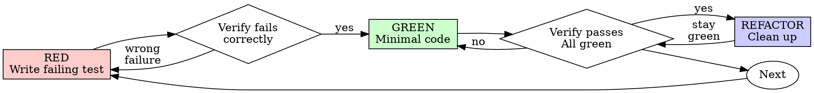

<!-- Generated by SpecStory, Markdown v2.1.0 -->

# 2026-05-08 20:18:46Z

<!-- Codex CLI Session 019e093d-416c-7d23-bc74-74e19cdaa86e (2026-05-08 20:18:46Z) -->

_**User (2026-05-08 20:18:46Z)**_

你看一下移动端codexmobile 项目里面的每个线程对话UI都出bug了，明明没有在运行底部卡片都有个正在处理的卡片，我选哪个线程 哪个线程就是这样的卡片，修复一下


---

_**Agent (gpt-5.5 2026-05-08 20:19:02Z)**_

我先按系统化调试的方式走：先确认这个“正在处理”状态是从哪条线程状态/运行状态推出来的，再动 UI 判断逻辑，避免只把卡片硬隐藏掉。也会快速看一下这个仓库之前有没有相关约定，少踩旧坑。

_**Agent (gpt-5.5 2026-05-08 20:19:02Z)**_

<tool-use data-tool-type="shell" data-tool-name="exec_command"><details>
<summary>Tool use: **exec_command** `sed -n '1,220p' '/Users/xiayanghui/.codex/plugins/cache/openai-curated/superpowers/f812c146/skills/systematic-debugging/SKILL.md'`</summary>
```
Chunk ID: ae06fc
Wall time: 0.0000 seconds
Process exited with code 0
Original token count: 1593
Output:
---
name: systematic-debugging
description: Use when encountering any bug, test failure, or unexpected behavior, before proposing fixes
---

# Systematic Debugging

## Overview

Random fixes waste time and create new bugs. Quick patches mask underlying issues.

**Core principle:** ALWAYS find root cause before attempting fixes. Symptom fixes are failure.

**Violating the letter of this process is violating the spirit of debugging.**

## The Iron Law

```
NO FIXES WITHOUT ROOT CAUSE INVESTIGATION FIRST
```

If you haven't completed Phase 1, you cannot propose fixes.

## When to Use

Use for ANY technical issue:
- Test failures
- Bugs in production
- Unexpected behavior
- Performance problems
- Build failures
- Integration issues

**Use this ESPECIALLY when:**
- Under time pressure (emergencies make guessing tempting)
- "Just one quick fix" seems obvious
- You've already tried multiple fixes
- Previous fix didn't work
- You don't fully understand the issue

**Don't skip when:**
- Issue seems simple (simple bugs have root causes too)
- You're in a hurry (rushing guarantees rework)
- Manager wants it fixed NOW (systematic is faster than thrashing)

## The Four Phases

You MUST complete each phase before proceeding to the next.

### Phase 1: Root Cause Investigation

**BEFORE attempting ANY fix:**

1. **Read Error Messages Carefully**
   - Don't skip past errors or warnings
   - They often contain the exact solution
   - Read stack traces completely
   - Note line numbers, file paths, error codes

2. **Reproduce Consistently**
   - Can you trigger it reliably?
   - What are the exact steps?
   - Does it happen every time?
   - If not reproducible → gather more data, don't guess

3. **Check Recent Changes**
   - What changed that could cause this?
   - Git diff, recent commits
   - New dependencies, config changes
   - Environmental differences

4. **Gather Evidence in Multi-Component Systems**

   **WHEN system has multiple components (CI → build → signing, API → service → database):**

   **BEFORE proposing fixes, add diagnostic instrumentation:**
   ```
   For EACH component boundary:
     - Log what data enters component
     - Log what data exits component
     - Verify environment/config propagation
     - Check state at each layer

   Run once to gather evidence showing WHERE it breaks
   THEN analyze evidence to identify failing component
   THEN investigate that specific component
   ```

   **Example (multi-layer system):**
   ```bash
   # Layer 1: Workflow
   echo "=== Secrets available in workflow: ==="
   echo "IDENTITY: ${IDENTITY:+SET}${IDENTITY:-UNSET}"

   # Layer 2: Build script
   echo "=== Env vars in build script: ==="
   env | grep IDENTITY || echo "IDENTITY not in environment"

   # Layer 3: Signing script
   echo "=== Keychain state: ==="
   security list-keychains
   security find-identity -v

   # Layer 4: Actual signing
   codesign --sign "$IDENTITY" --verbose=4 "$APP"
   ```

   **This reveals:** Which layer fails (secrets → workflow ✓, workflow → build ✗)

5. **Trace Data Flow**

   **WHEN error is deep in call stack:**

   See `root-cause-tracing.md` in this directory for the complete backward tracing technique.

   **Quick version:**
   - Where does bad value originate?
   - What called this with bad value?
   - Keep tracing up until you find the source
   - Fix at source, not at symptom

### Phase 2: Pattern Analysis

**Find the pattern before fixing:**

1. **Find Working Examples**
   - Locate similar working code in same codebase
   - What works that's similar to what's broken?

2. **Compare Against References**
   - If implementing pattern, read reference implementation COMPLETELY
   - Don't skim - read every line
   - Understand the pattern fully before applying

3. **Identify Differences**
   - What's different between working and broken?
   - List every difference, however small
   - Don't assume "that can't matter"

4. **Understand Dependencies**
   - What other components does this need?
   - What settings, config, environment?
   - What assumptions does it make?

### Phase 3: Hypothesis and Testing

**Scientific method:**

1. **Form Single Hypothesis**
   - State clearly: "I think X is the root cause because Y"
   - Write it down
   - Be specific, not vague

2. **Test Minimally**
   - Make the SMALLEST possible change to test hypothesis
   - One variable at a time
   - Don't fix multiple things at once

3. **Verify Before Continuing**
   - Did it work? Yes → Phase 4
   - Didn't work? Form NEW hypothesis
   - DON'T add more fixes on top

4. **When You Don't Know**
   - Say "I don't understand X"
   - Don't pretend to know
   - Ask for help
   - Research more

### Phase 4: Implementation

**Fix the root cause, not the symptom:**

1. **Create Failing Test Case**
   - Simplest possible reproduction
   - Automated test if possible
   - One-off test script
... (truncated)
```
</details></tool-use>

_**Agent (gpt-5.5 2026-05-08 20:19:02Z)**_

<tool-use data-tool-type="shell" data-tool-name="exec_command"><details>
<summary>Tool use: **exec_command** `rg -n "CodexMobile|正在处理|正在思考|运行|processing|thinking|thread|conversation" /Users/xiayanghui/.codex/memories/MEMORY.md`</summary>
```
Chunk ID: 8b1032
Wall time: 0.0001 seconds
Process exited with code 0
Original token count: 22069
Output:
Total output lines: 218

1:# Task Group: CodexMobile / composer 控件、线程同步、架构拆分与私网访问
3:scope: `CodexMobile` 手机端 composer 控件、`/plan` 协作模式、repo-local skill 发现、自动标题、普通对话/发送链路排障、desktop IPC fallback、draft/new-thread send、abort 状态卡片、后端保守拆分、移动端 Git 面板、macOS 自启动与 Tailscale/LAN 访问；适用于这个 repo 的 live 前后端联调、app-server 行为核验、私网访问解释和公开仓库卫生，不适用于泛化移动端产品设计。
4:applies_to: cwd=/Users/xiayanghui/编程项目/CodexMobile; reuse_rule=适合复用到这个 `CodexMobile` 仓库里与 composer、`/plan`、`/api/status`、`thread/*` app-server 能力、本地 Node 服务、README 功能口径、Git HTTP API、launchd、Tailscale/LAN origin 行为有关的任务；具体端口、running process、模型列表和代码结构都要按当前 checkout/live server 重验
6:## Task 1: 给 mobile composer 加 skill 选择，并修复“按钮无法点击”的运行态错配
10:- rollout_summaries/2026-05-05T00-12-41-rXsC-codexmobile_skill_picker_and_remove_voice_controls.md (cwd=/Users/xiayanghui/编程项目/CodexMobile, rollout_path=/Users/xiayanghui/.codex/sessions/2026/05/05/rollout-2026-05-05T08-12-41-019df57a-d854-73d1-8bec-a9d15f8453c2.jsonl, updated_at=2026-05-05T00:25:11+00:00, thread_id=019df57a-d854-73d1-8bec-a9d15f8453c2, added skill discovery and mobile picker, then proved the first disabled state came from an older live backend on port 3321)
14:- CodexMobile, skill picker, composer, /api/status, localStorage, buildCodexTurnInput, type: skill, lsof, port 3321, port 3331, readCodexSkills
20:- rollout_summaries/2026-05-05T00-12-41-rXsC-codexmobile_skill_picker_and_remove_voice_controls.md (cwd=/Users/xiayanghui/编程项目/CodexMobile, rollout_path=/Users/xiayanghui/.codex/sessions/2026/05/05/rollout-2026-05-05T08-12-41-019df57a-d854-73d1-8bec-a9d15f8453c2.jsonl, updated_at=2026-05-05T00:25:11+00:00, thread_id=019df57a-d854-73d1-8bec-a9d15f8453c2, removed the in-app voice/dialog entry points and updated docs to match the native-keyboard voice preference)
24:- CodexMobile, voice-dialog, microphone button, dialog button, VoiceDialogPanel, native keyboard voice path, README.md, npm run build, restart 3321
30:- rollout_summaries/2026-05-05T11-35-49-5GrC-codexmobile_auto_thread_title_hook_gpt_5_4_mini.md (cwd=/Users/xiayanghui/编程项目/CodexMobile, rollout_path=/Users/xiayanghui/.codex/sessions/2026/05/05/rollout-2026-05-05T19-35-49-019df7ec-42b4-7602-94d6-e06d2430e6c0.jsonl, updated_at=2026-05-05T12:01:30+00:00, thread_id=019df7ec-42b4-7602-94d6-e06d2430e6c0, traced `name`/`preview` fallback and added async auto-title writeback for new draft sessions)
34:- thread naming, preview fallback, thread/name/set, gpt-5.4-mini, auto title, session-title, draft session, sanitizeGeneratedTitle, node --test, EADDRINUSE
40:- rollout_summaries/2026-05-05T19-24-27-hq5w-codexmobile_mobile_thread_sync_and_hanging_turn_debug.md (cwd=/Users/xiayanghui/编程项目/CodexMobile, rollout_path=/Users/xiayanghui/.codex/sessions/2026/05/06/rollout-2026-05-06T03-24-27-019df999-4f02-70f1-9d0f-895fb3098ee6.jsonl, updated_at=2026-05-07T05:33:58+00:00, thread_id=019df999-4f02-70f1-9d0f-895fb3098ee6, cleaned ordinary-thread history bleed-through, clarified hide-vs-archive behavior, cleared `/Users/xiayanghui/Documents/Codex/`, and fixed normal-chat turn hangs caused by leaked lark-cli env)
44:- ordinary conversations, hidden-sessions.json, mobile-sessions.json, refreshCodexCache, Documents/Codex, activeRuns, /api/chat/abort, runCodexTurn, lark-cli, NO_PROXY, thread/archive, app-server timeout, turn/completed
50:- rollout_summaries/2026-05-05T19-18-01-iLno-codexmobile_macos_autostart_launchagent.md (cwd=/Users/xiayanghui/编程项目/CodexMobile, rollout_path=/Users/xiayanghui/.codex/sessions/2026/05/06/rollout-2026-05-06T03-18-01-019df993-6bb9-7ff2-99b2-c34ddc737c76.jsonl, updated_at=2026-05-06T12:17:56+00:00, thread_id=019df993-6bb9-7ff2-99b2-c34ddc737c76, started with a reboot-pairing skill, then replaced it with a user-level LaunchAgent that keeps port 3321 alive after reboot and crash)
54:- CodexMobile, LaunchAgent, launchctl, macOS autostart, run-server.mjs, start-server.mjs, /api/status, refreshCodexCache, port 3321, fileURLToPath, launchd, com.codexmobile.bridge
60:- rollout_summaries/2026-05-07T04-46-49-TGny-codexmobile_architecture_git_security_cleanup.md (cwd=/Users/xiayanghui/编程项目/CodexMobile, rollout_path=/Users/xiayanghui/.codex/sessions/2026/05/07/rollout-2026-05-07T12-46-49-019e00c2-88d5-78e1-bc14-ca1f0d1f1084.jsonl, updated_at=2026-05-07T17:54:56+00:00, thread_id=019e00c2-88d5-78e1-bc14-ca1f0d1f1084, explained the PWA + Node + Codex app-server chain, split backend helpers conservatively, replaced pro
... (truncated)
```
</details></tool-use>

_**Agent (gpt-5.5 2026-05-08 20:19:02Z)**_

<tool-use data-tool-type="shell" data-tool-name="exec_command"><details>
<summary>Tool use: **exec_command** `pwd && rg --files -g '!*DerivedData*' -g '!*.xcworkspace/xcuserdata/**' -g '!*.xcodeproj/xcuserdata/**' | sed -n '1,200p'`</summary>
```
Chunk ID: c1bcb4
Wall time: 0.0000 seconds
Process exited with code 0
Original token count: 1556
Output:
/Users/xiayanghui/编程项目/CodexMobile
client/src/git-panel-state.test.mjs
client/src/model-sync.test.mjs
client/src/connection-recovery.test.mjs
client/src/activity-timeline.test.mjs
client/src/git-panel-state.js
client/src/activity-model.test.mjs
client/src/turn-submission-utils.test.mjs
client/src/api.js
client/src/activity-display.js
client/src/activity-card-state.test.mjs
client/src/send-state.test.mjs
client/src/selection-persistence.test.mjs
client/src/activity-dedupe.test.mjs
client/src/session-live-refresh.js
client/src/activity-merge.test.mjs
client/src/App.jsx
client/src/main.jsx
client/src/activity-display.test.mjs
client/src/activity-timeline.js
client/src/styles/activity.css
client/src/styles/base.css
client/src/styles/panels-quota.css
client/src/styles/composer.css
client/src/styles/layout.css
client/src/styles/panels-toast.css
client/src/styles/chat.css
client/src/styles/panels-topbar.css
client/src/styles/index.css
client/src/styles/panels-docs.css
client/src/styles/panels-drawer.css
client/src/styles/theme.css
client/src/styles/panels-chat.css
client/src/styles/panels-git.css
client/src/styles/panels.css
client/src/app-state.test.mjs
client/src/composer-shortcuts.js
client/src/web-push-client.js
client/src/topbar-status.test.mjs
client/src/utils/clipboard.js
client/src/notification-events.test.mjs
client/src/notification-events.js
client/src/panels/Drawer.jsx
client/src/panels/TopBar.jsx
client/src/panels/index.js
client/src/panels/DocsPanel.jsx
client/src/panels/ToastStack.jsx
client/src/panels/ConnectionRecoveryCard.jsx
client/src/panels/GitPanel.jsx
client/src/panels/topbar-status.js
client/src/panels/useNotifications.js
client/src/composer/paste-files.js
client/src/composer/ContextStatus.jsx
client/src/composer/useQueueDrafts.js
client/src/composer/composer-options.js
client/src/composer/attachment-preview.js
client/src/composer/useComposerSelections.js
client/src/composer/Composer.jsx
client/src/composer/attachment-preview.test.mjs
client/src/composer/paste-files.test.mjs
client/src/web-push-client.test.mjs
client/src/send-state.js
client/src/chat-scroll.test.mjs
client/src/activity-merge.js
client/src/styles.css
client/src/chat/PlanMessage.jsx
client/src/chat/activity-card-state.js
client/src/chat/ChatPane.jsx
client/src/chat/MarkdownContent.jsx
client/src/chat/activity-model.js
client/src/chat/ActivityMessage.jsx
client/src/chat/activity-timeline-model.js
client/src/chat/message-identity.test.mjs
client/src/chat/ChatMessage.jsx
client/src/chat/activity-timeline-projection.js
client/src/chat/ActivityFileSummary.jsx
client/src/chat/ImagePreview.jsx
client/src/chat/message-identity.js
client/src/chat/ActivityTimeline.jsx
client/src/app/defaults.js
client/src/app/AppShell.jsx
client/src/app/useSessionLivePolling.js
client/src/app/useViewportSizing.js
client/src/app/context-status.js
client/src/app/App.jsx
client/src/app/useAppWebSocket.js
client/src/app/useTurnSubmission.js
client/src/app/selection-persistence.js
client/src/app/session-utils.js
client/src/app/PairingScreen.jsx
client/src/app/useTurnRuntime.js
client/src/app/useDocsActions.js
client/src/app/useAppBootstrap.js
client/src/app/useConnectionActions.js
client/src/app/model-sync.js
client/src/app/useSessionActions.js
client/src/app/turn-submission-utils.js
client/src/app/pwa-theme.js
client/src/app/useFileUploads.js
client/src/app/AppState.js
client/src/activity-timeline-model.test.mjs
client/src/composer-shortcuts.test.mjs
client/src/connection-recovery.js
client/src/app-websocket-events.test.mjs
client/src/activity-dedupe.js
client/src/session-live-refresh.test.mjs
client/src/chat-scroll.js
client/manifest.webmanifest
client/public/codex-icon-512.png
client/public/icon.svg
client/public/codex-icon-192.png
client/public/codexmobile-sw.js
client/public/codex-icon-180.png
client/vite.config.js
client/index.html
.env.example
skills/lark-sheets-fast/SKILL.md
skills/lark-slides-fast/SKILL.md
skills/lark-doc-fast/SKILL.md
skills/lark-drive-fast/SKILL.md
scripts/smoke.mjs
scripts/lark-cli-guard.mjs
package.json
package-lock.json
README.md
scripts/patch-codex-sdk.mjs
scripts/start-asr.mjs
scripts/start-server.mjs
scripts/system-proxy-env.mjs
scripts/install-macos-autostart.mjs
scripts/run-server.mjs
scripts/start-all.ps1
CHANGELOG.md
LICENSE
asr-service/app.py
asr-service/Dockerfile
asr-service/requirements.txt
shared/session-title.js
shared/message-identity.js
shared/session-title.test.mjs
docs/superpowers/plans/2026-05-08-desktop-ipc-state-sync.md
server/mobile-session-index.js
server/auth.test.mjs
server/session-index-builder.test.mjs
server/voice-transcriber.js
server/upload-service.test.mjs
server/codex-runner-status.test.mjs
server/git-service.test.mjs
server/desktop-activity-parser.js
server/file-search.js
server/lark-cli.js
server/voice-routes.js
server/feishu-skills.js
server/http-utils.js
server/codex-data-desktop-ac
... (truncated)
```
</details></tool-use>

_**Agent (gpt-5.5 2026-05-08 20:19:16Z)**_

记忆里这里已经有两次“处理中卡片残留”的修复记录：一次是停止后本线程残留，一次是后端 run 已没了但移动端还残留。你这次描述更像“切换任意线程都会复用同一张残留卡片”，我会重点查客户端状态是否按 `sessionId/turnId` 隔离。

_**Agent (gpt-5.5 2026-05-08 20:19:16Z)**_

<tool-use data-tool-type="shell" data-tool-name="exec_command"><details>
<summary>Tool use: **exec_command** `sed -n '1,220p' '/Users/xiayanghui/.codex/plugins/cache/openai-curated/superpowers/f812c146/skills/test-driven-development/SKILL.md'`</summary>
```
Chunk ID: 85d9a4
Wall time: 0.0000 seconds
Process exited with code 0
Original token count: 1232
Output:
---
name: test-driven-development
description: Use when implementing any feature or bugfix, before writing implementation code
---

# Test-Driven Development (TDD)

## Overview

Write the test first. Watch it fail. Write minimal code to pass.

**Core principle:** If you didn't watch the test fail, you don't know if it tests the right thing.

**Violating the letter of the rules is violating the spirit of the rules.**

## When to Use

**Always:**
- New features
- Bug fixes
- Refactoring
- Behavior changes

**Exceptions (ask your human partner):**
- Throwaway prototypes
- Generated code
- Configuration files

Thinking "skip TDD just this once"? Stop. That's rationalization.

## The Iron Law

```
NO PRODUCTION CODE WITHOUT A FAILING TEST FIRST
```

Write code before the test? Delete it. Start over.

**No exceptions:**
- Don't keep it as "reference"
- Don't "adapt" it while writing tests
- Don't look at it
- Delete means delete

Implement fresh from tests. Period.

## Red-Green-Refactor



### RED - Write Failing Test

Write one minimal test showing what should happen.

<Good>
```typescript
test('retries failed operations 3 times', async () => {
  let attempts = 0;
  const operation = () => {
    attempts++;
    if (attempts < 3) throw new Error('fail');
    return 'success';
  };

  const result = await retryOperation(operation);

  expect(result).toBe('success');
  expect(attempts).toBe(3);
});
```
Clear name, tests real behavior, one thing
</Good>

<Bad>
```typescript
test('retry works', async () => {
  const mock = jest.fn()
    .mockRejectedValueOnce(new Error())
    .mockRejectedValueOnce(new Error())
    .mockResolvedValueOnce('success');
  await retryOperation(mock);
  expect(mock).toHaveBeenCalledTimes(3);
});
```
Vague name, tests mock not code
</Bad>

**Requirements:**
- One behavior
- Clear name
- Real code (no mocks unless unavoidable)

### Verify RED - Watch It Fail

**MANDATORY. Never skip.**

```bash
npm test path/to/test.test.ts
```

Confirm:
- Test fails (not errors)
- Failure message is expected
- Fails because feature missing (not typos)

**Test passes?** You're testing existing behavior. Fix test.

**Test errors?** Fix error, re-run until it fails correctly.

### GREEN - Minimal Code

Write simplest code to pass the test.

<Good>
```typescript
async function retryOperation<T>(fn: () => Promise<T>): Promise<T> {
  for (let i = 0; i < 3; i++) {
    try {
      return await fn();
    } catch (e) {
      if (i === 2) throw e;
    }
  }
  throw new Error('unreachable');
}
```
Just enough to pass
</Good>

<Bad>
```typescript
async function retryOperation<T>(
  fn: () => Promise<T>,
  options?: {
    maxRetries?: number;
    backoff?: 'linear' | 'exponential';
    onRetry?: (attempt: number) => void;
  }
): Promise<T> {
  // YAGNI
}
```
Over-engineered
</Bad>

Don't add features, refactor other code, or "improve" beyond the test.

### Verify GREEN - Watch It Pass

**MANDATORY.**

```bash
npm test path/to/test.test.ts
```

Confirm:
- Test passes
- Other tests still pass
- Output pristine (no errors, warnings)

**Test fails?** Fix code, not test.

**Other tests fail?** Fix now.

### REFACTOR - Clean Up

After green only:
- Remove duplication
- Improve names
- Extract helpers

Keep tests green. Don't add behavior.

### Repeat

Next failing test for next feature.

## Good Tests

| Quality | Good | Bad |
|---------|------|-----|
| **Minimal** | One thing. "and" in name? Split it. | `test('validates email and domain and whitespace')` |
| **Clear** | Name describes behavior | `test('test1')` |
| **Shows intent** | Demonstrates desired API | Obscures what code should do |

## Why Order Matters

**"I'll write tests after to verify it works"**

Tests written after code pass immediately. Passing immediately proves nothing:
- Might test wrong thing
- Might test implementation, not behavior
- Might miss edge cases you forgot
- You never saw it catch the bug

Test-first forces you to see the test fail, proving it actually tests something.

**"I already manually tested all the edge cases"**

Manual testing is ad-hoc. You t
... (truncated)
```
</details></tool-use>

_**Agent (gpt-5.5 2026-05-08 20:19:16Z)**_

<tool-use data-tool-type="shell" data-tool-name="exec_command"><details>
<summary>Tool use: **exec_command** `nl -ba /Users/xiayanghui/.codex/memories/MEMORY.md | sed -n '117,166p;196,199p;228,242p'`</summary>
```
Chunk ID: 8c8767
Wall time: 0.0000 seconds
Process exited with code 0
Original token count: 2476
Output:
   117	## Task 12: 修复移动端停止线程后状态卡片仍显示“正在处理”
   118	
   119	### rollout_summary_files
   120	
   121	- rollout_summaries/2026-05-07T22-50-04-YESW-codexmobile_mobile_abort_status_card_stuck_processing.md (cwd=/Users/xiayanghui/编程项目/CodexMobile, rollout_path=/Users/xiayanghui/.codex/sessions/2026/05/08/rollout-2026-05-08T06-50-04-019e04a2-46ed-7d82-97b7-cc7f6625873e.jsonl, updated_at=2026-05-07T22:54:57+00:00, thread_id=019e04a2-46ed-7d82-97b7-cc7f6625873e, completed optimistic running activity messages immediately after abort so the status card stops synchronously)
   122	
   123	### keywords
   124	
   125	- CodexMobile, abort, status card, 正在处理, 已中止, completeLocalAbortMessages, completeActivityMessagesForTurn, useTurnSubmission, activeRuns
   126	
   127	## Task 13: 做代码库体检，并给移动端 Git 面板补上超大工作区安全门与超时
   128	
   129	### rollout_summary_files
   130	
   131	- rollout_summaries/2026-05-07T22-54-42-iRdM-codexmobile_architecture_audit_and_mobile_git_safety_fix.md (cwd=/Users/xiayanghui/编程项目/CodexMobile, rollout_path=/Users/xiayanghui/.codex/sessions/2026/05/08/rollout-2026-05-08T06-54-42-019e04a6-8612-7940-b015-e1b6d80c7bea.jsonl, updated_at=2026-05-08T02:51:46+00:00, thread_id=019e04a6-8612-7940-b015-e1b6d80c7bea, audited module clarity, then hardened mobile Git against huge dirty worktrees with explicit blocking, backend 409s, and request timeouts)
   132	
   133	### keywords
   134	
   135	- CodexMobile, git-panel-state.js, ensureMobileSafeGitAction, fileCount, filesTruncated, 5388 files, timeoutMs, 409, codex/ branch, auto sync push
   136	
   137	## Task 14: 解释当前线程为什么先走 fallback、并确认 thread rehome 不能只改 SQLite
   138	
   139	### rollout_summary_files
   140	
   141	- rollout_summaries/2026-05-08T02-32-56-k2gV-codexmobile_ipc_fallback_analysis_and_thread_project_rehome.md (cwd=/Users/xiayanghui/编程项目/CodexMobile, rollout_path=/Users/xiayanghui/.codex/sessions/2026/05/08/rollout-2026-05-08T10-32-56-019e056e-5134-76f1-9dca-896a72c7d5a1.jsonl, updated_at=2026-05-08T02:48:21+00:00, thread_id=019e056e-5134-76f1-9dca-896a72c7d5a1, verified the real IPC-vs-background conditions for the current thread, then proved session rehome still follows rollout `session_meta.cwd` even after SQLite edits)
   142	
   143	### keywords
   144	
   145	- CodexMobile, IPC, fallback, desktop-ipc, headless-local, thread owner, mobileOnly=false, refreshCodexCache, getSession, session_meta, cwd, state_5.sqlite, thread/read, projectPath, JSONL, rehome
   146	
   147	## Task 15: 重新部署 CodexMobile 本机桥接服务，并验证 3321 与 Tailscale 入口恢复
   148	
   149	### rollout_summary_files
   150	
   151	- rollout_summaries/2026-05-07T23-09-22-MZt0-codexmobile_redeploy_launchagent_3321.md (cwd=/Users/xiayanghui/编程项目/CodexMobile, rollout_path=/Users/xiayanghui/.codex/sessions/2026/05/08/rollout-2026-05-08T07-09-22-019e04b3-f43b-7721-a526-aec05a87ffda.jsonl, updated_at=2026-05-07T23:12:02+00:00, thread_id=019e04b3-f43b-7721-a526-aec05a87ffda, rebuilt the repo, reinstalled `com.codexmobile.bridge`, restored port 3321, and revalidated the Tailscale Serve endpoint after a service outage)
   152	
   153	### keywords
   154	
   155	- CodexMobile, LaunchAgent, com.codexmobile.bridge, 3321, Tailscale Serve, /api/status, npm run mac:autostart, npm run smoke, launchctl, lsof, EADDRINUSE, heap out of memory
   156	
   157	## Task 16: 当线程其实没在跑时，直接清掉移动端残留的“正在处理中”状态
   158	
   159	### rollout_summary_files
   160	
   161	- rollout_summaries/2026-05-08T04-55-00-6EMU-codexmobile_clear_stuck_mobile_processing_state.md (cwd=/Users/xiayanghui/编程项目/CodexMobile, rollout_path=/Users/xiayanghui/.codex/sessions/2026/05/08/rollout-2026-05-08T12-55-00-019e05f0-61ab-7fa3-95d3-6f324af51398.jsonl, updated_at=2026-05-08T05:03:18+00:00, thread_id=019e05f0-61ab-7fa3-95d3-6f324af51398, changed `/api/chat/abort` so a stale thread can still emit `chat-aborted` and clear the mobile UI even after the backend run is already gone)
   162	
   163	### keywords
   164	
   165	- CodexMobile, 正在处理中, stale state, chat-aborted, abortChat, abortCodexTurn, activeRuns, /api/chat/abort, turn-1778216026881-12c83f5bfc4228, scripts/run-server.mjs
   166	
   196	- when the user says “现在有个bug 移动端我已经停止线程了，状态卡片还显示正在处理，修复一下” -> for visible mobile runtime bugs, prioritize the smallest real state-plumbing fix plus live validation, not workaround advice [Task 12]
   197	- when the user says “现在这个对话放错项目了 应该改成是codexmobile里面 可以吗” -> verify which store is authoritative for thread project routing before editing; in this stack
... (truncated)
```
</details></tool-use>

_**Agent (gpt-5.5 2026-05-08 20:19:16Z)**_

<tool-use data-tool-type="shell" data-tool-name="exec_command"><details>
<summary>Tool use: **exec_command** `sed -n '1,220p' /Users/xiayanghui/.codex/memories/rollout_summaries/2026-05-08T04-55-00-6EMU-codexmobile_clear_stuck_mobile_processing_state.md`</summary>
```
Chunk ID: c657a7
Wall time: 0.0000 seconds
Process exited with code 0
Original token count: 948
Output:
thread_id: 019e05f0-61ab-7fa3-95d3-6f324af51398
updated_at: 2026-05-08T05:03:18+00:00
rollout_path: /Users/xiayanghui/.codex/sessions/2026/05/08/rollout-2026-05-08T12-55-00-019e05f0-61ab-7fa3-95d3-6f324af51398.jsonl
cwd: /Users/xiayanghui/编程项目/CodexMobile
git_branch: codex/main-with-backed-up-ui

# Directly clearing a stuck mobile "正在处理" state for a specific thread

Rollout context: In `CodexMobile` (`/Users/xiayanghui/编程项目/CodexMobile`), the user pointed at thread `019dfb7b-e911-7c33-9b2d-bf9283a6669e` and then explicitly asked to just clear the mobile-side "正在处理中" state instead of re-explaining the cause. The agent investigated the active turn/state, found `activeRuns` was empty, and treated this as a stale UI/runtime state problem rather than a live backend task.

## Task 1: Clear the stuck mobile processing state for thread `019dfb7b-e911-7c33-9b2d-bf9283a6669e`

Outcome: success

Preference signals:
- The user said: "你直接先把那个线程的移动端状态的正在处理中清理掉不就好了" -> for this kind of stale-running-state problem, the user prefers immediate state cleanup over more explanation or diagnosis.
- The user repeated that request after interrupting the previous turn -> when the fix is obvious from state, act directly rather than waiting for more discussion.

Key steps:
- The agent first verified the thread was not actually running: `/api/status` returned `activeRuns: []` while the thread still showed a pending/processing state.
- The agent then updated the server behavior so `/api/chat/abort` emits a terminal `chat-aborted` state even if the underlying `abortCodexTurn()` no longer finds an active run.
- The change was covered by a new unit test that simulates "backend run already gone, but abort still needs to clear UI state." 
- After patching, the agent restarted the actual 3321 service and explicitly sent an abort for the turn `turn-1778216026881-12c83f5bfc4228`, which returned `{"aborted":true}`.

Failures and how to do differently:
- Initial behavior only returned `false` when the backend run had already disappeared, which left the mobile UI stuck in "正在处理". Future similar cases should still emit a terminal abort state so the client can stop showing progress.
- The previous state was stale because the backend had already finished/vanished; do not infer liveness from the UI label alone. Check `/api/status` first.

Reusable knowledge:
- In this codebase, `abortChat()` is the right place to force-clear stale processing state because the client uses the resulting `chat-aborted` event to complete local runtime and UI cleanup.
- `server/chat-service.js` now records and broadcasts an aborted turn even when the active Codex run is already gone.
- The relevant verification commands succeeded after the patch: `node --test server/chat-service.test.mjs`, `node --test server/*.test.mjs`, and `npm run build`.
- The actual service was running via `scripts/run-server.mjs` on port `3321`; after restart, `/api/status` still showed `activeRuns: []` and the cleanup API call returned `{"aborted":true}`.

References:
- [1] `server/chat-service.js:529-558` — `abortChat()` now normalizes ids, calls `abortCodexTurn(...)`, then always remembers/broadcasts `{ type: 'chat-aborted', ... }` when a turn id exists.
- [2] `server/chat-service.test.mjs:82-104` — new test: `abortChat records and broadcasts an aborted turn even after the backend run is gone`.
- [3] Verification: `node --test server/chat-service.test.mjs` passed after the patch; `node --test server/*.test.mjs` passed; `npm run build` passed.
- [4] Runtime cleanup call returned `{"aborted":true}` and `/api/status` immediately showed `activeRuns: []` after the abort for `turn-1778216026881-12c83f5bfc4228`.
```
</details></tool-use>

_**Agent (gpt-5.5 2026-05-08 20:19:25Z)**_

<tool-use data-tool-type="shell" data-tool-name="exec_command"><details>
<summary>Tool use: **exec_command** `git status --short --branch`</summary>
```
Chunk ID: 334939
Wall time: 0.0000 seconds
Process exited with code 0
Original token count: 425
Output:
## main...origin/main
 M client/src/activity-model.test.mjs
 M client/src/activity-timeline-model.test.mjs
 M client/src/app-state.test.mjs
 M client/src/app/App.jsx
 M client/src/app/session-utils.js
 M client/src/app/turn-submission-utils.js
 M client/src/app/useTurnRuntime.js
 M client/src/app/useTurnSubmission.js
 M client/src/chat/ActivityMessage.jsx
 M client/src/chat/ActivityTimeline.jsx
 M client/src/chat/ChatMessage.jsx
 M client/src/chat/ChatPane.jsx
 M client/src/chat/activity-model.js
 M client/src/chat/activity-timeline-model.js
 M client/src/composer/Composer.jsx
 M client/src/panels/Drawer.jsx
 M client/src/styles/activity.css
 M client/src/styles/chat.css
 M client/src/styles/composer.css
 M client/src/turn-submission-utils.test.mjs
 M server/auth.js
 M server/chat-delivery.js
 M server/chat-request-prep.js
 M server/chat-request-prep.test.mjs
 M server/chat-service.js
 M server/chat-service.test.mjs
 M server/codex-app-server.js
 M server/codex-config.js
 M server/codex-data-desktop-activity.test.mjs
 M server/codex-data.js
 M server/codex-runner.js
 M server/desktop-activity-parser.js
 M server/desktop-ipc-client.js
 M server/desktop-thread-projector.js
 M server/index.js
 M server/session-index-builder.js
 M server/session-index-builder.test.mjs
 M server/session-message-reader.js
 M server/session-message-reader.test.mjs
?? client/src/app/model-sync.js
?? client/src/chat/PlanMessage.jsx
?? client/src/composer/attachment-preview.js
?? client/src/composer/attachment-preview.test.mjs
?? client/src/composer/paste-files.js
?? client/src/composer/paste-files.test.mjs
?? client/src/model-sync.test.mjs
?? server/auth.test.mjs
?? server/codex-config.test.mjs
```
</details></tool-use>

_**Agent (gpt-5.5 2026-05-08 20:19:25Z)**_

<tool-use data-tool-type="shell" data-tool-name="exec_command"><details>
<summary>Tool use: **exec_command** `rg -n "正在处理|正在思考|Codex 正在处理|processing|runningById|activity: 'running'|activity:\s*\"running\"|ActivityMessage|ActivityTimeline|latestActivity|status card|activity card" client/src server shared`</summary>
```
Chunk ID: 840a85
Wall time: 0.0000 seconds
Process exited with code 0
Original token count: 4192
Output:
server/chat-service.js:380:      label: '正在思考',
server/codex-runner.js:142:    turn: done ? '任务已完成' : failed ? '任务失败' : '正在处理',
server/codex-runner.js:143:    reasoning: done ? '思考完成' : '正在思考',
server/codex-runner.js:146:    command_execution: done ? '本地任务已处理' : failed ? '本地任务失败' : '正在处理本地任务',
server/codex-runner.js:160:  return labels[kind] || (done ? '已完成' : failed ? '失败' : '正在处理');
server/codex-runner.js:616:    emitStatus(emit, { sessionId, turnId, kind: 'reasoning', status: 'running', label: '正在思考' });
server/codex-runner.js:897:    emitStatus(emit, { sessionId: currentSessionId, turnId, kind: 'reasoning', status: 'running', label: '正在思考' });
server/desktop-thread-projector.js:206:function desktopActivityMessageId(turnId, segmentIndex = 0) {
server/desktop-thread-projector.js:249:  const id = desktopActivityMessageId(turnId, segmentIndex);
server/desktop-thread-projector.js:280:    content: '正在处理',
server/desktop-thread-projector.js:281:    label: '正在处理',
server/desktop-thread-projector.js:352:  const id = desktopActivityMessageId(turnId, segmentIndex);
server/desktop-thread-projector.js:360:      content: '正在处理',
server/desktop-thread-projector.js:361:      label: '正在处理',
server/desktop-thread-projector.js:388:  const item = messages.find((message) => message.id === desktopActivityMessageId(turnId, segmentIndex));
server/desktop-thread-projector.js:576:      label: desktopActivityLabel(status, { running: '正在思考', completed: '思考完成', failed: '思考中止' }),
server/codex-runner-status.test.mjs:6:  assert.equal(statusLabel('command_execution', 'running'), '正在处理本地任务');
client/src/activity-model.test.mjs:6:  completeActivityMessagesForTurn,
client/src/activity-model.test.mjs:8:  isPlaceholderActivityMessage,
client/src/activity-model.test.mjs:10:  shouldRenderActivityMessageInChat,
client/src/activity-model.test.mjs:11:  upsertActivityMessage,
client/src/activity-model.test.mjs:16:test('upsertActivityMessage keeps concrete MCP tool calls with generic status labels', () => {
client/src/activity-model.test.mjs:17:  const result = upsertActivityMessage([], {
client/src/activity-model.test.mjs:59:    label: '正在思考中',
client/src/activity-model.test.mjs:82:test('upsertActivityMessage also merges desktop activity updates by client turn id', () => {
client/src/activity-model.test.mjs:88:    label: '正在思考中'
client/src/activity-model.test.mjs:91:  const result = upsertActivityMessage(current, {
client/src/activity-model.test.mjs:109:test('completeActivityMessagesForTurn marks running activity steps completed', () => {
client/src/activity-model.test.mjs:110:  const result = completeActivityMessagesForTurn([
client/src/activity-model.test.mjs:118:        { id: 'thinking', kind: 'reasoning', label: '正在思考', status: 'running' },
client/src/activity-model.test.mjs:132:test('completeActivityMessagesForTurn keeps pending plan implementation actionable', () => {
client/src/activity-model.test.mjs:133:  const result = completeActivityMessagesForTurn([
client/src/activity-model.test.mjs:167:  assert.equal(isPlaceholderActivityMessage({
client/src/activity-model.test.mjs:172:      { id: 'thinking', kind: 'reasoning', label: '正在思考中', status: 'running' }
client/src/activity-model.test.mjs:178:  assert.equal(isPlaceholderActivityMessage({
client/src/activity-model.test.mjs:183:      { id: 'thinking', kind: 'reasoning', label: '正在思考中', status: 'running' },
client/src/activity-model.test.mjs:190:  assert.equal(shouldRenderActivityMessageInChat({
client/src/activity-model.test.mjs:204:  assert.equal(shouldRenderActivityMessageInChat({
client/src/activity-model.test.mjs:306:  assert.equal(shouldRenderActivityMessageInChat(result[1]), false);
client/src/turn-submission-utils.test.mjs:123:      content: '正在处理',
client/src/turn-submission-utils.test.mjs:124:      label: '正在处理',
client/src/turn-submission-utils.test.mjs:127:        { id: 'thinking', kind: 'reasoning', label: '正在思考中', status: 'running' }
server/chat-queue.js:73:      patch.label = '正在思考';
server/chat-queue.js:76:      patch.label = '正在思考';
client/src/panels/Drawer.jsx:84:  runningById,
client/src/panels/Drawer.jsx:111:    .filter((session) => sessionRunBadgeState(session, { runningById, threadRuntimeById, completedSessionIds }) === 'running')
client/src/panels/Drawer.jsx:236:    const badgeState = sessionRunBadgeState(session, { runningById, threadRuntimeById, completedSessionIds });
client/src/activity-display.test.mjs:6:  assert.equal(isThinkingActivityStep({ kind: 'reasoning', status: 'running', label: '正在思考' }), true);
client/src/activity-display.test.mjs:10:  assert.equal(isThinkingA
... (truncated)
```
</details></tool-use>

_**Agent (gpt-5.5 2026-05-08 20:19:25Z)**_

<tool-use data-tool-type="shell" data-tool-name="exec_command"><details>
<summary>Tool use: **exec_command** `rg -n "runningById|setRunningById|activeRuns|chat-aborted|chat-completed|completeActivityMessagesForTurn|currentRun|selectedSession|sessionId|activeSession" client/src/app client/src/chat client/src/*.js server`</summary>
```
Chunk ID: 458d22
Wall time: 0.0000 seconds
Process exited with code 0
Original token count: 15093
Output:
Total output lines: 675

client/src/activity-dedupe.js:9:  return [message.turnId, message.sessionId, message.previousSessionId]
client/src/activity-dedupe.js:19:  const keys = new Set([payload.turnId, payload.sessionId, payload.previousSessionId].filter(Boolean).map(String));
client/src/session-live-refresh.js:16:  return [message?.turnId, message?.sessionId, message?.previousSessionId].filter(Boolean).map(String);
client/src/session-live-refresh.js:112:export function desktopRunningActivityPayload(messages = [], sessionId = '', selectedRunRuntime = null) {
client/src/session-live-refresh.js:116:  const targetSessionId = String(sessionId || '');
client/src/session-live-refresh.js:138:    sessionId: runningActivity.sessionId || targetSessionId || null,
client/src/session-live-refresh.js:139:    turnId: runningActivity.turnId || selectedRunRuntime?.turnId || runningActivity.sessionId || targetSessionId || null,
client/src/session-live-refresh.js:146:function desktopCompletedActivityPayload(messages = [], sessionId = '', selectedRunRuntime = null) {
client/src/session-live-refresh.js:150:  const targetSessionId = String(sessionId || '');
client/src/session-live-refresh.js:174:    sessionId: completedActivity.sessionId || targetSessionId || null,
client/src/session-live-refresh.js:183:  sessionId = '',
client/src/session-live-refresh.js:189:  const payload = desktopRunningActivityPayload(messages, sessionId, selectedRunRuntime);
client/src/session-live-refresh.js:195:  const completedPayload = desktopCompletedActivityPayload(messages, sessionId, selectedRunRuntime);
client/src/session-live-refresh.js:199:      sessionId,
client/src/session-live-refresh.js:209:      sessionId,
client/src/session-live-refresh.js:269:  const sessionId = payload.sessionId || payload.session?.id || '';
client/src/session-live-refresh.js:271:  if (!projectId || !sessionId || !title) {
client/src/session-live-refresh.js:278:    id: sessionId,
client/src/session-live-refresh.js:289:    if (String(session?.id || '') !== String(sessionId)) {
client/src/notification-events.js:75:  if (payload.type === 'chat-aborted') {
server/chat-service.test.mjs:19:    steerCodexTurn: async () => ({ accepted: true, delivery: 'steered', sessionId: 'thread-1', turnId: 'active-turn' }),
server/chat-service.test.mjs:46:      return { accepted: true, delivery: 'steered', sessionId: 'thread-1', turnId: 'active-turn' };
server/chat-service.test.mjs:52:    sessionId: 'thread-1',
server/chat-service.test.mjs:79:      sessionId: 'thread-1',
server/chat-service.test.mjs:97:    sessionId: 'thread-1',
server/chat-service.test.mjs:105:  assert.equal(service.getTurn('client-turn-1').sessionId, 'thread-1');
server/chat-service.test.mjs:106:  assert.equal(broadcasts.at(-1).type, 'chat-aborted');
server/chat-service.test.mjs:108:  assert.equal(broadcasts.at(-1).sessionId, 'thread-1');
server/chat-service.test.mjs:156:    sessionId: 'thread-1',
server/chat-service.test.mjs:161:  assert.equal(result.sessionId, 'thread-1');
server/chat-service.test.mjs:183:    sessionId: 'thread-1',
server/chat-service.test.mjs:195:    sessionId: 'thread-1',
server/chat-service.test.mjs:227:    sessionId: 'thread-1',
server/chat-service.test.mjs:233:    sessionId: 'thread-1',
server/chat-service.test.mjs:243:  assert.equal(broadcasts.filter((payload) => payload.type === 'chat-aborted' && payload.source === 'desktop-ipc').length, 1);
server/chat-service.test.mjs:267:    sessionId: 'thread-1',
server/chat-service.test.mjs:273:    sessionId: 'thread-1',
server/chat-service.test.mjs:302:    sessionId: 'thread-1'
server/chat-service.test.mjs:307:  assert.equal(broadcasts.at(-1).type, 'chat-aborted');
server/chat-service.test.mjs:309:  assert.equal(broadcasts.at(-1).sessionId, 'thread-1');
server/chat-service.test.mjs:340:    sessionId: 'thread-1',
server/chat-service.test.mjs:389:      emit({ type: 'chat-complete', sessionId: payload.sessionId, turnId: payload.turnId });
server/chat-service.test.mjs:390:      return payload.sessionId;
server/chat-service.test.mjs:396:    sessionId: 'thread-1',
server/chat-service.test.mjs:404:  assert.equal(runPayload.sessionId, 'thread-1');
server/chat-service.test.mjs:434:      emit({ type: 'chat-complete', sessionId: payload.sessionId, turnId: payload.turnId });
server/chat-service.test.mjs:435:      return payload.sessionId;
server/chat-service.test.mjs:441:    sessionId: 'thread-1',
server/chat-service.test.mjs:452:  assert.equal(runPayload.sessionId, 'thread-1');
server/chat-service.test.mjs:488:      emit({ type: 'chat-complete', sessionId: payload.sessionId, turnId: payload.turnId });
server/chat-service.test.mjs:489:      return payload.sessionId;
server/chat-service.test.mjs:495:    sessionId: 'thread-1',
server/chat-service.test.mjs:524:      emit({ type: 'thread-started', sessionId: 'background-thread-1', previousSessionId: payload.draftSessionI
... (truncated)
```
</details></tool-use>

---

_**User (2026-05-08 20:19:25Z)**_

应该是所有的项目里的线程都出这个问题了，对话里的没问题


---

_**Agent (gpt-5.5 2026-05-08 20:19:37Z)**_

补充这句很关键：项目里的线程都有，普通“对话”没问题。这样根因大概率不是发送链路，而是项目线程读取出来的 `runtime/activity` 被当成了“正在运行”，或者选中项目线程时把历史 activity 投影成了当前运行态。

_**Agent (gpt-5.5 2026-05-08 20:19:37Z)**_

<tool-use data-tool-type="shell" data-tool-name="exec_command"><details>
<summary>Tool use: **exec_command** `nl -ba client/src/app/App.jsx | sed -n '1,240p;500,620p'`</summary>
```
Chunk ID: ecdaa1
Wall time: 0.0000 seconds
Process exited with code 0
Original token count: 3825
Output:
     1	import { useCallback, useEffect, useMemo, useReducer, useRef, useState } from 'react';
     2	import { apiFetch, getToken } from '../api.js';
     3	import { DEFAULT_PERMISSION_MODE } from '../composer/Composer.jsx';
     4	import { useComposerSelections } from '../composer/useComposerSelections.js';
     5	import { useQueueDrafts } from '../composer/useQueueDrafts.js';
     6	import { connectionRecoveryState } from '../connection-recovery.js';
     7	import { normalizeContextStatus } from './context-status.js';
     8	import { DEFAULT_REASONING_EFFORT, DEFAULT_STATUS, REASONING_DEFAULT_VERSION } from './defaults.js';
     9	import { appReducer, createInitialUiState, THEME_KEY } from './AppState.js';
    10	import { useNotifications } from '../panels/useNotifications.js';
    11	import { useAppBootstrap } from './useAppBootstrap.js';
    12	import { useConnectionActions } from './useConnectionActions.js';
    13	import { useDocsActions } from './useDocsActions.js';
    14	import { useFileUploads } from './useFileUploads.js';
    15	import { useAppWebSocket } from './useAppWebSocket.js';
    16	import { useSessionLivePolling } from './useSessionLivePolling.js';
    17	import { useSessionActions } from './useSessionActions.js';
    18	import { useTurnSubmission } from './useTurnSubmission.js';
    19	import { useTurnRuntime } from './useTurnRuntime.js';
    20	import { useViewportSizing } from './useViewportSizing.js';
    21	import { applyPwaTheme } from './pwa-theme.js';
    22	import { nextSyncedComposerSettings } from './model-sync.js';
    23	import { rememberSelectedSession } from './selection-persistence.js';
    24	import {
    25	  buildComposerRunStatus,
    26	  emptyContextStatus,
    27	  hasRunningKey,
    28	  isDraftSession,
    29	  reconcileThreadRuntimeWithSessions,
    30	  runningByIdWithSelectedActivity,
    31	  selectedRunKeys,
    32	  selectedSessionIsRunning,
    33	  upsertSessionInProject
    34	} from './session-utils.js';
    35	import { AppShell } from './AppShell.jsx';
    36	import PairingScreen from './PairingScreen.jsx';
    37	
    38	export default function App() {
    39	  const [status, setStatus] = useState(DEFAULT_STATUS);
    40	  const [contextStatus, setContextStatus] = useState(() => normalizeContextStatus(DEFAULT_STATUS.context));
    41	  const [authenticated, setAuthenticated] = useState(Boolean(getToken()));
    42	  const [uiState, dispatchUi] = useReducer(appReducer, undefined, () => createInitialUiState());
    43	  const setDrawerOpen = useCallback((value) => dispatchUi({ type: 'ui/drawerOpen', value }), []);
    44	  const setPreviewImage = useCallback((value) => dispatchUi({ type: 'ui/previewImage', value }), []);
    45	  const setDocsOpen = useCallback((value) => dispatchUi({ type: 'ui/docsOpen', value }), []);
    46	  const setDocsBusy = useCallback((value) => dispatchUi({ type: 'ui/docsBusy', value }), []);
    47	  const setDocsError = useCallback((value) => dispatchUi({ type: 'ui/docsError', value }), []);
    48	  const setGitPanel = useCallback((value) => dispatchUi({ type: 'ui/gitPanel', value }), []);
    49	  const setTheme = useCallback((value) => dispatchUi({ type: 'ui/theme', value }), []);
    50	  const { drawerOpen, previewImage, docsOpen, docsBusy, docsError, gitPanel, theme } = uiState;
    51	  const {
    52	    toasts,
    53	    notificationSupported,
    54	    notificationEnabled,
    55	    dismissToast,
    56	    showToast,
    57	    notifyFromPayload,
    58	    enableNotifications
    59	  } = useNotifications();
    60	  const [projects, setProjects] = useState([]);
    61	  const [selectedProject, setSelectedProject] = useState(null);
    62	  const [expandedProjectIds, setExpandedProjectIds] = useState({});
    63	  const [sessionsByProject, setSessionsByProject] = useState({});
    64	  const [loadingProjectId, setLoadingProjectId] = useState(null);
    65	  const [selectedSession, setSelectedSession] = useState(null);
    66	  const [messages, setMessages] = useState([]);
    67	  const [sessionLoadingId, setSessionLoadingId] = useState(null);
    68	  const [sessionLoadError, setSessionLoadError] = useState('');
    69	  const [activityClockNow, setActivityClockNow] = useState(() => Date.now());
    70	  const [completedSessionIds, setCompletedSessionIds] = useState({});
    71	  const [input, setInput] = useState('');
    72	  const [attachments, setAttachments] = useState([]);
    73	  const [uploading, setUploading] = useState(false);
    74	  const [permissionMode, setPermissionMode] = useState(DEFAULT_PERMISSION_MODE);
    75	  const [selectedModel, setSelectedModel] = useState(DEFAULT_STATUS.model);
    76	  const [selectedReasoningEffort, setSelectedReasoningEffort] = useState(() => {
    77	    const defaultVersion = localStorage.getItem('codexmobile.reasoningDefaultVersion');
    78	    if (default
... (truncated)
```
</details></tool-use>

_**Agent (gpt-5.5 2026-05-08 20:19:37Z)**_

<tool-use data-tool-type="shell" data-tool-name="exec_command"><details>
<summary>Tool use: **exec_command** `nl -ba client/src/app/session-utils.js | sed -n '280,560p'`</summary>
```
Chunk ID: ee86ec
Wall time: 0.0000 seconds
Process exited with code 0
Original token count: 2940
Output:
   280	  return provisionalSessionTitle(message);
   281	}
   282	
   283	export function autoTitlePatch(title, phase = 'provisional') {
   284	  return title ? { title, titleLocked: false, titleAutoGenerated: phase } : {};
   285	}
   286	
   287	export function payloadRunKeys(payload) {
   288	  return [payload?.turnId, payload?.clientTurnId, payload?.sessionId, payload?.previousSessionId].filter(Boolean);
   289	}
   290	
   291	export function selectedRunKeys(session) {
   292	  return [session?.id, session?.turnId].filter(Boolean);
   293	}
   294	
   295	export function upsertSessionInProject(current, projectId, session, replaceId = null) {
   296	  if (!projectId || !session) {
   297	    return current;
   298	  }
   299	  const existing = current[projectId] || [];
   300	  const filtered = existing.filter((item) => item.id !== session.id && (!replaceId || item.id !== replaceId));
   301	  return {
   302	    ...current,
   303	    [projectId]: [session, ...filtered]
   304	  };
   305	}
   306	
   307	export function hasRunningKey(runningById, keys) {
   308	  return keys.some((key) => Boolean(runningById[key]));
   309	}
   310	
   311	export function sessionRunKeys(session) {
   312	  return [session?.id, session?.turnId, session?.previousSessionId].filter(Boolean);
   313	}
   314	
   315	export function isExternalThreadRuntimeSource(value) {
   316	  return ['desktop-thread', 'desktop-ipc', 'headless-local'].includes(String(value || ''));
   317	}
   318	
   319	export function isExternalThreadRuntime(runtime) {
   320	  return runtime?.status === 'running' && isExternalThreadRuntimeSource(runtime?.source);
   321	}
   322	
   323	export function shouldClearRuntimeWhenNoActiveRuns(runtime) {
   324	  return runtime?.status === 'running' && !isExternalThreadRuntime(runtime);
   325	}
   326	
   327	export function externalThreadRuntimeById(threadRuntimeById = {}) {
   328	  const next = {};
   329	  for (const [key, runtime] of Object.entries(threadRuntimeById || {})) {
   330	    if (isExternalThreadRuntime(runtime)) {
   331	      next[key] = runtime;
   332	    }
   333	  }
   334	  return next;
   335	}
   336	
   337	function allProjectSessions(sessionsByProject = {}) {
   338	  return Object.values(sessionsByProject || {}).flatMap((sessions) =>
   339	    Array.isArray(sessions) ? sessions : []
   340	  );
   341	}
   342	
   343	function runtimeFromSession(session) {
   344	  if (!session?.id || session.runtime?.status !== 'running') {
   345	    return null;
   346	  }
   347	  return {
   348	    ...session.runtime,
   349	    status: 'running',
   350	    source: session.runtime.source || 'desktop-thread',
   351	    sessionId: session.runtime.sessionId || session.id,
   352	    turnId: session.runtime.turnId || session.turnId || null,
   353	    updatedAt: session.runtime.updatedAt || session.updatedAt || null,
   354	    steerable: session.runtime.steerable === true
   355	  };
   356	}
   357	
   358	export function reconcileThreadRuntimeWithSessions(threadRuntimeById = {}, sessionsByProject = {}) {
   359	  const sessions = allProjectSessions(sessionsByProject);
   360	  if (!sessions.length) {
   361	    return threadRuntimeById || {};
   362	  }
   363	
   364	  const loadedSessionIds = new Set(sessions.map((session) => session?.id).filter(Boolean));
   365	  const next = { ...(threadRuntimeById || {}) };
   366	  for (const [key, runtime] of Object.entries(next)) {
   367	    const sessionId = runtime?.sessionId || (loadedSessionIds.has(key) ? key : '');
   368	    if (sessionId && loadedSessionIds.has(sessionId) && isExternalThreadRuntime(runtime)) {
   369	      delete next[key];
   370	    }
   371	  }
   372	
   373	  for (const session of sessions) {
   374	    const runtime = runtimeFromSession(session);
   375	    if (!runtime) {
   376	      continue;
   377	    }
   378	    for (const key of [session.id, runtime.turnId].filter(Boolean)) {
   379	      next[key] = runtime;
   380	    }
   381	  }
   382	
   383	  return next;
   384	}
   385	
   386	export function runningByIdWithSelectedActivity(runningById = {}, selectedSession = null, hasRunningActivity = false) {
   387	  if (!hasRunningActivity || !selectedSession?.id) {
   388	    return runningById || {};
   389	  }
   390	  const next = { ...(runningById || {}) };
   391	  for (const key of sessionRunKeys(selectedSession)) {
   392	    next[key] = true;
   393	  }
   394	  return next;
   395	}
   396	
   397	export function sessionRunBadgeState(session, {
   398	  runningById = {},
   399	  threadRuntimeById = {},
   400	  completedSessionIds = {}
   401	} = {}) {
   402	  if (!session?.id) {
   403	    return null;
   404	  }
   405	  const keys = sessionRunKeys(session);
   406	  const runtimes = [
   407	    session.runtime,
   408	    ...keys.map((key) => threadRuntimeById?.[key])
   409	  ].filter(Boolea
... (truncated)
```
</details></tool-use>

_**Agent (gpt-5.5 2026-05-08 20:19:38Z)**_

<tool-use data-tool-type="shell" data-tool-name="exec_command"><details>
<summary>Tool use: **exec_command** `nl -ba client/src/chat/activity-model.js | sed -n '460,760p'`</summary>
```
Chunk ID: efe427
Wall time: 0.0000 seconds
Process exited with code 0
Original token count: 3441
Output:
   460	  }
   461	  if (step.kind === 'plan_implementation' && step.planImplementation?.completed) {
   462	    return false;
   463	  }
   464	  if (isThinkingActivityStep(step)) {
   465	    return true;
   466	  }
   467	  const label = String(step.label || '').trim();
   468	  const hasWorkDetail =
   469	    Boolean(step.command || step.detail || step.output || step.error || step.toolName) ||
   470	    (Array.isArray(step.fileChanges) && step.fileChanges.length > 0);
   471	  const workKinds = new Set([
   472	    'command_execution',
   473	    'file_change',
   474	    'mcp_tool_call',
   475	    'dynamic_tool_call',
   476	    'web_search',
   477	    'image_generation_call',
   478	    'plan',
   479	    'plan_implementation',
   480	    'context_compaction',
   481	    'subagent_activity'
   482	  ]);
   483	  if (isGenericActivityLabel(label) && !hasWorkDetail && !workKinds.has(step.kind)) {
   484	    return false;
   485	  }
   486	  if (
   487	    ['reasoning', 'message', 'agent_message'].includes(step.kind) &&
   488	    /^(正在思考中?|正在处理|正在回复|正在整理回复)$/.test(label)
   489	  ) {
   490	    return false;
   491	  }
   492	  if (step.kind === 'function_call_output' && messageStatus !== 'failed' && step.status !== 'failed') {
   493	    return false;
   494	  }
   495	  if (messageStatus !== 'failed' && /blocked by policy|rejected/i.test(`${step.detail || ''}\n${step.output || ''}\n${step.error || ''}`)) {
   496	    return false;
   497	  }
   498	  return true;
   499	}
   500	
   501	export function isPlaceholderActivityMessage(message) {
   502	  if (message?.role !== 'activity' || message.status === 'failed') {
   503	    return false;
   504	  }
   505	  const activities = Array.isArray(message.activities) ? message.activities : [];
   506	  if (!activities.length) {
   507	    return false;
   508	  }
   509	  return !activities.some((activity) => {
   510	    if (isThinkingActivityStep(activity)) {
   511	      return false;
   512	    }
   513	    return isVisibleActivityStep(activity, message.status);
   514	  });
   515	}
   516	
   517	export function shouldRenderActivityMessageInChat(message) {
   518	  if (message?.role !== 'activity') {
   519	    return true;
   520	  }
   521	  if (
   522	    message?.transient &&
   523	    message?.source === 'local-handoff' &&
   524	    String(message?.status || '') !== 'failed'
   525	  ) {
   526	    return false;
   527	  }
   528	  return !isPlaceholderActivityMessage(message);
   529	}
   530	
   531	export function completeActivityMessagesForTurn(current, payload) {
   532	  const keys = new Set(payloadRunKeys(payload));
   533	  if (!keys.size) {
   534	    return current;
   535	  }
   536	  const finalText = normalizeActivityDuplicateText(payload.content || payload.label || '');
   537	  const completedAt = payload.completedAt || payload.timestamp || new Date().toISOString();
   538	  return current.map((message) => {
   539	    if (message.role !== 'activity' || !payloadRunKeys(message).some((key) => keys.has(key))) {
   540	      return message;
   541	    }
   542	    const activities =
   543	      finalText && Array.isArray(message.activities)
   544	        ? message.activities.filter((activity) => {
   545	          if (!['agent_message', 'message'].includes(activity?.kind)) {
   546	            return true;
   547	          }
   548	          return normalizeActivityDuplicateText(activity.label || activity.content || activity.detail) !== finalText;
   549	        })
   550	        : message.activities;
   551	    const completedActivities = Array.isArray(activities)
   552	      ? activities.map((activity) =>
   553	        activity?.kind === 'plan_implementation' &&
   554	        activity.planImplementation &&
   555	        !activity.planImplementation.completed
   556	          ? activity
   557	          : ['running', 'queued'].includes(String(activity?.status || ''))
   558	          ? { ...activity, status: 'completed' }
   559	          : activity
   560	      )
   561	      : activities;
   562	    return {
   563	      ...message,
   564	      status: message.status === 'failed' ? 'failed' : 'completed',
   565	      label: message.status === 'failed' ? message.label : '过程已同步',
   566	      content: message.status === 'failed' ? message.content : '过程已同步',
   567	      startedAt: message.startedAt || payload.startedAt || message.timestamp || null,
   568	      completedAt: message.completedAt || completedAt,
   569	      durationMs: message.durationMs || payload.durationMs || null,
   570	      activities: completedActivities
   571	    };
   572	  });
   573	}
   574	
   575	export function normalizeActivityDuplicateText(value) {
   576	  return String(value || '').replace(/\s+/g, ' ').trim();
   577	}
   578	
   579	export function messageMatchesRun(messa
... (truncated)
```
</details></tool-use>

_**Agent (gpt-5.5 2026-05-08 20:19:38Z)**_

<tool-use data-tool-type="shell" data-tool-name="exec_command"><details>
<summary>Tool use: **exec_command** `nl -ba client/src/app/useSessionLivePolling.js | sed -n '1,180p'`</summary>
```
Chunk ID: eff566
Wall time: 0.0000 seconds
Process exited with code 0
Original token count: 1054
Output:
     1	import { useEffect } from 'react';
     2	import { apiFetch } from '../api.js';
     3	import {
     4	  messageStreamSignature
     5	} from '../chat/activity-model.js';
     6	import {
     7	  mergeLiveSelectedThreadMessages,
     8	  shouldPollSelectedSessionMessages,
     9	  syncDesktopActivityRuntimeFromMessages
    10	} from '../session-live-refresh.js';
    11	import { mergeContextStatus } from './context-status.js';
    12	import {
    13	  hasRunningKey,
    14	  isDraftSession,
    15	  selectedRunKeys,
    16	  sessionMessagesApiPath
    17	} from './session-utils.js';
    18	
    19	export function useSessionLivePolling({
    20	  authenticated,
    21	  selectedSession,
    22	  hasRunningActivity,
    23	  running,
    24	  desktopBridge,
    25	  threadRuntimeById,
    26	  defaultStatus,
    27	  sessionLivePollRef,
    28	  selectedSessionRef,
    29	  runningByIdRef,
    30	  messagesRef,
    31	  markRun,
    32	  clearRun,
    33	  markSessionCompleteNotice,
    34	  setContextStatus,
    35	  setMessages
    36	}) {
    37	  useEffect(() => {
    38	    if (!authenticated || !selectedSession?.id || isDraftSession(selectedSession)) {
    39	      return undefined;
    40	    }
    41	
    42	    const sessionId = selectedSession.id;
    43	    let stopped = false;
    44	    async function pollSelectedSession() {
    45	      if (stopped || sessionLivePollRef.current) {
    46	        return;
    47	      }
    48	      const hasSelectedRunning = hasRunningKey(
    49	        runningByIdRef.current || {},
    50	        selectedRunKeys(selectedSessionRef.current || selectedSession)
    51	      );
    52	      const selectedRunRuntime = selectedRunKeys(selectedSessionRef.current || selectedSession)
    53	        .map((key) => threadRuntimeById?.[key])
    54	        .find(Boolean) || null;
    55	      const hasDesktopThreadRuntime =
    56	        selectedSessionRef.current?.runtime?.status === 'running' ||
    57	        selectedSession.runtime?.status === 'running' ||
    58	        selectedRunRuntime?.source === 'desktop-thread' ||
    59	        selectedRunRuntime?.source === 'desktop-ipc' ||
    60	        selectedRunRuntime?.source === 'headless-local';
    61	      const hasExternalThreadRefresh = Boolean(hasDesktopThreadRuntime);
    62	      if (!shouldPollSelectedSessionMessages({
    63	        hasSelectedRunning,
    64	        desktopBridge,
    65	        hasExternalThreadRefresh
    66	      })) {
    67	        return;
    68	      }
    69	      sessionLivePollRef.current = true;
    70	      try {
    71	        const data = await apiFetch(sessionMessagesApiPath(sessionId));
    72	        if (!stopped && selectedSessionRef.current?.id === sessionId && Array.isArray(data.messages)) {
    73	          syncDesktopActivityRuntimeFromMessages({
    74	            messages: data.messages,
    75	            sessionId,
    76	            selectedRunRuntime,
    77	            markRun,
    78	            clearRun,
    79	            markSessionCompleteNotice
    80	          });
    81	          setContextStatus((current) => mergeContextStatus(current, data.context || defaultStatus.context, defaultStatus.context));
    82	          setMessages((current) =>
    83	            messageStreamSignature(current) === messageStreamSignature(data.messages)
    84	              ? current
    85	              : mergeLiveSelectedThreadMessages(current, data.messages)
    86	          );
    87	        }
    88	      } catch {
    89	        // Keep the currently rendered conversation if a transient poll fails.
    90	      } finally {
    91	        sessionLivePollRef.current = false;
    92	      }
    93	    }
    94	
    95	    const intervalMs = hasRunningActivity || running ? 700 : 1600;
    96	    const timer = window.setInterval(pollSelectedSession, intervalMs);
    97	    pollSelectedSession();
    98	    return () => {
    99	      stopped = true;
   100	      window.clearInterval(timer);
   101	    };
   102	  }, [
   103	    authenticated,
   104	    selectedSession?.id,
   105	    hasRunningActivity,
   106	    running,
   107	    desktopBridge,
   108	    threadRuntimeById
   109	  ]);
   110	}
```
</details></tool-use>

_**Agent (gpt-5.5 2026-05-08 20:19:50Z)**_

<tool-use data-tool-type="shell" data-tool-name="exec_command"><details>
<summary>Tool use: **exec_command** `nl -ba client/src/session-live-refresh.js | sed -n '1,330p'`</summary>
```
Chunk ID: 1d1300
Wall time: 0.0000 seconds
Process exited with code 0
Original token count: 3122
Output:
     1	import { sameUserMessageContent } from './chat/message-identity.js';
     2	
     3	function normalizeText(value) {
     4	  return String(value || '').replace(/\s+/g, ' ').trim();
     5	}
     6	
     7	function isPendingLocalMessage(message) {
     8	  const id = String(message?.id || '');
     9	  if (id.startsWith('local-')) {
    10	    return true;
    11	  }
    12	  return message?.role === 'activity' && ['running', 'queued'].includes(String(message?.status || ''));
    13	}
    14	
    15	function messageRunKeys(message) {
    16	  return [message?.turnId, message?.sessionId, message?.previousSessionId].filter(Boolean).map(String);
    17	}
    18	
    19	function isRunningStatus(value) {
    20	  return ['running', 'queued'].includes(String(value || ''));
    21	}
    22	
    23	function isTransientActivityMessage(message) {
    24	  return message?.role === 'activity' && Boolean(message?.transient);
    25	}
    26	
    27	function loadedHasAssistantForActivity(loaded, activity) {
    28	  const keys = new Set(messageRunKeys(activity));
    29	  if (!keys.size) {
    30	    return false;
    31	  }
    32	  return loaded.some((item) => item?.role === 'assistant' && messageMatchesRunKeys(item, keys) && normalizeText(item.content));
    33	}
    34	
    35	function isDesktopRuntimeSource(value) {
    36	  return value === 'desktop-thread' || value === 'desktop-ipc' || value === 'headless-local';
    37	}
    38	
    39	function messageMatchesRunKeys(message, keys) {
    40	  if (!keys.size) {
    41	    return false;
    42	  }
    43	  return messageRunKeys(message).some((key) => keys.has(key));
    44	}
    45	
    46	function completeLocalActivityMessage(message, loaded = []) {
    47	  const keys = new Set(messageRunKeys(message));
    48	  const assistant = loaded.find((item) => item?.role === 'assistant' && messageMatchesRunKeys(item, keys) && normalizeText(item.content));
    49	  if (!assistant && !['running', 'queued'].includes(String(message?.status || ''))) {
    50	    return message;
    51	  }
    52	  return {
    53	    ...message,
    54	    status: message.status === 'failed' ? 'failed' : 'completed',
    55	    label: message.status === 'failed' ? message.label : '过程已同步',
    56	    content: message.status === 'failed' ? message.content : '过程已同步',
    57	    completedAt: message.completedAt || assistant?.timestamp || new Date().toISOString(),
    58	    activities: Array.isArray(message.activities)
    59	      ? message.activities.map((activity) =>
    60	        ['running', 'queued'].includes(String(activity?.status || ''))
    61	          ? { ...activity, status: 'completed' }
    62	          : activity
    63	      )
    64	      : message.activities
    65	  };
    66	}
    67	
    68	function activityInsertIndex(loaded, activity) {
    69	  const keys = new Set(messageRunKeys(activity));
    70	  const index = loaded.findIndex((message) => message?.role === 'assistant' && messageMatchesRunKeys(message, keys));
    71	  return index >= 0 ? index : loaded.length;
    72	}
    73	
    74	function preserveLocalActivityMessages(current = [], loaded = []) {
    75	  const loadedIds = new Set(loaded.map((message) => String(message?.id || '')).filter(Boolean));
    76	  const preserved = current
    77	    .filter((message) => message?.role === 'activity' && !loadedIds.has(String(message?.id || '')))
    78	    .filter((message) => {
    79	      const keys = new Set(messageRunKeys(message));
    80	      if (!keys.size) {
    81	        return false;
    82	      }
    83	      if (loaded.some((item) => item?.role === 'activity' && messageMatchesRunKeys(item, keys))) {
    84	        return false;
    85	      }
    86	      if (isTransientActivityMessage(message) && loadedHasAssistantForActivity(loaded, message)) {
    87	        return false;
    88	      }
    89	      return loaded.some((item) => messageMatchesRunKeys(item, keys)) || ['running', 'queued'].includes(String(message?.status || ''));
    90	    })
    91	    .map((message) =>
    92	      isTransientActivityMessage(message)
    93	        ? message
    94	        : completeLocalActivityMessage(message, loaded)
    95	    );
    96	
    97	  if (!preserved.length) {
    98	    return loaded;
    99	  }
   100	
   101	  const result = [...loaded];
   102	  for (const activity of preserved.sort((a, b) => activityInsertIndex(result, a) - activityInsertIndex(result, b))) {
   103	    result.splice(activityInsertIndex(result, activity), 0, activity);
   104	  }
   105	  return result;
   106	}
   107	
   108	function desktopBridgeUsesExternalThreadRefresh(bridge = null) {
   109	  return Boolean(bridge?.connected && ['desktop-ipc', 'headless-local'].includes(bridge?.mode));
   110	}
   111	
   112	export function desktopRunningActivityPayload(messages = [], sessionId = '', selectedRunRunt
... (truncated)
```
</details></tool-use>

_**Agent (gpt-5.5 2026-05-08 20:19:50Z)**_

<tool-use data-tool-type="shell" data-tool-name="exec_command"><details>
<summary>Tool use: **exec_command** `nl -ba client/src/session-live-refresh.test.mjs | sed -n '1,230p'`</summary>
```
Chunk ID: 0ec80a
Wall time: 0.0001 seconds
Process exited with code 0
Original token count: 2610
Output:
     1	import assert from 'node:assert/strict';
     2	import test from 'node:test';
     3	import {
     4	  applySessionRenameToProjectSessions,
     5	  desktopRunningActivityPayload,
     6	  mergeLiveSelectedThreadMessages,
     7	  shouldPollSelectedSessionMessages,
     8	  syncDesktopActivityRuntimeFromMessages
     9	} from './session-live-refresh.js';
    10	
    11	test('shouldPollSelectedSessionMessages keeps normal running sessions protected', () => {
    12	  assert.equal(
    13	    shouldPollSelectedSessionMessages({
    14	      hasSelectedRunning: true,
    15	      desktopBridge: { connected: true, mode: 'desktop-proxy' }
    16	    }),
    17	    false
    18	  );
    19	});
    20	
    21	test('shouldPollSelectedSessionMessages allows desktop-ipc running sessions to refresh', () => {
    22	  assert.equal(
    23	    shouldPollSelectedSessionMessages({
    24	      hasSelectedRunning: true,
    25	      desktopBridge: { connected: true, mode: 'desktop-ipc' },
    26	      hasExternalThreadRefresh: true
    27	    }),
    28	    true
    29	  );
    30	});
    31	
    32	test('shouldPollSelectedSessionMessages allows headless fallback sessions to refresh like external threads', () => {
    33	  assert.equal(
    34	    shouldPollSelectedSessionMessages({
    35	      hasSelectedRunning: true,
    36	      desktopBridge: { connected: true, mode: 'desktop-ipc' },
    37	      hasExternalThreadRefresh: true
    38	    }),
    39	    true
    40	  );
    41	  assert.equal(
    42	    shouldPollSelectedSessionMessages({
    43	      hasSelectedRunning: true,
    44	      desktopBridge: { connected: true, mode: 'headless-local' },
    45	      hasExternalThreadRefresh: true
    46	    }),
    47	    true
    48	  );
    49	});
    50	
    51	test('shouldPollSelectedSessionMessages protects local streaming runs when desktop-ipc is only a global bridge', () => {
    52	  assert.equal(
    53	    shouldPollSelectedSessionMessages({
    54	      hasSelectedRunning: true,
    55	      desktopBridge: { connected: true, mode: 'desktop-ipc' },
    56	      hasExternalThreadRefresh: false
    57	    }),
    58	    false
    59	  );
    60	});
    61	
    62	test('mergeLiveSelectedThreadMessages preserves local pending send until desktop thread contains it', () => {
    63	  const current = [
    64	    { id: 'old-user', role: 'user', content: '之前的问题', timestamp: '2026-05-07T06:00:00.000Z' },
    65	    { id: 'old-assistant', role: 'assistant', content: '之前的回答', timestamp: '2026-05-07T06:00:01.000Z' },
    66	    { id: 'local-1', role: 'user', content: '手机刚发的新消息', timestamp: '2026-05-07T06:01:00.000Z' },
    67	    { id: 'status-1', role: 'activity', status: 'running', content: '已交给桌面端处理', timestamp: '2026-05-07T06:01:00.000Z' }
    68	  ];
    69	  const loaded = current.slice(0, 2);
    70	
    71	  const merged = mergeLiveSelectedThreadMessages(current, loaded);
    72	
    73	  assert.deepEqual(merged.map((message) => message.id), ['old-user', 'old-assistant', 'local-1', 'status-1']);
    74	});
    75	
    76	test('mergeLiveSelectedThreadMessages switches to desktop messages once the desktop thread catches up', () => {
    77	  const current = [
    78	    { id: 'old-user', role: 'user', content: '之前的问题', timestamp: '2026-05-07T06:00:00.000Z' },
    79	    { id: 'local-1', role: 'user', content: '手机刚发的新消息', timestamp: '2026-05-07T06:01:00.000Z' },
    80	    { id: 'status-1', role: 'activity', status: 'running', content: '已交给桌面端处理', timestamp: '2026-05-07T06:01:00.000Z' }
    81	  ];
    82	  const loaded = [
    83	    { id: 'old-user', role: 'user', content: '之前的问题', timestamp: '2026-05-07T06:00:00.000Z' },
    84	    { id: 'desktop-user', role: 'user', content: '手机刚发的新消息', timestamp: '2026-05-07T06:01:00.000Z' },
    85	    { id: 'desktop-activity', role: 'activity', status: 'running', content: '正在处理本地任务', timestamp: '2026-05-07T06:01:01.000Z' }
    86	  ];
    87	
    88	  const merged = mergeLiveSelectedThreadMessages(current, loaded);
    89	
    90	  assert.deepEqual(merged.map((message) => message.id), ['old-user', 'desktop-user', 'desktop-activity']);
    91	});
    92	
    93	test('mergeLiveSelectedThreadMessages keeps transient handoff running until real output catches up', () => {
    94	  const current = [
    95	    { id: 'local-1', role: 'user', content: '手机新建线程', timestamp: '2026-05-07T06:01:00.000Z', turnId: 'turn-1' },
    96	    {
    97	      id: 'status-turn-1',
    98	      role: 'activity',
    99	      status: 'running',
   100	      transient: true,
   101	      label: '后台启动中',
   102	      content: '后台启动中',
   103	      timestamp: '2026-05-07T06:01:00.000Z',
   104	      turnId: 'turn-1',
   105	      act
... (truncated)
```
</details></tool-use>

_**Agent (gpt-5.5 2026-05-08 20:19:50Z)**_

<tool-use data-tool-type="shell" data-tool-name="exec_command"><details>
<summary>Tool use: **exec_command** `nl -ba client/src/app-state.test.mjs | sed -n '110,220p'`</summary>
```
Chunk ID: c08f9d
Wall time: 0.0000 seconds
Process exited with code 0
Original token count: 1087
Output:
   110	  };
   111	  const preserved = externalThreadRuntimeById({
   112	    'desktop-thread-1': desktopRuntime,
   113	    'mobile-turn-1': { status: 'running', source: 'codexmobile' },
   114	    'completed-thread': { status: 'completed', source: 'desktop-thread' }
   115	  });
   116	
   117	  assert.deepEqual(Object.keys(preserved), ['desktop-thread-1']);
   118	  assert.equal(preserved['desktop-thread-1'], desktopRuntime);
   119	});
   120	
   121	test('selected desktop activity counts as running for composer controls', () => {
   122	  assert.equal(selectedSessionIsRunning({
   123	    running: false,
   124	    hasRunningActivity: true
   125	  }), true);
   126	  assert.equal(selectedSessionIsRunning({
   127	    running: false,
   128	    hasRunningActivity: false
   129	  }), false);
   130	});
   131	
   132	test('selected running activity marks the matching sidebar session as running', () => {
   133	  const runningById = runningByIdWithSelectedActivity(
   134	    {},
   135	    { id: 'thread-1', turnId: 'turn-1' },
   136	    true
   137	  );
   138	
   139	  assert.equal(runningById['thread-1'], true);
   140	  assert.equal(runningById['turn-1'], true);
   141	  assert.equal(
   142	    sessionRunBadgeState(
   143	      { id: 'thread-1', turnId: 'turn-1' },
   144	      { runningById }
   145	    ),
   146	    'running'
   147	  );
   148	});
   149	
   150	test('desktop ipc active runs expose both app and client turn ids', () => {
   151	  assert.deepEqual(
   152	    payloadRunKeys({
   153	      source: 'desktop-ipc',
   154	      turnId: 'desktop-turn-1',
   155	      clientTurnId: 'client-turn-1',
   156	      sessionId: 'thread-1',
   157	      previousSessionId: 'thread-1'
   158	    }),
   159	    ['desktop-turn-1', 'client-turn-1', 'thread-1', 'thread-1']
   160	  );
   161	});
   162	
   163	test('new conversation project resolution prefers explicit drawer choice', () => {
   164	  const normal = { id: '__codexmobile_projectless__', projectless: true, name: '普通对话' };
   165	  const codexMobile = { id: 'project-codexmobile', name: 'CodexMobile' };
   166	  const selected = { id: 'project-other', name: 'Other' };
   167	
   168	  assert.equal(resolveNewConversationProject(codexMobile, selected, [normal, codexMobile]), codexMobile);
   169	  assert.equal(resolveNewConversationProject(null, null, [normal, codexMobile]), normal);
   170	});
   171	
   172	test('draft sessions preserve the chosen conversation scope', () => {
   173	  const normal = { id: '__codexmobile_projectless__', projectless: true, name: '普通对话' };
   174	  const draft = createDraftSession(normal);
   175	
   176	  assert.equal(draft.projectId, normal.id);
   177	  assert.equal(draft.draft, true);
   178	  assert.match(draft.id, /^draft-__codexmobile_projectless__-/);
   179	});
   180	
   181	test('titleFromFirstMessage uses the shared provisional title helper', () => {
   182	  assert.equal(titleFromFirstMessage('帮我看一下移动端新对话逻辑'), '移动端新对话逻辑');
   183	});
   184	
   185	test('sessionRunBadgeState prefers explicit running runtime', () => {
   186	  const session = {
   187	    id: 'thread-1',
   188	    runtime: { status: 'running', turnId: 'turn-1', updatedAt: '2026-05-08T02:00:00.000Z' }
   189	  };
   190	
   191	  assert.equal(sessionRunBadgeState(session), 'running');
   192	});
   193	
   194	test('sessionRunBadgeState reads active runs by session id', () => {
   195	  const session = { id: 'thread-2' };
   196	
   197	  assert.equal(
   198	    sessionRunBadgeState(session, { runningById: { 'thread-2': true } }),
   199	    'running'
   200	  );
   201	});
   202	
   203	test('session runtime reconciliation keeps multiple desktop threads running in the sidebar', () => {
   204	  const runtimeById = reconcileThreadRuntimeWithSessions({}, {
   205	    projectA: [
   206	      {
   207	        id: 'thread-1',
   208	        runtime: {
   209	          status: 'running',
   210	          source: 'desktop-thread',
   211	          turnId: 'turn-1',
   212	          updatedAt: '2026-05-08T02:00:00.000Z'
   213	        }
   214	      },
   215	      {
   216	        id: 'thread-2',
   217	        runtime: {
   218	          status: 'running',
   219	          source: 'desktop-thread',
   220	          turnId: 'turn-2',
```
</details></tool-use>

_**Agent (gpt-5.5 2026-05-08 20:19:50Z)**_

<tool-use data-tool-type="shell" data-tool-name="exec_command"><details>
<summary>Tool use: **exec_command** `nl -ba client/src/activity-card-state.test.mjs | sed -n '1,180p'`</summary>
```
Chunk ID: 98ac26
Wall time: 0.0000 seconds
Process exited with code 0
Original token count: 135
Output:
     1	import assert from 'node:assert/strict';
     2	import test from 'node:test';
     3	import { activityCardShouldOpen } from './chat/activity-card-state.js';
     4	
     5	test('activity card opens only while a visible process is running', () => {
     6	  assert.equal(activityCardShouldOpen({ running: true, hasProcess: true }), true);
     7	  assert.equal(activityCardShouldOpen({ running: false, hasProcess: true }), false);
     8	  assert.equal(activityCardShouldOpen({ running: true, hasProcess: false }), false);
     9	});
```
</details></tool-use>

_**Agent (gpt-5.5 2026-05-08 20:19:58Z)**_

<tool-use data-tool-type="shell" data-tool-name="exec_command"><details>
<summary>Tool use: **exec_command** `nl -ba client/src/session-live-refresh.test.mjs | sed -n '224,360p'`</summary>
```
Chunk ID: 3646f4
Wall time: 0.0000 seconds
Process exited with code 0
Original token count: 1341
Output:
   224	test('desktopRunningActivityPayload ignores non-desktop and terminal activity messages', () => {
   225	  assert.equal(
   226	    desktopRunningActivityPayload([
   227	      { role: 'activity', kind: 'turn', status: 'running', sessionId: 'thread-1', turnId: 'turn-1' },
   228	      { role: 'activity', kind: 'desktop', status: 'completed', sessionId: 'thread-1', turnId: 'turn-2' }
   229	    ], 'thread-1'),
   230	    null
   231	  );
   232	});
   233	
   234	test('syncDesktopActivityRuntimeFromMessages marks and clears selected desktop-thread runtime', () => {
   235	  const calls = [];
   236	  assert.equal(
   237	    syncDesktopActivityRuntimeFromMessages({
   238	      messages: [
   239	        { role: 'activity', kind: 'desktop', status: 'running', sessionId: 'thread-1', turnId: 'turn-1' }
   240	      ],
   241	      sessionId: 'thread-1',
   242	      markRun: (payload) => calls.push(['mark', payload]),
   243	      clearRun: (payload) => calls.push(['clear', payload])
   244	    }),
   245	    'marked'
   246	  );
   247	  assert.equal(calls[0][0], 'mark');
   248	  assert.equal(calls[0][1].source, 'desktop-thread');
   249	
   250	  assert.equal(
   251	    syncDesktopActivityRuntimeFromMessages({
   252	      messages: [
   253	        { role: 'activity', kind: 'desktop', status: 'completed', sessionId: 'thread-1', turnId: 'turn-1' }
   254	      ],
   255	      sessionId: 'thread-1',
   256	      selectedRunRuntime: { status: 'running', source: 'desktop-thread', turnId: 'turn-1' },
   257	      markRun: (payload) => calls.push(['mark', payload]),
   258	      clearRun: (payload) => calls.push(['clear', payload])
   259	    }),
   260	    'completed'
   261	  );
   262	  assert.deepEqual(calls[1], ['clear', {
   263	    source: 'desktop-thread',
   264	    sessionId: 'thread-1',
   265	    turnId: 'turn-1'
   266	  }]);
   267	});
   268	
   269	test('syncDesktopActivityRuntimeFromMessages marks completion after selected desktop-thread runtime finishes', () => {
   270	  const calls = [];
   271	  assert.equal(
   272	    syncDesktopActivityRuntimeFromMessages({
   273	      messages: [
   274	        {
   275	          role: 'activity',
   276	          kind: 'desktop',
   277	          status: 'completed',
   278	          sessionId: 'thread-1',
   279	          turnId: 'turn-1',
   280	          completedAt: '2026-05-08T07:02:00.000Z',
   281	          timestamp: '2026-05-08T07:02:00.000Z'
   282	        }
   283	      ],
   284	      sessionId: 'thread-1',
   285	      selectedRunRuntime: { status: 'running', source: 'desktop-thread', turnId: 'turn-1' },
   286	      clearRun: (payload) => calls.push(['clear', payload]),
   287	      markSessionCompleteNotice: (payload) => calls.push(['complete', payload])
   288	    }),
   289	    'completed'
   290	  );
   291	
   292	  assert.deepEqual(calls, [
   293	    ['clear', {
   294	      source: 'desktop-thread',
   295	      sessionId: 'thread-1',
   296	      turnId: 'turn-1'
   297	    }],
   298	    ['complete', {
   299	      source: 'desktop-thread',
   300	      sessionId: 'thread-1',
   301	      turnId: 'turn-1',
   302	      completedAt: '2026-05-08T07:02:00.000Z',
   303	      timestamp: '2026-05-08T07:02:00.000Z'
   304	    }]
   305	  ]);
   306	});
   307	
   308	test('syncDesktopActivityRuntimeFromMessages treats desktop-ipc runtime as desktop thread state', () => {
   309	  const calls = [];
   310	  assert.equal(
   311	    syncDesktopActivityRuntimeFromMessages({
   312	      messages: [
   313	        {
   314	          role: 'activity',
   315	          kind: 'desktop',
   316	          status: 'completed',
   317	          sessionId: 'thread-1',
   318	          turnId: 'desktop-turn-1',
   319	          completedAt: '2026-05-08T07:03:00.000Z',
   320	          timestamp: '2026-05-08T07:03:00.000Z'
   321	        }
   322	      ],
   323	      sessionId: 'thread-1',
   324	      selectedRunRuntime: {
   325	        status: 'running',
   326	        source: 'desktop-ipc',
   327	        turnId: 'desktop-turn-1'
   328	      },
   329	      clearRun: (payload) => calls.push(['clear', payload]),
   330	      markSessionCompleteNotice: (payload) => calls.push(['complete', payload])
   331	    }),
   332	    'completed'
   333	  );
   334	
   335	  assert.equal(calls[0][0], 'clear');
   336	  assert.equal(calls[1][0], 'complete');
   337	  assert.equal(calls[1][1].source, 'desktop-ipc');
   338	});
   339	
   340	test('syncDesktopActivityRuntimeFromMessages clears desktop-ipc runtime when thread no longer has running activity', () => {
   341	  const calls = [];
   342	  assert.equal(
   343	    syncDesktopActivityRuntimeFromMessages({
   344	      messages: [
   345	        { role: 'user', sessionId: 'thread-1', turnId: 'desktop-turn-1', content: '手机发起' },
   346	        { role: 'assistant', sessionId: 'thread
... (truncated)
```
</details></tool-use>

_**Agent (gpt-5.5 2026-05-08 20:19:58Z)**_

<tool-use data-tool-type="shell" data-tool-name="exec_command"><details>
<summary>Tool use: **exec_command** `nl -ba client/src/chat/activity-card-state.js | sed -n '1,160p'`</summary>
```
Chunk ID: 6b64f3
Wall time: 0.0000 seconds
Process exited with code 0
Original token count: 33
Output:
     1	export function activityCardShouldOpen({ running, hasProcess }) {
     2	  return Boolean(running && hasProcess);
     3	}
```
</details></tool-use>

_**Agent (gpt-5.5 2026-05-08 20:19:58Z)**_

<tool-use data-tool-type="shell" data-tool-name="exec_command"><details>
<summary>Tool use: **exec_command** `nl -ba client/src/composer/Composer.jsx | sed -n '380,480p'`</summary>
```
Chunk ID: 8964e1
Wall time: 0.0000 seconds
Process exited with code 0
Original token count: 1317
Output:
   380	                  <strong>{command.title}</strong>
   381	                  <small>{command.aliases.join(' ')}</small>
   382	                </span>
   383	              </button>
   384	            ))
   385	          ) : null}
   386	          {composerToken.type === 'skill' ? (
   387	            tokenSkillMatches.length ? tokenSkillMatches.map((skill) => (
   388	              <button key={skill.path} type="button" onClick={() => selectTokenSkill(skill)}>
   389	                {selectedSkillSet.has(skill.path) ? <Check size={16} /> : <Bot size={16} />}
   390	                <span>
   391	                  <strong>{skill.label || skill.name}</strong>
   392	                  {skill.description ? <small>{skill.description}</small> : null}
   393	                </span>
   394	              </button>
   395	            )) : <div className="menu-empty">{skillList.length ? '没有匹配的 skill' : 'skill 列表还没加载'}</div>
   396	          ) : null}
   397	          {composerToken.type === 'file' ? (
   398	            fileSearch.loading ? (
   399	              <div className="menu-empty"><Loader2 className="spin" size={15} /> 正在搜索文件</div>
   400	            ) : fileSearch.results.length ? fileSearch.results.map((file) => (
   401	              <button key={file.path} type="button" onClick={() => selectTokenFile(file)}>
   402	                <FileText size={16} />
   403	                <span>
   404	                  <strong>{file.name}</strong>
   405	                  <small>{file.relativePath}</small>
   406	                </span>
   407	              </button>
   408	            )) : <div className="menu-empty">没有匹配的文件</div>
   409	          ) : null}
   410	        </div>
   411	      ) : null}
   412	      {queueDrafts?.length ? (
   413	        <div className="queued-drafts-panel" aria-label="排队消息">
   414	          {queueDrafts.map((draft) => (
   415	            <div key={draft.id} className="queued-draft-row">
   416	              <MessageSquarePlus size={15} />
   417	              <button type="button" className="queued-draft-text" onClick={() => onRestoreQueueDraft(draft.id)}>
   418	                <strong>{draft.text || '请查看附件。'}</strong>
   419	                <small>{draft.selectedSkills?.length ? `${draft.selectedSkills.length} skills` : '排队中'}</small>
   420	              </button>
   421	              <div className="queued-draft-actions">
   422	                <button type="button" onClick={() => onSteerQueueDraft(draft.id)} aria-label="立即发送到当前任务">
   423	                  <MessageSquare size={14} />
   424	                </button>
   425	                <button type="button" onClick={() => onRemoveQueueDraft(draft.id)} aria-label="删除排队消息">
   426	                  <Trash2 size={14} />
   427	                </button>
   428	              </div>
   429	            </div>
   430	          ))}
   431	        </div>
   432	      ) : null}
   433	      {runStatus ? (
   434	        <div className="composer-run-status is-running" role="status" aria-live="polite">
   435	          <span className="composer-run-dot" />
   436	          <span className="composer-run-main">
   437	            <strong>Codex 正在处理</strong>
   438	            <small>{runStatus.label}</small>
   439	          </span>
   440	          {runStatus.duration ? <span className="composer-run-time">{runStatus.duration}</span> : null}
   441	        </div>
   442	      ) : null}
   443	      {!sendState.disabled || sendState.mode !== 'unavailable' ? null : (
   444	        <div className="composer-run-status is-warning" role="status" aria-live="polite">
   445	          <span className="composer-run-dot" />
   446	          <span className="composer-run-main">
   447	            <strong>桌面端 Codex 未连接</strong>
   448	            <small>{desktopBridge?.reason || '打开桌面端 Codex，或配置同源 app-server control socket 后再发送'}</small>
   449	          </span>
   450	        </div>
   451	      )}
   452	      {openMenu === 'send-mode' ? (
   453	        <div className="composer-menu send-mode-menu">
   454	          <button
   455	            type="button"
   456	            disabled={!sendState.canSteer}
   457	            onClick={() => {
   458	              if (!sendState.canSteer) {
   459	                return;
   460	              }
   461	              onSubmit({ mode: 'steer' });
   462	              setOpenMenu(null);
   463	            }}
   464	          >
   465	            <MessageSquare size={16} />
   466	            <span>
   467	              <strong>发送到当前任务</strong>
   468	              <small>{sendState.canSteer ? '直接补充给桌面端正在执行的任务' : '当前任务暂时不能接收补充消息'}</small>
   469	            </span>
   470	 
... (truncated)
```
</details></tool-use>

_**Agent (gpt-5.5 2026-05-08 20:19:58Z)**_

<tool-use data-tool-type="shell" data-tool-name="exec_command"><details>
<summary>Tool use: **exec_command** `nl -ba server/desktop-thread-projector.js | sed -n '240,380p;680,820p'`</summary>
```
Chunk ID: e61b66
Wall time: 0.0000 seconds
Process exited with code 0
Original token count: 3058
Output:
   240	    }
   241	  }
   242	  return lastTurnIndex >= 0 ? lastTurnIndex + 1 : messages.length;
   243	}
   244	
   245	export function upsertDesktopActivity(messages, turnId, activity, segmentIndex = 0) {
   246	  if (!activity) {
   247	    return;
   248	  }
   249	  const id = desktopActivityMessageId(turnId, segmentIndex);
   250	  const existing = messages.find((message) => message.id === id);
   251	  if (existing) {
   252	    const current = Array.isArray(existing.activities) ? existing.activities : [];
   253	    if (activity.kind === 'context_compaction' && current.some((item) => item.kind === 'context_compaction')) {
   254	      return;
   255	    }
   256	    const activityIndex = current.findIndex((item) => item.id === activity.id);
   257	    if (activityIndex >= 0) {
   258	      const nextActivities = [...current];
   259	      const previous = nextActivities[activityIndex];
   260	      nextActivities[activityIndex] = {
   261	        ...activity,
   262	        ...previous,
   263	        timestamp: activity.timestamp || previous.timestamp,
   264	        sequence: Number.isFinite(Number(activity.sequence)) ? activity.sequence : previous.sequence,
   265	        status: activity.status || previous.status,
   266	        label: previous.label || activity.label
   267	      };
   268	      existing.activities = nextActivities;
   269	    } else {
   270	      existing.activities = [...current, activity];
   271	    }
   272	    existing.timestamp = activity.timestamp || existing.timestamp;
   273	    return;
   274	  }
   275	  const nextMessage = {
   276	    id,
   277	    role: 'activity',
   278	    turnId,
   279	    segmentIndex,
   280	    content: '正在处理',
   281	    label: '正在处理',
   282	    kind: 'desktop',
   283	    status: 'running',
   284	    timestamp: activity.timestamp || new Date().toISOString(),
   285	    startedAt: activity.startedAt || activity.timestamp || null,
   286	    activities: [activity]
   287	  };
   288	  messages.splice(findDesktopActivityInsertIndex(messages, turnId, segmentIndex), 0, nextMessage);
   289	}
   290	
   291	export function removeFallbackActivitiesCoveredByRaw(messages, rawActivities) {
   292	  const covered = new Map();
   293	  for (const item of rawActivities || []) {
   294	    const turnId = item?.turnId;
   295	    const kind = item?.activity?.kind;
   296	    if (!turnId || !kind || kind === 'file_change') {
   297	      continue;
   298	    }
   299	    if (!covered.has(turnId)) {
   300	      covered.set(turnId, new Set());
   301	    }
   302	    covered.get(turnId).add(kind);
   303	  }
   304	  if (!covered.size) {
   305	    return;
   306	  }
   307	  for (const message of messages) {
   308	    if (message?.role !== 'activity' || !covered.has(message.turnId) || !Array.isArray(message.activities)) {
   309	      continue;
   310	    }
   311	    const kinds = covered.get(message.turnId);
   312	    message.activities = message.activities.filter((activity) => {
   313	      if (!kinds.has(activity?.kind)) {
   314	        return true;
   315	      }
   316	      return String(activity?.id || '').includes('-raw-');
   317	    });
   318	  }
   319	}
   320	
   321	function activityOrderValue(activity) {
   322	  const sequence = Number(activity?.sequence);
   323	  if (Number.isFinite(sequence)) {
   324	    return sequence;
   325	  }
   326	  const timestamp = Date.parse(activity?.timestamp || '');
   327	  return Number.isFinite(timestamp) ? timestamp : Number.POSITIVE_INFINITY;
   328	}
   329	
   330	export function sortDesktopActivitySteps(messages) {
   331	  for (const message of messages) {
   332	    if (message?.role !== 'activity' || !Array.isArray(message.activities)) {
   333	      continue;
   334	    }
   335	    message.activities = [...message.activities].sort((a, b) => activityOrderValue(a) - activityOrderValue(b));
   336	  }
   337	}
   338	
   339	function normalizedActivityText(value) {
   340	  return String(value || '').replace(/\s+/g, ' ').trim();
   341	}
   342	
   343	function isoFromEpochSeconds(value) {
   344	  const seconds = Number(value);
   345	  if (!Number.isFinite(seconds) || seconds <= 0) {
   346	    return null;
   347	  }
   348	  return new Date(seconds * 1000).toISOString();
   349	}
   350	
   351	function completeDesktopActivity(messages, turnId, finalContent = '', metadata = {}, status = 'completed', segmentIndex = 0) {
   352	  const id = desktopActivityMessageId(turnId, segmentIndex);
   353	  let item = messages.find((message) => message.id === id);
   354	  if (!item) {
   355	    item = {
   356	      id,
   357	      role: 'activity',
   358	      turnId,
   359	      segmentIndex,
   360	      content: '正在处理',
   361	      label: '正在处理',
   362	      kind: 'desktop',
   363	      status: 'running',
   364	      timestamp: metadata.comple
... (truncated)
```
</details></tool-use>

_**Agent (gpt-5.5 2026-05-08 20:20:06Z)**_

<tool-use data-tool-type="shell" data-tool-name="exec_command"><details>
<summary>Tool use: **exec_command** `nl -ba server/desktop-thread-projector.js | sed -n '1,120p;380,680p;820,900p'`</summary>
```
Chunk ID: a62e9c
Wall time: 0.0000 seconds
Process exited with code 0
Original token count: 4103
Output:
     1	import crypto from 'node:crypto';
     2	import fsSync from 'node:fs';
     3	import path from 'node:path';
     4	import { imageMarkdownFromCodexImageGeneration } from './codex-native-images.js';
     5	import { statusLabel } from './codex-runner.js';
     6	
     7	const DESKTOP_IMAGE_ROOT = path.join(process.cwd(), '.codexmobile', 'desktop-images');
     8	const INTERNAL_PROMPT_MARKERS = [
     9	  'CodexMobile iOS/PWA 回复要求：',
    10	  'CodexMobile 已接入飞书官方 lark-cli。',
    11	  'CodexMobile 已接入飞书官方 lark-cli'
    12	];
    13	const IMPLEMENT_PLAN_PROMPT_PREFIX = 'PLEASE IMPLEMENT THIS PLAN:';
    14	const IMPLEMENT_PLAN_REQUEST_PREFIX = 'implement-plan:';
    15	const GUIDED_USER_LABEL = '已引导对话';
    16	
    17	function guidedUserMetadata(enabled) {
    18	  return enabled
    19	    ? {
    20	      guided: true,
    21	      guideLabel: GUIDED_USER_LABEL,
    22	      kind: 'guided_user'
    23	    }
    24	    : {};
    25	}
    26	
    27	function normalizedPlanText(value) {
    28	  return String(value || '').replace(/\s+/g, ' ').trim();
    29	}
    30	
    31	export function implementedPlanContentFromMessage(message) {
    32	  const value = String(message || '').trim();
    33	  if (!value.startsWith(IMPLEMENT_PLAN_PROMPT_PREFIX)) {
    34	    return '';
    35	  }
    36	  return value.slice(IMPLEMENT_PLAN_PROMPT_PREFIX.length).trim();
    37	}
    38	
    39	function hasImplementedPlanContent(implementedPlanContents, content) {
    40	  return implementedPlanContents.has(normalizedPlanText(content));
    41	}
    42	
    43	export function sanitizeVisibleUserMessage(message) {
    44	  const value = String(message || '').trim();
    45	  if (!value) {
    46	    return '';
    47	  }
    48	  if (value.startsWith(IMPLEMENT_PLAN_PROMPT_PREFIX)) {
    49	    return '执行计划';
    50	  }
    51	  let cutAt = value.length;
    52	  for (const marker of INTERNAL_PROMPT_MARKERS) {
    53	    const index = value.indexOf(marker);
    54	    if (index > 0) {
    55	      cutAt = Math.min(cutAt, index);
    56	    }
    57	  }
    58	  return value.slice(0, cutAt).trim() || value;
    59	}
    60	
    61	export function extractProposedPlanContent(message) {
    62	  const value = String(message || '').trim();
    63	  if (!value) {
    64	    return '';
    65	  }
    66	  const match = value.match(/<proposed_plan\b[^>]*>([\s\S]*?)<\/proposed_plan>/i);
    67	  return match ? String(match[1] || '').trim() : '';
    68	}
    69	
    70	export function planTitleFromContent(content) {
    71	  const lines = String(content || '')
    72	    .split(/\r?\n/)
    73	    .map((line) => line.trim())
    74	    .filter(Boolean);
    75	  const heading = lines
    76	    .map((line) => line.match(/^#{1,6}\s+(.+)$/)?.[1]?.trim())
    77	    .find(Boolean);
    78	  if (heading) {
    79	    return heading.replace(/[*_`]/g, '').trim() || '计划';
    80	  }
    81	  const plainLead = lines.find((line) => !/^[-*+]\s+/.test(line) && !/^\d+[.)]\s+/.test(line));
    82	  if (plainLead && plainLead.length <= 60) {
    83	    return plainLead.replace(/[*_`#]/g, '').trim() || '计划';
    84	  }
    85	  return '计划';
    86	}
    87	
    88	export function planMessageFromContent({ id, content, timestamp, turnId, sessionId }) {
    89	  const planContent = String(content || '').trim();
    90	  if (!planContent) {
    91	    return null;
    92	  }
    93	  return {
    94	    id,
    95	    role: 'plan',
    96	    content: planContent,
    97	    title: planTitleFromContent(planContent),
    98	    timestamp,
    99	    turnId,
   100	    sessionId
   101	  };
   102	}
   103	
   104	export function planRequestMessageFromContent({
   105	  id,
   106	  requestId,
   107	  content,
   108	  timestamp,
   109	  turnId,
   110	  sessionId,
   111	  completed = false
   112	}) {
   113	  const planContent = String(content || '').trim();
   114	  if (!planContent) {
   115	    return null;
   116	  }
   117	  const requestTurnId = String(turnId || '').trim();
   118	  return {
   119	    id,
   120	    role: 'plan_request',
   380	  item.label = status === 'failed' ? '过程已中止' : '过程已同步';
   381	  item.content = item.label;
   382	  item.startedAt = metadata.startedAt || item.startedAt || null;
   383	  item.completedAt = metadata.completedAt || item.completedAt || null;
   384	  item.durationMs = metadata.durationMs || item.durationMs || null;
   385	}
   386	
   387	function completeExistingDesktopActivity(messages, turnId, finalContent = '', metadata = {}, status = 'completed', segmentIndex = 0) {
   388	  const item = messages.find((message) => message.id === desktopActivityMessageId(turnId, segmentIndex));
   389	  if (!item || item.status !== 'running') {
   390	    return;
   391	  }
   392	  completeDesktopActivity(messages, turnId, fi
... (truncated)
```
</details></tool-use>

_**Agent (gpt-5.5 2026-05-08 20:20:06Z)**_

<tool-use data-tool-type="shell" data-tool-name="exec_command"><details>
<summary>Tool use: **exec_command** `rg -n "function desktopTurnRuntimeStatus|desktopTurnRuntimeStatus|completedAt|status === 'running'|includeActivity" server/desktop-thread-projector.js server/session-message-reader.js server/session-index-builder.js`</summary>
```
Chunk ID: 9fede5
Wall time: 0.0000 seconds
Process exited with code 0
Original token count: 502
Output:
server/desktop-thread-projector.js:364:      timestamp: metadata.completedAt || new Date().toISOString(),
server/desktop-thread-projector.js:383:  item.completedAt = metadata.completedAt || item.completedAt || null;
server/desktop-thread-projector.js:475:function desktopTurnRuntimeStatus(turn, { isLatestTurn = false } = {}) {
server/desktop-thread-projector.js:480:  if (value === 'interrupted' && !turn?.completedAt && isLatestTurn && !hasFinalDesktopAssistantMessage(turn)) {
server/desktop-thread-projector.js:486:  if (turn?.completedAt) {
server/desktop-thread-projector.js:504:  if (status === 'running') {
server/desktop-thread-projector.js:675:export function messagesFromDesktopThread(thread, { includeActivity = false } = {}) {
server/desktop-thread-projector.js:683:    const turnStatus = desktopTurnRuntimeStatus(turn, { isLatestTurn: turnIndex === turns.length - 1 });
server/desktop-thread-projector.js:684:    const completedAt = isoFromEpochSeconds(turn.completedAt) || (turnStatus === 'running' ? null : startedAt);
server/desktop-thread-projector.js:694:      if (!includeActivity || segmentIndex < 0) {
server/desktop-thread-projector.js:699:        completedAt: metadata.completedAt || completedAt || startedAt,
server/desktop-thread-projector.js:706:      const timestamp = item.type === 'agentMessage' ? completedAt || startedAt : startedAt;
server/desktop-thread-projector.js:708:        completeCurrentSegment('completed', { completedAt: timestamp });
server/desktop-thread-projector.js:749:      if (includeActivity) {
server/desktop-thread-projector.js:814:    if (includeActivity && turnStatus !== 'running') {
server/desktop-thread-projector.js:817:        completedAt: completedAt || startedAt,
server/session-message-reader.js:503:    { limit = 120, offset = null, latest = true, includeActivity = false } = {}
server/session-message-reader.js:510:      : messagesFromDesktopThread(thread, { includeActivity });
server/session-message-reader.js:511:    if (includeActivity) {
```
</details></tool-use>

_**Agent (gpt-5.5 2026-05-08 20:20:06Z)**_

<tool-use data-tool-type="shell" data-tool-name="exec_command"><details>
<summary>Tool use: **exec_command** `nl -ba server/desktop-thread-projector.test.mjs 2>/dev/null | sed -n '1,260p' || true`</summary>
```
Chunk ID: 8ae756
Wall time: 0.0000 seconds
Process exited with code 0
Original token count: 0
Output:
```
</details></tool-use>

_**Agent (gpt-5.5 2026-05-08 20:20:06Z)**_

<tool-use data-tool-type="shell" data-tool-name="exec_command"><details>
<summary>Tool use: **exec_command** `rg -n "desktop-thread-projector|readDesktopThread|includeActivity|runtime|publicRuntimeState" server/*.test.mjs client/src/*.test.mjs`</summary>
```
Chunk ID: 53fa4f
Wall time: 0.0000 seconds
Process exited with code 0
Original token count: 1701
Output:
server/codex-data-desktop-activity.test.mjs:4:import { upsertDesktopActivity } from './desktop-thread-projector.js';
server/codex-data-desktop-activity.test.mjs:25:  }, { includeActivity: true });
server/codex-data-desktop-activity.test.mjs:56:  }, { includeActivity: true });
server/codex-data-desktop-activity.test.mjs:91:  }, { includeActivity: true });
server/codex-data-desktop-activity.test.mjs:187:  }, { includeActivity: true });
server/codex-data-desktop-activity.test.mjs:220:  }, { includeActivity: true });
server/codex-data-desktop-activity.test.mjs:247:  }, { includeActivity: true });
server/codex-data-desktop-activity.test.mjs:311:  }, { includeActivity: true });
server/session-index-builder.test.mjs:173:    readDesktopThread: async (sessionId, options) => {
server/session-index-builder.test.mjs:196:test('session index builder exposes desktop runtime from rollout state', async () => {
server/session-index-builder.test.mjs:197:  const projectA = '/tmp/codexmobile-project-runtime';
server/session-index-builder.test.mjs:217:      runtime: {
server/session-index-builder.test.mjs:233:  assert.equal(session.runtime.status, 'running');
server/session-index-builder.test.mjs:234:  assert.equal(session.runtime.sessionId, 'thread-running');
server/session-index-builder.test.mjs:235:  assert.equal(session.runtime.turnId, 'turn-running');
server/desktop-turn-monitor.test.mjs:57:      assert.equal(options.includeActivity, false);
server/session-message-reader.test.mjs:41:      readDesktopThread: async (sessionId, options) => {
server/session-message-reader.test.mjs:69:test('rollout context state exposes running desktop runtime until task completion', async () => {
server/session-message-reader.test.mjs:70:  const dir = await fs.mkdtemp(path.join(os.tmpdir(), 'codexmobile-runtime-state-'));
server/session-message-reader.test.mjs:94:    assert.equal(running.runtime.status, 'running');
server/session-message-reader.test.mjs:95:    assert.equal(running.runtime.source, 'desktop-thread');
server/session-message-reader.test.mjs:96:    assert.equal(running.runtime.sessionId, 'session-1');
server/session-message-reader.test.mjs:97:    assert.equal(running.runtime.turnId, 'turn-1');
server/session-message-reader.test.mjs:110:    assert.equal(completed.runtime, null);
server/session-message-reader.test.mjs:123:    readDesktopThread: async () => ({
server/session-message-reader.test.mjs:127:      calls.push(['messagesFromDesktopThread', options.includeActivity]);
server/session-message-reader.test.mjs:150:  const withoutActivity = await reader.readSessionMessages('session-1', { includeActivity: false });
server/session-message-reader.test.mjs:155:  const withActivity = await reader.readSessionMessages('session-1', { includeActivity: true });
server/session-message-reader.test.mjs:172:    readDesktopThread: async () => ({
server/session-message-reader.test.mjs:188:  await reader.readSessionMessages('session-1', { includeActivity: true });
server/session-message-reader.test.mjs:196:    readDesktopThread: async () => ({
server/session-message-reader.test.mjs:262:  const result = await reader.readSessionMessages('session-1', { includeActivity: true });
server/session-message-reader.test.mjs:308:      readDesktopThread: async () => {
server/session-message-reader.test.mjs:490:      readDesktopThread: async () => ({ thread: { id: 'session-1', turns: [] } }),
client/src/app-state.test.mjs:19:import { runtimeKeysForPayload } from './app/useTurnRuntime.js';
client/src/app-state.test.mjs:104:test('activeRuns status merge can preserve external desktop runtimes beside mobile runs', () => {
client/src/app-state.test.mjs:185:test('sessionRunBadgeState prefers explicit running runtime', () => {
client/src/app-state.test.mjs:188:    runtime: { status: 'running', turnId: 'turn-1', updatedAt: '2026-05-08T02:00:00.000Z' }
client/src/app-state.test.mjs:203:test('session runtime reconciliation keeps multiple desktop threads running in the sidebar', () => {
client/src/app-state.test.mjs:204:  const runtimeById = reconcileThreadRuntimeWithSessions({}, {
client/src/app-state.test.mjs:208:        runtime: {
client/src/app-state.test.mjs:217:        runtime: {
client/src/app-state.test.mjs:227:  assert.equal(runtimeById['thread-1'].status, 'running');
client/src/app-state.test.mjs:228:  assert.equal(runtimeById['turn-1'].sessionId, 'thread-1');
client/src/app-state.test.mjs:229:  assert.equal(runtimeById['thread-2'].status, 'running');
client/src/app-state.test.mjs:230:  assert.equal(runtimeById['turn-2'].sessionId, 'thread-2');
client/src/app-state.test.mjs:231:  assert.equal(sessionRunBadgeState({ id: 'thread-1' }, { threadRuntimeById: runtimeById }), 'running');
client/src/app-state.test.mjs:232:  assert.equal(sessionRunBadgeState({ id: 'thread-2' }, { threadRuntimeById: runtimeById }), 'running');
client/src/app-state.test.mjs:235:test('sessi
... (truncated)
```
</details></tool-use>

_**Agent (gpt-5.5 2026-05-08 20:20:12Z)**_

<tool-use data-tool-type="shell" data-tool-name="exec_command"><details>
<summary>Tool use: **exec_command** `nl -ba server/codex-data-desktop-activity.test.mjs | sed -n '1,380p'`</summary>
```
Chunk ID: b033af
Wall time: 0.0000 seconds
Process exited with code 0
Original token count: 3922
Output:
     1	import assert from 'node:assert/strict';
     2	import test from 'node:test';
     3	import { messagesFromDesktopThread, rawSessionActivitiesFromJsonl } from './codex-data.js';
     4	import { upsertDesktopActivity } from './desktop-thread-projector.js';
     5	
     6	test('messagesFromDesktopThread preserves running desktop file activity', () => {
     7	  const messages = messagesFromDesktopThread({
     8	    id: 'thread-1',
     9	    turns: [
    10	      {
    11	        id: 'turn-1',
    12	        status: 'running',
    13	        startedAt: 1770000000,
    14	        items: [
    15	          { id: 'user-1', type: 'userMessage', content: [{ type: 'text', text: '修一下 UI' }] },
    16	          {
    17	            id: 'file-1',
    18	            type: 'fileChange',
    19	            status: 'running',
    20	            changes: [{ path: '/tmp/App.jsx', kind: 'update', unified_diff: '+ok\n' }]
    21	          }
    22	        ]
    23	      }
    24	    ]
    25	  }, { includeActivity: true });
    26	
    27	  const activityMessage = messages.find((message) => message.role === 'activity');
    28	  assert.equal(activityMessage.status, 'running');
    29	  assert.equal(activityMessage.activities[0].kind, 'file_change');
    30	  assert.equal(activityMessage.activities[0].status, 'running');
    31	  assert.equal(activityMessage.activities[0].label, '正在更新文件');
    32	});
    33	
    34	test('messagesFromDesktopThread uses mobile labels for completed desktop command activity', () => {
    35	  const messages = messagesFromDesktopThread({
    36	    id: 'thread-1',
    37	    turns: [
    38	      {
    39	        id: 'turn-1',
    40	        status: 'completed',
    41	        startedAt: 1770000000,
    42	        completedAt: 1770000003,
    43	        items: [
    44	          { id: 'user-1', type: 'userMessage', content: [{ type: 'text', text: '跑测试' }] },
    45	          {
    46	            id: 'cmd-1',
    47	            type: 'commandExecution',
    48	            status: 'completed',
    49	            command: 'npm test',
    50	            aggregatedOutput: 'ok'
    51	          },
    52	          { id: 'answer-1', type: 'agentMessage', phase: 'final_answer', text: '测试通过' }
    53	        ]
    54	      }
    55	    ]
    56	  }, { includeActivity: true });
    57	
    58	  const activityMessage = messages.find((message) => message.role === 'activity');
    59	  assert.equal(activityMessage.status, 'completed');
    60	  assert.equal(activityMessage.activities[0].kind, 'command_execution');
    61	  assert.equal(activityMessage.activities[0].status, 'completed');
    62	  assert.equal(activityMessage.activities[0].label, '本地任务已处理');
    63	});
    64	
    65	test('messagesFromDesktopThread marks steered user messages inside the same turn', () => {
    66	  const messages = messagesFromDesktopThread({
    67	    id: 'thread-1',
    68	    turns: [
    69	      {
    70	        id: 'turn-1',
    71	        status: 'running',
    72	        startedAt: Date.parse('2026-02-02T00:00:00.000Z') / 1000,
    73	        items: [
    74	          { id: 'user-1', type: 'userMessage', content: [{ type: 'text', text: '先修列表同步' }] },
    75	          {
    76	            id: 'commentary-1',
    77	            type: 'agentMessage',
    78	            phase: 'commentary',
    79	            text: '先看状态。'
    80	          },
    81	          { id: 'user-2', type: 'userMessage', content: [{ type: 'text', text: '再把移动端 UI 分开' }] },
    82	          {
    83	            id: 'cmd-1',
    84	            type: 'commandExecution',
    85	            status: 'running',
    86	            command: 'rg steer client/src'
    87	          }
    88	        ]
    89	      }
    90	    ]
    91	  }, { includeActivity: true });
    92	
    93	  const userMessages = messages.filter((message) => message.role === 'user');
    94	  assert.deepEqual(
    95	    userMessages.map((message) => [message.content, Boolean(message.guided), message.guideLabel || '']),
    96	    [
    97	      ['先修列表同步', false, ''],
    98	      ['再把移动端 UI 分开', true, '已引导对话']
    99	    ]
   100	  );
   101	
   102	  const guidedActivity = messages.find((message) => message.role === 'activity' && message.segmentIndex === 1);
   103	  assert.equal(guidedActivity?.activities[0].kind, 'command_execution');
   104	  assert.equal(guidedActivity.activities[0].command, 'rg steer client/src');
   105	});
   106	
   107	test('raw desktop activities are inserted next to their matching steered user segment', () => {
   108	  const messages = [
   109	    {
   110	      id: 'user-1',
   111	      role: 'user',
   112	      content: '先修列表同步',
   113	      turnId: 'turn-1',
   114	      timestamp: '2026-02-02T00:00:00.100Z'
   11
... (truncated)
```
</details></tool-use>

_**Agent (gpt-5.5 2026-05-08 20:20:12Z)**_

<tool-use data-tool-type="shell" data-tool-name="exec_command"><details>
<summary>Tool use: **exec_command** `nl -ba server/session-message-reader.js | sed -n '220,540p'`</summary>
```
Chunk ID: 4b9e3b
Wall time: 0.0000 seconds
Process exited with code 0
Original token count: 3186
Output:
   220	    contextWindow,
   221	    percent,
   222	    lastTokenUsage: state.lastTokenUsage || null,
   223	    totalTokenUsage: state.totalTokenUsage || null,
   224	    updatedAt: state.updatedAt || null,
   225	    autoCompact: {
   226	      enabled: Boolean(autoCompactLimit || configContext.autoCompactEnabled),
   227	      tokenLimit: autoCompactLimit,
   228	      detected: compactDetected,
   229	      status: compactDetected ? 'detected' : (autoCompactLimit || configContext.autoCompactEnabled) ? 'watching' : 'unknown',
   230	      lastCompactedAt: state.autoCompactLastAt || null,
   231	      reason: state.autoCompactReason || ''
   232	    }
   233	  };
   234	}
   235	
   236	export function publicRuntimeState(runtime = null, sessionId = '') {
   237	  if (runtime?.status !== 'running') {
   238	    return null;
   239	  }
   240	  return {
   241	    status: 'running',
   242	    source: runtime.source || 'desktop-thread',
   243	    sessionId: runtime.sessionId || sessionId || null,
   244	    turnId: runtime.turnId || null,
   245	    startedAt: runtime.startedAt || null,
   246	    updatedAt: runtime.updatedAt || null,
   247	    steerable: runtime.steerable === true
   248	  };
   249	}
   250	
   251	function tokenUsageFromPayload(payload) {
   252	  const info = payload?.info && typeof payload.info === 'object' ? payload.info : {};
   253	  const last = info.last_token_usage && typeof info.last_token_usage === 'object' ? info.last_token_usage : {};
   254	  const total = info.total_token_usage && typeof info.total_token_usage === 'object' ? info.total_token_usage : {};
   255	  return {
   256	    inputTokens: positiveNumber(last.input_tokens ?? total.input_tokens),
   257	    totalTokens: positiveNumber(total.total_tokens ?? last.total_tokens),
   258	    contextWindow: positiveNumber(info.model_context_window ?? payload?.model_context_window),
   259	    lastTokenUsage: last,
   260	    totalTokenUsage: total
   261	  };
   262	}
   263	
   264	function isoFromEpochValue(value, fallback = null) {
   265	  const seconds = Number(value);
   266	  if (Number.isFinite(seconds) && seconds > 0) {
   267	    return new Date(seconds * 1000).toISOString();
   268	  }
   269	  return fallback;
   270	}
   271	
   272	function markRuntimeRunning(state, { turnId, timestamp, startedAt = null } = {}) {
   273	  const id = String(turnId || '').trim();
   274	  if (!id) {
   275	    return;
   276	  }
   277	  const startedAtIso = isoFromEpochValue(startedAt, timestamp || new Date().toISOString());
   278	  state.runtime = {
   279	    status: 'running',
   280	    source: 'desktop-thread',
   281	    sessionId: state.sessionId || null,
   282	    turnId: id,
   283	    startedAt: startedAtIso,
   284	    updatedAt: timestamp || startedAtIso || new Date().toISOString(),
   285	    steerable: false
   286	  };
   287	}
   288	
   289	function clearRuntimeForTurn(state, turnId) {
   290	  if (!state.runtime) {
   291	    return;
   292	  }
   293	  const id = String(turnId || '').trim();
   294	  if (!id || state.runtime.turnId === id) {
   295	    state.runtime = null;
   296	  }
   297	}
   298	
   299	function applyContextEntry(state, entry, sessionId) {
   300	  const payload = entry?.payload || {};
   301	  const timestamp = entry?.timestamp || new Date().toISOString();
   302	  const type = payload.type || '';
   303	
   304	  if (entry.type === 'turn_context') {
   305	    markRuntimeRunning(state, { turnId: payload.turn_id, timestamp });
   306	    const summary = String(payload.summary || '').trim();
   307	    if (summary && summary !== 'none') {
   308	      state.autoCompactDetected = true;
   309	      state.autoCompactLastAt = timestamp;
   310	      state.autoCompactReason = '会话已带摘要继续';
   311	    }
   312	    if (payload.model) {
   313	      state.model = payload.model;
   314	    }
   315	    state.updatedAt = timestamp;
   316	    return;
   317	  }
   318	
   319	  if (entry.type === 'compacted') {
   320	    state.autoCompactDetected = true;
   321	    state.autoCompactLastAt = timestamp;
   322	    state.autoCompactReason = '上下文已自动压缩';
   323	    state.updatedAt = timestamp;
   324	    return;
   325	  }
   326	
   327	  if (entry.type !== 'event_msg') {
   328	    return;
   329	  }
   330	
   331	  if (type === 'task_started') {
   332	    markRuntimeRunning(state, {
   333	      turnId: payload.turn_id,
   334	      timestamp,
   335	      startedAt: payload.started_at
   336	    });
   337	    state.contextWindow = positiveNumber(payload.model_context_window) || state.contextWindow || null;
   338	    state.updatedAt = timestamp;
   339	    return;
   340	  }
   341	
   342	  if (/^task_(complete|failed|aborted|cancelled|canceled)$/.test(type) || /^turn_(complete|failed|aborted|cancelled|canceled)$/.test(type)) {
   343	    clearRuntimeForTur
... (truncated)
```
</details></tool-use>

_**Agent (gpt-5.5 2026-05-08 20:20:12Z)**_

<tool-use data-tool-type="shell" data-tool-name="exec_command"><details>
<summary>Tool use: **exec_command** `nl -ba server/session-message-reader.test.mjs | sed -n '60,130p;120,210p;240,330p'`</summary>
```
Chunk ID: f5082d
Wall time: 0.0000 seconds
Process exited with code 0
Original token count: 2755
Output:
    60	    assert.equal(result.context.inputTokens, 10000);
    61	    assert.equal(result.context.contextWindow, 100000);
    62	    assert.equal(result.context.autoCompact.detected, true);
    63	    assert.equal(result.context.autoCompact.reason, '上下文用量回落');
    64	  } finally {
    65	    await fs.rm(dir, { recursive: true, force: true });
    66	  }
    67	});
    68	
    69	test('rollout context state exposes running desktop runtime until task completion', async () => {
    70	  const dir = await fs.mkdtemp(path.join(os.tmpdir(), 'codexmobile-runtime-state-'));
    71	  try {
    72	    const rolloutPath = path.join(dir, 'rollout.jsonl');
    73	    const startedRows = [
    74	      JSON.stringify({
    75	        timestamp: '2026-05-08T01:00:00.000Z',
    76	        type: 'event_msg',
    77	        payload: {
    78	          type: 'task_started',
    79	          turn_id: 'turn-1',
    80	          started_at: 1778202000,
    81	          model_context_window: 100000
    82	        }
    83	      }),
    84	      JSON.stringify({
    85	        timestamp: '2026-05-08T01:00:01.000Z',
    86	        type: 'turn_context',
    87	        payload: { turn_id: 'turn-1', model: 'gpt-5.5' }
    88	      })
    89	    ];
    90	    await fs.writeFile(rolloutPath, startedRows.join('\n'));
    91	
    92	    const running = await readRolloutContextState(rolloutPath, 'session-1');
    93	
    94	    assert.equal(running.runtime.status, 'running');
    95	    assert.equal(running.runtime.source, 'desktop-thread');
    96	    assert.equal(running.runtime.sessionId, 'session-1');
    97	    assert.equal(running.runtime.turnId, 'turn-1');
    98	
    99	    await fs.writeFile(rolloutPath, [
   100	      ...startedRows,
   101	      JSON.stringify({
   102	        timestamp: '2026-05-08T01:00:10.000Z',
   103	        type: 'event_msg',
   104	        payload: { type: 'task_complete', turn_id: 'turn-1' }
   105	      })
   106	    ].join('\n'));
   107	
   108	    const completed = await readRolloutContextState(rolloutPath, 'session-1');
   109	
   110	    assert.equal(completed.runtime, null);
   111	  } finally {
   112	    await fs.rm(dir, { recursive: true, force: true });
   113	  }
   114	});
   115	
   116	test('session message reader merges raw and collaboration activities only when requested', async () => {
   117	  const calls = [];
   118	  const messages = [
   119	    { id: 'message-1', role: 'user', content: 'hi', timestamp: '2026-05-08T01:00:00.000Z' }
   120	  ];
   120	  ];
   121	  const reader = createSessionMessageReader({
   121	  const reader = createSessionMessageReader({
   122	    readDeletedMessageIds: async () => new Set(),
   122	    readDeletedMessageIds: async () => new Set(),
   123	    readDesktopThread: async () => ({
   123	    readDesktopThread: async () => ({
   124	      thread: { id: 'session-1', path: '/tmp/rollout.jsonl', turns: [{ id: 'turn-1' }] }
   124	      thread: { id: 'session-1', path: '/tmp/rollout.jsonl', turns: [{ id: 'turn-1' }] }
   125	    }),
   125	    }),
   126	    messagesFromDesktopThread: (_thread, options) => {
   126	    messagesFromDesktopThread: (_thread, options) => {
   127	      calls.push(['messagesFromDesktopThread', options.includeActivity]);
   127	      calls.push(['messagesFromDesktopThread', options.includeActivity]);
   128	      return [...messages];
   128	      return [...messages];
   129	    },
   129	    },
   130	    readRawSessionActivities: async (filePath, turns) => {
   130	    readRawSessionActivities: async (filePath, turns) => {
   131	      calls.push(['raw', filePath, turns.length]);
   132	      return [{ turnId: 'turn-1', activity: { id: 'raw-1', kind: 'command_execution', timestamp: '2026-05-08T01:01:00.000Z' } }];
   133	    },
   134	    readDesktopCollabActivities: async (filePath) => {
   135	      calls.push(['collab', filePath]);
   136	      return [{ turnId: 'turn-1', activity: { id: 'collab-1', kind: 'agent_message', timestamp: '2026-05-08T01:02:00.000Z' } }];
   137	    },
   138	    removeFallbackActivitiesCoveredByRaw: (items, raw) => calls.push(['removeFallback', items.length, raw.length]),
   139	    upsertDesktopActivity: (items, turnId, activity) => {
   140	      calls.push(['upsert', turnId, activity.id]);
   141	      items.push({ id: activity.id, role: 'activity', timestamp: activity.timestamp });
   142	    },
   143	    sortDesktopActivitySteps: (items) => {
   144	      calls.push(['sort', items.length]);
   145	      items.sort((a, b) => String(a.timestamp).localeCompare(String(b.timestamp)));
   146	    },
   147	    readRolloutContextState: async () => ({ sessionId: 'session-1' })
   148	  });
   149	
   150	  const withoutActivity = await reader.readSessionMessages('session-1', { includeActivity: false });
   151	  assert.deepEqual(withoutActivity.messages.map((message) => messa
... (truncated)
```
</details></tool-use>

_**Agent (gpt-5.5 2026-05-08 20:20:22Z)**_

<tool-use data-tool-type="shell" data-tool-name="exec_command"><details>
<summary>Tool use: **exec_command** `nl -ba server/session-routes.js | sed -n '1,220p'`</summary>
```
Chunk ID: cbe014
Wall time: 0.0000 seconds
Process exited with code 0
Original token count: 1632
Output:
     1	import { readBody, sendJson } from './http-utils.js';
     2	
     3	export function createSessionRouteHandler({
     4	  listProjects,
     5	  getProject,
     6	  getSession,
     7	  listProjectSessions,
     8	  renameSession,
     9	  deleteSession,
    10	  hideSessionMessage,
    11	  readSessionMessages,
    12	  refreshCodexCache,
    13	  broadcast,
    14	  chatService
    15	}) {
    16	  if (!getProject || !getSession || !chatService) {
    17	    throw new Error('createSessionRouteHandler requires session dependencies');
    18	  }
    19	
    20	  return async function handleSessionApi(req, res, url) {
    21	    const method = req.method || 'GET';
    22	    const pathname = url.pathname;
    23	    const parts = pathname.split('/').filter(Boolean);
    24	
    25	    if (method === 'GET' && pathname === '/api/projects') {
    26	      sendJson(res, 200, { projects: listProjects() });
    27	      return true;
    28	    }
    29	
    30	    if (method === 'GET' && parts.length === 4 && parts[0] === 'api' && parts[1] === 'projects' && parts[3] === 'sessions') {
    31	      const projectId = decodeURIComponent(parts[2]);
    32	      sendJson(res, 200, { sessions: listProjectSessions(projectId) });
    33	      return true;
    34	    }
    35	
    36	    if (method === 'PATCH' && parts.length === 5 && parts[0] === 'api' && parts[1] === 'projects' && parts[3] === 'sessions') {
    37	      const projectId = decodeURIComponent(parts[2]);
    38	      const sessionId = decodeURIComponent(parts[4]);
    39	      const project = getProject(projectId);
    40	      if (!project) {
    41	        sendJson(res, 404, { error: 'Project not found' });
    42	        return true;
    43	      }
    44	      const session = getSession(sessionId);
    45	      if (!session || session.projectId !== project.id) {
    46	        sendJson(res, 404, { error: 'Session not found' });
    47	        return true;
    48	      }
    49	
    50	      const body = await readBody(req);
    51	      const title = String(body.title || '').trim().slice(0, 52);
    52	      if (!title) {
    53	        sendJson(res, 400, { error: 'Title is required' });
    54	        return true;
    55	      }
    56	
    57	      try {
    58	        const renamed = await renameSession(session.id, project.id, title, { auto: Boolean(body.auto) });
    59	        broadcast({
    60	          type: 'session-renamed',
    61	          projectId: project.id,
    62	          sessionId: renamed.id,
    63	          title: renamed.title,
    64	          titleLocked: renamed.titleLocked,
    65	          updatedAt: renamed.updatedAt,
    66	          session: renamed
    67	        });
    68	        const snapshot = await refreshCodexCache();
    69	        broadcast({ type: 'sync-complete', syncedAt: snapshot.syncedAt, projects: snapshot.projects });
    70	        sendJson(res, 200, { success: true, session: renamed });
    71	      } catch (error) {
    72	        console.warn(`[sessions] rename failed session=${sessionId} project=${projectId}: ${error.message}`);
    73	        sendJson(res, 500, { error: 'Failed to rename session' });
    74	      }
    75	      return true;
    76	    }
    77	
    78	    if (method === 'DELETE' && parts.length === 5 && parts[0] === 'api' && parts[1] === 'projects' && parts[3] === 'sessions') {
    79	      const projectId = decodeURIComponent(parts[2]);
    80	      const sessionId = decodeURIComponent(parts[4]);
    81	      const project = getProject(projectId);
    82	      if (!project) {
    83	        sendJson(res, 404, { error: 'Project not found' });
    84	        return true;
    85	      }
    86	      const session = getSession(sessionId);
    87	      if (!session || session.projectId !== project.id) {
    88	        sendJson(res, 404, { error: 'Session not found' });
    89	        return true;
    90	      }
    91	      if (chatService.sessionHasActiveWork(sessionId)) {
    92	        sendJson(res, 409, { error: 'Session is running' });
    93	        return true;
    94	      }
    95	      try {
    96	        const deleted = await deleteSession(sessionId, project.id);
    97	        const snapshot = await refreshCodexCache();
    98	        broadcast({ type: 'sync-complete', syncedAt: snapshot.syncedAt, projects: snapshot.projects });
    99	        sendJson(res, 200, { success: true, ...deleted });
   100	      } catch (error) {
   101	        const statusCode = error.statusCode || 500;
   102	        console.warn(`[sessions] archive failed session=${sessionId} project=${projectId}: ${error.message}`);
   103	        sendJson(res, statusCode, { error: statusCode === 409 ? error.message : 'Failed to archive session' });
   104	      }
   105	      return true;
   106	    }
   107	
   108	    if (method === 'DELETE' && parts.length === 5 && parts[0] === 'api' && parts[1] 
... (truncated)
```
</details></tool-use>

_**Agent (gpt-5.5 2026-05-08 20:20:22Z)**_

<tool-use data-tool-type="shell" data-tool-name="exec_command"><details>
<summary>Tool use: **exec_command** `nl -ba server/index.js | sed -n '1,240p'`</summary>
```
Chunk ID: 7d79b2
Wall time: 0.0000 seconds
Process exited with code 0
Original token count: 2547
Output:
     1	import fs from 'node:fs/promises';
     2	import http from 'node:http';
     3	import https from 'node:https';
     4	import path from 'node:path';
     5	import { fileURLToPath } from 'node:url';
     6	import { WebSocketServer } from 'ws';
     7	import {
     8	  extractBearerToken,
     9	  getPairingCode,
    10	  getTrustedDeviceCount,
    11	  initializeAuth,
    12	  pairDevice,
    13	  verifyToken
    14	} from './auth.js';
    15	import {
    16	  deleteSession,
    17	  getCacheSnapshot,
    18	  getHostName,
    19	  getProject,
    20	  getSession,
    21	  hideSessionMessage,
    22	  listProjectSessions,
    23	  listProjects,
    24	  readSessionMessages,
    25	  rememberLiveSession,
    26	  refreshCodexCache,
    27	  renameSession
    28	} from './codex-data.js';
    29	import { getCodexQuota } from './codex-quota.js';
    30	import { readCodexConfig } from './codex-config.js';
    31	import { getDesktopBridgeStatus } from './codex-app-server.js';
    32	import { createChatRouteHandler } from './chat-routes.js';
    33	import { createFeishuIntegration } from './feishu-routes.js';
    34	import { createFileRouteHandler } from './file-routes.js';
    35	import { createGitRouteHandler } from './git-routes.js';
    36	import { createGitService } from './git-service.js';
    37	import { createNotificationRouteHandler } from './notification-routes.js';
    38	import { createSessionRouteHandler } from './session-routes.js';
    39	import { createVoiceRouteHandler } from './voice-routes.js';
    40	import { abortCodexTurn, getActiveRuns, runCodexTurn, steerCodexTurn } from './codex-runner.js';
    41	import {
    42	  interruptDesktopFollowerTurn,
    43	  setDesktopFollowerCollaborationMode,
    44	  setDesktopFollowerModelAndReasoning,
    45	  startDesktopFollowerTurn,
    46	  steerDesktopFollowerTurn
    47	} from './desktop-ipc-client.js';
    48	import { GENERATED_ROOT, isImageRequest, runImageTurn } from './image-generator.js';
    49	import { useLegacyImageGenerator } from './codex-native-images.js';
    50	import { getLarkDocsStatus, logoutLarkCli, startLarkCliAuth } from './lark-cli.js';
    51	import { publicVoiceTranscriptionStatus } from './voice-transcriber.js';
    52	import { publicVoiceSpeechStatus } from './voice-speaker.js';
    53	import { publicVoiceRealtimeStatus, startVoiceRealtimeProxy } from './realtime-voice.js';
    54	import { maybeAutoNameSession } from './session-title-generator.js';
    55	import { createChatService } from './chat-service.js';
    56	import { readBody, sendJson } from './http-utils.js';
    57	import { createPushService } from './push-service.js';
    58	import { createStaticService } from './static-service.js';
    59	
    60	const __dirname = path.dirname(fileURLToPath(import.meta.url));
    61	const ROOT_DIR = path.resolve(__dirname, '..');
    62	const CLIENT_DIST = path.join(ROOT_DIR, 'client', 'dist');
    63	const UPLOAD_ROOT = path.join(ROOT_DIR, '.codexmobile', 'uploads');
    64	const IMAGE_PROMPT_STATE = path.join(ROOT_DIR, '.codexmobile', 'state', 'image-prompts.json');
    65	const FEISHU_AUTH_STATE = path.join(ROOT_DIR, '.codexmobile', 'state', 'feishu-auth.json');
    66	const PUSH_STATE = path.join(ROOT_DIR, '.codexmobile', 'state', 'push-notifications.json');
    67	const PORT = Number(process.env.PORT || 3321);
    68	const HOST = process.env.HOST || '0.0.0.0';
    69	const HTTPS_PORT = Number(process.env.HTTPS_PORT || 3443);
    70	const HTTPS_PFX_PATH = process.env.HTTPS_PFX_PATH || path.join(ROOT_DIR, '.codexmobile', 'tls', 'server.pfx');
    71	const HTTPS_ROOT_CA_PATH = process.env.HTTPS_ROOT_CA_PATH || path.join(ROOT_DIR, '.codexmobile', 'tls', 'codexmobile-root-ca.cer');
    72	const HTTPS_PFX_PASSPHRASE = process.env.HTTPS_PFX_PASSPHRASE || 'codexmobile-local-https';
    73	const PUBLIC_URL = process.env.CODEXMOBILE_PUBLIC_URL || '';
    74	const FEISHU_APP_ID = String(process.env.CODEXMOBILE_FEISHU_APP_ID || '').trim();
    75	const FEISHU_APP_SECRET = String(process.env.CODEXMOBILE_FEISHU_APP_SECRET || '').trim();
    76	const FEISHU_REDIRECT_URI = String(process.env.CODEXMOBILE_FEISHU_REDIRECT_URI || '').trim();
    77	const FEISHU_DOCS_HOME_URL = process.env.CODEXMOBILE_FEISHU_DOCS_URL || 'https://docs.feishu.cn/';
    78	const PUSH_SUBJECT = String(process.env.CODEXMOBILE_PUSH_SUBJECT || PUBLIC_URL || 'mailto:codexmobile@localhost').trim();
    79	const MAX_UPLOAD_BYTES = 50 * 1024 * 1024;
    80	const MAX_VOICE_BYTES = 10 * 1024 * 1024;
    81	const DEFAULT_REASONING_EFFORT = 'xhigh';
    82	const SYNC_RESPONSE_TIMEOUT_MS = Math.max(1000, Number(process.env.CODEXMOBILE_SYNC_RESPONSE_TIMEOUT_MS) || 12_000);
    83	let syncRefreshPromise = null;
    84	
    85	const sockets = new Set();
    86	const staticService = createStaticService({
    87	  clientDist: CLIENT_DIST,
    88	  generatedRoot: GENERATED_ROO
... (truncated)
```
</details></tool-use>

_**Agent (gpt-5.5 2026-05-08 20:20:22Z)**_

<tool-use data-tool-type="shell" data-tool-name="exec_command"><details>
<summary>Tool use: **exec_command** `nl -ba server/auth.js | sed -n '1,220p'`</summary>
```
Chunk ID: e36b34
Wall time: 0.0000 seconds
Process exited with code 0
Original token count: 1270
Output:
     1	import crypto from 'node:crypto';
     2	import fs from 'node:fs/promises';
     3	import path from 'node:path';
     4	
     5	export const DATA_DIR = process.env.CODEXMOBILE_HOME || path.join(process.cwd(), '.codexmobile', 'state');
     6	const STATE_FILE = path.join(DATA_DIR, 'auth-state.json');
     7	const FIXED_PAIRING_CODE_FILE = path.join(DATA_DIR, 'pairing-code.txt');
     8	const PAIRING_CODE_PATTERN = /^\d{6}$/;
     9	
    10	let authState = null;
    11	let fixedPairingCode = false;
    12	let pairingCode = createPairingCode();
    13	
    14	function createPairingCode() {
    15	  return String(crypto.randomInt(100000, 999999));
    16	}
    17	
    18	function hashToken(token) {
    19	  return crypto.createHash('sha256').update(token).digest('hex');
    20	}
    21	
    22	async function readState() {
    23	  try {
    24	    const raw = await fs.readFile(STATE_FILE, 'utf8');
    25	    const parsed = JSON.parse(raw);
    26	    return {
    27	      devices: Array.isArray(parsed.devices) ? parsed.devices : []
    28	    };
    29	  } catch (error) {
    30	    if (error.code !== 'ENOENT') {
    31	      console.warn('[auth] Failed to read auth state, starting fresh:', error.message);
    32	    }
    33	    return { devices: [] };
    34	  }
    35	}
    36	
    37	async function writeState() {
    38	  await fs.mkdir(DATA_DIR, { recursive: true });
    39	  await fs.writeFile(STATE_FILE, JSON.stringify(authState, null, 2), 'utf8');
    40	}
    41	
    42	async function readFixedPairingCode() {
    43	  const envCode = String(process.env.CODEXMOBILE_PAIRING_CODE || '').trim();
    44	  if (envCode) {
    45	    if (PAIRING_CODE_PATTERN.test(envCode)) {
    46	      return envCode;
    47	    }
    48	    console.warn('[auth] Ignoring CODEXMOBILE_PAIRING_CODE because it is not a 6 digit code.');
    49	  }
    50	
    51	  try {
    52	    const fileCode = (await fs.readFile(FIXED_PAIRING_CODE_FILE, 'utf8')).trim();
    53	    if (PAIRING_CODE_PATTERN.test(fileCode)) {
    54	      return fileCode;
    55	    }
    56	    console.warn(`[auth] Ignoring ${FIXED_PAIRING_CODE_FILE} because it is not a 6 digit code.`);
    57	  } catch (error) {
    58	    if (error.code !== 'ENOENT') {
    59	      console.warn('[auth] Failed to read fixed pairing code:', error.message);
    60	    }
    61	  }
    62	
    63	  return null;
    64	}
    65	
    66	export async function initializeAuth() {
    67	  authState = await readState();
    68	  const configuredPairingCode = await readFixedPairingCode();
    69	  if (configuredPairingCode) {
    70	    pairingCode = configuredPairingCode;
    71	    fixedPairingCode = true;
    72	  }
    73	  await writeState();
    74	  return { pairingCode, fixedPairingCode, trustedDevices: authState.devices.length };
    75	}
    76	
    77	export function getPairingCode() {
    78	  return pairingCode;
    79	}
    80	
    81	export function getTrustedDeviceCount() {
    82	  return authState?.devices?.length || 0;
    83	}
    84	
    85	export function extractBearerToken(req, url = null) {
    86	  const header = req.headers.authorization || '';
    87	  if (header.toLowerCase().startsWith('bearer ')) {
    88	    return header.slice(7).trim();
    89	  }
    90	
    91	  const fallback = req.headers['x-codexmobile-token'];
    92	  if (typeof fallback === 'string' && fallback.trim()) {
    93	    return fallback.trim();
    94	  }
    95	  return url?.searchParams?.get('token')?.trim() || '';
    96	}
    97	
    98	export async function verifyToken(token, metadata = {}) {
    99	  if (!token || !authState) {
   100	    return false;
   101	  }
   102	
   103	  const tokenHash = hashToken(token);
   104	  const device = authState.devices.find((entry) => entry.tokenHash === tokenHash);
   105	  if (!device) {
   106	    return false;
   107	  }
   108	
   109	  device.lastSeenAt = new Date().toISOString();
   110	  device.lastRemoteAddress = metadata.remoteAddress || device.lastRemoteAddress || null;
   111	  await writeState();
   112	  return true;
   113	}
   114	
   115	export async function pairDevice({ code, deviceName, userAgent, remoteAddress }) {
   116	  if (!code || String(code).trim() !== pairingCode) {
   117	    return null;
   118	  }
   119	
   120	  const token = crypto.randomBytes(32).toString('base64url');
   121	  const now = new Date().toISOString();
   122	  const device = {
   123	    id: crypto.randomUUID(),
   124	    name: deviceName || 'iPhone',
   125	    tokenHash: hashToken(token),
   126	    createdAt: now,
   127	    lastSeenAt: now,
   128	    userAgent: userAgent || null,
   129	    lastRemoteAddress: remoteAddress || null
   130	  };
   131	
   132	  authState.devices.push(device);
   133	  if (!fixedPairingCode) {
   134	    pairingCode = createPairingCode();
   135	  }
   136	  await writeState();
   137	
   138	  r
... (truncated)
```
</details></tool-use>

_**Agent (gpt-5.5 2026-05-08 20:20:22Z)**_

<tool-use data-tool-type="shell" data-tool-name="exec_command"><details>
<summary>Tool use: **exec_command** `rg -n "api/projects|projects|sessions|sessionMessagesApiPath|/api/sessions|messages" server/index.js server/*routes.js client/src/app/session-utils.js client/src/app/useSessionActions.js`</summary>
```
Chunk ID: 12d6f4
Wall time: 0.0000 seconds
Process exited with code 0
Original token count: 1460
Output:
client/src/app/session-utils.js:257:export function resolveNewConversationProject(targetProject, selectedProject, projects = []) {
client/src/app/session-utils.js:258:  const list = Array.isArray(projects) ? projects : [];
client/src/app/session-utils.js:270:export function sessionMessagesApiPath(sessionId, { limit = 120, activity = true } = {}) {
client/src/app/session-utils.js:276:  return `/api/sessions/${encodeURIComponent(sessionId)}/messages?${params.toString()}`;
client/src/app/session-utils.js:337:function allProjectSessions(sessionsByProject = {}) {
client/src/app/session-utils.js:338:  return Object.values(sessionsByProject || {}).flatMap((sessions) =>
client/src/app/session-utils.js:339:    Array.isArray(sessions) ? sessions : []
client/src/app/session-utils.js:358:export function reconcileThreadRuntimeWithSessions(threadRuntimeById = {}, sessionsByProject = {}) {
client/src/app/session-utils.js:359:  const sessions = allProjectSessions(sessionsByProject);
client/src/app/session-utils.js:360:  if (!sessions.length) {
client/src/app/session-utils.js:364:  const loadedSessionIds = new Set(sessions.map((session) => session?.id).filter(Boolean));
client/src/app/session-utils.js:373:  for (const session of sessions) {
client/src/app/session-utils.js:501:export function buildComposerRunStatus(messages, running, now = Date.now()) {
client/src/app/session-utils.js:502:  const activity = [...(messages || [])]
client/src/app/session-utils.js:547:export function hasVisibleAssistantForTurn(messages, payload) {
client/src/app/session-utils.js:548:  const hasExactTurnMatch = messages.some(
client/src/app/session-utils.js:560:  const latestUserIndex = messages.reduce(
client/src/app/session-utils.js:564:  return messages.some(
server/index.js:257:        broadcast({ type: 'sync-complete', syncedAt: snapshot.syncedAt, projects: snapshot.projects });
server/index.js:334:      broadcast({ type: 'sync-complete', syncedAt: snapshot.syncedAt, projects: snapshot.projects });
server/session-routes.js:25:    if (method === 'GET' && pathname === '/api/projects') {
server/session-routes.js:26:      sendJson(res, 200, { projects: listProjects() });
server/session-routes.js:30:    if (method === 'GET' && parts.length === 4 && parts[0] === 'api' && parts[1] === 'projects' && parts[3] === 'sessions') {
server/session-routes.js:32:      sendJson(res, 200, { sessions: listProjectSessions(projectId) });
server/session-routes.js:36:    if (method === 'PATCH' && parts.length === 5 && parts[0] === 'api' && parts[1] === 'projects' && parts[3] === 'sessions') {
server/session-routes.js:69:        broadcast({ type: 'sync-complete', syncedAt: snapshot.syncedAt, projects: snapshot.projects });
server/session-routes.js:72:        console.warn(`[sessions] rename failed session=${sessionId} project=${projectId}: ${error.message}`);
server/session-routes.js:78:    if (method === 'DELETE' && parts.length === 5 && parts[0] === 'api' && parts[1] === 'projects' && parts[3] === 'sessions') {
server/session-routes.js:98:        broadcast({ type: 'sync-complete', syncedAt: snapshot.syncedAt, projects: snapshot.projects });
server/session-routes.js:102:        console.warn(`[sessions] archive failed session=${sessionId} project=${projectId}: ${error.message}`);
server/session-routes.js:108:    if (method === 'DELETE' && parts.length === 5 && parts[0] === 'api' && parts[1] === 'sessions' && parts[3] === 'messages') {
server/session-routes.js:117:        console.warn(`[sessions] message delete failed session=${sessionId} message=${messageId}: ${error.message}`);
server/session-routes.js:123:    if (method === 'GET' && parts.length === 4 && parts[0] === 'api' && parts[1] === 'sessions' && parts[3] === 'messages') {
client/src/app/useSessionActions.js:11:  sessionMessagesApiPath
client/src/app/useSessionActions.js:20:  projects,
client/src/app/useSessionActions.js:21:  sessionsByProject,
client/src/app/useSessionActions.js:23:  messages,
client/src/app/useSessionActions.js:24:  messagesRef,
client/src/app/useSessionActions.js:63:    if (!sessionsByProject[project.id]) {
client/src/app/useSessionActions.js:86:      const data = await apiFetch(sessionMessagesApiPath(session.id));
client/src/app/useSessionActions.js:90:      setMessages(data.messages || []);
client/src/app/useSessionActions.js:106:      apiFetch('/api/projects'),
client/src/app/useSessionActions.js:107:      apiFetch(`/api/projects/${encodeURIComponent(project.id)}/sessions`)
client/src/app/useSessionActions.js:109:    const nextProjects = projectData.projects || [];
client/src/app/useSessionActions.js:111:    setSessionsByProject((current) => ({ ...current, [project.id]: sessionData.sessions || [] }));
client/src/app/useSessionActions.js:119:    const scoped = (messagesRef.current || []).filter((message) => !turnId || message.turnId === turnId);
client/src/app/useSessionActions.js:156
... (truncated)
```
</details></tool-use>

_**Agent (gpt-5.5 2026-05-08 20:20:33Z)**_

<tool-use data-tool-type="shell" data-tool-name="exec_command"><details>
<summary>Tool use: **exec_command** `nl -ba server/codex-data.js | sed -n '1,220p;300,420p'`</summary>
```
Chunk ID: 1099e3
Wall time: 0.0000 seconds
Process exited with code 0
Original token count: 2164
Output:
     1	import { execFile } from 'node:child_process';
     2	import fs from 'node:fs/promises';
     3	import os from 'node:os';
     4	import path from 'node:path';
     5	import { promisify } from 'node:util';
     6	import { archiveDesktopThread, listDesktopThreads, readDesktopThread, setDesktopThreadName } from './codex-app-server.js';
     7	import { CODEX_STATE_DB, readCodexConfig, readCodexWorkspaceState } from './codex-config.js';
     8	import {
     9	  readMobileSessionIndex,
    10	  renameMobileSession
    11	} from './mobile-session-index.js';
    12	import {
    13	  createSessionMessageReader,
    14	  readRolloutContextState
    15	} from './session-message-reader.js';
    16	import {
    17	  buildSessionIndex,
    18	  PROJECTLESS_PROJECT_ID,
    19	  projectIdFor
    20	} from './session-index-builder.js';
    21	import {
    22	  hideSessionInMobile,
    23	  hideSessionMessageInLocalState,
    24	  readHiddenSessionIds
    25	} from './session-local-state.js';
    26	
    27	export { rawSessionActivitiesFromJsonl } from './desktop-activity-parser.js';
    28	export { messagesFromDesktopThread } from './desktop-thread-projector.js';
    29	export { normalizeComparablePath } from './session-index-builder.js';
    30	
    31	const INCLUDE_MISSING_SUBAGENT_THREADS = process.env.CODEXMOBILE_INCLUDE_MISSING_SUBAGENT_THREADS === '1';
    32	const execFileAsync = promisify(execFile);
    33	
    34	let cache = {
    35	  syncedAt: null,
    36	  config: null,
    37	  projects: [],
    38	  projectById: new Map(),
    39	  sessionsByProject: new Map(),
    40	  sessionById: new Map()
    41	};
    42	
    43	async function resolveSessionThread(sessionId) {
    44	  const cached = cache.sessionById.get(sessionId);
    45	  if (cached) {
    46	    return cached;
    47	  }
    48	  const mobileIndex = await readMobileSessionIndex().catch(() => new Map());
    49	  const mobileSession = mobileIndex.get(sessionId);
    50	  if (!mobileSession) {
    51	    return null;
    52	  }
    53	  return {
    54	    id: sessionId,
    55	    cwd: mobileSession.projectPath || '',
    56	    projectless: Boolean(mobileSession.projectless),
    57	    filePath: mobileSession.filePath || null
    58	  };
    59	}
    60	
    61	const sessionMessageReader = createSessionMessageReader({
    62	  resolveSessionThread,
    63	  getConfigContext: () => cache.config?.context || {}
    64	});
    65	
    66	function toPublicProject(entry) {
    67	  return {
    68	    id: entry.id,
    69	    name: entry.name,
    70	    path: entry.path,
    71	    pathLabel: entry.pathLabel || null,
    72	    projectless: Boolean(entry.projectless),
    73	    trusted: entry.trusted,
    74	    updatedAt: entry.updatedAt,
    75	    sessionCount: entry.sessionCount || 0
    76	  };
    77	}
    78	
    79	async function readThreadSpawnEdges() {
    80	  try {
    81	    await fs.access(CODEX_STATE_DB);
    82	    const query = `
    83	      select
    84	        parent_thread_id as parentSessionId,
    85	        child_thread_id as childSessionId,
    86	        status
    87	      from thread_spawn_edges
    88	    `;
    89	    const { stdout } = await execFileAsync('sqlite3', ['-json', CODEX_STATE_DB, query], {
    90	      maxBuffer: 1024 * 1024
    91	    });
    92	    const parsed = JSON.parse(stdout || '[]');
    93	    return Array.isArray(parsed)
    94	      ? parsed.filter((edge) => edge?.parentSessionId && edge?.childSessionId)
    95	      : [];
    96	  } catch (error) {
    97	    if (error.code !== 'ENOENT') {
    98	      console.warn('[sessions] Failed to read subagent thread edges:', error.message);
    99	    }
   100	    return [];
   101	  }
   102	}
   103	
   104	export async function refreshCodexCache() {
   105	  const config = await readCodexConfig();
   106	  const workspaceState = await readCodexWorkspaceState();
   107	  const mobileSessionIndex = await readMobileSessionIndex();
   108	  const hiddenSessionIds = await readHiddenSessionIds();
   109	  const spawnEdges = INCLUDE_MISSING_SUBAGENT_THREADS ? await readThreadSpawnEdges() : [];
   110	  const desktopThreads = await listDesktopThreads({ limit: 1000 });
   111	  const sessionIndex = await buildSessionIndex({
   112	    config,
   113	    workspaceState,
   114	    mobileSessionIndex,
   115	    hiddenSessionIds,
   116	    desktopThreads,
   117	    spawnEdges,
   118	    includeMissingSubagentThreads: INCLUDE_MISSING_SUBAGENT_THREADS,
   119	    readDesktopThread,
   120	    readRolloutContextState
   121	  });
   122	
   123	  cache = {
   124	    syncedAt: new Date().toISOString(),
   125	    config,
   126	    ...sessionIndex
   127	  };
   128	
   129	  return getCacheSnapshot();
   130	}
   131	
   132	export function getCacheSnapshot() {
   133	  return {
   134	    syncedAt: cache.syncedAt,
   135	    config: cache.config,
   1
... (truncated)
```
</details></tool-use>

_**Agent (gpt-5.5 2026-05-08 20:20:33Z)**_

<tool-use data-tool-type="shell" data-tool-name="exec_command"><details>
<summary>Tool use: **exec_command**</summary>
```bash
node --input-type=module - <<'EOF'
import { refreshCodexCache, listProjects, listProjectSessions, readSessionMessages } from './server/codex-data.js';
await refreshCodexCache();
const projects = listProjects();
console.log('projects', projects.slice(0,5).map(p => ({id:p.id,name:p.name,projectless:p.projectless})));
for (const project of projects.filter(p => !p.projectless).slice(0,3)) {
  const sessions = listProjectSessions(project.id).slice(0,3);
  console.log('\nproject', project.name, project.id, 'sessions', sessions.map(s => ({id:s.id,title:s.title,runtime:s.runtime})));
  for (const session of sessions.slice(0,2)) {
    try {
      const result = await readSessionMessages(session.id, { limit: 12, includeActivity: true });
      const acts = result.messages.filter(m => m.role === 'activity').map(m => ({id:m.id,status:m.status,kind:m.kind,turnId:m.turnId,sessionId:m.sessionId,label:m.label,activityStatuses:(m.activities||[]).map(a=>[a.kind,a.status,a.label]).slice(-3)}));
      console.log(' session', session.id, 'contextRuntime', result.context?.runtime, 'activity', acts.slice(-3));
    } catch (e) {
      console.log(' session', session.id, 'err', e.message);
    }
  }
}
EOF
```
```
Chunk ID: 5cc273
Wall time: 1.0013 seconds
Process running with session ID 17301
Original token count: 0
Output:
```
</details></tool-use>

_**Agent (gpt-5.5 2026-05-08 20:20:37Z)**_

<tool-use data-tool-type="unknown" data-tool-name="write_stdin"><details>
<summary>Tool use: **write_stdin**</summary>
```
Chunk ID: 64a95f
Wall time: 0.0000 seconds
Process exited with code 0
Original token count: 1655
Output:
projects [
  {
    id: '__codexmobile_projectless__',
    name: '普通对话',
    projectless: true
  },
  { id: 'a7e92f9db5d59b26', name: 'LifeOS', projectless: false },
  {
    id: 'f722ed84ca583b19',
    name: '03-青甜乡创学院｜乡创培训',
    projectless: false
  },
  { id: '7ccb689c170829d8', name: 'CodexMobile', projectless: false },
  { id: '354557e3cc4bb78b', name: 'HealthVault', projectless: false }
]

project LifeOS a7e92f9db5d59b26 sessions [
  {
    id: '019dfdc4-2d3d-71f0-b50f-7afd194238e8',
    title: '补充了健康数据 你再看看呢',
    runtime: null
  },
  {
    id: '019df8f0-95f3-7d03-a271-962bc9a9445c',
    title: '生成上周复盘',
    runtime: null
  }
]
 session 019dfdc4-2d3d-71f0-b50f-7afd194238e8 contextRuntime undefined activity [
  {
    id: 'activity-019e0859-8431-7ac2-bda0-1766f8567a55',
    status: 'completed',
    kind: 'desktop',
    turnId: '019e0859-8431-7ac2-bda0-1766f8567a55',
    sessionId: undefined,
    label: '过程已同步',
    activityStatuses: [ [Array], [Array], [Array] ]
  },
  {
    id: 'activity-019e085d-469b-7151-8913-3df85b8d72fd',
    status: 'completed',
    kind: 'desktop',
    turnId: '019e085d-469b-7151-8913-3df85b8d72fd',
    sessionId: undefined,
    label: '过程已同步',
    activityStatuses: [ [Array], [Array], [Array] ]
  },
  {
    id: 'activity-019e0862-3898-7813-bd1c-bc68fd050496',
    status: 'completed',
    kind: 'desktop',
    turnId: '019e0862-3898-7813-bd1c-bc68fd050496',
    sessionId: undefined,
    label: '过程已同步',
    activityStatuses: [ [Array], [Array], [Array] ]
  }
]
 session 019df8f0-95f3-7d03-a271-962bc9a9445c contextRuntime undefined activity [
  {
    id: 'activity-019df8f8-c485-7ec1-a4e9-4d3660309698',
    status: 'completed',
    kind: 'desktop',
    turnId: '019df8f8-c485-7ec1-a4e9-4d3660309698',
    sessionId: undefined,
    label: '过程已同步',
    activityStatuses: [ [Array], [Array], [Array] ]
  },
  {
    id: 'activity-019df902-0e39-7b21-9a2a-bc73a3c9e8d2',
    status: 'completed',
    kind: 'desktop',
    turnId: '019df902-0e39-7b21-9a2a-bc73a3c9e8d2',
    sessionId: undefined,
    label: '过程已同步',
    activityStatuses: [ [Array], [Array], [Array] ]
  },
  {
    id: 'activity-019df907-95b6-7991-b60d-532278c20ac5',
    status: 'completed',
    kind: 'desktop',
    turnId: '019df907-95b6-7991-b60d-532278c20ac5',
    sessionId: undefined,
    label: '过程已同步',
    activityStatuses: [ [Array], [Array], [Array] ]
  }
]

project 03-青甜乡创学院｜乡创培训 f722ed84ca583b19 sessions [
  {
    id: '019e073e-aa9b-7493-9055-fee824878fa4',
    title: '撰写临夏项目介绍简介',
    runtime: null
  },
  {
    id: '019e0560-ce49-7672-9fb2-18baf8204b9d',
    title: '青甜crm 你看一下任务列表',
    runtime: null
  },
  {
    id: '019e02c4-aa1f-7423-8e38-e18bf183743d',
    title: '升级线索来源关联作品',
    runtime: null
  }
]
 session 019e073e-aa9b-7493-9055-fee824878fa4 contextRuntime undefined activity [
  {
    id: 'activity-019e073f-13aa-7d83-bb2b-8e2e05f0c09b',
    status: 'completed',
    kind: 'desktop',
    turnId: '019e073f-13aa-7d83-bb2b-8e2e05f0c09b',
    sessionId: undefined,
    label: '过程已同步',
    activityStatuses: [ [Array] ]
  },
  {
    id: 'activity-019e073f-13aa-7d83-bb2b-8e2e05f0c09b-1',
    status: 'running',
    kind: 'desktop',
    turnId: '019e073f-13aa-7d83-bb2b-8e2e05f0c09b',
    sessionId: undefined,
    label: '正在处理',
    activityStatuses: [ [Array], [Array], [Array] ]
  }
]
 session 019e0560-ce49-7672-9fb2-18baf8204b9d contextRuntime undefined activity [
  {
    id: 'activity-019e0560-d046-7720-9566-467967154f4c',
    status: 'completed',
    kind: 'desktop',
    turnId: '019e0560-d046-7720-9566-467967154f4c',
    sessionId: undefined,
    label: '过程已同步',
    activityStatuses: [ [Array] ]
  },
  {
    id: 'activity-019e0560-d046-7720-9566-467967154f4c-1',
    status: 'running',
    kind: 'desktop',
    turnId: '019e0560-d046-7720-9566-467967154f4c',
    sessionId: undefined,
    label: '正在处理',
    activityStatuses: [ [Array], [Array], [Array] ]
  }
]

project CodexMobile 7ccb689c170829d8 sessions [
  {
    id: '019e093d-416c-7d23-bc74-74e19cdaa86e',
    title: '修复线程对话卡片状态',
    runtime: {
      status: 'running',
      source: 'desktop-thread',
      sessionId: '019e093d-416c-7d23-bc74-74e19cdaa86e',
      turnId: '019e093e-1fc4-74b3-bc11-0ec7e571d823',
      startedAt: '2026-05-08T20:18:46.980Z',
      updatedAt: '2026-05-08T20:18:46.980Z',
      steerable: false
    }
  },
  {
    id: '019e08fe-978f-7f40-a8ec-c56998066780',
    title: '移动端输入框加入的图片',
    runtime: null
  },
  {
    id: '019e08cc-4678-7463-9fa8-7d5135241bf4',
    title: '同步移动端和桌面端模型',
    runtime: null
  }
]
 session 019e093d-416c-7d23-bc74-74e19cd
... (truncated)
```
</details></tool-use>

_**Agent (gpt-5.5 2026-05-08 20:20:55Z)**_

我已经在本机数据里复现到了：项目线程列表本身多数 `runtime: null`，但读取某些项目线程消息时会合成出 `kind: desktop / status: running / label: 正在处理` 的历史 activity，所以底部 composer 卡片被点亮；普通对话没有走这条 desktop-thread activity 投影，所以看起来正常。

_**Agent (gpt-5.5 2026-05-08 20:20:55Z)**_

<tool-use data-tool-type="shell" data-tool-name="exec_command"><details>
<summary>Tool use: **exec_command**</summary>
```bash
node --input-type=module - <<'EOF'
import { readDesktopThread } from './server/codex-app-server.js';
const ids = ['019e073e-aa9b-7493-9055-fee824878fa4','019e0560-ce49-7672-9fb2-18baf8204b9d','019e093d-416c-7d23-bc74-74e19cdaa86e'];
for (const id of ids) {
  const { thread } = await readDesktopThread(id, { includeTurns: true });
  console.log('\nTHREAD', id, 'path', thread.path, 'turns', thread.turns?.length);
  for (const turn of (thread.turns || []).slice(-2)) {
    console.log(' turn', { id: turn.id, status: turn.status, startedAt: turn.startedAt, completedAt: turn.completedAt, itemCount: turn.items?.length });
    for (const item of (turn.items || []).map((item, index) => ({ index, id:item.id, type:item.type, phase:item.phase, status:item.status, hasText:Boolean(String(item.text||'').trim()), text:String(item.text||'').slice(0,80), exitCode:item.exitCode, command:item.command ? String(item.command).slice(0,70) : '' })).slice(-12)) {
      console.log('  item', item);
    }
  }
}
EOF
```
```
Chunk ID: 627a01
Wall time: 0.1168 seconds
Process exited with code 0
Original token count: 2099
Output:

THREAD 019e073e-aa9b-7493-9055-fee824878fa4 path /Users/xiayanghui/.codex/sessions/2026/05/08/rollout-2026-05-08T19-00-07-019e073e-aa9b-7493-9055-fee824878fa4.jsonl turns 1
 turn {
  id: '019e073f-13aa-7d83-bb2b-8e2e05f0c09b',
  status: 'completed',
  startedAt: 1778238034,
  completedAt: 1778238160,
  itemCount: 7
}
  item {
  index: 0,
  id: 'item-1',
  type: 'userMessage',
  phase: undefined,
  status: undefined,
  hasText: false,
  text: '',
  exitCode: undefined,
  command: ''
}
  item {
  index: 1,
  id: 'item-2',
  type: 'agentMessage',
  phase: 'commentary',
  status: undefined,
  hasText: true,
  text: '我先按青甜项目资料的口径来找“甘肃临夏”现有项目文件，尽量基于已有全案/合同/资料写成甲方可直接转发给政府看的简介，不空编。',
  exitCode: undefined,
  command: ''
}
  item {
  index: 2,
  id: 'item-3',
  type: 'agentMessage',
  phase: 'commentary',
  status: undefined,
  hasText: true,
  text: '找到了项目目录：`99-公用资料库/02-客户交付实例（共享）/260412甘肃临夏-全案策划`。我会抓项目总规划、PRD、汇报反馈和现有方案/PPT口径，写成',
  exitCode: undefined,
  command: ''
}
  item {
  index: 3,
  id: 'item-4',
  type: 'agentMessage',
  phase: 'commentary',
  status: undefined,
  hasText: true,
  text: '我现在把口径往“甲方转发给政府领导/部门先看一眼”的方向收：少讲内部测算和施工细节，多讲项目性质、公共价值、文旅补位、轻资产可落地、对北塬观光路片区的带动。接下',
  exitCode: undefined,
  command: ''
}
  item {
  index: 4,
  id: 'call_JXK3ZHG8zOTr2IV2D0D46bvc',
  type: 'fileChange',
  phase: undefined,
  status: 'completed',
  hasText: false,
  text: '',
  exitCode: undefined,
  command: ''
}
  item {
  index: 5,
  id: 'item-5',
  type: 'agentMessage',
  phase: 'commentary',
  status: undefined,
  hasText: true,
  text: '成稿已经写进去了。我再快速扫一遍文件，检查 frontmatter、标题、对外措辞和有没有内部工作痕迹。',
  exitCode: undefined,
  command: ''
}
  item {
  index: 6,
  id: 'item-6',
  type: 'agentMessage',
  phase: 'final_answer',
  status: undefined,
  hasText: true,
  text: '写好了，已放到项目交付目录里：\n' +
    '\n' +
    '[甘肃临夏萌宠乐园丨政府汇报项目前置简介.md](/Users/xiayanghui/Library/Mobile%20Doc',
  exitCode: undefined,
  command: ''
}

THREAD 019e0560-ce49-7672-9fb2-18baf8204b9d path /Users/xiayanghui/.codex/sessions/2026/05/08/rollout-2026-05-08T10-18-10-019e0560-ce49-7672-9fb2-18baf8204b9d.jsonl turns 1
 turn {
  id: '019e0560-d046-7720-9566-467967154f4c',
  status: 'completed',
  startedAt: 1778206691,
  completedAt: 1778206936,
  itemCount: 11
}
  item {
  index: 0,
  id: 'item-1',
  type: 'userMessage',
  phase: undefined,
  status: undefined,
  hasText: false,
  text: '',
  exitCode: undefined,
  command: ''
}
  item {
  index: 1,
  id: 'item-2',
  type: 'agentMessage',
  phase: 'commentary',
  status: undefined,
  hasText: true,
  text: '我先按 NocoBase UI 排查流程走：先定位青甜 CRM 的本地项目和任务列表代码，再复现“创建下一步任务”按钮的具体失败点。这个问题看起来像弹窗按钮事件',
  exitCode: undefined,
  command: ''
}
  item {
  index: 2,
  id: 'item-3',
  type: 'agentMessage',
  phase: 'commentary',
  status: undefined,
  hasText: true,
  text: '我用到两个 skill：`nocobase-ui-builder` 负责查页面/按钮配置，`nocobase-builder` 负责青甜实例和 RunJS 备份',
  exitCode: undefined,
  command: ''
}
  item {
  index: 3,
  id: 'item-4',
  type: 'agentMessage',
  phase: 'commentary',
  status: undefined,
  hasText: true,
  text: '本地备份里已经命中截图同款逻辑：`7f6c7d62981.js` 里有“完成跟进 -> 是否创建下一步跟进任务”。我接下来会拉线上当前代码和表字段做对照，重点看',
  exitCode: undefined,
  command: ''
}
  item {
  index: 4,
  id: 'item-5',
  type: 'agentMessage',
  phase: 'commentary',
  status: undefined,
  hasText: true,
  text: '线上代码已经拉回来了，表结构也核过：`follow_logs` 和 `follow_tasks` 的字段本身是存在的。截图里的二次确认弹窗不是刚才那个周历块，而',
  exitCode: undefined,
  command: ''
}
  item {
  index: 5,
  id: 'item-6',
  type: 'agentMessage',
  phase: 'commentary',
  status: undefined,
  hasText: true,
  text: '根因已经比较明确：二次确认弹窗把表单写在了 `content2`，但 Ant Design 的 `Modal.confirm` 不认识 `content2`，所',
  exitCode: undefined,
  command: ''
}
  item {
  index: 6,
  id: 'call_P5MGQrmap2YsDX8paM02Mm2f',
  type: 'fileChange',
  phase: undefined,
  status: 'completed',
  hasText: false,
  text: '',
  exitCode: undefined,
  command: ''
}
  item {
  index: 7,
  id: 'item
... (truncated)
```
</details></tool-use>

_**Agent (gpt-5.5 2026-05-08 20:20:55Z)**_

<tool-use data-tool-type="shell" data-tool-name="exec_command"><details>
<summary>Tool use: **exec_command**</summary>
```bash
node --input-type=module - <<'EOF'
import { refreshCodexCache, listProjects, listProjectSessions, readSessionMessages } from './server/codex-data.js';
await refreshCodexCache();
let checked = 0, running = 0;
for (const project of listProjects().filter(p => !p.projectless)) {
  const sessions = listProjectSessions(project.id).slice(0,5);
  for (const session of sessions) {
    checked += 1;
    try {
      const result = await readSessionMessages(session.id, { limit: 30, includeActivity: true });
      const runningActs = result.messages.filter(m => m.role === 'activity' && ['running','queued'].includes(String(m.status||'')));
      if (runningActs.length) {
        running += 1;
        console.log('RUNNING_ACTIVITY', project.name, session.id, session.title, 'sessionRuntime', !!session.runtime, runningActs.map(m => ({id:m.id, turnId:m.turnId, label:m.label, activities:(m.activities||[]).map(a=>`${a.kind}:${a.status}`).join(',')})).slice(-2));
      }
    } catch (e) {}
  }
}
console.log('checked', checked, 'withRunningActivity', running);
EOF
```
```
Chunk ID: 178d62
Wall time: 1.0003 seconds
Process running with session ID 26201
Original token count: 0
Output:
```
</details></tool-use>

_**Agent (gpt-5.5 2026-05-08 20:20:59Z)**_

<tool-use data-tool-type="unknown" data-tool-name="write_stdin"><details>
<summary>Tool use: **write_stdin**</summary>
```
Chunk ID: a53bee
Wall time: 0.6695 seconds
Process exited with code 0
Original token count: 6176
Output:
RUNNING_ACTIVITY LifeOS 019dfdc4-2d3d-71f0-b50f-7afd194238e8 补充了健康数据 你再看看呢 sessionRuntime false [
  {
    id: 'activity-019e037e-4805-77d1-a43e-0ba29dbea224-1',
    turnId: '019e037e-4805-77d1-a43e-0ba29dbea224',
    label: '正在处理',
    activities: 'agent_message:completed,command_execution:completed,command_execution:completed,command_execution:completed,command_execution:completed,agent_message:completed,command_execution:completed,command_execution:completed,command_execution:completed,command_execution:completed,agent_message:completed,command_execution:completed,command_execution:completed,command_execution:completed,command_execution:completed'
  },
  {
    id: 'activity-019e0852-2ffe-7711-bd4e-7039223c98e6-1',
    turnId: '019e0852-2ffe-7711-bd4e-7039223c98e6',
    label: '正在处理',
    activities: 'agent_message:completed,command_execution:completed,command_execution:completed,command_execution:completed,file_change:completed,agent_message:completed,command_execution:completed,command_execution:completed,file_change:completed,command_execution:completed'
  }
]
RUNNING_ACTIVITY LifeOS 019df8f0-95f3-7d03-a271-962bc9a9445c 生成上周复盘 sessionRuntime false [
  {
    id: 'activity-019df8f0-9e63-7ed0-8eac-12078046977a-1',
    turnId: '019df8f0-9e63-7ed0-8eac-12078046977a',
    label: '正在处理',
    activities: 'agent_message:completed,command_execution:completed,command_execution:completed,command_execution:completed,agent_message:completed,command_execution:completed,command_execution:completed,command_execution:completed,agent_message:completed,command_execution:completed,command_execution:completed,command_execution:completed,command_execution:completed,agent_message:completed,command_execution:completed,command_execution:completed,command_execution:completed,command_execution:completed,command_execution:completed,command_execution:completed,command_execution:completed'
  }
]
RUNNING_ACTIVITY 03-青甜乡创学院｜乡创培训 019e073e-aa9b-7493-9055-fee824878fa4 撰写临夏项目介绍简介 sessionRuntime false [
  {
    id: 'activity-019e073f-13aa-7d83-bb2b-8e2e05f0c09b-1',
    turnId: '019e073f-13aa-7d83-bb2b-8e2e05f0c09b',
    label: '正在处理',
    activities: 'agent_message:completed,command_execution:completed,command_execution:completed,command_execution:completed,agent_message:completed,command_execution:completed,command_execution:completed,command_execution:completed,command_execution:completed,command_execution:completed,command_execution:completed,command_execution:completed,command_execution:completed,command_execution:completed,command_execution:completed,command_execution:completed,agent_message:completed,file_change:completed,agent_message:completed,command_execution:completed,command_execution:completed,command_execution:completed'
  }
]
RUNNING_ACTIVITY 03-青甜乡创学院｜乡创培训 019e0560-ce49-7672-9fb2-18baf8204b9d 青甜crm 你看一下任务列表 sessionRuntime false [
  {
    id: 'activity-019e0560-d046-7720-9566-467967154f4c-1',
    turnId: '019e0560-d046-7720-9566-467967154f4c',
    label: '正在处理',
    activities: 'agent_message:completed,command_execution:completed,command_execution:completed,command_execution:completed,agent_message:completed,command_execution:completed,command_execution:completed,command_execution:completed,command_execution:completed,command_execution:completed,command_execution:completed,command_execution:completed,command_execution:completed,command_execution:completed,command_execution:completed,agent_message:completed,command_execution:completed,command_execution:completed,command_execution:completed,command_execution:completed,command_execution:completed,command_execution:completed,command_execution:completed,command_execution:completed,agent_message:completed,command_execution:completed,command_execution:completed,command_execution:completed,agent_message:completed,command_execution:completed,command_execution:completed,command_execution:completed,file_change:completed,command_execution:completed,command_execution:completed,command_execution:completed,command_execution:completed,command_execution:completed,command_execution:failed,agent_message:completed,command_execution:completed,command_execution:failed,command_execution:completed,agent_message:completed,command_execution:completed,command_execution:completed,command_execution:completed,agent_message:completed,command_execution:completed,command_execution:completed'
  }
]
RUNNING_ACTIVITY 03-青甜乡创学院｜乡创培训 019e02c4-aa1f-7423-8e38-e18bf183743d 升级线索来源关联作品 sessionRuntime false [
  {
    id: 'activity-019e02c5-d87f-72e0-82c9-562b16c4a694-1',
    turnId: '019e02c5-d87f-72e0-82c9-562b16c4a694',
    label: '正在处理',
    activities: 'agent_message:completed,command_execution:completed,c
... (truncated)
```
</details></tool-use>

_**Agent (gpt-5.5 2026-05-08 20:21:22Z)**_

根因更具体了：不是线程真的在跑，而是服务端把“从历史 JSONL 里补回来的已完成命令/文件变更 activity”插回消息流时，外层 activity 卡片默认写死成 `status: running`，即使里面所有子步骤都是 `completed/failed`。所以每个项目线程一读取历史过程记录，就会带着一张假“正在处理”。

_**Agent (gpt-5.5 2026-05-08 20:21:23Z)**_

<tool-use data-tool-type="task" data-tool-name="update_plan"><details>
<summary>Tool use: **update_plan**</summary>
**Agent task list:**
- [⚡] 写一个能复现历史 activity 外层误标 running 的失败测试
- [ ] 修复 server 端 activity 聚合状态，确保已结束历史步骤不再点亮底部卡片
- [ ] 跑目标测试、前后端相关测试和 build
- [ ] 必要时重启本机 3321 服务并用真实数据回读验证

```
Plan updated
```
</details></tool-use>

_**Agent (gpt-5.5 2026-05-08 20:21:32Z)**_

我先补一个最小测试，把“历史 raw activity 全是 completed，但外层卡片不能是 running”这个行为钉住；先看它失败，再改实现。

_**Agent (gpt-5.5 2026-05-08 20:21:40Z)**_

<tool-use data-tool-type="write" data-tool-name="apply_patch"><details>
<summary>Tool use: **apply_patch**</summary>
**Update: `/Users/xiayanghui/编程项目/CodexMobile/server/codex-data-desktop-activity.test.mjs`**

```diff
@@
 test('raw desktop activities are inserted next to their matching steered user segment', () => {
   const messages = [
@@
   assert.equal(messages[1].activities[0].command, 'git status --short');
   assert.equal(messages[4].activities[0].command, 'rg steer client/src');
 });
 
+test('completed raw desktop activities create terminal activity containers', () => {
+  const messages = [
+    {
+      id: 'user-1',
+      role: 'user',
+      content: '查一下状态',
+      turnId: 'turn-1',
+      timestamp: '2026-02-02T00:00:00.000Z'
+    },
+    {
+      id: 'answer-1',
+      role: 'assistant',
+      content: '已经好了',
+      turnId: 'turn-1',
+      timestamp: '2026-02-02T00:00:04.000Z'
+    }
+  ];
+
+  upsertDesktopActivity(messages, 'turn-1', {
+    id: 'turn-1-raw-command-0',
+    kind: 'command_execution',
+    label: '本地任务已处理',
+    command: 'git status --short',
+    status: 'completed',
+    timestamp: '2026-02-02T00:00:01.000Z'
+  });
+
+  const activity = messages.find((message) => message.role === 'activity');
+  assert.equal(activity.status, 'completed');
+  assert.equal(activity.label, '过程已同步');
+});
+
 test('messagesFromDesktopThread renders desktop plans and implementation requests as standalone messages', () => {
   const messages = messagesFromDesktopThread({
```
</details></tool-use>

_**Agent (gpt-5.5 2026-05-08 20:21:43Z)**_

<tool-use data-tool-type="shell" data-tool-name="exec_command"><details>
<summary>Tool use: **exec_command** `node --test server/codex-data-desktop-activity.test.mjs`</summary>
```
Chunk ID: 2d1d14
Wall time: 0.0000 seconds
Process exited with code 1
Original token count: 1128
Output:
TAP version 13
# Subtest: messagesFromDesktopThread preserves running desktop file activity
ok 1 - messagesFromDesktopThread preserves running desktop file activity
  ---
  duration_ms: 1.948958
  type: 'test'
  ...
# Subtest: messagesFromDesktopThread uses mobile labels for completed desktop command activity
ok 2 - messagesFromDesktopThread uses mobile labels for completed desktop command activity
  ---
  duration_ms: 1.037958
  type: 'test'
  ...
# Subtest: messagesFromDesktopThread marks steered user messages inside the same turn
ok 3 - messagesFromDesktopThread marks steered user messages inside the same turn
  ---
  duration_ms: 1.026375
  type: 'test'
  ...
# Subtest: raw desktop activities are inserted next to their matching steered user segment
ok 4 - raw desktop activities are inserted next to their matching steered user segment
  ---
  duration_ms: 0.166625
  type: 'test'
  ...
# Subtest: completed raw desktop activities create terminal activity containers
not ok 5 - completed raw desktop activities create terminal activity containers
  ---
  duration_ms: 0.683042
  type: 'test'
  location: '/Users/xiayanghui/编程项目/CodexMobile/server/codex-data-desktop-activity.test.mjs:165:1'
  failureType: 'testCodeFailure'
  error: |-
    Expected values to be strictly equal:
    + actual - expected
    
    + 'running'
    - 'completed'
    
  code: 'ERR_ASSERTION'
  name: 'AssertionError'
  expected: 'completed'
  actual: 'running'
  operator: 'strictEqual'
  stack: |-
    TestContext.<anonymous> (file:///Users/xiayanghui/%E7%BC%96%E7%A8%8B%E9%A1%B9%E7%9B%AE/CodexMobile/server/codex-data-desktop-activity.test.mjs:193:10)
    Test.runInAsyncScope (node:async_hooks:214:14)
    Test.run (node:internal/test_runner/test:1047:25)
    Test.processPendingSubtests (node:internal/test_runner/test:744:18)
    Test.postRun (node:internal/test_runner/test:1173:19)
    Test.run (node:internal/test_runner/test:1101:12)
    async Test.processPendingSubtests (node:internal/test_runner/test:744:7)
  ...
# Subtest: messagesFromDesktopThread renders desktop plans and implementation requests as standalone messages
ok 6 - messagesFromDesktopThread renders desktop plans and implementation requests as standalone messages
  ---
  duration_ms: 0.420667
  type: 'test'
  ...
# Subtest: messagesFromDesktopThread synthesizes a plan request when desktop exposes only the plan item
ok 7 - messagesFromDesktopThread synthesizes a plan request when desktop exposes only the plan item
  ---
  duration_ms: 0.211417
  type: 'test'
  ...
# Subtest: messagesFromDesktopThread converts proposed plan final answers into plan UI messages
ok 8 - messagesFromDesktopThread converts proposed plan final answers into plan UI messages
  ---
  duration_ms: 0.483584
  type: 'test'
  ...
# Subtest: messagesFromDesktopThread renders internal implement-plan followups as a short user action
ok 9 - messagesFromDesktopThread renders internal implement-plan followups as a short user action
  ---
  duration_ms: 0.259417
  type: 'test'
  ...
# Subtest: messagesFromDesktopThread removes stale plan request after implementation starts
ok 10 - messagesFromDesktopThread removes stale plan request after implementation starts
  ---
  duration_ms: 0.405542
  type: 'test'
  ...
# Subtest: rawSessionActivitiesFromJsonl restores exec_command events omitted by desktop thread read
ok 11 - rawSessionActivitiesFromJsonl restores exec_command events omitted by desktop thread read
  ---
  duration_ms: 0.875291
  type: 'test'
  ...
# Subtest: rawSessionActivitiesFromJsonl expands parallel exec_command calls
ok 12 - rawSessionActivitiesFromJsonl expands parallel exec_command calls
  ---
  duration_ms: 0.733292
  type: 'test'
  ...
# Subtest: rawSessionActivitiesFromJsonl preserves commentary and tool order
ok 13 - rawSessionActivitiesFromJsonl preserves commentary and tool order
  ---
  duration_ms: 0.858
  type: 'test'
  ...
# Subtest: rawSessionActivitiesFromJsonl assigns activity after steered user input to the guided segment
ok 14 - rawSessionActivitiesFromJsonl assigns activity after steered user input to the guided segment
  ---
  duration_ms: 0.359291
  type: 'test'
  ...
# Subtest: rawSessionActivitiesFromJsonl keeps context compaction at its JSONL position
ok 15 - rawSessionActivitiesFromJsonl keeps context compaction at its JSONL position
  ---
  duration_ms: 0.165541
  type: 'test'
  ...
1..15
# tests 15
# suites 0
# pass 14
# fail 1
# cancelled 0
# skipped 0
# todo 0
# duration_ms 83.041042
```
</details></tool-use>

_**Agent (gpt-5.5 2026-05-08 20:21:54Z)**_

失败测试已经抓住了问题：同一个 activity 只有 completed 子步骤，外层还是 `running`。我现在只改这个聚合状态，不碰发送/停止链路。

_**Agent (gpt-5.5 2026-05-08 20:22:05Z)**_

<tool-use data-tool-type="write" data-tool-name="apply_patch"><details>
<summary>Tool use: **apply_patch**</summary>
**Update: `/Users/xiayanghui/编程项目/CodexMobile/server/desktop-thread-projector.js`**

```diff
@@
 export function upsertDesktopActivity(messages, turnId, activity, segmentIndex = 0) {
   if (!activity) {
     return;
   }
   const id = desktopActivityMessageId(turnId, segmentIndex);
   const existing = messages.find((message) => message.id === id);
   if (existing) {
@@
     } else {
       existing.activities = [...current, activity];
     }
     existing.timestamp = activity.timestamp || existing.timestamp;
+    applyDesktopActivityContainerStatus(existing);
     return;
   }
   const nextMessage = {
@@
     startedAt: activity.startedAt || activity.timestamp || null,
     activities: [activity]
   };
+  applyDesktopActivityContainerStatus(nextMessage);
   messages.splice(findDesktopActivityInsertIndex(messages, turnId, segmentIndex), 0, nextMessage);
 }
+
+function normalizedActivityStatus(value) {
+  const status = String(value || '').toLowerCase();
+  if (['completed', 'success', 'succeeded'].includes(status)) {
+    return 'completed';
+  }
+  if (['failed', 'error', 'cancelled', 'canceled', 'interrupted', 'aborted'].includes(status)) {
+    return 'failed';
+  }
+  if (['running', 'queued'].includes(status)) {
+    return status;
+  }
+  return 'running';
+}
+
+function aggregateDesktopActivityStatus(activities = []) {
+  const statuses = activities.map((item) => normalizedActivityStatus(item?.status));
+  if (!statuses.length || statuses.some((status) => status === 'running' || status === 'queued')) {
+    return 'running';
+  }
+  if (statuses.some((status) => status === 'completed')) {
+    return 'completed';
+  }
+  return 'failed';
+}
+
+function applyDesktopActivityContainerStatus(message) {
+  const status = aggregateDesktopActivityStatus(Array.isArray(message.activities) ? message.activities : []);
+  message.status = status;
+  message.label = status === 'running' ? '正在处理' : status === 'failed' ? '过程已中止' : '过程已同步';
+  message.content = message.label;
+  if (status !== 'running' && !message.completedAt) {
+    message.completedAt = message.timestamp || new Date().toISOString();
+  }
+  if (status === 'running') {
+    message.completedAt = null;
+  }
+}
 
 export function removeFallbackActivitiesCoveredByRaw(messages, rawActivities) {
```
</details></tool-use>

_**Agent (gpt-5.5 2026-05-08 20:22:08Z)**_

<tool-use data-tool-type="shell" data-tool-name="exec_command"><details>
<summary>Tool use: **exec_command** `node --test server/codex-data-desktop-activity.test.mjs`</summary>
```
Chunk ID: 3ade2d
Wall time: 0.0000 seconds
Process exited with code 0
Original token count: 899
Output:
TAP version 13
# Subtest: messagesFromDesktopThread preserves running desktop file activity
ok 1 - messagesFromDesktopThread preserves running desktop file activity
  ---
  duration_ms: 3.351917
  type: 'test'
  ...
# Subtest: messagesFromDesktopThread uses mobile labels for completed desktop command activity
ok 2 - messagesFromDesktopThread uses mobile labels for completed desktop command activity
  ---
  duration_ms: 0.621625
  type: 'test'
  ...
# Subtest: messagesFromDesktopThread marks steered user messages inside the same turn
ok 3 - messagesFromDesktopThread marks steered user messages inside the same turn
  ---
  duration_ms: 0.723708
  type: 'test'
  ...
# Subtest: raw desktop activities are inserted next to their matching steered user segment
ok 4 - raw desktop activities are inserted next to their matching steered user segment
  ---
  duration_ms: 0.210667
  type: 'test'
  ...
# Subtest: completed raw desktop activities create terminal activity containers
ok 5 - completed raw desktop activities create terminal activity containers
  ---
  duration_ms: 0.148125
  type: 'test'
  ...
# Subtest: messagesFromDesktopThread renders desktop plans and implementation requests as standalone messages
ok 6 - messagesFromDesktopThread renders desktop plans and implementation requests as standalone messages
  ---
  duration_ms: 0.761667
  type: 'test'
  ...
# Subtest: messagesFromDesktopThread synthesizes a plan request when desktop exposes only the plan item
ok 7 - messagesFromDesktopThread synthesizes a plan request when desktop exposes only the plan item
  ---
  duration_ms: 0.303417
  type: 'test'
  ...
# Subtest: messagesFromDesktopThread converts proposed plan final answers into plan UI messages
ok 8 - messagesFromDesktopThread converts proposed plan final answers into plan UI messages
  ---
  duration_ms: 1.242375
  type: 'test'
  ...
# Subtest: messagesFromDesktopThread renders internal implement-plan followups as a short user action
ok 9 - messagesFromDesktopThread renders internal implement-plan followups as a short user action
  ---
  duration_ms: 0.646458
  type: 'test'
  ...
# Subtest: messagesFromDesktopThread removes stale plan request after implementation starts
ok 10 - messagesFromDesktopThread removes stale plan request after implementation starts
  ---
  duration_ms: 0.456375
  type: 'test'
  ...
# Subtest: rawSessionActivitiesFromJsonl restores exec_command events omitted by desktop thread read
ok 11 - rawSessionActivitiesFromJsonl restores exec_command events omitted by desktop thread read
  ---
  duration_ms: 0.555625
  type: 'test'
  ...
# Subtest: rawSessionActivitiesFromJsonl expands parallel exec_command calls
ok 12 - rawSessionActivitiesFromJsonl expands parallel exec_command calls
  ---
  duration_ms: 0.193958
  type: 'test'
  ...
# Subtest: rawSessionActivitiesFromJsonl preserves commentary and tool order
ok 13 - rawSessionActivitiesFromJsonl preserves commentary and tool order
  ---
  duration_ms: 0.375875
  type: 'test'
  ...
# Subtest: rawSessionActivitiesFromJsonl assigns activity after steered user input to the guided segment
ok 14 - rawSessionActivitiesFromJsonl assigns activity after steered user input to the guided segment
  ---
  duration_ms: 0.319417
  type: 'test'
  ...
# Subtest: rawSessionActivitiesFromJsonl keeps context compaction at its JSONL position
ok 15 - rawSessionActivitiesFromJsonl keeps context compaction at its JSONL position
  ---
  duration_ms: 0.128334
  type: 'test'
  ...
1..15
# tests 15
# suites 0
# pass 15
# fail 0
# cancelled 0
# skipped 0
# todo 0
# duration_ms 91.375542
```
</details></tool-use>

_**Agent (gpt-5.5 2026-05-08 20:22:11Z)**_

<tool-use data-tool-type="task" data-tool-name="update_plan"><details>
<summary>Tool use: **update_plan**</summary>
**Agent task list:**
- [X] 写一个能复现历史 activity 外层误标 running 的失败测试
- [X] 修复 server 端 activity 聚合状态，确保已结束历史步骤不再点亮底部卡片
- [⚡] 跑目标测试、前后端相关测试和 build
- [ ] 必要时重启本机 3321 服务并用真实数据回读验证

```
Plan updated
```
</details></tool-use>

_**Agent (gpt-5.5 2026-05-08 20:22:23Z)**_

<tool-use data-tool-type="shell" data-tool-name="exec_command"><details>
<summary>Tool use: **exec_command** `node --test server/session-message-reader.test.mjs client/src/session-live-refresh.test.mjs client/src/app-state.test.mjs client/src/activity-card-state.test.mjs`</summary>
```
Chunk ID: 22db9e
Wall time: 0.0701 seconds
Process exited with code 0
Original token count: 2773
Output:
TAP version 13
# Subtest: activity card opens only while a visible process is running
ok 1 - activity card opens only while a visible process is running
  ---
  duration_ms: 0.610459
  type: 'test'
  ...
# Subtest: appReducer updates ui state with direct and functional values
ok 2 - appReducer updates ui state with direct and functional values
  ---
  duration_ms: 2.276125
  type: 'test'
  ...
# Subtest: createInitialUiState restores dark theme from storage
ok 3 - createInitialUiState restores dark theme from storage
  ---
  duration_ms: 0.150709
  type: 'test'
  ...
# Subtest: applyPwaTheme syncs iOS PWA meta with dark theme
ok 4 - applyPwaTheme syncs iOS PWA meta with dark theme
  ---
  duration_ms: 0.221458
  type: 'test'
  ...
# Subtest: status sync preserves local turn polling and refresh timers only
ok 5 - status sync preserves local turn polling and refresh timers only
  ---
  duration_ms: 0.084625
  type: 'test'
  ...
# Subtest: empty activeRuns status keeps desktop thread running activity
ok 6 - empty activeRuns status keeps desktop thread running activity
  ---
  duration_ms: 0.143166
  type: 'test'
  ...
# Subtest: activeRuns status merge can preserve external desktop runtimes beside mobile runs
ok 7 - activeRuns status merge can preserve external desktop runtimes beside mobile runs
  ---
  duration_ms: 0.148542
  type: 'test'
  ...
# Subtest: selected desktop activity counts as running for composer controls
ok 8 - selected desktop activity counts as running for composer controls
  ---
  duration_ms: 0.202333
  type: 'test'
  ...
# Subtest: selected running activity marks the matching sidebar session as running
ok 9 - selected running activity marks the matching sidebar session as running
  ---
  duration_ms: 0.181041
  type: 'test'
  ...
# Subtest: desktop ipc active runs expose both app and client turn ids
ok 10 - desktop ipc active runs expose both app and client turn ids
  ---
  duration_ms: 0.451292
  type: 'test'
  ...
# Subtest: new conversation project resolution prefers explicit drawer choice
ok 11 - new conversation project resolution prefers explicit drawer choice
  ---
  duration_ms: 0.832459
  type: 'test'
  ...
# Subtest: draft sessions preserve the chosen conversation scope
ok 12 - draft sessions preserve the chosen conversation scope
  ---
  duration_ms: 2.522416
  type: 'test'
  ...
# Subtest: titleFromFirstMessage uses the shared provisional title helper
ok 13 - titleFromFirstMessage uses the shared provisional title helper
  ---
  duration_ms: 1.447625
  type: 'test'
  ...
# Subtest: sessionRunBadgeState prefers explicit running runtime
ok 14 - sessionRunBadgeState prefers explicit running runtime
  ---
  duration_ms: 0.146708
  type: 'test'
  ...
# Subtest: sessionRunBadgeState reads active runs by session id
ok 15 - sessionRunBadgeState reads active runs by session id
  ---
  duration_ms: 0.079125
  type: 'test'
  ...
# Subtest: session runtime reconciliation keeps multiple desktop threads running in the sidebar
ok 16 - session runtime reconciliation keeps multiple desktop threads running in the sidebar
  ---
  duration_ms: 0.469167
  type: 'test'
  ...
# Subtest: session runtime reconciliation clears stale desktop runtime for loaded sessions
ok 17 - session runtime reconciliation clears stale desktop runtime for loaded sessions
  ---
  duration_ms: 0.180916
  type: 'test'
  ...
# Subtest: completed turn payload maps back to the selected sidebar session
ok 18 - completed turn payload maps back to the selected sidebar session
  ---
  duration_ms: 0.2725
  type: 'test'
  ...
# Subtest: viewportSizingMetrics exposes keyboard inset from visual viewport
ok 19 - viewportSizingMetrics exposes keyboard inset from visual viewport
  ---
  duration_ms: 1.190417
  type: 'test'
  ...
# Subtest: shouldPollSelectedSessionMessages keeps normal running sessions protected
ok 20 - shouldPollSelectedSessionMessages keeps normal running sessions protected
  ---
  duration_ms: 1.635958
  type: 'test'
  ...
# Subtest: shouldPollSelectedSessionMessages allows desktop-ipc running sessions to refresh
ok 21 - shouldPollSelectedSessionMessages allows desktop-ipc running sessions to refresh
  ---
  duration_ms: 0.439125
  type: 'test'
  ...
# Subtest: shouldPollSelectedSessionMessages allows headless fallback sessions to refresh like external threads
ok 22 - shouldPollSelectedSessionMessages allows headless fallback sessions to refresh like external threads
  ---
  duration_ms: 0.169458
  type: 'test'
  ...
# Subtest: shouldPollSelectedSessionMessages protects local streaming runs when desktop-ipc is only a global bridge
ok 23 - shouldPollSelectedSessionMessages protects local streaming runs when desktop-ipc is only a global bridge
  ---
  duration_ms: 0.175166
  type: 'test'
  ...
# Subtest: mergeLiveSelectedThreadMessages preserves local pending send until desktop thread contains it
ok 24 - mergeLiv
... (truncated)
```
</details></tool-use>

_**Agent (gpt-5.5 2026-05-08 20:22:23Z)**_

<tool-use data-tool-type="shell" data-tool-name="exec_command"><details>
<summary>Tool use: **exec_command**</summary>
```bash
node --input-type=module - <<'EOF'
import { refreshCodexCache, listProjects, listProjectSessions, readSessionMessages } from './server/codex-data.js';
await refreshCodexCache();
let checked = 0, stale = 0;
for (const project of listProjects().filter(p => !p.projectless)) {
  for (const session of listProjectSessions(project.id).slice(0,5)) {
    checked += 1;
    try {
      const result = await readSessionMessages(session.id, { limit: 30, includeActivity: true });
      const runningActs = result.messages.filter(m => m.role === 'activity' && ['running','queued'].includes(String(m.status||'')));
      const inactiveStale = runningActs.length && !session.runtime;
      if (inactiveStale) {
        stale += 1;
        console.log('STALE_RUNNING_ACTIVITY', project.name, session.id, session.title, runningActs.map(m => ({id:m.id, turnId:m.turnId, label:m.label, statuses:[...new Set((m.activities||[]).map(a=>a.status))].join(',')})).slice(-2));
      }
    } catch {}
  }
}
console.log('checked', checked, 'staleRunningActivityWithoutSessionRuntime', stale);
EOF
```
```
Chunk ID: db8c8d
Wall time: 1.0009 seconds
Process running with session ID 15762
Original token count: 0
Output:
```
</details></tool-use>

_**Agent (gpt-5.5 2026-05-08 20:22:26Z)**_

<tool-use data-tool-type="unknown" data-tool-name="write_stdin"><details>
<summary>Tool use: **write_stdin**</summary>
```
Chunk ID: 5639b9
Wall time: 1.3799 seconds
Process exited with code 0
Original token count: 88
Output:
STALE_RUNNING_ACTIVITY LifeOS 019dfdc4-2d3d-71f0-b50f-7afd194238e8 补充了健康数据 你再看看呢 [
  {
    id: 'activity-019e083a-7450-7fd2-8452-aa17de3a383d',
    turnId: '019e083a-7450-7fd2-8452-aa17de3a383d',
    label: '正在处理',
    statuses: 'completed,failed,running'
  }
]
checked 23 staleRunningActivityWithoutSessionRuntime 1
```
</details></tool-use>

_**Agent (gpt-5.5 2026-05-08 20:22:43Z)**_

第一层修完后，真实数据从“23 个抽样里 17 个假 running”降到只剩 1 个。剩下那个是另一种同源情况：历史 JSONL 里有个 raw 子步骤自己还标着 `running`，但线程列表 runtime 已经是 null，我继续把这个漏网的历史残留也收干净。

_**Agent (gpt-5.5 2026-05-08 20:22:43Z)**_

<tool-use data-tool-type="shell" data-tool-name="exec_command"><details>
<summary>Tool use: **exec_command** `nl -ba server/desktop-activity-parser.js | sed -n '1,280p;280,620p'`</summary>
```
Chunk ID: c62661
Wall time: 0.0000 seconds
Process exited with code 0
Original token count: 5727
Output:
     1	import fs from 'node:fs/promises';
     2	import fsSync from 'node:fs';
     3	import readline from 'node:readline';
     4	import { statusLabel } from './codex-runner.js';
     5	
     6	const RAW_SESSION_ACTIVITY_OUTPUT_LIMIT = 6000;
     7	const RAW_SESSION_COMMAND_TOOLS = new Set(['exec_command', 'write_stdin', 'read_thread_terminal']);
     8	
     9	function desktopActivityLabel(status, labels) {
    10	  if (status === 'running') {
    11	    return labels.running;
    12	  }
    13	  if (status === 'failed') {
    14	    return labels.failed;
    15	  }
    16	  return labels.completed;
    17	}
    18	
    19	function desktopMobileStatusLabel(kind, status) {
    20	  return statusLabel(kind, status);
    21	}
    22	
    23	function agentStatusText(status = {}) {
    24	  if (status.completed) {
    25	    return '已完成';
    26	  }
    27	  if (status.failed || status.error) {
    28	    return '失败';
    29	  }
    30	  if (status.running || status.queued || status.pending) {
    31	    return '运行中';
    32	  }
    33	  return '打开';
    34	}
    35	
    36	function collabAgentSummary(agent) {
    37	  return [agent.nickname, agent.role ? `(${agent.role})` : '', agent.statusText]
    38	    .filter(Boolean)
    39	    .join(' ');
    40	}
    41	
    42	function parseJsonObject(value) {
    43	  if (!value) {
    44	    return {};
    45	  }
    46	  if (typeof value === 'object' && !Array.isArray(value)) {
    47	    return value;
    48	  }
    49	  try {
    50	    const parsed = JSON.parse(String(value));
    51	    return parsed && typeof parsed === 'object' && !Array.isArray(parsed) ? parsed : {};
    52	  } catch {
    53	    return {};
    54	  }
    55	}
    56	
    57	function truncateActivityText(value, limit = RAW_SESSION_ACTIVITY_OUTPUT_LIMIT) {
    58	  const text = String(value || '');
    59	  if (text.length <= limit) {
    60	    return text;
    61	  }
    62	  return `${text.slice(0, limit)}\n... truncated ${text.length - limit} chars`;
    63	}
    64	
    65	function cleanRawFunctionOutput(value) {
    66	  if (value === null || value === undefined) {
    67	    return '';
    68	  }
    69	  const text = typeof value === 'string' ? value : JSON.stringify(value);
    70	  const marker = '\nOutput:\n';
    71	  const markerIndex = text.indexOf(marker);
    72	  const visible = markerIndex >= 0 ? text.slice(markerIndex + marker.length) : text;
    73	  return truncateActivityText(visible.trimEnd());
    74	}
    75	
    76	function rawFunctionExitCode(value) {
    77	  const text = String(value || '');
    78	  const match = text.match(/\bProcess exited with code (-?\d+)\b/i) || text.match(/\bExit code: (-?\d+)\b/i);
    79	  return match ? Number(match[1]) : null;
    80	}
    81	
    82	function rawFunctionStatus(outputRecord) {
    83	  if (!outputRecord) {
    84	    return 'running';
    85	  }
    86	  const exitCode = rawFunctionExitCode(outputRecord.output);
    87	  if (exitCode === null) {
    88	    return 'completed';
    89	  }
    90	  return exitCode === 0 ? 'completed' : 'failed';
    91	}
    92	
    93	function rawToolStatus(outputRecord) {
    94	  if (!outputRecord) {
    95	    return 'running';
    96	  }
    97	  const exitCode = rawFunctionExitCode(outputRecord.output);
    98	  if (exitCode !== null) {
    99	    return exitCode === 0 ? 'completed' : 'failed';
   100	  }
   101	  const text = String(outputRecord.output || '');
   102	  return /###\s*Error|\bError\b|not allowed|failed|failure/i.test(text) ? 'failed' : 'completed';
   103	}
   104	
   105	function epochMillisFromTurnValue(value) {
   106	  const seconds = Number(value);
   107	  if (!Number.isFinite(seconds) || seconds <= 0) {
   108	    return null;
   109	  }
   110	  return seconds * 1000;
   111	}
   112	
   113	function turnIdForRawActivityTimestamp(turns, timestamp) {
   114	  const time = Date.parse(timestamp || '');
   115	  if (!Number.isFinite(time) || !Array.isArray(turns) || turns.length === 0) {
   116	    return null;
   117	  }
   118	  let latestStartedTurnId = null;
   119	  for (let index = 0; index < turns.length; index += 1) {
   120	    const turn = turns[index] || {};
   121	    const turnId = turn.id;
   122	    if (!turnId) {
   123	      continue;
   124	    }
   125	    const start = epochMillisFromTurnValue(turn.startedAt);
   126	    if (start === null) {
   127	      continue;
   128	    }
   129	    const completed = epochMillisFromTurnValue(turn.completedAt);
   130	    const nextStart = epochMillisFromTurnValue(turns[index + 1]?.startedAt);
   131	    const end = completed ?? nextStart ?? Number.POSITIVE_INFINITY;
   132	    if (time >= start - 5000 && time <= end + 5000) {
   133	      return turnId;
   134	    }
   135	    if (time >= start) {
   136	      latestStartedTurnId = turnId;
   137	    }
   138	  }
   139	  return lat
... (truncated)
```
</details></tool-use>

_**Agent (gpt-5.5 2026-05-08 20:22:43Z)**_

<tool-use data-tool-type="shell" data-tool-name="exec_command"><details>
<summary>Tool use: **exec_command**</summary>
```bash
node --input-type=module - <<'EOF'
import { refreshCodexCache, getSession, readSessionMessages } from './server/codex-data.js';
import { readDesktopThread } from './server/codex-app-server.js';
await refreshCodexCache();
const id = '019dfdc4-2d3d-71f0-b50f-7afd194238e8';
const session = getSession(id);
console.log('session', {id: session.id, title: session.title, path: session.filePath || session.path, runtime: session.runtime});
const { thread } = await readDesktopThread(id, { includeTurns: true });
const turnId = '019e083a-7450-7fd2-8452-aa17de3a383d';
const turn = thread.turns.find(t => t.id === turnId);
console.log('turn', {id:turn?.id,status:turn?.status,startedAt:turn?.startedAt,completedAt:turn?.completedAt,itemCount:turn?.items?.length});
console.log((turn?.items||[]).map((item,index)=>({index,type:item.type,id:item.id,status:item.status,phase:item.phase,command:String(item.command||'').slice(0,70),text:String(item.text||'').slice(0,70)})).slice(-20));
const result = await readSessionMessages(id,{limit:80,includeActivity:true});
for (const m of result.messages.filter(m => m.role==='activity' && m.id==='activity-019e083a-7450-7fd2-8452-aa17de3a383d')) {
 console.log('activity message', {id:m.id,status:m.status,label:m.label,turnId:m.turnId,completedAt:m.completedAt,activities:m.activities.map(a=>({id:a.id,kind:a.kind,status:a.status,label:a.label,detail:String(a.detail||a.command||a.error||'').slice(0,100)}))});
}
EOF
```
```
Chunk ID: 38d92a
Wall time: 1.0021 seconds
Process running with session ID 15789
Original token count: 0
Output:
```
</details></tool-use>

_**Agent (gpt-5.5 2026-05-08 20:22:46Z)**_

<tool-use data-tool-type="unknown" data-tool-name="write_stdin"><details>
<summary>Tool use: **write_stdin**</summary>
```
Chunk ID: e52438
Wall time: 0.0000 seconds
Process exited with code 0
Original token count: 2840
Output:
session {
  id: '019dfdc4-2d3d-71f0-b50f-7afd194238e8',
  title: '补充了健康数据 你再看看呢',
  path: '/Users/xiayanghui/.codex/sessions/2026/05/06/rollout-2026-05-06T22-49-45-019dfdc4-2d3d-71f0-b50f-7afd194238e8.jsonl',
  runtime: null
}
turn {
  id: '019e083a-7450-7fd2-8452-aa17de3a383d',
  status: 'interrupted',
  startedAt: 1778254509,
  completedAt: null,
  itemCount: 6
}
[
  {
    index: 0,
    type: 'userMessage',
    id: 'item-52',
    status: undefined,
    phase: undefined,
    command: '',
    text: ''
  },
  {
    index: 1,
    type: 'agentMessage',
    id: 'item-53',
    status: undefined,
    phase: 'commentary',
    command: '',
    text: '我按 `lifeos-review` 的今日复盘流程来做：先确认北京时间和模板，再采集今天的日记、健康、SpecStory、Vault 修改'
  },
  {
    index: 2,
    type: 'agentMessage',
    id: 'item-54',
    status: undefined,
    phase: 'commentary',
    command: '',
    text: '开始采集当天证据。重点会区分三类：你本人工作、团队成员工作、个人工具/生活健康，避免把共享仓库的团队文件误算到你头上。'
  },
  {
    index: 3,
    type: 'agentMessage',
    id: 'item-55',
    status: undefined,
    phase: 'commentary',
    command: '',
    text: '5 月 8 日日记已经有 PART 1，并且晚上补过睡眠/心理/饮食进度。现在读取这些源文件，复盘会在现有文件中补齐 PART 2，不动 P'
  },
  {
    index: 4,
    type: 'agentMessage',
    id: 'item-56',
    status: undefined,
    phase: 'commentary',
    command: '',
    text: '团队日志今天还不存在；Codex 会话较多，我会只抽取最终结果和用户明确要求，不把测试/闲聊噪声写进复盘。'
  },
  {
    index: 5,
    type: 'agentMessage',
    id: 'item-57',
    status: undefined,
    phase: 'commentary',
    command: '',
    text: 'CodexMobile 相关输出较多，上一轮全文 grep 太噪。我改用结构化抽取每个 session 的用户消息和最终答复，保证复盘只引用'
  }
]
activity message {
  id: 'activity-019e083a-7450-7fd2-8452-aa17de3a383d',
  status: 'running',
  label: '正在处理',
  turnId: '019e083a-7450-7fd2-8452-aa17de3a383d',
  completedAt: null,
  activities: [
    {
      id: '019e083a-7450-7fd2-8452-aa17de3a383d-raw-agent-204',
      kind: 'agent_message',
      status: 'completed',
      label: '我按 `lifeos-review` 的今日复盘流程来做：先确认北京时间和模板，再采集今天的日记、健康、SpecStory、Vault 修改、团队日志与 Codex 会话。完成后直接按标准结构写入个人复盘和团队日志。',
      detail: ''
    },
    {
      id: '019e083a-7450-7fd2-8452-aa17de3a383d-raw-command-call_ouEwrpM8zgA45Su9YyKY7dfl',
      kind: 'command_execution',
      status: 'completed',
      label: '本地任务已处理',
      detail: "TZ=Asia/Shanghai date '+%Y-%m-%d %H:%M %A %G-W%V'"
    },
    {
      id: '019e083a-7450-7fd2-8452-aa17de3a383d-raw-command-call_Iv6XRqhtPj1P4F9EkeQ0ksxQ',
      kind: 'command_execution',
      status: 'completed',
      label: '本地任务已处理',
      detail: "sed -n '1,220p' '/Users/xiayanghui/Library/Mobile Documents/com~apple~CloudDocs/agent-skills/skills/"
    },
    {
      id: '019e083a-7450-7fd2-8452-aa17de3a383d-raw-command-call_0djOiEDldX3XEQWRJdAKCQg5',
      kind: 'command_execution',
      status: 'completed',
      label: '本地任务已处理',
      detail: "sed -n '260,460p' '/Users/xiayanghui/Library/Mobile Documents/com~apple~CloudDocs/agent-skills/skill"
    },
    {
      id: '019e083a-7450-7fd2-8452-aa17de3a383d-raw-command-call_qYrhtcI9gI0NRC6saacknGDG',
      kind: 'command_execution',
      status: 'completed',
      label: '本地任务已处理',
      detail: "sed -n '1,220p' '/Users/xiayanghui/Library/Mobile Documents/com~apple~CloudDocs/agent-skills/skills/"
    },
    {
      id: '019e083a-7450-7fd2-8452-aa17de3a383d-raw-agent-209',
      kind: 'agent_message',
      status: 'completed',
      label: '开始采集当天证据。重点会区分三类：你本人工作、团队成员工作、个人工具/生活健康，避免把共享仓库的团队文件误算到你头上。',
      detail: ''
    },
    {
      id: '019e083a-7450-7fd2-8452-aa17de3a383d-raw-command-call_JlghX0ErJzraJ1ooz0U29r86',
      kind: 'command_execution',
      status: 'completed',
      label: '本地任务已处理',
      detail: "test -f '/Users/xiayanghui/Library/Mobile Documents/iCloud~md~obsidian/Documents/Vaults/LifeOS/07-日程"
    },
    {
      id: '019e083a-7450-7fd2-8452-aa17de3a383d-raw-command-call_GNSlpjfZVvsFHSIjfq223Ha0',
      kind: 'command_execution',
      status: 'completed',
      label: '本地任务已处理',
      detail: "sed -n '1,260p' '/Users/xiayanghui/Library/Mobile Documents/iCloud~md~obsidian/Documents/Vaults/Life"
    },
    {
 
... (truncated)
```
</details></tool-use>

_**Agent (gpt-5.5 2026-05-08 20:23:02Z)**_

剩下这个不是外层聚合了，而是历史线程本身是 `interrupted`，但某个没有输出记录的旧 `write_stdin` 被 raw 解析器当成还在 running。对这种已中断/已结束的历史 turn，缺 output 的子步骤应该落成终态，而不是继续当活任务。

_**Agent (gpt-5.5 2026-05-08 20:23:04Z)**_

<tool-use data-tool-type="task" data-tool-name="update_plan"><details>
<summary>Tool use: **update_plan**</summary>
**Agent task list:**
- [X] 写一个能复现历史 activity 外层误标 running 的失败测试
- [X] 修复 server 端 activity 聚合状态，确保已结束历史步骤不再点亮底部卡片
- [⚡] 补齐 interrupted 历史 turn 中缺 output 子步骤的终态解析
- [ ] 跑目标测试、前后端相关测试和 build
- [ ] 必要时重启本机 3321 服务并用真实数据回读验证

```
Plan updated
```
</details></tool-use>

_**Agent (gpt-5.5 2026-05-08 20:23:12Z)**_

<tool-use data-tool-type="write" data-tool-name="apply_patch"><details>
<summary>Tool use: **apply_patch**</summary>
**Update: `/Users/xiayanghui/编程项目/CodexMobile/server/codex-data-desktop-activity.test.mjs`**

```diff
@@
 test('rawSessionActivitiesFromJsonl restores exec_command events omitted by desktop thread read', () => {
   const content = [
@@
   assert.equal(activities[0].output, 'client/src/App.jsx:foo');
 });
 
+test('rawSessionActivitiesFromJsonl treats missing output in interrupted turns as terminal', () => {
+  const content = JSON.stringify({
+    timestamp: '2026-02-02T00:00:01.000Z',
+    type: 'response_item',
+    payload: {
+      type: 'function_call',
+      name: 'write_stdin',
+      call_id: 'call-unfinished',
+      arguments: JSON.stringify({ session_id: 123 })
+    }
+  });
+
+  const activities = rawSessionActivitiesFromJsonl(content, [
+    {
+      id: 'turn-1',
+      status: 'interrupted',
+      startedAt: Date.parse('2026-02-02T00:00:00.000Z') / 1000
+    }
+  ]);
+
+  assert.equal(activities.length, 1);
+  assert.equal(activities[0].activity.status, 'failed');
+  assert.equal(activities[0].activity.label, '本地任务失败');
+});
+
 test('rawSessionActivitiesFromJsonl expands parallel exec_command calls', () => {
   const content = JSON.stringify({
```


```
apply_patch verification failed: Failed to find expected lines in /Users/xiayanghui/编程项目/CodexMobile/server/codex-data-desktop-activity.test.mjs:
  assert.equal(activities[0].output, 'client/src/App.jsx:foo');
});

test('rawSessionActivitiesFromJsonl expands parallel exec_command calls', () => {
  const content = JSON.stringify({
```
</details></tool-use>

_**Agent (gpt-5.5 2026-05-08 20:23:15Z)**_

<tool-use data-tool-type="shell" data-tool-name="exec_command"><details>
<summary>Tool use: **exec_command** `nl -ba server/codex-data-desktop-activity.test.mjs | sed -n '310,380p'`</summary>
```
Chunk ID: 5b2b95
Wall time: 0.0000 seconds
Process exited with code 0
Original token count: 681
Output:
   310	test('messagesFromDesktopThread removes stale plan request after implementation starts', () => {
   311	  const planContent = '# 修复计划\n\n## Summary\n处理移动端计划 UI。';
   312	  const messages = messagesFromDesktopThread({
   313	    id: 'thread-1',
   314	    turns: [
   315	      {
   316	        id: 'turn-1',
   317	        status: 'completed',
   318	        startedAt: 1770000000,
   319	        completedAt: 1770000003,
   320	        items: [
   321	          { id: 'user-1', type: 'userMessage', content: [{ type: 'text', text: '/plan 修复同步问题' }] },
   322	          {
   323	            id: 'answer-1',
   324	            type: 'agentMessage',
   325	            phase: 'final_answer',
   326	            text: `<proposed_plan>\n${planContent}\n</proposed_plan>`
   327	          }
   328	        ]
   329	      },
   330	      {
   331	        id: 'turn-2',
   332	        status: 'running',
   333	        startedAt: 1770000005,
   334	        items: [
   335	          {
   336	            id: 'user-2',
   337	            type: 'userMessage',
   338	            content: [{ type: 'text', text: `PLEASE IMPLEMENT THIS PLAN:\n${planContent}` }]
   339	          }
   340	        ]
   341	      }
   342	    ]
   343	  }, { includeActivity: true });
   344	
   345	  assert.deepEqual(messages.map((message) => message.role), ['user', 'plan', 'user']);
   346	  assert.equal(messages[1].content, planContent);
   347	  assert.equal(messages[2].content, '执行计划');
   348	});
   349	
   350	test('rawSessionActivitiesFromJsonl restores exec_command events omitted by desktop thread read', () => {
   351	  const content = [
   352	    {
   353	      timestamp: '2026-02-02T00:00:01.000Z',
   354	      type: 'response_item',
   355	      payload: {
   356	        type: 'function_call',
   357	        name: 'exec_command',
   358	        call_id: 'call-1',
   359	        arguments: JSON.stringify({ cmd: 'rg foo client/src' })
   360	      }
   361	    },
   362	    {
   363	      timestamp: '2026-02-02T00:00:01.500Z',
   364	      type: 'response_item',
   365	      payload: {
   366	        type: 'function_call_output',
   367	        call_id: 'call-1',
   368	        output: 'Chunk ID: abc\nWall time: 0.0000 seconds\nProcess exited with code 0\nOutput:\nclient/src/App.jsx:foo'
   369	      }
   370	    }
   371	  ].map((entry) => JSON.stringify(entry)).join('\n');
   372	
   373	  const activities = rawSessionActivitiesFromJsonl(content, [
   374	    {
   375	      id: 'turn-1',
   376	      startedAt: Date.parse('2026-02-02T00:00:00.000Z') / 1000,
   377	      completedAt: Date.parse('2026-02-02T00:00:03.000Z') / 1000
   378	    }
   379	  ]);
   380
```
</details></tool-use>

_**Agent (gpt-5.5 2026-05-08 20:23:18Z)**_

<tool-use data-tool-type="shell" data-tool-name="exec_command"><details>
<summary>Tool use: **exec_command** `nl -ba server/codex-data-desktop-activity.test.mjs | sed -n '380,430p'`</summary>
```
Chunk ID: 4f338a
Wall time: 0.0000 seconds
Process exited with code 0
Original token count: 476
Output:
   380	
   381	  assert.equal(activities.length, 1);
   382	  assert.equal(activities[0].turnId, 'turn-1');
   383	  assert.equal(activities[0].activity.kind, 'command_execution');
   384	  assert.equal(activities[0].activity.status, 'completed');
   385	  assert.equal(activities[0].activity.command, 'rg foo client/src');
   386	  assert.equal(activities[0].activity.output, 'client/src/App.jsx:foo');
   387	});
   388	
   389	test('rawSessionActivitiesFromJsonl expands parallel exec_command calls', () => {
   390	  const content = JSON.stringify({
   391	    timestamp: '2026-02-02T00:00:01.000Z',
   392	    type: 'response_item',
   393	    payload: {
   394	      type: 'function_call',
   395	      name: 'parallel',
   396	      call_id: 'call-parallel',
   397	      arguments: JSON.stringify({
   398	        tool_uses: [
   399	          {
   400	            recipient_name: 'functions.exec_command',
   401	            parameters: { cmd: 'git status --short' }
   402	          },
   403	          {
   404	            recipient_name: 'functions.exec_command',
   405	            parameters: { cmd: 'npm run build' }
   406	          }
   407	        ]
   408	      })
   409	    }
   410	  });
   411	
   412	  const activities = rawSessionActivitiesFromJsonl(content, [
   413	    {
   414	      id: 'turn-1',
   415	      startedAt: Date.parse('2026-02-02T00:00:00.000Z') / 1000,
   416	      completedAt: Date.parse('2026-02-02T00:00:03.000Z') / 1000
   417	    }
   418	  ]);
   419	
   420	  assert.deepEqual(
   421	    activities.map((item) => item.activity.command),
   422	    ['git status --short', 'npm run build']
   423	  );
   424	});
   425	
   426	test('rawSessionActivitiesFromJsonl preserves commentary and tool order', () => {
   427	  const turnWindow = [
   428	    {
   429	      id: 'turn-1',
   430	      startedAt: Date.parse('2026-02-02T00:00:00.000Z') / 1000,
```
</details></tool-use>

_**Agent (gpt-5.5 2026-05-08 20:23:25Z)**_

<tool-use data-tool-type="write" data-tool-name="apply_patch"><details>
<summary>Tool use: **apply_patch**</summary>
**Update: `/Users/xiayanghui/编程项目/CodexMobile/server/codex-data-desktop-activity.test.mjs`**

```diff
@@
   assert.equal(activities[0].activity.command, 'rg foo client/src');
   assert.equal(activities[0].activity.output, 'client/src/App.jsx:foo');
 });
 
+test('rawSessionActivitiesFromJsonl treats missing output in interrupted turns as terminal', () => {
+  const content = JSON.stringify({
+    timestamp: '2026-02-02T00:00:01.000Z',
+    type: 'response_item',
+    payload: {
+      type: 'function_call',
+      name: 'write_stdin',
+      call_id: 'call-unfinished',
+      arguments: JSON.stringify({ session_id: 123 })
+    }
+  });
+
+  const activities = rawSessionActivitiesFromJsonl(content, [
+    {
+      id: 'turn-1',
+      status: 'interrupted',
+      startedAt: Date.parse('2026-02-02T00:00:00.000Z') / 1000
+    }
+  ]);
+
+  assert.equal(activities.length, 1);
+  assert.equal(activities[0].activity.status, 'failed');
+  assert.equal(activities[0].activity.label, '本地任务失败');
+});
+
 test('rawSessionActivitiesFromJsonl expands parallel exec_command calls', () => {
   const content = JSON.stringify({
```
</details></tool-use>

_**Agent (gpt-5.5 2026-05-08 20:23:28Z)**_

<tool-use data-tool-type="shell" data-tool-name="exec_command"><details>
<summary>Tool use: **exec_command** `node --test server/codex-data-desktop-activity.test.mjs`</summary>
```
Chunk ID: 970e86
Wall time: 0.0000 seconds
Process exited with code 1
Original token count: 1186
Output:
TAP version 13
# Subtest: messagesFromDesktopThread preserves running desktop file activity
ok 1 - messagesFromDesktopThread preserves running desktop file activity
  ---
  duration_ms: 2.930667
  type: 'test'
  ...
# Subtest: messagesFromDesktopThread uses mobile labels for completed desktop command activity
ok 2 - messagesFromDesktopThread uses mobile labels for completed desktop command activity
  ---
  duration_ms: 0.601458
  type: 'test'
  ...
# Subtest: messagesFromDesktopThread marks steered user messages inside the same turn
ok 3 - messagesFromDesktopThread marks steered user messages inside the same turn
  ---
  duration_ms: 0.405334
  type: 'test'
  ...
# Subtest: raw desktop activities are inserted next to their matching steered user segment
ok 4 - raw desktop activities are inserted next to their matching steered user segment
  ---
  duration_ms: 0.130084
  type: 'test'
  ...
# Subtest: completed raw desktop activities create terminal activity containers
ok 5 - completed raw desktop activities create terminal activity containers
  ---
  duration_ms: 0.100375
  type: 'test'
  ...
# Subtest: messagesFromDesktopThread renders desktop plans and implementation requests as standalone messages
ok 6 - messagesFromDesktopThread renders desktop plans and implementation requests as standalone messages
  ---
  duration_ms: 0.534459
  type: 'test'
  ...
# Subtest: messagesFromDesktopThread synthesizes a plan request when desktop exposes only the plan item
ok 7 - messagesFromDesktopThread synthesizes a plan request when desktop exposes only the plan item
  ---
  duration_ms: 0.202791
  type: 'test'
  ...
# Subtest: messagesFromDesktopThread converts proposed plan final answers into plan UI messages
ok 8 - messagesFromDesktopThread converts proposed plan final answers into plan UI messages
  ---
  duration_ms: 0.296875
  type: 'test'
  ...
# Subtest: messagesFromDesktopThread renders internal implement-plan followups as a short user action
ok 9 - messagesFromDesktopThread renders internal implement-plan followups as a short user action
  ---
  duration_ms: 0.31625
  type: 'test'
  ...
# Subtest: messagesFromDesktopThread removes stale plan request after implementation starts
ok 10 - messagesFromDesktopThread removes stale plan request after implementation starts
  ---
  duration_ms: 0.454916
  type: 'test'
  ...
# Subtest: rawSessionActivitiesFromJsonl restores exec_command events omitted by desktop thread read
ok 11 - rawSessionActivitiesFromJsonl restores exec_command events omitted by desktop thread read
  ---
  duration_ms: 0.72925
  type: 'test'
  ...
# Subtest: rawSessionActivitiesFromJsonl treats missing output in interrupted turns as terminal
not ok 12 - rawSessionActivitiesFromJsonl treats missing output in interrupted turns as terminal
  ---
  duration_ms: 1.404834
  type: 'test'
  location: '/Users/xiayanghui/编程项目/CodexMobile/server/codex-data-desktop-activity.test.mjs:389:1'
  failureType: 'testCodeFailure'
  error: |-
    Expected values to be strictly equal:
    + actual - expected
    
    + 'running'
    - 'failed'
    
  code: 'ERR_ASSERTION'
  name: 'AssertionError'
  expected: 'failed'
  actual: 'running'
  operator: 'strictEqual'
  stack: |-
    TestContext.<anonymous> (file:///Users/xiayanghui/%E7%BC%96%E7%A8%8B%E9%A1%B9%E7%9B%AE/CodexMobile/server/codex-data-desktop-activity.test.mjs:410:10)
    Test.runInAsyncScope (node:async_hooks:214:14)
    Test.run (node:internal/test_runner/test:1047:25)
    Test.processPendingSubtests (node:internal/test_runner/test:744:18)
    Test.postRun (node:internal/test_runner/test:1173:19)
    Test.run (node:internal/test_runner/test:1101:12)
    async Test.processPendingSubtests (node:internal/test_runner/test:744:7)
  ...
# Subtest: rawSessionActivitiesFromJsonl expands parallel exec_command calls
ok 13 - rawSessionActivitiesFromJsonl expands parallel exec_command calls
  ---
  duration_ms: 0.371
  type: 'test'
  ...
# Subtest: rawSessionActivitiesFromJsonl preserves commentary and tool order
ok 14 - rawSessionActivitiesFromJsonl preserves commentary and tool order
  ---
  duration_ms: 0.515875
  type: 'test'
  ...
# Subtest: rawSessionActivitiesFromJsonl assigns activity after steered user input to the guided segment
ok 15 - rawSessionActivitiesFromJsonl assigns activity after steered user input to the guided segment
  ---
  duration_ms: 0.203583
  type: 'test'
  ...
# Subtest: rawSessionActivitiesFromJsonl keeps context compaction at its JSONL position
ok 16 - rawSessionActivitiesFromJsonl keeps context compaction at its JSONL position
  ---
  duration_ms: 0.176666
  type: 'test'
  ...
1..16
# tests 16
# suites 0
# pass 15
# fail 1
# cancelled 0
# skipped 0
# todo 0
# duration_ms 77.532375
```
</details></tool-use>

_**Agent (gpt-5.5 2026-05-08 20:23:44Z)**_

<tool-use data-tool-type="write" data-tool-name="apply_patch"><details>
<summary>Tool use: **apply_patch**</summary>
**Update: `/Users/xiayanghui/编程项目/CodexMobile/server/desktop-activity-parser.js`**

```diff
@@
-function rawFunctionStatus(outputRecord) {
+function rawFunctionStatus(outputRecord, missingOutputStatus = 'running') {
   if (!outputRecord) {
-    return 'running';
+    return missingOutputStatus;
   }
   const exitCode = rawFunctionExitCode(outputRecord.output);
   if (exitCode === null) {
@@
   return exitCode === 0 ? 'completed' : 'failed';
 }
 
-function rawToolStatus(outputRecord) {
+function rawToolStatus(outputRecord, missingOutputStatus = 'running') {
   if (!outputRecord) {
-    return 'running';
+    return missingOutputStatus;
   }
   const exitCode = rawFunctionExitCode(outputRecord.output);
@@
   return latestStartedTurnId;
 }
+
+function rawMissingOutputStatusForTurn(turns, turnId) {
+  const turn = (Array.isArray(turns) ? turns : []).find((item) => item?.id === turnId);
+  const status = String(turn?.status || '').toLowerCase();
+  if (['completed', 'success', 'succeeded'].includes(status) || turn?.completedAt) {
+    return 'completed';
+  }
+  if (['failed', 'error', 'cancelled', 'canceled', 'interrupted', 'aborted'].includes(status)) {
+    return 'failed';
+  }
+  return 'running';
+}
@@
-  const status = rawFunctionStatus(outputRecord);
+  const status = rawFunctionStatus(outputRecord, rawMissingOutputStatusForTurn(turns, turnId));
@@
-  const status = rawFunctionStatus(outputRecord);
+  const status = rawFunctionStatus(outputRecord, rawMissingOutputStatusForTurn(turns, turnId));
@@
-  const status = rawToolStatus(outputRecord);
+  const status = rawToolStatus(outputRecord, rawMissingOutputStatusForTurn(turns, turnId));
@@
-  const status = rawToolStatus(outputRecord);
+  const status = rawToolStatus(outputRecord, rawMissingOutputStatusForTurn(turns, turnId));
@@
-    const status = rawFunctionStatus(outputRecord);
+    const status = rawFunctionStatus(outputRecord, rawMissingOutputStatusForTurn(turns, turnId));
```
</details></tool-use>

_**Agent (gpt-5.5 2026-05-08 20:23:50Z)**_

<tool-use data-tool-type="shell" data-tool-name="exec_command"><details>
<summary>Tool use: **exec_command** `rg -n "rawFunctionStatus\(|rawToolStatus\(|rawMissingOutputStatusForTurn" server/desktop-activity-parser.js`</summary>
```
Chunk ID: d6328a
Wall time: 0.0000 seconds
Process exited with code 0
Original token count: 177
Output:
82:function rawFunctionStatus(outputRecord, missingOutputStatus = 'running') {
93:function rawToolStatus(outputRecord, missingOutputStatus = 'running') {
142:function rawMissingOutputStatusForTurn(turns, turnId) {
229:  const status = rawFunctionStatus(outputRecord, rawMissingOutputStatusForTurn(turns, turnId));
315:  const status = rawFunctionStatus(outputRecord, rawMissingOutputStatusForTurn(turns, turnId));
341:  const status = rawToolStatus(outputRecord, rawMissingOutputStatusForTurn(turns, turnId));
369:  const status = rawToolStatus(outputRecord, rawMissingOutputStatusForTurn(turns, turnId));
438:    const status = rawFunctionStatus(outputRecord, rawMissingOutputStatusForTurn(turns, turnId));
```
</details></tool-use>

_**Agent (gpt-5.5 2026-05-08 20:23:50Z)**_

<tool-use data-tool-type="shell" data-tool-name="exec_command"><details>
<summary>Tool use: **exec_command** `node --test server/codex-data-desktop-activity.test.mjs`</summary>
```
Chunk ID: 078d20
Wall time: 0.0138 seconds
Process exited with code 0
Original token count: 958
Output:
TAP version 13
# Subtest: messagesFromDesktopThread preserves running desktop file activity
ok 1 - messagesFromDesktopThread preserves running desktop file activity
  ---
  duration_ms: 1.755792
  type: 'test'
  ...
# Subtest: messagesFromDesktopThread uses mobile labels for completed desktop command activity
ok 2 - messagesFromDesktopThread uses mobile labels for completed desktop command activity
  ---
  duration_ms: 0.452875
  type: 'test'
  ...
# Subtest: messagesFromDesktopThread marks steered user messages inside the same turn
ok 3 - messagesFromDesktopThread marks steered user messages inside the same turn
  ---
  duration_ms: 0.367417
  type: 'test'
  ...
# Subtest: raw desktop activities are inserted next to their matching steered user segment
ok 4 - raw desktop activities are inserted next to their matching steered user segment
  ---
  duration_ms: 1.129583
  type: 'test'
  ...
# Subtest: completed raw desktop activities create terminal activity containers
ok 5 - completed raw desktop activities create terminal activity containers
  ---
  duration_ms: 0.552458
  type: 'test'
  ...
# Subtest: messagesFromDesktopThread renders desktop plans and implementation requests as standalone messages
ok 6 - messagesFromDesktopThread renders desktop plans and implementation requests as standalone messages
  ---
  duration_ms: 0.886916
  type: 'test'
  ...
# Subtest: messagesFromDesktopThread synthesizes a plan request when desktop exposes only the plan item
ok 7 - messagesFromDesktopThread synthesizes a plan request when desktop exposes only the plan item
  ---
  duration_ms: 0.260208
  type: 'test'
  ...
# Subtest: messagesFromDesktopThread converts proposed plan final answers into plan UI messages
ok 8 - messagesFromDesktopThread converts proposed plan final answers into plan UI messages
  ---
  duration_ms: 0.318958
  type: 'test'
  ...
# Subtest: messagesFromDesktopThread renders internal implement-plan followups as a short user action
ok 9 - messagesFromDesktopThread renders internal implement-plan followups as a short user action
  ---
  duration_ms: 0.411292
  type: 'test'
  ...
# Subtest: messagesFromDesktopThread removes stale plan request after implementation starts
ok 10 - messagesFromDesktopThread removes stale plan request after implementation starts
  ---
  duration_ms: 0.412167
  type: 'test'
  ...
# Subtest: rawSessionActivitiesFromJsonl restores exec_command events omitted by desktop thread read
ok 11 - rawSessionActivitiesFromJsonl restores exec_command events omitted by desktop thread read
  ---
  duration_ms: 0.737875
  type: 'test'
  ...
# Subtest: rawSessionActivitiesFromJsonl treats missing output in interrupted turns as terminal
ok 12 - rawSessionActivitiesFromJsonl treats missing output in interrupted turns as terminal
  ---
  duration_ms: 0.949792
  type: 'test'
  ...
# Subtest: rawSessionActivitiesFromJsonl expands parallel exec_command calls
ok 13 - rawSessionActivitiesFromJsonl expands parallel exec_command calls
  ---
  duration_ms: 0.6985
  type: 'test'
  ...
# Subtest: rawSessionActivitiesFromJsonl preserves commentary and tool order
ok 14 - rawSessionActivitiesFromJsonl preserves commentary and tool order
  ---
  duration_ms: 0.942083
  type: 'test'
  ...
# Subtest: rawSessionActivitiesFromJsonl assigns activity after steered user input to the guided segment
ok 15 - rawSessionActivitiesFromJsonl assigns activity after steered user input to the guided segment
  ---
  duration_ms: 0.232
  type: 'test'
  ...
# Subtest: rawSessionActivitiesFromJsonl keeps context compaction at its JSONL position
ok 16 - rawSessionActivitiesFromJsonl keeps context compaction at its JSONL position
  ---
  duration_ms: 0.148958
  type: 'test'
  ...
1..16
# tests 16
# suites 0
# pass 16
# fail 0
# cancelled 0
# skipped 0
# todo 0
# duration_ms 100.099375
```
</details></tool-use>

_**Agent (gpt-5.5 2026-05-08 20:23:54Z)**_

<tool-use data-tool-type="task" data-tool-name="update_plan"><details>
<summary>Tool use: **update_plan**</summary>
**Agent task list:**
- [X] 写一个能复现历史 activity 外层误标 running 的失败测试
- [X] 修复 server 端 activity 聚合状态，确保已结束历史步骤不再点亮底部卡片
- [X] 补齐 interrupted 历史 turn 中缺 output 子步骤的终态解析
- [⚡] 跑目标测试、前后端相关测试和 build
- [ ] 必要时重启本机 3321 服务并用真实数据回读验证

```
Plan updated
```
</details></tool-use>

_**Agent (gpt-5.5 2026-05-08 20:24:04Z)**_

<tool-use data-tool-type="shell" data-tool-name="exec_command"><details>
<summary>Tool use: **exec_command** `node --test server/session-message-reader.test.mjs client/src/session-live-refresh.test.mjs client/src/app-state.test.mjs client/src/activity-card-state.test.mjs`</summary>
```
Chunk ID: efd65f
Wall time: 0.0262 seconds
Process exited with code 0
Original token count: 2768
Output:
TAP version 13
# Subtest: activity card opens only while a visible process is running
ok 1 - activity card opens only while a visible process is running
  ---
  duration_ms: 0.572458
  type: 'test'
  ...
# Subtest: appReducer updates ui state with direct and functional values
ok 2 - appReducer updates ui state with direct and functional values
  ---
  duration_ms: 0.8405
  type: 'test'
  ...
# Subtest: createInitialUiState restores dark theme from storage
ok 3 - createInitialUiState restores dark theme from storage
  ---
  duration_ms: 0.114666
  type: 'test'
  ...
# Subtest: applyPwaTheme syncs iOS PWA meta with dark theme
ok 4 - applyPwaTheme syncs iOS PWA meta with dark theme
  ---
  duration_ms: 0.085917
  type: 'test'
  ...
# Subtest: status sync preserves local turn polling and refresh timers only
ok 5 - status sync preserves local turn polling and refresh timers only
  ---
  duration_ms: 0.199542
  type: 'test'
  ...
# Subtest: empty activeRuns status keeps desktop thread running activity
ok 6 - empty activeRuns status keeps desktop thread running activity
  ---
  duration_ms: 0.469709
  type: 'test'
  ...
# Subtest: activeRuns status merge can preserve external desktop runtimes beside mobile runs
ok 7 - activeRuns status merge can preserve external desktop runtimes beside mobile runs
  ---
  duration_ms: 0.437792
  type: 'test'
  ...
# Subtest: selected desktop activity counts as running for composer controls
ok 8 - selected desktop activity counts as running for composer controls
  ---
  duration_ms: 0.497166
  type: 'test'
  ...
# Subtest: selected running activity marks the matching sidebar session as running
ok 9 - selected running activity marks the matching sidebar session as running
  ---
  duration_ms: 0.207625
  type: 'test'
  ...
# Subtest: desktop ipc active runs expose both app and client turn ids
ok 10 - desktop ipc active runs expose both app and client turn ids
  ---
  duration_ms: 0.464958
  type: 'test'
  ...
# Subtest: new conversation project resolution prefers explicit drawer choice
ok 11 - new conversation project resolution prefers explicit drawer choice
  ---
  duration_ms: 0.448166
  type: 'test'
  ...
# Subtest: draft sessions preserve the chosen conversation scope
ok 12 - draft sessions preserve the chosen conversation scope
  ---
  duration_ms: 1.091625
  type: 'test'
  ...
# Subtest: titleFromFirstMessage uses the shared provisional title helper
ok 13 - titleFromFirstMessage uses the shared provisional title helper
  ---
  duration_ms: 0.786292
  type: 'test'
  ...
# Subtest: sessionRunBadgeState prefers explicit running runtime
ok 14 - sessionRunBadgeState prefers explicit running runtime
  ---
  duration_ms: 0.0795
  type: 'test'
  ...
# Subtest: sessionRunBadgeState reads active runs by session id
ok 15 - sessionRunBadgeState reads active runs by session id
  ---
  duration_ms: 0.049667
  type: 'test'
  ...
# Subtest: session runtime reconciliation keeps multiple desktop threads running in the sidebar
ok 16 - session runtime reconciliation keeps multiple desktop threads running in the sidebar
  ---
  duration_ms: 0.246459
  type: 'test'
  ...
# Subtest: session runtime reconciliation clears stale desktop runtime for loaded sessions
ok 17 - session runtime reconciliation clears stale desktop runtime for loaded sessions
  ---
  duration_ms: 0.17
  type: 'test'
  ...
# Subtest: completed turn payload maps back to the selected sidebar session
ok 18 - completed turn payload maps back to the selected sidebar session
  ---
  duration_ms: 0.136542
  type: 'test'
  ...
# Subtest: viewportSizingMetrics exposes keyboard inset from visual viewport
ok 19 - viewportSizingMetrics exposes keyboard inset from visual viewport
  ---
  duration_ms: 0.6485
  type: 'test'
  ...
# Subtest: shouldPollSelectedSessionMessages keeps normal running sessions protected
ok 20 - shouldPollSelectedSessionMessages keeps normal running sessions protected
  ---
  duration_ms: 1.06225
  type: 'test'
  ...
# Subtest: shouldPollSelectedSessionMessages allows desktop-ipc running sessions to refresh
ok 21 - shouldPollSelectedSessionMessages allows desktop-ipc running sessions to refresh
  ---
  duration_ms: 0.408125
  type: 'test'
  ...
# Subtest: shouldPollSelectedSessionMessages allows headless fallback sessions to refresh like external threads
ok 22 - shouldPollSelectedSessionMessages allows headless fallback sessions to refresh like external threads
  ---
  duration_ms: 0.282417
  type: 'test'
  ...
# Subtest: shouldPollSelectedSessionMessages protects local streaming runs when desktop-ipc is only a global bridge
ok 23 - shouldPollSelectedSessionMessages protects local streaming runs when desktop-ipc is only a global bridge
  ---
  duration_ms: 0.053958
  type: 'test'
  ...
# Subtest: mergeLiveSelectedThreadMessages preserves local pending send until desktop thread contains it
ok 24 - mergeLiveSelected
... (truncated)
```
</details></tool-use>

_**Agent (gpt-5.5 2026-05-08 20:24:04Z)**_

<tool-use data-tool-type="shell" data-tool-name="exec_command"><details>
<summary>Tool use: **exec_command**</summary>
```bash
node --input-type=module - <<'EOF'
import { refreshCodexCache, listProjects, listProjectSessions, readSessionMessages } from './server/codex-data.js';
await refreshCodexCache();
let checked = 0, stale = 0, actual = 0;
for (const project of listProjects().filter(p => !p.projectless)) {
  for (const session of listProjectSessions(project.id).slice(0,5)) {
    checked += 1;
    try {
      const result = await readSessionMessages(session.id, { limit: 30, includeActivity: true });
      const runningActs = result.messages.filter(m => m.role === 'activity' && ['running','queued'].includes(String(m.status||'')));
      if (runningActs.length && !session.runtime) {
        stale += 1;
        console.log('STALE_RUNNING_ACTIVITY', project.name, session.id, session.title, runningActs.map(m => ({id:m.id, turnId:m.turnId, label:m.label, statuses:[...new Set((m.activities||[]).map(a=>a.status))].join(',')})).slice(-2));
      }
      if (runningActs.length && session.runtime) {
        actual += 1;
      }
    } catch {}
  }
}
console.log('checked', checked, 'staleRunningActivityWithoutSessionRuntime', stale, 'runningWithSessionRuntime', actual);
EOF
```
```
Chunk ID: 36592d
Wall time: 1.0008 seconds
Process running with session ID 21525
Original token count: 0
Output:
```
</details></tool-use>

_**Agent (gpt-5.5 2026-05-08 20:24:08Z)**_

<tool-use data-tool-type="unknown" data-tool-name="write_stdin"><details>
<summary>Tool use: **write_stdin**</summary>
```
Chunk ID: 2e8b66
Wall time: 0.4801 seconds
Process exited with code 0
Original token count: 21
Output:
checked 23 staleRunningActivityWithoutSessionRuntime 0 runningWithSessionRuntime 0
```
</details></tool-use>

_**Agent (gpt-5.5 2026-05-08 20:24:12Z)**_

现在真实抽样已经没有“session runtime 为 null 但消息里还有 running activity”的情况了。接下来跑项目惯用的全量 Node 测试和构建，确认没有把其他状态流打坏。

_**Agent (gpt-5.5 2026-05-08 20:24:13Z)**_

<tool-use data-tool-type="shell" data-tool-name="exec_command"><details>
<summary>Tool use: **exec_command** `node --test client/src/*.test.mjs server/*.test.mjs shared/*.test.mjs`</summary>
```
Chunk ID: 6eb0b5
Wall time: 0.6011 seconds
Process exited with code 0
Original token count: 13944
Output:
Total output lines: 1523

TAP version 13
# Subtest: activity card opens only while a visible process is running
ok 1 - activity card opens only while a visible process is running
  ---
  duration_ms: 1.797417
  type: 'test'
  ...
# Subtest: removes matching activity narration when the final answer is shown
ok 2 - removes matching activity narration when the final answer is shown
  ---
  duration_ms: 3.828541
  type: 'test'
  ...
# Subtest: keeps non-matching activity narration
ok 3 - keeps non-matching activity narration
  ---
  duration_ms: 0.415917
  type: 'test'
  ...
# Subtest: isThinkingActivityStep exposes running reasoning as a visible step
ok 4 - isThinkingActivityStep exposes running reasoning as a visible step
  ---
  duration_ms: 1.295375
  type: 'test'
  ...
# Subtest: isThinkingActivityStep does not keep completed reasoning live
ok 5 - isThinkingActivityStep does not keep completed reasoning live
  ---
  duration_ms: 0.162625
  type: 'test'
  ...
# Subtest: thinkingActivityText falls back to mobile thinking label
ok 6 - thinkingActivityText falls back to mobile thinking label
  ---
  duration_ms: 0.132333
  type: 'test'
  ...
# Subtest: mergeActivityStep collapses duplicate thinking labels for one turn
ok 7 - mergeActivityStep collapses duplicate thinking labels for one turn
  ---
  duration_ms: 2.305833
  type: 'test'
  ...
# Subtest: mergeActivityStep keeps distinct narrative commentary steps
ok 8 - mergeActivityStep keeps distinct narrative commentary steps
  ---
  duration_ms: 0.289667
  type: 'test'
  ...
# Subtest: mergeActivityStep updates the same narrative commentary step by id
ok 9 - mergeActivityStep updates the same narrative commentary step by id
  ---
  duration_ms: 0.146375
  type: 'test'
  ...
# Subtest: upsertActivityMessage keeps concrete MCP tool calls with generic status labels
ok 10 - upsertActivityMessage keeps concrete MCP tool calls with generic status labels
  ---
  duration_ms: 8.50075
  type: 'test'
  ...
# Subtest: upsertStatusMessage keeps concrete dynamic tool calls with generic status labels
ok 11 - upsertStatusMessage keeps concrete dynamic tool calls with generic status labels
  ---
  duration_ms: 1.388625
  type: 'test'
  ...
# Subtest: upsertStatusMessage merges desktop turn updates back into the optimistic mobile card
ok 12 - upsertStatusMessage merges desktop turn updates back into the optimistic mobile card
  ---
  duration_ms: 1.466666
  type: 'test'
  ...
# Subtest: upsertActivityMessage also merges desktop activity updates by client turn id
ok 13 - upsertActivityMessage also merges desktop activity updates by client turn id
  ---
  duration_ms: 0.348708
  type: 'test'
  ...
# Subtest: completeActivityMessagesForTurn marks running activity steps completed
ok 14 - completeActivityMessagesForTurn marks running activity steps completed
  ---
  duration_ms: 0.847958
  type: 'test'
  ...
# Subtest: completeActivityMessagesForTurn keeps pending plan implementation actionable
ok 15 - completeActivityMessagesForTurn keeps pending plan implementation actionable
  ---
  duration_ms: 0.277541
  type: 'test'
  ...
# Subtest: placeholder thinking activity is suppressed from chat stream
ok 16 - placeholder thinking activity is suppressed from chat stream
  ---
  duration_ms: 0.331625
  type: 'test'
  ...
# Subtest: activity with concrete work is not treated as placeholder
ok 17 - activity with concrete work is not treated as placeholder
  ---
  duration_ms: 0.55775
  type: 'test'
  ...
# Subtest: transient local handoff activity is kept for runtime but hidden from chat stream
ok 18 - transient local handoff activity is kept for runtime but hidden from chat stream
  ---
  duration_ms: 0.990958
  type: 'test'
  ...
# Subtest: real activity still renders in the chat stream
ok 19 - real activity still renders in the chat stream
  ---
  duration_ms: 0.824333
  type: 'test'
  ...
# Subtest: plan implementation activity is visible and preserves confirmation payload
ok 20 - plan implementation activity is visible and preserves confirmation payload
  ---
  duration_ms: 1.1715
  type: 'test'
  ...
# Subtest: upsertAssistantMessage renders proposed plans as standalone plan messages
ok 21 - upsertAssistantMessage renders proposed plans as standalone plan messages
  ---
  duration_ms: 1.61625
  type: 'test'
  ...
# Subtest: dismissPlanImplementationPrompts removes the plan request after a choice is submitted
ok 22 - dismissPlanImplementationPrompts removes the plan request after a choice is submitted
  ---
  duration_ms: 1.92275
  type: 'test'
  ...
# Subtest: activity body keeps tool steps without detail when mixed with detailed steps
ok 23 - activity body keeps tool steps without detail when mixed with detailed steps
  ---
  duration_ms: 3.070667
  type: 'test'
  ...
# Subtest: activity timeline keeps tool batches next to their matching commentary
ok 24 - activity timeline ke
... (truncated)
```
</details></tool-use>

_**Agent (gpt-5.5 2026-05-08 20:24:17Z)**_

<tool-use data-tool-type="shell" data-tool-name="exec_command"><details>
<summary>Tool use: **exec_command** `npm run build`</summary>
```
Chunk ID: 96a85c
Wall time: 1.0022 seconds
Process running with session ID 18243
Original token count: 37
Output:

> codexmobile@1.0.0 build
> vite build --config client/vite.config.js

vite v7.3.2 building client environment for production...
transforming...
```
</details></tool-use>

_**Agent (gpt-5.5 2026-05-08 20:24:20Z)**_

<tool-use data-tool-type="unknown" data-tool-name="write_stdin"><details>
<summary>Tool use: **write_stdin**</summary>
```
Chunk ID: 528cd4
Wall time: 0.0000 seconds
Process exited with code 0
Original token count: 174
Output:
✓ 1957 modules transformed.
rendering chunks...
computing gzip size...
dist/assets/manifest-DkwGc9r2.webmanifest    0.66 kB
dist/index.html                              2.01 kB │ gzip:   0.88 kB
dist/assets/index-B2K43QHK.css              95.58 kB │ gzip:  17.01 kB
dist/assets/index-BolUPFHV.js              540.40 kB │ gzip: 169.85 kB

(!) Some chunks are larger than 500 kB after minification. Consider:
- Using dynamic import() to code-split the application
- Use build.rollupOptions.output.manualChunks to improve chunking: https://rollupjs.org/configuration-options/#output-manualchunks
- Adjust chunk size limit for this warning via build.chunkSizeWarningLimit.
✓ built in 2.27s
```
</details></tool-use>

_**Agent (gpt-5.5 2026-05-08 20:24:25Z)**_

<tool-use data-tool-type="shell" data-tool-name="exec_command"><details>
<summary>Tool use: **exec_command** `cat package.json`</summary>
```
Chunk ID: 5de78b
Wall time: 0.0000 seconds
Process exited with code 0
Original token count: 304
Output:
{
  "name": "codexmobile",
  "version": "1.0.0",
  "description": "iPhone-first Codex PWA workbench for local sessions, queues, Git, skills, and private-network notifications.",
  "license": "MIT",
  "type": "module",
  "scripts": {
    "dev:server": "node server/index.js",
    "dev:client": "vite --host 0.0.0.0 --config client/vite.config.js",
    "build": "vite build --config client/vite.config.js",
    "start": "node server/index.js",
    "start:env": "node --env-file=.env server/index.js",
    "start:bg": "node scripts/start-server.mjs",
    "mac:autostart": "node scripts/install-macos-autostart.mjs",
    "mac:autostart:remove": "node scripts/install-macos-autostart.mjs --uninstall",
    "asr:start": "node scripts/start-asr.mjs",
    "postinstall": "node scripts/patch-codex-sdk.mjs",
    "smoke": "node scripts/smoke.mjs"
  },
  "dependencies": {
    "@openai/codex-sdk": "^0.128.0",
    "@vitejs/plugin-react": "^4.6.0",
    "lucide-react": "^0.515.0",
    "opencc-js": "^1.0.5",
    "react": "^18.2.0",
    "react-dom": "^18.2.0",
    "react-markdown": "^10.1.0",
    "remark-breaks": "^4.0.0",
    "remark-gfm": "^4.0.1",
    "vite": "^7.0.4",
    "web-push": "^3.6.7",
    "ws": "^8.14.2"
  }
}
```
</details></tool-use>

_**Agent (gpt-5.5 2026-05-08 20:24:31Z)**_

<tool-use data-tool-type="shell" data-tool-name="exec_command"><details>
<summary>Tool use: **exec_command** `nl -ba scripts/start-server.mjs | sed -n '1,220p'`</summary>
```
Chunk ID: 4eb169
Wall time: 0.0000 seconds
Process exited with code 0
Original token count: 1410
Output:
     1	import { spawn, spawnSync } from 'node:child_process';
     2	import fs from 'node:fs';
     3	import path from 'node:path';
     4	import { applyMacSystemProxyEnv } from './system-proxy-env.mjs';
     5	
     6	const root = path.resolve(import.meta.dirname, '..');
     7	const logDir = path.join(root, '.codexmobile');
     8	const port = Number(process.env.PORT || 3321);
     9	fs.mkdirSync(logDir, { recursive: true });
    10	
    11	const outPath = path.join(logDir, 'server.out.log');
    12	const errPath = path.join(logDir, 'server.err.log');
    13	
    14	function loadDotEnv() {
    15	  const envPath = path.join(root, '.env');
    16	  if (!fs.existsSync(envPath)) {
    17	    return;
    18	  }
    19	  const lines = fs.readFileSync(envPath, 'utf8').split(/\r?\n/);
    20	  for (const line of lines) {
    21	    const trimmed = line.trim();
    22	    if (!trimmed || trimmed.startsWith('#')) {
    23	      continue;
    24	    }
    25	    const match = trimmed.match(/^([A-Za-z_][A-Za-z0-9_]*)=(.*)$/);
    26	    if (!match || process.env[match[1]] !== undefined) {
    27	      continue;
    28	    }
    29	    let value = match[2].trim();
    30	    if (
    31	      (value.startsWith('"') && value.endsWith('"')) ||
    32	      (value.startsWith("'") && value.endsWith("'"))
    33	    ) {
    34	      value = value.slice(1, -1);
    35	    }
    36	    process.env[match[1]] = value;
    37	  }
    38	}
    39	
    40	function dedupePath(value) {
    41	  const seen = new Set();
    42	  return String(value || '')
    43	    .split(path.delimiter)
    44	    .map((item) => item.trim())
    45	    .filter(Boolean)
    46	    .filter((item) => {
    47	      const key = process.platform === 'win32' ? item.toLowerCase() : item;
    48	      if (seen.has(key)) {
    49	        return false;
    50	      }
    51	      seen.add(key);
    52	      return true;
    53	    })
    54	    .join(path.delimiter);
    55	}
    56	
    57	function childEnv() {
    58	  if (process.platform !== 'win32') {
    59	    return process.env;
    60	  }
    61	
    62	  const env = {};
    63	  const seen = new Set();
    64	  for (const [key, value] of Object.entries(process.env)) {
    65	    const normalized = key.toLowerCase();
    66	    if (normalized === 'path' || seen.has(normalized)) {
    67	      continue;
    68	    }
    69	    seen.add(normalized);
    70	    env[key] = value;
    71	  }
    72	
    73	  env.Path = dedupePath([
    74	    process.env.Path,
    75	    process.env.PATH
    76	  ].filter(Boolean).join(path.delimiter));
    77	  return env;
    78	}
    79	
    80	loadDotEnv();
    81	const proxyEnv = applyMacSystemProxyEnv();
    82	if (proxyEnv.applied) {
    83	  console.log(`Using macOS system proxy for background Codex requests: ${proxyEnv.proxyUrl}`);
    84	}
    85	
    86	function listenerPidsForPort(value) {
    87	  if (process.platform === 'win32') {
    88	    return [];
    89	  }
    90	  const result = spawnSync('lsof', [`-tiTCP:${value}`, '-sTCP:LISTEN'], {
    91	    encoding: 'utf8'
    92	  });
    93	  if (result.status !== 0 && !result.stdout) {
    94	    return [];
    95	  }
    96	  return String(result.stdout || '')
    97	    .split(/\s+/)
    98	    .map((item) => Number(item))
    99	    .filter((pid) => Number.isInteger(pid) && pid > 0 && pid !== process.pid);
   100	}
   101	
   102	function commandForPid(pid) {
   103	  const result = spawnSync('ps', ['-p', String(pid), '-o', 'command='], {
   104	    encoding: 'utf8'
   105	  });
   106	  return result.status === 0 ? String(result.stdout || '').trim() : '';
   107	}
   108	
   109	function sleep(ms) {
   110	  return new Promise((resolve) => setTimeout(resolve, ms));
   111	}
   112	
   113	function pidIsAlive(pid) {
   114	  try {
   115	    process.kill(pid, 0);
   116	    return true;
   117	  } catch {
   118	    return false;
   119	  }
   120	}
   121	
   122	async function stopExistingServer() {
   123	  const pids = listenerPidsForPort(port).filter((pid) => {
   124	    const command = commandForPid(pid);
   125	    return command.includes('server/index.js') || command.includes('scripts/run-server.mjs');
   126	  });
   127	  if (!pids.length) {
   128	    return;
   129	  }
   130	  for (const pid of pids) {
   131	    try {
   132	      process.kill(pid, 'SIGTERM');
   133	    } catch {
   134	      // Process already exited.
   135	    }
   136	  }
   137	  for (let attempt = 0; attempt < 20; attempt += 1) {
   138	    if (pids.every((pid) => !pidIsAlive(pid))) {
   139	      console.log(`Stopped existing CodexMobile server on port ${port}: ${pids.join(', ')}`);
   140	      return;
   141	    }
   142	    await sleep(100);
   143	  }
   144	  for (const pid of pids) {
   145	    if (pidIsAlive(pid)) {
   146	      process.kill(pid, 'SIGKILL');
   147	    }
   148	  }
   149	  console.log(
... (truncated)
```
</details></tool-use>

_**Agent (gpt-5.5 2026-05-08 20:24:31Z)**_

<tool-use data-tool-type="shell" data-tool-name="exec_command"><details>
<summary>Tool use: **exec_command** `nl -ba scripts/install-macos-autostart.mjs | sed -n '1,260p'`</summary>
```
Chunk ID: 0ed4b0
Wall time: 0.0000 seconds
Process exited with code 0
Original token count: 1512
Output:
     1	import { spawnSync } from 'node:child_process';
     2	import fs from 'node:fs';
     3	import os from 'node:os';
     4	import path from 'node:path';
     5	
     6	const label = 'com.codexmobile.bridge';
     7	const root = path.resolve(import.meta.dirname, '..');
     8	const plistDir = path.join(os.homedir(), 'Library', 'LaunchAgents');
     9	const plistPath = path.join(plistDir, `${label}.plist`);
    10	const nodePath = process.execPath;
    11	const runScript = path.join(root, 'scripts', 'run-server.mjs');
    12	const port = Number(process.env.PORT || 3321);
    13	const uid = process.getuid?.();
    14	const domain = Number.isInteger(uid) ? `gui/${uid}` : 'gui';
    15	const uninstall = process.argv.includes('--uninstall');
    16	
    17	function xmlEscape(value) {
    18	  return String(value)
    19	    .replace(/&/g, '&amp;')
    20	    .replace(/</g, '&lt;')
    21	    .replace(/>/g, '&gt;')
    22	    .replace(/"/g, '&quot;')
    23	    .replace(/'/g, '&apos;');
    24	}
    25	
    26	function launchctl(args, { allowFailure = false } = {}) {
    27	  const result = spawnSync('launchctl', args, {
    28	    encoding: 'utf8'
    29	  });
    30	  if (!allowFailure && result.status !== 0) {
    31	    const detail = [result.stdout, result.stderr].filter(Boolean).join('\n').trim();
    32	    throw new Error(`launchctl ${args.join(' ')} failed${detail ? `:\n${detail}` : ''}`);
    33	  }
    34	  return result;
    35	}
    36	
    37	function listenerPidsForPort(value) {
    38	  const result = spawnSync('lsof', [`-tiTCP:${value}`, '-sTCP:LISTEN'], {
    39	    encoding: 'utf8'
    40	  });
    41	  if (result.status !== 0 && !result.stdout) {
    42	    return [];
    43	  }
    44	  return String(result.stdout || '')
    45	    .split(/\s+/)
    46	    .map((item) => Number(item))
    47	    .filter((pid) => Number.isInteger(pid) && pid > 0);
    48	}
    49	
    50	function commandForPid(pid) {
    51	  const result = spawnSync('ps', ['-p', String(pid), '-o', 'command='], {
    52	    encoding: 'utf8'
    53	  });
    54	  return result.status === 0 ? String(result.stdout || '').trim() : '';
    55	}
    56	
    57	function sleep(ms) {
    58	  return new Promise((resolve) => setTimeout(resolve, ms));
    59	}
    60	
    61	function pidIsAlive(pid) {
    62	  try {
    63	    process.kill(pid, 0);
    64	    return true;
    65	  } catch {
    66	    return false;
    67	  }
    68	}
    69	
    70	async function stopExistingServer() {
    71	  const pids = listenerPidsForPort(port)
    72	    .filter((pid) => {
    73	      const command = commandForPid(pid);
    74	      return command.includes('/server/index.js') ||
    75	        command.includes('server/index.js') ||
    76	        command.includes('/scripts/run-server.mjs') ||
    77	        command.includes('scripts/run-server.mjs');
    78	    });
    79	  for (const pid of pids) {
    80	    try {
    81	      process.kill(pid, 'SIGTERM');
    82	      console.log(`Stopped existing CodexMobile server pid=${pid}`);
    83	    } catch {
    84	      // Process already exited.
    85	    }
    86	  }
    87	  for (let attempt = 0; attempt < 20; attempt += 1) {
    88	    if (pids.every((pid) => !pidIsAlive(pid))) {
    89	      return;
    90	    }
    91	    await sleep(100);
    92	  }
    93	  for (const pid of pids) {
    94	    if (pidIsAlive(pid)) {
    95	      try {
    96	        process.kill(pid, 'SIGKILL');
    97	        console.log(`Force-stopped existing CodexMobile server pid=${pid}`);
    98	      } catch {
    99	        // Process already exited.
   100	      }
   101	    }
   102	  }
   103	}
   104	
   105	function plist() {
   106	  return `<?xml version="1.0" encoding="UTF-8"?>
   107	<!DOCTYPE plist PUBLIC "-//Apple//DTD PLIST 1.0//EN" "http://www.apple.com/DTDs/PropertyList-1.0.dtd">
   108	<plist version="1.0">
   109	<dict>
   110	  <key>Label</key>
   111	  <string>${xmlEscape(label)}</string>
   112	  <key>ProgramArguments</key>
   113	  <array>
   114	    <string>${xmlEscape(nodePath)}</string>
   115	    <string>${xmlEscape(runScript)}</string>
   116	  </array>
   117	  <key>WorkingDirectory</key>
   118	  <string>${xmlEscape(root)}</string>
   119	  <key>RunAtLoad</key>
   120	  <true/>
   121	  <key>KeepAlive</key>
   122	  <true/>
   123	  <key>ThrottleInterval</key>
   124	  <integer>10</integer>
   125	  <key>StandardOutPath</key>
   126	  <string>${xmlEscape(path.join(root, '.codexmobile', 'launchd.out.log'))}</string>
   127	  <key>StandardErrorPath</key>
   128	  <string>${xmlEscape(path.join(root, '.codexmobile', 'launchd.err.log'))}</string>
   129	  <key>EnvironmentVariables</key>
   130	  <dict>
   131	    <key>HOME</key>
   132	    <string>${xmlEscape(os.homedir())}</string>
   133	    <key>PATH</key>
   134	    <string>${xmlEscape(process.env.PATH || '/usr/local/bin:/opt/homebrew
... (truncated)
```
</details></tool-use>

_**Agent (gpt-5.5 2026-05-08 20:24:31Z)**_

<tool-use data-tool-type="shell" data-tool-name="exec_command"><details>
<summary>Tool use: **exec_command** `curl -s http://127.0.0.1:3321/api/status | head -c 1000 || true`</summary>
```
Chunk ID: 3680d0
Wall time: 0.0000 seconds
Process exited with code 0
Original token count: 250
Output:
{"connected":true,"desktopBridge":{"strict":true,"connected":true,"mode":"desktop-ipc","reason":null,"socketPath":"/var/folders/bx/grk73b6n1js274nxq2f5shsh0000gn/T/codex-ipc/ipc-501.sock","checkedAt":"2026-05-08T20:24:31.343Z","capabilities":{"read":true,"sendToOpenDesktopThread":true,"createThread":false,"createThreadReason":"当前 Codex Desktop IPC 只暴露已有线程接管入口，还没有开放外部新建桌面线程入口。","createThreadViaBackground":true,"backgroundCodex":true}},"hostName":"Mac-mini-home.local","port":3321,"provider":"codex","model":"gpt-5.5","modelShort":"5.5 中","models":[{"value":"gpt-5.5","label":"GPT-5.5"},{"value":"gpt-5.4","label":"gpt-5.4"},{"value":"gpt-5.4-mini","label":"GPT-5.4-Mini"},{"value":"gpt-5.3-codex","label":"gpt-5.3-codex"},{"value":"gpt-5.3-codex-spark","label":"GPT-5.3-Codex-Spark"},{"value":"gpt-5.2","label":"gpt-5.2"}],"skills":[{"name":"30x-image","label":"30x-image","description":"|","path":"/Users/xiayanghui/.codex/skills/30x-
```
</details></tool-use>

_**Agent (gpt-5.5 2026-05-08 20:24:37Z)**_

构建通过了。为了让手机端马上吃到修复，我会按这个项目现有的 LaunchAgent 方式重启 3321 桥接服务，然后再用真实接口回读一次。

_**Agent (gpt-5.5 2026-05-08 20:24:38Z)**_

<tool-use data-tool-type="shell" data-tool-name="exec_command"><details>
<summary>Tool use: **exec_command** `npm run mac:autostart`</summary>
```
Chunk ID: 0099f8
Wall time: 1.0025 seconds
Process running with session ID 96358
Original token count: 20
Output:

> codexmobile@1.0.0 mac:autostart
> node scripts/install-macos-autostart.mjs
```
</details></tool-use>

_**Agent (gpt-5.5 2026-05-08 20:24:42Z)**_

<tool-use data-tool-type="unknown" data-tool-name="write_stdin"><details>
<summary>Tool use: **write_stdin**</summary>
```
Chunk ID: 3cead9
Wall time: 5.0021 seconds
Process running with session ID 96358
Original token count: 0
Output:
```
</details></tool-use>

_**Agent (gpt-5.5 2026-05-08 20:24:50Z)**_

<tool-use data-tool-type="unknown" data-tool-name="write_stdin"><details>
<summary>Tool use: **write_stdin**</summary>
```
Chunk ID: 3e4361
Wall time: 0.0000 seconds
Process exited with code 0
Original token count: 60
Output:
Installed com.codexmobile.bridge
Plist: /Users/xiayanghui/Library/LaunchAgents/com.codexmobile.bridge.plist
Command: /Users/xiayanghui/.nvm/versions/node/v22.22.0/bin/node /Users/xiayanghui/编程项目/CodexMobile/scripts/run-server.mjs
```
</details></tool-use>

_**Agent (gpt-5.5 2026-05-08 20:25:02Z)**_

<tool-use data-tool-type="shell" data-tool-name="exec_command"><details>
<summary>Tool use: **exec_command** `npm run smoke`</summary>
```
Chunk ID: f6e3d0
Wall time: 0.2442 seconds
Process exited with code 0
Original token count: 33
Output:

> codexmobile@1.0.0 smoke
> node scripts/smoke.mjs

Smoke ok: Mac-mini-home.local codex/gpt-5.5 synced=2026-05-08T20:24:57.151Z
```
</details></tool-use>

_**Agent (gpt-5.5 2026-05-08 20:25:02Z)**_

<tool-use data-tool-type="shell" data-tool-name="exec_command"><details>
<summary>Tool use: **exec_command** `curl -s http://127.0.0.1:3321/api/status | node -e 'let s="";process.stdin.on("data",d=>s+=d);process.stdin.on("end",()=>{const j=JSON.parse(s); console.log(JSON.stringify({connected:j.connected, port:j.port, bridge:j.desktopBridge?.mode, activeRuns:j.activeRuns, checkedAt:j.desktopBridge?.checkedAt}, null, 2));})'`</summary>
```
Chunk ID: 6d55ab
Wall time: 0.0000 seconds
Process exited with code 0
Original token count: 33
Output:
{
  "connected": true,
  "port": 3321,
  "bridge": "desktop-ipc",
  "activeRuns": [],
  "checkedAt": "2026-05-08T20:25:02.522Z"
}
```
</details></tool-use>

_**Agent (gpt-5.5 2026-05-08 20:25:02Z)**_

<tool-use data-tool-type="shell" data-tool-name="exec_command"><details>
<summary>Tool use: **exec_command**</summary>
```bash
node --input-type=module - <<'EOF'
import { refreshCodexCache, listProjects, listProjectSessions, readSessionMessages } from './server/codex-data.js';
await refreshCodexCache();
let checked = 0, stale = 0;
for (const project of listProjects().filter(p => !p.projectless)) {
  for (const session of listProjectSessions(project.id).slice(0,5)) {
    checked += 1;
    const result = await readSessionMessages(session.id, { limit: 30, includeActivity: true }).catch(() => null);
    if (!result) continue;
    const runningActs = result.messages.filter(m => m.role === 'activity' && ['running','queued'].includes(String(m.status||'')));
    if (runningActs.length && !session.runtime) {
      stale += 1;
      console.log('STALE_RUNNING_ACTIVITY', project.name, session.id, session.title);
    }
  }
}
console.log('checked', checked, 'staleRunningActivityWithoutSessionRuntime', stale);
EOF
```
```
Chunk ID: e7d969
Wall time: 1.0018 seconds
Process running with session ID 26306
Original token count: 0
Output:
```
</details></tool-use>

_**Agent (gpt-5.5 2026-05-08 20:25:05Z)**_

<tool-use data-tool-type="unknown" data-tool-name="write_stdin"><details>
<summary>Tool use: **write_stdin**</summary>
```
Chunk ID: d428ed
Wall time: 2.3328 seconds
Process exited with code 0
Original token count: 14
Output:
checked 23 staleRunningActivityWithoutSessionRuntime 0
```
</details></tool-use>

_**Agent (gpt-5.5 2026-05-08 20:25:16Z)**_

<tool-use data-tool-type="shell" data-tool-name="exec_command"><details>
<summary>Tool use: **exec_command** `git diff -- server/desktop-thread-projector.js server/desktop-activity-parser.js server/codex-data-desktop-activity.test.mjs`</summary>
```
Chunk ID: 89a034
Wall time: 0.0000 seconds
Process exited with code 0
Original token count: 8848
Output:
diff --git a/server/codex-data-desktop-activity.test.mjs b/server/codex-data-desktop-activity.test.mjs
index b5f8ba0..d220063 100644
--- a/server/codex-data-desktop-activity.test.mjs
+++ b/server/codex-data-desktop-activity.test.mjs
@@ -1,6 +1,7 @@
 import assert from 'node:assert/strict';
 import test from 'node:test';
 import { messagesFromDesktopThread, rawSessionActivitiesFromJsonl } from './codex-data.js';
+import { upsertDesktopActivity } from './desktop-thread-projector.js';
 
 test('messagesFromDesktopThread preserves running desktop file activity', () => {
   const messages = messagesFromDesktopThread({
@@ -61,6 +62,291 @@ test('messagesFromDesktopThread uses mobile labels for completed desktop command
   assert.equal(activityMessage.activities[0].label, '本地任务已处理');
 });
 
+test('messagesFromDesktopThread marks steered user messages inside the same turn', () => {
+  const messages = messagesFromDesktopThread({
+    id: 'thread-1',
+    turns: [
+      {
+        id: 'turn-1',
+        status: 'running',
+        startedAt: Date.parse('2026-02-02T00:00:00.000Z') / 1000,
+        items: [
+          { id: 'user-1', type: 'userMessage', content: [{ type: 'text', text: '先修列表同步' }] },
+          {
+            id: 'commentary-1',
+            type: 'agentMessage',
+            phase: 'commentary',
+            text: '先看状态。'
+          },
+          { id: 'user-2', type: 'userMessage', content: [{ type: 'text', text: '再把移动端 UI 分开' }] },
+          {
+            id: 'cmd-1',
+            type: 'commandExecution',
+            status: 'running',
+            command: 'rg steer client/src'
+          }
+        ]
+      }
+    ]
+  }, { includeActivity: true });
+
+  const userMessages = messages.filter((message) => message.role === 'user');
+  assert.deepEqual(
+    userMessages.map((message) => [message.content, Boolean(message.guided), message.guideLabel || '']),
+    [
+      ['先修列表同步', false, ''],
+      ['再把移动端 UI 分开', true, '已引导对话']
+    ]
+  );
+
+  const guidedActivity = messages.find((message) => message.role === 'activity' && message.segmentIndex === 1);
+  assert.equal(guidedActivity?.activities[0].kind, 'command_execution');
+  assert.equal(guidedActivity.activities[0].command, 'rg steer client/src');
+});
+
+test('raw desktop activities are inserted next to their matching steered user segment', () => {
+  const messages = [
+    {
+      id: 'user-1',
+      role: 'user',
+      content: '先修列表同步',
+      turnId: 'turn-1',
+      timestamp: '2026-02-02T00:00:00.100Z'
+    },
+    {
+      id: 'answer-1',
+      role: 'assistant',
+      content: '第一段回复',
+      turnId: 'turn-1',
+      timestamp: '2026-02-02T00:00:01.500Z'
+    },
+    {
+      id: 'user-2',
+      role: 'user',
+      content: '再把移动端 UI 分开',
+      turnId: 'turn-1',
+      guided: true,
+      timestamp: '2026-02-02T00:00:02.000Z'
+    },
+    {
+      id: 'answer-2',
+      role: 'assistant',
+      content: '第二段回复',
+      turnId: 'turn-1',
+      timestamp: '2026-02-02T00:00:04.000Z'
+    }
+  ];
+
+  upsertDesktopActivity(messages, 'turn-1', {
+    id: 'turn-1-raw-command-1',
+    kind: 'command_execution',
+    label: '本地任务已处理',
+    command: 'rg steer client/src',
+    status: 'completed',
+    timestamp: '2026-02-02T00:00:03.000Z'
+  }, 1);
+  upsertDesktopActivity(messages, 'turn-1', {
+    id: 'turn-1-raw-command-0',
+    kind: 'command_execution',
+    label: '本地任务已处理',
+    command: 'git status --short',
+    status: 'completed',
+    timestamp: '2026-02-02T00:00:01.000Z'
+  }, 0);
+
+  assert.deepEqual(
+    messages.map((message) => message.id),
+    ['user-1', 'activity-turn-1', 'answer-1', 'user-2', 'activity-turn-1-1', 'answer-2']
+  );
+  assert.equal(messages[1].activities[0].command, 'git status --short');
+  assert.equal(messages[4].activities[0].command, 'rg steer client/src');
+});
+
+test('completed raw desktop activities create terminal activity containers', () => {
+  const messages = [
+    {
+      id: 'user-1',
+      role: 'user',
+      content: '查一下状态',
+      turnId: 'turn-1',
+      timestamp: '2026-02-02T00:00:00.000Z'
+    },
+    {
+      id: 'answer-1',
+      role: 'assistant',
+      content: '已经好了',
+      turnId: 'turn-1',
+      timestamp: '2026-02-02T00:00:04.000Z'
+    }
+  ];
+
+  upsertDesktopActivity(messages, 'turn-1', {
+    id: 'turn-1-raw-command-0',
+    kind: 'command_execution',
+    label: '本地任务已处理',
+    command: 'git status --short',
+    status: 'completed',
+    timestamp: '2026-02-02T00:00:01.000Z'
+  });
+
+  const activity = messages.find((message) => message.role === 'activity');
+  assert.equal(activity.status, 'completed');
+  assert.equal(activity.label, '过程已同�
... (truncated)
```
</details></tool-use>

_**Agent (gpt-5.5 2026-05-08 20:25:16Z)**_

<tool-use data-tool-type="shell" data-tool-name="exec_command"><details>
<summary>Tool use: **exec_command** `git status --short -- server/desktop-thread-projector.js server/desktop-activity-parser.js server/codex-data-desktop-activity.test.mjs`</summary>
```
Chunk ID: 5a2349
Wall time: 0.0000 seconds
Process exited with code 0
Original token count: 31
Output:
 M server/codex-data-desktop-activity.test.mjs
 M server/desktop-activity-parser.js
 M server/desktop-thread-projector.js
```
</details></tool-use>

_**Agent (gpt-5.5 2026-05-08 20:25:24Z)**_

<tool-use data-tool-type="shell" data-tool-name="exec_command"><details>
<summary>Tool use: **exec_command** `nl -ba server/desktop-thread-projector.js | sed -n '245,330p'`</summary>
```
Chunk ID: 8fc15b
Wall time: 0.0000 seconds
Process exited with code 0
Original token count: 930
Output:
   245	export function upsertDesktopActivity(messages, turnId, activity, segmentIndex = 0) {
   246	  if (!activity) {
   247	    return;
   248	  }
   249	  const id = desktopActivityMessageId(turnId, segmentIndex);
   250	  const existing = messages.find((message) => message.id === id);
   251	  if (existing) {
   252	    const current = Array.isArray(existing.activities) ? existing.activities : [];
   253	    if (activity.kind === 'context_compaction' && current.some((item) => item.kind === 'context_compaction')) {
   254	      return;
   255	    }
   256	    const activityIndex = current.findIndex((item) => item.id === activity.id);
   257	    if (activityIndex >= 0) {
   258	      const nextActivities = [...current];
   259	      const previous = nextActivities[activityIndex];
   260	      nextActivities[activityIndex] = {
   261	        ...activity,
   262	        ...previous,
   263	        timestamp: activity.timestamp || previous.timestamp,
   264	        sequence: Number.isFinite(Number(activity.sequence)) ? activity.sequence : previous.sequence,
   265	        status: activity.status || previous.status,
   266	        label: previous.label || activity.label
   267	      };
   268	      existing.activities = nextActivities;
   269	    } else {
   270	      existing.activities = [...current, activity];
   271	    }
   272	    existing.timestamp = activity.timestamp || existing.timestamp;
   273	    applyDesktopActivityContainerStatus(existing);
   274	    return;
   275	  }
   276	  const nextMessage = {
   277	    id,
   278	    role: 'activity',
   279	    turnId,
   280	    segmentIndex,
   281	    content: '正在处理',
   282	    label: '正在处理',
   283	    kind: 'desktop',
   284	    status: 'running',
   285	    timestamp: activity.timestamp || new Date().toISOString(),
   286	    startedAt: activity.startedAt || activity.timestamp || null,
   287	    activities: [activity]
   288	  };
   289	  applyDesktopActivityContainerStatus(nextMessage);
   290	  messages.splice(findDesktopActivityInsertIndex(messages, turnId, segmentIndex), 0, nextMessage);
   291	}
   292	
   293	function normalizedActivityStatus(value) {
   294	  const status = String(value || '').toLowerCase();
   295	  if (['completed', 'success', 'succeeded'].includes(status)) {
   296	    return 'completed';
   297	  }
   298	  if (['failed', 'error', 'cancelled', 'canceled', 'interrupted', 'aborted'].includes(status)) {
   299	    return 'failed';
   300	  }
   301	  if (['running', 'queued'].includes(status)) {
   302	    return status;
   303	  }
   304	  return 'running';
   305	}
   306	
   307	function aggregateDesktopActivityStatus(activities = []) {
   308	  const statuses = activities.map((item) => normalizedActivityStatus(item?.status));
   309	  if (!statuses.length || statuses.some((status) => status === 'running' || status === 'queued')) {
   310	    return 'running';
   311	  }
   312	  if (statuses.some((status) => status === 'completed')) {
   313	    return 'completed';
   314	  }
   315	  return 'failed';
   316	}
   317	
   318	function applyDesktopActivityContainerStatus(message) {
   319	  const status = aggregateDesktopActivityStatus(Array.isArray(message.activities) ? message.activities : []);
   320	  message.status = status;
   321	  message.label = status === 'running' ? '正在处理' : status === 'failed' ? '过程已中止' : '过程已同步';
   322	  message.content = message.label;
   323	  if (status !== 'running' && !message.completedAt) {
   324	    message.completedAt = message.timestamp || new Date().toISOString();
   325	  }
   326	  if (status === 'running') {
   327	    message.completedAt = null;
   328	  }
   329	}
   330
```
</details></tool-use>

_**Agent (gpt-5.5 2026-05-08 20:25:24Z)**_

<tool-use data-tool-type="shell" data-tool-name="exec_command"><details>
<summary>Tool use: **exec_command** `nl -ba server/desktop-activity-parser.js | sed -n '78,155p;218,236p;305,346p;360,374p;428,444p'`</summary>
```
Chunk ID: 3aadc5
Wall time: 0.0000 seconds
Process exited with code 0
Original token count: 1781
Output:
    78	  const match = text.match(/\bProcess exited with code (-?\d+)\b/i) || text.match(/\bExit code: (-?\d+)\b/i);
    79	  return match ? Number(match[1]) : null;
    80	}
    81	
    82	function rawFunctionStatus(outputRecord, missingOutputStatus = 'running') {
    83	  if (!outputRecord) {
    84	    return missingOutputStatus;
    85	  }
    86	  const exitCode = rawFunctionExitCode(outputRecord.output);
    87	  if (exitCode === null) {
    88	    return 'completed';
    89	  }
    90	  return exitCode === 0 ? 'completed' : 'failed';
    91	}
    92	
    93	function rawToolStatus(outputRecord, missingOutputStatus = 'running') {
    94	  if (!outputRecord) {
    95	    return missingOutputStatus;
    96	  }
    97	  const exitCode = rawFunctionExitCode(outputRecord.output);
    98	  if (exitCode !== null) {
    99	    return exitCode === 0 ? 'completed' : 'failed';
   100	  }
   101	  const text = String(outputRecord.output || '');
   102	  return /###\s*Error|\bError\b|not allowed|failed|failure/i.test(text) ? 'failed' : 'completed';
   103	}
   104	
   105	function epochMillisFromTurnValue(value) {
   106	  const seconds = Number(value);
   107	  if (!Number.isFinite(seconds) || seconds <= 0) {
   108	    return null;
   109	  }
   110	  return seconds * 1000;
   111	}
   112	
   113	function turnIdForRawActivityTimestamp(turns, timestamp) {
   114	  const time = Date.parse(timestamp || '');
   115	  if (!Number.isFinite(time) || !Array.isArray(turns) || turns.length === 0) {
   116	    return null;
   117	  }
   118	  let latestStartedTurnId = null;
   119	  for (let index = 0; index < turns.length; index += 1) {
   120	    const turn = turns[index] || {};
   121	    const turnId = turn.id;
   122	    if (!turnId) {
   123	      continue;
   124	    }
   125	    const start = epochMillisFromTurnValue(turn.startedAt);
   126	    if (start === null) {
   127	      continue;
   128	    }
   129	    const completed = epochMillisFromTurnValue(turn.completedAt);
   130	    const nextStart = epochMillisFromTurnValue(turns[index + 1]?.startedAt);
   131	    const end = completed ?? nextStart ?? Number.POSITIVE_INFINITY;
   132	    if (time >= start - 5000 && time <= end + 5000) {
   133	      return turnId;
   134	    }
   135	    if (time >= start) {
   136	      latestStartedTurnId = turnId;
   137	    }
   138	  }
   139	  return latestStartedTurnId;
   140	}
   141	
   142	function rawMissingOutputStatusForTurn(turns, turnId) {
   143	  const turn = (Array.isArray(turns) ? turns : []).find((item) => item?.id === turnId);
   144	  const status = String(turn?.status || '').toLowerCase();
   145	  if (['completed', 'success', 'succeeded'].includes(status) || turn?.completedAt) {
   146	    return 'completed';
   147	  }
   148	  if (['failed', 'error', 'cancelled', 'canceled', 'interrupted', 'aborted'].includes(status)) {
   149	    return 'failed';
   150	  }
   151	  return 'running';
   152	}
   153	
   154	function comparableSequence(value) {
   155	  const number = Number(value);
   218	    ...item,
   219	    segmentIndex: segmentIndexForRawActivity(markers, item)
   220	  }));
   221	}
   222	
   223	function rawCommandActivityFromCall({ payload, outputRecord, turns, sequence, command, toolName }) {
   224	  const timestamp = payload.timestamp || outputRecord?.timestamp || new Date().toISOString();
   225	  const turnId = turnIdForRawActivityTimestamp(turns, timestamp);
   226	  if (!turnId || !command) {
   227	    return null;
   228	  }
   229	  const status = rawFunctionStatus(outputRecord, rawMissingOutputStatusForTurn(turns, turnId));
   230	  const exitCode = rawFunctionExitCode(outputRecord?.output);
   231	  const idSuffix = payload.call_id || `${sequence}`;
   232	  return {
   233	    turnId,
   234	    activity: {
   235	      id: `${turnId}-raw-command-${idSuffix}`,
   236	      kind: 'command_execution',
   305	  const turnId = turnIdForRawActivityTimestamp(turns, timestamp);
   306	  if (!turnId) {
   307	    return null;
   308	  }
   309	  const args = parseJsonObject(payload.arguments);
   310	  const steps = Array.isArray(args.plan) ? args.plan : [];
   311	  const detail = steps
   312	    .map((item) => [item?.status, item?.step].filter(Boolean).join(' '))
   313	    .filter(Boolean)
   314	    .join('\n');
   315	  const status = rawFunctionStatus(outputRecord, rawMissingOutputStatusForTurn(turns, turnId));
   316	  const idSuffix = payload.call_id || `${sequence}`;
   317	  return {
   318	    turnId,
   319	    activity: {
   320	      id: `${turnId}-raw-plan-${idSuffix}`,
   321	      kind: 'plan',
   322	      label: desktopActivityLabel(status, { running: '正在更新计划', completed: '计划已更新', failed: '计划更新中止' }),
   323	      status,
   324	      detail,
   325	      timestamp,
   326	      sequence
   327	    }
   328	  };
   329	}
   330	
  
... (truncated)
```
</details></tool-use>

_**Agent (gpt-5.5 2026-05-08 20:25:24Z)**_

<tool-use data-tool-type="shell" data-tool-name="exec_command"><details>
<summary>Tool use: **exec_command** `nl -ba server/codex-data-desktop-activity.test.mjs | sed -n '160,205p;386,415p'`</summary>
```
Chunk ID: 1160e7
Wall time: 0.0000 seconds
Process exited with code 0
Original token count: 700
Output:
   160	  );
   161	  assert.equal(messages[1].activities[0].command, 'git status --short');
   162	  assert.equal(messages[4].activities[0].command, 'rg steer client/src');
   163	});
   164	
   165	test('completed raw desktop activities create terminal activity containers', () => {
   166	  const messages = [
   167	    {
   168	      id: 'user-1',
   169	      role: 'user',
   170	      content: '查一下状态',
   171	      turnId: 'turn-1',
   172	      timestamp: '2026-02-02T00:00:00.000Z'
   173	    },
   174	    {
   175	      id: 'answer-1',
   176	      role: 'assistant',
   177	      content: '已经好了',
   178	      turnId: 'turn-1',
   179	      timestamp: '2026-02-02T00:00:04.000Z'
   180	    }
   181	  ];
   182	
   183	  upsertDesktopActivity(messages, 'turn-1', {
   184	    id: 'turn-1-raw-command-0',
   185	    kind: 'command_execution',
   186	    label: '本地任务已处理',
   187	    command: 'git status --short',
   188	    status: 'completed',
   189	    timestamp: '2026-02-02T00:00:01.000Z'
   190	  });
   191	
   192	  const activity = messages.find((message) => message.role === 'activity');
   193	  assert.equal(activity.status, 'completed');
   194	  assert.equal(activity.label, '过程已同步');
   195	});
   196	
   197	test('messagesFromDesktopThread renders desktop plans and implementation requests as standalone messages', () => {
   198	  const messages = messagesFromDesktopThread({
   199	    id: 'thread-1',
   200	    turns: [
   201	      {
   202	        id: 'turn-1',
   203	        status: 'completed',
   204	        startedAt: 1770000000,
   205	        completedAt: 1770000003,
   386	  assert.equal(activities[0].activity.output, 'client/src/App.jsx:foo');
   387	});
   388	
   389	test('rawSessionActivitiesFromJsonl treats missing output in interrupted turns as terminal', () => {
   390	  const content = JSON.stringify({
   391	    timestamp: '2026-02-02T00:00:01.000Z',
   392	    type: 'response_item',
   393	    payload: {
   394	      type: 'function_call',
   395	      name: 'write_stdin',
   396	      call_id: 'call-unfinished',
   397	      arguments: JSON.stringify({ session_id: 123 })
   398	    }
   399	  });
   400	
   401	  const activities = rawSessionActivitiesFromJsonl(content, [
   402	    {
   403	      id: 'turn-1',
   404	      status: 'interrupted',
   405	      startedAt: Date.parse('2026-02-02T00:00:00.000Z') / 1000
   406	    }
   407	  ]);
   408	
   409	  assert.equal(activities.length, 1);
   410	  assert.equal(activities[0].activity.status, 'failed');
   411	  assert.equal(activities[0].activity.label, '本地任务失败');
   412	});
   413	
   414	test('rawSessionActivitiesFromJsonl expands parallel exec_command calls', () => {
   415	  const content = JSON.stringify({
```
</details></tool-use>

_**Agent (gpt-5.5 2026-05-08 20:25:30Z)**_

<tool-use data-tool-type="shell" data-tool-name="exec_command"><details>
<summary>Tool use: **exec_command** `sed -n '1,220p' '/Users/xiayanghui/.codex/plugins/cache/openai-curated/superpowers/f812c146/skills/verification-before-completion/SKILL.md'`</summary>
```
Chunk ID: edc5f9
Wall time: 0.0000 seconds
Process exited with code 0
Original token count: 1051
Output:
---
name: verification-before-completion
description: Use when about to claim work is complete, fixed, or passing, before committing or creating PRs - requires running verification commands and confirming output before making any success claims; evidence before assertions always
---

# Verification Before Completion

## Overview

Claiming work is complete without verification is dishonesty, not efficiency.

**Core principle:** Evidence before claims, always.

**Violating the letter of this rule is violating the spirit of this rule.**

## The Iron Law

```
NO COMPLETION CLAIMS WITHOUT FRESH VERIFICATION EVIDENCE
```

If you haven't run the verification command in this message, you cannot claim it passes.

## The Gate Function

```
BEFORE claiming any status or expressing satisfaction:

1. IDENTIFY: What command proves this claim?
2. RUN: Execute the FULL command (fresh, complete)
3. READ: Full output, check exit code, count failures
4. VERIFY: Does output confirm the claim?
   - If NO: State actual status with evidence
   - If YES: State claim WITH evidence
5. ONLY THEN: Make the claim

Skip any step = lying, not verifying
```

## Common Failures

| Claim | Requires | Not Sufficient |
|-------|----------|----------------|
| Tests pass | Test command output: 0 failures | Previous run, "should pass" |
| Linter clean | Linter output: 0 errors | Partial check, extrapolation |
| Build succeeds | Build command: exit 0 | Linter passing, logs look good |
| Bug fixed | Test original symptom: passes | Code changed, assumed fixed |
| Regression test works | Red-green cycle verified | Test passes once |
| Agent completed | VCS diff shows changes | Agent reports "success" |
| Requirements met | Line-by-line checklist | Tests passing |

## Red Flags - STOP

- Using "should", "probably", "seems to"
- Expressing satisfaction before verification ("Great!", "Perfect!", "Done!", etc.)
- About to commit/push/PR without verification
- Trusting agent success reports
- Relying on partial verification
- Thinking "just this once"
- Tired and wanting work over
- **ANY wording implying success without having run verification**

## Rationalization Prevention

| Excuse | Reality |
|--------|---------|
| "Should work now" | RUN the verification |
| "I'm confident" | Confidence ≠ evidence |
| "Just this once" | No exceptions |
| "Linter passed" | Linter ≠ compiler |
| "Agent said success" | Verify independently |
| "I'm tired" | Exhaustion ≠ excuse |
| "Partial check is enough" | Partial proves nothing |
| "Different words so rule doesn't apply" | Spirit over letter |

## Key Patterns

**Tests:**
```
✅ [Run test command] [See: 34/34 pass] "All tests pass"
❌ "Should pass now" / "Looks correct"
```

**Regression tests (TDD Red-Green):**
```
✅ Write → Run (pass) → Revert fix → Run (MUST FAIL) → Restore → Run (pass)
❌ "I've written a regression test" (without red-green verification)
```

**Build:**
```
✅ [Run build] [See: exit 0] "Build passes"
❌ "Linter passed" (linter doesn't check compilation)
```

**Requirements:**
```
✅ Re-read plan → Create checklist → Verify each → Report gaps or completion
❌ "Tests pass, phase complete"
```

**Agent delegation:**
```
✅ Agent reports success → Check VCS diff → Verify changes → Report actual state
❌ Trust agent report
```

## Why This Matters

From 24 failure memories:
- your human partner said "I don't believe you" - trust broken
- Undefined functions shipped - would crash
- Missing requirements shipped - incomplete features
- Time wasted on false completion → redirect → rework
- Violates: "Honesty is a core value. If you lie, you'll be replaced."

## When To Apply

**ALWAYS before:**
- ANY variation of success/completion claims
- ANY expression of satisfaction
- ANY positive statement about work state
- Committing, PR creation, task completion
- Moving to next task
- Delegating to agents

**Rule applies to:**
- Exact phrases
- Paraphrases and synonyms
- Implications of success
- ANY communication suggesting completion/correctness

## The Bottom Line

**No shortcuts for verification.**

Run the command. Read the output. THEN claim the result.

This is non-negotiable.
```
</details></tool-use>

_**Agent (gpt-5.5 2026-05-08 20:25:37Z)**_

<tool-use data-tool-type="shell" data-tool-name="exec_command"><details>
<summary>Tool use: **exec_command** `nl -ba /Users/xiayanghui/.codex/memories/rollout_summaries/2026-05-08T04-55-00-6EMU-codexmobile_clear_stuck_mobile_processing_state.md | sed -n '1,42p'`</summary>
```
Chunk ID: 10a78d
Wall time: 0.0000 seconds
Process exited with code 0
Original token count: 1019
Output:
     1	thread_id: 019e05f0-61ab-7fa3-95d3-6f324af51398
     2	updated_at: 2026-05-08T05:03:18+00:00
     3	rollout_path: /Users/xiayanghui/.codex/sessions/2026/05/08/rollout-2026-05-08T12-55-00-019e05f0-61ab-7fa3-95d3-6f324af51398.jsonl
     4	cwd: /Users/xiayanghui/编程项目/CodexMobile
     5	git_branch: codex/main-with-backed-up-ui
     6	
     7	# Directly clearing a stuck mobile "正在处理" state for a specific thread
     8	
     9	Rollout context: In `CodexMobile` (`/Users/xiayanghui/编程项目/CodexMobile`), the user pointed at thread `019dfb7b-e911-7c33-9b2d-bf9283a6669e` and then explicitly asked to just clear the mobile-side "正在处理中" state instead of re-explaining the cause. The agent investigated the active turn/state, found `activeRuns` was empty, and treated this as a stale UI/runtime state problem rather than a live backend task.
    10	
    11	## Task 1: Clear the stuck mobile processing state for thread `019dfb7b-e911-7c33-9b2d-bf9283a6669e`
    12	
    13	Outcome: success
    14	
    15	Preference signals:
    16	- The user said: "你直接先把那个线程的移动端状态的正在处理中清理掉不就好了" -> for this kind of stale-running-state problem, the user prefers immediate state cleanup over more explanation or diagnosis.
    17	- The user repeated that request after interrupting the previous turn -> when the fix is obvious from state, act directly rather than waiting for more discussion.
    18	
    19	Key steps:
    20	- The agent first verified the thread was not actually running: `/api/status` returned `activeRuns: []` while the thread still showed a pending/processing state.
    21	- The agent then updated the server behavior so `/api/chat/abort` emits a terminal `chat-aborted` state even if the underlying `abortCodexTurn()` no longer finds an active run.
    22	- The change was covered by a new unit test that simulates "backend run already gone, but abort still needs to clear UI state." 
    23	- After patching, the agent restarted the actual 3321 service and explicitly sent an abort for the turn `turn-1778216026881-12c83f5bfc4228`, which returned `{"aborted":true}`.
    24	
    25	Failures and how to do differently:
    26	- Initial behavior only returned `false` when the backend run had already disappeared, which left the mobile UI stuck in "正在处理". Future similar cases should still emit a terminal abort state so the client can stop showing progress.
    27	- The previous state was stale because the backend had already finished/vanished; do not infer liveness from the UI label alone. Check `/api/status` first.
    28	
    29	Reusable knowledge:
    30	- In this codebase, `abortChat()` is the right place to force-clear stale processing state because the client uses the resulting `chat-aborted` event to complete local runtime and UI cleanup.
    31	- `server/chat-service.js` now records and broadcasts an aborted turn even when the active Codex run is already gone.
    32	- The relevant verification commands succeeded after the patch: `node --test server/chat-service.test.mjs`, `node --test server/*.test.mjs`, and `npm run build`.
    33	- The actual service was running via `scripts/run-server.mjs` on port `3321`; after restart, `/api/status` still showed `activeRuns: []` and the cleanup API call returned `{"aborted":true}`.
    34	
    35	References:
    36	- [1] `server/chat-service.js:529-558` — `abortChat()` now normalizes ids, calls `abortCodexTurn(...)`, then always remembers/broadcasts `{ type: 'chat-aborted', ... }` when a turn id exists.
    37	- [2] `server/chat-service.test.mjs:82-104` — new test: `abortChat records and broadcasts an aborted turn even after the backend run is gone`.
    38	- [3] Verification: `node --test server/chat-service.test.mjs` passed after the patch; `node --test server/*.test.mjs` passed; `npm run build` passed.
    39	- [4] Runtime cleanup call returned `{"aborted":true}` and `/api/status` immediately showed `activeRuns: []` after the abort for `turn-1778216026881-12c83f5bfc4228`.
    40	
    41
```
</details></tool-use>

_**Agent (gpt-5.5 2026-05-08 20:25:58Z)**_

修好了，根因不是线程真的在跑，是项目线程读取历史过程记录时，服务端把已完成的 raw activity 外层卡片仍默认标成 `running`，于是底部 composer 看到任何项目线程都以为“Codex 正在处理”。

我改了两处：
- [server/desktop-thread-projector.js](/Users/xiayanghui/编程项目/CodexMobile/server/desktop-thread-projector.js:245)：外层 activity 卡片现在按子步骤聚合状态，子步骤全结束就显示 `completed/过程已同步`，不再假 running。
- [server/desktop-activity-parser.js](/Users/xiayanghui/编程项目/CodexMobile/server/desktop-activity-parser.js:82)：历史 `interrupted/aborted/failed` turn 里缺 output 的工具调用，不再当作还在跑。

也补了回归测试：[server/codex-data-desktop-activity.test.mjs](/Users/xiayanghui/编程项目/CodexMobile/server/codex-data-desktop-activity.test.mjs:165)。

验证过：
- `node --test server/codex-data-desktop-activity.test.mjs` 通过
- `node --test client/src/*.test.mjs server/*.test.mjs shared/*.test.mjs`：246 个测试全过
- `npm run build` 通过，只有 Vite chunk size warning
- `npm run smoke` 通过
- 已重启 `com.codexmobile.bridge`，`3321` 当前 `activeRuns: []`
- 用真实项目线程抽样 23 条回读：`staleRunningActivityWithoutSessionRuntime = 0`

手机端刷新一下 PWA 或切换线程重新拉取后，这张假的“正在处理”底部卡片应该就没了。


---

_**User (2026-05-09 04:21:09Z)**_

现在桌面端ipc的模式下移动端怎么不显示这个运行状态卡片了，怎么回事

---

_**Agent (gpt-5.5 2026-05-09 04:21:22Z)**_

我会直接查当前实现里 IPC 状态和底部卡片的判断链路。重点看两件事：`desktop-ipc` 的运行态有没有进 `runningById/threadRuntimeById`，以及 `composerRunStatus` 是否只依赖消息流里的 running activity。

_**Agent (gpt-5.5 2026-05-09 04:21:22Z)**_

<tool-use data-tool-type="shell" data-tool-name="exec_command"><details>
<summary>Tool use: **exec_command** `rg -n "composerRunStatus|buildComposerRunStatus|desktop-ipc|shouldRenderActivityMessageForPayload|markRun|threadRuntimeById|runningByIdWithSelectedActivity|selectedSessionIsRunning" client/src/app client/src/session-live-refresh.js client/src/app-websocket-events.test.mjs client/src/app-state.test.mjs`</summary>
```
Chunk ID: bcc426
Wall time: 0.0668 seconds
Process exited with code 0
Original token count: 1642
Output:
client/src/app-state.test.mjs:13:  runningByIdWithSelectedActivity,
client/src/app-state.test.mjs:14:  selectedSessionIsRunning,
client/src/app-state.test.mjs:107:    source: 'desktop-ipc'
client/src/app-state.test.mjs:153:    'desktop-ipc-turn-1': { status: 'running', source: 'desktop-ipc' },
client/src/app-state.test.mjs:164:  assert.equal(selectedSessionIsRunning({
client/src/app-state.test.mjs:168:  assert.equal(selectedSessionIsRunning({
client/src/app-state.test.mjs:175:  const runningById = runningByIdWithSelectedActivity(
client/src/app-state.test.mjs:195:      source: 'desktop-ipc',
client/src/app-state.test.mjs:236:      threadRuntimeById: {
client/src/app-state.test.mjs:283:  assert.equal(sessionRunBadgeState({ id: 'thread-1' }, { threadRuntimeById: runtimeById }), null);
client/src/app-state.test.mjs:284:  assert.equal(sessionRunBadgeState({ id: 'thread-2' }, { threadRuntimeById: runtimeById }), null);
client/src/app-state.test.mjs:320:      threadRuntimeById: {
client/src/app-websocket-events.test.mjs:6:  shouldRenderActivityMessageForPayload,
client/src/app-websocket-events.test.mjs:15:      source: 'desktop-ipc',
client/src/app-websocket-events.test.mjs:24:      source: 'desktop-ipc',
client/src/app-websocket-events.test.mjs:54:      source: 'desktop-ipc'
client/src/app-websocket-events.test.mjs:61:      source: 'desktop-ipc',
client/src/app-websocket-events.test.mjs:78:    shouldRenderActivityMessageForPayload({
client/src/app-websocket-events.test.mjs:94:    shouldRenderActivityMessageForPayload({
client/src/session-live-refresh.js:36:  return value === 'desktop-thread' || value === 'desktop-ipc' || value === 'headless-local';
client/src/session-live-refresh.js:109:  return Boolean(bridge?.connected && ['desktop-ipc', 'headless-local'].includes(bridge?.mode));
client/src/session-live-refresh.js:202:  markRun = null,
client/src/session-live-refresh.js:208:    markRun?.(payload);
client/src/app/useSessionLivePolling.js:26:  threadRuntimeById,
client/src/app/useSessionLivePolling.js:32:  markRun,
client/src/app/useSessionLivePolling.js:54:        .map((key) => threadRuntimeById?.[key])
client/src/app/useSessionLivePolling.js:58:        selectedRunRuntime?.source === 'desktop-ipc' ||
client/src/app/useSessionLivePolling.js:76:            markRun,
client/src/app/useSessionLivePolling.js:107:    threadRuntimeById
client/src/app/useAppWebSocket.js:13:const EXTERNAL_THREAD_SOURCES = new Set(['desktop-ipc', 'desktop-thread', 'headless-local']);
client/src/app/useAppWebSocket.js:34:export function shouldRenderActivityMessageForPayload(payload = {}) {
client/src/app/useAppWebSocket.js:67:  markRun,
client/src/app/useAppWebSocket.js:139:          markRun(payload);
client/src/app/useAppWebSocket.js:160:          markRun(payload);
client/src/app/useAppWebSocket.js:233:          markRun(payload);
client/src/app/useAppWebSocket.js:259:            markRun(payload);
client/src/app/useAppWebSocket.js:288:            markRun(payload);
client/src/app/useAppWebSocket.js:294:          if (!shouldRenderActivityMessageForPayload(payload)) {
client/src/app/useAppWebSocket.js:301:          markRun(payload);
client/src/app/turn-submission-utils.js:114:  return !['desktop-ipc', 'headless-local'].includes(result?.desktopBridge?.mode);
client/src/app/App.jsx:25:  buildComposerRunStatus,
client/src/app/App.jsx:31:  runningByIdWithSelectedActivity,
client/src/app/App.jsx:33:  selectedSessionIsRunning,
client/src/app/App.jsx:98:  const [threadRuntimeById, setThreadRuntimeById] = useState({});
client/src/app/App.jsx:136:    .map((key) => threadRuntimeById[key])
client/src/app/App.jsx:150:  const selectedRunning = selectedSessionIsRunning({ running, hasRunningActivity });
client/src/app/App.jsx:152:    () => runningByIdWithSelectedActivity(runningById, selectedSession, hasRunningActivity),
client/src/app/App.jsx:155:  const composerRunStatus = useMemo(
client/src/app/App.jsx:156:    () => buildComposerRunStatus(messages, selectedRunning, activityClockNow),
client/src/app/App.jsx:181:    markRun,
client/src/app/App.jsx:228:    threadRuntimeById,
client/src/app/App.jsx:234:    markRun,
client/src/app/App.jsx:379:    markRun,
client/src/app/App.jsx:458:    markRun,
client/src/app/App.jsx:511:  const composerRunStatusForShell = composerRunStatus
client/src/app/App.jsx:512:    ? { ...composerRunStatus, steerable: selectedRuntime?.steerable !== false }
client/src/app/App.jsx:574:    threadRuntimeById,
client/src/app/App.jsx:627:    runStatus: composerRunStatusForShell,
client/src/app/useTurnSubmission.js:62:  markRun,
client/src/app/useTurnSubmission.js:109:      markRun({ turnId: turn.turnId, sessionId: realSessionId, previousSessionId: previousSessionId || optimisticSessionId });
client/src/app/useTurnSubmission.js:280:    markRun({ turnId, sessionId: optimisticSessionId, previousSessionId: draftSessionId || outgoingSessionId 
... (truncated)
```
</details></tool-use>

_**Agent (gpt-5.5 2026-05-09 04:21:22Z)**_

<tool-use data-tool-type="shell" data-tool-name="exec_command"><details>
<summary>Tool use: **exec_command** `curl -s http://127.0.0.1:3321/api/status | node -e 'let s="";process.stdin.on("data",d=>s+=d);process.stdin.on("end",()=>{const j=JSON.parse(s); console.log(JSON.stringify({bridge:j.desktopBridge, activeRuns:j.activeRuns, connected:j.connected}, null, 2));})'`</summary>
```
Chunk ID: e27af2
Wall time: 0.1668 seconds
Process exited with code 0
Original token count: 242
Output:
{
  "bridge": {
    "strict": true,
    "connected": true,
    "mode": "desktop-ipc",
    "reason": null,
    "socketPath": "/var/folders/bx/grk73b6n1js274nxq2f5shsh0000gn/T/codex-ipc/ipc-501.sock",
    "checkedAt": "2026-05-09T04:21:22.670Z",
    "capabilities": {
      "read": true,
      "sendToOpenDesktopThread": true,
      "createThread": false,
      "createThreadReason": "当前 Codex Desktop IPC 只暴露已有线程接管入口，还没有开放外部新建桌面线程入口。",
      "createThreadViaBackground": true,
      "backgroundCodex": true
    }
  },
  "activeRuns": [
    {
      "sessionId": "019e093d-416c-7d23-bc74-74e19cdaa86e",
      "previousSessionId": "019e093d-416c-7d23-bc74-74e19cdaa86e",
      "startedAt": "2026-05-09T04:20:45.669Z",
      "status": "running",
      "turnId": "turn-1778300442009-8bcc33e9dbf5b",
      "steerable": true,
      "source": "headless-local",
      "context": null
    }
  ],
  "connected": true
}
```
</details></tool-use>

_**Agent (gpt-5.5 2026-05-09 04:21:22Z)**_

<tool-use data-tool-type="shell" data-tool-name="exec_command"><details>
<summary>Tool use: **exec_command** `git diff -- client/src/app/App.jsx client/src/app/session-utils.js client/src/app/useAppWebSocket.js client/src/app/useTurnRuntime.js client/src/session-live-refresh.js client/src/app-websocket-events.test.mjs client/src/app-state.test.mjs | sed -n '1,260p'`</summary>
```
Chunk ID: c42207
Wall time: 0.0001 seconds
Process exited with code 0
Original token count: 833
Output:
diff --git a/client/src/app-websocket-events.test.mjs b/client/src/app-websocket-events.test.mjs
index ff5f66c..68c0c70 100644
--- a/client/src/app-websocket-events.test.mjs
+++ b/client/src/app-websocket-events.test.mjs
@@ -8,7 +8,7 @@ import {
   shouldRenderStatusMessageForPayload
 } from './app/useAppWebSocket.js';
 
-test('desktop IPC status updates drive runtime without rendering local activity cards', () => {
+test('desktop IPC running status renders a handoff card while terminal events refresh the thread', () => {
   assert.equal(
     shouldRenderStatusMessageForPayload({
       type: 'status-update',
@@ -16,7 +16,7 @@ test('desktop IPC status updates drive runtime without rendering local activity
       kind: 'turn',
       status: 'running'
     }),
-    false
+    true
   );
   assert.equal(
     shouldRenderStatusMessageForPayload({
@@ -34,7 +34,7 @@ test('desktop IPC status updates drive runtime without rendering local activity
       kind: 'turn',
       status: 'running'
     }),
-    false
+    true
   );
   assert.equal(
     shouldRenderStatusMessageForPayload({
diff --git a/client/src/app/useAppWebSocket.js b/client/src/app/useAppWebSocket.js
index 434ae0e..cce2620 100644
--- a/client/src/app/useAppWebSocket.js
+++ b/client/src/app/useAppWebSocket.js
@@ -22,7 +22,11 @@ export function isDesktopThreadStatusPayload(payload = {}) {
 
 export function shouldRenderStatusMessageForPayload(payload = {}) {
   if (isExternalThreadPayload(payload)) {
-    return false;
+    return (
+      payload.type === 'status-update' &&
+      payload.kind === 'turn' &&
+      ['running', 'queued'].includes(String(payload.status || ''))
+    );
   }
   return true;
 }
diff --git a/client/src/session-live-refresh.js b/client/src/session-live-refresh.js
index a14f153..674d8c8 100644
--- a/client/src/session-live-refresh.js
+++ b/client/src/session-live-refresh.js
@@ -178,6 +178,23 @@ function desktopCompletedActivityPayload(messages = [], sessionId = '', selected
   };
 }
 
+function hasAssistantForRuntime(messages = [], sessionId = '', selectedRunRuntime = null) {
+  const keys = new Set(
+    [
+      sessionId,
+      selectedRunRuntime?.sessionId,
+      selectedRunRuntime?.turnId
+    ]
+      .filter(Boolean)
+      .map(String)
+  );
+  return messages.some((message) => (
+    message?.role === 'assistant' &&
+    normalizeText(message.content) &&
+    (!keys.size || messageMatchesRunKeys(message, keys))
+  ));
+}
+
 export function syncDesktopActivityRuntimeFromMessages({
   messages = [],
   sessionId = '',
@@ -203,7 +220,11 @@ export function syncDesktopActivityRuntimeFromMessages({
     return 'completed';
   }
 
-  if (selectedRunRuntime?.status === 'running' && isDesktopRuntimeSource(selectedRunRuntime?.source)) {
+  if (
+    selectedRunRuntime?.status === 'running' &&
+    isDesktopRuntimeSource(selectedRunRuntime?.source) &&
+    hasAssistantForRuntime(messages, sessionId, selectedRunRuntime)
+  ) {
     clearRun?.({
       source: selectedRunRuntime.source || 'desktop-thread',
       sessionId,
@@ -212,6 +233,10 @@ export function syncDesktopActivityRuntimeFromMessages({
     return 'cleared';
   }
 
+  if (selectedRunRuntime?.status === 'running' && isDesktopRuntimeSource(selectedRunRuntime?.source)) {
+    return 'pending';
+  }
+
   return 'idle';
 }
```
</details></tool-use>

_**Agent (gpt-5.5 2026-05-09 04:21:33Z)**_

当前 `/api/status` 显示桥是 `desktop-ipc`，但活跃 run 的 `source` 是 `headless-local`，不是 `desktop-ipc`。另外代码里之前有一条明确规则：外部线程来源的 status-update 只驱动 runtime，不渲染本地 activity 卡片；这会导致顶部/按钮知道在跑，但底部卡片没有可显示的 activity。现在我继续确认这条规则是不是刚才修历史假 running 时引出的副作用，并补成只对“终态刷新”隐藏，running 阶段仍显示卡片。

_**Agent (gpt-5.5 2026-05-09 04:21:33Z)**_

<tool-use data-tool-type="shell" data-tool-name="exec_command"><details>
<summary>Tool use: **exec_command** `nl -ba client/src/app/useAppWebSocket.js | sed -n '1,120p;220,320p'`</summary>
```
Chunk ID: 74ee98
Wall time: 0.3290 seconds
Process exited with code 0
Original token count: 2213
Output:
     1	import { apiFetch, getToken, websocketUrl } from '../api.js';
     2	import {
     3	  applySessionRenameToProjectSessions
     4	} from '../session-live-refresh.js';
     5	import {
     6	  upsertActivityMessage,
     7	  upsertAssistantMessage,
     8	  upsertStatusMessage
     9	} from '../chat/activity-model.js';
    10	import { sameUserMessageContent } from '../chat/message-identity.js';
    11	import { mergeContextStatus, normalizeContextStatus } from './context-status.js';
    12	
    13	const EXTERNAL_THREAD_SOURCES = new Set(['desktop-ipc', 'desktop-thread', 'headless-local']);
    14	
    15	export function isExternalThreadPayload(payload = {}) {
    16	  return EXTERNAL_THREAD_SOURCES.has(payload?.source);
    17	}
    18	
    19	export function isDesktopThreadStatusPayload(payload = {}) {
    20	  return isExternalThreadPayload(payload);
    21	}
    22	
    23	export function shouldRenderStatusMessageForPayload(payload = {}) {
    24	  if (isExternalThreadPayload(payload)) {
    25	    return (
    26	      payload.type === 'status-update' &&
    27	      payload.kind === 'turn' &&
    28	      ['running', 'queued'].includes(String(payload.status || ''))
    29	    );
    30	  }
    31	  return true;
    32	}
    33	
    34	export function shouldRenderActivityMessageForPayload(payload = {}) {
    35	  return !isExternalThreadPayload(payload);
    36	}
    37	
    38	export function shouldRenderAssistantMessageForPayload(payload = {}) {
    39	  return !isExternalThreadPayload(payload);
    40	}
    41	
    42	export function shouldRefreshDesktopThreadForPayload(payload = {}) {
    43	  if (!isExternalThreadPayload(payload)) {
    44	    return false;
    45	  }
    46	  if (payload.type === 'chat-complete') {
    47	    return true;
    48	  }
    49	  return payload.type === 'status-update' && payload.kind === 'turn' && ['completed', 'failed'].includes(payload.status);
    50	}
    51	
    52	export function shouldRefreshCurrentSessionAfterReconnect(session = null) {
    53	  const sessionId = String(session?.id || '').trim();
    54	  return Boolean(sessionId && !sessionId.startsWith('draft-'));
    55	}
    56	
    57	export function useAppWebSocket({
    58	  useEffect,
    59	  authenticated,
    60	  defaultStatus,
    61	  wsRef,
    62	  selectedProjectRef,
    63	  selectedSessionRef,
    64	  setConnectionState,
    65	  setStatus,
    66	  syncActiveRunsFromStatus,
    67	  markRun,
    68	  clearRun,
    69	  markSessionCompleteNotice,
    70	  markTurnCompleted,
    71	  scheduleTurnRefresh,
    72	  payloadMatchesCurrentConversation,
    73	  upsertSessionInProject,
    74	  setSelectedSession,
    75	  setSessionsByProject,
    76	  setMessages,
    77	  setContextStatus,
    78	  applyAutoSessionTitle,
    79	  notifyFromPayload,
    80	  loadQueueDrafts,
    81	  setProjects,
    82	  setSelectedProject,
    83	  setExpandedProjectIds,
    84	  loadSessions
    85	}) {
    86	  useEffect(() => {
    87	    if (!authenticated || !getToken()) {
    88	      setConnectionState('disconnected');
    89	      return undefined;
    90	    }
    91	
    92	    let stopped = false;
    93	    let reconnectTimer = null;
    94	    let reconnectingAfterDrop = false;
    95	
    96	    async function refreshCurrentSessionAfterReconnect() {
    97	      const project = selectedProjectRef.current;
    98	      const session = selectedSessionRef.current;
    99	      if (!project?.id || !shouldRefreshCurrentSessionAfterReconnect(session)) {
   100	        return;
   101	      }
   102	      await apiFetch('/api/sync', { method: 'POST' }).catch(() => null);
   103	      await loadSessions(project, {
   104	        chooseLatest: false,
   105	        preferredSessionId: session.id,
   106	        preserveSelection: true,
   107	        silent: true
   108	      });
   109	    }
   110	
   111	    const connect = () => {
   112	      setConnectionState('connecting');
   113	      const ws = new WebSocket(websocketUrl());
   114	      wsRef.current = ws;
   115	
   116	      ws.onopen = () => setConnectionState('connecting');
   117	      ws.onclose = () => {
   118	        setConnectionState('disconnected');
   119	        if (!stopped) {
   120	          reconnectingAfterDrop = true;
   220	              (message) => message.role === 'user' && sameUserMessageContent(message.content, payload.message.content)
   221	            );
   222	            if (alreadyShown) {
   223	              return current;
   224	            }
   225	            return [...current, payload.message];
   226	          });
   227	          return;
   228	        }
   229	        if (payload.type === 'assistant-update') {
   230	          if (!payload.content?.trim()) {
   231	            return;
   232	          }
   233	          markRun(payload);
   234	          if (!payloadMatchesCurrentConversation(pa
... (truncated)
```
</details></tool-use>

_**Agent (gpt-5.5 2026-05-09 04:21:33Z)**_

<tool-use data-tool-type="shell" data-tool-name="exec_command"><details>
<summary>Tool use: **exec_command** `nl -ba client/src/session-live-refresh.js | sed -n '160,250p'`</summary>
```
Chunk ID: ccee15
Wall time: 0.2913 seconds
Process exited with code 0
Original token count: 805
Output:
   160	      const keys = messageRunKeys(message);
   161	      if (targetTurnId && keys.includes(targetTurnId)) {
   162	        return true;
   163	      }
   164	      return targetSessionId ? keys.includes(targetSessionId) : true;
   165	    })
   166	    .at(-1);
   167	
   168	  if (!completedActivity) {
   169	    return null;
   170	  }
   171	
   172	  return {
   173	    source: selectedRunRuntime.source || 'desktop-thread',
   174	    sessionId: completedActivity.sessionId || targetSessionId || null,
   175	    turnId: completedActivity.turnId || selectedRunRuntime.turnId || null,
   176	    completedAt: completedActivity.completedAt || completedActivity.timestamp || new Date().toISOString(),
   177	    timestamp: completedActivity.timestamp || completedActivity.completedAt || new Date().toISOString()
   178	  };
   179	}
   180	
   181	function hasAssistantForRuntime(messages = [], sessionId = '', selectedRunRuntime = null) {
   182	  const keys = new Set(
   183	    [
   184	      sessionId,
   185	      selectedRunRuntime?.sessionId,
   186	      selectedRunRuntime?.turnId
   187	    ]
   188	      .filter(Boolean)
   189	      .map(String)
   190	  );
   191	  return messages.some((message) => (
   192	    message?.role === 'assistant' &&
   193	    normalizeText(message.content) &&
   194	    (!keys.size || messageMatchesRunKeys(message, keys))
   195	  ));
   196	}
   197	
   198	export function syncDesktopActivityRuntimeFromMessages({
   199	  messages = [],
   200	  sessionId = '',
   201	  selectedRunRuntime = null,
   202	  markRun = null,
   203	  clearRun = null,
   204	  markSessionCompleteNotice = null
   205	} = {}) {
   206	  const payload = desktopRunningActivityPayload(messages, sessionId, selectedRunRuntime);
   207	  if (payload) {
   208	    markRun?.(payload);
   209	    return 'marked';
   210	  }
   211	
   212	  const completedPayload = desktopCompletedActivityPayload(messages, sessionId, selectedRunRuntime);
   213	  if (completedPayload) {
   214	    clearRun?.({
   215	      source: selectedRunRuntime.source || 'desktop-thread',
   216	      sessionId,
   217	      turnId: selectedRunRuntime.turnId || null
   218	    });
   219	    markSessionCompleteNotice?.(completedPayload);
   220	    return 'completed';
   221	  }
   222	
   223	  if (
   224	    selectedRunRuntime?.status === 'running' &&
   225	    isDesktopRuntimeSource(selectedRunRuntime?.source) &&
   226	    hasAssistantForRuntime(messages, sessionId, selectedRunRuntime)
   227	  ) {
   228	    clearRun?.({
   229	      source: selectedRunRuntime.source || 'desktop-thread',
   230	      sessionId,
   231	      turnId: selectedRunRuntime.turnId || null
   232	    });
   233	    return 'cleared';
   234	  }
   235	
   236	  if (selectedRunRuntime?.status === 'running' && isDesktopRuntimeSource(selectedRunRuntime?.source)) {
   237	    return 'pending';
   238	  }
   239	
   240	  return 'idle';
   241	}
   242	
   243	export function shouldPollSelectedSessionMessages({
   244	  hasSelectedRunning = false,
   245	  desktopBridge = null,
   246	  hasExternalThreadRefresh = false
   247	} = {}) {
   248	  if (!hasSelectedRunning) {
   249	    return true;
   250	  }
```
</details></tool-use>

_**Agent (gpt-5.5 2026-05-09 04:21:33Z)**_

<tool-use data-tool-type="shell" data-tool-name="exec_command"><details>
<summary>Tool use: **exec_command** `nl -ba client/src/app-websocket-events.test.mjs | sed -n '1,120p'`</summary>
```
Chunk ID: 88f97e
Wall time: 0.2690 seconds
Process exited with code 0
Original token count: 855
Output:
     1	import assert from 'node:assert/strict';
     2	import test from 'node:test';
     3	import {
     4	  shouldRefreshDesktopThreadForPayload,
     5	  shouldRefreshCurrentSessionAfterReconnect,
     6	  shouldRenderActivityMessageForPayload,
     7	  shouldRenderAssistantMessageForPayload,
     8	  shouldRenderStatusMessageForPayload
     9	} from './app/useAppWebSocket.js';
    10	
    11	test('desktop IPC running status renders a handoff card while terminal events refresh the thread', () => {
    12	  assert.equal(
    13	    shouldRenderStatusMessageForPayload({
    14	      type: 'status-update',
    15	      source: 'desktop-ipc',
    16	      kind: 'turn',
    17	      status: 'running'
    18	    }),
    19	    true
    20	  );
    21	  assert.equal(
    22	    shouldRenderStatusMessageForPayload({
    23	      type: 'status-update',
    24	      source: 'desktop-ipc',
    25	      kind: 'turn',
    26	      status: 'completed'
    27	    }),
    28	    false
    29	  );
    30	  assert.equal(
    31	    shouldRenderStatusMessageForPayload({
    32	      type: 'status-update',
    33	      source: 'headless-local',
    34	      kind: 'turn',
    35	      status: 'running'
    36	    }),
    37	    true
    38	  );
    39	  assert.equal(
    40	    shouldRenderStatusMessageForPayload({
    41	      type: 'status-update',
    42	      source: 'headless-local',
    43	      kind: 'reasoning',
    44	      status: 'running'
    45	    }),
    46	    false
    47	  );
    48	});
    49	
    50	test('external thread terminal events refresh the thread instead of completing local cards', () => {
    51	  assert.equal(
    52	    shouldRefreshDesktopThreadForPayload({
    53	      type: 'chat-complete',
    54	      source: 'desktop-ipc'
    55	    }),
    56	    true
    57	  );
    58	  assert.equal(
    59	    shouldRefreshDesktopThreadForPayload({
    60	      type: 'status-update',
    61	      source: 'desktop-ipc',
    62	      kind: 'turn',
    63	      status: 'completed'
    64	    }),
    65	    true
    66	  );
    67	  assert.equal(
    68	    shouldRefreshDesktopThreadForPayload({
    69	      type: 'chat-complete',
    70	      source: 'headless-local'
    71	    }),
    72	    true
    73	  );
    74	});
    75	
    76	test('headless fallback activity and assistant updates are read from the thread like IPC', () => {
    77	  assert.equal(
    78	    shouldRenderActivityMessageForPayload({
    79	      type: 'activity-update',
    80	      source: 'headless-local',
    81	      status: 'running'
    82	    }),
    83	    false
    84	  );
    85	  assert.equal(
    86	    shouldRenderAssistantMessageForPayload({
    87	      type: 'assistant-update',
    88	      source: 'headless-local',
    89	      content: '完成'
    90	    }),
    91	    false
    92	  );
    93	  assert.equal(
    94	    shouldRenderActivityMessageForPayload({
    95	      type: 'activity-update',
    96	      status: 'running'
    97	    }),
    98	    true
    99	  );
   100	});
   101	
   102	test('websocket reconnect refresh skips drafts and restores real selected sessions', () => {
   103	  assert.equal(shouldRefreshCurrentSessionAfterReconnect({ id: 'thread-1' }), true);
   104	  assert.equal(shouldRefreshCurrentSessionAfterReconnect({ id: 'draft-project-1' }), false);
   105	  assert.equal(shouldRefreshCurrentSessionAfterReconnect(null), false);
   106	});
```
</details></tool-use>

_**Agent (gpt-5.5 2026-05-09 04:21:33Z)**_

<tool-use data-tool-type="shell" data-tool-name="exec_command"><details>
<summary>Tool use: **exec_command** `git status --short -- client/src/app/useAppWebSocket.js client/src/session-live-refresh.js client/src/app-websocket-events.test.mjs`</summary>
```
Chunk ID: 62f9d9
Wall time: 0.2113 seconds
Process exited with code 0
Original token count: 30
Output:
 M client/src/app-websocket-events.test.mjs
 M client/src/app/useAppWebSocket.js
 M client/src/session-live-refresh.js
```
</details></tool-use>

_**Agent (gpt-5.5 2026-05-09 04:21:41Z)**_

代码里已经有一半修正处于未提交状态：`status-update(kind=turn,status=running,source=desktop-ipc/headless-local)` 现在允许渲染成一张 handoff/status 卡片；终态事件仍然只触发线程刷新。下一步是跑测试、重新构建并重启 3321，否则手机端还在用旧 bundle。

_**Agent (gpt-5.5 2026-05-09 04:21:41Z)**_

<tool-use data-tool-type="shell" data-tool-name="exec_command"><details>
<summary>Tool use: **exec_command** `node --test client/src/app-websocket-events.test.mjs client/src/session-live-refresh.test.mjs client/src/app-state.test.mjs client/src/activity-card-state.test.mjs`</summary>
```
Chunk ID: 240cd1
Wall time: 0.5338 seconds
Process exited with code 0
Original token count: 1131
Output:
✔ activity card opens only while a visible process is running (0.574375ms)
✔ appReducer updates ui state with direct and functional values (2.761166ms)
✔ createInitialUiState restores dark theme from storage (0.106625ms)
✔ applyPwaTheme syncs iOS PWA meta with dark theme (0.111625ms)
✔ status sync preserves only active local submission polling (0.204333ms)
✔ empty activeRuns status keeps desktop thread running activity (0.323541ms)
✔ activeRuns status drops stale mobile running activity from other turns (0.232875ms)
✔ activeRuns status merge can preserve external desktop runtimes beside mobile runs (1.625792ms)
✔ selected desktop activity counts as running for composer controls (0.113375ms)
✔ selected running activity marks the matching sidebar session as running (0.18675ms)
✔ desktop ipc active runs expose both app and client turn ids (0.102292ms)
✔ new conversation project resolution prefers explicit drawer choice (0.090875ms)
✔ draft sessions preserve the chosen conversation scope (2.080292ms)
✔ titleFromFirstMessage uses the shared provisional title helper (0.999375ms)
✔ sessionRunBadgeState ignores session index runtime but honors live runtime (0.24925ms)
✔ sessionRunBadgeState reads active runs by session id (0.098625ms)
✔ session runtime reconciliation keeps index hints out of the live running badge (0.3585ms)
✔ session runtime reconciliation clears stale desktop runtime for loaded sessions (0.114875ms)
✔ completed turn payload maps back to the selected sidebar session (0.118417ms)
✔ viewportSizingMetrics exposes keyboard inset from visual viewport (0.085625ms)
✔ localFileApiPath can include token for direct browser navigation (0.08325ms)
✔ localFilePreviewPath routes local files through the mobile preview page (0.306166ms)
✔ desktop IPC running status renders a handoff card while terminal events refresh the thread (0.683958ms)
✔ external thread terminal events refresh the thread instead of completing local cards (0.080667ms)
✔ headless fallback activity and assistant updates are read from the thread like IPC (0.071667ms)
✔ websocket reconnect refresh skips drafts and restores real selected sessions (0.0525ms)
✔ shouldPollSelectedSessionMessages keeps normal running sessions protected (1.295291ms)
✔ shouldPollSelectedSessionMessages allows desktop-ipc running sessions to refresh (0.077833ms)
✔ shouldPollSelectedSessionMessages allows headless fallback sessions to refresh like external threads (0.0665ms)
✔ shouldPollSelectedSessionMessages protects local streaming runs when desktop-ipc is only a global bridge (0.050125ms)
✔ mergeLiveSelectedThreadMessages preserves local pending send until desktop thread contains it (4.264083ms)
✔ mergeLiveSelectedThreadMessages switches to desktop messages once the desktop thread catches up (0.501542ms)
✔ mergeLiveSelectedThreadMessages keeps transient handoff running until real output catches up (0.488375ms)
✔ mergeLiveSelectedThreadMessages treats image-preview optimistic sends as the same user message (0.955917ms)
✔ mergeLiveSelectedThreadMessages keeps local activity when desktop messages omit process records (0.160708ms)
✔ desktopRunningActivityPayload exposes a selected desktop running activity for sidebar runtime (0.532667ms)
✔ desktopRunningActivityPayload ignores non-desktop and terminal activity messages (0.17175ms)
✔ syncDesktopActivityRuntimeFromMessages marks and clears selected desktop-thread runtime (0.710125ms)
✔ syncDesktopActivityRuntimeFromMessages marks completion after selected desktop-thread runtime finishes (0.101125ms)
✔ syncDesktopActivityRuntimeFromMessages treats desktop-ipc runtime as desktop thread state (0.057541ms)
✔ syncDesktopActivityRuntimeFromMessages clears desktop-ipc runtime when thread no longer has running activity (0.081541ms)
✔ syncDesktopActivityRuntimeFromMessages keeps desktop-ipc runtime while thread has not answered yet (0.041542ms)
✔ syncDesktopActivityRuntimeFromMessages preserves headless source while marking running thread activity (0.051209ms)
✔ syncDesktopActivityRuntimeFromMessages treats headless-local runtime as external thread state (0.053041ms)
✔ applySessionRenameToProjectSessions patches the loaded sidebar session in place (0.095959ms)
✔ applySessionRenameToProjectSessions can insert a renamed session from a full payload (0.043208ms)
ℹ tests 46
ℹ suites 0
ℹ pass 46
ℹ fail 0
ℹ cancelled 0
ℹ skipped 0
ℹ todo 0
ℹ duration_ms 168.117583
```
</details></tool-use>

_**Agent (gpt-5.5 2026-05-09 04:21:41Z)**_

<tool-use data-tool-type="shell" data-tool-name="exec_command"><details>
<summary>Tool use: **exec_command** `node --test server/codex-data-desktop-activity.test.mjs`</summary>
```
Chunk ID: 82b2bb
Wall time: 0.5512 seconds
Process exited with code 0
Original token count: 450
Output:
✔ messagesFromDesktopThread preserves running desktop file activity (4.746959ms)
✔ messagesFromDesktopThread uses mobile labels for completed desktop command activity (0.59925ms)
✔ messagesFromDesktopThread marks steered user messages inside the same turn (0.756708ms)
✔ raw desktop activities are inserted next to their matching steered user segment (0.112416ms)
✔ completed raw desktop activities create terminal activity containers (0.100542ms)
✔ messagesFromDesktopThread renders desktop plans and implementation requests as standalone messages (0.436834ms)
✔ messagesFromDesktopThread synthesizes a plan request when desktop exposes only the plan item (0.125709ms)
✔ messagesFromDesktopThread converts proposed plan final answers into plan UI messages (0.54375ms)
✔ messagesFromDesktopThread renders internal implement-plan followups as a short user action (1.215042ms)
✔ messagesFromDesktopThread removes stale plan request after implementation starts (0.629125ms)
✔ rawSessionActivitiesFromJsonl restores exec_command events omitted by desktop thread read (1.045875ms)
✔ rawSessionActivitiesFromJsonl treats missing output in interrupted turns as terminal (0.197417ms)
✔ rawSessionActivitiesFromJsonl expands parallel exec_command calls (0.45425ms)
✔ rawSessionActivitiesFromJsonl preserves commentary and tool order (0.624417ms)
✔ rawSessionActivitiesFromJsonl assigns activity after steered user input to the guided segment (0.513583ms)
✔ rawSessionActivitiesFromJsonl ignores hidden environment user rows when assigning guided segments (0.424209ms)
✔ rawSessionActivitiesFromJsonl keeps context compaction at its JSONL position (0.3405ms)
ℹ tests 17
ℹ suites 0
ℹ pass 17
ℹ fail 0
ℹ cancelled 0
ℹ skipped 0
ℹ todo 0
ℹ duration_ms 175.42475
```
</details></tool-use>

_**Agent (gpt-5.5 2026-05-09 04:21:51Z)**_

<tool-use data-tool-type="shell" data-tool-name="exec_command"><details>
<summary>Tool use: **exec_command** `npm run build && npm run mac:autostart && npm run smoke`</summary>
```
Chunk ID: a22ab5
Wall time: 1.0009 seconds
Process running with session ID 95654
Original token count: 37
Output:

> codexmobile@1.0.0 build
> vite build --config client/vite.config.js

vite v7.3.2 building client environment for production...
transforming...
```
</details></tool-use>

_**Agent (gpt-5.5 2026-05-09 04:21:57Z)**_

<tool-use data-tool-type="unknown" data-tool-name="write_stdin"><details>
<summary>Tool use: **write_stdin**</summary>
```
Chunk ID: 190178
Wall time: 5.0009 seconds
Process running with session ID 95654
Original token count: 8
Output:
✓ 1960 modules transformed.
```
</details></tool-use>
