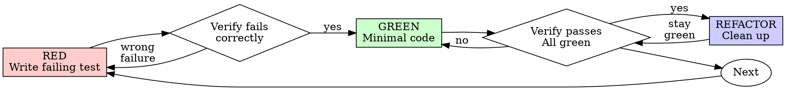

<!-- Generated by SpecStory, Markdown v2.1.0 -->

# 2026-05-09 14:13:32Z

<!-- Codex CLI Session 019e0d13-6288-7f12-93f2-5f8b335a023b (2026-05-09 14:13:32Z) -->

_**User (2026-05-09 14:13:32Z)**_

https://github.com/flyyangX/CodexMobile/pull/1 看一下这个贡献的pr 我们要合并吗，还是我们做的更好


---

_**Agent (gpt-5.5 2026-05-09 14:13:42Z)**_

我先按 GitHub PR 的方式看：一边拉本地仓库现状，一边取这个 PR 的 diff/讨论，这样能判断“该不该合”以及跟我们当前实现谁更合适。

_**Agent (gpt-5.5 2026-05-09 14:13:42Z)**_

<tool-use data-tool-type="shell" data-tool-name="exec_command"><details>
<summary>Tool use: **exec_command** `sed -n '1,220p' '/Users/xiayanghui/.codex/plugins/cache/openai-curated/github/63976030/skills/github/SKILL.md'`</summary>
```
Chunk ID: cb28f0
Wall time: 0.0798 seconds
Process exited with code 0
Original token count: 1089
Output:
---
name: github
description: Triage and orient GitHub repository, pull request, and issue work through the connected GitHub app. Use when the user asks for general GitHub help, wants PR or issue summaries, or needs repository context before choosing a more specific GitHub workflow.
---

# GitHub

## Overview

Use this skill as the umbrella entrypoint for general GitHub work in this plugin. It should decide whether the task stays in repo and PR triage or should be handed off to a more specific review, CI, or publish workflow.

This plugin is intentionally hybrid:

- Prefer the GitHub app from this plugin for repository, issue, pull request, comment, label, reaction, and PR creation workflows.
- Use local `git` and `gh` only when the connector does not cover the job well, especially for current-branch PR discovery, branch creation, commit and push, `gh auth status`, and GitHub Actions log inspection.
- Keep connector state and local checkout context aligned. If the request is about the current branch, resolve the local repo and branch before acting.

Once the intent is clear, route to the specialist skill immediately and do not keep broad GitHub triage in scope longer than needed.

## Connector-First Responsibilities

Handle these directly in this skill when the request does not need a narrower specialist workflow:

- repository orientation once the repo, PR, issue, or local checkout is identified
- recent PR or issue triage
- PR metadata summaries
- PR patch inspection
- PR comments, labels, and reactions
- issue lookup and summarization
- PR creation after a branch is already pushed

Prefer the GitHub app from this plugin for those flows because it provides structured PR, issue, and review-adjacent data without depending on a local checkout. If the repository is not already identifiable from the user request or local git context, ask for the repo instead of pretending there is a repo-search flow that may not exist.

## Routing Rules

1. Resolve the operating context first:
   - If the user provides a repository, PR number, issue number, or URL, use that.
   - If the request is about "this branch" or "the current PR", resolve local git context and use `gh` only as needed to discover the branch PR.
   - If the repository is still ambiguous after local inspection, ask for the repo identifier.
2. Classify the request before taking action:
   - `repo or PR triage`: summarize PRs, issues, patches, comments, labels, reactions, or repository state
   - `review follow-up`: unresolved review threads, requested changes, or inline review feedback
   - `CI debugging`: failing checks, Actions logs, or CI root-cause analysis
   - `publish changes`: create or switch branches, stage changes, commit, push, and open a draft PR
3. Route to the specialist skill as soon as the category is clear:
   - Review comments and requested changes: `../gh-address-comments/SKILL.md`
   - Failing GitHub Actions checks: `../gh-fix-ci/SKILL.md`
   - Commit, push, and open PR: `../yeet/SKILL.md`
4. Keep the hybrid model consistent after routing:
   - connector first for PR and issue data
   - local `git` and `gh` only for the specific gaps the connector does not cover

## Default Workflow

1. Resolve repository and item scope.
2. Gather structured PR or issue context through the GitHub app from this plugin.
3. Decide whether the task stays in connector-backed triage or needs a specialist skill.
4. Route immediately when the work becomes review follow-up, CI debugging, or publish workflow.
5. End with a clear summary of what was inspected, what changed, and what remains.

## Output Expectations

- For triage requests, return a concise summary of the repository, PR, or issue state and the next likely action.
- For mixed requests, tell the user which specialist path you are taking and why.
- For connector-backed write actions, restate the exact PR, issue, label, or reaction target before applying the change.
- Never imply that GitHub Actions logs are available through the connector alone. That remains a `gh` workflow.

## Examples

- "Use GitHub to summarize the open PRs in this repo and tell me what needs attention."
- "Help with this PR."
- "Review the latest comments on PR 482 and tell me what is actionable."
- "Debug the failing checks on this branch."
- "Commit these changes, push them, and open a draft PR."
```
</details></tool-use>

_**Agent (gpt-5.5 2026-05-09 14:13:42Z)**_

<tool-use data-tool-type="shell" data-tool-name="exec_command"><details>
<summary>Tool use: **exec_command** `rg -n "CodexMobile|pull/1|flyyangX" /Users/xiayanghui/.codex/memories/MEMORY.md`</summary>
```
Chunk ID: 224115
Wall time: 0.1139 seconds
Process exited with code 0
Original token count: 3819
Output:
1:# Task Group: CodexMobile / composer 控件、线程同步、架构拆分与私网访问
3:scope: `CodexMobile` 手机端 composer 控件、`/plan` 协作模式、repo-local skill 发现、自动标题、普通对话/发送链路排障、desktop IPC fallback、draft/new-thread send、abort 状态卡片、后端保守拆分、移动端 Git 面板、macOS 自启动与 Tailscale/LAN 访问；适用于这个 repo 的 live 前后端联调、app-server 行为核验、私网访问解释和公开仓库卫生，不适用于泛化移动端产品设计。
4:applies_to: cwd=/Users/xiayanghui/编程项目/CodexMobile; reuse_rule=适合复用到这个 `CodexMobile` 仓库里与 composer、`/plan`、`/api/status`、`thread/*` app-server 能力、本地 Node 服务、README 功能口径、Git HTTP API、launchd、Tailscale/LAN origin 行为有关的任务；具体端口、running process、模型列表和代码结构都要按当前 checkout/live server 重验
10:- rollout_summaries/2026-05-05T00-12-41-rXsC-codexmobile_skill_picker_and_remove_voice_controls.md (cwd=/Users/xiayanghui/编程项目/CodexMobile, rollout_path=/Users/xiayanghui/.codex/sessions/2026/05/05/rollout-2026-05-05T08-12-41-019df57a-d854-73d1-8bec-a9d15f8453c2.jsonl, updated_at=2026-05-05T00:25:11+00:00, thread_id=019df57a-d854-73d1-8bec-a9d15f8453c2, added skill discovery and mobile picker, then proved the first disabled state came from an older live backend on port 3321)
14:- CodexMobile, skill picker, composer, /api/status, localStorage, buildCodexTurnInput, type: skill, lsof, port 3321, port 3331, readCodexSkills
20:- rollout_summaries/2026-05-05T00-12-41-rXsC-codexmobile_skill_picker_and_remove_voice_controls.md (cwd=/Users/xiayanghui/编程项目/CodexMobile, rollout_path=/Users/xiayanghui/.codex/sessions/2026/05/05/rollout-2026-05-05T08-12-41-019df57a-d854-73d1-8bec-a9d15f8453c2.jsonl, updated_at=2026-05-05T00:25:11+00:00, thread_id=019df57a-d854-73d1-8bec-a9d15f8453c2, removed the in-app voice/dialog entry points and updated docs to match the native-keyboard voice preference)
24:- CodexMobile, voice-dialog, microphone button, dialog button, VoiceDialogPanel, native keyboard voice path, README.md, npm run build, restart 3321
30:- rollout_summaries/2026-05-05T11-35-49-5GrC-codexmobile_auto_thread_title_hook_gpt_5_4_mini.md (cwd=/Users/xiayanghui/编程项目/CodexMobile, rollout_path=/Users/xiayanghui/.codex/sessions/2026/05/05/rollout-2026-05-05T19-35-49-019df7ec-42b4-7602-94d6-e06d2430e6c0.jsonl, updated_at=2026-05-05T12:01:30+00:00, thread_id=019df7ec-42b4-7602-94d6-e06d2430e6c0, traced `name`/`preview` fallback and added async auto-title writeback for new draft sessions)
40:- rollout_summaries/2026-05-05T19-24-27-hq5w-codexmobile_mobile_thread_sync_and_hanging_turn_debug.md (cwd=/Users/xiayanghui/编程项目/CodexMobile, rollout_path=/Users/xiayanghui/.codex/sessions/2026/05/06/rollout-2026-05-06T03-24-27-019df999-4f02-70f1-9d0f-895fb3098ee6.jsonl, updated_at=2026-05-07T05:33:58+00:00, thread_id=019df999-4f02-70f1-9d0f-895fb3098ee6, cleaned ordinary-thread history bleed-through, clarified hide-vs-archive behavior, cleared `/Users/xiayanghui/Documents/Codex/`, and fixed normal-chat turn hangs caused by leaked lark-cli env)
50:- rollout_summaries/2026-05-05T19-18-01-iLno-codexmobile_macos_autostart_launchagent.md (cwd=/Users/xiayanghui/编程项目/CodexMobile, rollout_path=/Users/xiayanghui/.codex/sessions/2026/05/06/rollout-2026-05-06T03-18-01-019df993-6bb9-7ff2-99b2-c34ddc737c76.jsonl, updated_at=2026-05-06T12:17:56+00:00, thread_id=019df993-6bb9-7ff2-99b2-c34ddc737c76, started with a reboot-pairing skill, then replaced it with a user-level LaunchAgent that keeps port 3321 alive after reboot and crash)
54:- CodexMobile, LaunchAgent, launchctl, macOS autostart, run-server.mjs, start-server.mjs, /api/status, refreshCodexCache, port 3321, fileURLToPath, launchd, com.codexmobile.bridge
60:- rollout_summaries/2026-05-07T04-46-49-TGny-codexmobile_architecture_git_security_cleanup.md (cwd=/Users/xiayanghui/编程项目/CodexMobile, rollout_path=/Users/xiayanghui/.codex/sessions/2026/05/07/rollout-2026-05-07T12-46-49-019e00c2-88d5-78e1-bc14-ca1f0d1f1084.jsonl, updated_at=2026-05-07T17:54:56+00:00, thread_id=019e00c2-88d5-78e1-bc14-ca1f0d1f1084, explained the PWA + Node + Codex app-server chain, split backend helpers conservatively, replaced prompt-driven Git with real APIs/panel, and cleaned already-published local artifacts from `origin/main`)
70:- rollout_summaries/2026-05-07T09-15-14-5HCm-codexmobile_tailscale_lan_pwa_origin.md (cwd=/Users/xiayanghui/编程项目/CodexMobile, rollout_path=/Users/xiayanghui/.codex/archived_sessions/rollout-2026-05-07T17-15-14-019e01b8-4577-7b30-8e0c-22916f0dd5ae.jsonl, updated_at=2026-05-07T09:40:01+00:00, thread_id=019e01b8-4577-7b30-8e0c-22916f0dd5ae, verified `3321` over Tailscale with pairing and explained 
... (truncated)
```
</details></tool-use>

_**Agent (gpt-5.5 2026-05-09 14:13:42Z)**_

<tool-use data-tool-type="shell" data-tool-name="exec_command"><details>
<summary>Tool use: **exec_command** `git status --short --branch`</summary>
```
Chunk ID: b42815
Wall time: 0.1009 seconds
Process exited with code 0
Original token count: 42
Output:
## main...origin/main
 M client/src/chat/MarkdownContent.jsx
 M client/src/styles/chat.css
?? client/src/chat/memory-citation.js
?? client/src/memory-citation.test.mjs
```
</details></tool-use>

_**Agent (gpt-5.5 2026-05-09 14:13:42Z)**_

<tool-use data-tool-type="shell" data-tool-name="exec_command"><details>
<summary>Tool use: **exec_command** `git remote -v`</summary>
```
Chunk ID: ec68c3
Wall time: 0.0999 seconds
Process exited with code 0
Original token count: 28
Output:
origin	https://github.com/flyyangX/CodexMobile (fetch)
origin	https://github.com/flyyangX/CodexMobile (push)
```
</details></tool-use>

_**Agent (gpt-5.5 2026-05-09 14:13:45Z)**_

我这边看到本地已经有未提交改动，先只做只读对比，不会动你的工作区。记忆里这个仓库前几天刚做过同步、`/plan`、移动端 Git 安全等一批改动，我会把 PR 放到这个背景里看。

_**Agent (gpt-5.5 2026-05-09 14:13:53Z)**_

<tool-use data-tool-type="unknown" data-tool-name="_fetch_pr"><details>
<summary>Tool use: **_fetch_pr**</summary>
```
Wall time: 2.5763 seconds
Output:
{"pull_request":{"url":"https://github.com/flyyangX/CodexMobile/pull/1","number":1,"state":"open","merged":false,"mergeable":false,"draft":false,"body":"## 这次做了什么\n这次主要是把 CodexMobile 的输入区和 Codex 任务交互补齐：它现在有明确的计划模式入口，也有模型速度选择；同时桌面端和移动端的 composer 都重新整理过，不再只是把所有按钮挤在同一排。\n\n## 主要变化\n### 1. 桌面端 UI 适配\n- 桌面端 composer 的权限、Chat/计划、技能、模型、速度这些入口重新排布，控制区更接近 Codex 官方 app 的使用习惯。\n- 模型选择改成二级菜单：第一层先选“智能”，模型列表和速度选项放到二级菜单里，减少常用操作时的干扰。\n- 运行中继续发送消息时，提示文案调整为更明确的“发送到当前任务 / 加入队列 / 中止并发送”，避免用户不知道这条消息会怎样处理。\n\n### 2. 计划模式支持\n- composer 里增加了明确的计划模式入口，不再只能依赖 `/plan`。\n- 新任务会把计划模式对应的 collaboration payload 传给 Codex。\n- 计划模式里需要用户选择、确认或拒绝方案时，移动端也能显示对应的输入卡片并提交回复。\n\n### 3. 移动端 UI 适配\n- 窄屏底部把低频入口收进 `+` 菜单，比如 Chat/计划和技能，底部只保留更常用、更需要随时看到的控制。\n- 权限显示改成短标签，保留上下文状态点和模型/速度状态，避免底部控制区换行和拥挤。\n- 修复了权限按钮触控区域过大、浅色模式用户消息仍是深色、配对页没有居中等 UI 问题。\n\n### 4. 模型速度选择\n- 新增“标准 / 快速”速度选项，并持久化用户选择。\n- 快速模式会用闪电标识显示，并把选择传到 Codex 的 service tier，避免前端只是画了图标但后端没有生效。\n\n### 5. PWA 与主题\n- PWA manifest 优先使用 fullscreen，并保留浏览器不支持时的回退。\n- 设置里增加“跟随系统”主题模式，适配系统深色/浅色偏好。\n\n## 截图\n**桌面端模型菜单**\n\n\n**移动端添加菜单**\n\n\n## English Summary\nThis PR adds explicit plan mode support, model speed selection, and a cleaned-up composer UI for both desktop and mobile. The desktop composer now uses a Codex-like nested model menu, while the mobile composer moves lower-frequency controls into the add menu to reduce crowding. It also wires fast mode through to the Codex service tier, improves PWA fullscreen behavior, adds system theme support, and fixes several UI polish issues around pairing, touch targets, and light-mode message bubbles.","title":"新增计划模式、速度选择与桌面/移动端 UI 适配","base":"main","base_sha":"c77d6f79a8bd242d8daa3c5c1c66aacbc5169db5","head":"codex/plan-mode-v1","head_sha":"29c34dd407f15c3ae2973630f70dc7e7f44dccd8","merge_commit_sha":null,"user":{"login":"bingqldx","name":"bingqldx","email":null,"avatar_url":"https://avatars.githubusercontent.com/u/61586210?v=4","id":61586210},"requested_reviewers":null,"requested_team_reviewers":null,"diff":"@@ -10,6 +10,8 @@ test-results/\n \n # Local runtime state, uploads, generated files, pairing tokens, logs\n .codexmobile/\n+.superpowers/\n+.worktrees/\n .playwright-mcp/\n .tmp*\n .tmp*/\n@@ -0,0 +1,10 @@\n+import assert from 'node:assert/strict';\n+import fs from 'node:fs/promises';\n+import test from 'node:test';\n+\n+test('manifest prefers fullscreen PWA display with standalone fallback', async () => {\n+  const manifest = JSON.parse(await fs.readFile(new URL('./manifest.webmanifest', import.meta.url), 'utf8'));\n+\n+  assert.equal(manifest.display, 'standalone');\n+  assert.deepEqual(manifest.display_override, ['fullscreen', 'standalone']);\n+});\n@@ -6,6 +6,7 @@\n   \"start_url\": \"/\",\n   \"scope\": \"/\",\n   \"display\": \"standalone\",\n+  \"display_override\": [\"fullscreen\", \"standalone\"],\n   \"background_color\": \"#f7f7f4\",\n   \"theme_color\": \"#f7f7f4\",\n   \"orientation\": \"portrait\",\n@@ -14,6 +14,7 @@ import {\n   GitBranch,\n   GitCommitHorizontal,\n   Headphones,\n+  HelpCircle,\n   Image,\n   Loader2,\n   Menu,\n@@ -36,7 +37,8 @@ import {\n   UploadCloud,\n   Volume2,\n   Wifi,\n-  X\n+  X,\n+  Zap\n } from 'lucide-react';\n import { useCallback, useEffect, useMemo, useRef, useState } from 'react';\n import ReactMarkdown, { defaultUrlTransform } from 'react-markdown';\n@@ -49,19 +51,53 @@ import { mergeActivityStep } from './activity-merge.js';\n import { isPlaceholderTimelineItem } from './activity-timeline.js';\n import { isNearChatBottom, shouldF
... (truncated)
```
</details></tool-use>

_**Agent (gpt-5.5 2026-05-09 14:13:53Z)**_

<tool-use data-tool-type="unknown" data-tool-name="_get_pr_diff"><details>
<summary>Tool use: **_get_pr_diff**</summary>
```
Wall time: 2.1715 seconds
Output:
{"diff":"diff --git a/.gitignore b/.gitignore\nindex f1c2306..c0a3512 100644\n--- a/.gitignore\n+++ b/.gitignore\n@@ -10,6 +10,8 @@ test-results/\n \n # Local runtime state, uploads, generated files, pairing tokens, logs\n .codexmobile/\n+.superpowers/\n+.worktrees/\n .playwright-mcp/\n .tmp*\n .tmp*/\ndiff --git a/client/manifest.test.mjs b/client/manifest.test.mjs\nnew file mode 100644\nindex 0000000..2804a44\n--- /dev/null\n+++ b/client/manifest.test.mjs\n@@ -0,0 +1,10 @@\n+import assert from 'node:assert/strict';\n+import fs from 'node:fs/promises';\n+import test from 'node:test';\n+\n+test('manifest prefers fullscreen PWA display with standalone fallback', async () => {\n+  const manifest = JSON.parse(await fs.readFile(new URL('./manifest.webmanifest', import.meta.url), 'utf8'));\n+\n+  assert.equal(manifest.display, 'standalone');\n+  assert.deepEqual(manifest.display_override, ['fullscreen', 'standalone']);\n+});\ndiff --git a/client/manifest.webmanifest b/client/manifest.webmanifest\nindex 809d6d8..0f1147d 100644\n--- a/client/manifest.webmanifest\n+++ b/client/manifest.webmanifest\n@@ -6,6 +6,7 @@\n   \"start_url\": \"/\",\n   \"scope\": \"/\",\n   \"display\": \"standalone\",\n+  \"display_override\": [\"fullscreen\", \"standalone\"],\n   \"background_color\": \"#f7f7f4\",\n   \"theme_color\": \"#f7f7f4\",\n   \"orientation\": \"portrait\",\ndiff --git a/client/src/App.jsx b/client/src/App.jsx\nindex 395b02a..7e53408 100644\n--- a/client/src/App.jsx\n+++ b/client/src/App.jsx\n@@ -14,6 +14,7 @@ import {\n   GitBranch,\n   GitCommitHorizontal,\n   Headphones,\n+  HelpCircle,\n   Image,\n   Loader2,\n   Menu,\n@@ -36,7 +37,8 @@ import {\n   UploadCloud,\n   Volume2,\n   Wifi,\n-  X\n+  X,\n+  Zap\n } from 'lucide-react';\n import { useCallback, useEffect, useMemo, useRef, useState } from 'react';\n import ReactMarkdown, { defaultUrlTransform } from 'react-markdown';\n@@ -49,19 +51,53 @@ import { mergeActivityStep } from './activity-merge.js';\n import { isPlaceholderTimelineItem } from './activity-timeline.js';\n import { isNearChatBottom, shouldFollowChatOutput } from './chat-scroll.js';\n import { composerSendState, desktopBridgeCanCreateThread } from './send-state.js';\n+import { buildClientCollaborationMode } from './plan-mode-client.js';\n+import {\n+  dragEventHasFiles,\n+  filesFromClipboardEvent,\n+  filesFromDropEvent\n+} from './upload-inputs.js';\n import {\n   detectComposerToken,\n   filteredSlashCommands,\n+  COMPOSER_MODE_OPTIONS,\n+  composerModeLabel,\n+  migrateComposerMode,\n+  normalizeComposerMode,\n+  selectedComposerModeForSession,\n+  threadStartedComposerModeSourceIds,\n   replaceComposerToken\n } from './composer-shortcuts.js';\n+import {\n+  THEME_OPTIONS,\n+  applyThemeToDocument,\n+  normalizeThemePreference,\n+  resolveThemePreference\n+} from './theme-preference.js';\n+import {\n+  DEFAULT_PERMISSION_MODE,\n+  PERMISSION_OPTIONS,\n+  permissionLabel,\n+  permissionShortLabel\n+} from './permission-mode.js';\n+import {\n+  DEFAULT_MODEL_SPEED,\n+  MODEL_SPEED_OPTIONS,\n+  normalizeModelSpeed,\n+  serviceTierForModelSpeed\n+} from './model-preferences.js';\n import { connectionRecoveryState } from './connection-recovery.js';\n import {\n   browserNotificationPermission,\n   isStandalonePwa,\n+  markUserInputMessageResolved,\n+  mergePendingUserInputMessages,\n   notificationFromPayload,\n   notificationPreferenceEnabled,\n   setNotificationPreferenceEnabled,\n-  shouldUseWebNotification\n+  shouldUseWebNotification,\n+  upsertUserInputMessage,\n+  userInputKey\n } from './notification-events.js';\n import {\n   browserPushSupported,\n@@ -142,6 +178,8 @@ const DEFAULT_REASONING_EFFORT = 'xhigh';\n const REASONING_DEFAULT_VERSION = 'xhigh-v1';\n const THEME_KEY = 'codexmobile.theme';\n const SELECTED_SKILLS_KEY = 'codexmobile.selectedSkills';\n+const MODEL_SPEED_KEY = 'codexmobile.modelSpeed';\n+const FOLLOW_UP_MODE_KEY = 'codexmobile.followUpMode';\n const VOICE_MAX_RECORDING_MS = 90 * 1000;\n const VOICE_MAX_UPLOAD_BYTES = 10 * 1024 * 1024;\n const VOICE_MIME_CANDIDATES = ['audio/mp4', 'audio/webm;codecs=opus', 'audio/webm'];\n@@ -219,13 +257,6 @@ async function copyTextToClipboard(text) {\n   }\n }\n \n-const PERMISSION_OPTIONS = [\n-  { value: 'default', label: '默认权限' },\n-  { value: 'acceptEdits', label: '自动接受编辑' },\n-  { value: 'bypassPermissions', label: '完全访问', danger: true }\n-];\n-const DEFAULT_PERMISSION_MODE = 'bypassPermissions';\n-\n const REASONING_OPTIONS = [\n   { value: 'low', label: '低' },\n   { value: 'medium', label: '中' },\n@@ -233,6 +264,11 @@ const REASONING_OPTIONS = [\n   { value: 'xhigh', label: '超高' }\n ];\n \n+const FOLLOW_UP_OPTIONS = [\n+  { value: 'queue', label: '排队', description: '当前任务结束后自动发送' },\n+  { value: 'steer', label: '引导', description: '提交给当前运行，不中断模型' }\n+];\n+\n function formatTime(value) {\n   if (!value) {
... (truncated)
```
</details></tool-use>

_**Agent (gpt-5.5 2026-05-09 14:13:53Z)**_

<tool-use data-tool-type="shell" data-tool-name="exec_command"><details>
<summary>Tool use: **exec_command** `git log --oneline --decorate --graph --max-count=20 --all`</summary>
```
Chunk ID: 618b36
Wall time: 0.0000 seconds
Process exited with code 0
Original token count: 309
Output:
* 27b0533 (HEAD -> main, origin/main, origin/HEAD) Fix desktop IPC completion running state
* 6be660a (tag: v1.1.0) Release 1.1.0
| *-.   370f014 (refs/stash) On main: codexmobile-release-1.1-pre-sync
| |\ \  
| | | * 0b7ab63 untracked files on main: 49751a8 Fix commit message generation
| | * 00efcb9 index on main: 49751a8 Fix commit message generation
| |/  
| | * c600f83 (codex/backup-before-rollback-49751a8-20260509) backup: preserve ipc fallback experiments before rollback
| |/  
|/|   
* | 866bb88 (codex/test-866bb88-20260509) 更新 README 等 39 个文件
|/  
* 49751a8 Fix commit message generation
* e94b1bd docs: clarify cross-platform browser support
* 187c303 docs: update project homepage positioning
* e8e594e Sync renamed threads to desktop IPC
* 0797224 docs: expand redacted UI screenshots
* 2f51d7e (tag: v1.0.0) docs: prepare 1.0 release
* e9393db (codex/main-with-backed-up-ui) fix: stabilize mobile desktop sync
* 2fe9b47 Refactor mobile app flows and data handling
* 58ec819 Refactor server routes into dedicated handlers
* a974f4f fix: harden mobile git actions
* d147f96 refactor: group app shell props
* f1c6700 refactor: split panel styles by surface
* b2b42f9 refactor: extract image chat handling
```
</details></tool-use>

_**Agent (gpt-5.5 2026-05-09 14:13:53Z)**_

<tool-use data-tool-type="shell" data-tool-name="exec_command"><details>
<summary>Tool use: **exec_command** `rg --files`</summary>
```
Chunk ID: d399be
Wall time: 0.0000 seconds
Process exited with code 0
Original token count: 1682
Output:
package.json
package-lock.json
README.md
client/index.html
.env.example
client/manifest.webmanifest
CHANGELOG.md
LICENSE
scripts/start-all.ps1
scripts/install-macos-autostart.mjs
scripts/run-server.mjs
scripts/patch-codex-sdk.mjs
scripts/start-asr.mjs
scripts/start-server.mjs
scripts/system-proxy-env.mjs
scripts/smoke.mjs
scripts/lark-cli-guard.mjs
skills/lark-sheets-fast/SKILL.md
asr-service/app.py
asr-service/Dockerfile
asr-service/requirements.txt
skills/lark-doc-fast/SKILL.md
client/public/codexmobile-sw.js
client/public/codex-icon-180.png
client/vite.config.js
client/public/codex-icon-192.png
client/public/icon.svg
client/public/codex-icon-512.png
skills/lark-drive-fast/SKILL.md
server/codex-runner-status.test.mjs
server/git-service.test.mjs
server/desktop-activity-parser.js
server/file-search.js
server/lark-cli.js
server/voice-routes.js
server/mobile-session-index.js
server/auth.test.mjs
server/session-index-builder.test.mjs
server/voice-transcriber.js
server/upload-service.test.mjs
server/git-routes.test.mjs
server/realtime-voice.js
server/codex-runner.js
server/codex-data-desktop-activity.test.mjs
server/http-utils.js
skills/lark-slides-fast/SKILL.md
server/auth.js
server/chat-service.js
server/codex-native-images.test.js
server/file-routes.js
server/feishu-skills.js
server/provider-api.js
server/voice-speaker.js
server/push-service.test.mjs
server/session-index-builder.js
server/chat-delivery.js
client/src/chat-scroll.js
client/src/session-live-refresh.test.mjs
docs/images/codexmobile-demo-chat-light.png
shared/message-identity.js
docs/images/codexmobile-demo-sidebar-light.png
client/src/activity-dedupe.js
server/image-generator.js
shared/session-title.js
shared/session-title.test.mjs
docs/images/codexmobile-demo-chat-dark.png
docs/images/codexmobile-demo-sidebar-dark.png
server/index.js
server/chat-image-handler.js
server/desktop-turn-monitor.test.mjs
client/src/connection-recovery.js
client/src/app-websocket-events.test.mjs
client/src/composer-shortcuts.test.mjs
server/codex-app-server.test.mjs
docs/superpowers/plans/2026-05-08-desktop-ipc-state-sync.md
server/codex-native-images.js
server/chat-auto-title.js
server/session-local-state.test.mjs
server/chat-queue.js
server/feishu-routes.js
server/chat-request-prep.js
server/session-title-generator.test.mjs
server/codex-quota.test.mjs
server/codex-config.js
server/codex-data.js
server/session-title-generator.js
server/codex-app-server.js
server/desktop-thread-projector.js
server/codex-quota.js
server/chat-request-prep.test.mjs
server/static-service.test.mjs
server/route-handlers.test.mjs
server/push-service.js
server/session-local-state.js
server/chat-routes.js
server/desktop-turn-monitor.js
client/src/web-push-client.test.mjs
client/src/send-state.js
client/src/chat-scroll.test.mjs
client/src/activity-merge.js
client/src/styles.css
server/chat-service.test.mjs
server/desktop-ipc-client.js
server/codex-config.test.mjs
server/static-service.js
server/session-message-reader.js
server/desktop-ipc-client.test.mjs
server/startup-proxy.test.mjs
server/session-message-reader.test.mjs
server/chat-auto-title.test.mjs
server/notification-routes.js
server/file-search.test.mjs
server/git-routes.js
server/git-service.js
server/session-routes.js
server/upload-service.js
client/src/activity-display.test.mjs
client/src/activity-timeline.js
client/src/git-panel-actions.test.mjs
client/src/git-panel-state.test.mjs
client/src/model-sync.test.mjs
client/src/connection-recovery.test.mjs
client/src/activity-timeline.test.mjs
client/src/git-panel-state.js
client/src/activity-model.test.mjs
client/src/turn-submission-utils.test.mjs
client/src/api.js
client/src/activity-display.js
client/src/activity-card-state.test.mjs
client/src/send-state.test.mjs
client/src/selection-persistence.test.mjs
client/src/activity-dedupe.test.mjs
client/src/session-live-refresh.js
client/src/activity-merge.test.mjs
client/src/App.jsx
client/src/main.jsx
client/src/chat/message-identity.js
client/src/chat/ActivityTimeline.jsx
client/src/git-panel-actions.js
client/src/chat/PlanMessage.jsx
client/src/chat/activity-card-state.js
client/src/chat/ChatPane.jsx
client/src/chat/MarkdownContent.jsx
client/src/chat/activity-model.js
client/src/chat/ActivityMessage.jsx
client/src/chat/activity-timeline-model.js
client/src/chat/memory-citation.js
client/src/chat/message-identity.test.mjs
client/src/chat/ChatMessage.jsx
client/src/chat/activity-timeline-projection.js
client/src/chat/ActivityFileSummary.jsx
client/src/chat/ImagePreview.jsx
client/src/notification-events.test.mjs
client/src/notification-events.js
client/src/panels/Drawer.jsx
client/src/styles/activity.css
client/src/app/FilePreviewApp.jsx
client/src/panels/TopBar.jsx
client/src/panels/index.js
client/src/panels/DocsPanel.jsx
client/src/panels/ToastStack.jsx
client/src/panels/ConnectionRecoveryCard.jsx
client/src/panels/GitPanel.jsx
client
... (truncated)
```
</details></tool-use>

_**Agent (gpt-5.5 2026-05-09 14:14:09Z)**_

PR 本身是开着的，但 GitHub 返回 `mergeable: false`，而且它的 base 是较旧的 `c77d6f7`，本地 `origin/main` 已经到 `27b0533`。我继续看它到底新增了哪些能力，以及这些能力现在是不是已经被我们自己的主线覆盖了。

_**Agent (gpt-5.5 2026-05-09 14:14:09Z)**_

<tool-use data-tool-type="shell" data-tool-name="exec_command"><details>
<summary>Tool use: **exec_command** `git fetch origin pull/1/head:refs/remotes/origin/pr/1`</summary>
```
Chunk ID: 05be1a
Wall time: 1.0018 seconds
Process running with session ID 62639
Original token count: 0
Output:
```
</details></tool-use>

_**Agent (gpt-5.5 2026-05-09 14:14:09Z)**_

<tool-use data-tool-type="shell" data-tool-name="exec_command"><details>
<summary>Tool use: **exec_command** `rg -n "collaborationMode|buildClientCollaborationMode|user-input|requestUserInput|serviceTier|MODEL_SPEED|display_override|themePreference|followUpMode|composerMode" client/src server shared client/manifest.webmanifest package.json`</summary>
```
Chunk ID: afd5e1
Wall time: 0.0000 seconds
Process exited with code 0
Original token count: 957
Output:
server/chat-service.test.mjs:375:    setDesktopFollowerCollaborationMode: async (conversationId, collaborationMode) => {
server/chat-service.test.mjs:376:      collaborationUpdate = { conversationId, collaborationMode };
server/chat-service.test.mjs:393:    collaborationMode: 'plan',
server/chat-service.test.mjs:406:    collaborationMode: {
server/chat-service.test.mjs:415:  assert.deepEqual(started.params.collaborationMode, collaborationUpdate.collaborationMode);
server/chat-service.test.mjs:429:    setDesktopFollowerCollaborationMode: async (conversationId, collaborationMode) => {
server/chat-service.test.mjs:430:      collaborationUpdate = { conversationId, collaborationMode };
server/chat-service.test.mjs:448:    collaborationMode: null
server/chat-service.test.mjs:450:  assert.equal(started.params.collaborationMode, null);
server/chat-service.test.mjs:872:    collaborationMode: 'plan',
server/chat-service.test.mjs:877:  assert.deepEqual(runPayload.collaborationMode, {
server/desktop-ipc-client.js:22:  ['thread-follower-submit-user-input', 1],
server/desktop-ipc-client.js:287:export async function setDesktopFollowerCollaborationMode(conversationId, collaborationMode, options = {}) {
server/desktop-ipc-client.js:290:    collaborationMode
server/codex-runner.js:770:export async function runCodexTurn({ sessionId, draftSessionId, projectPath, message, attachments = [], selectedSkills = [], model, reasoningEffort, permissionMode, collaborationMode = null, turnId: providedTurnId }, emit) {
server/codex-runner.js:950:      collaborationMode: collaborationMode || null
server/push-service.test.mjs:91:test('notificationFromServerPayload maps completion, failure, and user-input events', () => {
server/chat-delivery.js:91:  collaborationMode,
server/chat-delivery.js:97:  await setDesktopFollowerCollaborationMode(selectedSessionId, collaborationMode || null);
server/chat-delivery.js:114:  collaborationMode,
server/chat-delivery.js:147:    collaborationMode: collaborationMode || null,
server/chat-delivery.js:158:        collaborationMode,
server/chat-delivery.js:169:            collaborationMode: collaborationMode || null
server/chat-delivery.js:183:        collaborationMode,
server/chat-delivery.js:329:      collaborationMode: job.collaborationMode,
server/chat-service.js:131:      collaborationMode: draft.collaborationMode,
server/chat-service.js:226:      collaborationMode,
server/chat-service.js:271:        collaborationMode
server/chat-service.js:303:            collaborationMode,
server/chat-service.js:456:      collaborationMode
client/src/turn-submission-utils.test.mjs:73:    collaborationMode: 'plan'
client/src/turn-submission-utils.test.mjs:77:    collaborationMode: 'plan'
server/chat-request-prep.test.mjs:30:    collaborationMode: {
server/chat-request-prep.test.mjs:59:  assert.deepEqual(prepared.collaborationMode, {
server/codex-app-server.js:129:    case 'item/tool/requestUserInput':
server/chat-request-prep.js:132:  const collaborationMode = normalizeCollaborationMode(body.collaborationMode, {
server/chat-request-prep.js:159:    collaborationMode,
server/chat-queue.js:23:    collaborationMode: job.collaborationMode?.mode === 'plan' ? 'plan' : null,
client/src/app/turn-submission-utils.js:84:    collaborationMode: planMatch ? 'plan' : null
client/src/app/useTurnSubmission.js:240:    collaborationMode = null,
client/src/app/useTurnSubmission.js:336:          collaborationMode
client/src/app/useTurnSubmission.js:452:        collaborationMode: prepared.collaborationMode
client/src/app/useTurnSubmission.js:477:        collaborationMode: null
client/src/app/useTurnSubmission.js:504:        collaborationMode: null
client/src/composer/useQueueDrafts.js:67:    setInput(draft.collaborationMode === 'plan' ? `/plan ${draft.text || ''}`.trim() : (draft.text || ''));
```
</details></tool-use>

_**Agent (gpt-5.5 2026-05-09 14:14:09Z)**_

<tool-use data-tool-type="shell" data-tool-name="exec_command"><details>
<summary>Tool use: **exec_command** `git ls-tree -r --name-only origin/main | rg "plan-mode|collaboration-mode|service-tier|user-input|permission-mode|model-preferences|theme-preference|upload-inputs|manifest.test"`</summary>
```
Chunk ID: 2b5e27
Wall time: 0.0000 seconds
Process exited with code 1
Original token count: 0
Output:
```
</details></tool-use>

_**Agent (gpt-5.5 2026-05-09 14:14:09Z)**_

<tool-use data-tool-type="shell" data-tool-name="exec_command"><details>
<summary>Tool use: **exec_command** `git diff --stat origin/main...origin/pr/1`</summary>
```
Chunk ID: b19850
Wall time: 0.0000 seconds
Process exited with code 128
Original token count: 52
Output:
fatal: ambiguous argument 'origin/main...origin/pr/1': unknown revision or path not in the working tree.
Use '--' to separate paths from revisions, like this:
'git <command> [<revision>...] -- [<file>...]'
```
</details></tool-use>

_**Agent (gpt-5.5 2026-05-09 14:14:13Z)**_

<tool-use data-tool-type="unknown" data-tool-name="write_stdin"><details>
<summary>Tool use: **write_stdin**</summary>
```
Chunk ID: f8f13f
Wall time: 0.0000 seconds
Process exited with code 0
Original token count: 25
Output:
From https://github.com/flyyangX/CodexMobile
 * [new ref]         refs/pull/1/head -> origin/pr/1
```
</details></tool-use>

_**Agent (gpt-5.5 2026-05-09 14:14:19Z)**_

<tool-use data-tool-type="shell" data-tool-name="exec_command"><details>
<summary>Tool use: **exec_command** `git diff --stat origin/main...origin/pr/1`</summary>
```
Chunk ID: a4a8f7
Wall time: 0.0000 seconds
Process exited with code 0
Original token count: 707
Output:
 .gitignore                                         |    2 +
 client/manifest.test.mjs                           |   10 +
 client/manifest.webmanifest                        |    1 +
 client/src/App.jsx                                 |  707 ++++++--
 client/src/composer-accessibility.test.mjs         |   11 +
 client/src/composer-running-send-menu.test.mjs     |   12 +
 client/src/composer-shortcuts.js                   |   57 +
 client/src/composer-shortcuts.test.mjs             |   59 +
 client/src/mobile-composer-layout.test.mjs         |   86 +
 client/src/model-menu-layout.test.mjs              |   22 +
 client/src/model-preferences.js                    |   27 +
 client/src/model-preferences.test.mjs              |   17 +
 client/src/notification-events.js                  |   66 +
 client/src/notification-events.test.mjs            |   84 +-
 client/src/permission-mode.js                      |   15 +
 client/src/permission-mode.test.mjs                |   12 +
 client/src/plan-mode-client.js                     |   13 +
 client/src/plan-mode-client.test.mjs               |   25 +
 client/src/send-state.js                           |    6 +-
 client/src/send-state.test.mjs                     |   18 +-
 client/src/styles.css                              |  574 ++++++-
 client/src/theme-preference.js                     |   37 +
 client/src/theme-preference.test.mjs               |   47 +
 client/src/ui-css.test.mjs                         |   25 +
 client/src/upload-inputs.js                        |   40 +
 client/src/upload-inputs.test.mjs                  |   77 +
 docs/pr-screenshots/desktop-model-menu.png         |  Bin 0 -> 102057 bytes
 docs/pr-screenshots/mobile-attachment-menu.png     |  Bin 0 -> 175528 bytes
 .../plans/2026-05-07-codexmobile-adaptive-shell.md |  788 +++++++++
 .../plans/2026-05-08-codexmobile-plan-mode-v1.md   | 1748 ++++++++++++++++++++
 ...2026-05-07-codexmobile-adaptive-shell-design.md |  169 ++
 .../2026-05-08-codexmobile-plan-mode-v1-design.md  |  317 ++++
 server/chat-service.js                             |  105 +-
 server/chat-service.test.mjs                       |  263 ++-
 server/codex-app-server.js                         |    2 +-
 server/codex-runner.js                             |  117 +-
 server/desktop-ipc-client.js                       |   19 +-
 server/desktop-ipc-client.test.mjs                 |   81 +-
 server/index.js                                    |   24 +
 server/user-input-requests.js                      |  140 ++
 server/user-input-requests.test.mjs                |  123 ++
 shared/collaboration-mode.js                       |   58 +
 shared/collaboration-mode.test.mjs                 |   89 +
 shared/service-tier.js                             |    6 +
 44 files changed, 5953 insertions(+), 146 deletions(-)
```
</details></tool-use>

_**Agent (gpt-5.5 2026-05-09 14:14:19Z)**_

<tool-use data-tool-type="shell" data-tool-name="exec_command"><details>
<summary>Tool use: **exec_command** `git diff --name-status origin/main...origin/pr/1`</summary>
```
Chunk ID: 96cdd1
Wall time: 0.0000 seconds
Process exited with code 0
Original token count: 405
Output:
M	.gitignore
A	client/manifest.test.mjs
M	client/manifest.webmanifest
M	client/src/App.jsx
A	client/src/composer-accessibility.test.mjs
A	client/src/composer-running-send-menu.test.mjs
M	client/src/composer-shortcuts.js
M	client/src/composer-shortcuts.test.mjs
A	client/src/mobile-composer-layout.test.mjs
A	client/src/model-menu-layout.test.mjs
A	client/src/model-preferences.js
A	client/src/model-preferences.test.mjs
M	client/src/notification-events.js
M	client/src/notification-events.test.mjs
A	client/src/permission-mode.js
A	client/src/permission-mode.test.mjs
A	client/src/plan-mode-client.js
A	client/src/plan-mode-client.test.mjs
M	client/src/send-state.js
M	client/src/send-state.test.mjs
M	client/src/styles.css
A	client/src/theme-preference.js
A	client/src/theme-preference.test.mjs
A	client/src/ui-css.test.mjs
A	client/src/upload-inputs.js
A	client/src/upload-inputs.test.mjs
A	docs/pr-screenshots/desktop-model-menu.png
A	docs/pr-screenshots/mobile-attachment-menu.png
A	docs/superpowers/plans/2026-05-07-codexmobile-adaptive-shell.md
A	docs/superpowers/plans/2026-05-08-codexmobile-plan-mode-v1.md
A	docs/superpowers/specs/2026-05-07-codexmobile-adaptive-shell-design.md
A	docs/superpowers/specs/2026-05-08-codexmobile-plan-mode-v1-design.md
M	server/chat-service.js
M	server/chat-service.test.mjs
M	server/codex-app-server.js
M	server/codex-runner.js
M	server/desktop-ipc-client.js
M	server/desktop-ipc-client.test.mjs
M	server/index.js
A	server/user-input-requests.js
A	server/user-input-requests.test.mjs
A	shared/collaboration-mode.js
A	shared/collaboration-mode.test.mjs
A	shared/service-tier.js
```
</details></tool-use>

_**Agent (gpt-5.5 2026-05-09 14:14:19Z)**_

<tool-use data-tool-type="shell" data-tool-name="exec_command"><details>
<summary>Tool use: **exec_command** `git merge-base origin/main origin/pr/1 && git rev-parse origin/main origin/pr/1`</summary>
```
Chunk ID: 208124
Wall time: 0.0000 seconds
Process exited with code 0
Original token count: 31
Output:
c77d6f79a8bd242d8daa3c5c1c66aacbc5169db5
27b05334eb0810758815442018a238da13640d54
29c34dd407f15c3ae2973630f70dc7e7f44dccd8
```
</details></tool-use>

_**Agent (gpt-5.5 2026-05-09 14:14:19Z)**_

<tool-use data-tool-type="shell" data-tool-name="exec_command"><details>
<summary>Tool use: **exec_command** `git log --oneline --left-right --cherry-pick origin/main...origin/pr/1`</summary>
```
Chunk ID: 9ff6f2
Wall time: 0.0000 seconds
Process exited with code 0
Original token count: 687
Output:
< 27b0533 Fix desktop IPC completion running state
< 6be660a Release 1.1.0
< 866bb88 更新 README 等 39 个文件
< 49751a8 Fix commit message generation
< e94b1bd docs: clarify cross-platform browser support
< 187c303 docs: update project homepage positioning
< e8e594e Sync renamed threads to desktop IPC
< 0797224 docs: expand redacted UI screenshots
< 2f51d7e docs: prepare 1.0 release
< e9393db fix: stabilize mobile desktop sync
< 2fe9b47 Refactor mobile app flows and data handling
< 58ec819 Refactor server routes into dedicated handlers
> 29c34dd feat: add plan mode and compact composer controls
< a974f4f fix: harden mobile git actions
< d147f96 refactor: group app shell props
< f1c6700 refactor: split panel styles by surface
< b2b42f9 refactor: extract image chat handling
< 87b53d1 refactor: extract chat delivery paths
< 7e61107 refactor: extract chat queue state
< 391096d refactor: extract desktop thread projector
< 53706c8 refactor: extract desktop activity parser
< 61d24e5 refactor: extract git api routes
< 6186744 refactor: align mobile git panel api contract
< ab32b11 Complete local abort activity cards on cancel
< 5682bd2 Update commit message from current diff context
> b3323ff fix: stabilize plan mode edge cases
> 8d971a1 fix: prevent narrow composer mode overflow
> 44456b0 feat: add visible plan mode switch
> f0560e6 fix: surface pending user input cards
> d00b9da feat: render plan user input cards
> ebd3b61 feat: send plan collaboration payload
> a975f7a fix: preserve unrelated composer modes
> e6cceca fix: preserve plan composer mode transitions
> c53e579 feat: add plan mode composer state
> 122d8fb feat: expose user input response endpoint
> f068e27 fix: clear pending user input on turn cleanup
> c6b1965 fix: preserve user input response shape
> 5fb66a8 feat: handle plan user input requests
> 18e3d0d fix: omit default desktop collaboration mode
> 969b8eb feat: forward plan collaboration mode
> 36fcf88 feat: track pending user input requests
> f60130e test: cover collaboration mode edge cases
> 39c2268 feat: add collaboration mode helper
> c451e59 docs: plan plan mode v1 implementation
> 6a5fb20 docs: design plan mode v1
> e9ec174 Merge branch 'codex/adaptive-shell'
> 11c3d02 Merge remote-tracking branch 'origin/main'
> 8986c2d fix: handle app-wide drops and upload concurrency
> 0dac567 fix: align desktop composer overlays to main column
> aab88b1 feat: add adaptive desktop shell layout
> c89d0a7 feat: add adaptive drawer shell state
> 7218b76 feat: support composer paste and drop uploads
> c4bfa0b feat: add upload input extraction helpers
> 0d3fee1 chore: ignore local worktrees
> 3f14593 docs: add adaptive shell implementation plan
> 4c9f139 docs: add adaptive shell design spec
```
</details></tool-use>

_**Agent (gpt-5.5 2026-05-09 14:14:29Z)**_

关键点已经出来了：这个 PR 是从旧版单体 `App.jsx/styles.css` 分支长出来的，PR 自己新增 44 个文件/改动，主线这两天已经重构成 `client/src/app/*`、`client/src/composer/*`、`server/chat-delivery.js` 等模块化结构。也就是说它不是“直接合一下”的状态，更像是旧实现包。

_**Agent (gpt-5.5 2026-05-09 14:14:29Z)**_

<tool-use data-tool-type="shell" data-tool-name="exec_command"><details>
<summary>Tool use: **exec_command** `git merge-tree $(git merge-base origin/main origin/pr/1) origin/main origin/pr/1 | sed -n '1,260p'`</summary>
```
Chunk ID: 3cca67
Wall time: 0.0130 seconds
Process exited with code 0
Original token count: 1989
Output:
changed in both
  base   100644 f1c23060567816f94db5a899014899e39725c349 .gitignore
  our    100644 0d810ab64f4b3b9db054acf1c0758ac04c65b767 .gitignore
  their  100644 c0a35122c1e917d6ab4eabcc8a68e386d64e623d .gitignore
@@ -10,6 +10,8 @@
 
 # Local runtime state, uploads, generated files, pairing tokens, logs
 .codexmobile/
+.superpowers/
+.worktrees/
 .playwright-mcp/
 .tmp*
 .tmp*/
added in remote
  their  100644 2804a44918d202ac0941670c425d4e16427dda5b client/manifest.test.mjs
@@ -0,0 +1,10 @@
+import assert from 'node:assert/strict';
+import fs from 'node:fs/promises';
+import test from 'node:test';
+
+test('manifest prefers fullscreen PWA display with standalone fallback', async () => {
+  const manifest = JSON.parse(await fs.readFile(new URL('./manifest.webmanifest', import.meta.url), 'utf8'));
+
+  assert.equal(manifest.display, 'standalone');
+  assert.deepEqual(manifest.display_override, ['fullscreen', 'standalone']);
+});
changed in both
  base   100644 809d6d87ba159afd772b3e67b6bfa7cd6d031df6 client/manifest.webmanifest
  our    100644 203da1118d3ff5571a498a77d6349161d1d02f91 client/manifest.webmanifest
  their  100644 0f1147d6826bf35321c904d40a50de259e4d6fe0 client/manifest.webmanifest
@@ -6,8 +6,14 @@
   "start_url": "/",
   "scope": "/",
   "display": "standalone",
+<<<<<<< .our
   "background_color": "#000000",
   "theme_color": "#000000",
+=======
+  "display_override": ["fullscreen", "standalone"],
+  "background_color": "#f7f7f4",
+  "theme_color": "#f7f7f4",
+>>>>>>> .their
   "orientation": "portrait",
   "icons": [
     {
changed in both
  base   100644 395b02a77984c9afbc355156b97d2a503da82d05 client/src/App.jsx
  our    100644 01b0fbd84e5336c3f4fd29cfbc8f90b5f3d7044c client/src/App.jsx
  their  100644 7e534089108dd9496407238c636a77c819caa25d client/src/App.jsx
@@ -1 +1,8596 @@
+<<<<<<< .our
 export { default } from './app/App.jsx';
+=======
+import {
+  Archive,
+  ArrowDown,
+  ArrowUp,
+  Bell,
+  Bot,
+  Check,
+  ChevronDown,
+  ChevronLeft,
+  ChevronRight,
+  Copy,
+  FileText,
+  Folder,
+  GitBranch,
+  GitCommitHorizontal,
+  Headphones,
+  HelpCircle,
+  Image,
+  Loader2,
+  Menu,
+  Mic,
+  Minus,
+  MessageSquare,
+  MessageSquarePlus,
+  Monitor,
+  MoreHorizontal,
+  Paperclip,
+  Pencil,
+  Plus,
+  RefreshCw,
+  Search,
+  Settings,
+  ShieldCheck,
+  Square,
+  Terminal,
+  Trash2,
+  UploadCloud,
+  Volume2,
+  Wifi,
+  X,
+  Zap
+} from 'lucide-react';
+import { useCallback, useEffect, useMemo, useRef, useState } from 'react';
+import ReactMarkdown, { defaultUrlTransform } from 'react-markdown';
+import remarkBreaks from 'remark-breaks';
+import remarkGfm from 'remark-gfm';
+import { apiBlobFetch, apiFetch, clearToken, getToken, realtimeVoiceWebsocketUrl, setToken, websocketUrl } from './api.js';
+import { isThinkingActivityStep, thinkingActivityText } from './activity-display.js';
+import { removeDuplicateFinalAnswerActivity } from './activity-dedupe.js';
+import { mergeActivityStep } from './activity-merge.js';
+import { isPlaceholderTimelineItem } from './activity-timeline.js';
+import { isNearChatBottom, shouldFollowChatOutput } from './chat-scroll.js';
+import { composerSendState, desktopBridgeCanCreateThread } from './send-state.js';
+import { buildClientCollaborationMode } from './plan-mode-client.js';
+import {
+  dragEventHasFiles,
+  filesFromClipboardEvent,
+  filesFromDropEvent
+} from './upload-inputs.js';
+import {
+  detectComposerToken,
+  filteredSlashCommands,
+  COMPOSER_MODE_OPTIONS,
+  composerModeLabel,
+  migrateComposerMode,
+  normalizeComposerMode,
+  selectedComposerModeForSession,
+  threadStartedComposerModeSourceIds,
+  replaceComposerToken
+} from './composer-shortcuts.js';
+import {
+  THEME_OPTIONS,
+  applyThemeToDocument,
+  normalizeThemePreference,
+  resolveThemePreference
+} from './theme-preference.js';
+import {
+  DEFAULT_PERMISSION_MODE,
+  PERMISSION_OPTIONS,
+  permissionLabel,
+  permissionShortLabel
+} from './permission-mode.js';
+import {
+  DEFAULT_MODEL_SPEED,
+  MODEL_SPEED_OPTIONS,
+  normalizeModelSpeed,
+  serviceTierForModelSpeed
+} from './model-preferences.js';
+import { connectionRecoveryState } from './connection-recovery.js';
+import {
+  browserNotificationPermission,
+  isStandalonePwa,
+  markUserInputMessageResolved,
+  mergePendingUserInputMessages,
+  notificationFromPayload,
+  notificationPreferenceEnabled,
+  setNotificationPreferenceEnabled,
+  shouldUseWebNotification,
+  upsertUserInputMessage,
+  userInputKey
+} from './notification-events.js';
+import {
+  browserPushSupported,
+  notificationEnablementMessage,
+  registerWebPush
+} from './web-push-client.js';
+import {
+  applySessionRenameToProjectSessions,
+  desktopThreadHasAssistantAfterLocalSend,
+  desktopThreadHasAssistantAfterPendingSend,
+  mergeLiveSelectedThreadMessages,
+  shouldPollSelectedSessionMessages
+} from './session-
... (truncated)
```
</details></tool-use>

_**Agent (gpt-5.5 2026-05-09 14:14:29Z)**_

<tool-use data-tool-type="shell" data-tool-name="exec_command"><details>
<summary>Tool use: **exec_command** `sed -n '1,240p' server/chat-request-prep.js`</summary>
```
Chunk ID: 1252ca
Wall time: 0.0000 seconds
Process exited with code 0
Original token count: 1381
Output:
import crypto from 'node:crypto';
import fs from 'node:fs/promises';
import path from 'node:path';
import {
  defaultProjectlessWorkspaceRoot
} from './codex-config.js';
import {
  normalizeFileMentions,
  normalizeAttachments,
  withFileMentionReferences,
  withAttachmentReferences,
  withImageAttachmentPreviews
} from './upload-service.js';

function dateStamp(date = new Date()) {
  const year = date.getFullYear();
  const month = String(date.getMonth() + 1).padStart(2, '0');
  const day = String(date.getDate()).padStart(2, '0');
  return `${year}-${month}-${day}`;
}

function slugFromMessage(message, fallback = 'mobile-chat') {
  const ascii = String(message || '')
    .normalize('NFKD')
    .replace(/[^\w\s-]/g, '')
    .trim()
    .replace(/[_\s]+/g, '-')
    .replace(/-+/g, '-')
    .toLowerCase()
    .slice(0, 48);
  return ascii || fallback;
}

export async function projectlessThreadWorkingDirectory(project, message, {
  date = new Date(),
  now = Date.now,
  mkdir = fs.mkdir,
  defaultWorkspaceRoot = defaultProjectlessWorkspaceRoot
} = {}) {
  const root = path.resolve(project?.path || defaultWorkspaceRoot());
  const day = dateStamp(date);
  const slug = slugFromMessage(message);
  const unique = `${slug}-${now().toString(36)}`;
  const cwd = path.join(root, day, unique);
  await mkdir(cwd, { recursive: true });
  return cwd;
}

export function normalizeSelectedSkills(value, availableSkills = []) {
  const requested = Array.isArray(value) ? value : [];
  if (!requested.length || !Array.isArray(availableSkills) || !availableSkills.length) {
    return [];
  }

  const byPath = new Map();
  const byName = new Map();
  for (const skill of availableSkills) {
    if (skill?.path) {
      byPath.set(String(skill.path), skill);
    }
    if (skill?.name) {
      byName.set(String(skill.name), skill);
    }
  }

  const selected = [];
  const seen = new Set();
  for (const item of requested) {
    const pathValue = typeof item === 'string' ? item : item?.path;
    const nameValue = typeof item === 'string' ? item : item?.name;
    const skill = byPath.get(String(pathValue || '')) || byName.get(String(nameValue || ''));
    if (!skill?.path || seen.has(skill.path)) {
      continue;
    }
    seen.add(skill.path);
    selected.push({
      type: 'skill',
      name: skill.name || skill.label || path.basename(path.dirname(skill.path)),
      path: skill.path
    });
  }
  return selected.slice(0, 8);
}

export function normalizeCollaborationMode(value, { model = '', reasoningEffort = null } = {}) {
  const requestedMode = typeof value === 'string' ? value : value?.mode;
  if (String(requestedMode || '').trim().toLowerCase() !== 'plan') {
    return null;
  }
  const settings = typeof value === 'object' && value?.settings ? value.settings : {};
  return {
    mode: 'plan',
    settings: {
      model: String(settings.model ?? model ?? '').trim(),
      reasoning_effort: settings.reasoning_effort ?? settings.reasoningEffort ?? reasoningEffort ?? null,
      developer_instructions: settings.developer_instructions ?? null
    }
  };
}

function badRequest(message) {
  const error = new Error(message);
  error.statusCode = 400;
  return error;
}

export function prepareChatRequest(body = {}, {
  getSession = () => null,
  config = {},
  defaultReasoningEffort = 'xhigh',
  createTurnId = crypto.randomUUID
} = {}) {
  const attachments = normalizeAttachments(body.attachments);
  const fileMentions = normalizeFileMentions(body.fileMentions);
  const message = String(body.message || '').trim();
  if (!message && !attachments.length) {
    throw badRequest('message or attachments are required');
  }

  const requestedSessionId = String(body.sessionId || '').trim();
  const isDraftSession = requestedSessionId.startsWith('draft-');
  const session = requestedSessionId && !isDraftSession ? getSession(requestedSessionId) : null;
  const draftSessionId = String(body.draftSessionId || '').trim() || null;
  const selectedSessionId = session && !session.mobileOnly
    ? session.id
    : (requestedSessionId && !isDraftSession ? requestedSessionId : null);
  const turnId = String(body.clientTurnId || '').trim() || createTurnId();
  const sendMode = String(body.sendMode || body.mode || 'start').trim();
  const selectedSkills = normalizeSelectedSkills(body.selectedSkills, config.skills);
  const modelForTurn = session?.model || body.model || config.model || 'gpt-5.5';
  const reasoningEffortForTurn = body.reasoningEffort || defaultReasoningEffort;
  const collaborationMode = normalizeCollaborationMode(body.collaborationMode, {
    model: modelForTurn,
    reasoningEffort: reasoningEffortForTurn
  });
  const visibleMessageOverride = String(body.visibleMessage || body.displayMessage || '').trim();
  const displayMessage = visibleMessageOverride || message || '请查看附件。';
  const visibleMessage = withImageAttachmentPre
... (truncated)
```
</details></tool-use>

_**Agent (gpt-5.5 2026-05-09 14:14:29Z)**_

<tool-use data-tool-type="shell" data-tool-name="exec_command"><details>
<summary>Tool use: **exec_command** `sed -n '1,220p' client/src/composer/Composer.jsx`</summary>
```
Chunk ID: 46de05
Wall time: 0.0000 seconds
Process exited with code 0
Original token count: 1790
Output:
import { ArrowUp, Bot, Check, ChevronDown, FileText, Image, Loader2, MessageSquare, MessageSquarePlus, Paperclip, Plus, Search, Shield, Square, Terminal, Trash2 } from 'lucide-react';
import { useEffect, useMemo, useRef, useState } from 'react';
import { apiFetch, getToken } from '../api.js';
import { detectComposerToken, filteredSlashCommands, replaceComposerToken } from '../composer-shortcuts.js';
import { composerSendState } from '../send-state.js';
import { isDraftSession } from '../app/session-utils.js';
import { attachmentPreviewUrl, isImageAttachment } from './attachment-preview.js';
import { filesFromClipboardData } from './paste-files.js';
import { ContextStatusButton, ContextStatusDetails } from './ContextStatus.jsx';
import { DEFAULT_PERMISSION_MODE, PERMISSION_OPTIONS, REASONING_OPTIONS, formatBytes, permissionLabel, reasoningLabel, selectedSkillSummary, shortModelName } from './composer-options.js';

export { DEFAULT_PERMISSION_MODE } from './composer-options.js';

export function Composer({
  composerRef,
  input,
  setInput,
  selectedProject,
  selectedSession,
  onSubmit,
  running,
  onAbort,
  models,
  selectedModel,
  onSelectModel,
  selectedReasoningEffort,
  onSelectReasoningEffort,
  skills,
  selectedSkillPaths,
  onToggleSkill,
  onSelectSkill,
  onClearSkills,
  permissionMode,
  onSelectPermission,
  attachments,
  onUploadFiles,
  onRemoveAttachment,
  fileMentions,
  onAddFileMention,
  onRemoveFileMention,
  uploading,
  contextStatus,
  runStatus,
  desktopBridge,
  queueDrafts,
  onRestoreQueueDraft,
  onRemoveQueueDraft,
  onSteerQueueDraft
}) {
  const textareaRef = useRef(null);
  const imageInputRef = useRef(null);
  const fileInputRef = useRef(null);
  const [openMenu, setOpenMenu] = useState(null);
  const [skillFilter, setSkillFilter] = useState('');
  const [cursorPosition, setCursorPosition] = useState(0);
  const [fileSearch, setFileSearch] = useState({ query: '', loading: false, results: [] });
  const selectedFileMentions = Array.isArray(fileMentions) ? fileMentions : [];
  const deviceToken = getToken();
  const hasInput = input.trim().length > 0 || attachments.length > 0 || selectedFileMentions.length > 0;
  const modelList = models?.length ? models : [{ value: selectedModel || 'gpt-5.5', label: selectedModel || 'gpt-5.5' }];
  const selectedModelLabel = modelList.find((model) => model.value === selectedModel)?.label || selectedModel || 'gpt-5.5';
  const skillList = Array.isArray(skills) ? skills : [];
  const selectedSkillSet = new Set(Array.isArray(selectedSkillPaths) ? selectedSkillPaths : []);
  const selectedSkills = skillList.filter((skill) => selectedSkillSet.has(skill.path));
  const composerToken = useMemo(
    () => detectComposerToken(input, cursorPosition || input.length),
    [input, cursorPosition]
  );
  const slashMatches = composerToken?.type === 'slash'
    ? filteredSlashCommands(composerToken.query)
    : [];
  const tokenSkillMatches = composerToken?.type === 'skill'
    ? skillList
      .filter((skill) => {
        const query = composerToken.query.trim().toLowerCase();
        if (!query) {
          return true;
        }
        return [skill.label, skill.name, skill.description, skill.path]
          .filter(Boolean)
          .some((value) => String(value).toLowerCase().includes(query));
      })
      .slice(0, 12)
    : [];
  const sendState = composerSendState({
    running,
    hasInput,
    uploading,
    desktopBridge,
    steerable: runStatus?.steerable !== false,
    sessionIsDraft: isDraftSession(selectedSession)
  });
  const stopMode = sendState.mode === 'abort';
  const runningInputMode = running && hasInput;
  const sendLabel = sendState.label;
  const filteredSkills = skillList.filter((skill) => {
    const query = skillFilter.trim().toLowerCase();
    if (!query) {
      return true;
    }
    return [skill.label, skill.name, skill.description, skill.path]
      .filter(Boolean)
      .some((value) => String(value).toLowerCase().includes(query));
  });

  useEffect(() => {
    const textarea = textareaRef.current;
    if (!textarea) {
      return;
    }
    textarea.style.height = '0px';
    textarea.style.height = `${Math.min(textarea.scrollHeight, 132)}px`;
  }, [input]);

  useEffect(() => {
    if (composerToken?.type !== 'file' || !selectedProject?.id) {
      setFileSearch({ query: '', loading: false, results: [] });
      return undefined;
    }

    const query = composerToken.query || '';
    let cancelled = false;
    setFileSearch((current) => ({ ...current, query, loading: true }));
    const timer = window.setTimeout(() => {
      apiFetch(`/api/files/search?projectId=${encodeURIComponent(selectedProject.id)}&q=${encodeURIComponent(query)}`)
        .then((result) => {
          if (!cancelled) {
            setFileSearch({ query, loading: false, results: Array.isArray(result.files) ? result.files : 
... (truncated)
```
</details></tool-use>

_**Agent (gpt-5.5 2026-05-09 14:14:29Z)**_

<tool-use data-tool-type="shell" data-tool-name="exec_command"><details>
<summary>Tool use: **exec_command** `sed -n '1,220p' client/src/app/turn-submission-utils.js`</summary>
```
Chunk ID: 9dc954
Wall time: 0.0000 seconds
Process exited with code 0
Original token count: 1083
Output:
import {
  completeActivityMessagesForTurn,
  upsertStatusMessage
} from '../chat/activity-model.js';

export function realSessionIdFromTurn(turn) {
  const sessionIdText = String(turn?.sessionId || '');
  if (!sessionIdText || sessionIdText.startsWith('draft-') || sessionIdText.startsWith('codex-')) {
    return null;
  }
  return sessionIdText;
}

export function turnMatchesSelection(currentSession, { turnId, optimisticSessionId, realSessionId, previousSessionId } = {}) {
  if (!currentSession) {
    return true;
  }
  return (
    currentSession.id === optimisticSessionId ||
    currentSession.id === realSessionId ||
    currentSession.id === previousSessionId ||
    currentSession.turnId === turnId ||
    Boolean(currentSession.draft)
  );
}

export function sessionForTurnSelection(selectedSession, selectedSessionRef) {
  return selectedSessionRef?.current || selectedSession || null;
}

export function projectForTurnSelection(selectedProject, selectedProjectRef, selectedSession = null, selectedSessionRef = null, projects = []) {
  const directProject = selectedProjectRef?.current || selectedProject || null;
  if (directProject) {
    return directProject;
  }
  const session = selectedSessionRef?.current || selectedSession || null;
  const projectId = session?.projectId || null;
  if (!projectId) {
    return null;
  }
  return (Array.isArray(projects) ? projects : []).find((project) => project.id === projectId) || null;
}

export function displayMessageForTurn(message, attachments = [], fileMentions = []) {
  const text = String(message || '').trim();
  if (text) {
    return text;
  }
  if (Array.isArray(attachments) && attachments.length) {
    return '请查看附件。';
  }
  if (Array.isArray(fileMentions) && fileMentions.length) {
    return '请查看引用文件。';
  }
  return '';
}

export function userMessageMetadataForSendMode(sendMode = 'start') {
  return sendMode === 'steer'
    ? {
      guided: true,
      guideLabel: '已引导对话',
      kind: 'guided_user'
    }
    : {};
}

export const IMPLEMENT_PLAN_PROMPT_PREFIX = 'PLEASE IMPLEMENT THIS PLAN:';

export function implementationPromptForPlan(planContent) {
  const text = String(planContent || '').trim();
  if (!text) {
    return '';
  }
  return `${IMPLEMENT_PLAN_PROMPT_PREFIX}\n${text}`;
}

export function prepareComposerSubmission(message, attachments = [], fileMentions = []) {
  const raw = String(message || '').trim();
  const planMatch = raw.match(/^\/(?:plan|计划模式)(?:\s+|$)/iu);
  const messageText = planMatch ? raw.slice(planMatch[0].length).trim() : raw;
  return {
    message: displayMessageForTurn(messageText, attachments, fileMentions),
    collaborationMode: planMatch ? 'plan' : null
  };
}

export function selectedSkillsForPaths(skills, selectedSkillPaths) {
  const selected = new Set(selectedSkillPaths || []);
  return (Array.isArray(skills) ? skills : [])
    .filter((skill) => selected.has(skill.path))
    .map((skill) => ({
      name: skill.name || skill.label,
      path: skill.path
    }));
}

export function restoredComposerText(current, nextText) {
  const value = String(nextText || '').trim();
  if (!value) {
    return current;
  }
  const base = String(current || '').trimEnd();
  if (!base) {
    return value;
  }
  if (base.includes(value)) {
    return current;
  }
  return `${base}\n${value}`;
}

export function shouldPollTurnEndpointAfterSend(result = {}) {
  return !['desktop-ipc', 'headless-local'].includes(result?.desktopBridge?.mode);
}

export function localHandoffStatusPayload({ sessionId, previousSessionId = null, turnId, timestamp = new Date().toISOString() } = {}) {
  return {
    sessionId,
    previousSessionId,
    turnId,
    kind: 'turn',
    status: 'running',
    label: '后台启动中',
    detail: '',
    timestamp,
    startedAt: timestamp,
    transient: true,
    source: 'local-handoff'
  };
}

export function completeLocalAbortMessages(current, payload = {}) {
  const completedAt = payload.completedAt || payload.timestamp || new Date().toISOString();
  return upsertStatusMessage(
    completeActivityMessagesForTurn(current, { ...payload, completedAt }),
    {
      ...payload,
      kind: 'turn',
      status: 'completed',
      label: '已中止',
      completedAt,
      timestamp: completedAt
    }
  );
}
```
</details></tool-use>

_**Agent (gpt-5.5 2026-05-09 14:14:37Z)**_

<tool-use data-tool-type="shell" data-tool-name="exec_command"><details>
<summary>Tool use: **exec_command** `rg -n "计划|/plan|send-mode|排队|引导|model-menu|theme|display_override|paste|drop" client/src/composer client/src/app client/src/panels client/src/styles client/manifest.webmanifest`</summary>
```
Chunk ID: c7bca0
Wall time: 0.0049 seconds
Process exited with code 0
Original token count: 8634
Output:
client/manifest.webmanifest:10:  "theme_color": "#000000",
client/src/styles/activity.css:55:  backdrop-filter: blur(14px) saturate(1.08);
client/src/styles/activity.css:290:  backdrop-filter: blur(18px) saturate(1.16);
client/src/app/FilePreviewApp.jsx:69:    const theme = localStorage.getItem(THEME_KEY) === 'dark' ? 'dark' : 'light';
client/src/app/FilePreviewApp.jsx:70:    const previousTheme = document.documentElement.dataset.theme;
client/src/app/FilePreviewApp.jsx:78:    document.documentElement.dataset.theme = theme;
client/src/app/FilePreviewApp.jsx:86:        document.documentElement.dataset.theme = previousTheme;
client/src/app/FilePreviewApp.jsx:88:        delete document.documentElement.dataset.theme;
client/src/styles/panels-chat.css:68:  -webkit-backdrop-filter: blur(5px);
client/src/styles/panels-chat.css:69:  backdrop-filter: blur(5px);
client/src/styles/panels-chat.css:132:  backdrop-filter: blur(18px) saturate(1.12);
client/src/styles/index.css:7:@import './theme.css';
client/src/styles/base.css:30:[data-theme="dark"] {
client/src/composer/useQueueDrafts.js:67:    setInput(draft.collaborationMode === 'plan' ? `/plan ${draft.text || ''}`.trim() : (draft.text || ''));
client/src/panels/Drawer.jsx:94:  theme,
client/src/panels/Drawer.jsx:193:        <div className={`drawer-backdrop ${open ? 'is-open' : ''}`} onClick={onClose} />
client/src/panels/Drawer.jsx:207:              <div className="theme-setting">
client/src/panels/Drawer.jsx:208:                <div className="theme-setting-title">
client/src/panels/Drawer.jsx:211:                <div className="theme-segment" role="group" aria-label="主题选择">
client/src/panels/Drawer.jsx:214:                    className={theme === 'light' ? 'is-selected' : ''}
client/src/panels/Drawer.jsx:221:                    className={theme === 'dark' ? 'is-selected' : ''}
client/src/panels/Drawer.jsx:401:      <div className={`drawer-backdrop ${open ? 'is-open' : ''}`} onClick={onClose} />
client/src/panels/Drawer.jsx:587:          <div className="thread-action-backdrop" onClick={() => setThreadActionMenu(null)}>
client/src/styles/panels-quota.css:16:[data-theme="dark"] .quota-row {
client/src/styles/panels-quota.css:58:[data-theme="dark"] .quota-kind {
client/src/styles/panels-quota.css:75:[data-theme="dark"] .quota-refresh {
client/src/styles/panels-quota.css:119:[data-theme="dark"] .quota-account {
client/src/styles/panels-quota.css:141:[data-theme="dark"] .quota-account-head span {
client/src/styles/panels-quota.css:159:[data-theme="dark"] .quota-account-head small {
client/src/styles/panels-quota.css:189:[data-theme="dark"] .quota-window-meta strong {
client/src/styles/panels-quota.css:200:[data-theme="dark"] .quota-bar {
client/src/styles/panels-quota.css:256:[data-theme="dark"] .quota-error,
client/src/styles/panels-quota.css:257:[data-theme="dark"] .quota-account-message {
client/src/styles/panels-quota.css:262:[data-theme="dark"] .quota-empty,
client/src/styles/panels-quota.css:263:[data-theme="dark"] .quota-account.is-disabled .quota-account-message {
client/src/styles/panels-quota.css:281:[data-theme="dark"] .quota-panel {
client/src/styles/panels-quota.css:295:[data-theme="dark"] .quota-panel-head {
client/src/styles/panels-quota.css:314:[data-theme="dark"] .quota-panel-head .quota-refresh {
client/src/styles/panels-quota.css:324:[data-theme="dark"] .quota-panel .quota-account {
client/src/styles/panels-docs.css:22:  backdrop-filter: blur(18px);
client/src/styles/panels-docs.css:195:[data-theme="dark"] .docs-panel-header {
client/src/styles/panels-git.css:415:[data-theme="dark"] .git-tabs,
client/src/styles/panels-git.css:416:[data-theme="dark"] .git-status-card,
client/src/styles/panels-git.css:417:[data-theme="dark"] .git-diff-card,
client/src/styles/panels-git.css:418:[data-theme="dark"] .git-action-card,
client/src/styles/panels-git.css:419:[data-theme="dark"] .git-action-launcher button {
client/src/styles/panels-git.css:424:[data-theme="dark"] .git-tabs button.is-active,
client/src/styles/panels-git.css:425:[data-theme="dark"] .git-action-launcher button.is-active,
client/src/styles/panels-git.css:426:[data-theme="dark"] .git-section-head button,
client/src/styles/panels-git.css:427:[data-theme="dark"] .git-action-grid button {
client/src/styles/panels-git.css:432:[data-theme="dark"] .git-branch-list button {
client/src/styles/panels-git.css:437:[data-theme="dark"] .git-diff-summary,
client/src/styles/panels-git.css:438:[data-theme="dark"] .git-diff-pre,
client/src/styles/panels-git.css:439:[data-theme="dark"] .git-output,
client/src/styles/panels-git.css:440:[data-theme="dark"] .git-pr-draft pre {
client/src/styles/panels-git.css:445:[data-theme="dark"] .git-safety-list span {
client/src/styles/chat.css:60:  backdrop-filter: blur(16px) saturate(1.08);
client/src/styles/chat.css:125:  backdrop-filter: blur(16px) saturate(1.08);
cli
... (truncated)
```
</details></tool-use>

_**Agent (gpt-5.5 2026-05-09 14:14:37Z)**_

<tool-use data-tool-type="shell" data-tool-name="exec_command"><details>
<summary>Tool use: **exec_command** `rg -n "setDesktopFollowerCollaborationMode|submitDesktopFollowerUserInput|respondToUserInput|PendingUserInput|requestUserInput|user_input|serviceTier|normalizeServiceTier" server client/src shared`</summary>
```
Chunk ID: 7a2009
Wall time: 0.0000 seconds
Process exited with code 0
Original token count: 320
Output:
server/chat-service.test.mjs:20:    setDesktopFollowerCollaborationMode: async () => ({ ok: true }),
server/chat-service.test.mjs:375:    setDesktopFollowerCollaborationMode: async (conversationId, collaborationMode) => {
server/chat-service.test.mjs:429:    setDesktopFollowerCollaborationMode: async (conversationId, collaborationMode) => {
server/desktop-ipc-client.js:287:export async function setDesktopFollowerCollaborationMode(conversationId, collaborationMode, options = {}) {
server/codex-app-server.js:129:    case 'item/tool/requestUserInput':
server/index.js:43:  setDesktopFollowerCollaborationMode,
server/index.js:178:  setDesktopFollowerCollaborationMode,
server/chat-service.js:41:  setDesktopFollowerCollaborationMode,
server/chat-service.js:308:            setDesktopFollowerCollaborationMode,
server/chat-delivery.js:92:  setDesktopFollowerCollaborationMode
server/chat-delivery.js:94:  if (!setDesktopFollowerCollaborationMode) {
server/chat-delivery.js:97:  await setDesktopFollowerCollaborationMode(selectedSessionId, collaborationMode || null);
server/chat-delivery.js:119:  setDesktopFollowerCollaborationMode,
server/chat-delivery.js:159:        setDesktopFollowerCollaborationMode
server/chat-delivery.js:184:        setDesktopFollowerCollaborationMode
```
</details></tool-use>

_**Agent (gpt-5.5 2026-05-09 14:14:37Z)**_

<tool-use data-tool-type="shell" data-tool-name="exec_command"><details>
<summary>Tool use: **exec_command** `sed -n '220,520p' client/src/composer/Composer.jsx`</summary>
```
Chunk ID: 414448
Wall time: 0.0000 seconds
Process exited with code 0
Original token count: 3009
Output:

  function handlePaste(event) {
    const files = filesFromClipboardData(event.clipboardData);
    if (!files.length) {
      return;
    }
    const text = event.clipboardData?.getData?.('text') || '';
    if (!text) {
      event.preventDefault();
    }
    onUploadFiles(files, 'paste');
    setOpenMenu(null);
  }

  const tokenPanelOpen = !openMenu && composerToken && (
    (composerToken.type === 'slash' && slashMatches.length > 0) ||
    (composerToken.type === 'skill') ||
    (composerToken.type === 'file')
  );

  return (
    <form className="composer-wrap" ref={composerRef} onSubmit={submit}>
      <input
        ref={imageInputRef}
        className="file-input"
        type="file"
        accept="image/*"
        multiple
        onChange={(event) => handleFiles(event, 'image')}
      />
      <input
        ref={fileInputRef}
        className="file-input"
        type="file"
        multiple
        onChange={(event) => handleFiles(event, 'file')}
      />
      {openMenu === 'attach' ? (
        <div className="composer-menu attach-menu">
          <button type="button" onClick={() => imageInputRef.current?.click()}>
            <Image size={17} />
            相册
          </button>
          <button type="button" onClick={() => fileInputRef.current?.click()}>
            <FileText size={17} />
            文件
          </button>
        </div>
      ) : null}
      {openMenu === 'permission' ? (
        <div className="composer-menu permission-menu">
          {PERMISSION_OPTIONS.map((option) => (
            <button
              key={option.value}
              type="button"
              className={`${permissionMode === option.value ? 'is-selected' : ''} ${option.danger ? 'is-danger' : ''}`}
              onClick={() => {
                onSelectPermission(option.value);
                setOpenMenu(null);
              }}
            >
              {permissionMode === option.value ? <Check size={16} /> : <span className="menu-spacer" />}
              {option.label}
            </button>
          ))}
        </div>
      ) : null}
      {openMenu === 'skill' ? (
        <div className="composer-menu skill-menu">
          <div className="skill-search-wrap">
            <Search size={14} />
            <input
              type="search"
              value={skillFilter}
              onChange={(event) => setSkillFilter(event.target.value)}
              onKeyDown={(event) => {
                if (event.key === 'Enter') {
                  event.preventDefault();
                }
              }}
              placeholder="搜索 skill"
              aria-label="搜索 skill"
            />
          </div>
          {selectedSkills.length ? (
            <button type="button" className="skill-clear-button" onClick={onClearSkills}>
              <span className="menu-spacer" />
              <span>不指定 skill</span>
            </button>
          ) : null}
          {filteredSkills.length ? (
            filteredSkills.map((skill) => {
              const selected = selectedSkillSet.has(skill.path);
              return (
                <button
                  key={skill.path}
                  type="button"
                  className={`skill-menu-item ${selected ? 'is-selected' : ''}`}
                  onClick={() => onToggleSkill(skill.path)}
                >
                  {selected ? <Check size={16} /> : <span className="menu-spacer" />}
                  <span>
                    <strong>{skill.label || skill.name}</strong>
                    {skill.description ? <small>{skill.description}</small> : null}
                  </span>
                </button>
              );
            })
          ) : (
            <div className="menu-empty">{skillList.length ? '没有匹配的 skill' : 'skill 列表还没加载'}</div>
          )}
        </div>
      ) : null}
      {openMenu === 'model' ? (
        <div className="composer-menu model-menu">
          <div className="menu-section-label">模型</div>
          {modelList.map((model) => (
            <button
              key={model.value}
              type="button"
              className={selectedModel === model.value ? 'is-selected' : ''}
              onClick={() => {
                onSelectModel(model.value);
                setOpenMenu(null);
              }}
            >
              {selectedModel === model.value ? <Check size={16} /> : <span className="menu-spacer" />}
              <span>{model.label}</span>
            </button>
          ))}
          <div className="menu-divider" />
          <div className="menu-section-label">智能</div>
          {REASONING_OPTIONS.map((option) => (
            <button
              key={option.value}
              type="button"
              className={selectedReasoningEffort === option.value ? 'is-selected' : ''}
              onClick={() => {
    
... (truncated)
```
</details></tool-use>

_**Agent (gpt-5.5 2026-05-09 14:14:37Z)**_

<tool-use data-tool-type="shell" data-tool-name="exec_command"><details>
<summary>Tool use: **exec_command** `sed -n '1,220p' client/src/app/App.jsx`</summary>
```
Chunk ID: 227dcf
Wall time: 0.0000 seconds
Process exited with code 0
Original token count: 2219
Output:
import { useCallback, useEffect, useMemo, useReducer, useRef, useState } from 'react';
import { apiFetch, getToken } from '../api.js';
import { DEFAULT_PERMISSION_MODE } from '../composer/Composer.jsx';
import { useComposerSelections } from '../composer/useComposerSelections.js';
import { useQueueDrafts } from '../composer/useQueueDrafts.js';
import { connectionRecoveryState } from '../connection-recovery.js';
import { normalizeContextStatus } from './context-status.js';
import { DEFAULT_REASONING_EFFORT, DEFAULT_STATUS, REASONING_DEFAULT_VERSION } from './defaults.js';
import { appReducer, createInitialUiState, THEME_KEY } from './AppState.js';
import { useNotifications } from '../panels/useNotifications.js';
import { useAppBootstrap } from './useAppBootstrap.js';
import { useConnectionActions } from './useConnectionActions.js';
import { useDocsActions } from './useDocsActions.js';
import { useFileUploads } from './useFileUploads.js';
import { useAppWebSocket } from './useAppWebSocket.js';
import { useSessionLivePolling } from './useSessionLivePolling.js';
import { useSessionActions } from './useSessionActions.js';
import { useTurnSubmission } from './useTurnSubmission.js';
import { useTurnRuntime } from './useTurnRuntime.js';
import { useViewportSizing } from './useViewportSizing.js';
import { applyPwaTheme } from './pwa-theme.js';
import { nextSyncedComposerSettings } from './model-sync.js';
import { rememberSelectedSession } from './selection-persistence.js';
import {
  buildComposerRunStatus,
  emptyContextStatus,
  hasRunningKey,
  isDraftSession,
  isLiveThreadRuntime,
  reconcileThreadRuntimeWithSessions,
  runningByIdWithSelectedActivity,
  selectedRunKeys,
  selectedSessionIsRunning,
  upsertSessionInProject
} from './session-utils.js';
import { AppShell } from './AppShell.jsx';
import PairingScreen from './PairingScreen.jsx';

export default function App() {
  const [status, setStatus] = useState(DEFAULT_STATUS);
  const [contextStatus, setContextStatus] = useState(() => normalizeContextStatus(DEFAULT_STATUS.context));
  const [authenticated, setAuthenticated] = useState(Boolean(getToken()));
  const [uiState, dispatchUi] = useReducer(appReducer, undefined, () => createInitialUiState());
  const setDrawerOpen = useCallback((value) => dispatchUi({ type: 'ui/drawerOpen', value }), []);
  const setPreviewImage = useCallback((value) => dispatchUi({ type: 'ui/previewImage', value }), []);
  const setDocsOpen = useCallback((value) => dispatchUi({ type: 'ui/docsOpen', value }), []);
  const setDocsBusy = useCallback((value) => dispatchUi({ type: 'ui/docsBusy', value }), []);
  const setDocsError = useCallback((value) => dispatchUi({ type: 'ui/docsError', value }), []);
  const setGitPanel = useCallback((value) => dispatchUi({ type: 'ui/gitPanel', value }), []);
  const setTheme = useCallback((value) => dispatchUi({ type: 'ui/theme', value }), []);
  const { drawerOpen, previewImage, docsOpen, docsBusy, docsError, gitPanel, theme } = uiState;
  const {
    toasts,
    notificationSupported,
    notificationEnabled,
    dismissToast,
    showToast,
    notifyFromPayload,
    enableNotifications
  } = useNotifications();
  const [projects, setProjects] = useState([]);
  const [selectedProject, setSelectedProject] = useState(null);
  const [expandedProjectIds, setExpandedProjectIds] = useState({});
  const [sessionsByProject, setSessionsByProject] = useState({});
  const [loadingProjectId, setLoadingProjectId] = useState(null);
  const [selectedSession, setSelectedSession] = useState(null);
  const [messages, setMessages] = useState([]);
  const [sessionLoadingId, setSessionLoadingId] = useState(null);
  const [sessionLoadError, setSessionLoadError] = useState('');
  const [activityClockNow, setActivityClockNow] = useState(() => Date.now());
  const [completedSessionIds, setCompletedSessionIds] = useState({});
  const [input, setInput] = useState('');
  const [attachments, setAttachments] = useState([]);
  const [uploading, setUploading] = useState(false);
  const [permissionMode, setPermissionMode] = useState(DEFAULT_PERMISSION_MODE);
  const [selectedModel, setSelectedModel] = useState(DEFAULT_STATUS.model);
  const [selectedReasoningEffort, setSelectedReasoningEffort] = useState(() => {
    const defaultVersion = localStorage.getItem('codexmobile.reasoningDefaultVersion');
    if (defaultVersion !== REASONING_DEFAULT_VERSION) {
      localStorage.setItem('codexmobile.reasoningDefaultVersion', REASONING_DEFAULT_VERSION);
      localStorage.setItem('codexmobile.reasoningEffort', DEFAULT_REASONING_EFFORT);
      return DEFAULT_REASONING_EFFORT;
    }
    return localStorage.getItem('codexmobile.reasoningEffort') || DEFAULT_REASONING_EFFORT;
  });
  const {
    fileMentions,
    setFileMentions,
    selectedSkillPaths,
    setSelectedSkillPaths,
    toggleSelectedSkill,
    selectSkill,
    clearSelectedS
... (truncated)
```
</details></tool-use>

_**Agent (gpt-5.5 2026-05-09 14:14:40Z)**_

<tool-use data-tool-type="shell" data-tool-name="exec_command"><details>
<summary>Tool use: **exec_command** `sed -n '520,760p' client/src/composer/Composer.jsx`</summary>
```
Chunk ID: 98751c
Wall time: 0.0918 seconds
Process exited with code 0
Original token count: 1046
Output:
                  </span>
                );
              }
              return (
                <span key={attachment.id} className="attachment-chip">
                  <Paperclip size={14} />
                  <span>{attachment.name}</span>
                  <small>{formatBytes(attachment.size)}</small>
                  <button type="button" onClick={() => onRemoveAttachment(attachment.id)} aria-label="移除附件">
                    <Trash2 size={13} />
                  </button>
                </span>
              );
            })}
            {selectedFileMentions.map((file) => (
              <span key={file.path} className="attachment-chip file-mention-chip">
                <FileText size={14} />
                <span>{file.relativePath || file.name}</span>
                <button type="button" onClick={() => onRemoveFileMention(file.path)} aria-label="移除文件引用">
                  <Trash2 size={13} />
                </button>
              </span>
            ))}
          </div>
        ) : null}
        <textarea
          ref={textareaRef}
          rows={1}
          value={input}
          onChange={(event) => {
            setInput(event.target.value);
            setCursorPosition(event.target.selectionStart ?? event.target.value.length);
          }}
          onClick={updateCursorFromTextarea}
          onKeyUp={updateCursorFromTextarea}
          onFocus={() => setOpenMenu(null)}
          onPaste={handlePaste}
          placeholder="给 Codex 发送消息"
        />
        <div className="composer-controls">
          <button
            type="button"
            className="composer-attach"
            aria-label="添加附件"
            onClick={() => toggleMenu('attach')}
            disabled={uploading}
          >
            <Plus size={18} />
          </button>
          <div className="composer-tool-strip" role="toolbar" aria-label="发送选项">
            <button
              type="button"
              className={`composer-tool-icon ${permissionMode === 'bypassPermissions' ? 'is-permission-bypass' : ''}`}
              onClick={() => toggleMenu('permission')}
              title={permissionLabel(permissionMode)}
              aria-label={`权限：${permissionLabel(permissionMode)}`}
            >
              <Shield size={17} strokeWidth={1.85} />
            </button>
            <button
              type="button"
              className="composer-tool-icon composer-tool-skills"
              data-count={selectedSkills.length > 0 ? String(selectedSkills.length) : undefined}
              onClick={() => toggleMenu('skill')}
              title={selectedSkillSummary(selectedSkills)}
              aria-label={`技能：${selectedSkillSummary(selectedSkills)}`}
            >
              <Bot size={17} strokeWidth={1.85} />
            </button>
            <ContextStatusButton
              variant="compact"
              contextStatus={contextStatus}
              open={openMenu === 'context'}
              onToggle={() => toggleMenu('context')}
            />
            <button type="button" className="model-chip" onClick={() => toggleMenu('model')} title={`${selectedModelLabel} · ${reasoningLabel(selectedReasoningEffort)}`}>
              <span className="model-chip-text">
                <span className="model-chip-name">{shortModelName(selectedModelLabel)}</span>
                <span className="model-chip-dot" aria-hidden="true" />
                <span className="model-chip-reason">{reasoningLabel(selectedReasoningEffort)}</span>
              </span>
              <ChevronDown size={13} strokeWidth={2} aria-hidden="true" />
            </button>
          </div>
          <button
            type="submit"
            className={`send-button ${stopMode ? 'is-running' : ''} ${runningInputMode ? 'is-queueing' : ''}`}
            disabled={sendState.disabled}
            aria-label={sendLabel}
            title={sendLabel}
          >
            {stopMode ? <Square size={15} /> : uploading ? <Loader2 className="spin" size={16} /> : <ArrowUp size={17} strokeWidth={2.25} />}
          </button>
        </div>
      </div>
    </form>
  );
}
```
</details></tool-use>

_**Agent (gpt-5.5 2026-05-09 14:14:47Z)**_

<tool-use data-tool-type="shell" data-tool-name="exec_command"><details>
<summary>Tool use: **exec_command** `sed -n '1,260p' client/src/chat/PlanMessage.jsx`</summary>
```
Chunk ID: dfd767
Wall time: 0.0000 seconds
Process exited with code 0
Original token count: 1429
Output:
import { Check, CheckCircle2, ChevronDown, Copy, CornerDownLeft, Play, SendHorizontal } from 'lucide-react';
import { useEffect, useRef, useState } from 'react';
import { formatTime } from '../app/session-utils.js';
import { copyTextToClipboard } from '../utils/clipboard.js';
import { MarkdownContent } from './MarkdownContent.jsx';

export function PlanMessage({ message, onPreviewImage, onImplementPlan, onAdjustPlan }) {
  if (message.role === 'plan_request') {
    return (
      <PlanRequestMessage
        message={message}
        onImplementPlan={onImplementPlan}
        onAdjustPlan={onAdjustPlan}
      />
    );
  }
  return <PlanCard message={message} onPreviewImage={onPreviewImage} />;
}

function PlanCard({ message, onPreviewImage }) {
  const [copied, setCopied] = useState(false);
  const [collapsed, setCollapsed] = useState(false);
  const copiedTimerRef = useRef(null);
  const title = message.title || '计划';

  useEffect(() => () => {
    if (copiedTimerRef.current) {
      window.clearTimeout(copiedTimerRef.current);
    }
  }, []);

  async function handleCopy() {
    const ok = await copyTextToClipboard(message.content);
    if (!ok) {
      window.alert('复制失败');
      return;
    }
    setCopied(true);
    if (copiedTimerRef.current) {
      window.clearTimeout(copiedTimerRef.current);
    }
    copiedTimerRef.current = window.setTimeout(() => setCopied(false), 1400);
  }

  return (
    <div className="message-row is-plan">
      <article className={`plan-card ${collapsed ? 'is-collapsed' : ''}`}>
        <header className="plan-card-header">
          <button
            type="button"
            className="plan-card-toggle"
            aria-expanded={!collapsed}
            onClick={() => setCollapsed((value) => !value)}
          >
            <ChevronDown className={`plan-card-chevron ${collapsed ? '' : 'is-open'}`} size={15} />
            <span className="plan-card-title">{title}</span>
          </button>
          <div className="plan-card-actions">
            <button type="button" className="plan-icon-button" onClick={handleCopy} aria-label="复制计划">
              {copied ? <Check size={15} /> : <Copy size={15} />}
            </button>
          </div>
        </header>
        {collapsed ? null : (
          <>
            <MarkdownContent
              className="message-content plan-card-content"
              text={message.content}
              onPreviewImage={onPreviewImage}
            />
            {message.timestamp ? <time>{formatTime(message.timestamp)}</time> : null}
          </>
        )}
      </article>
    </div>
  );
}

function PlanRequestMessage({ message, onImplementPlan, onAdjustPlan }) {
  const [adjustment, setAdjustment] = useState('');
  const [submittingImplement, setSubmittingImplement] = useState(false);
  const [submittingAdjust, setSubmittingAdjust] = useState(false);
  const [completed, setCompleted] = useState(Boolean(message.planImplementation?.completed || message.status === 'completed'));
  const inputRef = useRef(null);
  const plan = message.planImplementation || {};
  const implementDisabled = completed || submittingImplement || !onImplementPlan;
  const adjustDisabled = submittingAdjust || !onAdjustPlan || !adjustment.trim();

  useEffect(() => {
    setCompleted(Boolean(message.planImplementation?.completed || message.status === 'completed'));
  }, [message.planImplementation?.completed, message.status]);

  if (completed) {
    return null;
  }

  async function handleImplement() {
    if (implementDisabled) {
      return;
    }
    setSubmittingImplement(true);
    const ok = await onImplementPlan(plan);
    setSubmittingImplement(false);
    if (ok) {
      setCompleted(true);
    }
  }

  async function handleAdjust(event) {
    event.preventDefault();
    const text = adjustment.trim();
    if (!text || !onAdjustPlan) {
      return;
    }
    setSubmittingAdjust(true);
    const ok = await onAdjustPlan(text, plan);
    setSubmittingAdjust(false);
    if (ok) {
      setAdjustment('');
      setCompleted(true);
    }
  }

  return (
    <div className="message-row is-plan-request">
      <section className={`plan-request-panel ${completed ? 'is-completed' : ''}`}>
        <div className="plan-request-title">
          {completed ? <CheckCircle2 size={15} /> : <CornerDownLeft size={15} />}
          <span>{completed ? '计划已确认执行' : '实施此计划?'}</span>
        </div>
        <button
          type="button"
          className="plan-request-option is-primary"
          disabled={implementDisabled}
          onClick={handleImplement}
        >
          <span className="plan-option-index">1.</span>
          {completed ? <CheckCircle2 size={16} /> : <Play size={16} />}
          <strong>{completed ? '已发送执行请求' : submittingImplement ? '发送中' : '是，实施此计划'}</strong>
    
... (truncated)
```
</details></tool-use>

_**Agent (gpt-5.5 2026-05-09 14:14:47Z)**_

<tool-use data-tool-type="shell" data-tool-name="exec_command"><details>
<summary>Tool use: **exec_command** `sed -n '1,240p' client/src/chat/ChatMessage.jsx`</summary>
```
Chunk ID: a27adc
Wall time: 0.0000 seconds
Process exited with code 0
Original token count: 820
Output:
import { Check, Copy, CornerDownRight, Trash2 } from 'lucide-react';
import { useEffect, useRef, useState } from 'react';
import { formatTime } from '../app/session-utils.js';
import { copyTextToClipboard } from '../utils/clipboard.js';
import { ActivityMessage } from './ActivityMessage.jsx';
import { MessageContent, splitMessageImages } from './MarkdownContent.jsx';
import { PlanMessage } from './PlanMessage.jsx';
import { UserImageStrip } from './ImagePreview.jsx';

export function ChatMessage({ message, now, onPreviewImage, onDeleteMessage, onImplementPlan, onAdjustPlan }) {
  const [copied, setCopied] = useState(false);
  const copiedTimerRef = useRef(null);

  useEffect(() => () => {
    if (copiedTimerRef.current) {
      window.clearTimeout(copiedTimerRef.current);
    }
  }, []);

  if (message.role === 'activity') {
    return <ActivityMessage message={message} now={now} onImplementPlan={onImplementPlan} />;
  }
  if (message.role === 'plan' || message.role === 'plan_request') {
    return (
      <PlanMessage
        message={message}
        onPreviewImage={onPreviewImage}
        onImplementPlan={onImplementPlan}
        onAdjustPlan={onAdjustPlan}
      />
    );
  }
  const isUser = message.role === 'user';
  const isGuided = isUser && (message.guided || message.kind === 'guided_user');
  const canAct = message.role === 'user' || message.role === 'assistant';
  const userMedia = isUser ? splitMessageImages(message.content) : { text: message.content, images: [] };
  const visibleContent = isUser ? userMedia.text : message.content;

  async function handleCopy() {
    const copiedText = await copyTextToClipboard(message.content);
    if (!copiedText) {
      window.alert('复制失败');
      return;
    }
    setCopied(true);
    if (copiedTimerRef.current) {
      window.clearTimeout(copiedTimerRef.current);
    }
    copiedTimerRef.current = window.setTimeout(() => setCopied(false), 1500);
  }

  return (
    <div className={`message-row ${isUser ? 'is-user' : 'is-assistant'}`}>
      <div className="message-stack">
        {isGuided ? (
          <div className="message-guide-label">
            <CornerDownRight size={13} strokeWidth={1.8} />
            <span>{message.guideLabel || '已引导对话'}</span>
          </div>
        ) : null}
        {isUser ? <UserImageStrip images={userMedia.images} onPreviewImage={onPreviewImage} /> : null}
        {visibleContent ? (
          <div className="message-bubble">
            <MessageContent content={visibleContent} onPreviewImage={onPreviewImage} />
            {message.timestamp ? <time>{formatTime(message.timestamp)}</time> : null}
          </div>
        ) : null}
        {canAct ? (
          <div className="message-actions" aria-label="消息操作">
            <button type="button" className="message-action" onClick={handleCopy}>
              {copied ? <Check size={13} /> : <Copy size={13} />}
              <span>{copied ? '已复制' : '复制'}</span>
            </button>
            <button type="button" className="message-action is-delete" onClick={() => onDeleteMessage?.(message)}>
              <Trash2 size={13} />
              <span>删除</span>
            </button>
          </div>
        ) : null}
      </div>
    </div>
  );
}
```
</details></tool-use>

_**Agent (gpt-5.5 2026-05-09 14:14:47Z)**_

<tool-use data-tool-type="shell" data-tool-name="exec_command"><details>
<summary>Tool use: **exec_command** `sed -n '110,160p' server/codex-app-server.js && sed -n '250,330p' server/desktop-ipc-client.js`</summary>
```
Chunk ID: 716c3c
Wall time: 0.0000 seconds
Process exited with code 0
Original token count: 1002
Output:
    'desktop-bridge'
  );
  error.statusCode = 503;
  error.code = 'CODEXMOBILE_DESKTOP_BRIDGE_UNAVAILABLE';
  error.transport = transport;
  return error;
}

export function defaultServerRequestResult(message) {
  switch (message?.method) {
    case 'item/commandExecution/requestApproval':
      return { decision: 'decline' };
    case 'item/fileChange/requestApproval':
      return { decision: 'decline' };
    case 'item/permissions/requestApproval':
      return { permissions: {}, scope: 'turn' };
    case 'applyPatchApproval':
    case 'execCommandApproval':
      return { decision: 'denied' };
    case 'item/tool/requestUserInput':
      return { answers: {} };
    case 'item/plan/requestImplementation':
      return {};
    case 'mcpServer/elicitation/request':
      return { action: 'decline', content: null, _meta: null };
    case 'item/tool/call':
      return { contentItems: [], success: false };
    default:
      return null;
  }
}

export class CodexAppServerClient {
  constructor({
    env = process.env,
    cwd = process.cwd(),
    clientInfo = {},
    onNotification = null,
    onServerRequest = null,
    allowReadOnlyIsolated = false,
    allowHeadlessLocal = false,
    transport = null
  } = {}) {
    this.env = env;
    this.cwd = cwd;
    this.clientInfo = {
      name: clientInfo.name || 'CodexMobile',
      title: clientInfo.title || null,
      version: clientInfo.version || '0.1.0'
    };
    this.onNotification = onNotification;
  const client = new DesktopIpcClient();
  try {
    await client.connect({ timeoutMs: options.timeoutMs || DEFAULT_TIMEOUT_MS });
    const response = await client.request(method, params, options);
    if (response.resultType === 'error') {
      const error = ipcError(response.error || `桌面端 Codex 拒绝请求: ${method}`);
      error.statusCode = response.error === 'no-client-found' ? 409 : 502;
      throw error;
    }
    return response.result;
  } finally {
    client.close();
  }
}

export async function startDesktopFollowerTurn(conversationId, turnStartParams, options = {}) {
  return requestDesktopFollower('thread-follower-start-turn', {
    conversationId,
    turnStartParams
  }, options);
}

export async function steerDesktopFollowerTurn(conversationId, { input, attachments = [], restoreMessage = {} }, options = {}) {
  return requestDesktopFollower('thread-follower-steer-turn', {
    conversationId,
    input,
    attachments,
    restoreMessage
  }, options);
}

export async function interruptDesktopFollowerTurn(conversationId, options = {}) {
  return requestDesktopFollower('thread-follower-interrupt-turn', {
    conversationId
  }, options);
}

export async function setDesktopFollowerCollaborationMode(conversationId, collaborationMode, options = {}) {
  return requestDesktopFollower('thread-follower-set-collaboration-mode', {
    conversationId,
    collaborationMode
  }, options);
}

export async function setDesktopFollowerModelAndReasoning(conversationId, model, reasoningEffort, options = {}) {
  return requestDesktopFollower('thread-follower-set-model-and-reasoning', {
    conversationId,
    model,
    reasoningEffort
  }, options);
}

export async function broadcastDesktopThreadArchived(conversationId, { hostId = 'local', cwd = null, timeoutMs = 1500 } = {}) {
  const client = new DesktopIpcClient({ clientType: 'codexmobile-archive-sync' });
  try {
    await client.connect({ timeoutMs });
    client.sendBroadcast('thread-archived', {
      hostId,
      conversationId,
      cwd
    });
    return { sent: true };
  } catch (error) {
    return {
      sent: false,
      reason: error.message || '桌面端 Codex IPC 广播失败'
    };
  } finally {
    client.close();
  }
}

export async function broadcastDesktopThreadTitleUpdated(
  conversationId,
  title,
  { hostId = 'local', socketPath = null, timeoutMs = 1500 } = {}
) {
  const client = new DesktopIpcClient({
    clientType: 'codexmobile-title-sync',
    ...(socketPath ? { socketPath } : {})
  });
```
</details></tool-use>

_**Agent (gpt-5.5 2026-05-09 14:14:47Z)**_

<tool-use data-tool-type="shell" data-tool-name="exec_command"><details>
<summary>Tool use: **exec_command** `sed -n '70,190p' server/chat-delivery.js`</summary>
```
Chunk ID: da6bc8
Wall time: 0.0000 seconds
Process exited with code 0
Original token count: 825
Output:
      read: true,
      sendToOpenDesktopThread: false,
      createThread: true,
      headless: true,
      backgroundCodex: true
    }
  };
}

function userMessageMetadataForSendMode(sendMode = 'start') {
  return sendMode === 'steer'
    ? {
      guided: true,
      guideLabel: '已引导对话',
      kind: 'guided_user'
    }
    : {};
}

async function syncDesktopFollowerCollaborationMode({
  selectedSessionId,
  collaborationMode,
  setDesktopFollowerCollaborationMode
}) {
  if (!setDesktopFollowerCollaborationMode) {
    return;
  }
  await setDesktopFollowerCollaborationMode(selectedSessionId, collaborationMode || null);
}

export async function sendViaDesktopIpc({
  bridge,
  project,
  selectedSessionId,
  draftSessionId,
  turnId,
  sendMode,
  codexMessage,
  visibleMessage,
  attachments,
  selectedSkills,
  model,
  reasoningEffort,
  permissionMode,
  collaborationMode,
  getSession,
  rememberTurn,
  broadcast,
  setDesktopFollowerModelAndReasoning,
  setDesktopFollowerCollaborationMode,
  steerDesktopFollowerTurn,
  startDesktopFollowerTurn,
  interruptDesktopFollowerTurn,
  desktopOwnerRetryDelays = [],
  sleep = wait
}) {
  if (!selectedSessionId) {
    throw desktopCreateThreadUnavailableError();
  }

  const input = buildCodexTurnInput({
    message: codexMessage,
    attachments,
    selectedSkills
  });
  const now = new Date().toISOString();
  const lastSession = getSession(selectedSessionId);
  const baseTurnStartParams = {
    input,
    cwd: lastSession?.cwd || project.path || null,
    approvalPolicy: 'never',
    approvalsReviewer: 'user',
    sandboxPolicy: permissionMode === 'bypassPermissions'
      ? { type: 'dangerFullAccess' }
      : { type: 'workspaceWrite', networkAccess: false },
    model: model || null,
    effort: reasoningEffort || null,
    collaborationMode: collaborationMode || null,
    attachments: []
  };

  async function attemptDesktopFollowerTurn() {
    if (sendMode === 'steer') {
      if (setDesktopFollowerModelAndReasoning) {
        await setDesktopFollowerModelAndReasoning(selectedSessionId, model || null, reasoningEffort || null);
      }
      await syncDesktopFollowerCollaborationMode({
        selectedSessionId,
        collaborationMode,
        setDesktopFollowerCollaborationMode
      });
      result = await steerDesktopFollowerTurn(selectedSessionId, {
        input,
        attachments: [],
        restoreMessage: {
          text: codexMessage,
          cwd: lastSession?.cwd || project.path || null,
          context: {
            workspaceRoots: project.path ? [project.path] : [],
            collaborationMode: collaborationMode || null
          },
          responsesapiClientMetadata: null
        }
      });
    } else {
      if (sendMode === 'interrupt') {
        await interruptDesktopFollowerTurn(selectedSessionId);
      }
      if (setDesktopFollowerModelAndReasoning) {
        await setDesktopFollowerModelAndReasoning(selectedSessionId, model || null, reasoningEffort || null);
      }
      await syncDesktopFollowerCollaborationMode({
        selectedSessionId,
        collaborationMode,
        setDesktopFollowerCollaborationMode
      });
      result = await startDesktopFollowerTurn(selectedSessionId, baseTurnStartParams);
    }
    return result;
  }
```
</details></tool-use>

_**Agent (gpt-5.5 2026-05-09 14:14:55Z)**_

<tool-use data-tool-type="shell" data-tool-name="exec_command"><details>
<summary>Tool use: **exec_command** `rg -n "plan_request|planImplementation|requestImplementation|implementation|plan" server client/src/chat client/src/app client/src/activity-display.js client/src/activity-timeline.js client/src/activity-model.test.mjs client/src/activity-display.test.mjs`</summary>
```
Chunk ID: 65ce9c
Wall time: 0.1177 seconds
Process exited with code 0
Original token count: 7375
Output:
client/src/activity-model.test.mjs:132:test('completeActivityMessagesForTurn keeps pending plan implementation actionable', () => {
client/src/activity-model.test.mjs:142:          id: 'implement-plan:app-turn-1',
client/src/activity-model.test.mjs:143:          kind: 'plan_implementation',
client/src/activity-model.test.mjs:146:          planImplementation: {
client/src/activity-model.test.mjs:147:            requestId: 'implement-plan:app-turn-1',
client/src/activity-model.test.mjs:149:            planContent: '1. 修复',
client/src/activity-model.test.mjs:163:  assert.equal(result[0].activities[0].planImplementation.completed, false);
client/src/activity-model.test.mjs:214:test('plan implementation activity is visible and preserves confirmation payload', () => {
client/src/activity-model.test.mjs:218:    messageId: 'implement-plan:turn-1',
client/src/activity-model.test.mjs:219:    kind: 'plan_implementation',
client/src/activity-model.test.mjs:223:    planImplementation: {
client/src/activity-model.test.mjs:224:      requestId: 'implement-plan:turn-1',
client/src/activity-model.test.mjs:226:      planContent: '1. 定位同步链路',
client/src/activity-model.test.mjs:232:  assert.deepEqual(step.planImplementation, {
client/src/activity-model.test.mjs:233:    requestId: 'implement-plan:turn-1',
client/src/activity-model.test.mjs:235:    planContent: '1. 定位同步链路',
client/src/activity-model.test.mjs:240:test('upsertAssistantMessage renders proposed plans as standalone plan messages', () => {
client/src/activity-model.test.mjs:244:    messageId: 'assistant-plan-1',
client/src/activity-model.test.mjs:245:    content: '<proposed_plan>\n# 移动端计划模式测试计划\n\n## Summary\n创建一个轻量测试计划。\n</proposed_plan>'
client/src/activity-model.test.mjs:248:  assert.deepEqual(result.map((message) => message.role), ['plan', 'plan_request']);
client/src/activity-model.test.mjs:249:  assert.equal(result[0].id, 'assistant-plan-1-plan');
client/src/activity-model.test.mjs:252:  assert.deepEqual(result[1].planImplementation, {
client/src/activity-model.test.mjs:253:    requestId: 'implement-plan:turn-1',
client/src/activity-model.test.mjs:255:    planContent: '# 移动端计划模式测试计划\n\n## Summary\n创建一个轻量测试计划。',
client/src/activity-model.test.mjs:260:test('dismissPlanImplementationPrompts removes the plan request after a choice is submitted', () => {
client/src/activity-model.test.mjs:263:      id: 'plan-1',
client/src/activity-model.test.mjs:264:      role: 'plan',
client/src/activity-model.test.mjs:269:      role: 'plan_request',
client/src/activity-model.test.mjs:271:      planImplementation: {
client/src/activity-model.test.mjs:272:        requestId: 'implement-plan:turn-1',
client/src/activity-model.test.mjs:274:        planContent: '1. 定位同步链路',
client/src/activity-model.test.mjs:285:          kind: 'plan_implementation',
client/src/activity-model.test.mjs:288:          planImplementation: {
client/src/activity-model.test.mjs:289:            requestId: 'implement-plan:turn-1',
client/src/activity-model.test.mjs:291:            planContent: '1. 定位同步链路',
client/src/activity-model.test.mjs:298:    requestId: 'implement-plan:turn-1',
client/src/activity-model.test.mjs:300:    planContent: '1. 定位同步链路'
client/src/activity-model.test.mjs:303:  assert.deepEqual(result.map((message) => message.role), ['plan', 'activity']);
client/src/activity-model.test.mjs:304:  assert.equal(result[1].activities[0].planImplementation.completed, true);
server/chat-queue.js:23:    collaborationMode: job.collaborationMode?.mode === 'plan' ? 'plan' : null,
server/chat-request-prep.js:87:  if (String(requestedMode || '').trim().toLowerCase() !== 'plan') {
server/chat-request-prep.js:92:    mode: 'plan',
server/desktop-thread-projector.js:14:const IMPLEMENT_PLAN_REQUEST_PREFIX = 'implement-plan:';
server/desktop-thread-projector.js:66:  const match = value.match(/<proposed_plan\b[^>]*>([\s\S]*?)<\/proposed_plan>/i);
server/desktop-thread-projector.js:70:export function planTitleFromContent(content) {
server/desktop-thread-projector.js:88:export function planMessageFromContent({ id, content, timestamp, turnId, sessionId }) {
server/desktop-thread-projector.js:89:  const planContent = String(content || '').trim();
server/desktop-thread-projector.js:90:  if (!planContent) {
server/desktop-thread-projector.js:95:    role: 'plan',
server/desktop-thread-projector.js:96:    content: planContent,
server/desktop-thread-projector.js:97:    title: planTitleFromContent(planContent),
server/desktop-thread-projector.js:104:export function planRequestMessageFromContent({
server/desktop-thread-projector.js:113:  const planContent = String(content || '').trim();
server/desktop-thread-projector.js:114:  if (!planContent) {
server/desktop-thread-projector.
... (truncated)
```
</details></tool-use>

_**Agent (gpt-5.5 2026-05-09 14:14:55Z)**_

<tool-use data-tool-type="shell" data-tool-name="exec_command"><details>
<summary>Tool use: **exec_command** `sed -n '430,520p' client/src/app/useTurnSubmission.js`</summary>
```
Chunk ID: 62e240
Wall time: 0.0799 seconds
Process exited with code 0
Original token count: 661
Output:
        })
      );
      return false;
    }
    clearRun(abortPayload);
    setMessages((current) => completeLocalAbortMessages(current, abortPayload));
    return true;
  }

  async function handleSubmit({ mode = 'start' } = {}) {
    const prepared = prepareComposerSubmission(input, attachments, fileMentions);
    const project = projectForTurnSelection(selectedProject, selectedProjectRef, selectedSession, selectedSessionRef, projects);
    if ((!prepared.message && !attachments.length && !fileMentions.length) || !project) {
      return;
    }
    try {
      await submitCodexMessage({
        message: prepared.message,
        attachmentsForTurn: attachments,
        fileMentionsForTurn: fileMentions,
        clearComposer: true,
        sendMode: mode === 'guide' ? 'interrupt' : mode,
        collaborationMode: prepared.collaborationMode
      });
      await loadQueueDrafts(selectedSessionRef.current);
    } catch {
      // submitCodexMessage already reflects the failure in the chat UI.
    }
  }

  async function handleAbort() {
    await abortCurrentRun();
  }

  async function handleImplementPlan(planImplementation) {
    const planContent = String(planImplementation?.planContent || '').trim();
    const prompt = implementationPromptForPlan(planContent);
    if (!prompt) {
      return false;
    }
    try {
      await submitCodexMessage({
        message: '执行计划',
        visibleMessageOverride: '执行计划',
        codexMessageOverride: prompt,
        clearComposer: false,
        sendMode: 'start',
        collaborationMode: null
      });
      const requestId = String(planImplementation?.requestId || '').trim();
      const requestTurnId = String(planImplementation?.turnId || '').trim();
      setMessages((current) =>
        dismissPlanImplementationPrompts(current, {
          ...planImplementation,
          requestId,
          turnId: requestTurnId
        })
      );
      return true;
    } catch {
      return false;
    }
  }

  async function handleAdjustPlan(message, planImplementation = null) {
    const text = String(message || '').trim();
    if (!text) {
      return false;
    }
    try {
      await submitCodexMessage({
        message: text,
        clearComposer: false,
        sendMode: 'start',
        collaborationMode: null
      });
      if (planImplementation) {
        setMessages((current) => dismissPlanImplementationPrompts(current, planImplementation));
      }
      return true;
    } catch {
      return false;
    }
  }

  return {
    submitCodexMessage,
    handleSubmit,
    handleImplementPlan,
    handleAdjustPlan,
    handleAbort,
```
</details></tool-use>

_**Agent (gpt-5.5 2026-05-09 14:14:55Z)**_

<tool-use data-tool-type="shell" data-tool-name="exec_command"><details>
<summary>Tool use: **exec_command** `git diff --check origin/main origin/pr/1 --`</summary>
```
Chunk ID: 4acf99
Wall time: 0.1698 seconds
Process exited with code 0
Original token count: 0
Output:
```
</details></tool-use>

_**Agent (gpt-5.5 2026-05-09 14:14:55Z)**_

<tool-use data-tool-type="shell" data-tool-name="exec_command"><details>
<summary>Tool use: **exec_command** `git show --stat --oneline origin/pr/1 --max-count=5`</summary>
```
Chunk ID: 4d9d31
Wall time: 0.1428 seconds
Process exited with code 0
Original token count: 766
Output:
29c34dd feat: add plan mode and compact composer controls
 client/manifest.test.mjs                       |  10 +
 client/manifest.webmanifest                    |   1 +
 client/src/App.jsx                             | 344 ++++++++++++++++++-------
 client/src/composer-accessibility.test.mjs     |  11 +
 client/src/composer-running-send-menu.test.mjs |  12 +
 client/src/composer-shortcuts.js               |  10 +
 client/src/composer-shortcuts.test.mjs         |  11 +
 client/src/mobile-composer-layout.test.mjs     |  86 +++++++
 client/src/model-menu-layout.test.mjs          |  22 ++
 client/src/model-preferences.js                |  27 ++
 client/src/model-preferences.test.mjs          |  17 ++
 client/src/permission-mode.js                  |  15 ++
 client/src/permission-mode.test.mjs            |  12 +
 client/src/send-state.js                       |   6 +-
 client/src/send-state.test.mjs                 |  18 +-
 client/src/styles.css                          | 255 +++++++++++++-----
 client/src/theme-preference.js                 |  37 +++
 client/src/theme-preference.test.mjs           |  47 ++++
 client/src/ui-css.test.mjs                     |  25 ++
 docs/pr-screenshots/desktop-model-menu.png     | Bin 0 -> 102057 bytes
 docs/pr-screenshots/mobile-attachment-menu.png | Bin 0 -> 175528 bytes
 server/chat-service.js                         |  12 +
 server/chat-service.test.mjs                   |  10 +-
 server/codex-runner.js                         |  10 +-
 shared/service-tier.js                         |   6 +
 25 files changed, 832 insertions(+), 172 deletions(-)
b3323ff fix: stabilize plan mode edge cases
 client/src/App.jsx                      | 24 ++++++++++++++++--------
 client/src/composer-shortcuts.js        | 11 +++++++++++
 client/src/composer-shortcuts.test.mjs  | 18 ++++++++++++++++++
 client/src/notification-events.js       |  9 +++++++++
 client/src/notification-events.test.mjs | 20 +++++++++++++++++++-
 server/chat-service.js                  | 16 +++++++++++++++-
 server/chat-service.test.mjs            | 18 +++++++++++++++++-
 server/index.js                         | 15 ++++++++++++++-
 server/user-input-requests.js           | 33 +++++++++++++++++++++++++++++++++
 server/user-input-requests.test.mjs     | 33 +++++++++++++++++++++++++++++++++
 10 files changed, 185 insertions(+), 12 deletions(-)
8d971a1 fix: prevent narrow composer mode overflow
 client/src/App.jsx    |  2 ++
 client/src/styles.css | 35 ++++++++++++++++++++++++++++++++---
 2 files changed, 34 insertions(+), 3 deletions(-)
44456b0 feat: add visible plan mode switch
 client/src/App.jsx    | 16 ++++++++++++++++
 client/src/styles.css | 33 +++++++++++++++++++++++++++++++++
 2 files changed, 49 insertions(+)
f0560e6 fix: surface pending user input cards
 client/src/App.jsx                      | 92 +++++++++++++++------------------
 client/src/notification-events.js       | 50 ++++++++++++++++++
 client/src/notification-events.test.mjs | 54 +++++++++++++++++++
 3 files changed, 147 insertions(+), 49 deletions(-)
```
</details></tool-use>

_**Agent (gpt-5.5 2026-05-09 14:15:08Z)**_

从能力覆盖看，我们主线已经有 `/plan` 的 collaboration payload、桌面 IPC plan mode 同步、计划卡片、确认执行/调整计划、队列恢复等，而且是拆到服务层和组件层后的实现。PR 有几个可借鉴的小 UI 点，但它还带着旧架构的大块覆盖，合并成本和回归风险都偏高。

_**Agent (gpt-5.5 2026-05-09 14:15:08Z)**_

<tool-use data-tool-type="shell" data-tool-name="exec_command"><details>
<summary>Tool use: **exec_command** `git show origin/pr/1:server/desktop-ipc-client.js | sed -n '1,80p'`</summary>
```
Chunk ID: 0d69bf
Wall time: 0.0423 seconds
Process exited with code 0
Original token count: 661
Output:
import crypto from 'node:crypto';
import fsSync from 'node:fs';
import net from 'node:net';
import os from 'node:os';
import path from 'node:path';

const MAX_FRAME_BYTES = 256 * 1024 * 1024;
const DEFAULT_TIMEOUT_MS = 15_000;
const DESKTOP_IPC_METHOD_VERSIONS = new Map([
  ['thread-archived', 2],
  ['thread-unarchived', 1],
  ['thread-follower-start-turn', 1],
  ['thread-follower-compact-thread', 1],
  ['thread-follower-steer-turn', 1],
  ['thread-follower-interrupt-turn', 1],
  ['thread-follower-set-model-and-reasoning', 1],
  ['thread-follower-set-collaboration-mode', 1],
  ['thread-follower-edit-last-user-turn', 1],
  ['thread-follower-command-approval-decision', 1],
  ['thread-follower-file-approval-decision', 1],
  ['thread-follower-permissions-request-approval-response', 1],
  ['thread-follower-submit-user-input', 1],
  ['thread-follower-submit-mcp-server-elicitation-response', 1],
  ['thread-follower-set-queued-follow-ups-state', 1]
]);

export function desktopIpcMethodVersion(method) {
  return DESKTOP_IPC_METHOD_VERSIONS.get(method) || 0;
}

export function desktopIpcSocketPath() {
  if (process.platform === 'win32') {
    return String.raw`\\.\pipe\codex-ipc`;
  }
  const uid = process.getuid?.();
  return path.join(os.tmpdir(), 'codex-ipc', uid ? `ipc-${uid}.sock` : 'ipc.sock');
}

function frameFor(payload) {
  const json = JSON.stringify(payload);
  const size = Buffer.byteLength(json, 'utf8');
  const frame = Buffer.alloc(4 + size);
  frame.writeUInt32LE(size, 0);
  frame.write(json, 4, 'utf8');
  return frame;
}

function ipcError(message, code = 'CODEXMOBILE_DESKTOP_IPC_ERROR') {
  const error = new Error(message);
  error.code = code;
  return error;
}

export function getDesktopIpcSocketStatus(sockPath = desktopIpcSocketPath()) {
  if (process.platform === 'win32') {
    return { ok: true, socketPath: sockPath, reason: null };
  }
  try {
    const stat = fsSync.statSync(sockPath);
    if (!stat.isSocket()) {
      return { ok: false, socketPath: sockPath, reason: `桌面端 IPC 路径不是 socket: ${sockPath}` };
    }
    return { ok: true, socketPath: sockPath, reason: null };
  } catch (error) {
    return {
      ok: false,
      socketPath: sockPath,
      reason: error.code === 'ENOENT'
        ? `桌面端 IPC socket 不存在: ${sockPath}`
        : `无法访问桌面端 IPC socket: ${error.message}`
    };
  }
}

export class DesktopIpcClient {
  constructor({ clientType = 'codexmobile', socketPath = desktopIpcSocketPath() } = {}) {
    this.clientType = clientType;
    this.socketPath = socketPath;
    this.clientId = 'initializing-client';
    this.socket = null;
```
</details></tool-use>

_**Agent (gpt-5.5 2026-05-09 14:15:08Z)**_

<tool-use data-tool-type="shell" data-tool-name="exec_command"><details>
<summary>Tool use: **exec_command** `git show origin/pr/1:server/codex-runner.js | sed -n '820,890p'`</summary>
```
Chunk ID: 5c7df6
Wall time: 0.0355 seconds
Process exited with code 0
Original token count: 683
Output:
    }
    const fallback = defaultServerRequestResult({ method: 'item/tool/requestUserInput' });
    for (const [key, pending] of pendingUserInputServerRequests.entries()) {
      pendingUserInputServerRequests.delete(key);
      try {
        onUserInputCleanup?.(pending.request);
      } catch (error) {
        console.warn('[codex] Failed to clear pending user input request:', error.message);
      }
      pending.resolve(fallback);
    }
    await Promise.resolve();
  }

  try {
    if (larkCliContext.enabled && larkCliContext.env) {
      larkCliContext.env.CODEXMOBILE_TURN_ID = turnId;
      larkCliContext.env.CODEXMOBILE_SESSION_ID = sessionId || draftSessionId || '';
    }

    client = await createCodexAppServerClient({
      env: larkCliContext.env || { ...process.env },
      cwd: workingDirectory,
      clientInfo: { name: 'CodexMobile', title: null, version: '0.1.0' },
      allowHeadlessLocal: true,
      onServerRequest: (appMessage) => {
        resetTurnInactivityTimeout();
        if (appMessage.method === 'item/tool/requestUserInput' && onUserInputRequest) {
          return new Promise((resolve) => {
            let key = null;
            const resolveOnce = (result) => {
              if (key) {
                pendingUserInputServerRequests.delete(key);
              }
              resolve(result);
            };
            const pending = onUserInputRequest(appMessage, resolveOnce);
            key = userInputServerRequestKey(pending?.request);
            if (key) {
              pendingUserInputServerRequests.set(key, {
                request: pending.request,
                resolve: resolveOnce
              });
            }
          });
        }
        return defaultServerRequestResult(appMessage);
      },
      onNotification: (appMessage) => {
        resetTurnInactivityTimeout();
        const params = appMessage.params || {};
        if (appMessage.method === 'thread/started' && params.thread?.id) {
          const fromSessionId = previousSessionId || currentSessionId || draftSessionId || params.thread.id;
          currentSessionId = params.thread.id;
          run.sessionId = currentSessionId;
          run.previousSessionId = fromSessionId;
          emit({
            type: 'thread-started',
            sessionId: currentSessionId,
            previousSessionId: fromSessionId,
            turnId,
            projectPath,
            startedAt: new Date().toISOString()
          });
          return;
        }
        if (appMessage.method === 'turn/started' && params.turn?.id) {
          run.appTurnId = params.turn.id;
        }
        if (params.threadId && currentSessionId && params.threadId !== currentSessionId) {
          return;
```
</details></tool-use>

_**Agent (gpt-5.5 2026-05-09 14:15:08Z)**_

<tool-use data-tool-type="shell" data-tool-name="exec_command"><details>
<summary>Tool use: **exec_command** `git show origin/pr/1:server/chat-service.js | sed -n '1,380p'`</summary>
```
Chunk ID: 482712
Wall time: 0.0276 seconds
Process exited with code 0
Original token count: 2925
Output:
import crypto from 'node:crypto';
import fs from 'node:fs/promises';
import path from 'node:path';
import {
  normalizeFileMentions,
  normalizeAttachments,
  withFileMentionReferences,
  withAttachmentReferences,
  withImageAttachmentPreviews
} from './upload-service.js';
import { buildCodexTurnInput } from './codex-native-images.js';
import {
  defaultProjectlessWorkspaceRoot,
  registerProjectlessThread as registerProjectlessThreadInCodexState
} from './codex-config.js';
import { registerMobileSession as registerMobileSessionInIndex } from './mobile-session-index.js';
import { normalizeCollaborationMode } from '../shared/collaboration-mode.js';
import { normalizeServiceTier } from '../shared/service-tier.js';
import { PendingUserInputRequests } from './user-input-requests.js';

const MAX_RECENT_TURNS = 80;

function dateStamp(date = new Date()) {
  const year = date.getFullYear();
  const month = String(date.getMonth() + 1).padStart(2, '0');
  const day = String(date.getDate()).padStart(2, '0');
  return `${year}-${month}-${day}`;
}

function slugFromMessage(message, fallback = 'mobile-chat') {
  const ascii = String(message || '')
    .normalize('NFKD')
    .replace(/[^\w\s-]/g, '')
    .trim()
    .replace(/[_\s]+/g, '-')
    .replace(/-+/g, '-')
    .toLowerCase()
    .slice(0, 48);
  return ascii || fallback;
}

async function projectlessThreadWorkingDirectory(project, message) {
  const root = path.resolve(project?.path || defaultProjectlessWorkspaceRoot());
  const day = dateStamp();
  const slug = slugFromMessage(message);
  const unique = `${slug}-${Date.now().toString(36)}`;
  const cwd = path.join(root, day, unique);
  await fs.mkdir(cwd, { recursive: true });
  return cwd;
}

export function normalizeSelectedSkills(value, availableSkills = []) {
  const requested = Array.isArray(value) ? value : [];
  if (!requested.length || !Array.isArray(availableSkills) || !availableSkills.length) {
    return [];
  }

  const byPath = new Map();
  const byName = new Map();
  for (const skill of availableSkills) {
    if (skill?.path) {
      byPath.set(String(skill.path), skill);
    }
    if (skill?.name) {
      byName.set(String(skill.name), skill);
    }
  }

  const selected = [];
  const seen = new Set();
  for (const item of requested) {
    const pathValue = typeof item === 'string' ? item : item?.path;
    const nameValue = typeof item === 'string' ? item : item?.name;
    const skill = byPath.get(String(pathValue || '')) || byName.get(String(nameValue || ''));
    if (!skill?.path || seen.has(skill.path)) {
      continue;
    }
    seen.add(skill.path);
    selected.push({
      type: 'skill',
      name: skill.name || skill.label || path.basename(path.dirname(skill.path)),
      path: skill.path
    });
  }
  return selected.slice(0, 8);
}

export function createChatService({
  imagePromptState,
  defaultReasoningEffort = 'xhigh',
  getProject,
  getSession,
  getCacheSnapshot,
  getDesktopBridgeStatus,
  listProjectSessions,
  refreshCodexCache,
  renameSession,
  broadcast,
  runCodexTurn,
  steerCodexTurn,
  startDesktopFollowerTurn,
  steerDesktopFollowerTurn,
  interruptDesktopFollowerTurn,
  abortCodexTurn,
  getActiveRuns,
  runImageTurn,
  isImageRequest,
  useLegacyImageGenerator,
  maybeAutoNameSession,
  registerProjectlessThread = registerProjectlessThreadInCodexState,
  registerMobileSession = registerMobileSessionInIndex
}) {
  const recentTurns = new Map();
  const conversationQueues = new Map();
  const sessionQueueKeys = new Map();
  const recentImagePromptsByProject = new Map();
  const activeImageRuns = new Map();
  const pendingUserInputs = new PendingUserInputRequests();

  function rememberTurn(turnId, patch) {
    if (!turnId) {
      return null;
    }
    const existing = recentTurns.get(turnId) || { turnId, createdAt: new Date().toISOString() };
    const next = {
      ...existing,
      ...patch,
      turnId,
      updatedAt: new Date().toISOString()
    };
    recentTurns.set(turnId, next);

    if (recentTurns.size > MAX_RECENT_TURNS) {
      const oldest = [...recentTurns.entries()].sort(
        (a, b) => new Date(a[1].updatedAt || a[1].createdAt || 0) - new Date(b[1].updatedAt || b[1].createdAt || 0)
      )[0]?.[0];
      if (oldest) {
        recentTurns.delete(oldest);
      }
    }
    return next;
  }

  function rememberTurnEvent(payload) {
    if (!payload?.turnId) {
      return;
    }

    const patch = {
      projectId: payload.projectId,
      sessionId: payload.sessionId || undefined,
      previousSessionId: payload.previousSessionId || undefined
    };

    if (payload.type === 'chat-started') {
      patch.status = 'running';
      patch.startedAt = payload.startedAt || new Date().toISOString();
      patch.label = '正在思考';
    } else if (payload.type === 'thread-started') {
      patch.status = 'running';
      patch.label = '正在�
... (truncated)
```
</details></tool-use>

_**Agent (gpt-5.5 2026-05-09 14:15:08Z)**_

<tool-use data-tool-type="shell" data-tool-name="exec_command"><details>
<summary>Tool use: **exec_command** `node --test server/chat-request-prep.test.mjs server/chat-service.test.mjs server/desktop-ipc-client.test.mjs client/src/turn-submission-utils.test.mjs client/src/activity-model.test.mjs server/codex-data-desktop-activity.test.mjs server/session-message-reader.test.mjs`</summary>
```
Chunk ID: 654b99
Wall time: 0.7062 seconds
Process exited with code 0
Original token count: 2810
Output:
✔ upsertActivityMessage keeps concrete MCP tool calls with generic status labels (5.467958ms)
✔ upsertStatusMessage keeps concrete dynamic tool calls with generic status labels (2.124125ms)
✔ upsertStatusMessage merges desktop turn updates back into the optimistic mobile card (2.63925ms)
✔ upsertActivityMessage also merges desktop activity updates by client turn id (0.823583ms)
✔ completeActivityMessagesForTurn marks running activity steps completed (1.415083ms)
✔ completeActivityMessagesForTurn keeps pending plan implementation actionable (0.284417ms)
✔ placeholder thinking activity is suppressed from chat stream (0.308584ms)
✔ activity with concrete work is not treated as placeholder (0.511167ms)
✔ transient local handoff activity is kept for runtime but hidden from chat stream (0.688541ms)
✔ real activity still renders in the chat stream (0.288666ms)
✔ plan implementation activity is visible and preserves confirmation payload (1.196208ms)
✔ upsertAssistantMessage renders proposed plans as standalone plan messages (1.407542ms)
✔ dismissPlanImplementationPrompts removes the plan request after a choice is submitted (0.63625ms)
✔ realSessionIdFromTurn ignores draft and codex placeholder sessions (2.149833ms)
✔ turnMatchesSelection accepts optimistic, real, previous, turn, and draft matches (0.340041ms)
✔ sessionForTurnSelection prefers the synchronous selection ref (0.214792ms)
✔ projectForTurnSelection prefers the synchronous project ref (0.777833ms)
✔ projectForTurnSelection falls back to the selected draft project id (0.554708ms)
✔ displayMessageForTurn provides attachment and file mention fallbacks (0.329375ms)
✔ prepareComposerSubmission strips leading plan command and marks collaboration mode (10.776208ms)
✔ userMessageMetadataForSendMode marks steer messages as guided followups (0.298917ms)
✔ implementationPromptForPlan builds the desktop-compatible followup prompt (0.369708ms)
✔ selectedSkillsForPaths returns structured skills without leaking tokens (0.790625ms)
✔ restoredComposerText appends failed message text only once (0.91875ms)
✔ completeLocalAbortMessages finishes the optimistic running activity (1.653458ms)
✔ external thread handoff uses thread refresh instead of client turn polling (0.166458ms)
✔ prepareChatRequest normalizes skills, plan mode, attachments, and file mentions (3.351375ms)
✔ prepareChatRequest keeps drafts separate and preserves mobile-only requested session ids (0.209667ms)
✔ prepareChatRequest can send an internal prompt while showing a short visible message (0.866417ms)
✔ prepareChatRequest rejects empty text without attachments (0.36375ms)
✔ projectlessThreadWorkingDirectory creates dated slug directories (20.052584ms)
[chat] send request remote= project=project-1 session=thread-1 attachments=0
[chat] send request remote= project=project-1 session=thread-1 attachments=0
[chat] abort request remote=127.0.0.1 turn=client-turn-1 session=thread-1
[chat] send request remote= project=project-1 session=draft-project-1-1 attachments=0
[chat] send request remote= project=project-1 session=thread-1 attachments=0
[chat] send request remote= project=project-1 session=thread-1 attachments=0
[chat] send request remote= project=project-1 session=thread-1 attachments=0
[chat] abort request remote=127.0.0.1 turn=client-turn-1 session=thread-1
[chat] send request remote= project=project-1 session=thread-1 attachments=0
[chat] abort request remote=127.0.0.1 turn=stale-mobile-turn-id session=thread-1
[chat] send request remote= project=project-1 session=thread-1 attachments=0
[chat] abort request remote=127.0.0.1 turn=headless-turn-1 session=thread-1
[chat] abort request remote=127.0.0.1 turn= session=thread-1
[chat] send request remote= project=project-1 session=thread-1 attachments=0
[chat] send request remote= project=project-1 session=thread-1 attachments=0
[chat] send request remote= project=project-1 session=thread-1 attachments=0
[chat] accepted codex turn=client-turn session=thread-1 project=Project
[chat] send request remote= project=project-1 session=thread-1 attachments=0
[chat] accepted codex turn=client-turn session=thread-1 project=Project
[chat] send request remote= project=project-1 session=thread-1 attachments=0
[chat] send request remote= project=project-1 session=draft-project-1-1 attachments=0
[chat] accepted codex turn=client-turn session=draft-project-1-1 project=Project
[chat] send request remote= project=project-1 session=draft-project-1-1 attachments=0
[chat] accepted codex turn=client-turn-1 session=draft-project-1-1 project=Project
✔ sendChat routes running input through desktop turn/steer (22.43625ms)
✔ sendChat rejects when strict desktop bridge is unavailable (1.310875ms)
✔ abortChat records and broadcasts an aborted turn even after the backend run is gone (1.06775ms)
✔ sendChat rejects desk
... (truncated)
```
</details></tool-use>

_**Agent (gpt-5.5 2026-05-09 14:15:17Z)**_

<tool-use data-tool-type="shell" data-tool-name="exec_command"><details>
<summary>Tool use: **exec_command** `gh pr view 1 --repo flyyangX/CodexMobile --json title,state,mergeable,reviewDecision,statusCheckRollup,commits,files,comments,reviews,headRefName,baseRefName,author,updatedAt`</summary>
```
Chunk ID: a54f18
Wall time: 1.0016 seconds
Process running with session ID 91212
Original token count: 0
Output:
```
</details></tool-use>

_**Agent (gpt-5.5 2026-05-09 14:15:17Z)**_

<tool-use data-tool-type="shell" data-tool-name="exec_command"><details>
<summary>Tool use: **exec_command** `git show origin/pr/1:client/src/notification-events.js | sed -n '1,220p'`</summary>
```
Chunk ID: b0b1cf
Wall time: 0.0278 seconds
Process exited with code 0
Original token count: 1269
Output:
export const NOTIFICATION_PREF_KEY = 'codexmobile.notificationsEnabled';

const NEEDS_INPUT_PATTERN = /(需要.*(输入|确认|授权|允许|处理)|等待.*(用户|确认)|approval|permission|confirm|blocked|needs.*input|user.*input)/i;

export function browserNotificationPermission(win = globalThis.window) {
  const notification = win?.Notification || globalThis.Notification;
  return notification?.permission || 'unsupported';
}

export function browserNotificationsSupported(win = globalThis.window) {
  const notification = win?.Notification || globalThis.Notification;
  return typeof notification === 'function' && typeof notification.requestPermission === 'function';
}

export function notificationPreferenceEnabled(storage = globalThis.localStorage) {
  try {
    return storage?.getItem(NOTIFICATION_PREF_KEY) === '1';
  } catch {
    return false;
  }
}

export function setNotificationPreferenceEnabled(enabled, storage = globalThis.localStorage) {
  try {
    storage?.setItem(NOTIFICATION_PREF_KEY, enabled ? '1' : '0');
  } catch {
    // Ignore storage failures in private browsing.
  }
}

export function isStandalonePwa(win = globalThis.window) {
  return Boolean(
    win?.matchMedia?.('(display-mode: standalone)')?.matches ||
    win?.navigator?.standalone
  );
}

export function shouldUseWebNotification({
  permission = 'default',
  enabled = false,
  visibilityState = 'visible',
  standalone = false
} = {}) {
  return enabled && permission === 'granted' && (visibilityState === 'hidden' || standalone);
}

export function payloadNeedsUserInput(payload = {}) {
  const text = [
    payload.type,
    payload.status,
    payload.kind,
    payload.label,
    payload.detail,
    payload.content,
    payload.error
  ].filter(Boolean).join(' ');
  return NEEDS_INPUT_PATTERN.test(text);
}

export function userInputMessageId(payload = {}) {
  return `user-input-${[payload.threadId || payload.sessionId, payload.turnId, payload.itemId].filter(Boolean).join('-')}`;
}

export function userInputKey(payload = {}) {
  return [payload.threadId || payload.sessionId, payload.turnId, payload.itemId].filter(Boolean).join(':');
}

export function upsertUserInputMessage(current = [], payload = {}) {
  const id = userInputMessageId(payload);
  const existingIndex = current.findIndex((message) => message.id === id);
  const nextMessage = {
    id,
    role: 'user_input_request',
    sessionId: payload.threadId || payload.sessionId || null,
    threadId: payload.threadId || payload.sessionId || null,
    turnId: payload.turnId || null,
    itemId: payload.itemId || null,
    questions: Array.isArray(payload.questions) ? payload.questions : [],
    status: payload.status || 'pending',
    timestamp: payload.timestamp || new Date().toISOString(),
    error: payload.error || ''
  };
  if (payload.conversationId) {
    nextMessage.conversationId = payload.conversationId;
  }
  if (payload.transport) {
    nextMessage.transport = payload.transport;
  }
  if (payload.delivery) {
    nextMessage.delivery = payload.delivery;
  }
  if (existingIndex >= 0) {
    const next = [...current];
    next[existingIndex] = { ...current[existingIndex], ...nextMessage };
    return next;
  }
  return [...current, nextMessage];
}

export function markUserInputMessageResolved(current = [], payload = {}) {
  const id = userInputMessageId(payload);
  return current.map((message) =>
    message.id === id
      ? { ...message, status: 'answered', error: '' }
      : message
  );
}

export function mergePendingUserInputMessages(messages = [], pendingUserInputs = {}, session = {}) {
  const sessionId = session?.id || session?.sessionId || session?.threadId;
  if (!sessionId) {
    return messages;
  }
  return Object.values(pendingUserInputs || {})
    .filter((payload) => (payload.threadId || payload.sessionId) === sessionId)
    .reduce((nextMessages, payload) => upsertUserInputMessage(nextMessages, payload), messages);
}

export function notificationFromPayload(payload = {}) {
  if (payload.type === 'chat-complete') {
    return {
      level: 'success',
      title: '任务已完成',
      body: payload.detail || 'Codex 已处理完当前任务。'
    };
  }
  if (payload.type === 'chat-error') {
    return {
      level: 'error',
      title: '任务失败',
      body: payload.error || payload.detail || 'Codex 执行时遇到错误。'
    };
  }
  if (payload.type === 'chat-aborted') {
    return {
      level: 'info',
      title: '任务已中止',
      body: payload.detail || '当前任务已经停下。'
    };
  }
  if (payload.type === 'user-input-request') {
    return {
      level: 'warning',
      title: '需要处理',
      body: payload.questions?.[0]?.question || 'Codex 正在等待你的选择。'
    };
  }
  if ((payload.type === 'status-update' || payload.type === 'activity-update') && payloadNeedsUserInput(payload)) {
    ret
... (truncated)
```
</details></tool-use>

_**Agent (gpt-5.5 2026-05-09 14:15:17Z)**_

<tool-use data-tool-type="shell" data-tool-name="exec_command"><details>
<summary>Tool use: **exec_command** `sed -n '1,220p' client/src/notification-events.js`</summary>
```
Chunk ID: 72a93b
Wall time: 0.0109 seconds
Process exited with code 0
Original token count: 684
Output:
export const NOTIFICATION_PREF_KEY = 'codexmobile.notificationsEnabled';

const NEEDS_INPUT_PATTERN = /(需要.*(输入|确认|授权|允许|处理)|等待.*(用户|确认)|approval|permission|confirm|blocked|needs.*input|user.*input)/i;

export function browserNotificationPermission(win = globalThis.window) {
  const notification = win?.Notification || globalThis.Notification;
  return notification?.permission || 'unsupported';
}

export function browserNotificationsSupported(win = globalThis.window) {
  const notification = win?.Notification || globalThis.Notification;
  return typeof notification === 'function' && typeof notification.requestPermission === 'function';
}

export function notificationPreferenceEnabled(storage = globalThis.localStorage) {
  try {
    return storage?.getItem(NOTIFICATION_PREF_KEY) === '1';
  } catch {
    return false;
  }
}

export function setNotificationPreferenceEnabled(enabled, storage = globalThis.localStorage) {
  try {
    storage?.setItem(NOTIFICATION_PREF_KEY, enabled ? '1' : '0');
  } catch {
    // Ignore storage failures in private browsing.
  }
}

export function isStandalonePwa(win = globalThis.window) {
  return Boolean(
    win?.matchMedia?.('(display-mode: standalone)')?.matches ||
    win?.navigator?.standalone
  );
}

export function shouldUseWebNotification({
  permission = 'default',
  enabled = false,
  visibilityState = 'visible',
  standalone = false
} = {}) {
  return enabled && permission === 'granted' && (visibilityState === 'hidden' || standalone);
}

export function payloadNeedsUserInput(payload = {}) {
  const text = [
    payload.type,
    payload.status,
    payload.kind,
    payload.label,
    payload.detail,
    payload.content,
    payload.error
  ].filter(Boolean).join(' ');
  return NEEDS_INPUT_PATTERN.test(text);
}

export function notificationFromPayload(payload = {}) {
  if (payload.type === 'chat-complete') {
    return {
      level: 'success',
      title: '任务已完成',
      body: payload.detail || 'Codex 已处理完当前任务。'
    };
  }
  if (payload.type === 'chat-error') {
    return {
      level: 'error',
      title: '任务失败',
      body: payload.error || payload.detail || 'Codex 执行时遇到错误。'
    };
  }
  if (payload.type === 'chat-aborted') {
    return {
      level: 'info',
      title: '任务已中止',
      body: payload.detail || '当前任务已经停下。'
    };
  }
  if ((payload.type === 'status-update' || payload.type === 'activity-update') && payloadNeedsUserInput(payload)) {
    return {
      level: 'warning',
      title: '需要处理',
      body: payload.label || payload.detail || 'Codex 正在等待你的确认或输入。'
    };
  }
  return null;
}
```
</details></tool-use>

_**Agent (gpt-5.5 2026-05-09 14:15:21Z)**_

<tool-use data-tool-type="unknown" data-tool-name="write_stdin"><details>
<summary>Tool use: **write_stdin**</summary>
```
Chunk ID: 40a287
Wall time: 0.0000 seconds
Process exited with code 0
Original token count: 3695
Output:
{"author":{"id":"MDQ6VXNlcjYxNTg2MjEw","is_bot":false,"login":"bingqldx","name":"邱禹麟"},"baseRefName":"main","comments":[],"commits":[{"authoredDate":"2026-05-07T14:24:05Z","authors":[{"email":"61586210+bingqldx@users.noreply.github.com","id":"MDQ6VXNlcjYxNTg2MjEw","login":"bingqldx","name":"邱启麒"}],"committedDate":"2026-05-07T14:24:05Z","messageBody":"","messageHeadline":"docs: add adaptive shell design spec","oid":"4c9f139d7243a9520a58b6f780e2866f4593cc43"},{"authoredDate":"2026-05-07T14:29:27Z","authors":[{"email":"61586210+bingqldx@users.noreply.github.com","id":"MDQ6VXNlcjYxNTg2MjEw","login":"bingqldx","name":"邱启麒"}],"committedDate":"2026-05-07T14:29:27Z","messageBody":"","messageHeadline":"docs: add adaptive shell implementation plan","oid":"3f14593c2b0807f840f506e2de40e8fd704953d0"},{"authoredDate":"2026-05-07T14:32:18Z","authors":[{"email":"61586210+bingqldx@users.noreply.github.com","id":"MDQ6VXNlcjYxNTg2MjEw","login":"bingqldx","name":"邱启麒"}],"committedDate":"2026-05-07T14:32:18Z","messageBody":"","messageHeadline":"chore: ignore local worktrees","oid":"0d3fee15b7d7df34df5d7f3db89b12a281802580"},{"authoredDate":"2026-05-07T14:36:19Z","authors":[{"email":"61586210+bingqldx@users.noreply.github.com","id":"MDQ6VXNlcjYxNTg2MjEw","login":"bingqldx","name":"邱启麒"}],"committedDate":"2026-05-07T14:36:19Z","messageBody":"","messageHeadline":"feat: add upload input extraction helpers","oid":"c4bfa0bd05d7ff32d0468271e2807385e42bdc2d"},{"authoredDate":"2026-05-07T14:45:14Z","authors":[{"email":"61586210+bingqldx@users.noreply.github.com","id":"MDQ6VXNlcjYxNTg2MjEw","login":"bingqldx","name":"邱启麒"}],"committedDate":"2026-05-07T14:45:14Z","messageBody":"","messageHeadline":"feat: support composer paste and drop uploads","oid":"7218b76d61caa6273f06baf0cef53223e64392cd"},{"authoredDate":"2026-05-07T14:54:49Z","authors":[{"email":"61586210+bingqldx@users.noreply.github.com","id":"MDQ6VXNlcjYxNTg2MjEw","login":"bingqldx","name":"邱启麒"}],"committedDate":"2026-05-07T14:54:49Z","messageBody":"","messageHeadline":"feat: add adaptive drawer shell state","oid":"c89d0a7f1e7a494486ba45dee11c7c3a9a5eecd2"},{"authoredDate":"2026-05-07T15:02:29Z","authors":[{"email":"61586210+bingqldx@users.noreply.github.com","id":"MDQ6VXNlcjYxNTg2MjEw","login":"bingqldx","name":"邱启麒"}],"committedDate":"2026-05-07T15:02:29Z","messageBody":"","messageHeadline":"feat: add adaptive desktop shell layout","oid":"aab88b13a4dc5a1f58308f5021fd6c125218d2d4"},{"authoredDate":"2026-05-07T15:07:40Z","authors":[{"email":"61586210+bingqldx@users.noreply.github.com","id":"MDQ6VXNlcjYxNTg2MjEw","login":"bingqldx","name":"邱启麒"}],"committedDate":"2026-05-07T15:07:40Z","messageBody":"","messageHeadline":"fix: align desktop composer overlays to main column","oid":"0dac56786cb8629a85e96b03369ffda09a33f447"},{"authoredDate":"2026-05-07T15:31:04Z","authors":[{"email":"61586210+bingqldx@users.noreply.github.com","id":"MDQ6VXNlcjYxNTg2MjEw","login":"bingqldx","name":"邱启麒"}],"committedDate":"2026-05-07T15:31:04Z","messageBody":"","messageHeadline":"fix: handle app-wide drops and upload concurrency","oid":"8986c2db7644331ea15901f0a812f9409e95c1bb"},{"authoredDate":"2026-05-07T15:45:25Z","authors":[{"email":"61586210+bingqldx@users.noreply.github.com","id":"MDQ6VXNlcjYxNTg2MjEw","login":"bingqldx","name":"邱启麒"}],"committedDate":"2026-05-07T15:45:25Z","messageBody":"","messageHeadline":"Merge remote-tracking branch 'origin/main'","oid":"11c3d02bb90ff02e2a695f5ee666e4618a6380ed"},{"authoredDate":"2026-05-07T15:45:30Z","authors":[{"email":"61586210+bingqldx@users.noreply.github.com","id":"MDQ6VXNlcjYxNTg2MjEw","login":"bingqldx","name":"邱启麒"}],"committedDate":"2026-05-07T15:45:30Z","messageBody":"","messageHeadline":"Merge branch 'codex/adaptive-shell'","oid":"e9ec174f866373333f4d2578a363c46ddeae9b24"},{"authoredDate":"2026-05-07T16:19:20Z","authors":[{"email":"61586210+bingqldx@users.noreply.github.com","id":"MDQ6VXNlcjYxNTg2MjEw","login":"bingqldx","name":"邱启麒"}],"committedDate":"2026-05-07T16:19:20Z","messageBody":"","messageHeadline":"docs: design plan mode v1","oid":"6a5fb2054c76e93b60aa9b62fe7fd848a44140d8"},{"authoredDate":"2026-05-07T16:35:40Z","authors":[{"email":"61586210+bingqldx@users.noreply.github.com","id":"MDQ6VXNlcjYxNTg2MjEw","login":"bingqldx","name":"邱启麒"}],"committedDate":"2026-05-07T16:35:40Z","messageBody":"","messageHeadline":"docs: plan plan mode v1 implementation","oid":"c451e5912c5241b60b8e2f5836c9237cc4774b7a"},{"authoredDate":"2026-05-07T16:45:58Z","authors":[{"email":"61586210+bingqldx@users.noreply.github.com","id":"MDQ6VXNlcjYxNTg2MjEw","login":"bingqldx","name":"邱启麒"}],"committedDate":"2026-05-07T16:45:58Z","messageBody":"","messageHeadline":"feat: add collaboration mode helper","oid":"39c2268001191ad6af86c3c29ef9f46aaff499b9"},{"authoredDate":"2026-05
... (truncated)
```
</details></tool-use>

_**Agent (gpt-5.5 2026-05-09 14:15:32Z)**_

<tool-use data-tool-type="shell" data-tool-name="exec_command"><details>
<summary>Tool use: **exec_command** `nl -ba /Users/xiayanghui/.codex/memories/MEMORY.md | sed -n '80,86p;121,135p;228,239p'`</summary>
```
Chunk ID: 5849d3
Wall time: 0.0579 seconds
Process exited with code 0
Original token count: 1605
Output:
    80	- rollout_summaries/2026-05-07T22-25-54-jrSf-codexmobile_mobile_plan_mode_alignment.md (cwd=/Users/xiayanghui/编程项目/CodexMobile, rollout_path=/Users/xiayanghui/.codex/sessions/2026/05/08/rollout-2026-05-08T06-25-54-019e048c-26a5-7413-a79a-b26e5310d0d7.jsonl, updated_at=2026-05-07T23:08:36+00:00, thread_id=019e048c-26a5-7413-a79a-b26e5310d0d7, proved the earlier mobile `/plan` path only parsed the command and emitted `collaborationMode`, but did not yet consume it server-side before the turn was aborted)
    81	- rollout_summaries/2026-05-07T18-18-45-XiuU-codexmobile_plan_mode_implementation.md (cwd=/Users/xiayanghui/编程项目/CodexMobile, rollout_path=/Users/xiayanghui/.codex/sessions/2026/05/08/rollout-2026-05-08T02-18-45-019e03a9-e000-7a10-b85a-b55c8ea426fc.jsonl, updated_at=2026-05-07T18:25:31+00:00, thread_id=019e03a9-e000-7a10-b85a-b55c8ea426fc, proved mobile only had plan/activity display before, then added structured `/plan` submission through composer, queue restore, desktop IPC, and headless execution)
    82	
    83	### keywords
    84	
    85	- CodexMobile, /plan, 计划模式, collaborationMode, composer-shortcuts, prepareComposerSubmission, queue drafts, turn/start, thread-follower-set-collaboration-mode, desktop IPC, server/chat-service.js, server/codex-runner.js, desktop-ipc-client.js, node --test, npm run build
    86	
   121	- rollout_summaries/2026-05-07T22-50-04-YESW-codexmobile_mobile_abort_status_card_stuck_processing.md (cwd=/Users/xiayanghui/编程项目/CodexMobile, rollout_path=/Users/xiayanghui/.codex/sessions/2026/05/08/rollout-2026-05-08T06-50-04-019e04a2-46ed-7d82-97b7-cc7f6625873e.jsonl, updated_at=2026-05-07T22:54:57+00:00, thread_id=019e04a2-46ed-7d82-97b7-cc7f6625873e, completed optimistic running activity messages immediately after abort so the status card stops synchronously)
   122	
   123	### keywords
   124	
   125	- CodexMobile, abort, status card, 正在处理, 已中止, completeLocalAbortMessages, completeActivityMessagesForTurn, useTurnSubmission, activeRuns
   126	
   127	## Task 13: 做代码库体检，并给移动端 Git 面板补上超大工作区安全门与超时
   128	
   129	### rollout_summary_files
   130	
   131	- rollout_summaries/2026-05-07T22-54-42-iRdM-codexmobile_architecture_audit_and_mobile_git_safety_fix.md (cwd=/Users/xiayanghui/编程项目/CodexMobile, rollout_path=/Users/xiayanghui/.codex/sessions/2026/05/08/rollout-2026-05-08T06-54-42-019e04a6-8612-7940-b015-e1b6d80c7bea.jsonl, updated_at=2026-05-08T02:51:46+00:00, thread_id=019e04a6-8612-7940-b015-e1b6d80c7bea, audited module clarity, then hardened mobile Git against huge dirty worktrees with explicit blocking, backend 409s, and request timeouts)
   132	
   133	### keywords
   134	
   135	- CodexMobile, git-panel-state.js, ensureMobileSafeGitAction, fileCount, filesTruncated, 5388 files, timeoutMs, 409, codex/ branch, auto sync push
   228	- For this kind of `CodexMobile` feature work, the verification baseline is targeted tests first, then `node --test client/src/*.test.mjs server/*.test.mjs shared/*.test.mjs`, then `npm run build`; a Vite chunk-size warning alone is not failure [Task 8]
   229	- In Node ESM helpers inside this repo, do not use raw `new URL(import.meta.url).pathname` when the worktree path contains Chinese characters; `fileURLToPath(import.meta.url)` is the safe path-resolution fix [Task 5]
   230	- `no-client-found` from desktop IPC means the conversation currently has no loaded desktop owner/follower, not that the whole backend is broken; `thread/loaded/list` empty plus `thread/list` showing `notLoaded` is the quick proof that desktop is not attached to those sessions [Task 9]
   231	- The user-accepted product behavior is: desktop open => real-time handoff/sync; desktop closed or thread owner unavailable => mobile can still execute through background fallback and sync later [Task 9]
   232	- In this repo, mobile does not talk directly to desktop IPC; the real chain is PWA -> HTTPS/WebSocket -> local Node bridge -> desktop Codex IPC/app-server -> desktop thread. The socket is `/tmp/codex-ipc/ipc-<uid>.sock` on Unix-like systems and the protocol is framed JSON with a 4-byte little-endian length prefix [Task 10]
   233	- `createThread: false` in `desktop-ipc` status is a capability boundary, not a cosmetic flag: this bridge path only supports existing-thread takeover, while new mobile threads rely on `createThreadViaBackground` / `backgroundCodex` unless the desktop side grows a real create-thread API [Task 10]
   234	- Draft creation and draft sending are separate decisions in this repo: `handleNewConversation()` can always create a local draft, while the actual send should be routed later by the backend/bridge; the removed regression gate lived in `client/src/send-state.js` around `sessionIsDraft && !desktopBridgeCanCreateThread(...)` [Task 11]
   2
... (truncated)
```
</details></tool-use>

_**Agent (gpt-5.5 2026-05-09 14:15:41Z)**_

<tool-use data-tool-type="shell" data-tool-name="exec_command"><details>
<summary>Tool use: **exec_command** `sed -n '1,220p' client/src/app/useFileUploads.js`</summary>
```
Chunk ID: c71da0
Wall time: 0.0000 seconds
Process exited with code 0
Original token count: 256
Output:
import { apiFetch } from '../api.js';

export function useFileUploads({
  setUploading,
  setAttachments,
  setMessages
}) {
  async function handleUploadFiles(files) {
    setUploading(true);
    try {
      for (const file of files) {
        const formData = new FormData();
        formData.append('file', file);
        const result = await apiFetch('/api/uploads', {
          method: 'POST',
          body: formData
        });
        setAttachments((current) => [...current, result.upload]);
      }
    } catch (error) {
      setMessages((current) => [
        ...current,
        {
          id: `upload-error-${Date.now()}`,
          role: 'activity',
          content: error.message,
          timestamp: new Date().toISOString()
        }
      ]);
    } finally {
      setUploading(false);
    }
  }

  function handleRemoveAttachment(id) {
    setAttachments((current) => current.filter((attachment) => attachment.id !== id));
  }

  return {
    handleUploadFiles,
    handleRemoveAttachment
  };
}
```
</details></tool-use>

_**Agent (gpt-5.5 2026-05-09 14:16:01Z)**_

结论：**不建议直接合并这个 PR。我们主线现在更好、更稳。**

我看了 [PR #1](https://github.com/flyyangX/CodexMobile/pull/1)：它是 open，但 GitHub 显示 `mergeable: CONFLICTING`。它基于旧的 `c77d6f7`，而现在 `origin/main` 已经到 `27b0533`。核心冲突在 `client/src/App.jsx`：我们现在已经把前端拆成 `client/src/app/*`、`client/src/composer/*`、`client/src/chat/*` 等模块，PR 还在改旧的巨大单体 `App.jsx`，直接合会把架构往回拉，风险很大。

能力对比上：

- **计划模式核心链路**：我们主线已经有，而且更贴近当前架构：`/plan` -> `collaborationMode` -> desktop IPC / headless local -> 计划卡片 -> 确认执行/调整计划。
- **桌面 IPC 同步**：我们主线已经有 `setDesktopFollowerCollaborationMode`，并且相关测试覆盖了桌面 IPC 和 headless fallback。
- **计划 UI**：我们主线有 `PlanMessage.jsx`、`plan_request`、“是，实施此计划 / 调整计划”这套卡片，比 PR 里的通用 `user_input_request` 更贴合 Codex plan mode 的真实体验。
- **PR 里值得借鉴的点**：可见的计划模式切换按钮、模型速度/service tier、`display_override: fullscreen`、系统主题跟随、拖拽上传、运行中发送偏好。这些可以拆出来按我们现在的模块结构单独做，不该整包合。

我还跑了主线相关测试：`86` 个通过，包括 plan mode、desktop IPC、chat service、计划卡片、session reader 等。没有改你的工作区；本地已有的未提交改动我也没碰。

建议处理方式：**不合并 as-is，给 PR 留一句说明：当前 main 已经重构并覆盖核心能力，请基于最新 main rebase，并把 UI 小改拆成独立 PR。** 我们这边可以择优吸收它的“小功能点”，但不要接受它对旧单体架构的大块覆盖。


---

_**User (2026-05-09 14:16:19Z)**_

有什么优点呢


---

_**Agent (gpt-5.5 2026-05-09 14:16:41Z)**_

有优点，而且方向不差。这个 PR 的价值主要在“产品感觉”和“补齐交互”，不是代码形态。

比较好的点：

- **看到了真实痛点**：输入区太挤、计划模式入口太隐蔽、运行中继续发消息时用户不知道是“插话、排队、还是中止重发”。这些判断是对的。
- **计划模式做得更显性**：不只靠 `/plan`，而是想给用户一个明确入口，这对手机端很重要。
- **运行中发送菜单更清楚**：`发送到当前任务 / 加入队列 / 中止并发送` 这个文案方向很好，比单纯一个发送按钮更符合 CodexMobile 的实际工作流。
- **移动端 composer 收纳思路不错**：把低频入口放进 `+` 菜单，底部只留高频控制，这个方向值得吸收。
- **不是纯 UI 假功能**：它有尝试把 plan mode、service tier、user input request 接到后端，不是只画按钮。
- **测试意识不错**：加了 manifest、权限、主题、模型速度、上传、plan mode、user input 等测试，说明作者不是随手改界面。
- **有几个小功能可以直接借鉴**：比如 PWA `display_override: ["fullscreen", "standalone"]`、系统主题跟随、模型速度选择、拖拽/粘贴上传增强、计划模式可见开关。

但它的问题是：这些优点都包在一大坨旧架构里。它改的是旧的单体 `App.jsx/styles.css`，而我们现在已经拆成模块化结构了。所以正确策略不是“合并 PR”，而是**把里面好的产品点拆出来，按我们现在的架构重新实现**。

一句话：**想法有价值，代码不适合直接进主线。**


---

_**User (2026-05-09 14:20:23Z)**_

你看可以把哪些好的点拿出来呢


---

_**Agent (gpt-5.5 2026-05-09 14:20:45Z)**_

可以拿，但要“拆出来重做”，不要整包合。

我建议分成这几类：

**第一优先级**
- **计划模式显性入口**  
  现在靠 `/plan` 有点隐形。可以在 composer 里加一个小的“Chat / 计划”切换，或者在 `+` 菜单里放“计划模式”。  
  这个是 PR 里最值得拿的产品点。

- **运行中继续发送的三选一菜单文案**  
  保留这个思路：  
  `发送到当前任务`、`加入队列`、`中止并发送`。  
  我们主线已有队列/引导/中止能力，但可以把文案和选择体验做得更明确。

- **移动端 composer 收纳低频入口**  
  把 skill、计划模式、文件等低频入口收到 `+` 菜单，底部常驻只保留权限、上下文、模型、发送。这个方向对手机端很对。

**第二优先级**
- **PWA fullscreen 配置**  
  `display_override: ["fullscreen", "standalone"]` 可以单独拿，风险很低。

- **系统主题跟随**  
  现在只有浅/深色，PR 里的“跟随系统”可以拿，但要接到我们现在的 `pwa-theme.js` / `AppState.js` 结构里。

- **模型速度选择**  
  “标准 / 快速”这个入口有价值，但要谨慎：前端选项不能只是好看，后端必须确认当前 Codex app-server 是否稳定支持 `serviceTier`。这块建议单独做、单独测。

- **粘贴 / 拖拽上传增强**  
  我们主线已经有粘贴图片基础能力，PR 的拖拽上传、去重、上传状态可以挑一部分补进去。

**不建议拿**
- 它那套大改 `client/src/App.jsx` / `styles.css` 的旧单体结构。
- `docs/superpowers/*` 那几千行计划文档，不适合进产品主线。
- 通用 `user_input_request` 卡片可以先不拿。我们现在的 `PlanMessage` 更贴合计划模式；以后如果要支持更广的 Codex 表单输入，再单独设计。
- 整套 `shared/collaboration-mode.js` 不必照搬。我们主线已有 `chat-request-prep.js` 里的 normalize 逻辑，最多补强校验，不要平行造一套。

我会排成 4 个小改动：  
1. `PWA fullscreen + 系统主题跟随`  
2. `计划模式显性入口`  
3. `运行中发送菜单文案/默认行为优化`  
4. `模型速度 serviceTier`，最后做，因为它最需要实机验证。

---

_**User (2026-05-09 14:21:28Z)**_

系统主题跟随和模型速度选择可以做一下


---

_**Agent (gpt-5.5 2026-05-09 14:21:43Z)**_

我来做这两个：一个偏低风险配置/状态管理（系统主题跟随），一个要打通前后端参数（模型速度）。我会按现有模块结构加，不碰 PR 那套旧单体实现。

_**Agent (gpt-5.5 2026-05-09 14:21:43Z)**_

<tool-use data-tool-type="shell" data-tool-name="exec_command"><details>
<summary>Tool use: **exec_command** `sed -n '1,220p' '/Users/xiayanghui/Library/Mobile Documents/com~apple~CloudDocs/agent-skills/skills/frontend-design/SKILL.md'`</summary>
```
Chunk ID: f9e1c4
Wall time: 0.0244 seconds
Process exited with code 0
Original token count: 1110
Output:
---
name: frontend-design
description: Create distinctive, production-grade frontend interfaces with high design quality. Use this skill when the user asks to build web components, pages, artifacts, posters, or applications (examples include websites, landing pages, dashboards, React components, HTML/CSS layouts, or when styling/beautifying any web UI). Generates creative, polished code and UI design that avoids generic AI aesthetics.
license: Complete terms in LICENSE.txt
---

This skill guides creation of distinctive, production-grade frontend interfaces that avoid generic "AI slop" aesthetics. Implement real working code with exceptional attention to aesthetic details and creative choices.

The user provides frontend requirements: a component, page, application, or interface to build. They may include context about the purpose, audience, or technical constraints.

## Design Thinking

Before coding, understand the context and commit to a BOLD aesthetic direction:
- **Purpose**: What problem does this interface solve? Who uses it?
- **Tone**: Pick an extreme: brutally minimal, maximalist chaos, retro-futuristic, organic/natural, luxury/refined, playful/toy-like, editorial/magazine, brutalist/raw, art deco/geometric, soft/pastel, industrial/utilitarian, etc. There are so many flavors to choose from. Use these for inspiration but design one that is true to the aesthetic direction.
- **Constraints**: Technical requirements (framework, performance, accessibility).
- **Differentiation**: What makes this UNFORGETTABLE? What's the one thing someone will remember?

**CRITICAL**: Choose a clear conceptual direction and execute it with precision. Bold maximalism and refined minimalism both work - the key is intentionality, not intensity.

Then implement working code (HTML/CSS/JS, React, Vue, etc.) that is:
- Production-grade and functional
- Visually striking and memorable
- Cohesive with a clear aesthetic point-of-view
- Meticulously refined in every detail

## Frontend Aesthetics Guidelines

Focus on:
- **Typography**: Choose fonts that are beautiful, unique, and interesting. Avoid generic fonts like Arial and Inter; opt instead for distinctive choices that elevate the frontend's aesthetics; unexpected, characterful font choices. Pair a distinctive display font with a refined body font.
- **Color & Theme**: Commit to a cohesive aesthetic. Use CSS variables for consistency. Dominant colors with sharp accents outperform timid, evenly-distributed palettes.
- **Motion**: Use animations for effects and micro-interactions. Prioritize CSS-only solutions for HTML. Use Motion library for React when available. Focus on high-impact moments: one well-orchestrated page load with staggered reveals (animation-delay) creates more delight than scattered micro-interactions. Use scroll-triggering and hover states that surprise.
- **Spatial Composition**: Unexpected layouts. Asymmetry. Overlap. Diagonal flow. Grid-breaking elements. Generous negative space OR controlled density.
- **Backgrounds & Visual Details**: Create atmosphere and depth rather than defaulting to solid colors. Add contextual effects and textures that match the overall aesthetic. Apply creative forms like gradient meshes, noise textures, geometric patterns, layered transparencies, dramatic shadows, decorative borders, custom cursors, and grain overlays.

NEVER use generic AI-generated aesthetics like overused font families (Inter, Roboto, Arial, system fonts), cliched color schemes (particularly purple gradients on white backgrounds), predictable layouts and component patterns, and cookie-cutter design that lacks context-specific character.

Interpret creatively and make unexpected choices that feel genuinely designed for the context. No design should be the same. Vary between light and dark themes, different fonts, different aesthetics. NEVER converge on common choices (Space Grotesk, for example) across generations.

**IMPORTANT**: Match implementation complexity to the aesthetic vision. Maximalist designs need elaborate code with extensive animations and effects. Minimalist or refined designs need restraint, precision, and careful attention to spacing, typography, and subtle details. Elegance comes from executing the vision well.

Remember: Claude is capable of extraordinary creative work. Don't hold back, show what can truly be created when thinking outside the box and committing fully to a distinctive vision.
```
</details></tool-use>

_**Agent (gpt-5.5 2026-05-09 14:21:43Z)**_

<tool-use data-tool-type="shell" data-tool-name="exec_command"><details>
<summary>Tool use: **exec_command** `sed -n '1,220p' '/Users/xiayanghui/.codex/plugins/cache/openai-curated/superpowers/63976030/skills/test-driven-development/SKILL.md'`</summary>
```
Chunk ID: b36492
Wall time: 0.0244 seconds
Process exited with code 0
Original token count: 1232
Output:
---
name: test-driven-development
description: Use when implementing any feature or bugfix, before writing implementation code
---

# Test-Driven Development (TDD)

## Overview

Write the test first. Watch it fail. Write minimal code to pass.

**Core principle:** If you didn't watch the test fail, you don't know if it tests the right thing.

**Violating the letter of the rules is violating the spirit of the rules.**

## When to Use

**Always:**
- New features
- Bug fixes
- Refactoring
- Behavior changes

**Exceptions (ask your human partner):**
- Throwaway prototypes
- Generated code
- Configuration files

Thinking "skip TDD just this once"? Stop. That's rationalization.

## The Iron Law

```
NO PRODUCTION CODE WITHOUT A FAILING TEST FIRST
```

Write code before the test? Delete it. Start over.

**No exceptions:**
- Don't keep it as "reference"
- Don't "adapt" it while writing tests
- Don't look at it
- Delete means delete

Implement fresh from tests. Period.

## Red-Green-Refactor



### RED - Write Failing Test

Write one minimal test showing what should happen.

<Good>
```typescript
test('retries failed operations 3 times', async () => {
  let attempts = 0;
  const operation = () => {
    attempts++;
    if (attempts < 3) throw new Error('fail');
    return 'success';
  };

  const result = await retryOperation(operation);

  expect(result).toBe('success');
  expect(attempts).toBe(3);
});
```
Clear name, tests real behavior, one thing
</Good>

<Bad>
```typescript
test('retry works', async () => {
  const mock = jest.fn()
    .mockRejectedValueOnce(new Error())
    .mockRejectedValueOnce(new Error())
    .mockResolvedValueOnce('success');
  await retryOperation(mock);
  expect(mock).toHaveBeenCalledTimes(3);
});
```
Vague name, tests mock not code
</Bad>

**Requirements:**
- One behavior
- Clear name
- Real code (no mocks unless unavoidable)

### Verify RED - Watch It Fail

**MANDATORY. Never skip.**

```bash
npm test path/to/test.test.ts
```

Confirm:
- Test fails (not errors)
- Failure message is expected
- Fails because feature missing (not typos)

**Test passes?** You're testing existing behavior. Fix test.

**Test errors?** Fix error, re-run until it fails correctly.

### GREEN - Minimal Code

Write simplest code to pass the test.

<Good>
```typescript
async function retryOperation<T>(fn: () => Promise<T>): Promise<T> {
  for (let i = 0; i < 3; i++) {
    try {
      return await fn();
    } catch (e) {
      if (i === 2) throw e;
    }
  }
  throw new Error('unreachable');
}
```
Just enough to pass
</Good>

<Bad>
```typescript
async function retryOperation<T>(
  fn: () => Promise<T>,
  options?: {
    maxRetries?: number;
    backoff?: 'linear' | 'exponential';
    onRetry?: (attempt: number) => void;
  }
): Promise<T> {
  // YAGNI
}
```
Over-engineered
</Bad>

Don't add features, refactor other code, or "improve" beyond the test.

### Verify GREEN - Watch It Pass

**MANDATORY.**

```bash
npm test path/to/test.test.ts
```

Confirm:
- Test passes
- Other tests still pass
- Output pristine (no errors, warnings)

**Test fails?** Fix code, not test.

**Other tests fail?** Fix now.

### REFACTOR - Clean Up

After green only:
- Remove duplication
- Improve names
- Extract helpers

Keep tests green. Don't add behavior.

### Repeat

Next failing test for next feature.

## Good Tests

| Quality | Good | Bad |
|---------|------|-----|
| **Minimal** | One thing. "and" in name? Split it. | `test('validates email and domain and whitespace')` |
| **Clear** | Name describes behavior | `test('test1')` |
| **Shows intent** | Demonstrates desired API | Obscures what code should do |

## Why Order Matters

**"I'll write tests after to verify it works"**

Tests written after code pass immediately. Passing immediately proves nothing:
- Might test wrong thing
- Might test implementation, not behavior
- Might miss edge cases you forgot
- You never saw it catch the bug

Test-first forces you to see the test fail, proving it actually tests something.

**"I already manually tested all the edge cases"**

Manual testing is ad-hoc. You t
... (truncated)
```
</details></tool-use>

_**Agent (gpt-5.5 2026-05-09 14:21:43Z)**_

<tool-use data-tool-type="shell" data-tool-name="exec_command"><details>
<summary>Tool use: **exec_command** `git status --short --branch`</summary>
```
Chunk ID: e5e898
Wall time: 0.0521 seconds
Process exited with code 0
Original token count: 42
Output:
## main...origin/main
 M client/src/chat/MarkdownContent.jsx
 M client/src/styles/chat.css
?? client/src/chat/memory-citation.js
?? client/src/memory-citation.test.mjs
```
</details></tool-use>

_**Agent (gpt-5.5 2026-05-09 14:21:43Z)**_

<tool-use data-tool-type="shell" data-tool-name="exec_command"><details>
<summary>Tool use: **exec_command** `rg -n "theme|reasoningEffort|selectedModel|serviceTier|modelSpeed|prepareChatRequest|runCodexTurn|threadParams|turnStartParams|modelReasoning" client/src server shared package.json`</summary>
```
Chunk ID: 6c37b9
Wall time: 0.0478 seconds
Process exited with code 0
Original token count: 9817
Output:
client/src/model-sync.test.mjs:18:    reasoningEffort: 'xhigh'
client/src/model-sync.test.mjs:34:    reasoningEffort: 'high'
server/chat-service.test.mjs:18:    runCodexTurn: async () => 'thread-1',
server/chat-service.test.mjs:379:    setDesktopFollowerModelAndReasoning: async (conversationId, model, reasoningEffort) => {
server/chat-service.test.mjs:380:      modelUpdate = { conversationId, model, reasoningEffort };
server/chat-service.test.mjs:395:    reasoningEffort: 'high'
server/chat-service.test.mjs:402:    reasoningEffort: 'high'
server/chat-service.test.mjs:473:    runCodexTurn: async (payload, emit) => {
server/chat-service.test.mjs:519:    runCodexTurn: async (payload, emit) => {
server/chat-service.test.mjs:532:    reasoningEffort: 'medium'
server/chat-service.test.mjs:540:  assert.equal(runPayload.reasoningEffort, 'medium');
server/chat-service.test.mjs:573:    runCodexTurn: async (payload, emit) => {
server/chat-service.test.mjs:609:    runCodexTurn: async (payload, emit) => {
server/chat-service.test.mjs:647:    runCodexTurn: async (payload, emit) => {
server/chat-service.test.mjs:715:    runCodexTurn: async (payload, emit) => {
server/chat-service.test.mjs:782:    runCodexTurn: async (payload, emit) => {
server/chat-service.test.mjs:825:    runCodexTurn: async (payload, emit) => {
server/chat-service.test.mjs:860:    runCodexTurn: async (payload, emit) => {
server/chat-service.test.mjs:874:    reasoningEffort: 'high'
server/chat-service.test.mjs:976:    runCodexTurn: async (payload, emit) => {
server/chat-request-prep.js:85:export function normalizeCollaborationMode(value, { model = '', reasoningEffort = null } = {}) {
server/chat-request-prep.js:95:      reasoning_effort: settings.reasoning_effort ?? settings.reasoningEffort ?? reasoningEffort ?? null,
server/chat-request-prep.js:107:export function prepareChatRequest(body = {}, {
server/chat-request-prep.js:131:  const reasoningEffortForTurn = body.reasoningEffort || defaultReasoningEffort;
server/chat-request-prep.js:134:    reasoningEffort: reasoningEffortForTurn
server/chat-request-prep.js:158:    reasoningEffortForTurn,
server/desktop-ipc-client.js:265:export async function startDesktopFollowerTurn(conversationId, turnStartParams, options = {}) {
server/desktop-ipc-client.js:268:    turnStartParams
server/desktop-ipc-client.js:294:export async function setDesktopFollowerModelAndReasoning(conversationId, model, reasoningEffort, options = {}) {
server/desktop-ipc-client.js:298:    reasoningEffort
server/index.js:40:import { abortCodexTurn, getActiveRuns, runCodexTurn, steerCodexTurn } from './codex-runner.js';
server/index.js:176:  runCodexTurn,
server/index.js:281:    reasoningEffort: config.reasoningEffort || DEFAULT_REASONING_EFFORT,
server/chat-request-prep.test.mjs:5:  prepareChatRequest,
server/chat-request-prep.test.mjs:9:test('prepareChatRequest normalizes skills, plan mode, attachments, and file mentions', () => {
server/chat-request-prep.test.mjs:10:  const prepared = prepareChatRequest({
server/chat-request-prep.test.mjs:35:    reasoningEffort: 'high'
server/chat-request-prep.test.mjs:54:  assert.equal(prepared.reasoningEffortForTurn, 'high');
server/chat-request-prep.test.mjs:76:test('prepareChatRequest keeps drafts separate and preserves mobile-only requested session ids', () => {
server/chat-request-prep.test.mjs:77:  const draft = prepareChatRequest({
server/chat-request-prep.test.mjs:91:  const mobileOnly = prepareChatRequest({
server/chat-request-prep.test.mjs:105:test('prepareChatRequest can send an internal prompt while showing a short visible message', () => {
server/chat-request-prep.test.mjs:106:  const prepared = prepareChatRequest({
server/chat-request-prep.test.mjs:121:test('prepareChatRequest rejects empty text without attachments', () => {
server/chat-request-prep.test.mjs:123:    () => prepareChatRequest({ message: '   ' }, { getSession: () => null, config: {} }),
server/codex-config.js:352:    reasoningEffort: null,
server/codex-config.js:446:      config.reasoningEffort = value;
server/chat-delivery.js:112:  reasoningEffort,
server/chat-delivery.js:146:    effort: reasoningEffort || null,
server/chat-delivery.js:154:        await setDesktopFollowerModelAndReasoning(selectedSessionId, model || null, reasoningEffort || null);
server/chat-delivery.js:179:        await setDesktopFollowerModelAndReasoning(selectedSessionId, model || null, reasoningEffort || null);
server/chat-delivery.js:267:  runCodexTurn,
server/chat-delivery.js:318:  runCodexTurn(
server/chat-delivery.js:327:      reasoningEffort: job.reasoningEffort,
client/src/app/FilePreviewApp.jsx:69:    const theme = localStorage.getItem(THEME_KEY) === 'dark' ? 'dark' : 'light';
client/src/app/FilePreviewApp.jsx:70:    const previousTheme = document.documentElement.dataset.theme;
client/src/app/FilePreviewApp.jsx:78:    document.documentElement.dataset
... (truncated)
```
</details></tool-use>

_**Agent (gpt-5.5 2026-05-09 14:21:54Z)**_

我会用 `frontend-design` 控制这次 UI 改动的克制程度，用 TDD 给两个行为先补测试：主题偏好要能存 `system` 并解析系统深浅色，模型速度要能随发送请求一路传到 desktop IPC/headless turn。

_**Agent (gpt-5.5 2026-05-09 14:21:54Z)**_

<tool-use data-tool-type="shell" data-tool-name="exec_command"><details>
<summary>Tool use: **exec_command** `sed -n '1,160p' client/src/app-state.test.mjs`</summary>
```
Chunk ID: 7e3ed3
Wall time: 0.0000 seconds
Process exited with code 0
Original token count: 1338
Output:
import assert from 'node:assert/strict';
import test from 'node:test';
import { appReducer, createInitialUiState } from './app/AppState.js';
import { applyPwaTheme } from './app/pwa-theme.js';
import {
  createDraftSession,
  externalThreadRuntimeById,
  localFileApiPath,
  localFilePreviewPath,
  payloadRunKeys,
  reconcileThreadRuntimeWithSessions,
  resolveNewConversationProject,
  runningByIdWithSelectedActivity,
  selectedSessionIsRunning,
  sessionRunBadgeState,
  shouldClearRuntimeWhenNoActiveRuns,
  shouldDropRunningActivityMissingFromActiveRuns,
  shouldDropRunningActivityWhenNoActiveRuns,
  shouldPreserveLocalRunsFromStatus,
  titleFromFirstMessage
} from './app/session-utils.js';
import { completeMessagesForTurnCompletion, runtimeKeysForPayload } from './app/useTurnRuntime.js';
import { viewportSizingMetrics } from './app/useViewportSizing.js';

test('appReducer updates ui state with direct and functional values', () => {
  const initial = createInitialUiState({ storage: { getItem: () => 'light' } });
  const opened = appReducer(initial, { type: 'ui/drawerOpen', value: true });
  assert.equal(opened.drawerOpen, true);

  const nextGit = appReducer(opened, {
    type: 'ui/gitPanel',
    value: (current) => ({ ...current, open: true, action: 'sync' })
  });
  assert.deepEqual(nextGit.gitPanel, { open: true, action: 'sync' });
});

test('createInitialUiState restores dark theme from storage', () => {
  const state = createInitialUiState({ storage: { getItem: () => 'dark' } });
  assert.equal(state.theme, 'dark');
});

test('applyPwaTheme syncs iOS PWA meta with dark theme', () => {
  const elements = new Map([
    ['meta[data-app-theme-color]', { content: '', setAttribute(name, value) { this[name] = value; } }],
    ['meta[data-app-status-bar-style]', { content: '', setAttribute(name, value) { this[name] = value; } }]
  ]);
  const doc = {
    documentElement: { dataset: {} },
    querySelector(selector) {
      return elements.get(selector);
    }
  };

  const meta = applyPwaTheme('dark', doc);

  assert.equal(doc.documentElement.dataset.theme, 'dark');
  assert.equal(meta.themeColor, '#000000');
  assert.equal(elements.get('meta[data-app-theme-color]').content, '#000000');
  assert.equal(elements.get('meta[data-app-status-bar-style]').content, 'black-translucent');
});

test('status sync preserves only active local submission polling', () => {
  assert.equal(
    shouldPreserveLocalRunsFromStatus({ activePollCount: 1 }),
    true
  );
  assert.equal(
    shouldPreserveLocalRunsFromStatus({ activePollCount: 1, forceClear: true }),
    false
  );
  assert.equal(
    shouldPreserveLocalRunsFromStatus({ turnRefreshTimerCount: 1 }),
    false
  );
  assert.equal(
    shouldPreserveLocalRunsFromStatus({
      activePollCount: 0,
      turnRefreshTimerCount: 0
    }),
    false
  );
});

test('empty activeRuns status keeps desktop thread running activity', () => {
  assert.equal(shouldDropRunningActivityWhenNoActiveRuns({
    role: 'activity',
    kind: 'desktop',
    status: 'running'
  }), false);
  assert.equal(shouldDropRunningActivityWhenNoActiveRuns({
    role: 'activity',
    kind: 'turn',
    status: 'running'
  }), true);
  assert.equal(shouldDropRunningActivityWhenNoActiveRuns({
    role: 'activity',
    kind: 'turn',
    status: 'running',
    transient: true
  }), false);
  assert.equal(shouldClearRuntimeWhenNoActiveRuns({
    status: 'running',
    source: 'desktop-thread'
  }), false);
  assert.equal(shouldClearRuntimeWhenNoActiveRuns({
    status: 'running',
    source: 'desktop-ipc'
  }), true);
  assert.equal(shouldClearRuntimeWhenNoActiveRuns({
    status: 'running',
    source: 'headless-local'
  }), true);
  assert.equal(shouldClearRuntimeWhenNoActiveRuns({
    status: 'running',
    source: 'codexmobile'
  }), true);
});

test('activeRuns status drops stale mobile running activity from other turns', () => {
  const activeRunKeys = new Set(['active-session', 'active-turn']);

  assert.equal(shouldDropRunningActivityMissingFromActiveRuns({
    role: 'activity',
    kind: 'turn',
    status: 'running',
    sessionId: 'stale-session',
    turnId: 'stale-turn'
  }, activeRunKeys), true);
  assert.equal(shouldDropRunningActivityMissingFromActiveRuns({
    role: 'activity',
    kind: 'turn',
    status: 'running',
    sessionId: 'active-session',
    turnId: 'active-turn'
  }, activeRunKeys), false);
  assert.equal(shouldDropRunningActivityMissingFromActiveRuns({
    role: 'activity',
    kind: 'desktop',
    status: 'running',
    sessionId: 'stale-desktop'
  }, activeRunKeys), false);
});

test('activeRuns status merge can preserve external desktop runtimes beside mobile runs', () => {
  const desktopRuntime = {
    status: 'running',
    source: 'desktop-thread',
    sessionId: 'desktop-thread-1',
    turnId: 'desktop-turn-1'
  };
  const preserved = externalThreadRuntimeById({
    '
... (truncated)
```
</details></tool-use>

_**Agent (gpt-5.5 2026-05-09 14:21:54Z)**_

<tool-use data-tool-type="shell" data-tool-name="exec_command"><details>
<summary>Tool use: **exec_command** `sed -n '1,120p' client/src/app/pwa-theme.js`</summary>
```
Chunk ID: 64afc1
Wall time: 0.0000 seconds
Process exited with code 0
Original token count: 202
Output:
export const PWA_THEME_META = {
  light: {
    themeColor: '#f7f7f4',
    statusBarStyle: 'default'
  },
  dark: {
    themeColor: '#000000',
    statusBarStyle: 'black-translucent'
  }
};

export function normalizePwaTheme(theme) {
  return theme === 'dark' ? 'dark' : 'light';
}

export function applyPwaTheme(theme, doc = globalThis.document) {
  const normalizedTheme = normalizePwaTheme(theme);
  const meta = PWA_THEME_META[normalizedTheme];

  if (!doc) {
    return meta;
  }

  if (doc.documentElement?.dataset) {
    doc.documentElement.dataset.theme = normalizedTheme;
  }

  doc.querySelector?.('meta[data-app-theme-color]')?.setAttribute?.('content', meta.themeColor);
  doc.querySelector?.('meta[data-app-status-bar-style]')?.setAttribute?.('content', meta.statusBarStyle);

  return meta;
}
```
</details></tool-use>

_**Agent (gpt-5.5 2026-05-09 14:21:54Z)**_

<tool-use data-tool-type="shell" data-tool-name="exec_command"><details>
<summary>Tool use: **exec_command** `sed -n '1,90p' client/src/app/AppState.js`</summary>
```
Chunk ID: 55db09
Wall time: 0.0001 seconds
Process exited with code 0
Original token count: 364
Output:
export const THEME_KEY = 'codexmobile.theme';

export function createInitialUiState({ storage = globalThis.localStorage } = {}) {
  return {
    drawerOpen: false,
    previewImage: null,
    docsOpen: false,
    docsBusy: false,
    docsError: '',
    gitPanel: { open: false, action: 'commit' },
    toasts: [],
    theme: storage?.getItem?.(THEME_KEY) === 'dark' ? 'dark' : 'light'
  };
}

function resolveValue(value, current) {
  return typeof value === 'function' ? value(current) : value;
}

export function appReducer(state, action) {
  switch (action.type) {
    case 'ui/drawerOpen':
      return { ...state, drawerOpen: resolveValue(action.value, state.drawerOpen) };
    case 'ui/previewImage':
      return { ...state, previewImage: resolveValue(action.value, state.previewImage) };
    case 'ui/docsOpen':
      return { ...state, docsOpen: resolveValue(action.value, state.docsOpen) };
    case 'ui/docsBusy':
      return { ...state, docsBusy: resolveValue(action.value, state.docsBusy) };
    case 'ui/docsError':
      return { ...state, docsError: resolveValue(action.value, state.docsError) };
    case 'ui/gitPanel':
      return { ...state, gitPanel: resolveValue(action.value, state.gitPanel) };
    case 'ui/toasts':
      return { ...state, toasts: resolveValue(action.value, state.toasts) };
    case 'ui/theme':
      return { ...state, theme: resolveValue(action.value, state.theme) };
    default:
      return state;
  }
}
```
</details></tool-use>

_**Agent (gpt-5.5 2026-05-09 14:21:54Z)**_

<tool-use data-tool-type="shell" data-tool-name="exec_command"><details>
<summary>Tool use: **exec_command** `sed -n '180,235p' client/src/panels/Drawer.jsx`</summary>
```
Chunk ID: 3fb0ae
Wall time: 0.0000 seconds
Process exited with code 0
Original token count: 476
Output:
      setQuotaLoaded(true);
    } finally {
      setQuotaLoading(false);
    }
  }

  function toggleQuotaPanel() {
    setQuotaExpanded((current) => !current);
  }

  if (drawerView === 'settings') {
    return (
      <>
        <div className={`drawer-backdrop ${open ? 'is-open' : ''}`} onClick={onClose} />
        <aside className={`drawer ${open ? 'is-open' : ''}`}>
          <div className="drawer-subheader">
            <button className="icon-button" onClick={() => setDrawerView('main')} aria-label="返回">
              <ChevronLeft size={22} />
            </button>
            <strong>设置</strong>
            <button className="icon-button" onClick={onClose} aria-label="关闭菜单">
              <X size={20} />
            </button>
          </div>
          <div className="settings-view">
            <section className="settings-group">
              <div className="drawer-heading">外观</div>
              <div className="theme-setting">
                <div className="theme-setting-title">
                  <span>主题选择</span>
                </div>
                <div className="theme-segment" role="group" aria-label="主题选择">
                  <button
                    type="button"
                    className={theme === 'light' ? 'is-selected' : ''}
                    onClick={() => setTheme('light')}
                  >
                    白色
                  </button>
                  <button
                    type="button"
                    className={theme === 'dark' ? 'is-selected' : ''}
                    onClick={() => setTheme('dark')}
                  >
                    黑色
                  </button>
                </div>
              </div>
            </section>
          </div>
        </aside>
      </>
    );
  }

  const renderThreadRow = (project, session, { isSubAgent = false } = {}) => {
```
</details></tool-use>

_**Agent (gpt-5.5 2026-05-09 14:22:01Z)**_

<tool-use data-tool-type="shell" data-tool-name="exec_command"><details>
<summary>Tool use: **exec_command** `sed -n '300,365p' client/src/app/useTurnSubmission.js`</summary>
```
Chunk ID: dc7c22
Wall time: 0.0000 seconds
Process exited with code 0
Original token count: 593
Output:
      content: optimisticContent,
      ...userMessageMetadataForSendMode(sendMode),
      timestamp: submittedAt,
      sessionId: optimisticSessionId,
      turnId
    };
    setMessages((current) => {
      const next = [...current, localUserMessage];
      if (!draftSessionId || outgoingSessionId) {
        return next;
      }
      return upsertStatusMessage(next, localHandoffStatusPayload({
        sessionId: optimisticSessionId,
        previousSessionId: draftSessionId,
        turnId,
        timestamp: submittedAt
      }));
    });

    try {
      const result = await apiFetch('/api/chat/send', {
        method: 'POST',
        body: {
          projectId: project.id,
          sessionId: outgoingSessionId,
          draftSessionId,
          clientTurnId: turnId,
          message: requestMessage,
          visibleMessage: displayMessage,
          permissionMode,
          model: selectedModel || status.model,
          reasoningEffort: selectedReasoningEffort || status.reasoningEffort || defaultReasoningEffort,
          selectedSkills: selectedSkillsForPaths(status.skills, selectedSkillPaths),
          attachments: selectedAttachments,
          fileMentions: selectedFileMentions,
          sendMode,
          collaborationMode
        }
      });
      const resultTurnId = result.turnId || turnId;
      const resultSessionId = result.sessionId || optimisticSessionId;
      const resultBridgeMode = result.desktopBridge?.mode || null;
      const resultRuntimeSource =
        resultBridgeMode === 'desktop-ipc'
          ? 'desktop-ipc'
          : resultBridgeMode === 'headless-local'
            ? 'headless-local'
            : null;
      if (resultTurnId !== turnId || resultSessionId !== optimisticSessionId || resultRuntimeSource) {
        markRun({
          turnId: resultTurnId,
          sessionId: resultSessionId,
          previousSessionId: draftSessionId || outgoingSessionId,
          clientTurnId: turnId,
          source: resultRuntimeSource,
          steerable: resultBridgeMode === 'desktop-ipc' ? false : undefined
        });
      }
      if (shouldPollTurnEndpointAfterSend(result)) {
        pollTurnUntilComplete({
          turnId: resultTurnId,
          optimisticSessionId,
          projectId: project.id,
          previousSessionId: draftSessionId || outgoingSessionId
        });
      }
```
</details></tool-use>

_**Agent (gpt-5.5 2026-05-09 14:22:01Z)**_

<tool-use data-tool-type="shell" data-tool-name="exec_command"><details>
<summary>Tool use: **exec_command** `sed -n '240,340p' server/chat-delivery.js`</summary>
```
Chunk ID: 2cf288
Wall time: 0.0000 seconds
Process exited with code 0
Original token count: 736
Output:
    source: bridge?.mode || 'desktop-ipc',
    projectId: project.id,
    sessionId: selectedSessionId,
    turnId,
    kind: 'turn',
    status: 'running',
    label: sendMode === 'steer' ? '已发送到当前任务' : '已交给桌面端处理',
    detail: '',
    timestamp: new Date().toISOString()
  });
  return {
    accepted: true,
    queued: false,
    sessionId: selectedSessionId,
    draftSessionId,
    turnId: appTurnId,
    clientTurnId: turnId,
    delivery: sendMode === 'steer' ? 'steered' : (sendMode === 'interrupt' ? 'interrupted-started' : 'started'),
    desktopBridge: bridge
  };
}

export function runQueuedHeadlessChatJob({
  job,
  queueKey,
  state,
  sessionId,
  runCodexTurn,
  registerProjectlessThread,
  registerMobileSession,
  refreshCodexCache,
  broadcast,
  rememberConversationAlias,
  rememberTurn,
  rememberLiveSession,
  emitJobEvent,
  scheduleAutoNameCompletedSession,
  onQueueDrained
}) {
  const metadataUpdates = [];

  function rememberStartedBackgroundThread(payload) {
    if (!payload?.sessionId || !job.draftSessionId) {
      return;
    }
    const updatedAt = payload.startedAt || new Date().toISOString();
    const visibleContent = job.visibleMessage || job.displayMessage;
    const sessionRecord = {
      id: payload.sessionId,
      projectId: job.project.id,
      projectPath: job.executionProjectPath || job.project.path,
      projectless: Boolean(job.project?.projectless),
      title: job.displayMessage,
      summary: job.displayMessage,
      updatedAt,
      filePath: payload.filePath || payload.path || null,
      messages: [
        {
          id: `${payload.sessionId}-user-${job.turnId}`,
          role: 'user',
          content: visibleContent,
          timestamp: updatedAt
        }
      ]
    };
    rememberLiveSession?.(sessionRecord);
    metadataUpdates.push(
      Promise.all([
        job.project?.projectless
          ? registerProjectlessThread(payload.sessionId, job.project.path)
          : Promise.resolve(null),
        registerMobileSession(sessionRecord)
      ]).catch((error) => {
        console.warn('[sessions] Failed to register background thread:', error.message);
      })
    );
  }

  runCodexTurn(
    {
      sessionId,
      draftSessionId: job.draftSessionId,
      projectPath: job.executionProjectPath || job.project.path,
      message: job.codexMessage,
      attachments: job.attachments,
      selectedSkills: job.selectedSkills,
      model: job.model,
      reasoningEffort: job.reasoningEffort,
      permissionMode: job.permissionMode,
      collaborationMode: job.collaborationMode,
      turnId: job.turnId
    },
    (payload) => {
      const eventPayload = {
        ...payload,
        source: payload?.source || 'headless-local'
      };
      if (eventPayload.sessionId) {
        state.sessionId = eventPayload.sessionId;
        rememberConversationAlias(queueKey, eventPayload.sessionId);
      }
```
</details></tool-use>

_**Agent (gpt-5.5 2026-05-09 14:22:01Z)**_

<tool-use data-tool-type="shell" data-tool-name="exec_command"><details>
<summary>Tool use: **exec_command** `sed -n '200,320p' server/chat-service.js`</summary>
```
Chunk ID: 6707df
Wall time: 0.0000 seconds
Process exited with code 0
Original token count: 1043
Output:
    console.log(
      `[chat] send request remote=${remoteAddress} project=${body.projectId || ''} session=${body.sessionId || body.draftSessionId || ''} attachments=${attachmentCount}`
    );
    const project = getProject(body.projectId);
    if (!project) {
      console.warn(`[chat] rejected project not found: ${body.projectId || ''}`);
      const error = new Error('Project not found');
      error.statusCode = 404;
      throw error;
    }
    const config = getCacheSnapshot().config || {};
    const prepared = prepareChatRequest(body, {
      getSession,
      config,
      defaultReasoningEffort
    });
    const {
      attachments,
      fileMentions,
      requestedSessionId,
      draftSessionId,
      turnId,
      sendMode,
      selectedSkills,
      modelForTurn,
      reasoningEffortForTurn,
      collaborationMode,
      displayMessage,
      visibleMessage,
      codexMessage
    } = prepared;
    let selectedSessionId = prepared.selectedSessionId;
    let conversationSessionId = prepared.conversationSessionId;
    let bridge = await assertDesktopBridgeAvailable(getDesktopBridgeStatus);

    const imagePrompt = chatImage.resolveImagePrompt({
      enabled: useLegacyImageGenerator(),
      projectId: project.id,
      displayMessage,
      attachments
    });
    const queueKey = resolveConversationKey(selectedSessionId, draftSessionId, requestedSessionId);
    const existingConversationState = getConversationQueue(queueKey);
    let selectedSessionResolvedFromBackgroundAlias = false;
    if (!selectedSessionId && draftSessionId && existingConversationState.sessionId) {
      selectedSessionId = existingConversationState.sessionId;
      conversationSessionId = selectedSessionId;
      selectedSessionResolvedFromBackgroundAlias = true;
    }
    const shouldHoldInLocalQueue =
      sendMode === 'queue' &&
      conversationSessionId &&
      sessionHasActiveWork(conversationSessionId);

    if (shouldHoldInLocalQueue) {
      const queued = enqueueChatJob({
        queueKey,
        project,
        selectedSessionId,
        draftSessionId,
        executionProjectPath: project.path,
        turnId,
        codexMessage,
        displayMessage,
        visibleMessage,
        attachments,
        selectedSkills,
        fileMentions,
        model: modelForTurn,
        reasoningEffort: reasoningEffortForTurn,
        permissionMode: body.permissionMode || 'bypassPermissions',
        collaborationMode
      }, { forceQueued: true, autoStart: false });
      return {
        accepted: true,
        queued,
        sessionId: selectedSessionId,
        draftSessionId,
        turnId,
        delivery: 'queued',
        desktopBridge: bridge
      };
    }

    if (bridge?.mode === 'desktop-ipc' && !imagePrompt) {
      if (!selectedSessionId && desktopIpcCanUseBackgroundFallback(bridge)) {
        bridge = backgroundFallbackBridge(bridge, '桌面端还不能从手机新建真实桌面线程，已改用后台 Codex 新建。');
      } else {
        try {
          const result = await sendViaDesktopIpc({
            bridge,
            project,
            selectedSessionId,
            draftSessionId,
            turnId,
            sendMode,
            codexMessage,
            visibleMessage,
            attachments,
            selectedSkills,
            model: modelForTurn,
            reasoningEffort: reasoningEffortForTurn,
            permissionMode: body.permissionMode || 'bypassPermissions',
            collaborationMode,
            getSession,
            rememberTurn,
            broadcast,
            setDesktopFollowerModelAndReasoning,
            setDesktopFollowerCollaborationMode,
            steerDesktopFollowerTurn,
            startDesktopFollowerTurn,
            interruptDesktopFollowerTurn,
            desktopOwnerRetryDelays
          });
          desktopTurnMonitor.startRun({
            projectId: project.id,
            sessionId: result.sessionId,
            previousSessionId: draftSessionId || selectedSessionId || null,
            draftSessionId,
            turnId: result.turnId,
            clientTurnId: result.clientTurnId || turnId,
```
</details></tool-use>

_**Agent (gpt-5.5 2026-05-09 14:22:01Z)**_

<tool-use data-tool-type="shell" data-tool-name="exec_command"><details>
<summary>Tool use: **exec_command** `sed -n '900,965p' server/codex-runner.js`</summary>
```
Chunk ID: 242cbd
Wall time: 0.0000 seconds
Process exited with code 0
Original token count: 641
Output:
          resolveTurnCompletion(params.turn || {});
        } else if (appMessage.method === 'error' && !params.willRetry) {
          completionReject(new Error(errorTextFromNotification(params)));
        }
      }
    });

    const threadParams = {
      cwd: workingDirectory,
      approvalPolicy,
      sandbox: sandboxMode,
      model: model || null,
      config: modelReasoningEffort ? { model_reasoning_effort: modelReasoningEffort } : null,
      serviceName: 'CodexMobile'
    };
    const threadResponse = sessionId
      ? await client.request('thread/resume', { threadId: sessionId, ...threadParams }, { timeoutMs: 30_000 })
      : await client.request('thread/start', threadParams, { timeoutMs: 30_000 });
    const desktopThread = threadResponse?.thread || {};
    currentSessionId = desktopThread.id || sessionId || `codex-${Date.now()}`;
    run.thread = desktopThread;
    run.client = client;
    run.sessionId = currentSessionId;
    activeRuns.set(turnId, run);

    emit({
      type: 'chat-started',
      sessionId: currentSessionId,
      previousSessionId,
      turnId,
      projectPath,
      cwd: desktopThread.cwd || workingDirectory,
      filePath: desktopThread.path || desktopThread.filePath || null,
      startedAt: new Date().toISOString()
    });
    emitStatus(emit, { sessionId: currentSessionId, turnId, kind: 'reasoning', status: 'running', label: '正在思考' });

    const turnResponse = await client.request('turn/start', {
      threadId: currentSessionId,
      input: buildCodexTurnInput({
        message,
        attachments,
        selectedSkills,
        larkInstruction: larkCliContext.enabled ? larkCliContext.instruction : ''
      }),
      cwd: workingDirectory,
      approvalPolicy,
      sandboxPolicy: sandboxPolicyFromMode(sandboxMode, { networkAccess: larkCliContext.enabled }),
      model: model || null,
      effort: modelReasoningEffort || null,
      collaborationMode: collaborationMode || null
    }, { timeoutMs: 30_000 });
    if (turnResponse?.turn?.id) {
      run.appTurnId = turnResponse.turn.id;
    }
    const turnTimeoutPromise = new Promise((_, reject) => {
      turnTimeoutTimer = setTimeout(() => reject(turnTimeoutError()), TURN_TIMEOUT_MS);
      if (typeof turnTimeoutTimer.unref === 'function') {
        turnTimeoutTimer.unref();
      }
    });
    const turnInactivityTimeoutPromise = new Promise((_, reject) => {
      resetTurnInactivityTimeout = () => {
        if (turnInactivityTimeoutTimer) {
          clearTimeout(turnInactivityTimeoutTimer);
        }
```
</details></tool-use>

_**Agent (gpt-5.5 2026-05-09 14:22:11Z)**_

<tool-use data-tool-type="shell" data-tool-name="exec_command"><details>
<summary>Tool use: **exec_command** `sed -n '1,160p' client/src/app/AppShell.jsx`</summary>
```
Chunk ID: 3810d7
Wall time: 0.0007 seconds
Process exited with code 0
Original token count: 238
Output:
import { Composer } from '../composer/Composer.jsx';
import { ChatPane } from '../chat/ChatPane.jsx';
import { ImagePreviewModal } from '../chat/ImagePreview.jsx';
import { ConnectionRecoveryCard, DocsPanel, Drawer, GitPanel, ToastStack, TopBar } from '../panels/index.js';

export function AppShell({ shellClass, panelProps, drawerProps, chatProps, composerProps }) {
  const {
    topBarProps,
    docsPanelProps,
    gitPanelProps,
    recoveryCardProps,
    toastStackProps,
    imagePreviewProps
  } = panelProps;

  return (
    <div className={shellClass}>
      <TopBar {...topBarProps} />
      <Drawer {...drawerProps} />
      <DocsPanel {...docsPanelProps} />
      <GitPanel {...gitPanelProps} />
      <ConnectionRecoveryCard {...recoveryCardProps} />
      <ToastStack {...toastStackProps} />
      <ChatPane {...chatProps} />
      <Composer {...composerProps} />
      <ImagePreviewModal {...imagePreviewProps} />
    </div>
  );
}
```
</details></tool-use>

_**Agent (gpt-5.5 2026-05-09 14:22:11Z)**_

<tool-use data-tool-type="shell" data-tool-name="exec_command"><details>
<summary>Tool use: **exec_command** `sed -n '560,630p' client/src/app/App.jsx`</summary>
```
Chunk ID: 4eb299
Wall time: 0.0000 seconds
Process exited with code 0
Original token count: 497
Output:
      image: previewImage,
      onClose: () => setPreviewImage(null)
    }
  };
  const drawerProps = {
    open: drawerOpen,
    onClose: () => setDrawerOpen(false),
    projects,
    selectedProject,
    selectedSession,
    expandedProjectIds,
    sessionsByProject,
    loadingProjectId,
    runningById: drawerRunningById,
    threadRuntimeById,
    completedSessionIds,
    onToggleProject: handleToggleProject,
    onSelectSession: handleSelectSession,
    onRenameSession: handleRenameSession,
    onDeleteSession: handleDeleteSession,
    onNewConversation: handleNewConversation,
    onSync: handleSync,
    syncing,
    theme,
    setTheme
  };
  const chatProps = {
    messages,
    selectedSession,
    loading: sessionLoading,
    loadError: sessionLoadError,
    running: selectedRunning,
    now: activityClockNow,
    onPreviewImage: setPreviewImage,
    onDeleteMessage: handleDeleteMessage,
    onImplementPlan: handleImplementPlan,
    onAdjustPlan: handleAdjustPlan
  };
  const composerProps = {
    composerRef,
    input,
    setInput,
    selectedProject,
    selectedSession,
    onSubmit: handleSubmit,
    running: selectedRunning,
    onAbort: handleAbort,
    models: status.models,
    selectedModel,
    onSelectModel: setSelectedModel,
    selectedReasoningEffort,
    onSelectReasoningEffort: setSelectedReasoningEffort,
    skills: status.skills,
    selectedSkillPaths,
    onToggleSkill: toggleSelectedSkill,
    onSelectSkill: selectSkill,
    onClearSkills: clearSelectedSkills,
    permissionMode,
    onSelectPermission: setPermissionMode,
    attachments,
    onUploadFiles: handleUploadFiles,
    onRemoveAttachment: handleRemoveAttachment,
    fileMentions,
    onAddFileMention: addFileMention,
    onRemoveFileMention: removeFileMention,
    uploading,
    contextStatus: visibleContextStatus,
    runStatus: composerRunStatusForShell,
    desktopBridge: status.desktopBridge,
    queueDrafts,
    onRestoreQueueDraft: restoreQueueDraft,
```
</details></tool-use>

_**Agent (gpt-5.5 2026-05-09 14:22:11Z)**_

<tool-use data-tool-type="shell" data-tool-name="exec_command"><details>
<summary>Tool use: **exec_command** `sed -n '1,180p' client/src/composer/composer-options.js`</summary>
```
Chunk ID: 0bb378
Wall time: 0.0000 seconds
Process exited with code 0
Original token count: 364
Output:
export const PERMISSION_OPTIONS = [
  { value: 'default', label: '默认权限' },
  { value: 'acceptEdits', label: '自动接受编辑' },
  { value: 'bypassPermissions', label: '完全访问', danger: true }
];

export const DEFAULT_PERMISSION_MODE = 'bypassPermissions';

export const REASONING_OPTIONS = [
  { value: 'low', label: '低' },
  { value: 'medium', label: '中' },
  { value: 'high', label: '高' },
  { value: 'xhigh', label: '超高' }
];

export function formatBytes(value) {
  const size = Number(value) || 0;
  if (size < 1024) {
    return `${size} B`;
  }
  if (size < 1024 * 1024) {
    return `${Math.round(size / 102.4) / 10} KB`;
  }
  return `${Math.round(size / 1024 / 102.4) / 10} MB`;
}

export function shortModelName(model) {
  if (!model) {
    return '5.5';
  }
  return model
    .replace(/^gpt-/i, '')
    .replace(/-codex.*$/i, '')
    .replace(/-mini$/i, ' mini');
}

export function permissionLabel(value) {
  return PERMISSION_OPTIONS.find((option) => option.value === value)?.label || '默认权限';
}

export function reasoningLabel(value) {
  return REASONING_OPTIONS.find((option) => option.value === value)?.label || '超高';
}

export function selectedSkillSummary(selectedSkills) {
  if (!selectedSkills?.length) {
    return '技能';
  }
  if (selectedSkills.length === 1) {
    return selectedSkills[0]?.label || selectedSkills[0]?.name || '技能';
  }
  return `技能 ${selectedSkills.length}`;
}
```
</details></tool-use>

_**Agent (gpt-5.5 2026-05-09 14:22:11Z)**_

<tool-use data-tool-type="shell" data-tool-name="exec_command"><details>
<summary>Tool use: **exec_command** `sed -n '1,120p' client/src/composer/Composer.jsx`</summary>
```
Chunk ID: 795fb0
Wall time: 0.0000 seconds
Process exited with code 0
Original token count: 1107
Output:
import { ArrowUp, Bot, Check, ChevronDown, FileText, Image, Loader2, MessageSquare, MessageSquarePlus, Paperclip, Plus, Search, Shield, Square, Terminal, Trash2 } from 'lucide-react';
import { useEffect, useMemo, useRef, useState } from 'react';
import { apiFetch, getToken } from '../api.js';
import { detectComposerToken, filteredSlashCommands, replaceComposerToken } from '../composer-shortcuts.js';
import { composerSendState } from '../send-state.js';
import { isDraftSession } from '../app/session-utils.js';
import { attachmentPreviewUrl, isImageAttachment } from './attachment-preview.js';
import { filesFromClipboardData } from './paste-files.js';
import { ContextStatusButton, ContextStatusDetails } from './ContextStatus.jsx';
import { DEFAULT_PERMISSION_MODE, PERMISSION_OPTIONS, REASONING_OPTIONS, formatBytes, permissionLabel, reasoningLabel, selectedSkillSummary, shortModelName } from './composer-options.js';

export { DEFAULT_PERMISSION_MODE } from './composer-options.js';

export function Composer({
  composerRef,
  input,
  setInput,
  selectedProject,
  selectedSession,
  onSubmit,
  running,
  onAbort,
  models,
  selectedModel,
  onSelectModel,
  selectedReasoningEffort,
  onSelectReasoningEffort,
  skills,
  selectedSkillPaths,
  onToggleSkill,
  onSelectSkill,
  onClearSkills,
  permissionMode,
  onSelectPermission,
  attachments,
  onUploadFiles,
  onRemoveAttachment,
  fileMentions,
  onAddFileMention,
  onRemoveFileMention,
  uploading,
  contextStatus,
  runStatus,
  desktopBridge,
  queueDrafts,
  onRestoreQueueDraft,
  onRemoveQueueDraft,
  onSteerQueueDraft
}) {
  const textareaRef = useRef(null);
  const imageInputRef = useRef(null);
  const fileInputRef = useRef(null);
  const [openMenu, setOpenMenu] = useState(null);
  const [skillFilter, setSkillFilter] = useState('');
  const [cursorPosition, setCursorPosition] = useState(0);
  const [fileSearch, setFileSearch] = useState({ query: '', loading: false, results: [] });
  const selectedFileMentions = Array.isArray(fileMentions) ? fileMentions : [];
  const deviceToken = getToken();
  const hasInput = input.trim().length > 0 || attachments.length > 0 || selectedFileMentions.length > 0;
  const modelList = models?.length ? models : [{ value: selectedModel || 'gpt-5.5', label: selectedModel || 'gpt-5.5' }];
  const selectedModelLabel = modelList.find((model) => model.value === selectedModel)?.label || selectedModel || 'gpt-5.5';
  const skillList = Array.isArray(skills) ? skills : [];
  const selectedSkillSet = new Set(Array.isArray(selectedSkillPaths) ? selectedSkillPaths : []);
  const selectedSkills = skillList.filter((skill) => selectedSkillSet.has(skill.path));
  const composerToken = useMemo(
    () => detectComposerToken(input, cursorPosition || input.length),
    [input, cursorPosition]
  );
  const slashMatches = composerToken?.type === 'slash'
    ? filteredSlashCommands(composerToken.query)
    : [];
  const tokenSkillMatches = composerToken?.type === 'skill'
    ? skillList
      .filter((skill) => {
        const query = composerToken.query.trim().toLowerCase();
        if (!query) {
          return true;
        }
        return [skill.label, skill.name, skill.description, skill.path]
          .filter(Boolean)
          .some((value) => String(value).toLowerCase().includes(query));
      })
      .slice(0, 12)
    : [];
  const sendState = composerSendState({
    running,
    hasInput,
    uploading,
    desktopBridge,
    steerable: runStatus?.steerable !== false,
    sessionIsDraft: isDraftSession(selectedSession)
  });
  const stopMode = sendState.mode === 'abort';
  const runningInputMode = running && hasInput;
  const sendLabel = sendState.label;
  const filteredSkills = skillList.filter((skill) => {
    const query = skillFilter.trim().toLowerCase();
    if (!query) {
      return true;
    }
    return [skill.label, skill.name, skill.description, skill.path]
      .filter(Boolean)
      .some((value) => String(value).toLowerCase().includes(query));
  });

  useEffect(() => {
    const textarea = textareaRef.current;
    if (!textarea) {
      return;
    }
    textarea.style.height = '0px';
    textarea.style.height = `${Math.min(textarea.scrollHeight, 132)}px`;
  }, [input]);

  useEffect(() => {
    if (composerToken?.type !== 'file' || !selectedProject?.id) {
      setFileSearch({ query: '', loading: false, results: [] });
      return undefined;
    }
```
</details></tool-use>

_**Agent (gpt-5.5 2026-05-09 14:22:14Z)**_

<tool-use data-tool-type="shell" data-tool-name="exec_command"><details>
<summary>Tool use: **exec_command** `sed -n '1,120p' server/chat-request-prep.test.mjs && sed -n '360,420p' server/chat-service.test.mjs && sed -n '840,890p' server/chat-service.test.mjs`</summary>
```
Chunk ID: f1305a
Wall time: 0.0000 seconds
Process exited with code 0
Original token count: 2152
Output:
import assert from 'node:assert/strict';
import path from 'node:path';
import test from 'node:test';
import {
  prepareChatRequest,
  projectlessThreadWorkingDirectory
} from './chat-request-prep.js';

test('prepareChatRequest normalizes skills, plan mode, attachments, and file mentions', () => {
  const prepared = prepareChatRequest({
    projectId: 'project-1',
    sessionId: 'thread-1',
    clientTurnId: 'client-turn-1',
    sendMode: 'queue',
    message: '看这里',
    attachments: [
      { id: 'img-1', name: '截图.png', path: '/tmp/screen shot.png', mimeType: 'image/png', kind: 'image' },
      { id: 'file-1', name: 'notes.md', path: '/tmp/notes.md', mimeType: 'text/markdown', kind: 'file' }
    ],
    fileMentions: [
      { name: 'App.jsx', path: '/repo/client/src/App.jsx' },
      { name: 'App duplicate', path: '/repo/client/src/App.jsx' },
      { name: 'server.js', path: '/repo/server/index.js' }
    ],
    selectedSkills: [
      { path: '/skills/frontend-design/SKILL.md' },
      { name: 'backend-helper' },
      { path: '/skills/frontend-design/SKILL.md' }
    ],
    collaborationMode: {
      mode: 'plan',
      settings: { developer_instructions: '只先规划' }
    },
    model: 'body-model',
    reasoningEffort: 'high'
  }, {
    getSession: (sessionId) => ({ id: sessionId, mobileOnly: false, model: 'session-model' }),
    config: {
      model: 'config-model',
      skills: [
        { name: 'frontend-design', path: '/skills/frontend-design/SKILL.md' },
        { name: 'backend-helper', path: '/skills/backend-helper/SKILL.md' }
      ]
    },
    defaultReasoningEffort: 'xhigh'
  });

  assert.equal(prepared.session.id, 'thread-1');
  assert.equal(prepared.selectedSessionId, 'thread-1');
  assert.equal(prepared.draftSessionId, null);
  assert.equal(prepared.turnId, 'client-turn-1');
  assert.equal(prepared.sendMode, 'queue');
  assert.equal(prepared.modelForTurn, 'session-model');
  assert.equal(prepared.reasoningEffortForTurn, 'high');
  assert.deepEqual(prepared.selectedSkills, [
    { type: 'skill', name: 'frontend-design', path: '/skills/frontend-design/SKILL.md' },
    { type: 'skill', name: 'backend-helper', path: '/skills/backend-helper/SKILL.md' }
  ]);
  assert.deepEqual(prepared.collaborationMode, {
    mode: 'plan',
    settings: {
      model: 'session-model',
      reasoning_effort: 'high',
      developer_instructions: '只先规划'
    }
  });
  assert.match(prepared.visibleMessage, /!\[截图\.png\]\(<\/tmp\/screen shot\.png>\)/);
  assert.match(prepared.codexMessage, /附件路径:/);
  assert.match(prepared.codexMessage, /截图\.png \(\/tmp\/screen shot\.png\)/);
  assert.match(prepared.codexMessage, /notes\.md \(\/tmp\/notes\.md\)/);
  assert.match(prepared.codexMessage, /引用文件路径:/);
  assert.match(prepared.codexMessage, /App\.jsx \(\/repo\/client\/src\/App\.jsx\)/);
  assert.doesNotMatch(prepared.codexMessage, /App duplicate/);
});

test('prepareChatRequest keeps drafts separate and preserves mobile-only requested session ids', () => {
  const draft = prepareChatRequest({
    draftSessionId: 'draft-project-1-1',
    message: '新开一个'
  }, {
    getSession: () => null,
    config: { model: 'config-model', skills: [] },
    createTurnId: () => 'generated-turn-1'
  });

  assert.equal(draft.selectedSessionId, null);
  assert.equal(draft.draftSessionId, 'draft-project-1-1');
  assert.equal(draft.conversationSessionId, 'draft-project-1-1');
  assert.equal(draft.turnId, 'generated-turn-1');

  const mobileOnly = prepareChatRequest({
    sessionId: 'thread-mobile-only',
    message: '继续'
  }, {
    getSession: () => ({ id: 'thread-mobile-only', mobileOnly: true }),
    config: { model: 'config-model', skills: [] },
    createTurnId: () => 'generated-turn-2'
  });

  assert.equal(mobileOnly.selectedSessionId, 'thread-mobile-only');
  assert.equal(mobileOnly.conversationSessionId, 'thread-mobile-only');
  assert.equal(mobileOnly.turnId, 'generated-turn-2');
});

test('prepareChatRequest can send an internal prompt while showing a short visible message', () => {
  const prepared = prepareChatRequest({
    projectId: 'project-1',
    sessionId: 'thread-1',
    message: 'PLEASE IMPLEMENT THIS PLAN:\n1. 修复同步',
    visibleMessage: '执行计划'
  }, {
    getSession: () => ({ id: 'thread-1' }),
    config: {}
  });

  assert.equal(prepared.displayMessage, '执行计划');
  assert.equal(prepared.visibleMessage, '执行计划');
  assert.equal(prepared.codexMessage, 'PLEASE IMPLEMENT THIS PLAN:\n1. 修复同步');
});

  assert.equal(broadcasts.at(-1).sessionId, 'thread-1');
});

test('sendChat sends desktop-ipc plan requests with desktop collaboration mode', async () => {
  let started = null;
  let collaborationUpdate = null;
  let modelUpdate = null;
  const { service } = makeChatService({
    getDesktopBridgeStatus: async () => ({
      st
... (truncated)
```
</details></tool-use>

_**Agent (gpt-5.5 2026-05-09 14:22:21Z)**_

<tool-use data-tool-type="shell" data-tool-name="exec_command"><details>
<summary>Tool use: **exec_command** `sed -n '1,80p' server/chat-service.test.mjs`</summary>
```
Chunk ID: ab7a74
Wall time: 0.0231 seconds
Process exited with code 0
Original token count: 774
Output:
import assert from 'node:assert/strict';
import test from 'node:test';
import { createChatService } from './chat-service.js';

function makeChatService(overrides = {}) {
  const broadcasts = [];
  const service = createChatService({
    imagePromptState: '/tmp/codexmobile-chat-service-test.json',
    getProject: () => ({ id: 'project-1', name: 'Project', path: '/tmp/project', projectless: false }),
    getSession: () => ({ id: 'thread-1', projectId: 'project-1' }),
    getCacheSnapshot: () => ({ config: { skills: [], model: 'gpt-5.5' } }),
    getDesktopBridgeStatus: async () => ({ strict: true, connected: true, mode: 'desktop-proxy', reason: null }),
    listProjectSessions: () => [],
    readSessionMessages: async () => ({ messages: [] }),
    refreshCodexCache: async () => ({ syncedAt: 'now', projects: [] }),
    renameSession: async () => null,
    broadcast: (payload) => broadcasts.push(payload),
    runCodexTurn: async () => 'thread-1',
    steerCodexTurn: async () => ({ accepted: true, delivery: 'steered', sessionId: 'thread-1', turnId: 'active-turn' }),
    setDesktopFollowerCollaborationMode: async () => ({ ok: true }),
    abortCodexTurn: () => true,
    getActiveRuns: () => [],
    runImageTurn: async () => 'thread-1',
    isImageRequest: () => false,
    useLegacyImageGenerator: () => false,
    maybeAutoNameSession: async () => false,
    registerProjectlessThread: async () => null,
    registerMobileSession: async () => null,
    rememberLiveSession: () => null,
    desktopOwnerRetryDelays: [],
    ...overrides
  });
  return { service, broadcasts };
}

async function flushQueuedWork() {
  await new Promise((resolve) => setImmediate(resolve));
  await new Promise((resolve) => setImmediate(resolve));
}

test('sendChat routes running input through desktop turn/steer', async () => {
  let steerPayload = null;
  const { service, broadcasts } = makeChatService({
    steerCodexTurn: async (identifier, payload) => {
      steerPayload = { identifier, payload };
      return { accepted: true, delivery: 'steered', sessionId: 'thread-1', turnId: 'active-turn' };
    }
  });

  const result = await service.sendChat({
    projectId: 'project-1',
    sessionId: 'thread-1',
    clientTurnId: 'client-turn',
    message: '补充这个方向',
    sendMode: 'steer'
  });

  assert.equal(result.delivery, 'steered');
  assert.equal(result.clientTurnId, 'client-turn');
  assert.equal(result.turnId, 'active-turn');
  assert.equal(steerPayload.identifier, 'thread-1');
  assert.match(steerPayload.payload.message, /补充这个方向/);
  assert.equal(broadcasts.some((payload) => payload.type === 'user-message'), true);
});

test('sendChat rejects when strict desktop bridge is unavailable', async () => {
  const { service, broadcasts } = makeChatService({
    getDesktopBridgeStatus: async () => ({
      strict: true,
      connected: false,
      mode: 'unavailable',
      reason: '桌面端未连接'
    })
  });

  await assert.rejects(
    () => service.sendChat({
      projectId: 'project-1',
      sessionId: 'thread-1',
      message: 'hello'
```
</details></tool-use>

_**Agent (gpt-5.5 2026-05-09 14:22:25Z)**_

<tool-use data-tool-type="shell" data-tool-name="exec_command"><details>
<summary>Tool use: **exec_command** `sed -n '1,70p' server/chat-service.js && sed -n '150,210p' server/chat-service.js`</summary>
```
Chunk ID: 1b005b
Wall time: 0.0000 seconds
Process exited with code 0
Original token count: 999
Output:
import {
  registerProjectlessThread as registerProjectlessThreadInCodexState
} from './codex-config.js';
import { registerMobileSession as registerMobileSessionInIndex } from './mobile-session-index.js';
import { createChatQueue } from './chat-queue.js';
import {
  assertDesktopBridgeAvailable,
  backgroundFallbackBridge,
  desktopIpcCanUseBackgroundFallback,
  runQueuedHeadlessChatJob,
  sendViaDesktopIpc
} from './chat-delivery.js';
import {
  prepareChatRequest,
  projectlessThreadWorkingDirectory
} from './chat-request-prep.js';
import { createChatImageHandler } from './chat-image-handler.js';
import { createChatAutoNamer } from './chat-auto-title.js';
import { createDesktopTurnMonitor } from './desktop-turn-monitor.js';

export { normalizeSelectedSkills } from './chat-request-prep.js';

export function createChatService({
  imagePromptState,
  defaultReasoningEffort = 'xhigh',
  getProject,
  getSession,
  getCacheSnapshot,
  getDesktopBridgeStatus,
  listProjectSessions,
  readSessionMessages = async () => ({ messages: [] }),
  refreshCodexCache,
  renameSession,
  broadcast,
  runCodexTurn,
  steerCodexTurn,
  startDesktopFollowerTurn,
  steerDesktopFollowerTurn,
  interruptDesktopFollowerTurn,
  setDesktopFollowerModelAndReasoning,
  setDesktopFollowerCollaborationMode,
  abortCodexTurn,
  getActiveRuns,
  runImageTurn,
  isImageRequest,
  useLegacyImageGenerator,
  maybeAutoNameSession,
  registerProjectlessThread = registerProjectlessThreadInCodexState,
  registerMobileSession = registerMobileSessionInIndex,
  rememberLiveSession = () => null,
  desktopOwnerRetryDelays = [250, 700, 1500]
}) {
  const chatQueue = createChatQueue();
  const getConversationQueue = chatQueue.getConversationQueue;
  const rememberConversationAlias = chatQueue.rememberConversationAlias;
  const rememberTurn = chatQueue.rememberTurn;
  const rememberTurnEvent = chatQueue.rememberTurnEvent;
  const resolveConversationKey = chatQueue.resolveConversationKey;
  const chatImage = createChatImageHandler({
    imagePromptState,
    runImageTurn,
    isImageRequest,
    listProjectSessions,
    refreshCodexCache,
    broadcast,
    rememberTurn,
    emitJobEvent: (job, payload) => emitJobEvent(job, payload)
  });
  const desktopTurnMonitor = createDesktopTurnMonitor({
    readSessionMessages,
        turnId: job.turnId,
        kind: 'turn',
        status: 'queued',
        label: '已加入队列',
        detail: '',
        timestamp: new Date().toISOString()
      });
    }

    if (autoStart) {
      runNextQueuedChat(job.queueKey);
    }
    return queued;
  }

  function runNextQueuedChat(queueKey) {
    const state = getConversationQueue(queueKey);
    if (state.running) {
      return;
    }

    const job = state.jobs.shift();
    if (!job) {
      return;
    }

    state.running = true;
    const sessionId = state.sessionId || job.selectedSessionId;

    runQueuedHeadlessChatJob({
      job,
      queueKey,
      state,
      sessionId,
      runCodexTurn,
      registerProjectlessThread,
      registerMobileSession,
      refreshCodexCache,
      broadcast,
      rememberConversationAlias,
      rememberTurn,
      rememberLiveSession,
      emitJobEvent,
      scheduleAutoNameCompletedSession,
      onQueueDrained: () => setTimeout(() => runNextQueuedChat(queueKey), 0)
    });
  }

  async function sendChat(body, { remoteAddress = '' } = {}) {
    const attachmentCount = Array.isArray(body.attachments) ? body.attachments.length : 0;
    console.log(
      `[chat] send request remote=${remoteAddress} project=${body.projectId || ''} session=${body.sessionId || body.draftSessionId || ''} attachments=${attachmentCount}`
    );
    const project = getProject(body.projectId);
    if (!project) {
      console.warn(`[chat] rejected project not found: ${body.projectId || ''}`);
      const error = new Error('Project not found');
      error.statusCode = 404;
      throw error;
    }
    const config = getCacheSnapshot().config || {};
```
</details></tool-use>

_**Agent (gpt-5.5 2026-05-09 14:22:31Z)**_

<tool-use data-tool-type="shell" data-tool-name="exec_command"><details>
<summary>Tool use: **exec_command** `sed -n '1,160p' server/codex-runner-status.test.mjs && rg -n "runCodexTurn|thread/start|turn/start|CodexAppServer" server/*.test.mjs`</summary>
```
Chunk ID: 71a66e
Wall time: 0.0820 seconds
Process exited with code 0
Original token count: 613
Output:
import assert from 'node:assert/strict';
import test from 'node:test';
import { shouldCompleteTurnFromAppServerItem, statusLabel } from './codex-runner.js';

test('statusLabel uses mobile-friendly command labels', () => {
  assert.equal(statusLabel('command_execution', 'running'), '正在处理本地任务');
  assert.equal(statusLabel('command_execution', 'completed'), '本地任务已处理');
  assert.equal(statusLabel('command_execution', 'failed'), '本地任务失败');
});

test('statusLabel uses mobile-friendly tool and file labels', () => {
  assert.equal(statusLabel('mcp_tool_call', 'running'), '正在完成一步操作');
  assert.equal(statusLabel('mcp_tool_call', 'completed'), '已完成一步操作');
  assert.equal(statusLabel('file_change', 'running'), '正在更新文件');
  assert.equal(statusLabel('file_change', 'completed'), '文件已更新');
});

test('completed final assistant item can finish a headless turn without turn completed notification', () => {
  assert.equal(
    shouldCompleteTurnFromAppServerItem('item/completed', {
      type: 'agentMessage',
      phase: 'final_answer',
      status: 'completed',
      text: '处理完成'
    }),
    true
  );
  assert.equal(
    shouldCompleteTurnFromAppServerItem('item/completed', {
      type: 'agentMessage',
      phase: 'commentary',
      status: 'completed',
      text: '正在处理'
    }),
    false
  );
  assert.equal(
    shouldCompleteTurnFromAppServerItem('item/started', {
      type: 'agentMessage',
      phase: 'final_answer',
      text: '还在输出'
    }),
    false
  );
});
server/chat-service.test.mjs:18:    runCodexTurn: async () => 'thread-1',
server/chat-service.test.mjs:473:    runCodexTurn: async (payload, emit) => {
server/chat-service.test.mjs:519:    runCodexTurn: async (payload, emit) => {
server/chat-service.test.mjs:573:    runCodexTurn: async (payload, emit) => {
server/chat-service.test.mjs:609:    runCodexTurn: async (payload, emit) => {
server/chat-service.test.mjs:647:    runCodexTurn: async (payload, emit) => {
server/chat-service.test.mjs:715:    runCodexTurn: async (payload, emit) => {
server/chat-service.test.mjs:782:    runCodexTurn: async (payload, emit) => {
server/chat-service.test.mjs:825:    runCodexTurn: async (payload, emit) => {
server/chat-service.test.mjs:860:    runCodexTurn: async (payload, emit) => {
server/chat-service.test.mjs:976:    runCodexTurn: async (payload, emit) => {
```
</details></tool-use>

_**Agent (gpt-5.5 2026-05-09 14:22:38Z)**_

先写失败测试：主题这边会覆盖 `system` 存储和系统深色解析；速度这边会覆盖前端选项规范、请求标准化、desktop IPC 参数、headless 参数。这样后面改动不会只停在按钮表面。

_**Agent (gpt-5.5 2026-05-09 14:23:00Z)**_

<tool-use data-tool-type="write" data-tool-name="apply_patch"><details>
<summary>Tool use: **apply_patch**</summary>
**Update: `/Users/xiayanghui/编程项目/CodexMobile/client/src/app-state.test.mjs`**

```diff
@@
 test('createInitialUiState restores dark theme from storage', () => {
   const state = createInitialUiState({ storage: { getItem: () => 'dark' } });
   assert.equal(state.theme, 'dark');
 });
 
+test('createInitialUiState restores system theme preference from storage', () => {
+  const state = createInitialUiState({ storage: { getItem: () => 'system' } });
+  assert.equal(state.theme, 'system');
+});
+
 test('applyPwaTheme syncs iOS PWA meta with dark theme', () => {
@@
   assert.equal(elements.get('meta[data-app-status-bar-style]').content, 'black-translucent');
 });
 
+test('applyPwaTheme resolves system preference from media query', () => {
+  const elements = new Map([
+    ['meta[data-app-theme-color]', { content: '', setAttribute(name, value) { this[name] = value; } }],
+    ['meta[data-app-status-bar-style]', { content: '', setAttribute(name, value) { this[name] = value; } }]
+  ]);
+  const doc = {
+    documentElement: { dataset: {} },
+    querySelector(selector) {
+      return elements.get(selector);
+    },
+    defaultView: {
+      matchMedia(query) {
+        return { media: query, matches: query === '(prefers-color-scheme: dark)' };
+      }
+    }
+  };
+
+  const meta = applyPwaTheme('system', doc);
+
+  assert.equal(doc.documentElement.dataset.theme, 'dark');
+  assert.equal(meta.preference, 'system');
+  assert.equal(meta.resolvedTheme, 'dark');
+  assert.equal(elements.get('meta[data-app-theme-color]').content, '#000000');
+});
+
 test('status sync preserves only active local submission polling', () => {
```

**Add: `/Users/xiayanghui/编程项目/CodexMobile/client/src/composer/composer-options.test.mjs`**

```diff
+import assert from 'node:assert/strict';
+import test from 'node:test';
+import {
+  DEFAULT_MODEL_SPEED,
+  modelSpeedLabel,
+  normalizeModelSpeed,
+  serviceTierForModelSpeed
+} from './composer-options.js';
+
+test('model speed defaults to standard unless fast is selected', () => {
+  assert.equal(DEFAULT_MODEL_SPEED, 'standard');
+  assert.equal(normalizeModelSpeed('fast'), 'fast');
+  assert.equal(normalizeModelSpeed('standard'), 'standard');
+  assert.equal(normalizeModelSpeed('turbo'), 'standard');
+  assert.equal(modelSpeedLabel('fast'), '快速');
+  assert.equal(modelSpeedLabel('turbo'), '标准');
+});
+
+test('fast model speed maps to Codex service tier', () => {
+  assert.equal(serviceTierForModelSpeed('fast'), 'fast');
+  assert.equal(serviceTierForModelSpeed('standard'), null);
+});
```

**Add: `/Users/xiayanghui/编程项目/CodexMobile/shared/service-tier.test.mjs`**

```diff
+import assert from 'node:assert/strict';
+import test from 'node:test';
+import { normalizeServiceTier } from './service-tier.js';
+
+test('normalizeServiceTier accepts only supported Codex service tiers', () => {
+  assert.equal(normalizeServiceTier('fast'), 'fast');
+  assert.equal(normalizeServiceTier('flex'), 'flex');
+  assert.equal(normalizeServiceTier('standard'), null);
+  assert.equal(normalizeServiceTier(''), null);
+});
```

**Update: `/Users/xiayanghui/编程项目/CodexMobile/server/chat-request-prep.test.mjs`**

```diff
@@
     },
     model: 'body-model',
-    reasoningEffort: 'high'
+    reasoningEffort: 'high',
+    serviceTier: 'fast'
   }, {
@@
   assert.equal(prepared.modelForTurn, 'session-model');
   assert.equal(prepared.reasoningEffortForTurn, 'high');
+  assert.equal(prepared.serviceTierForTurn, 'fast');
@@
 });
+
+test('prepareChatRequest ignores unsupported service tier values', () => {
+  const prepared = prepareChatRequest({
+    message: 'hello',
+    serviceTier: 'turbo'
+  }, {
+    getSession: () => null,
+    config: {}
+  });
+
+  assert.equal(prepared.serviceTierForTurn, null);
+});
```

**Update: `/Users/xiayanghui/编程项目/CodexMobile/server/chat-service.test.mjs`**

```diff
@@
     message: '先给我计划',
     collaborationMode: 'plan',
     model: 'gpt-5.5',
-    reasoningEffort: 'high'
+    reasoningEffort: 'high',
+    serviceTier: 'fast'
   });
@@
   });
   assert.deepEqual(started.params.collaborationMode, collaborationUpdate.collaborationMode);
+  assert.equal(started.params.serviceTier, 'fast');
 });
@@
     message: '先规划一下',
     collaborationMode: 'plan',
     model: 'gpt-5.5',
-    reasoningEffort: 'high'
+    reasoningEffort: 'high',
+    serviceTier: 'fast'
   });
 
+  assert.equal(runPayload.serviceTier, 'fast');
   assert.deepEqual(runPayload.collaborationMode, {
```
</details></tool-use>

_**Agent (gpt-5.5 2026-05-09 14:23:04Z)**_

<tool-use data-tool-type="shell" data-tool-name="exec_command"><details>
<summary>Tool use: **exec_command** `node --test client/src/app-state.test.mjs client/src/composer/composer-options.test.mjs shared/service-tier.test.mjs server/chat-request-prep.test.mjs server/chat-service.test.mjs`</summary>
```
Chunk ID: 20c071
Wall time: 0.4448 seconds
Process exited with code 1
Original token count: 3775
Output:
✔ appReducer updates ui state with direct and functional values (2.564125ms)
✔ createInitialUiState restores dark theme from storage (0.254375ms)
✖ createInitialUiState restores system theme preference from storage (1.867167ms)
✔ applyPwaTheme syncs iOS PWA meta with dark theme (0.28825ms)
✖ applyPwaTheme resolves system preference from media query (0.2635ms)
✔ status sync preserves only active local submission polling (0.0985ms)
✔ empty activeRuns status keeps desktop thread running activity (0.355125ms)
✔ activeRuns status drops stale mobile running activity from other turns (0.225083ms)
✔ activeRuns status merge can preserve external desktop runtimes beside mobile runs (0.248792ms)
✔ selected desktop activity counts as running for composer controls (0.126416ms)
✔ selected running activity marks the matching sidebar session as running (0.52975ms)
✔ desktop ipc active runs expose both app and client turn ids (0.139084ms)
✔ turn completion finishes matching running activity before thread refresh (3.869875ms)
✔ new conversation project resolution prefers explicit drawer choice (0.174417ms)
✔ draft sessions preserve the chosen conversation scope (0.27575ms)
✔ titleFromFirstMessage uses the shared provisional title helper (1.167792ms)
✔ sessionRunBadgeState ignores session index runtime but honors live runtime (0.190292ms)
✔ sessionRunBadgeState reads active runs by session id (0.048042ms)
✔ session runtime reconciliation keeps index hints out of the live running badge (0.21625ms)
✔ session runtime reconciliation clears stale desktop runtime for loaded sessions (0.380834ms)
✔ completed turn payload maps back to the selected sidebar session (1.102916ms)
✔ viewportSizingMetrics exposes keyboard inset from visual viewport (0.206625ms)
✔ localFileApiPath can include token for direct browser navigation (0.127833ms)
✔ localFilePreviewPath routes local files through the mobile preview page (0.517ms)
file:///Users/xiayanghui/%E7%BC%96%E7%A8%8B%E9%A1%B9%E7%9B%AE/CodexMobile/client/src/composer/composer-options.test.mjs:4
  DEFAULT_MODEL_SPEED,
  ^^^^^^^^^^^^^^^^^^^
SyntaxError: The requested module './composer-options.js' does not provide an export named 'DEFAULT_MODEL_SPEED'
    at #asyncInstantiate (node:internal/modules/esm/module_job:319:21)
    at async ModuleJob.run (node:internal/modules/esm/module_job:422:5)
    at async onImport.tracePromise.__proto__ (node:internal/modules/esm/loader:654:26)
    at async asyncRunEntryPointWithESMLoader (node:internal/modules/run_main:101:5)

Node.js v25.4.0
✖ client/src/composer/composer-options.test.mjs (131.675792ms)
✖ prepareChatRequest normalizes skills, plan mode, attachments, and file mentions (3.41275ms)
✖ prepareChatRequest ignores unsupported service tier values (0.931125ms)
✔ prepareChatRequest keeps drafts separate and preserves mobile-only requested session ids (0.272334ms)
✔ prepareChatRequest can send an internal prompt while showing a short visible message (0.275209ms)
✔ prepareChatRequest rejects empty text without attachments (0.3095ms)
✔ projectlessThreadWorkingDirectory creates dated slug directories (5.303625ms)
[chat] send request remote= project=project-1 session=thread-1 attachments=0
[chat] send request remote= project=project-1 session=thread-1 attachments=0
[chat] abort request remote=127.0.0.1 turn=client-turn-1 session=thread-1
[chat] send request remote= project=project-1 session=draft-project-1-1 attachments=0
[chat] send request remote= project=project-1 session=thread-1 attachments=0
[chat] send request remote= project=project-1 session=thread-1 attachments=0
[chat] send request remote= project=project-1 session=thread-1 attachments=0
[chat] abort request remote=127.0.0.1 turn=client-turn-1 session=thread-1
[chat] send request remote= project=project-1 session=thread-1 attachments=0
[chat] abort request remote=127.0.0.1 turn=stale-mobile-turn-id session=thread-1
[chat] send request remote= project=project-1 session=thread-1 attachments=0
[chat] abort request remote=127.0.0.1 turn=headless-turn-1 session=thread-1
[chat] abort request remote=127.0.0.1 turn= session=thread-1
[chat] send request remote= project=project-1 session=thread-1 attachments=0
[chat] send request remote= project=project-1 session=thread-1 attachments=0
[chat] send request remote= project=project-1 session=thread-1 attachments=0
[chat] accepted codex turn=client-turn session=thread-1 project=Project
[chat] send request remote= project=project-1 session=thread-1 attachments=0
[chat] accepted codex turn=client-turn session=thread-1 project=Project
[chat] send request remote= project=project-1 session=thread-1 attachments=0
[chat] send request remote= project=project-1 session=draft-project-1-1 attachments=0
[chat] accepted codex turn=client-turn session=draft-project-1-1 project=Project
[chat] send request remote
... (truncated)
```
</details></tool-use>

_**Agent (gpt-5.5 2026-05-09 14:23:13Z)**_

<tool-use data-tool-type="shell" data-tool-name="exec_command"><details>
<summary>Tool use: **exec_command** `sed -n '1,70p' client/src/app/useTurnSubmission.js && sed -n '420,455p' client/src/app/App.jsx`</summary>
```
Chunk ID: 805eb6
Wall time: 0.0000 seconds
Process exited with code 0
Original token count: 615
Output:
import { apiFetch } from '../api.js';
import { contentWithAttachmentPreviews } from '../chat/MarkdownContent.jsx';
import {
  dismissPlanImplementationPrompts,
  mergeLoadedMessagesPreservingActivity,
  upsertStatusMessage
} from '../chat/activity-model.js';
import { mergeContextStatus } from './context-status.js';
import {
  autoTitlePatch,
  createClientTurnId,
  createDraftSession,
  hasVisibleAssistantForTurn,
  isDraftSession,
  sessionMessagesApiPath,
  titleFromFirstMessage
} from './session-utils.js';
import {
  displayMessageForTurn,
  completeLocalAbortMessages,
  implementationPromptForPlan,
  localHandoffStatusPayload,
  prepareComposerSubmission,
  projectForTurnSelection,
  realSessionIdFromTurn,
  restoredComposerText,
  sessionForTurnSelection,
  selectedSkillsForPaths,
  shouldPollTurnEndpointAfterSend,
  turnMatchesSelection,
  userMessageMetadataForSendMode
} from './turn-submission-utils.js';

export function useTurnSubmission({
  defaultStatus,
  defaultReasoningEffort,
  selectedProject,
  selectedProjectRef,
  selectedSession,
  selectedSessionRef,
  projects,
  selectedSkillPaths,
  status,
  permissionMode,
  selectedModel,
  selectedReasoningEffort,
  input,
  attachments,
  fileMentions,
  activePollsRef,
  runningById,
  runningByIdRef,
  setInput,
  setAttachments,
  setFileMentions,
  setSelectedSession,
  setExpandedProjectIds,
  setSessionsByProject,
  setMessages,
  setContextStatus,
  upsertSessionInProject,
  markRun,
  clearRun,
  markSessionCompleteNotice,
  markTurnCompleted,
  scheduleTurnRefresh,
  loadQueueDrafts
}) {
  function applyTurnSession(turn, optimisticSessionId, projectId, previousSessionId) {
    const realSessionId = realSessionIdFromTurn(turn);
    setUploading,
    setAttachments,
    setMessages
  });

  const {
    handleSubmit,
    handleImplementPlan,
    handleAdjustPlan,
    handleAbort
  } = useTurnSubmission({
    defaultStatus: DEFAULT_STATUS,
    defaultReasoningEffort: DEFAULT_REASONING_EFFORT,
	    selectedProject,
	    selectedProjectRef,
	    selectedSession,
	    selectedSessionRef,
	    projects,
	    selectedSkillPaths,
    status,
    permissionMode,
    selectedModel,
    selectedReasoningEffort,
    input,
    attachments,
    fileMentions,
    activePollsRef,
    runningById,
    runningByIdRef,
    setInput,
    setAttachments,
    setFileMentions,
    setSelectedSession,
    setExpandedProjectIds,
    setSessionsByProject,
    setMessages,
```
</details></tool-use>

_**Agent (gpt-5.5 2026-05-09 14:23:16Z)**_

<tool-use data-tool-type="shell" data-tool-name="exec_command"><details>
<summary>Tool use: **exec_command** `sed -n '455,520p' client/src/app/App.jsx`</summary>
```
Chunk ID: 42b6dc
Wall time: 0.0000 seconds
Process exited with code 0
Original token count: 453
Output:
    setMessages,
    setContextStatus,
    upsertSessionInProject,
    markRun,
    clearRun,
    markSessionCompleteNotice,
    markTurnCompleted,
    scheduleTurnRefresh,
    loadQueueDrafts
  });

  async function handleGitAction(action) {
    if (!selectedProject || selectedRunning) {
      return;
    }
    setGitPanel({ open: true, action });
  }

  const {
    handleConnectDocs,
    handleDisconnectDocs,
    handleRefreshDocs,
    handleOpenDocsHome,
    handleOpenDocsAuth
  } = useDocsActions({
    docsBusy,
    status,
    setStatus,
    setDocsBusy,
    setDocsError,
    loadStatus
  });

  const shellClass = useMemo(() => (drawerOpen ? 'app-shell drawer-active' : 'app-shell'), [drawerOpen]);
  const visibleContextStatus = useMemo(
    () => {
      if (!selectedSession || isDraftSession(selectedSession)) {
        return emptyContextStatus();
      }
      return normalizeContextStatus(contextStatus || selectedSession.context || DEFAULT_STATUS.context, DEFAULT_STATUS.context);
    },
    [contextStatus, selectedSession]
  );
  const recoveryState = connectionRecoveryState({
    authenticated,
    connectionState,
    desktopBridge: status.desktopBridge,
    syncing
  });
  const topBarRuntime = selectedRuntime || (selectedRunning ? { status: 'running' } : null);

  if (!authenticated) {
    return <PairingScreen onPaired={bootstrap} />;
  }

  const sessionLoading = Boolean(sessionLoadingId && selectedSession?.id === sessionLoadingId);
  const composerRunStatusForShell = composerRunStatus
    ? { ...composerRunStatus, steerable: selectedRuntime?.steerable !== false }
    : null;
  const panelProps = {
    topBarProps: {
      selectedProject,
      selectedSession,
      connectionState,
      desktopBridge: status.desktopBridge,
      selectedRuntime: topBarRuntime,
```
</details></tool-use>

_**Agent (gpt-5.5 2026-05-09 14:23:26Z)**_

<tool-use data-tool-type="shell" data-tool-name="exec_command"><details>
<summary>Tool use: **exec_command** `sed -n '50,110p' client/src/styles/composer.css && sed -n '650,690p' client/src/styles/composer.css`</summary>
```
Chunk ID: aba54a
Wall time: 0.0092 seconds
Process exited with code 0
Original token count: 388
Output:

.permission-menu {
  left: 56px;
}

.skill-menu {
  left: 96px;
  min-width: 238px;
}

.model-menu {
  right: 12px;
  min-width: 176px;
}

.send-mode-menu {
  right: 12px;
  min-width: 242px;
}

.shortcut-menu {
  left: 12px;
  right: 12px;
  max-width: none;
  max-height: min(280px, 38svh);
}

.send-mode-menu button > span:last-child {
  display: block;
}

.send-mode-menu strong,
.send-mode-menu small,
.shortcut-menu strong,
.shortcut-menu small {
  display: block;
  min-width: 0;
  overflow: hidden;
  text-overflow: ellipsis;
  white-space: nowrap;
}

.send-mode-menu strong,
.shortcut-menu strong {
  font-size: 14px;
  font-weight: 650;
}

.send-mode-menu small,
.shortcut-menu small {
  margin-top: 2px;
  color: #7b838d;
  font-size: 11px;
  line-height: 14px;
}

.skill-search-wrap {
  display: flex;
  align-items: center;
  gap: 7px;
  min-height: 36px;
  height: 32px;
  padding: 0 8px 0 10px;
  border: 0;
  border-radius: 999px;
  color: #4b5563;
  background: rgba(17, 24, 39, 0.05);
  font-size: 12px;
  font-weight: 600;
  cursor: pointer;
}

.model-chip:active {
  background: rgba(17, 24, 39, 0.08);
}

[data-theme="dark"] .model-chip {
  color: #d1d5db;
  background: rgba(255, 255, 255, 0.07);
}

.model-chip-text {
  display: inline-flex;
  align-items: center;
  gap: 5px;
  min-width: 0;
  overflow: hidden;
}

.model-chip-name {
  flex: 0 1 auto;
  min-width: 0;
  overflow: hidden;
  text-overflow: ellipsis;
  white-space: nowrap;
  font-weight: 650;
}

.model-chip-dot {
  flex: 0 0 auto;
  width: 3px;
  height: 3px;
```
</details></tool-use>

_**Agent (gpt-5.5 2026-05-09 14:23:30Z)**_

<tool-use data-tool-type="shell" data-tool-name="exec_command"><details>
<summary>Tool use: **exec_command** `sed -n '690,725p' client/src/styles/composer.css`</summary>
```
Chunk ID: eca39e
Wall time: 0.0000 seconds
Process exited with code 0
Original token count: 155
Output:
  height: 3px;
  border-radius: 999px;
  background: currentcolor;
  opacity: 0.35;
}

.model-chip-reason {
  flex: 0 0 auto;
  opacity: 0.85;
  font-weight: 550;
}

.context-status-wrap {
  flex: 0 0 auto;
}

.context-status-button {
  display: inline-flex;
  align-items: center;
  justify-content: center;
  gap: 3px;
  min-width: 30px;
  height: 32px;
  padding: 0 6px;
  border: 0;
  border-radius: 999px;
  color: #69717c;
  background: transparent;
  font-size: 12px;
  font-weight: 650;
  outline: 0;
  white-space: nowrap;
}

.context-status-button[aria-expanded="true"],
.context-status-button:focus-visible {
```
</details></tool-use>

_**Agent (gpt-5.5 2026-05-09 14:23:34Z)**_

红灯确认了，失败点正是缺的功能。现在补最小实现：主题只扩展现有 light/dark 状态机，不重写样式；速度只加 `standard/fast` 两档，`fast` 映射到 `serviceTier: "fast"`，标准不传额外参数。

_**Agent (gpt-5.5 2026-05-09 14:24:07Z)**_

<tool-use data-tool-type="write" data-tool-name="apply_patch"><details>
<summary>Tool use: **apply_patch**</summary>
**Update: `/Users/xiayanghui/编程项目/CodexMobile/client/src/app/AppState.js`**

```diff
@@
 export const THEME_KEY = 'codexmobile.theme';
+const THEME_VALUES = new Set(['light', 'dark', 'system']);
+
+function normalizeThemePreference(value) {
+  return THEME_VALUES.has(value) ? value : 'light';
+}
 
 export function createInitialUiState({ storage = globalThis.localStorage } = {}) {
   return {
@@
-    theme: storage?.getItem?.(THEME_KEY) === 'dark' ? 'dark' : 'light'
+    theme: normalizeThemePreference(storage?.getItem?.(THEME_KEY))
   };
 }
@@
     case 'ui/theme':
-      return { ...state, theme: resolveValue(action.value, state.theme) };
+      return { ...state, theme: normalizeThemePreference(resolveValue(action.value, state.theme)) };
```

**Update: `/Users/xiayanghui/编程项目/CodexMobile/client/src/app/pwa-theme.js`**

```diff
@@
 export const PWA_THEME_META = {
@@
 };
 
-export function normalizePwaTheme(theme) {
-  return theme === 'dark' ? 'dark' : 'light';
+export function normalizePwaTheme(theme) {
+  return theme === 'dark' || theme === 'system' ? theme : 'light';
+}
+
+export function resolvePwaTheme(theme, win = globalThis.window) {
+  const preference = normalizePwaTheme(theme);
+  if (preference !== 'system') {
+    return preference;
+  }
+  return win?.matchMedia?.('(prefers-color-scheme: dark)')?.matches ? 'dark' : 'light';
 }
 
 export function applyPwaTheme(theme, doc = globalThis.document) {
-  const normalizedTheme = normalizePwaTheme(theme);
-  const meta = PWA_THEME_META[normalizedTheme];
+  const preference = normalizePwaTheme(theme);
+  const resolvedTheme = resolvePwaTheme(preference, doc?.defaultView || globalThis.window);
+  const meta = {
+    ...PWA_THEME_META[resolvedTheme],
+    preference,
+    resolvedTheme
+  };
@@
   if (doc.documentElement?.dataset) {
-    doc.documentElement.dataset.theme = normalizedTheme;
+    doc.documentElement.dataset.theme = resolvedTheme;
+    doc.documentElement.dataset.themePreference = preference;
   }
```

**Update: `/Users/xiayanghui/编程项目/CodexMobile/client/src/composer/composer-options.js`**

```diff
@@
 export const DEFAULT_PERMISSION_MODE = 'bypassPermissions';
+
+export const DEFAULT_MODEL_SPEED = 'standard';
+
+export const MODEL_SPEED_OPTIONS = [
+  { value: 'standard', label: '标准', description: '默认速度与稳定性' },
+  { value: 'fast', label: '快速', description: '优先使用快速服务通道' }
+];
@@
 export function reasoningLabel(value) {
   return REASONING_OPTIONS.find((option) => option.value === value)?.label || '超高';
 }
 
+export function normalizeModelSpeed(value) {
+  return value === 'fast' ? 'fast' : DEFAULT_MODEL_SPEED;
+}
+
+export function modelSpeedLabel(value) {
+  return MODEL_SPEED_OPTIONS.find((option) => option.value === normalizeModelSpeed(value))?.label || '标准';
+}
+
+export function serviceTierForModelSpeed(value) {
+  return normalizeModelSpeed(value) === 'fast' ? 'fast' : null;
+}
+
 export function selectedSkillSummary(selectedSkills) {
```

**Update: `/Users/xiayanghui/编程项目/CodexMobile/shared/service-tier.js`**

```diff
@@
+const SERVICE_TIERS = new Set(['fast', 'flex']);
+
+export function normalizeServiceTier(value) {
+  const serviceTier = String(value || '').trim();
+  return SERVICE_TIERS.has(serviceTier) ? serviceTier : null;
+}
```

**Update: `/Users/xiayanghui/编程项目/CodexMobile/server/chat-request-prep.js`**

```diff
@@
 import {
   normalizeFileMentions,
   normalizeAttachments,
   withFileMentionReferences,
   withAttachmentReferences,
   withImageAttachmentPreviews
 } from './upload-service.js';
+import { normalizeServiceTier } from '../shared/service-tier.js';
@@
   const modelForTurn = session?.model || body.model || config.model || 'gpt-5.5';
   const reasoningEffortForTurn = body.reasoningEffort || defaultReasoningEffort;
+  const serviceTierForTurn = normalizeServiceTier(body.serviceTier);
   const collaborationMode = normalizeCollaborationMode(body.collaborationMode, {
     model: modelForTurn,
     reasoningEffort: reasoningEffortForTurn
@@
     selectedSkills,
     modelForTurn,
     reasoningEffortForTurn,
+    serviceTierForTurn,
     collaborationMode,
```

**Update: `/Users/xiayanghui/编程项目/CodexMobile/server/chat-service.js`**

```diff
@@
       modelForTurn,
       reasoningEffortForTurn,
+      serviceTierForTurn,
       collaborationMode,
@@
         model: modelForTurn,
         reasoningEffort: reasoningEffortForTurn,
+        serviceTier: serviceTierForTurn,
         permissionMode: body.permissionMode || 'bypassPermissions',
@@
             model: modelForTurn,
             reasoningEffort: reasoningEffortForTurn,
+            serviceTier: serviceTierForTurn,
             permissionMode: body.permissionMode || 'bypassPermissions',
@@
       model: modelForTurn,
       reasoningEffort: reasoningEffortForTurn,
+      serviceTier: serviceTierForTurn,
       permissionMode: body.permissionMode || 'bypassPermissions',
```

**Update: `/Users/xiayanghui/编程项目/CodexMobile/server/chat-delivery.js`**

```diff
@@
   model,
   reasoningEffort,
+  serviceTier,
   permissionMode,
@@
     model: model || null,
     effort: reasoningEffort || null,
+    serviceTier: serviceTier || null,
     collaborationMode: collaborationMode || null,
@@
       model: job.model,
       reasoningEffort: job.reasoningEffort,
+      serviceTier: job.serviceTier,
       permissionMode: job.permissionMode,
```

**Update: `/Users/xiayanghui/编程项目/CodexMobile/server/codex-runner.js`**

```diff
@@
 import { createHash } from 'node:crypto';
 import fs from 'node:fs/promises';
 import path from 'node:path';
+import { normalizeServiceTier } from '../shared/service-tier.js';
@@
-export async function runCodexTurn({ sessionId, draftSessionId, projectPath, message, attachments = [], selectedSkills = [], model, reasoningEffort, permissionMode, collaborationMode = null, turnId: providedTurnId }, emit) {
+export async function runCodexTurn({ sessionId, draftSessionId, projectPath, message, attachments = [], selectedSkills = [], model, reasoningEffort, serviceTier, permissionMode, collaborationMode = null, turnId: providedTurnId }, emit) {
@@
   const normalizedReasoningEffort = normalizeReasoningEffort(reasoningEffort);
+  const normalizedServiceTier = normalizeServiceTier(serviceTier);
@@
     const threadParams = {
       cwd: workingDirectory,
       approvalPolicy,
       sandbox: sandboxMode,
       model: model || null,
       config: modelReasoningEffort ? { model_reasoning_effort: modelReasoningEffort } : null,
       serviceName: 'CodexMobile'
     };
+    if (normalizedServiceTier) {
+      threadParams.serviceTier = normalizedServiceTier;
+    }
@@
-    const turnResponse = await client.request('turn/start', {
+    const turnStartParams = {
       threadId: currentSessionId,
       input: buildCodexTurnInput({
         message,
@@
       sandboxPolicy: sandboxPolicyFromMode(sandboxMode, { networkAccess: larkCliContext.enabled }),
       model: model || null,
       effort: modelReasoningEffort || null,
       collaborationMode: collaborationMode || null
-    }, { timeoutMs: 30_000 });
+    };
+    if (normalizedServiceTier) {
+      turnStartParams.serviceTier = normalizedServiceTier;
+    }
+    const turnResponse = await client.request('turn/start', turnStartParams, { timeoutMs: 30_000 });
```


```
apply_patch verification failed: Failed to read file to update /Users/xiayanghui/编程项目/CodexMobile/shared/service-tier.js: No such file or directory (os error 2)
```
</details></tool-use>

_**Agent (gpt-5.5 2026-05-09 14:24:15Z)**_

<tool-use data-tool-type="shell" data-tool-name="exec_command"><details>
<summary>Tool use: **exec_command** `sed -n '1,45p' client/src/app/AppState.js`</summary>
```
Chunk ID: f0a74a
Wall time: 0.0323 seconds
Process exited with code 0
Original token count: 364
Output:
export const THEME_KEY = 'codexmobile.theme';

export function createInitialUiState({ storage = globalThis.localStorage } = {}) {
  return {
    drawerOpen: false,
    previewImage: null,
    docsOpen: false,
    docsBusy: false,
    docsError: '',
    gitPanel: { open: false, action: 'commit' },
    toasts: [],
    theme: storage?.getItem?.(THEME_KEY) === 'dark' ? 'dark' : 'light'
  };
}

function resolveValue(value, current) {
  return typeof value === 'function' ? value(current) : value;
}

export function appReducer(state, action) {
  switch (action.type) {
    case 'ui/drawerOpen':
      return { ...state, drawerOpen: resolveValue(action.value, state.drawerOpen) };
    case 'ui/previewImage':
      return { ...state, previewImage: resolveValue(action.value, state.previewImage) };
    case 'ui/docsOpen':
      return { ...state, docsOpen: resolveValue(action.value, state.docsOpen) };
    case 'ui/docsBusy':
      return { ...state, docsBusy: resolveValue(action.value, state.docsBusy) };
    case 'ui/docsError':
      return { ...state, docsError: resolveValue(action.value, state.docsError) };
    case 'ui/gitPanel':
      return { ...state, gitPanel: resolveValue(action.value, state.gitPanel) };
    case 'ui/toasts':
      return { ...state, toasts: resolveValue(action.value, state.toasts) };
    case 'ui/theme':
      return { ...state, theme: resolveValue(action.value, state.theme) };
    default:
      return state;
  }
}
```
</details></tool-use>

_**Agent (gpt-5.5 2026-05-09 14:24:15Z)**_

<tool-use data-tool-type="shell" data-tool-name="exec_command"><details>
<summary>Tool use: **exec_command** `sed -n '1,60p' client/src/app/pwa-theme.js`</summary>
```
Chunk ID: a20e9a
Wall time: 0.0323 seconds
Process exited with code 0
Original token count: 202
Output:
export const PWA_THEME_META = {
  light: {
    themeColor: '#f7f7f4',
    statusBarStyle: 'default'
  },
  dark: {
    themeColor: '#000000',
    statusBarStyle: 'black-translucent'
  }
};

export function normalizePwaTheme(theme) {
  return theme === 'dark' ? 'dark' : 'light';
}

export function applyPwaTheme(theme, doc = globalThis.document) {
  const normalizedTheme = normalizePwaTheme(theme);
  const meta = PWA_THEME_META[normalizedTheme];

  if (!doc) {
    return meta;
  }

  if (doc.documentElement?.dataset) {
    doc.documentElement.dataset.theme = normalizedTheme;
  }

  doc.querySelector?.('meta[data-app-theme-color]')?.setAttribute?.('content', meta.themeColor);
  doc.querySelector?.('meta[data-app-status-bar-style]')?.setAttribute?.('content', meta.statusBarStyle);

  return meta;
}
```
</details></tool-use>

_**Agent (gpt-5.5 2026-05-09 14:24:15Z)**_

<tool-use data-tool-type="shell" data-tool-name="exec_command"><details>
<summary>Tool use: **exec_command** `sed -n '1,45p' client/src/composer/composer-options.js`</summary>
```
Chunk ID: 08b527
Wall time: 0.0205 seconds
Process exited with code 0
Original token count: 308
Output:
export const PERMISSION_OPTIONS = [
  { value: 'default', label: '默认权限' },
  { value: 'acceptEdits', label: '自动接受编辑' },
  { value: 'bypassPermissions', label: '完全访问', danger: true }
];

export const DEFAULT_PERMISSION_MODE = 'bypassPermissions';

export const REASONING_OPTIONS = [
  { value: 'low', label: '低' },
  { value: 'medium', label: '中' },
  { value: 'high', label: '高' },
  { value: 'xhigh', label: '超高' }
];

export function formatBytes(value) {
  const size = Number(value) || 0;
  if (size < 1024) {
    return `${size} B`;
  }
  if (size < 1024 * 1024) {
    return `${Math.round(size / 102.4) / 10} KB`;
  }
  return `${Math.round(size / 1024 / 102.4) / 10} MB`;
}

export function shortModelName(model) {
  if (!model) {
    return '5.5';
  }
  return model
    .replace(/^gpt-/i, '')
    .replace(/-codex.*$/i, '')
    .replace(/-mini$/i, ' mini');
}

export function permissionLabel(value) {
  return PERMISSION_OPTIONS.find((option) => option.value === value)?.label || '默认权限';
}

export function reasoningLabel(value) {
  return REASONING_OPTIONS.find((option) => option.value === value)?.label || '超高';
}

export function selectedSkillSummary(selectedSkills) {
```
</details></tool-use>

_**Agent (gpt-5.5 2026-05-09 14:24:15Z)**_

<tool-use data-tool-type="shell" data-tool-name="exec_command"><details>
<summary>Tool use: **exec_command** `ls shared`</summary>
```
Chunk ID: d9f033
Wall time: 0.0106 seconds
Process exited with code 0
Original token count: 21
Output:
message-identity.js
service-tier.test.mjs
session-title.js
session-title.test.mjs
```
</details></tool-use>

_**Agent (gpt-5.5 2026-05-09 14:24:37Z)**_

<tool-use data-tool-type="write" data-tool-name="apply_patch"><details>
<summary>Tool use: **apply_patch**</summary>
**Update: `/Users/xiayanghui/编程项目/CodexMobile/client/src/app/AppState.js`**

```diff
@@
 export const THEME_KEY = 'codexmobile.theme';
+const THEME_VALUES = new Set(['light', 'dark', 'system']);
+
+function normalizeThemePreference(value) {
+  return THEME_VALUES.has(value) ? value : 'light';
+}
 
 export function createInitialUiState({ storage = globalThis.localStorage } = {}) {
@@
-    theme: storage?.getItem?.(THEME_KEY) === 'dark' ? 'dark' : 'light'
+    theme: normalizeThemePreference(storage?.getItem?.(THEME_KEY))
@@
     case 'ui/theme':
-      return { ...state, theme: resolveValue(action.value, state.theme) };
+      return { ...state, theme: normalizeThemePreference(resolveValue(action.value, state.theme)) };
```

**Update: `/Users/xiayanghui/编程项目/CodexMobile/client/src/app/pwa-theme.js`**

```diff
@@
 export function normalizePwaTheme(theme) {
-  return theme === 'dark' ? 'dark' : 'light';
+  return theme === 'dark' || theme === 'system' ? theme : 'light';
+}
+
+export function resolvePwaTheme(theme, win = globalThis.window) {
+  const preference = normalizePwaTheme(theme);
+  if (preference !== 'system') {
+    return preference;
+  }
+  return win?.matchMedia?.('(prefers-color-scheme: dark)')?.matches ? 'dark' : 'light';
 }
 
 export function applyPwaTheme(theme, doc = globalThis.document) {
-  const normalizedTheme = normalizePwaTheme(theme);
-  const meta = PWA_THEME_META[normalizedTheme];
+  const preference = normalizePwaTheme(theme);
+  const resolvedTheme = resolvePwaTheme(preference, doc?.defaultView || globalThis.window);
+  const meta = {
+    ...PWA_THEME_META[resolvedTheme],
+    preference,
+    resolvedTheme
+  };
@@
   if (doc.documentElement?.dataset) {
-    doc.documentElement.dataset.theme = normalizedTheme;
+    doc.documentElement.dataset.theme = resolvedTheme;
+    doc.documentElement.dataset.themePreference = preference;
   }
```

**Update: `/Users/xiayanghui/编程项目/CodexMobile/client/src/composer/composer-options.js`**

```diff
@@
 export const DEFAULT_PERMISSION_MODE = 'bypassPermissions';
+
+export const DEFAULT_MODEL_SPEED = 'standard';
+
+export const MODEL_SPEED_OPTIONS = [
+  { value: 'standard', label: '标准', description: '默认速度与稳定性' },
+  { value: 'fast', label: '快速', description: '优先使用快速服务通道' }
+];
@@
 export function reasoningLabel(value) {
   return REASONING_OPTIONS.find((option) => option.value === value)?.label || '超高';
 }
 
+export function normalizeModelSpeed(value) {
+  return value === 'fast' ? 'fast' : DEFAULT_MODEL_SPEED;
+}
+
+export function modelSpeedLabel(value) {
+  return MODEL_SPEED_OPTIONS.find((option) => option.value === normalizeModelSpeed(value))?.label || '标准';
+}
+
+export function serviceTierForModelSpeed(value) {
+  return normalizeModelSpeed(value) === 'fast' ? 'fast' : null;
+}
+
 export function selectedSkillSummary(selectedSkills) {
```

**Add: `/Users/xiayanghui/编程项目/CodexMobile/shared/service-tier.js`**

```diff
+const SERVICE_TIERS = new Set(['fast', 'flex']);
+
+export function normalizeServiceTier(value) {
+  const serviceTier = String(value || '').trim();
+  return SERVICE_TIERS.has(serviceTier) ? serviceTier : null;
+}
```
</details></tool-use>

_**Agent (gpt-5.5 2026-05-09 14:25:01Z)**_

<tool-use data-tool-type="write" data-tool-name="apply_patch"><details>
<summary>Tool use: **apply_patch**</summary>
**Update: `/Users/xiayanghui/编程项目/CodexMobile/server/chat-request-prep.js`**

```diff
@@
 import {
   normalizeFileMentions,
   normalizeAttachments,
   withFileMentionReferences,
   withAttachmentReferences,
   withImageAttachmentPreviews
 } from './upload-service.js';
+import { normalizeServiceTier } from '../shared/service-tier.js';
@@
   const modelForTurn = session?.model || body.model || config.model || 'gpt-5.5';
   const reasoningEffortForTurn = body.reasoningEffort || defaultReasoningEffort;
+  const serviceTierForTurn = normalizeServiceTier(body.serviceTier);
   const collaborationMode = normalizeCollaborationMode(body.collaborationMode, {
@@
     selectedSkills,
     modelForTurn,
     reasoningEffortForTurn,
+    serviceTierForTurn,
     collaborationMode,
```

**Update: `/Users/xiayanghui/编程项目/CodexMobile/server/chat-service.js`**

```diff
@@
       selectedSkills,
       modelForTurn,
       reasoningEffortForTurn,
+      serviceTierForTurn,
       collaborationMode,
@@
         selectedSkills,
         fileMentions,
         model: modelForTurn,
         reasoningEffort: reasoningEffortForTurn,
+        serviceTier: serviceTierForTurn,
         permissionMode: body.permissionMode || 'bypassPermissions',
@@
             selectedSkills,
             model: modelForTurn,
             reasoningEffort: reasoningEffortForTurn,
+            serviceTier: serviceTierForTurn,
             permissionMode: body.permissionMode || 'bypassPermissions',
@@
       selectedSkills,
       fileMentions,
       model: modelForTurn,
       reasoningEffort: reasoningEffortForTurn,
+      serviceTier: serviceTierForTurn,
       permissionMode: body.permissionMode || 'bypassPermissions',
```

**Update: `/Users/xiayanghui/编程项目/CodexMobile/server/chat-delivery.js`**

```diff
@@
   selectedSkills,
   model,
   reasoningEffort,
+  serviceTier,
   permissionMode,
@@
     attachments: [],
     model: model || null,
     effort: reasoningEffort || null,
+    serviceTier: serviceTier || null,
     collaborationMode: collaborationMode || null,
@@
       selectedSkills: job.selectedSkills,
       model: job.model,
       reasoningEffort: job.reasoningEffort,
+      serviceTier: job.serviceTier,
       permissionMode: job.permissionMode,
```

**Update: `/Users/xiayanghui/编程项目/CodexMobile/server/codex-runner.js`**

```diff
@@
 import crypto from 'node:crypto';
 import fs from 'node:fs/promises';
 import path from 'node:path';
+import { normalizeServiceTier } from '../shared/service-tier.js';
@@
-export async function runCodexTurn({ sessionId, draftSessionId, projectPath, message, attachments = [], selectedSkills = [], model, reasoningEffort, permissionMode, collaborationMode = null, turnId: providedTurnId }, emit) {
+export async function runCodexTurn({ sessionId, draftSessionId, projectPath, message, attachments = [], selectedSkills = [], model, reasoningEffort, serviceTier, permissionMode, collaborationMode = null, turnId: providedTurnId }, emit) {
@@
   const normalizedReasoningEffort = normalizeReasoningEffort(reasoningEffort);
+  const normalizedServiceTier = normalizeServiceTier(serviceTier);
@@
     const threadParams = {
       cwd: workingDirectory,
       approvalPolicy,
       sandbox: sandboxMode,
       model: model || null,
       config: modelReasoningEffort ? { model_reasoning_effort: modelReasoningEffort } : null,
       serviceName: 'CodexMobile'
     };
+    if (normalizedServiceTier) {
+      threadParams.serviceTier = normalizedServiceTier;
+    }
@@
-    const turnResponse = await client.request('turn/start', {
+    const turnStartParams = {
       threadId: currentSessionId,
       input: buildCodexTurnInput({
         message,
@@
       sandboxPolicy: sandboxPolicyFromMode(sandboxMode, { networkAccess: larkCliContext.enabled }),
       model: model || null,
       effort: modelReasoningEffort || null,
       collaborationMode: collaborationMode || null
-    }, { timeoutMs: 30_000 });
+    };
+    if (normalizedServiceTier) {
+      turnStartParams.serviceTier = normalizedServiceTier;
+    }
+    const turnResponse = await client.request('turn/start', turnStartParams, { timeoutMs: 30_000 });
```


```
apply_patch verification failed: Failed to find expected lines in /Users/xiayanghui/编程项目/CodexMobile/server/chat-delivery.js:
    attachments: [],
    model: model || null,
    effort: reasoningEffort || null,
    collaborationMode: collaborationMode || null,
```
</details></tool-use>

_**Agent (gpt-5.5 2026-05-09 14:25:04Z)**_

<tool-use data-tool-type="shell" data-tool-name="exec_command"><details>
<summary>Tool use: **exec_command** `sed -n '100,155p' server/chat-delivery.js && sed -n '300,335p' server/chat-delivery.js`</summary>
```
Chunk ID: 9a2018
Wall time: 0.0000 seconds
Process exited with code 0
Original token count: 642
Output:
export async function sendViaDesktopIpc({
  bridge,
  project,
  selectedSessionId,
  draftSessionId,
  turnId,
  sendMode,
  codexMessage,
  visibleMessage,
  attachments,
  selectedSkills,
  model,
  reasoningEffort,
  permissionMode,
  collaborationMode,
  getSession,
  rememberTurn,
  broadcast,
  setDesktopFollowerModelAndReasoning,
  setDesktopFollowerCollaborationMode,
  steerDesktopFollowerTurn,
  startDesktopFollowerTurn,
  interruptDesktopFollowerTurn,
  desktopOwnerRetryDelays = [],
  sleep = wait
}) {
  if (!selectedSessionId) {
    throw desktopCreateThreadUnavailableError();
  }

  const input = buildCodexTurnInput({
    message: codexMessage,
    attachments,
    selectedSkills
  });
  const now = new Date().toISOString();
  const lastSession = getSession(selectedSessionId);
  const baseTurnStartParams = {
    input,
    cwd: lastSession?.cwd || project.path || null,
    approvalPolicy: 'never',
    approvalsReviewer: 'user',
    sandboxPolicy: permissionMode === 'bypassPermissions'
      ? { type: 'dangerFullAccess' }
      : { type: 'workspaceWrite', networkAccess: false },
    model: model || null,
    effort: reasoningEffort || null,
    collaborationMode: collaborationMode || null,
    attachments: []
  };

  async function attemptDesktopFollowerTurn() {
    if (sendMode === 'steer') {
      if (setDesktopFollowerModelAndReasoning) {
        await setDesktopFollowerModelAndReasoning(selectedSessionId, model || null, reasoningEffort || null);
      }
          content: visibleContent,
          timestamp: updatedAt
        }
      ]
    };
    rememberLiveSession?.(sessionRecord);
    metadataUpdates.push(
      Promise.all([
        job.project?.projectless
          ? registerProjectlessThread(payload.sessionId, job.project.path)
          : Promise.resolve(null),
        registerMobileSession(sessionRecord)
      ]).catch((error) => {
        console.warn('[sessions] Failed to register background thread:', error.message);
      })
    );
  }

  runCodexTurn(
    {
      sessionId,
      draftSessionId: job.draftSessionId,
      projectPath: job.executionProjectPath || job.project.path,
      message: job.codexMessage,
      attachments: job.attachments,
      selectedSkills: job.selectedSkills,
      model: job.model,
      reasoningEffort: job.reasoningEffort,
      permissionMode: job.permissionMode,
      collaborationMode: job.collaborationMode,
      turnId: job.turnId
    },
    (payload) => {
      const eventPayload = {
        ...payload,
        source: payload?.source || 'headless-local'
```
</details></tool-use>

_**Agent (gpt-5.5 2026-05-09 14:25:09Z)**_

<tool-use data-tool-type="shell" data-tool-name="exec_command"><details>
<summary>Tool use: **exec_command** `head -20 server/chat-request-prep.js && rg -n "serviceTierForTurn|normalizeServiceTier" server/chat-request-prep.js`</summary>
```
Chunk ID: 50bc9b
Wall time: 0.0000 seconds
Process exited with code 1
Original token count: 144
Output:
import crypto from 'node:crypto';
import fs from 'node:fs/promises';
import path from 'node:path';
import {
  defaultProjectlessWorkspaceRoot
} from './codex-config.js';
import {
  normalizeFileMentions,
  normalizeAttachments,
  withFileMentionReferences,
  withAttachmentReferences,
  withImageAttachmentPreviews
} from './upload-service.js';

function dateStamp(date = new Date()) {
  const year = date.getFullYear();
  const month = String(date.getMonth() + 1).padStart(2, '0');
  const day = String(date.getDate()).padStart(2, '0');
  return `${year}-${month}-${day}`;
}
```
</details></tool-use>

_**Agent (gpt-5.5 2026-05-09 14:25:09Z)**_

<tool-use data-tool-type="shell" data-tool-name="exec_command"><details>
<summary>Tool use: **exec_command** `rg -n "serviceTier" server/chat-service.js server/chat-delivery.js server/codex-runner.js`</summary>
```
Chunk ID: 3f2569
Wall time: 0.0000 seconds
Process exited with code 1
Original token count: 0
Output:
```
</details></tool-use>

_**Agent (gpt-5.5 2026-05-09 14:25:15Z)**_

<tool-use data-tool-type="write" data-tool-name="apply_patch"><details>
<summary>Tool use: **apply_patch**</summary>
**Update: `/Users/xiayanghui/编程项目/CodexMobile/server/chat-request-prep.js`**

```diff
@@
 import {
   normalizeFileMentions,
   normalizeAttachments,
   withFileMentionReferences,
   withAttachmentReferences,
   withImageAttachmentPreviews
 } from './upload-service.js';
+import { normalizeServiceTier } from '../shared/service-tier.js';
@@
   const selectedSkills = normalizeSelectedSkills(body.selectedSkills, config.skills);
   const modelForTurn = session?.model || body.model || config.model || 'gpt-5.5';
   const reasoningEffortForTurn = body.reasoningEffort || defaultReasoningEffort;
+  const serviceTierForTurn = normalizeServiceTier(body.serviceTier);
   const collaborationMode = normalizeCollaborationMode(body.collaborationMode, {
@@
     selectedSkills,
     modelForTurn,
     reasoningEffortForTurn,
+    serviceTierForTurn,
     collaborationMode,
```
</details></tool-use>

_**Agent (gpt-5.5 2026-05-09 14:25:21Z)**_

<tool-use data-tool-type="write" data-tool-name="apply_patch"><details>
<summary>Tool use: **apply_patch**</summary>
**Update: `/Users/xiayanghui/编程项目/CodexMobile/server/chat-service.js`**

```diff
@@
       selectedSkills,
       modelForTurn,
       reasoningEffortForTurn,
+      serviceTierForTurn,
       collaborationMode,
@@
         fileMentions,
         model: modelForTurn,
         reasoningEffort: reasoningEffortForTurn,
+        serviceTier: serviceTierForTurn,
         permissionMode: body.permissionMode || 'bypassPermissions',
@@
             selectedSkills,
             model: modelForTurn,
             reasoningEffort: reasoningEffortForTurn,
+            serviceTier: serviceTierForTurn,
             permissionMode: body.permissionMode || 'bypassPermissions',
@@
       fileMentions,
       model: modelForTurn,
       reasoningEffort: reasoningEffortForTurn,
+      serviceTier: serviceTierForTurn,
       permissionMode: body.permissionMode || 'bypassPermissions',
```
</details></tool-use>

_**Agent (gpt-5.5 2026-05-09 14:25:25Z)**_

<tool-use data-tool-type="write" data-tool-name="apply_patch"><details>
<summary>Tool use: **apply_patch**</summary>
**Update: `/Users/xiayanghui/编程项目/CodexMobile/server/chat-delivery.js`**

```diff
@@
   selectedSkills,
   model,
   reasoningEffort,
+  serviceTier,
   permissionMode,
@@
     model: model || null,
     effort: reasoningEffort || null,
+    serviceTier: serviceTier || null,
     collaborationMode: collaborationMode || null,
     attachments: []
@@
       selectedSkills: job.selectedSkills,
       model: job.model,
       reasoningEffort: job.reasoningEffort,
+      serviceTier: job.serviceTier,
       permissionMode: job.permissionMode,
```
</details></tool-use>

_**Agent (gpt-5.5 2026-05-09 14:25:36Z)**_

<tool-use data-tool-type="write" data-tool-name="apply_patch"><details>
<summary>Tool use: **apply_patch**</summary>
**Update: `/Users/xiayanghui/编程项目/CodexMobile/server/codex-runner.js`**

```diff
@@
 import crypto from 'node:crypto';
 import fs from 'node:fs/promises';
 import path from 'node:path';
+import { normalizeServiceTier } from '../shared/service-tier.js';
@@
-export async function runCodexTurn({ sessionId, draftSessionId, projectPath, message, attachments = [], selectedSkills = [], model, reasoningEffort, permissionMode, collaborationMode = null, turnId: providedTurnId }, emit) {
+export async function runCodexTurn({ sessionId, draftSessionId, projectPath, message, attachments = [], selectedSkills = [], model, reasoningEffort, serviceTier, permissionMode, collaborationMode = null, turnId: providedTurnId }, emit) {
@@
   const normalizedReasoningEffort = normalizeReasoningEffort(reasoningEffort);
+  const normalizedServiceTier = normalizeServiceTier(serviceTier);
@@
     const threadParams = {
       cwd: workingDirectory,
       approvalPolicy,
       sandbox: sandboxMode,
       model: model || null,
       config: modelReasoningEffort ? { model_reasoning_effort: modelReasoningEffort } : null,
       serviceName: 'CodexMobile'
     };
+    if (normalizedServiceTier) {
+      threadParams.serviceTier = normalizedServiceTier;
+    }
@@
-    const turnResponse = await client.request('turn/start', {
+    const turnStartParams = {
       threadId: currentSessionId,
       input: buildCodexTurnInput({
         message,
@@
       sandboxPolicy: sandboxPolicyFromMode(sandboxMode, { networkAccess: larkCliContext.enabled }),
       model: model || null,
       effort: modelReasoningEffort || null,
       collaborationMode: collaborationMode || null
-    }, { timeoutMs: 30_000 });
+    };
+    if (normalizedServiceTier) {
+      turnStartParams.serviceTier = normalizedServiceTier;
+    }
+    const turnResponse = await client.request('turn/start', turnStartParams, { timeoutMs: 30_000 });
```
</details></tool-use>

_**Agent (gpt-5.5 2026-05-09 14:26:17Z)**_

<tool-use data-tool-type="write" data-tool-name="apply_patch"><details>
<summary>Tool use: **apply_patch**</summary>
**Update: `/Users/xiayanghui/编程项目/CodexMobile/client/src/app/useTurnSubmission.js`**

```diff
@@
 import { apiFetch } from '../api.js';
 import { contentWithAttachmentPreviews } from '../chat/MarkdownContent.jsx';
+import { serviceTierForModelSpeed } from '../composer/composer-options.js';
@@
   permissionMode,
   selectedModel,
+  selectedModelSpeed,
   selectedReasoningEffort,
@@
           permissionMode,
           model: selectedModel || status.model,
+          serviceTier: serviceTierForModelSpeed(selectedModelSpeed),
           reasoningEffort: selectedReasoningEffort || status.reasoningEffort || defaultReasoningEffort,
```

**Update: `/Users/xiayanghui/编程项目/CodexMobile/client/src/app/App.jsx`**

```diff
@@
 import { apiFetch, getToken } from '../api.js';
 import { DEFAULT_PERMISSION_MODE } from '../composer/Composer.jsx';
+import { DEFAULT_MODEL_SPEED, normalizeModelSpeed } from '../composer/composer-options.js';
@@
 import PairingScreen from './PairingScreen.jsx';
+
+const MODEL_SPEED_KEY = 'codexmobile.modelSpeed';
@@
   const [permissionMode, setPermissionMode] = useState(DEFAULT_PERMISSION_MODE);
   const [selectedModel, setSelectedModel] = useState(DEFAULT_STATUS.model);
+  const [selectedModelSpeed, setSelectedModelSpeed] = useState(() => normalizeModelSpeed(localStorage.getItem(MODEL_SPEED_KEY)));
   const [selectedReasoningEffort, setSelectedReasoningEffort] = useState(() => {
@@
   useEffect(() => {
     localStorage.setItem(THEME_KEY, theme);
     applyPwaTheme(theme);
+    if (theme !== 'system' || typeof window === 'undefined') {
+      return undefined;
+    }
+    const media = window.matchMedia?.('(prefers-color-scheme: dark)');
+    if (!media) {
+      return undefined;
+    }
+    const syncSystemTheme = () => applyPwaTheme('system');
+    media.addEventListener?.('change', syncSystemTheme);
+    media.addListener?.(syncSystemTheme);
+    return () => {
+      media.removeEventListener?.('change', syncSystemTheme);
+      media.removeListener?.(syncSystemTheme);
+    };
   }, [theme]);
 
   useEffect(() => {
     if (selectedReasoningEffort) {
       localStorage.setItem('codexmobile.reasoningEffort', selectedReasoningEffort);
     }
   }, [selectedReasoningEffort]);
+
+  useEffect(() => {
+    localStorage.setItem(MODEL_SPEED_KEY, normalizeModelSpeed(selectedModelSpeed || DEFAULT_MODEL_SPEED));
+  }, [selectedModelSpeed]);
@@
     permissionMode,
     selectedModel,
+    selectedModelSpeed,
     selectedReasoningEffort,
@@
     selectedModel,
     onSelectModel: setSelectedModel,
+    selectedModelSpeed,
+    onSelectModelSpeed: (value) => setSelectedModelSpeed(normalizeModelSpeed(value)),
     selectedReasoningEffort,
```

**Update: `/Users/xiayanghui/编程项目/CodexMobile/client/src/composer/Composer.jsx`**

```diff
@@
-import { ArrowUp, Bot, Check, ChevronDown, FileText, Image, Loader2, MessageSquare, MessageSquarePlus, Paperclip, Plus, Search, Shield, Square, Terminal, Trash2 } from 'lucide-react';
+import { ArrowUp, Bot, Check, ChevronDown, FileText, Image, Loader2, MessageSquare, MessageSquarePlus, Paperclip, Plus, Search, Shield, Square, Terminal, Trash2, Zap } from 'lucide-react';
@@
-import { DEFAULT_PERMISSION_MODE, PERMISSION_OPTIONS, REASONING_OPTIONS, formatBytes, permissionLabel, reasoningLabel, selectedSkillSummary, shortModelName } from './composer-options.js';
+import { DEFAULT_PERMISSION_MODE, MODEL_SPEED_OPTIONS, PERMISSION_OPTIONS, REASONING_OPTIONS, formatBytes, modelSpeedLabel, normalizeModelSpeed, permissionLabel, reasoningLabel, selectedSkillSummary, shortModelName } from './composer-options.js';
@@
   selectedModel,
   onSelectModel,
+  selectedModelSpeed,
+  onSelectModelSpeed,
   selectedReasoningEffort,
@@
   const modelList = models?.length ? models : [{ value: selectedModel || 'gpt-5.5', label: selectedModel || 'gpt-5.5' }];
   const selectedModelLabel = modelList.find((model) => model.value === selectedModel)?.label || selectedModel || 'gpt-5.5';
+  const normalizedModelSpeed = normalizeModelSpeed(selectedModelSpeed);
@@
           <div className="menu-divider" />
           <div className="menu-section-label">智能</div>
           {REASONING_OPTIONS.map((option) => (
@@
               <span>{option.label}</span>
             </button>
           ))}
+          <div className="menu-divider" />
+          <div className="menu-section-label">速度</div>
+          {MODEL_SPEED_OPTIONS.map((option) => (
+            <button
+              key={option.value}
+              type="button"
+              className={normalizedModelSpeed === option.value ? 'is-selected' : ''}
+              onClick={() => {
+                onSelectModelSpeed?.(option.value);
+                setOpenMenu(null);
+              }}
+            >
+              {normalizedModelSpeed === option.value ? <Check size={16} /> : <span className="menu-spacer" />}
+              {option.value === 'fast' ? <Zap size={15} /> : null}
+              <span className="menu-item-main">
+                <strong>{option.label}</strong>
+                <small>{option.description}</small>
+              </span>
+            </button>
+          ))}
@@
                 <span className="model-chip-name">{shortModelName(selectedModelLabel)}</span>
                 <span className="model-chip-dot" aria-hidden="true" />
                 <span className="model-chip-reason">{reasoningLabel(selectedReasoningEffort)}</span>
+                {normalizedModelSpeed === 'fast' ? (
+                  <>
+                    <span className="model-chip-dot" aria-hidden="true" />
+                    <span className="model-chip-speed">{modelSpeedLabel(normalizedModelSpeed)}</span>
+                  </>
+                ) : null}
               </span>
```

**Update: `/Users/xiayanghui/编程项目/CodexMobile/client/src/panels/Drawer.jsx`**

```diff
@@
                 <div className="theme-segment" role="group" aria-label="主题选择">
                   <button
                     type="button"
                     className={theme === 'light' ? 'is-selected' : ''}
                     onClick={() => setTheme('light')}
@@
                     黑色
                   </button>
+                  <button
+                    type="button"
+                    className={theme === 'system' ? 'is-selected' : ''}
+                    onClick={() => setTheme('system')}
+                  >
+                    跟随系统
+                  </button>
                 </div>
```

**Update: `/Users/xiayanghui/编程项目/CodexMobile/client/src/styles/composer.css`**

```diff
@@
-.send-mode-menu button > span:last-child {
+.send-mode-menu button > span:last-child,
+.model-menu button > .menu-item-main {
   display: block;
 }
 
 .send-mode-menu strong,
 .send-mode-menu small,
+.model-menu strong,
+.model-menu small,
 .shortcut-menu strong,
 .shortcut-menu small {
@@
 .send-mode-menu strong,
+.model-menu strong,
 .shortcut-menu strong {
@@
 .send-mode-menu small,
+.model-menu small,
 .shortcut-menu small {
@@
 .model-chip-reason {
   flex: 0 0 auto;
   opacity: 0.85;
   font-weight: 550;
 }
+
+.model-chip-speed {
+  flex: 0 0 auto;
+  color: #b45309;
+  font-weight: 650;
+}
+
+[data-theme="dark"] .model-chip-speed {
+  color: #fbbf24;
+}
```
</details></tool-use>

_**Agent (gpt-5.5 2026-05-09 14:26:21Z)**_

<tool-use data-tool-type="shell" data-tool-name="exec_command"><details>
<summary>Tool use: **exec_command** `rg -n "serviceTier|selectedModelSpeed|MODEL_SPEED|theme === 'system'|resolvePwaTheme" client/src server shared`</summary>
```
Chunk ID: dbcefd
Wall time: 0.0073 seconds
Process exited with code 0
Original token count: 1180
Output:
shared/service-tier.js:4:  const serviceTier = String(value || '').trim();
shared/service-tier.js:5:  return SERVICE_TIERS.has(serviceTier) ? serviceTier : null;
server/chat-service.test.mjs:396:    serviceTier: 'fast'
server/chat-service.test.mjs:417:  assert.equal(started.params.serviceTier, 'fast');
server/chat-service.test.mjs:877:    serviceTier: 'fast'
server/chat-service.test.mjs:880:  assert.equal(runPayload.serviceTier, 'fast');
server/codex-runner.js:771:export async function runCodexTurn({ sessionId, draftSessionId, projectPath, message, attachments = [], selectedSkills = [], model, reasoningEffort, serviceTier, permissionMode, collaborationMode = null, turnId: providedTurnId }, emit) {
server/codex-runner.js:776:  const normalizedServiceTier = normalizeServiceTier(serviceTier);
server/codex-runner.js:918:      threadParams.serviceTier = normalizedServiceTier;
server/codex-runner.js:958:      turnStartParams.serviceTier = normalizedServiceTier;
server/chat-service.js:226:      serviceTierForTurn,
server/chat-service.js:271:        serviceTier: serviceTierForTurn,
server/chat-service.js:304:            serviceTier: serviceTierForTurn,
server/chat-service.js:458:      serviceTier: serviceTierForTurn,
server/chat-delivery.js:113:  serviceTier,
server/chat-delivery.js:148:    serviceTier: serviceTier || null,
server/chat-delivery.js:330:      serviceTier: job.serviceTier,
server/chat-request-prep.test.mjs:36:    serviceTier: 'fast'
server/chat-request-prep.test.mjs:56:  assert.equal(prepared.serviceTierForTurn, 'fast');
server/chat-request-prep.test.mjs:81:    serviceTier: 'turbo'
server/chat-request-prep.test.mjs:87:  assert.equal(prepared.serviceTierForTurn, null);
server/chat-request-prep.js:133:  const serviceTierForTurn = normalizeServiceTier(body.serviceTier);
server/chat-request-prep.js:161:    serviceTierForTurn,
client/src/panels/Drawer.jsx:228:                    className={theme === 'system' ? 'is-selected' : ''}
client/src/composer/Composer.jsx:10:import { DEFAULT_PERMISSION_MODE, MODEL_SPEED_OPTIONS, PERMISSION_OPTIONS, REASONING_OPTIONS, formatBytes, modelSpeedLabel, normalizeModelSpeed, permissionLabel, reasoningLabel, selectedSkillSummary, shortModelName } from './composer-options.js';
client/src/composer/Composer.jsx:26:  selectedModelSpeed,
client/src/composer/Composer.jsx:64:  const normalizedModelSpeed = normalizeModelSpeed(selectedModelSpeed);
client/src/composer/Composer.jsx:371:          {MODEL_SPEED_OPTIONS.map((option) => (
client/src/composer/composer-options.test.mjs:4:  DEFAULT_MODEL_SPEED,
client/src/composer/composer-options.test.mjs:7:  serviceTierForModelSpeed
client/src/composer/composer-options.test.mjs:11:  assert.equal(DEFAULT_MODEL_SPEED, 'standard');
client/src/composer/composer-options.test.mjs:20:  assert.equal(serviceTierForModelSpeed('fast'), 'fast');
client/src/composer/composer-options.test.mjs:21:  assert.equal(serviceTierForModelSpeed('standard'), null);
client/src/composer/composer-options.js:9:export const DEFAULT_MODEL_SPEED = 'standard';
client/src/composer/composer-options.js:11:export const MODEL_SPEED_OPTIONS = [
client/src/composer/composer-options.js:53:  return value === 'fast' ? 'fast' : DEFAULT_MODEL_SPEED;
client/src/composer/composer-options.js:57:  return MODEL_SPEED_OPTIONS.find((option) => option.value === normalizeModelSpeed(value))?.label || '标准';
client/src/composer/composer-options.js:60:export function serviceTierForModelSpeed(value) {
client/src/app/pwa-theme.js:13:  return theme === 'dark' || theme === 'system' ? theme : 'light';
client/src/app/pwa-theme.js:16:export function resolvePwaTheme(theme, win = globalThis.window) {
client/src/app/pwa-theme.js:26:  const resolvedTheme = resolvePwaTheme(preference, doc?.defaultView || globalThis.window);
client/src/app/useTurnSubmission.js:3:import { serviceTierForModelSpeed } from '../composer/composer-options.js';
client/src/app/useTurnSubmission.js:47:  selectedModelSpeed,
client/src/app/useTurnSubmission.js:333:          serviceTier: serviceTierForModelSpeed(selectedModelSpeed),
client/src/app/App.jsx:4:import { DEFAULT_MODEL_SPEED, normalizeModelSpeed } from '../composer/composer-options.js';
client/src/app/App.jsx:40:const MODEL_SPEED_KEY = 'codexmobile.modelSpeed';
client/src/app/App.jsx:80:  const [selectedModelSpeed, setSelectedModelSpeed] = useState(() => normalizeModelSpeed(localStorage.getItem(MODEL_SPEED_KEY)));
client/src/app/App.jsx:271:    localStorage.setItem(MODEL_SPEED_KEY, normalizeModelSpeed(selectedModelSpeed || DEFAULT_MODEL_SPEED));
client/src/app/App.jsx:272:  }, [selectedModelSpeed]);
client/src/app/App.jsx:464:    selectedModelSpeed,
client/src/app/App.jsx:633:    selectedModelSpeed,
```
</details></tool-use>

_**Agent (gpt-5.5 2026-05-09 14:26:29Z)**_

<tool-use data-tool-type="shell" data-tool-name="exec_command"><details>
<summary>Tool use: **exec_command** `node --test client/src/app-state.test.mjs client/src/composer/composer-options.test.mjs shared/service-tier.test.mjs server/chat-request-prep.test.mjs server/chat-service.test.mjs`</summary>
```
Chunk ID: 7c4d90
Wall time: 0.3122 seconds
Process exited with code 0
Original token count: 2039
Output:
✔ appReducer updates ui state with direct and functional values (2.156333ms)
✔ createInitialUiState restores dark theme from storage (0.109041ms)
✔ createInitialUiState restores system theme preference from storage (0.065584ms)
✔ applyPwaTheme syncs iOS PWA meta with dark theme (0.109708ms)
✔ applyPwaTheme resolves system preference from media query (0.083167ms)
✔ status sync preserves only active local submission polling (0.053ms)
✔ empty activeRuns status keeps desktop thread running activity (0.085958ms)
✔ activeRuns status drops stale mobile running activity from other turns (0.06475ms)
✔ activeRuns status merge can preserve external desktop runtimes beside mobile runs (0.086ms)
✔ selected desktop activity counts as running for composer controls (0.087458ms)
✔ selected running activity marks the matching sidebar session as running (0.109958ms)
✔ desktop ipc active runs expose both app and client turn ids (0.152916ms)
✔ turn completion finishes matching running activity before thread refresh (3.530792ms)
✔ new conversation project resolution prefers explicit drawer choice (0.129375ms)
✔ draft sessions preserve the chosen conversation scope (0.229333ms)
✔ titleFromFirstMessage uses the shared provisional title helper (1.252542ms)
✔ sessionRunBadgeState ignores session index runtime but honors live runtime (0.093958ms)
✔ sessionRunBadgeState reads active runs by session id (0.046875ms)
✔ session runtime reconciliation keeps index hints out of the live running badge (0.289833ms)
✔ session runtime reconciliation clears stale desktop runtime for loaded sessions (0.046834ms)
✔ completed turn payload maps back to the selected sidebar session (0.213ms)
✔ viewportSizingMetrics exposes keyboard inset from visual viewport (0.137833ms)
✔ localFileApiPath can include token for direct browser navigation (0.865041ms)
✔ localFilePreviewPath routes local files through the mobile preview page (0.268459ms)
✔ model speed defaults to standard unless fast is selected (1.037333ms)
✔ fast model speed maps to Codex service tier (0.183333ms)
✔ prepareChatRequest normalizes skills, plan mode, attachments, and file mentions (3.345792ms)
✔ prepareChatRequest ignores unsupported service tier values (0.729292ms)
✔ prepareChatRequest keeps drafts separate and preserves mobile-only requested session ids (0.214417ms)
✔ prepareChatRequest can send an internal prompt while showing a short visible message (0.130292ms)
✔ prepareChatRequest rejects empty text without attachments (0.251041ms)
✔ projectlessThreadWorkingDirectory creates dated slug directories (1.667958ms)
[chat] send request remote= project=project-1 session=thread-1 attachments=0
[chat] send request remote= project=project-1 session=thread-1 attachments=0
[chat] abort request remote=127.0.0.1 turn=client-turn-1 session=thread-1
[chat] send request remote= project=project-1 session=draft-project-1-1 attachments=0
[chat] send request remote= project=project-1 session=thread-1 attachments=0
[chat] send request remote= project=project-1 session=thread-1 attachments=0
[chat] send request remote= project=project-1 session=thread-1 attachments=0
[chat] abort request remote=127.0.0.1 turn=client-turn-1 session=thread-1
[chat] send request remote= project=project-1 session=thread-1 attachments=0
[chat] abort request remote=127.0.0.1 turn=stale-mobile-turn-id session=thread-1
[chat] send request remote= project=project-1 session=thread-1 attachments=0
[chat] abort request remote=127.0.0.1 turn=headless-turn-1 session=thread-1
[chat] abort request remote=127.0.0.1 turn= session=thread-1
[chat] send request remote= project=project-1 session=thread-1 attachments=0
[chat] send request remote= project=project-1 session=thread-1 attachments=0
[chat] send request remote= project=project-1 session=thread-1 attachments=0
[chat] accepted codex turn=client-turn session=thread-1 project=Project
[chat] send request remote= project=project-1 session=thread-1 attachments=0
[chat] accepted codex turn=client-turn session=thread-1 project=Project
[chat] send request remote= project=project-1 session=thread-1 attachments=0
[chat] send request remote= project=project-1 session=draft-project-1-1 attachments=0
[chat] accepted codex turn=client-turn session=draft-project-1-1 project=Project
[chat] send request remote= project=project-1 session=draft-project-1-1 attachments=0
[chat] accepted codex turn=client-turn-1 session=draft-project-1-1 project=Project
✔ sendChat routes running input through desktop turn/steer (6.625458ms)
✔ sendChat rejects when strict desktop bridge is unavailable (0.481042ms)
✔ abortChat records and broadcasts an aborted turn even after the backend run is gone (0.295958ms)
✔ sendChat rejects desktop-ipc draft sends with a create-thread specific error (0.794334ms)
✔ sendChat sends existing desktop-ipc threads t
... (truncated)
```
</details></tool-use>

_**Agent (gpt-5.5 2026-05-09 14:26:41Z)**_

<tool-use data-tool-type="shell" data-tool-name="exec_command"><details>
<summary>Tool use: **exec_command** `sed -n '232,278p' client/src/app/App.jsx`</summary>
```
Chunk ID: 424059
Wall time: 0.0000 seconds
Process exited with code 0
Original token count: 347
Output:
    threadRuntimeById,
    defaultStatus: DEFAULT_STATUS,
    sessionLivePollRef,
    selectedSessionRef,
    runningByIdRef,
    messagesRef,
    markRun,
    clearRun,
    markSessionCompleteNotice,
    setContextStatus,
    setMessages
  });

  useEffect(() => {
    localStorage.setItem(THEME_KEY, theme);
    applyPwaTheme(theme);
    if (theme !== 'system' || typeof window === 'undefined') {
      return undefined;
    }
    const media = window.matchMedia?.('(prefers-color-scheme: dark)');
    if (!media) {
      return undefined;
    }
    const syncSystemTheme = () => applyPwaTheme('system');
    media.addEventListener?.('change', syncSystemTheme);
    media.addListener?.(syncSystemTheme);
    return () => {
      media.removeEventListener?.('change', syncSystemTheme);
      media.removeListener?.(syncSystemTheme);
    };
  }, [theme]);

  useEffect(() => {
    if (selectedReasoningEffort) {
      localStorage.setItem('codexmobile.reasoningEffort', selectedReasoningEffort);
    }
  }, [selectedReasoningEffort]);

  useEffect(() => {
    localStorage.setItem(MODEL_SPEED_KEY, normalizeModelSpeed(selectedModelSpeed || DEFAULT_MODEL_SPEED));
  }, [selectedModelSpeed]);

  useEffect(() => {
    const previous = lastStatusSettingsRef.current;
    const next = nextSyncedComposerSettings({
      currentModel: selectedModel,
      previousStatusModel: previous.model,
```
</details></tool-use>

_**Agent (gpt-5.5 2026-05-09 14:26:41Z)**_

<tool-use data-tool-type="shell" data-tool-name="exec_command"><details>
<summary>Tool use: **exec_command** `sed -n '448,470p' client/src/app/App.jsx && sed -n '625,642p' client/src/app/App.jsx`</summary>
```
Chunk ID: ab7025
Wall time: 0.0005 seconds
Process exited with code 0
Original token count: 277
Output:
    handleSubmit,
    handleImplementPlan,
    handleAdjustPlan,
    handleAbort
  } = useTurnSubmission({
    defaultStatus: DEFAULT_STATUS,
    defaultReasoningEffort: DEFAULT_REASONING_EFFORT,
	    selectedProject,
	    selectedProjectRef,
	    selectedSession,
	    selectedSessionRef,
	    projects,
	    selectedSkillPaths,
    status,
    permissionMode,
    selectedModel,
    selectedModelSpeed,
    selectedReasoningEffort,
    input,
    attachments,
    fileMentions,
    activePollsRef,
    runningById,
    selectedProject,
    selectedSession,
    onSubmit: handleSubmit,
    running: selectedRunning,
    onAbort: handleAbort,
    models: status.models,
    selectedModel,
    onSelectModel: setSelectedModel,
    selectedModelSpeed,
    onSelectModelSpeed: (value) => setSelectedModelSpeed(normalizeModelSpeed(value)),
    selectedReasoningEffort,
    onSelectReasoningEffort: setSelectedReasoningEffort,
    skills: status.skills,
    selectedSkillPaths,
    onToggleSkill: toggleSelectedSkill,
    onSelectSkill: selectSkill,
    onClearSkills: clearSelectedSkills,
    permissionMode,
```
</details></tool-use>

_**Agent (gpt-5.5 2026-05-09 14:26:41Z)**_

<tool-use data-tool-type="shell" data-tool-name="exec_command"><details>
<summary>Tool use: **exec_command** `sed -n '1,120p' client/src/app/FilePreviewApp.jsx`</summary>
```
Chunk ID: ed857a
Wall time: 0.0001 seconds
Process exited with code 0
Original token count: 1150
Output:
import { ArrowLeft, Check, Code2, Copy, ExternalLink, FileText, Minus, Plus, RefreshCw, Save, Share2, X } from 'lucide-react';
import { useEffect, useMemo, useState } from 'react';
import { apiFetch, getToken } from '../api.js';
import { MarkdownContent } from '../chat/MarkdownContent.jsx';
import { copyTextToClipboard } from '../utils/clipboard.js';
import { THEME_KEY } from './AppState.js';
import { PdfPreview } from './PdfPreview.jsx';
import { compactPath, localFileApiPath } from './session-utils.js';

function fileNameFromPath(value) {
  const normalized = String(value || '').replaceAll('\\', '/');
  return normalized.split('/').filter(Boolean).pop() || '文件预览';
}

function previewKind(pathValue, contentType) {
  const lowerType = String(contentType || '').toLowerCase();
  const lowerPath = String(pathValue || '').toLowerCase();
  if (lowerType.includes('pdf') || /\.pdf(?:$|[:?#])/i.test(lowerPath)) {
    return 'pdf';
  }
  if (
    lowerType.includes('markdown') ||
    /\.(?:md|markdown)(?:$|[:?#])/i.test(lowerPath)
  ) {
    return 'markdown';
  }
  if (lowerType.startsWith('text/') || /\.(?:txt|csv|json|log|xml|html?|js|jsx|ts|tsx|css)(?:$|[:?#])/i.test(lowerPath)) {
    return 'text';
  }
  return 'download';
}

function stripFrontmatter(value) {
  const text = String(value || '');
  if (!text.startsWith('---')) {
    return text;
  }
  return text.replace(/^---\s*\n[\s\S]*?\n---\s*\n?/, '').trimStart();
}

function cleanMimeType(value, fallback = 'application/octet-stream') {
  return String(value || fallback).split(';')[0].trim() || fallback;
}

export default function FilePreviewApp() {
  const params = useMemo(() => new URLSearchParams(window.location.search), []);
  const filePath = params.get('path') || '';
  const urlToken = params.get('token') || '';
  const rawFileUrl = localFileApiPath(filePath, urlToken || getToken());
  const [mode, setMode] = useState('rendered');
  const [fontScale, setFontScale] = useState(1);
  const [copied, setCopied] = useState(false);
  const [sharing, setSharing] = useState(false);
  const [draft, setDraft] = useState('');
  const [saving, setSaving] = useState(false);
  const [notice, setNotice] = useState('');
  const [state, setState] = useState({
    loading: true,
    error: '',
    text: '',
    objectUrl: '',
    pdfData: null,
    contentType: '',
    mtimeMs: 0,
    editable: false
  });

  useEffect(() => {
    const theme = localStorage.getItem(THEME_KEY) === 'dark' ? 'dark' : 'light';
    const previousTheme = document.documentElement.dataset.theme;
    const previousBody = {
      position: document.body.style.position,
      inset: document.body.style.inset,
      overflow: document.body.style.overflow,
      touchAction: document.body.style.touchAction
    };
    const previousHtmlOverflow = document.documentElement.style.overflow;
    document.documentElement.dataset.theme = theme;
    document.documentElement.style.overflow = 'hidden';
    document.body.style.position = 'static';
    document.body.style.inset = 'auto';
    document.body.style.overflow = 'hidden';
    document.body.style.touchAction = 'pan-y';
    return () => {
      if (previousTheme) {
        document.documentElement.dataset.theme = previousTheme;
      } else {
        delete document.documentElement.dataset.theme;
      }
      document.documentElement.style.overflow = previousHtmlOverflow;
      document.body.style.position = previousBody.position;
      document.body.style.inset = previousBody.inset;
      document.body.style.overflow = previousBody.overflow;
      document.body.style.touchAction = previousBody.touchAction;
    };
  }, []);

  useEffect(() => {
    let stopped = false;
    let objectUrl = '';

    async function loadFile() {
      if (!filePath) {
        setState({ loading: false, error: '缺少文件路径', text: '', objectUrl: '', pdfData: null, contentType: '', mtimeMs: 0, editable: false });
        return;
      }
      setState({ loading: true, error: '', text: '', objectUrl: '', pdfData: null, contentType: '', mtimeMs: 0, editable: false });
      try {
        const response = await fetch(localFileApiPath(filePath, urlToken || getToken()), {
          headers: getToken() ? { authorization: `Bearer ${getToken()}` } : {}
        });
        if (!response.ok) {
          const text = await response.text();
          let message = `Request failed: ${response.status}`;
          try {
            message = JSON.parse(text).error || message;
          } catch {
            message = text || message;
          }
          throw new Error(message);
```
</details></tool-use>

_**Agent (gpt-5.5 2026-05-09 14:26:41Z)**_

<tool-use data-tool-type="shell" data-tool-name="exec_command"><details>
<summary>Tool use: **exec_command** `sed -n '330,390p' client/src/composer/Composer.jsx && sed -n '590,610p' client/src/composer/Composer.jsx`</summary>
```
Chunk ID: b6fb81
Wall time: 0.0000 seconds
Process exited with code 0
Original token count: 860
Output:
            })
          ) : (
            <div className="menu-empty">{skillList.length ? '没有匹配的 skill' : 'skill 列表还没加载'}</div>
          )}
        </div>
      ) : null}
      {openMenu === 'model' ? (
        <div className="composer-menu model-menu">
          <div className="menu-section-label">模型</div>
          {modelList.map((model) => (
            <button
              key={model.value}
              type="button"
              className={selectedModel === model.value ? 'is-selected' : ''}
              onClick={() => {
                onSelectModel(model.value);
                setOpenMenu(null);
              }}
            >
              {selectedModel === model.value ? <Check size={16} /> : <span className="menu-spacer" />}
              <span>{model.label}</span>
            </button>
          ))}
          <div className="menu-divider" />
          <div className="menu-section-label">智能</div>
          {REASONING_OPTIONS.map((option) => (
            <button
              key={option.value}
              type="button"
              className={selectedReasoningEffort === option.value ? 'is-selected' : ''}
              onClick={() => {
                onSelectReasoningEffort(option.value);
                setOpenMenu(null);
              }}
            >
              {selectedReasoningEffort === option.value ? <Check size={16} /> : <span className="menu-spacer" />}
              <span>{option.label}</span>
            </button>
          ))}
          <div className="menu-divider" />
          <div className="menu-section-label">速度</div>
          {MODEL_SPEED_OPTIONS.map((option) => (
            <button
              key={option.value}
              type="button"
              className={normalizedModelSpeed === option.value ? 'is-selected' : ''}
              onClick={() => {
                onSelectModelSpeed?.(option.value);
                setOpenMenu(null);
              }}
            >
              {normalizedModelSpeed === option.value ? <Check size={16} /> : <span className="menu-spacer" />}
              {option.value === 'fast' ? <Zap size={15} /> : null}
              <span className="menu-item-main">
                <strong>{option.label}</strong>
                <small>{option.description}</small>
              </span>
            </button>
          ))}
        </div>
      ) : null}
            <Plus size={18} />
          </button>
          <div className="composer-tool-strip" role="toolbar" aria-label="发送选项">
            <button
              type="button"
              className={`composer-tool-icon ${permissionMode === 'bypassPermissions' ? 'is-permission-bypass' : ''}`}
              onClick={() => toggleMenu('permission')}
              title={permissionLabel(permissionMode)}
              aria-label={`权限：${permissionLabel(permissionMode)}`}
            >
              <Shield size={17} strokeWidth={1.85} />
            </button>
            <button
              type="button"
              className="composer-tool-icon composer-tool-skills"
              data-count={selectedSkills.length > 0 ? String(selectedSkills.length) : undefined}
              onClick={() => toggleMenu('skill')}
              title={selectedSkillSummary(selectedSkills)}
              aria-label={`技能：${selectedSkillSummary(selectedSkills)}`}
            >
              <Bot size={17} strokeWidth={1.85} />
```
</details></tool-use>

_**Agent (gpt-5.5 2026-05-09 14:26:55Z)**_

<tool-use data-tool-type="write" data-tool-name="apply_patch"><details>
<summary>Tool use: **apply_patch**</summary>
**Update: `/Users/xiayanghui/编程项目/CodexMobile/client/src/app/App.jsx`**

```diff
@@
     if (!media) {
       return undefined;
     }
     const syncSystemTheme = () => applyPwaTheme('system');
-    media.addEventListener?.('change', syncSystemTheme);
-    media.addListener?.(syncSystemTheme);
+    if (media.addEventListener) {
+      media.addEventListener('change', syncSystemTheme);
+    } else {
+      media.addListener?.(syncSystemTheme);
+    }
     return () => {
-      media.removeEventListener?.('change', syncSystemTheme);
-      media.removeListener?.(syncSystemTheme);
+      if (media.removeEventListener) {
+        media.removeEventListener('change', syncSystemTheme);
+      } else {
+        media.removeListener?.(syncSystemTheme);
+      }
     };
   }, [theme]);
@@
   } = useTurnSubmission({
     defaultStatus: DEFAULT_STATUS,
     defaultReasoningEffort: DEFAULT_REASONING_EFFORT,
-	    selectedProject,
-	    selectedProjectRef,
-	    selectedSession,
-	    selectedSessionRef,
-	    projects,
-	    selectedSkillPaths,
+    selectedProject,
+    selectedProjectRef,
+    selectedSession,
+    selectedSessionRef,
+    projects,
+    selectedSkillPaths,
```

**Update: `/Users/xiayanghui/编程项目/CodexMobile/client/src/app/FilePreviewApp.jsx`**

```diff
@@
 import { copyTextToClipboard } from '../utils/clipboard.js';
 import { THEME_KEY } from './AppState.js';
 import { PdfPreview } from './PdfPreview.jsx';
+import { resolvePwaTheme } from './pwa-theme.js';
 import { compactPath, localFileApiPath } from './session-utils.js';
@@
   useEffect(() => {
-    const theme = localStorage.getItem(THEME_KEY) === 'dark' ? 'dark' : 'light';
+    const theme = resolvePwaTheme(localStorage.getItem(THEME_KEY), window);
```
</details></tool-use>

_**Agent (gpt-5.5 2026-05-09 14:26:59Z)**_

核心代码已经补上了：设置里多了“跟随系统”，composer 模型菜单里多了“速度”，快速模式会通过 `/api/chat/send` 传到后端并进 desktop/headless 参数。接下来跑 targeted tests 和构建，确认没有把现有链路带偏。

_**Agent (gpt-5.5 2026-05-09 14:27:01Z)**_

<tool-use data-tool-type="shell" data-tool-name="exec_command"><details>
<summary>Tool use: **exec_command** `node --test client/src/app-state.test.mjs client/src/composer/composer-options.test.mjs shared/service-tier.test.mjs server/chat-request-prep.test.mjs server/chat-service.test.mjs`</summary>
```
Chunk ID: 6366f2
Wall time: 0.2444 seconds
Process exited with code 0
Original token count: 2040
Output:
✔ appReducer updates ui state with direct and functional values (2.935083ms)
✔ createInitialUiState restores dark theme from storage (0.240292ms)
✔ createInitialUiState restores system theme preference from storage (0.190958ms)
✔ applyPwaTheme syncs iOS PWA meta with dark theme (0.1925ms)
✔ applyPwaTheme resolves system preference from media query (0.207375ms)
✔ status sync preserves only active local submission polling (0.129875ms)
✔ empty activeRuns status keeps desktop thread running activity (0.198666ms)
✔ activeRuns status drops stale mobile running activity from other turns (0.149667ms)
✔ activeRuns status merge can preserve external desktop runtimes beside mobile runs (0.268583ms)
✔ selected desktop activity counts as running for composer controls (0.362083ms)
✔ selected running activity marks the matching sidebar session as running (0.23925ms)
✔ desktop ipc active runs expose both app and client turn ids (0.280625ms)
✔ turn completion finishes matching running activity before thread refresh (3.001708ms)
✔ new conversation project resolution prefers explicit drawer choice (0.239ms)
✔ draft sessions preserve the chosen conversation scope (0.295083ms)
✔ titleFromFirstMessage uses the shared provisional title helper (0.952708ms)
✔ sessionRunBadgeState ignores session index runtime but honors live runtime (0.087ms)
✔ sessionRunBadgeState reads active runs by session id (0.054416ms)
✔ session runtime reconciliation keeps index hints out of the live running badge (0.177417ms)
✔ session runtime reconciliation clears stale desktop runtime for loaded sessions (0.067958ms)
✔ completed turn payload maps back to the selected sidebar session (0.08275ms)
✔ viewportSizingMetrics exposes keyboard inset from visual viewport (0.056583ms)
✔ localFileApiPath can include token for direct browser navigation (0.052584ms)
✔ localFilePreviewPath routes local files through the mobile preview page (0.411917ms)
✔ model speed defaults to standard unless fast is selected (1.424625ms)
✔ fast model speed maps to Codex service tier (0.25775ms)
✔ prepareChatRequest normalizes skills, plan mode, attachments, and file mentions (3.435458ms)
✔ prepareChatRequest ignores unsupported service tier values (0.445041ms)
✔ prepareChatRequest keeps drafts separate and preserves mobile-only requested session ids (0.219ms)
✔ prepareChatRequest can send an internal prompt while showing a short visible message (0.199167ms)
✔ prepareChatRequest rejects empty text without attachments (0.233541ms)
✔ projectlessThreadWorkingDirectory creates dated slug directories (1.393416ms)
[chat] send request remote= project=project-1 session=thread-1 attachments=0
[chat] send request remote= project=project-1 session=thread-1 attachments=0
[chat] abort request remote=127.0.0.1 turn=client-turn-1 session=thread-1
[chat] send request remote= project=project-1 session=draft-project-1-1 attachments=0
[chat] send request remote= project=project-1 session=thread-1 attachments=0
[chat] send request remote= project=project-1 session=thread-1 attachments=0
[chat] send request remote= project=project-1 session=thread-1 attachments=0
[chat] abort request remote=127.0.0.1 turn=client-turn-1 session=thread-1
[chat] send request remote= project=project-1 session=thread-1 attachments=0
[chat] abort request remote=127.0.0.1 turn=stale-mobile-turn-id session=thread-1
[chat] send request remote= project=project-1 session=thread-1 attachments=0
[chat] abort request remote=127.0.0.1 turn=headless-turn-1 session=thread-1
[chat] abort request remote=127.0.0.1 turn= session=thread-1
[chat] send request remote= project=project-1 session=thread-1 attachments=0
[chat] send request remote= project=project-1 session=thread-1 attachments=0
[chat] send request remote= project=project-1 session=thread-1 attachments=0
[chat] accepted codex turn=client-turn session=thread-1 project=Project
[chat] send request remote= project=project-1 session=thread-1 attachments=0
[chat] accepted codex turn=client-turn session=thread-1 project=Project
[chat] send request remote= project=project-1 session=thread-1 attachments=0
[chat] send request remote= project=project-1 session=draft-project-1-1 attachments=0
[chat] accepted codex turn=client-turn session=draft-project-1-1 project=Project
[chat] send request remote= project=project-1 session=draft-project-1-1 attachments=0
[chat] accepted codex turn=client-turn-1 session=draft-project-1-1 project=Project
✔ sendChat routes running input through desktop turn/steer (4.844125ms)
✔ sendChat rejects when strict desktop bridge is unavailable (0.917708ms)
✔ abortChat records and broadcasts an aborted turn even after the backend run is gone (0.486916ms)
✔ sendChat rejects desktop-ipc draft sends with a create-thread specific error (0.806875ms)
✔ sendChat sends existing desktop-ipc threads throu
... (truncated)
```
</details></tool-use>

_**Agent (gpt-5.5 2026-05-09 14:27:07Z)**_

<tool-use data-tool-type="shell" data-tool-name="exec_command"><details>
<summary>Tool use: **exec_command** `node --test client/src/*.test.mjs client/src/composer/*.test.mjs client/src/app/*.test.mjs server/*.test.mjs shared/*.test.mjs`</summary>
```
Chunk ID: f058b3
Wall time: 0.0000 seconds
Process exited with code 1
Original token count: 13
Output:
zsh:1: no matches found: client/src/app/*.test.mjs
```
</details></tool-use>

_**Agent (gpt-5.5 2026-05-09 14:27:07Z)**_

<tool-use data-tool-type="shell" data-tool-name="exec_command"><details>
<summary>Tool use: **exec_command** `npm run build`</summary>
```
Chunk ID: e2bd9a
Wall time: 2.4397 seconds
Process exited with code 0
Original token count: 227
Output:

> codexmobile@1.1.0 build
> vite build --config client/vite.config.js

vite v7.3.2 building client environment for production...
transforming...
✓ 1961 modules transformed.
rendering chunks...
computing gzip size...
dist/assets/manifest-DkwGc9r2.webmanifest      0.66 kB
dist/index.html                                2.01 kB │ gzip:   0.87 kB
dist/assets/pdf.worker-B1D2UnXD.mjs        2,161.15 kB
dist/assets/index-krDLyDpJ.css               106.09 kB │ gzip:  18.76 kB
dist/assets/index-SYL6Jt4r.js                927.29 kB │ gzip: 283.55 kB

(!) Some chunks are larger than 500 kB after minification. Consider:
- Using dynamic import() to code-split the application
- Use build.rollupOptions.output.manualChunks to improve chunking: https://rollupjs.org/configuration-options/#output-manualchunks
- Adjust chunk size limit for this warning via build.chunkSizeWarningLimit.
✓ built in 1.88s
```
</details></tool-use>

_**Agent (gpt-5.5 2026-05-09 14:27:14Z)**_

构建已经过了，只剩一个测试命令因为 zsh 没匹配到 `client/src/app/*.test.mjs` 这个不存在的 glob 直接报错，不是代码失败。我换成实际存在的测试路径再跑一遍。

_**Agent (gpt-5.5 2026-05-09 14:27:16Z)**_

<tool-use data-tool-type="shell" data-tool-name="exec_command"><details>
<summary>Tool use: **exec_command** `node --test client/src/*.test.mjs client/src/composer/*.test.mjs server/*.test.mjs shared/*.test.mjs`</summary>
```
Chunk ID: 668ccc
Wall time: 1.0254 seconds
Process exited with code 0
Original token count: 7028
Output:
✔ activity card opens only while a visible process is running (1.226708ms)
✔ removes matching activity narration when the final answer is shown (2.047833ms)
✔ keeps non-matching activity narration (0.090917ms)
✔ isThinkingActivityStep exposes running reasoning as a visible step (0.816917ms)
✔ isThinkingActivityStep does not keep completed reasoning live (0.060042ms)
✔ thinkingActivityText falls back to mobile thinking label (0.17425ms)
✔ mergeActivityStep collapses duplicate thinking labels for one turn (1.586917ms)
✔ mergeActivityStep keeps distinct narrative commentary steps (0.180125ms)
✔ mergeActivityStep updates the same narrative commentary step by id (0.173334ms)
✔ upsertActivityMessage keeps concrete MCP tool calls with generic status labels (8.618042ms)
✔ upsertStatusMessage keeps concrete dynamic tool calls with generic status labels (1.107209ms)
✔ upsertStatusMessage merges desktop turn updates back into the optimistic mobile card (2.0665ms)
✔ upsertActivityMessage also merges desktop activity updates by client turn id (0.647875ms)
✔ completeActivityMessagesForTurn marks running activity steps completed (0.411167ms)
✔ completeActivityMessagesForTurn keeps pending plan implementation actionable (0.190916ms)
✔ placeholder thinking activity is suppressed from chat stream (0.147167ms)
✔ activity with concrete work is not treated as placeholder (0.251084ms)
✔ transient local handoff activity is kept for runtime but hidden from chat stream (0.147833ms)
✔ real activity still renders in the chat stream (0.26225ms)
✔ plan implementation activity is visible and preserves confirmation payload (1.43625ms)
✔ upsertAssistantMessage renders proposed plans as standalone plan messages (1.830625ms)
✔ dismissPlanImplementationPrompts removes the plan request after a choice is submitted (0.725333ms)
✔ activity body keeps tool steps without detail when mixed with detailed steps (1.174709ms)
✔ activity timeline keeps tool batches next to their matching commentary (2.727542ms)
✔ activity step detail titles describe read and search commands semantically (0.8735ms)
✔ single command activity uses desktop-style run title (0.171625ms)
✔ plan implementation activity stays actionable in the timeline model (0.653875ms)
✔ skill reads use skill names instead of raw SKILL.md paths (1.183042ms)
✔ activity timeline counts command actions instead of paths found in output (0.253084ms)
✔ isPlaceholderTimelineItem hides generic tool placeholders (0.734208ms)
✔ isPlaceholderTimelineItem keeps concrete tool work (0.169541ms)
✔ appReducer updates ui state with direct and functional values (5.746583ms)
✔ createInitialUiState restores dark theme from storage (0.084125ms)
✔ createInitialUiState restores system theme preference from storage (0.047417ms)
✔ applyPwaTheme syncs iOS PWA meta with dark theme (0.104209ms)
✔ applyPwaTheme resolves system preference from media query (0.077291ms)
✔ status sync preserves only active local submission polling (0.287416ms)
✔ empty activeRuns status keeps desktop thread running activity (0.79925ms)
✔ activeRuns status drops stale mobile running activity from other turns (1.454417ms)
✔ activeRuns status merge can preserve external desktop runtimes beside mobile runs (0.367833ms)
✔ selected desktop activity counts as running for composer controls (0.61675ms)
✔ selected running activity marks the matching sidebar session as running (1.103125ms)
✔ desktop ipc active runs expose both app and client turn ids (0.135125ms)
✔ turn completion finishes matching running activity before thread refresh (6.509584ms)
✔ new conversation project resolution prefers explicit drawer choice (0.511375ms)
✔ draft sessions preserve the chosen conversation scope (0.264375ms)
✔ titleFromFirstMessage uses the shared provisional title helper (1.014666ms)
✔ sessionRunBadgeState ignores session index runtime but honors live runtime (0.095125ms)
✔ sessionRunBadgeState reads active runs by session id (0.06125ms)
✔ session runtime reconciliation keeps index hints out of the live running badge (0.4795ms)
✔ session runtime reconciliation clears stale desktop runtime for loaded sessions (0.221208ms)
✔ completed turn payload maps back to the selected sidebar session (0.367125ms)
✔ viewportSizingMetrics exposes keyboard inset from visual viewport (0.124875ms)
✔ localFileApiPath can include token for direct browser navigation (0.08325ms)
✔ localFilePreviewPath routes local files through the mobile preview page (0.507542ms)
✔ desktop IPC status updates drive runtime without rendering local activity cards (1.10225ms)
✔ external thread terminal events refresh after completing local turn state (0.101792ms)
✔ headless fallback activity and assistant updates are read from the thread like IPC (0.068125ms)
✔ websocket reconnect refres
... (truncated)
```
</details></tool-use>

_**Agent (gpt-5.5 2026-05-09 14:27:26Z)**_

<tool-use data-tool-type="shell" data-tool-name="exec_command"><details>
<summary>Tool use: **exec_command** `git status --short`</summary>
```
Chunk ID: d8f853
Wall time: 0.0000 seconds
Process exited with code 0
Original token count: 194
Output:
 M client/src/app-state.test.mjs
 M client/src/app/App.jsx
 M client/src/app/AppState.js
 M client/src/app/FilePreviewApp.jsx
 M client/src/app/pwa-theme.js
 M client/src/app/useTurnSubmission.js
 M client/src/chat/MarkdownContent.jsx
 M client/src/composer/Composer.jsx
 M client/src/composer/composer-options.js
 M client/src/panels/Drawer.jsx
 M client/src/styles/chat.css
 M client/src/styles/composer.css
 M server/chat-delivery.js
 M server/chat-request-prep.js
 M server/chat-request-prep.test.mjs
 M server/chat-service.js
 M server/chat-service.test.mjs
 M server/codex-runner.js
?? client/src/chat/memory-citation.js
?? client/src/composer/composer-options.test.mjs
?? client/src/memory-citation.test.mjs
?? shared/service-tier.js
?? shared/service-tier.test.mjs
```
</details></tool-use>

_**Agent (gpt-5.5 2026-05-09 14:27:26Z)**_

<tool-use data-tool-type="shell" data-tool-name="exec_command"><details>
<summary>Tool use: **exec_command** `git diff --stat`</summary>
```
Chunk ID: 1b4377
Wall time: 0.0000 seconds
Process exited with code 0
Original token count: 255
Output:
 client/src/app-state.test.mjs           |  30 +++++++
 client/src/app/App.jsx                  |  43 +++++++--
 client/src/app/AppState.js              |   9 +-
 client/src/app/FilePreviewApp.jsx       |   3 +-
 client/src/app/pwa-theme.js             |  22 ++++-
 client/src/app/useTurnSubmission.js     |   3 +
 client/src/chat/MarkdownContent.jsx     |  49 ++++++++++-
 client/src/composer/Composer.jsx        |  33 ++++++-
 client/src/composer/composer-options.js |  19 ++++
 client/src/panels/Drawer.jsx            |   7 ++
 client/src/styles/chat.css              | 150 ++++++++++++++++++++++++++++++++
 client/src/styles/composer.css          |  17 +++-
 server/chat-delivery.js                 |   3 +
 server/chat-request-prep.js             |   3 +
 server/chat-request-prep.test.mjs       |  16 +++-
 server/chat-service.js                  |   4 +
 server/chat-service.test.mjs            |   8 +-
 server/codex-runner.js                  |  15 +++-
 18 files changed, 410 insertions(+), 24 deletions(-)
```
</details></tool-use>

_**Agent (gpt-5.5 2026-05-09 14:27:26Z)**_

<tool-use data-tool-type="shell" data-tool-name="exec_command"><details>
<summary>Tool use: **exec_command** `git diff -- client/src/app/App.jsx client/src/app/AppState.js client/src/app/FilePreviewApp.jsx client/src/app/pwa-theme.js client/src/app/useTurnSubmission.js client/src/composer/Composer.jsx client/src/composer/composer-options.js client/src/panels/Drawer.jsx client/src/styles/composer.css server/chat-request-prep.js server/chat-service.js server/chat-delivery.js server/codex-runner.js shared/service-tier.js | sed -n '1,260p'`</summary>
```
Chunk ID: c640ae
Wall time: 0.0000 seconds
Process exited with code 0
Original token count: 2819
Output:
diff --git a/client/src/app/App.jsx b/client/src/app/App.jsx
index 8a07ba2..4879dd7 100644
--- a/client/src/app/App.jsx
+++ b/client/src/app/App.jsx
@@ -1,6 +1,7 @@
 import { useCallback, useEffect, useMemo, useReducer, useRef, useState } from 'react';
 import { apiFetch, getToken } from '../api.js';
 import { DEFAULT_PERMISSION_MODE } from '../composer/Composer.jsx';
+import { DEFAULT_MODEL_SPEED, normalizeModelSpeed } from '../composer/composer-options.js';
 import { useComposerSelections } from '../composer/useComposerSelections.js';
 import { useQueueDrafts } from '../composer/useQueueDrafts.js';
 import { connectionRecoveryState } from '../connection-recovery.js';
@@ -36,6 +37,8 @@ import {
 import { AppShell } from './AppShell.jsx';
 import PairingScreen from './PairingScreen.jsx';
 
+const MODEL_SPEED_KEY = 'codexmobile.modelSpeed';
+
 export default function App() {
   const [status, setStatus] = useState(DEFAULT_STATUS);
   const [contextStatus, setContextStatus] = useState(() => normalizeContextStatus(DEFAULT_STATUS.context));
@@ -74,6 +77,7 @@ export default function App() {
   const [uploading, setUploading] = useState(false);
   const [permissionMode, setPermissionMode] = useState(DEFAULT_PERMISSION_MODE);
   const [selectedModel, setSelectedModel] = useState(DEFAULT_STATUS.model);
+  const [selectedModelSpeed, setSelectedModelSpeed] = useState(() => normalizeModelSpeed(localStorage.getItem(MODEL_SPEED_KEY)));
   const [selectedReasoningEffort, setSelectedReasoningEffort] = useState(() => {
     const defaultVersion = localStorage.getItem('codexmobile.reasoningDefaultVersion');
     if (defaultVersion !== REASONING_DEFAULT_VERSION) {
@@ -241,6 +245,26 @@ export default function App() {
   useEffect(() => {
     localStorage.setItem(THEME_KEY, theme);
     applyPwaTheme(theme);
+    if (theme !== 'system' || typeof window === 'undefined') {
+      return undefined;
+    }
+    const media = window.matchMedia?.('(prefers-color-scheme: dark)');
+    if (!media) {
+      return undefined;
+    }
+    const syncSystemTheme = () => applyPwaTheme('system');
+    if (media.addEventListener) {
+      media.addEventListener('change', syncSystemTheme);
+    } else {
+      media.addListener?.(syncSystemTheme);
+    }
+    return () => {
+      if (media.removeEventListener) {
+        media.removeEventListener('change', syncSystemTheme);
+      } else {
+        media.removeListener?.(syncSystemTheme);
+      }
+    };
   }, [theme]);
 
   useEffect(() => {
@@ -249,6 +273,10 @@ export default function App() {
     }
   }, [selectedReasoningEffort]);
 
+  useEffect(() => {
+    localStorage.setItem(MODEL_SPEED_KEY, normalizeModelSpeed(selectedModelSpeed || DEFAULT_MODEL_SPEED));
+  }, [selectedModelSpeed]);
+
   useEffect(() => {
     const previous = lastStatusSettingsRef.current;
     const next = nextSyncedComposerSettings({
@@ -430,15 +458,16 @@ export default function App() {
   } = useTurnSubmission({
     defaultStatus: DEFAULT_STATUS,
     defaultReasoningEffort: DEFAULT_REASONING_EFFORT,
-	    selectedProject,
-	    selectedProjectRef,
-	    selectedSession,
-	    selectedSessionRef,
-	    projects,
-	    selectedSkillPaths,
+    selectedProject,
+    selectedProjectRef,
+    selectedSession,
+    selectedSessionRef,
+    projects,
+    selectedSkillPaths,
     status,
     permissionMode,
     selectedModel,
+    selectedModelSpeed,
     selectedReasoningEffort,
     input,
     attachments,
@@ -607,6 +636,8 @@ export default function App() {
     models: status.models,
     selectedModel,
     onSelectModel: setSelectedModel,
+    selectedModelSpeed,
+    onSelectModelSpeed: (value) => setSelectedModelSpeed(normalizeModelSpeed(value)),
     selectedReasoningEffort,
     onSelectReasoningEffort: setSelectedReasoningEffort,
     skills: status.skills,
diff --git a/client/src/app/AppState.js b/client/src/app/AppState.js
index e63c766..1848103 100644
--- a/client/src/app/AppState.js
+++ b/client/src/app/AppState.js
@@ -1,4 +1,9 @@
 export const THEME_KEY = 'codexmobile.theme';
+const THEME_VALUES = new Set(['light', 'dark', 'system']);
+
+function normalizeThemePreference(value) {
+  return THEME_VALUES.has(value) ? value : 'light';
+}
 
 export function createInitialUiState({ storage = globalThis.localStorage } = {}) {
   return {
@@ -9,7 +14,7 @@ export function createInitialUiState({ storage = globalThis.localStorage } = {})
     docsError: '',
     gitPanel: { open: false, action: 'commit' },
     toasts: [],
-    theme: storage?.getItem?.(THEME_KEY) === 'dark' ? 'dark' : 'light'
+    theme: normalizeThemePreference(storage?.getItem?.(THEME_KEY))
   };
 }
 
@@ -34,7 +39,7 @@ export function appReducer(state, action) {
     case 'ui/toasts':
       return { ...state, toasts: resolveValue(action.value, state.toasts) };
     case 'ui/theme':
-      return { ...state, theme: resolveValue(action.v
... (truncated)
```
</details></tool-use>

_**Agent (gpt-5.5 2026-05-09 14:27:33Z)**_

<tool-use data-tool-type="shell" data-tool-name="exec_command"><details>
<summary>Tool use: **exec_command** `git diff --check`</summary>
```
Chunk ID: aa4772
Wall time: 0.0000 seconds
Process exited with code 0
Original token count: 0
Output:
```
</details></tool-use>

_**Agent (gpt-5.5 2026-05-09 14:27:39Z)**_

<tool-use data-tool-type="shell" data-tool-name="exec_command"><details>
<summary>Tool use: **exec_command** `cat package.json`</summary>
```
Chunk ID: 045f5d
Wall time: 0.0000 seconds
Process exited with code 0
Original token count: 311
Output:
{
  "name": "codexmobile",
  "version": "1.1.0",
  "description": "iPhone-first Codex PWA workbench for local sessions, queues, Git, skills, and private-network notifications.",
  "license": "MIT",
  "type": "module",
  "scripts": {
    "dev:server": "node server/index.js",
    "dev:client": "vite --host 0.0.0.0 --config client/vite.config.js",
    "build": "vite build --config client/vite.config.js",
    "start": "node server/index.js",
    "start:env": "node --env-file=.env server/index.js",
    "start:bg": "node scripts/start-server.mjs",
    "mac:autostart": "node scripts/install-macos-autostart.mjs",
    "mac:autostart:remove": "node scripts/install-macos-autostart.mjs --uninstall",
    "asr:start": "node scripts/start-asr.mjs",
    "postinstall": "node scripts/patch-codex-sdk.mjs",
    "smoke": "node scripts/smoke.mjs"
  },
  "dependencies": {
    "@openai/codex-sdk": "^0.128.0",
    "@vitejs/plugin-react": "^4.6.0",
    "lucide-react": "^0.515.0",
    "opencc-js": "^1.0.5",
    "pdfjs-dist": "^5.7.284",
    "react": "^18.2.0",
    "react-dom": "^18.2.0",
    "react-markdown": "^10.1.0",
    "remark-breaks": "^4.0.0",
    "remark-gfm": "^4.0.1",
    "vite": "^7.0.4",
    "web-push": "^3.6.7",
    "ws": "^8.14.2"
  }
}
```
</details></tool-use>

_**Agent (gpt-5.5 2026-05-09 14:27:49Z)**_

构建产物已经更新了，我再把本机桥接服务重启到新 dist 上，然后用本地浏览器工具看一眼设置/模型菜单，不靠想象收工。

_**Agent (gpt-5.5 2026-05-09 14:27:49Z)**_

<tool-use data-tool-type="shell" data-tool-name="exec_command"><details>
<summary>Tool use: **exec_command** `npm run start:bg`</summary>
```
Chunk ID: 3a0f0e
Wall time: 14.4057 seconds
Process exited with code 0
Original token count: 72
Output:

> codexmobile@1.1.0 start:bg
> node scripts/start-server.mjs

Using macOS system proxy for background Codex requests: http://127.0.0.1:7897
CodexMobile is managed by launchd; restarted com.codexmobile.bridge.
Logs: /Users/xiayanghui/编程项目/CodexMobile/.codexmobile/launchd.out.log
```
</details></tool-use>

_**Agent (gpt-5.5 2026-05-09 14:27:49Z)**_

<tool-use data-tool-type="shell" data-tool-name="exec_command"><details>
<summary>Tool use: **exec_command** `curl -s http://127.0.0.1:3321/api/status | head -c 800`</summary>
```
Chunk ID: 289a7c
Wall time: 0.0057 seconds
Process exited with code 0
Original token count: 200
Output:
{"connected":true,"desktopBridge":{"strict":true,"connected":true,"mode":"desktop-ipc","reason":null,"socketPath":"/var/folders/bx/grk73b6n1js274nxq2f5shsh0000gn/T/codex-ipc/ipc-501.sock","checkedAt":"2026-05-09T14:27:49.193Z","capabilities":{"read":true,"sendToOpenDesktopThread":true,"createThread":false,"createThreadReason":"当前 Codex Desktop IPC 只暴露已有线程接管入口，还没有开放外部新建桌面线程入口。","createThreadViaBackground":true,"backgroundCodex":true}},"hostName":"Mac-mini-home.local","port":3321,"provider":"codex","model":"gpt-5.5","modelShort":"5.5 中","models":[{"value":"gpt-5.5","label":"GPT-5.5"},{"value":"gpt-5.4","label":"gpt-5.4"},{"value":"gpt-5.4-mini","label":"GPT-5.4-Mini"},{"value":"gpt-5.3-codex","label":"gpt-5.3-codex"},{"value":"gpt
```
</details></tool-use>

_**Agent (gpt-5.5 2026-05-09 14:28:19Z)**_

<tool-use data-tool-type="unknown" data-tool-name="browser_navigate"><details>
<summary>Tool use: **browser_navigate**</summary>
```
Wall time: 5.0274 seconds
Output:
[{"type":"text","text":"### Error\nError: Browser is already in use for /Users/xiayanghui/Library/Caches/ms-playwright/mcp-chrome-548b6d1, use --isolated to run multiple instances of the same browser"}]
```
</details></tool-use>

_**Agent (gpt-5.5 2026-05-09 14:28:28Z)**_

<tool-use data-tool-type="unknown" data-tool-name="browser_tabs"><details>
<summary>Tool use: **browser_tabs**</summary>
```
Wall time: 5.0138 seconds
Output:
[{"type":"text","text":"### Error\nError: Browser is already in use for /Users/xiayanghui/Library/Caches/ms-playwright/mcp-chrome-548b6d1, use --isolated to run multiple instances of the same browser"}]
```
</details></tool-use>

_**Agent (gpt-5.5 2026-05-09 14:28:37Z)**_

<tool-use data-tool-type="unknown" data-tool-name="browser_close"><details>
<summary>Tool use: **browser_close**</summary>
```
Wall time: 5.0100 seconds
Output:
[{"type":"text","text":"### Error\nError: Browser is already in use for /Users/xiayanghui/Library/Caches/ms-playwright/mcp-chrome-548b6d1, use --isolated to run multiple instances of the same browser"}]
```
</details></tool-use>

_**Agent (gpt-5.5 2026-05-09 14:28:48Z)**_

<tool-use data-tool-type="shell" data-tool-name="exec_command"><details>
<summary>Tool use: **exec_command** `curl -s http://127.0.0.1:3321/api/status | node -e "let s='';process.stdin.on('data',d=>s+=d).on('end',()=>{const j=JSON.parse(s); console.log(JSON.stringify({auth:j.auth, connected:j.connected, model:j.model}, null, 2));})"`</summary>
```
Chunk ID: 171fb8
Wall time: 0.3024 seconds
Process exited with code 0
Original token count: 35
Output:
{
  "auth": {
    "required": true,
    "authenticated": false,
    "trustedDevices": 80
  },
  "connected": true,
  "model": "gpt-5.5"
}
```
</details></tool-use>

_**Agent (gpt-5.5 2026-05-09 14:28:52Z)**_

<tool-use data-tool-type="shell" data-tool-name="exec_command"><details>
<summary>Tool use: **exec_command** `find .codexmobile -maxdepth 2 -type f -print`</summary>
```
Chunk ID: 64a64c
Wall time: 0.0000 seconds
Process exited with code 0
Original token count: 4640
Output:
.codexmobile/launchd.err.log
.codexmobile/desktop-images/65a9c5564bc08da8e65765a9c6bafd1fda6f2363007817964fb76b6186272937.png
.codexmobile/desktop-images/43ae9fa9f23ba0ba07d7ec006220763797d7f74aece544760e02e13489bfc658.png
.codexmobile/desktop-images/daf2b8258759ef583f728e3a78b262e7b00a286064370601b1a12aed1ec608de.png
.codexmobile/desktop-images/8f555abe62c9140e19685ceba3a0f9b3e821227bd164c254dcea53bd4bfa37f8.png
.codexmobile/desktop-images/fa092017a281b6f235f24ce251a115cdc1be62d537f4fa956a5ba9976a45646e.png
.codexmobile/desktop-images/a548590c55f005c42b3c02779da4b05f206d9bef858e8fd22b9883f64fa5c44f.png
.codexmobile/desktop-images/c3d5c4c262b1822148d96cc1ab6863102a4358ac089c7feb4026f9393b671a2e.png
.codexmobile/desktop-images/cc04af67aaeb4295b20de7f3809aeed4e48c375cc5c69271b806b3ce0380e7b4.png
.codexmobile/desktop-images/e5a86bd410ff349dd4841e647d81aa81946322cfeb273f5092b12a0d72ffc7ae.png
.codexmobile/desktop-images/0fa2348454bda14ee7474cf055f89cd34596fb6b8d0aadb209ba90b00a855997.png
.codexmobile/desktop-images/a4d9c975affbe02ee42aff5d4922abe1b39554e9ae7b2ddcefb67846d95abe32.png
.codexmobile/desktop-images/a5e5eb6481485645e2c3748ce455b796c9379cf82c8984cf54004eae25bf1eba.png
.codexmobile/desktop-images/0d9d946f1152e39b5b54ad447d1cafd8e1f10105ca677583974fb657bcc34b08.png
.codexmobile/desktop-images/98ccaaf9dbc8fe453b6dd5fd746f83dc785a99ebba3914f63d52f5fcbf0d5a0d.png
.codexmobile/desktop-images/a0b876a4746416b019b46f7147ba5b9a317028a87d3c5a8fb306ad035987cc28.png
.codexmobile/desktop-images/b59f1860e0710f0ca463b4effb739cc8915f867a603d0cd1c422d43d95f5e941.png
.codexmobile/desktop-images/f41e14d74c02ace7b34bbb4e70f61dddfb84180620ef4cb98189c1a5c0bba1c2.png
.codexmobile/desktop-images/298fa44f449c4ae83ce261befb8cb44af54a61b7fd1dfb3ea0c8c9a822dd70d9.png
.codexmobile/desktop-images/7fad7b2928ec2924152f9f2227c798bdb0c2acaa0be8392812d77f093faf6d94.png
.codexmobile/desktop-images/fc42e6bfa9ae1dc026f7feb0d741f08d8f01c96e226bd0bbf5adc515cc864062.png
.codexmobile/desktop-images/fc18e71d8110bf8cbb1c8bc548e5f5cc091e8ec0af4ec58be12f5236bf283ffc.png
.codexmobile/desktop-images/e3467db3963e18df9332bbfdbbffecf263b99945a67a9d5f51653174b5331238.png
.codexmobile/desktop-images/20604de2a9271e9bb4004119714a4560755a331404ed16f305e6347d137e4c8b.png
.codexmobile/desktop-images/c3e76ff4af68a0557d2f7268327832411214e83b83edb1ee451e4e5a8af3da59.png
.codexmobile/desktop-images/799fe7d83049fd9362c1fa618b36c7307e94b61819a77ac1a7a504be5a281930.png
.codexmobile/desktop-images/1b3f4ba468c2931338b295580f95d8fe70eaded826a40be2bf1a69b2242954aa.png
.codexmobile/desktop-images/2c905e87e03d85d56dfda99530f49871baf399088d11daa1f7f3aa9796ef6792.png
.codexmobile/desktop-images/c1275fc036af664ef0cdef9d701a145db4fa66e76ba5df7f3d4ca63024bd0d8e.png
.codexmobile/desktop-images/4b0649ce1fabcb2ccb750d646b7f78eea91c2ad8febee4c0a1dca9a7c57b1773.png
.codexmobile/desktop-images/7b02cf989e3022bfe6ef661e6481e0e5f0a00b92cba9208343e6244653701828.png
.codexmobile/desktop-images/0ef5ba761533c3034e823eb495a2e6caf85be35d59d7d6e0b2c9e4eaa1f45203.png
.codexmobile/desktop-images/7d5922f90eaf7c5155159b7dd3db02639e2a653e9eef9f53f3857bef7c2e5fb9.png
.codexmobile/desktop-images/f2218fd3b959ffdd5c9b41e197523f521a4c7b58a7a5cdea604dcd9b23a60bf3.png
.codexmobile/desktop-images/fff28ae30fad7bbf038cb35acb86e32286bb05a33db073bc069a9589745d8e3d.png
.codexmobile/desktop-images/93f319018cc14d23388e2439b80e65f1497c678e7c4ecbcfdc7104d8729cdd8a.png
.codexmobile/desktop-images/c1ab15e2e1a0fd92326be2c75113d20834e036ba0cf815606cd4cc0303d63849.png
.codexmobile/desktop-images/058cf027a374f7ca6622c58190bd5101ee06c4acd967dbf4c9ec8d5360a746dd.png
.codexmobile/desktop-images/b4e928cefbd7db50a2d1fee80fa867bc631c006c28bf2a00c15038d241489524.png
.codexmobile/desktop-images/ab84465c8e03e6d271ea58b9395a8e1e26d6a4cd328351cbbb8f5dd21a65c7cd.png
.codexmobile/desktop-images/8e9e5263dc29ec58a32ea658e3c8f3186c176ec1fc4214f63a1b8346693d0f89.png
.codexmobile/desktop-images/111c62b1f333e8614dff2644680200a4b1303a98d880ebc348d55b58cc11d1b4.png
.codexmobile/desktop-images/4d7f508306932392ce59c9dd7dd62610c29ff0112fd9cc229695f020d169ba12.png
.codexmobile/desktop-images/35f345e4867d448001d479c875ccfd9db2a7e2f9a4134c8a8184f5faa96cd97e.png
.codexmobile/desktop-images/931e8c7e88c4263d14673f6faeef46421489741d0156fbbcee1ea85aff14dd6d.png
.codexmobile/desktop-images/087c999abf6620df49df6f1ea6d1246ec0b440bf6478666d62e525ee650eb216.png
.codexmobile/desktop-images/673aab9aadd6fa1e06e4cf76176ca3a5568f067f6f55e8f1b962f9a55e2f8acd.png
.codexmobile/desktop-images/9d20c42223673ac157a3ec2d1a73c94e5135904ba11ec2adf804d911788ca4ed.png
.codexmobile/desktop-images/370e67dda539a8c93a266637587b475fcf345e41a897dd0663234748afc83de0.png
.codexmobile/desktop-images/e0fe6c126b11326a90ccd19e280678f4a5a0913adf93d05fb20bd7b44075cbcf.png
.codexmobile/desktop-images/55efc1ffe92df4ab00f7562a55e6f1e122ff9bfd5e1aa43d9273713b875b9241.png
.codexmobile/des
... (truncated)
```
</details></tool-use>

_**Agent (gpt-5.5 2026-05-09 14:28:59Z)**_

<tool-use data-tool-type="shell" data-tool-name="exec_command"><details>
<summary>Tool use: **exec_command** `rg -n "auth-state|trustedDevices|deviceToken|pairing|localStorage|codexmobile.token|setToken|getToken" server client/src -g'*.js' -g'*.jsx'`</summary>
```
Chunk ID: 4296e6
Wall time: 0.0000 seconds
Process exited with code 0
Original token count: 1583
Output:
client/src/api.js:1:const TOKEN_KEY = 'codexmobile.deviceToken';
client/src/api.js:3:export function getToken() {
client/src/api.js:4:  return localStorage.getItem(TOKEN_KEY) || '';
client/src/api.js:7:export function setToken(token) {
client/src/api.js:8:  localStorage.setItem(TOKEN_KEY, token);
client/src/api.js:12:  localStorage.removeItem(TOKEN_KEY);
client/src/api.js:17:  const token = getToken();
client/src/api.js:63:  const token = getToken();
client/src/api.js:100:  const token = encodeURIComponent(getToken());
client/src/notification-events.js:15:export function notificationPreferenceEnabled(storage = globalThis.localStorage) {
client/src/notification-events.js:23:export function setNotificationPreferenceEnabled(enabled, storage = globalThis.localStorage) {
server/auth.js:6:const STATE_FILE = path.join(DATA_DIR, 'auth-state.json');
server/auth.js:7:const FIXED_PAIRING_CODE_FILE = path.join(DATA_DIR, 'pairing-code.txt');
server/auth.js:12:let pairingCode = createPairingCode();
server/auth.js:59:      console.warn('[auth] Failed to read fixed pairing code:', error.message);
server/auth.js:70:    pairingCode = configuredPairingCode;
server/auth.js:74:  return { pairingCode, fixedPairingCode, trustedDevices: authState.devices.length };
server/auth.js:78:  return pairingCode;
server/auth.js:91:  const fallback = req.headers['x-codexmobile-token'];
server/auth.js:116:  if (!code || String(code).trim() !== pairingCode) {
server/auth.js:134:    pairingCode = createPairingCode();
server/index.js:291:      trustedDevices: getTrustedDeviceCount()
server/index.js:314:      sendJson(res, 403, { error: 'Invalid pairing code' });
server/index.js:437:    console.log(`Pairing code: ${getPairingCode()} (${auth.trustedDevices} trusted device(s)${auth.fixedPairingCode ? ', fixed' : ''})`);
server/codex-quota.js:19:const FIXED_PAIRING_CODE_FILE = path.join(process.cwd(), '.codexmobile', 'state', 'pairing-code.txt');
client/src/app/FilePreviewApp.jsx:3:import { apiFetch, getToken } from '../api.js';
client/src/app/FilePreviewApp.jsx:50:  const rawFileUrl = localFileApiPath(filePath, urlToken || getToken());
client/src/app/FilePreviewApp.jsx:70:    const theme = resolvePwaTheme(localStorage.getItem(THEME_KEY), window);
client/src/app/FilePreviewApp.jsx:110:        const response = await fetch(localFileApiPath(filePath, urlToken || getToken()), {
client/src/app/FilePreviewApp.jsx:111:          headers: getToken() ? { authorization: `Bearer ${getToken()}` } : {}
client/src/app/FilePreviewApp.jsx:201:      headers: getToken() ? { authorization: `Bearer ${getToken()}` } : {}
client/src/connection-recovery.js:9:      state: 'pairing',
client/src/app/PairingScreen.jsx:3:import { apiFetch, setToken } from '../api.js';
client/src/app/PairingScreen.jsx:8:  const [pairing, setPairing] = useState(false);
client/src/app/PairingScreen.jsx:22:      setToken(result.token);
client/src/app/PairingScreen.jsx:32:    <main className="pairing-screen">
client/src/app/PairingScreen.jsx:33:      <div className="pairing-mark">
client/src/app/PairingScreen.jsx:37:      <p className="pairing-lead">
client/src/app/PairingScreen.jsx:40:      <div className="pairing-points" aria-label="CodexMobile 核心能力">
client/src/app/PairingScreen.jsx:45:      <p className="pairing-note">输入电脑端启动日志里的 6 位配对码。</p>
client/src/app/PairingScreen.jsx:46:      <form className="pairing-form" onSubmit={handlePair}>
client/src/app/PairingScreen.jsx:54:        <button type="submit" disabled={code.length !== 6 || pairing}>
client/src/app/PairingScreen.jsx:55:          {pairing ? <Loader2 className="spin" size={18} /> : <Check size={18} />}
client/src/app/PairingScreen.jsx:59:      {error ? <div className="pairing-error">{error}</div> : null}
client/src/app/AppState.js:8:export function createInitialUiState({ storage = globalThis.localStorage } = {}) {
client/src/chat/MarkdownContent.jsx:6:import { getToken } from '../api.js';
client/src/chat/MarkdownContent.jsx:160:    return localFilePreviewPath(raw, getToken());
client/src/app/useAppWebSocket.js:1:import { apiFetch, getToken, websocketUrl } from '../api.js';
client/src/app/useAppWebSocket.js:93:    if (!authenticated || !getToken()) {
client/src/app/App.jsx:2:import { apiFetch, getToken } from '../api.js';
client/src/app/App.jsx:45:  const [authenticated, setAuthenticated] = useState(Boolean(getToken()));
client/src/app/App.jsx:80:  const [selectedModelSpeed, setSelectedModelSpeed] = useState(() => normalizeModelSpeed(localStorage.getItem(MODEL_SPEED_KEY)));
client/src/app/App.jsx:82:    const defaultVersion = localStorage.getItem('codexmobile.reasoningDefaultVersion');
client/src/app/App.jsx:84:      localStorage.setItem('codexmobile.reasoningDefaultVersion', REASONING_DEFAULT_VERSION);
client/src/app/App.jsx:85:      localStorage.setItem('codexmobile.reasoningEffort', DEFAULT_REASO
... (truncated)
```
</details></tool-use>

_**Agent (gpt-5.5 2026-05-09 14:28:59Z)**_

<tool-use data-tool-type="shell" data-tool-name="exec_command"><details>
<summary>Tool use: **exec_command** `sed -n '1,120p' client/src/api.js`</summary>
```
Chunk ID: d520ad
Wall time: 0.0000 seconds
Process exited with code 0
Original token count: 765
Output:
const TOKEN_KEY = 'codexmobile.deviceToken';

export function getToken() {
  return localStorage.getItem(TOKEN_KEY) || '';
}

export function setToken(token) {
  localStorage.setItem(TOKEN_KEY, token);
}

export function clearToken() {
  localStorage.removeItem(TOKEN_KEY);
}

export async function apiFetch(path, options = {}) {
  const { timeoutMs: rawTimeoutMs, ...fetchOptions } = options;
  const token = getToken();
  const timeoutMs = Number(rawTimeoutMs || 0);
  const controller = timeoutMs > 0 ? new AbortController() : null;
  const timeout = controller ? globalThis.setTimeout(() => controller.abort(), timeoutMs) : null;
  const headers = {
    ...(fetchOptions.body instanceof FormData ? {} : { 'content-type': 'application/json' }),
    ...(token ? { authorization: `Bearer ${token}` } : {}),
    ...(fetchOptions.headers || {})
  };

  let response;
  try {
    response = await fetch(path, {
      ...fetchOptions,
      headers,
      signal: fetchOptions.signal || controller?.signal,
      body:
        fetchOptions.body && !(fetchOptions.body instanceof FormData) && typeof fetchOptions.body !== 'string'
          ? JSON.stringify(fetchOptions.body)
          : fetchOptions.body
    });
  } catch (error) {
    if (error?.name === 'AbortError') {
      const timeoutError = new Error('请求超时，请在桌面端确认 Git 操作状态');
      timeoutError.code = 'timeout';
      throw timeoutError;
    }
    throw error;
  } finally {
    if (timeout) {
      globalThis.clearTimeout(timeout);
    }
  }

  const text = await response.text();
  const data = text ? JSON.parse(text) : {};
  if (!response.ok) {
    const error = new Error(data.error || `Request failed: ${response.status}`);
    error.status = response.status;
    error.code = data.code || null;
    throw error;
  }
  return data;
}

export async function apiBlobFetch(path, options = {}) {
  const token = getToken();
  const headers = {
    ...(options.body instanceof FormData ? {} : { 'content-type': 'application/json' }),
    ...(token ? { authorization: `Bearer ${token}` } : {}),
    ...(options.headers || {})
  };

  const response = await fetch(path, {
    ...options,
    headers,
    body:
      options.body && !(options.body instanceof FormData) && typeof options.body !== 'string'
        ? JSON.stringify(options.body)
        : options.body
  });

  if (!response.ok) {
    const text = await response.text();
    let message = `Request failed: ${response.status}`;
    let code = null;
    try {
      const data = text ? JSON.parse(text) : {};
      message = data.error || message;
      code = data.code || null;
    } catch {
      message = text || message;
    }
    const error = new Error(message);
    error.status = response.status;
    error.code = code;
    throw error;
  }

  return response.blob();
}

export function websocketUrl() {
  const token = encodeURIComponent(getToken());
  const protocol = window.location.protocol === 'https:' ? 'wss:' : 'ws:';
  return `${protocol}//${window.location.host}/ws?token=${token}`;
}
```
</details></tool-use>

_**Agent (gpt-5.5 2026-05-09 14:29:04Z)**_

<tool-use data-tool-type="shell" data-tool-name="exec_command"><details>
<summary>Tool use: **exec_command** `sed -n '300,325p' server/index.js && sed -n '110,145p' server/auth.js`</summary>
```
Chunk ID: de78f0
Wall time: 0.0000 seconds
Process exited with code 0
Original token count: 403
Output:
  if (method === 'GET' && pathname === '/api/status') {
    sendJson(res, 200, await publicStatus(await isAuthenticated(req, url)));
    return;
  }

  if (method === 'POST' && pathname === '/api/pair') {
    const body = await readBody(req);
    const paired = await pairDevice({
      code: body.code,
      deviceName: body.deviceName,
      userAgent: req.headers['user-agent'],
      remoteAddress: remoteAddress(req)
    });
    if (!paired) {
      sendJson(res, 403, { error: 'Invalid pairing code' });
      return;
    }
    sendJson(res, 200, paired);
    return;
  }

  if (method === 'GET' && pathname === '/api/feishu/auth/callback') {
    await feishuIntegration.handleCallback(req, res, url);
    return;
  }

  device.lastRemoteAddress = metadata.remoteAddress || device.lastRemoteAddress || null;
  await writeState();
  return true;
}

export async function pairDevice({ code, deviceName, userAgent, remoteAddress }) {
  if (!code || String(code).trim() !== pairingCode) {
    return null;
  }

  const token = crypto.randomBytes(32).toString('base64url');
  const now = new Date().toISOString();
  const device = {
    id: crypto.randomUUID(),
    name: deviceName || 'iPhone',
    tokenHash: hashToken(token),
    createdAt: now,
    lastSeenAt: now,
    userAgent: userAgent || null,
    lastRemoteAddress: remoteAddress || null
  };

  authState.devices.push(device);
  if (!fixedPairingCode) {
    pairingCode = createPairingCode();
  }
  await writeState();

  return {
    token,
    device: {
      id: device.id,
      name: device.name,
      createdAt: device.createdAt
    }
  };
```
</details></tool-use>

_**Agent (gpt-5.5 2026-05-09 14:29:09Z)**_

<tool-use data-tool-type="shell" data-tool-name="exec_command"><details>
<summary>Tool use: **exec_command** `node -e "import('playwright').then(()=>console.log('ok')).catch(e=>{console.error(e.message); process.exit(1)})"`</summary>
```
Chunk ID: 870fc5
Wall time: 0.0111 seconds
Process exited with code 1
Original token count: 25
Output:
Cannot find package 'playwright' imported from /Users/xiayanghui/编程项目/CodexMobile/[eval]
```
</details></tool-use>

_**Agent (gpt-5.5 2026-05-09 14:29:17Z)**_

<tool-use data-tool-type="shell" data-tool-name="exec_command"><details>
<summary>Tool use: **exec_command** `rg -n "跟随系统|快速|serviceTier|modelSpeed" dist/assets client/src server shared | head -80`</summary>
```
Chunk ID: 569e5d
Wall time: 0.1786 seconds
Process exited with code 0
Original token count: 892
Output:
rg: dist/assets: No such file or directory (os error 2)
shared/service-tier.js:4:  const serviceTier = String(value || '').trim();
shared/service-tier.js:5:  return SERVICE_TIERS.has(serviceTier) ? serviceTier : null;
server/chat-service.test.mjs:396:    serviceTier: 'fast'
server/chat-service.test.mjs:417:  assert.equal(started.params.serviceTier, 'fast');
server/chat-service.test.mjs:877:    serviceTier: 'fast'
server/chat-service.test.mjs:880:  assert.equal(runPayload.serviceTier, 'fast');
server/codex-runner.js:771:export async function runCodexTurn({ sessionId, draftSessionId, projectPath, message, attachments = [], selectedSkills = [], model, reasoningEffort, serviceTier, permissionMode, collaborationMode = null, turnId: providedTurnId }, emit) {
server/codex-runner.js:776:  const normalizedServiceTier = normalizeServiceTier(serviceTier);
server/codex-runner.js:918:      threadParams.serviceTier = normalizedServiceTier;
server/codex-runner.js:958:      turnStartParams.serviceTier = normalizedServiceTier;
server/chat-delivery.js:113:  serviceTier,
server/chat-delivery.js:148:    serviceTier: serviceTier || null,
server/chat-delivery.js:330:      serviceTier: job.serviceTier,
server/chat-service.js:226:      serviceTierForTurn,
server/chat-service.js:271:        serviceTier: serviceTierForTurn,
server/chat-service.js:304:            serviceTier: serviceTierForTurn,
server/chat-service.js:458:      serviceTier: serviceTierForTurn,
server/chat-request-prep.test.mjs:36:    serviceTier: 'fast'
server/chat-request-prep.test.mjs:56:  assert.equal(prepared.serviceTierForTurn, 'fast');
server/chat-request-prep.test.mjs:81:    serviceTier: 'turbo'
server/chat-request-prep.test.mjs:87:  assert.equal(prepared.serviceTierForTurn, null);
server/chat-request-prep.js:133:  const serviceTierForTurn = normalizeServiceTier(body.serviceTier);
server/chat-request-prep.js:161:    serviceTierForTurn,
client/src/panels/Drawer.jsx:231:                    跟随系统
client/src/app/useTurnSubmission.js:3:import { serviceTierForModelSpeed } from '../composer/composer-options.js';
client/src/app/useTurnSubmission.js:333:          serviceTier: serviceTierForModelSpeed(selectedModelSpeed),
client/src/composer/composer-options.test.mjs:5:  modelSpeedLabel,
client/src/composer/composer-options.test.mjs:7:  serviceTierForModelSpeed
client/src/composer/composer-options.test.mjs:15:  assert.equal(modelSpeedLabel('fast'), '快速');
client/src/composer/composer-options.test.mjs:16:  assert.equal(modelSpeedLabel('turbo'), '标准');
client/src/composer/composer-options.test.mjs:20:  assert.equal(serviceTierForModelSpeed('fast'), 'fast');
client/src/composer/composer-options.test.mjs:21:  assert.equal(serviceTierForModelSpeed('standard'), null);
client/src/app/App.jsx:40:const MODEL_SPEED_KEY = 'codexmobile.modelSpeed';
client/src/composer/composer-options.js:13:  { value: 'fast', label: '快速', description: '优先使用快速服务通道' }
client/src/composer/composer-options.js:56:export function modelSpeedLabel(value) {
client/src/composer/composer-options.js:60:export function serviceTierForModelSpeed(value) {
client/src/composer/Composer.jsx:10:import { DEFAULT_PERMISSION_MODE, MODEL_SPEED_OPTIONS, PERMISSION_OPTIONS, REASONING_OPTIONS, formatBytes, modelSpeedLabel, normalizeModelSpeed, permissionLabel, reasoningLabel, selectedSkillSummary, shortModelName } from './composer-options.js';
client/src/composer/Composer.jsx:626:                    <span className="model-chip-speed">{modelSpeedLabel(normalizedModelSpeed)}</span>
```
</details></tool-use>

_**Agent (gpt-5.5 2026-05-09 14:29:23Z)**_

<tool-use data-tool-type="shell" data-tool-name="exec_command"><details>
<summary>Tool use: **exec_command** `ls -la | sed -n '1,80p'; find . -maxdepth 3 -type d -name assets -path '*dist*' -print`</summary>
```
Chunk ID: cad97a
Wall time: 0.1820 seconds
Process exited with code 0
Original token count: 427
Output:
total 1088
drwxr-xr-x@  25 xiayanghui  staff     800 May  9 14:59 .
drwxr-xr-x   10 xiayanghui  staff     320 May  5 01:23 ..
-rw-r--r--@   1 xiayanghui  staff    8196 May  6 03:04 .DS_Store
drwxr-xr-x@  10 xiayanghui  staff     320 May  9 05:13 .codexmobile
-rw-r--r--@   1 xiayanghui  staff    4970 May  8 05:13 .env.example
drwxr-xr-x@  16 xiayanghui  staff     512 May  9 22:27 .git
-rw-r--r--@   1 xiayanghui  staff     608 May  9 02:07 .gitignore
drwxr-xr-x@ 102 xiayanghui  staff    3264 May  9 15:16 .playwright-mcp
-rw-r--r--@   1 xiayanghui  staff    3184 May  9 02:07 CHANGELOG.md
-rw-r--r--@   1 xiayanghui  staff    1081 May  5 01:05 LICENSE
-rw-r--r--@   1 xiayanghui  staff   17812 May  9 14:59 README.md
drwxr-xr-x@   6 xiayanghui  staff     192 May  8 04:56 asr-service
drwxr-xr-x@   9 xiayanghui  staff     288 May  9 01:52 client
-rw-r--r--@   1 xiayanghui  staff  138818 May  8 06:25 codexmobile-activity-collapsed.png
-rw-r--r--@   1 xiayanghui  staff  220390 May  8 05:37 codexmobile-new-conversation-drawer.png
drwxr-xr-x@   4 xiayanghui  staff     128 May  9 01:52 docs
drwxr-xr-x@ 162 xiayanghui  staff    5184 May  9 05:09 node_modules
drwxr-xr-x@   3 xiayanghui  staff      96 May  8 03:26 output
-rw-r--r--@   1 xiayanghui  staff  137049 May  9 14:59 package-lock.json
-rw-r--r--@   1 xiayanghui  staff    1244 May  9 14:59 package.json
drwxr-xr-x@  11 xiayanghui  staff     352 May  9 14:59 scripts
drwxr-xr-x@  70 xiayanghui  staff    2240 May  9 14:59 server
-rw-r--r--@   1 xiayanghui  staff       0 May  8 06:12 server.out.log
drwxr-xr-x@   7 xiayanghui  staff     224 May  9 22:24 shared
drwxr-xr-x@   7 xiayanghui  staff     224 May  6 20:05 skills
./client/dist/assets
```
</details></tool-use>

_**Agent (gpt-5.5 2026-05-09 14:29:28Z)**_

<tool-use data-tool-type="shell" data-tool-name="exec_command"><details>
<summary>Tool use: **exec_command** `rg -n "跟随系统|快速|modelSpeed" client/dist/assets | head -40`</summary>
```
Chunk ID: c2b82c
Wall time: 0.0001 seconds
Process exited with code 0
Original token count: 45791
Output:
Total output lines: 2

client/dist/assets/index-SYL6Jt4r.js:8:`+w.stack}return{value:o,source:l,stack:x,digest:null}}function fh(o,l,d){return{value:o,source:null,stack:d??null,digest:l??null}}function ph(o,l){try{console.error(l.value)}catch(d){setTimeout(function(){throw d})}}var Cw=typeof WeakMap=="function"?WeakMap:Map;function Lm(o,l,d){d=Bi(-1,d),d.tag=3,d.payload={element:null};var m=l.value;return d.callback=function(){Ul||(Ul=!0,Ph=m),ph(o,l)},d}function Rm(o,l,d){d=Bi(-1,d),d.tag=3;var m=o.type.getDerivedStateFromError;if(typeof m=="function"){var x=l.value;d.payload=function(){return m(x)},d.callback=function(){ph(o,l)}}var w=o.stateNode;return w!==null&&typeof w.componentDidCatch=="function"&&(d.callback=function(){ph(o,l),typeof m!="function"&&(or===null?or=new Set([this]):or.add(this));var _=l.stack;this.componentDidCatch(l.value,{componentStack:_!==null?_:""})}),d}function Fm(o,l,d){var m=o.pingCache;if(m===null){m=o.pingCache=new Cw;var x=new Set;m.set(l,x)}else x=m.get(l),x===void 0&&(x=new Set,m.set(l,x));x.has(d)||(x.add(d),o=Bw.bind(null,o,l,d),l.then(o,o))}function jm(o){do{var l;if((l=o.tag===13)&&(l=o.memoizedState,l=l!==null?l.dehydrated!==null:!0),l)return o;o=o.return}while(o!==null);return null}function Om(o,l,d,m,x){return(o.mode&1)===0?(o===l?o.flags|=65536:(o.flags|=128,d.flags|=131072,d.flags&=-52805,d.tag===1&&(d.alternate===null?d.tag=17:(l=Bi(-1,1),l.tag=2,rr(d,l,1))),d.lanes|=1),o):(o.flags|=65536,o.lanes=x,o)}var Ew=M.ReactCurrentOwner,bn=!1;function cn(o,l,d,m){l.child=o===null?rm(l,null,d,m):Ms(l,o.child,d,m)}function Bm(o,l,d,m,x){d=d.render;var w=l.ref;return Ds(l,x),m=sh(o,l,d,m,w,x),d=oh(),o!==null&&!bn?(l.updateQueue=o.updateQueue,l.flags&=-2053,o.lanes&=~x,zi(o,l,x)):(we&&d&&Uu(l),l.flags|=1,cn(o,l,m,x),l.child)}function zm(o,l,d,m,x){if(o===null){var w=d.type;return typeof w=="function"&&!Fh(w)&&w.defaultProps===void 0&&d.compare===null&&d.defaultProps===void 0?(l.tag=15,l.type=w,$m(o,l,w,m,x)):(o=Xl(d.type,null,m,l,l.mode,x),o.ref=l.ref,o.return=l,l.child=o)}if(w=o.child,(o.lanes&x)===0){var _=w.memoizedProps;if(d=d.compare,d=d!==null?d:Ro,d(_,m)&&o.ref===l.ref)return zi(o,l,x)}return l.flags|=1,o=ur(w,m),o.ref=l.ref,o.return=l,l.child=o}function $m(o,l,d,m,x){if(o!==null){var w=o.memoizedProps;if(Ro(w,m)&&o.ref===l.ref)if(bn=!1,l.pendingProps=m=w,(o.lanes&x)!==0)(o.flags&131072)!==0&&(bn=!0);else return l.lanes=o.lanes,zi(o,l,x)}return mh(o,l,d,m,x)}function Um(o,l,d){var m=l.pendingProps,x=m.children,w=o!==null?o.memoizedState:null;if(m.mode==="hidden")if((l.mode&1)===0)l.memoizedState={baseLanes:0,cachePool:null,transitions:null},pe(js,Ln),Ln|=d;else{if((d&1073741824)===0)return o=w!==null?w.baseLanes|d:d,l.lanes=l.childLanes=1073741824,l.memoizedState={baseLanes:o,cachePool:null,transitions:null},l.updateQueue=null,pe(js,Ln),Ln|=o,null;l.memoizedState={baseLanes:0,cachePool:null,transitions:null},m=w!==null?w.baseLanes:d,pe(js,Ln),Ln|=m}else w!==null?(m=w.baseLanes|d,l.memoizedState=null):m=d,pe(js,Ln),Ln|=m;return cn(o,l,x,d),l.child}function Hm(o,l){var d=l.ref;(o===null&&d!==null||o!==null&&o.ref!==d)&&(l.flags|=512,l.flags|=2097152)}function mh(o,l,d,m,x){var w=yn(d)?Dr:en.current;return w=_s(l,w),Ds(l,x),d=sh(o,l,d,m,w,x),m=oh(),o!==null&&!bn?(l.updateQueue=o.updateQueue,l.flags&=-2053,o.lanes&=~x,zi(o,l,x)):(we&&m&&Uu(l),l.flags|=1,cn(o,l,d,x),l.child)}function Vm(o,l,d,m,x){if(yn(d)){var w=!0;xl(l)}else w=!1;if(Ds(l,x),l.stateNode===null)jl(o,l),Nm(l,d,m),dh(l,d,m,x),m=!0;else if(o===null){var _=l.stateNode,j=l.memoizedProps;_.props=j;var $=_.context,et=d.contextType;typeof et=="object"&&et!==null?et=Gn(et):(et=yn(d)?Dr:en.current,et=_s(l,et));var at=d.getDerivedStateFromProps,ct=typeof at=="function"||typeof _.getSnapshotBeforeUpdate=="function";ct||typeof _.UNSAFE_componentWillReceiveProps!="function"&&typeof _.componentWillReceiveProps!="function"||(j!==m||$!==et)&&Dm(l,_,m,et),ir=!1;var ot=l.memoizedState;_.state=ot,Tl(l,m,_,x),$=l.memoizedState,j!==m||ot!==$||gn.current||ir?(typeof at=="function"&&(hh(l,d,at,m),$=l.memoizedState),(j=ir||Mm(l,d,j,m,ot,$,et))?(ct||typeof _.UNSAFE_componentWillMount!="function"&&typeof _.componentWillMount!="function"||(typeof _.componentWillMount=="function"&&_.componentWillMount(),typeof _.UNSAFE_componentWillMount=="function"&&_.UNSAFE_componentWillMount()),typeof _.componentDidMount=="function"&&(l.flags|=4194308)):(typeof _.componentDidMount=="function"&&(l.flags|=4194308),l.memoizedProps=m,l.memoizedState=$),_.props=m,_.state=$,_.context=et,m=j):(typeof _.componentDidMount=="function"&&(l.flags|=4194308),m=!1)}else{_=l.stateNode,om(o,l),j=l.memoizedProps,et=l.type===l.elementType?j:si(l.type,j),_.props=et,ct=l.pendingProps,ot=_.context,$=d.contextType,typeof $=="object"&&$!==null?$=Gn($):($=yn(d)?Dr:en.current,$=_s(l,$));var bt=d.getDerivedStateFromProps;(at=typeof bt=="function"||typeof _.getSnapshotBefor
... (truncated)
```
</details></tool-use>

_**Agent (gpt-5.5 2026-05-09 14:29:33Z)**_

<tool-use data-tool-type="shell" data-tool-name="exec_command"><details>
<summary>Tool use: **exec_command** `npm run smoke`</summary>
```
Chunk ID: 669ddc
Wall time: 0.6116 seconds
Process exited with code 0
Original token count: 33
Output:

> codexmobile@1.1.0 smoke
> node scripts/smoke.mjs

Smoke ok: Mac-mini-home.local codex/gpt-5.5 synced=2026-05-09T14:28:44.550Z
```
</details></tool-use>

_**Agent (gpt-5.5 2026-05-09 14:29:59Z)**_

做好了。系统主题现在支持 `白色 / 黑色 / 跟随系统`，会同步更新 `data-theme` 和 PWA theme-color；文件预览页也会按系统偏好解析。模型菜单里加了 `速度`：`标准` 不额外传参数，`快速` 会从前端一路传成 `serviceTier: "fast"`，覆盖 desktop IPC 和 headless local 两条发送链路。

主要改动在 [App.jsx](/Users/xiayanghui/编程项目/CodexMobile/client/src/app/App.jsx)、[Composer.jsx](/Users/xiayanghui/编程项目/CodexMobile/client/src/composer/Composer.jsx)、[chat-request-prep.js](/Users/xiayanghui/编程项目/CodexMobile/server/chat-request-prep.js)、[chat-delivery.js](/Users/xiayanghui/编程项目/CodexMobile/server/chat-delivery.js)、[codex-runner.js](/Users/xiayanghui/编程项目/CodexMobile/server/codex-runner.js)，并新增了 [service-tier.js](/Users/xiayanghui/编程项目/CodexMobile/shared/service-tier.js)。

验证过了：

```bash
node --test client/src/*.test.mjs client/src/composer/*.test.mjs server/*.test.mjs shared/*.test.mjs
npm run build
npm run start:bg
npm run smoke
```

结果：`281` 个测试全过，构建通过，LaunchAgent 已重启，smoke 也通过。Playwright 插件这次被本机 browser profile lock 卡住了，所以没拿到交互截图；但构建产物里已经能搜到 `跟随系统` / `快速`，服务也跑在新 dist 上了。

另外，工作区里原本已有 `MarkdownContent.jsx` / `chat.css` / `memory-citation` 相关未提交改动，我没去动那块。

---

_**User (2026-05-09 14:29:59Z)**_

推送github仓库 并且更新release 1.2


---

_**Agent (gpt-5.5 2026-05-09 14:30:19Z)**_

我来处理发布这一段：先确认当前脏改动里哪些是这次要发的，哪些是之前已经在工作区里的独立改动，然后按 1.2.0 更新版本/变更记录、提交、推送和发 GitHub release。

_**Agent (gpt-5.5 2026-05-09 14:30:19Z)**_

<tool-use data-tool-type="shell" data-tool-name="exec_command"><details>
<summary>Tool use: **exec_command** `sed -n '1,220p' '/Users/xiayanghui/.codex/plugins/cache/openai-curated/github/63976030/skills/yeet/SKILL.md'`</summary>
```
Chunk ID: d3dec7
Wall time: 0.0001 seconds
Process exited with code 0
Original token count: 1005
Output:
---
name: "yeet"
description: "Publish local changes to GitHub by confirming scope, committing intentionally, pushing the branch, and opening a draft PR through the GitHub app from this plugin, with `gh` used only as a fallback where connector coverage is insufficient."
---

# GitHub Publish Changes

## Overview

Use this skill only when the user explicitly wants the full publish flow from the local checkout: branch setup if needed, staging, commit, push, and opening a pull request.

This workflow is hybrid:

- Use local `git` for branch creation, staging, commit, and push.
- Prefer the GitHub app from this plugin for pull request creation after the branch is on the remote.
- Use `gh` as a fallback for current-branch PR discovery, auth checks, or PR creation when the connector path cannot infer the repository or head branch cleanly.

## Prerequisites

- Require GitHub CLI `gh`. Check `gh --version`. If missing, ask the user to install `gh` and stop.
- Require authenticated `gh` session. Run `gh auth status`. If not authenticated, ask the user to run `gh auth login` (and re-run `gh auth status`) before continuing.
- Require a local git repository with a clean understanding of which changes belong in the PR.

## Naming conventions

- Branch: `codex/{description}` when starting from main/master/default.
- Commit: `{description}` (terse).
- PR title: `[codex] {description}` summarizing the full diff.

## Workflow

1. Confirm intended scope.
   - Run `git status -sb` and inspect the diff before staging.
   - If the working tree contains unrelated changes, do not default to `git add -A`. Ask the user which files belong in the PR.
2. Determine the branch strategy.
   - If on `main`, `master`, or another default branch, create `codex/{description}`.
   - Otherwise stay on the current branch.
3. Stage only the intended changes.
   - Prefer explicit file paths when the worktree is mixed.
   - Use `git add -A` only when the user has confirmed the whole worktree belongs in scope.
4. Commit tersely with the confirmed description.
5. Run the most relevant checks available if they have not already been run.
   - If checks fail due to missing dependencies or tools, install what is needed and rerun once.
6. Push with tracking: `git push -u origin $(git branch --show-current)`.
7. Open a draft PR.
   - Prefer the GitHub app from this plugin for PR creation after the push succeeds.
   - Derive `repository_full_name` from the remote, for example by normalizing `git remote get-url origin` or by using `gh repo view --json nameWithOwner`.
   - Derive `head_branch` from `git branch --show-current`.
   - Derive `base_branch` from the user request when specified; otherwise use the remote default branch, for example via `gh repo view --json defaultBranchRef`.
   - If the branch is being pushed from a fork or the PR target differs from the remote that was just pushed, prefer `gh pr create` fallback because the connector PR creation flow expects one repository target and may not encode cross-repo head semantics cleanly.
   - If connector-based PR creation cannot infer the repository or branch cleanly, fall back to `gh pr create --draft --fill --head $(git branch --show-current)`.
   - Write the PR body to a temp file with real newlines when using CLI fallback so the markdown renders cleanly.
8. Summarize the result with branch name, commit, PR target, validation, and anything the user still needs to confirm.

## Write Safety

- Never stage unrelated user changes silently.
- Never push without confirming scope when the worktree is mixed.
- Default to a draft PR unless the user explicitly asks for a ready-for-review PR.
- If the repository does not appear to be connected to an accessible GitHub remote, stop and explain the blocker before making assumptions.

## PR Body Expectations

The PR description should use real Markdown prose and cover:

- what changed
- why it changed
- the user or developer impact
- the root cause when the PR is a fix
- the checks used to validate it
```
</details></tool-use>

_**Agent (gpt-5.5 2026-05-09 14:30:19Z)**_

<tool-use data-tool-type="shell" data-tool-name="exec_command"><details>
<summary>Tool use: **exec_command** `rg -n "release|1\.1\.0|CodexMobile|1\.2" /Users/xiayanghui/.codex/memories/MEMORY.md`</summary>
```
Chunk ID: 348ef9
Wall time: 0.0000 seconds
Process exited with code 0
Original token count: 3919
Output:
1:# Task Group: CodexMobile / composer 控件、线程同步、架构拆分与私网访问
3:scope: `CodexMobile` 手机端 composer 控件、`/plan` 协作模式、repo-local skill 发现、自动标题、普通对话/发送链路排障、desktop IPC fallback、draft/new-thread send、abort 状态卡片、后端保守拆分、移动端 Git 面板、macOS 自启动与 Tailscale/LAN 访问；适用于这个 repo 的 live 前后端联调、app-server 行为核验、私网访问解释和公开仓库卫生，不适用于泛化移动端产品设计。
4:applies_to: cwd=/Users/xiayanghui/编程项目/CodexMobile; reuse_rule=适合复用到这个 `CodexMobile` 仓库里与 composer、`/plan`、`/api/status`、`thread/*` app-server 能力、本地 Node 服务、README 功能口径、Git HTTP API、launchd、Tailscale/LAN origin 行为有关的任务；具体端口、running process、模型列表和代码结构都要按当前 checkout/live server 重验
10:- rollout_summaries/2026-05-05T00-12-41-rXsC-codexmobile_skill_picker_and_remove_voice_controls.md (cwd=/Users/xiayanghui/编程项目/CodexMobile, rollout_path=/Users/xiayanghui/.codex/sessions/2026/05/05/rollout-2026-05-05T08-12-41-019df57a-d854-73d1-8bec-a9d15f8453c2.jsonl, updated_at=2026-05-05T00:25:11+00:00, thread_id=019df57a-d854-73d1-8bec-a9d15f8453c2, added skill discovery and mobile picker, then proved the first disabled state came from an older live backend on port 3321)
14:- CodexMobile, skill picker, composer, /api/status, localStorage, buildCodexTurnInput, type: skill, lsof, port 3321, port 3331, readCodexSkills
20:- rollout_summaries/2026-05-05T00-12-41-rXsC-codexmobile_skill_picker_and_remove_voice_controls.md (cwd=/Users/xiayanghui/编程项目/CodexMobile, rollout_path=/Users/xiayanghui/.codex/sessions/2026/05/05/rollout-2026-05-05T08-12-41-019df57a-d854-73d1-8bec-a9d15f8453c2.jsonl, updated_at=2026-05-05T00:25:11+00:00, thread_id=019df57a-d854-73d1-8bec-a9d15f8453c2, removed the in-app voice/dialog entry points and updated docs to match the native-keyboard voice preference)
24:- CodexMobile, voice-dialog, microphone button, dialog button, VoiceDialogPanel, native keyboard voice path, README.md, npm run build, restart 3321
30:- rollout_summaries/2026-05-05T11-35-49-5GrC-codexmobile_auto_thread_title_hook_gpt_5_4_mini.md (cwd=/Users/xiayanghui/编程项目/CodexMobile, rollout_path=/Users/xiayanghui/.codex/sessions/2026/05/05/rollout-2026-05-05T19-35-49-019df7ec-42b4-7602-94d6-e06d2430e6c0.jsonl, updated_at=2026-05-05T12:01:30+00:00, thread_id=019df7ec-42b4-7602-94d6-e06d2430e6c0, traced `name`/`preview` fallback and added async auto-title writeback for new draft sessions)
40:- rollout_summaries/2026-05-05T19-24-27-hq5w-codexmobile_mobile_thread_sync_and_hanging_turn_debug.md (cwd=/Users/xiayanghui/编程项目/CodexMobile, rollout_path=/Users/xiayanghui/.codex/sessions/2026/05/06/rollout-2026-05-06T03-24-27-019df999-4f02-70f1-9d0f-895fb3098ee6.jsonl, updated_at=2026-05-07T05:33:58+00:00, thread_id=019df999-4f02-70f1-9d0f-895fb3098ee6, cleaned ordinary-thread history bleed-through, clarified hide-vs-archive behavior, cleared `/Users/xiayanghui/Documents/Codex/`, and fixed normal-chat turn hangs caused by leaked lark-cli env)
50:- rollout_summaries/2026-05-05T19-18-01-iLno-codexmobile_macos_autostart_launchagent.md (cwd=/Users/xiayanghui/编程项目/CodexMobile, rollout_path=/Users/xiayanghui/.codex/sessions/2026/05/06/rollout-2026-05-06T03-18-01-019df993-6bb9-7ff2-99b2-c34ddc737c76.jsonl, updated_at=2026-05-06T12:17:56+00:00, thread_id=019df993-6bb9-7ff2-99b2-c34ddc737c76, started with a reboot-pairing skill, then replaced it with a user-level LaunchAgent that keeps port 3321 alive after reboot and crash)
54:- CodexMobile, LaunchAgent, launchctl, macOS autostart, run-server.mjs, start-server.mjs, /api/status, refreshCodexCache, port 3321, fileURLToPath, launchd, com.codexmobile.bridge
60:- rollout_summaries/2026-05-07T04-46-49-TGny-codexmobile_architecture_git_security_cleanup.md (cwd=/Users/xiayanghui/编程项目/CodexMobile, rollout_path=/Users/xiayanghui/.codex/sessions/2026/05/07/rollout-2026-05-07T12-46-49-019e00c2-88d5-78e1-bc14-ca1f0d1f1084.jsonl, updated_at=2026-05-07T17:54:56+00:00, thread_id=019e00c2-88d5-78e1-bc14-ca1f0d1f1084, explained the PWA + Node + Codex app-server chain, split backend helpers conservatively, replaced prompt-driven Git with real APIs/panel, and cleaned already-published local artifacts from `origin/main`)
70:- rollout_summaries/2026-05-07T09-15-14-5HCm-codexmobile_tailscale_lan_pwa_origin.md (cwd=/Users/xiayanghui/编程项目/CodexMobile, rollout_path=/Users/xiayanghui/.codex/archived_sessions/rollout-2026-05-07T17-15-14-019e01b8-4577-7b30-8e0c-22916f0dd5ae.jsonl, updated_at=2026-05-07T09:40:01+00:00, thread_id=019e01b8-4577-7b30-8e0c-22916f0dd5ae, verified `3321` over Tailscale with pairing and explained 
... (truncated)
```
</details></tool-use>

_**Agent (gpt-5.5 2026-05-09 14:30:20Z)**_

<tool-use data-tool-type="shell" data-tool-name="exec_command"><details>
<summary>Tool use: **exec_command** `git status --short --branch`</summary>
```
Chunk ID: 919c31
Wall time: 0.0000 seconds
Process exited with code 0
Original token count: 199
Output:
## main...origin/main
 M client/src/app-state.test.mjs
 M client/src/app/App.jsx
 M client/src/app/AppState.js
 M client/src/app/FilePreviewApp.jsx
 M client/src/app/pwa-theme.js
 M client/src/app/useTurnSubmission.js
 M client/src/chat/MarkdownContent.jsx
 M client/src/composer/Composer.jsx
 M client/src/composer/composer-options.js
 M client/src/panels/Drawer.jsx
 M client/src/styles/chat.css
 M client/src/styles/composer.css
 M server/chat-delivery.js
 M server/chat-request-prep.js
 M server/chat-request-prep.test.mjs
 M server/chat-service.js
 M server/chat-service.test.mjs
 M server/codex-runner.js
?? client/src/chat/memory-citation.js
?? client/src/composer/composer-options.test.mjs
?? client/src/memory-citation.test.mjs
?? shared/service-tier.js
?? shared/service-tier.test.mjs
```
</details></tool-use>

_**Agent (gpt-5.5 2026-05-09 14:30:20Z)**_

<tool-use data-tool-type="shell" data-tool-name="exec_command"><details>
<summary>Tool use: **exec_command** `git log --oneline --decorate --max-count=12`</summary>
```
Chunk ID: 4c7133
Wall time: 0.0000 seconds
Process exited with code 0
Original token count: 164
Output:
27b0533 (HEAD -> main, origin/main, origin/HEAD) Fix desktop IPC completion running state
6be660a (tag: v1.1.0) Release 1.1.0
866bb88 (codex/test-866bb88-20260509) 更新 README 等 39 个文件
49751a8 Fix commit message generation
e94b1bd docs: clarify cross-platform browser support
187c303 docs: update project homepage positioning
e8e594e Sync renamed threads to desktop IPC
0797224 docs: expand redacted UI screenshots
2f51d7e (tag: v1.0.0) docs: prepare 1.0 release
e9393db (codex/main-with-backed-up-ui) fix: stabilize mobile desktop sync
2fe9b47 Refactor mobile app flows and data handling
58ec819 Refactor server routes into dedicated handlers
```
</details></tool-use>

_**Agent (gpt-5.5 2026-05-09 14:30:34Z)**_

工作区里除了我刚做的主题/速度，还有一组之前已经存在的 memory citation 渲染改动。因为你说的是“推送仓库并更新 release”，我先把这组也核一遍；如果它是完整可测的功能，就一起进 1.2.0，不把半截东西落在本地。

_**Agent (gpt-5.5 2026-05-09 14:30:34Z)**_

<tool-use data-tool-type="shell" data-tool-name="exec_command"><details>
<summary>Tool use: **exec_command** `sed -n '1,220p' CHANGELOG.md`</summary>
```
Chunk ID: 8c2db6
Wall time: 0.0000 seconds
Process exited with code 0
Original token count: 796
Output:
# Changelog

All notable changes to CodexMobile are tracked here.

## Unreleased

### Changed

- Replaced the README screenshots with redacted dark/light demos that show the sidebar, running state, and desktop-style tool activity flow.

## [1.0.0] - 2026-05-09

### Added

- Added a queue panel for running conversations: queued drafts can be viewed, restored, deleted, or sent immediately as steer input.
- Added composer shortcuts with `/` commands for status, context compaction, code review, and sub-agent workflows.
- Added `$skill` autocomplete backed by the existing skills list.
- Added `@file` search backed by a project-local file search API that ignores generated and dependency directories.
- Added file mention support for chat sends so selected local paths can be attached as context.
- Added an expanded Git panel with status, diff preview, pull, sync, and commit+push actions.
- Added foreground toast notifications for Git progress, task completion, failures, and user-input prompts.
- Added Web Push support for installed HTTPS PWAs, including service worker handling and server-side subscription storage.
- Added a compact connection recovery card for reconnecting, syncing, repairing pairing, and checking status.
- Added desktop thread status badges so mobile can distinguish IPC online, thread pending confirmation, and background execution before sending.
- Added unified sidebar run indicators for desktop-origin and mobile-origin sends.
- Added clean dark and light mode project screenshots for the 1.0 README.

### Changed

- Kept completed task activity collapsed by default while preserving the full execution text when expanded.
- Improved mobile activity rendering and reduced noisy lifecycle messages.
- Unified desktop IPC and background fallback readback so both paths refresh from the same session stream.
- Simplified transient background startup UI to avoid duplicate middle activity cards.
- Matched mobile activity labels and icons more closely to Codex Desktop for commands, files, and skills.
- Split the large server entrypoint into route and service modules for safer extension.
- Rewrote README to describe CodexMobile as a local Codex mobile workbench rather than a thin upstream UI fork.
- Updated package metadata to describe the current mobile workbench scope.

### Fixed

- Fixed mobile abort so it interrupts desktop-side runs instead of only clearing the mobile state.
- Fixed desktop-origin sends not showing running and completed indicators in the mobile sidebar.
- Fixed mobile-created background threads briefly losing their live session during startup.
- Fixed refresh occasionally jumping to another conversation instead of restoring the selected project and session.
- Fixed duplicate running cards during mobile-to-desktop background handoff.
- Fixed a scroll jump that could move the conversation back to the top after a send.

### Notes

- `1.0.0` is the first stable local mobile Codex workbench release.
- iOS background notifications require an HTTPS Home Screen PWA. Local HTTP access still works for chat, sync, and foreground toast.
- `sync` is defined as `pull --ff-only` followed by `push` when the branch is ahead.
```
</details></tool-use>

_**Agent (gpt-5.5 2026-05-09 14:30:34Z)**_

<tool-use data-tool-type="shell" data-tool-name="exec_command"><details>
<summary>Tool use: **exec_command** `git diff -- client/src/chat/MarkdownContent.jsx client/src/styles/chat.css client/src/chat/memory-citation.js client/src/memory-citation.test.mjs | sed -n '1,320p'`</summary>
```
Chunk ID: 0c8a6e
Wall time: 0.0000 seconds
Process exited with code 0
Original token count: 1631
Output:
diff --git a/client/src/chat/MarkdownContent.jsx b/client/src/chat/MarkdownContent.jsx
index 09483d0..b1bc8f3 100644
--- a/client/src/chat/MarkdownContent.jsx
+++ b/client/src/chat/MarkdownContent.jsx
@@ -1,4 +1,4 @@
-import { Check, Copy } from 'lucide-react';
+import { BookOpen, Check, Copy } from 'lucide-react';
 import { useEffect, useRef, useState } from 'react';
 import ReactMarkdown, { defaultUrlTransform } from 'react-markdown';
 import remarkBreaks from 'remark-breaks';
@@ -7,6 +7,7 @@ import { getToken } from '../api.js';
 import { isLocalFileSource, isLocalImageSource, localFilePreviewPath } from '../app/session-utils.js';
 import { copyTextToClipboard } from '../utils/clipboard.js';
 import { GeneratedImage } from './ImagePreview.jsx';
+import { formatCitationLines, shortRolloutId, splitMemoryCitationBlock } from './memory-citation.js';
 
 export function MarkdownContent({ text, onPreviewImage, className = 'message-content' }) {
   const value = String(text || '');
@@ -66,7 +67,51 @@ export function MarkdownContent({ text, onPreviewImage, className = 'message-con
 }
 
 export function MessageContent({ content, onPreviewImage }) {
-  return <MarkdownContent text={content} onPreviewImage={onPreviewImage} />;
+  const { text, citation } = splitMemoryCitationBlock(content);
+  return (
+    <>
+      {text ? <MarkdownContent text={text} onPreviewImage={onPreviewImage} /> : null}
+      {citation ? <MemoryCitationBlock citation={citation} /> : null}
+    </>
+  );
+}
+
+function MemoryCitationBlock({ citation }) {
+  const entries = Array.isArray(citation?.entries) ? citation.entries : [];
+  const rolloutIds = Array.isArray(citation?.rolloutIds) ? citation.rolloutIds : [];
+  if (!entries.length && !rolloutIds.length) {
+    return null;
+  }
+  const count = entries.length || rolloutIds.length;
+
+  return (
+    <details className="memory-citation-card">
+      <summary>
+        <span className="memory-citation-icon" aria-hidden="true">
+          <BookOpen size={14} />
+        </span>
+        <span className="memory-citation-title">{count} 条记忆引用</span>
+      </summary>
+      <div className="memory-citation-body">
+        {entries.length ? (
+          <ul className="memory-citation-list">
+            {entries.map((entry, index) => (
+              <li key={`${entry.file}-${entry.lineStart}-${entry.lineEnd}-${index}`}>
+                <span className="memory-citation-file">{entry.file}</span>
+                <span className="memory-citation-lines">{formatCitationLines(entry)}</span>
+                {entry.note ? <span className="memory-citation-note">{entry.note}</span> : null}
+              </li>
+            ))}
+          </ul>
+        ) : null}
+        {rolloutIds.length ? (
+          <div className="memory-citation-rollouts">
+            {rolloutIds.length} 个 rollout：{rolloutIds.map(shortRolloutId).join('、')}
+          </div>
+        ) : null}
+      </div>
+    </details>
+  );
 }
 
 function CodeBlock({ language, code }) {
diff --git a/client/src/styles/chat.css b/client/src/styles/chat.css
index fc758f9..6587e4a 100644
--- a/client/src/styles/chat.css
+++ b/client/src/styles/chat.css
@@ -679,6 +679,130 @@
   border-bottom: 0;
 }
 
+.memory-citation-card {
+  max-width: 100%;
+  margin-top: 10px;
+  overflow: hidden;
+  border: 1px solid rgba(99, 111, 125, 0.16);
+  border-radius: 8px;
+  background: rgba(248, 250, 252, 0.78);
+  color: #596273;
+}
+
+.memory-citation-card summary {
+  display: flex;
+  align-items: center;
+  gap: 8px;
+  min-height: 36px;
+  padding: 0 34px 0 10px;
+  position: relative;
+  list-style: none;
+  cursor: pointer;
+  user-select: none;
+  -webkit-tap-highlight-color: transparent;
+}
+
+.memory-citation-card summary::-webkit-details-marker {
+  display: none;
+}
+
+.memory-citation-card summary::after {
+  content: '';
+  position: absolute;
+  right: 12px;
+  top: 50%;
+  width: 7px;
+  height: 7px;
+  border-right: 1.5px solid currentColor;
+  border-bottom: 1.5px solid currentColor;
+  transform: translateY(-65%) rotate(45deg);
+  opacity: 0.64;
+  transition: transform 0.16s ease;
+}
+
+.memory-citation-card[open] summary::after {
+  transform: translateY(-35%) rotate(225deg);
+}
+
+.memory-citation-icon {
+  display: inline-grid;
+  width: 22px;
+  height: 22px;
+  flex: 0 0 auto;
+  place-items: center;
+  border-radius: 7px;
+  color: #356353;
+  background: rgba(76, 175, 115, 0.12);
+}
+
+.memory-citation-title {
+  min-width: 0;
+  overflow: hidden;
+  color: #4b5563;
+  font-size: 13px;
+  font-weight: 650;
+  line-height: 18px;
+  text-overflow: ellipsis;
+  white-space: nowrap;
+}
+
+.memory-citation-body {
+  padding: 0 10px 10px;
+}
+
+.memory-citation-list {
+  display: grid;
+  gap: 6px;
+  margin: 0;
+  padding: 0;
+  list-style: none;
+}
+
+.memory-citation-list li {
+  display: grid;
+  grid-template-colu
... (truncated)
```
</details></tool-use>

_**Agent (gpt-5.5 2026-05-09 14:30:35Z)**_

<tool-use data-tool-type="shell" data-tool-name="exec_command"><details>
<summary>Tool use: **exec_command** `gh --version && gh auth status`</summary>
```
Chunk ID: 9d7c6d
Wall time: 1.0007 seconds
Process running with session ID 64848
Original token count: 20
Output:
gh version 2.85.0 (2026-01-14)
https://github.com/cli/cli/releases/tag/v2.85.0
```
</details></tool-use>

_**Agent (gpt-5.5 2026-05-09 14:30:35Z)**_

<tool-use data-tool-type="shell" data-tool-name="exec_command"><details>
<summary>Tool use: **exec_command** `gh release view v1.1.0 --repo flyyangX/CodexMobile --json tagName,name,isDraft,isPrerelease,publishedAt,body`</summary>
```
Chunk ID: a29263
Wall time: 1.0016 seconds
Process running with session ID 56171
Original token count: 0
Output:
```
</details></tool-use>

_**Agent (gpt-5.5 2026-05-09 14:30:43Z)**_

<tool-use data-tool-type="unknown" data-tool-name="write_stdin"><details>
<summary>Tool use: **write_stdin**</summary>
```
Chunk ID: 4468e6
Wall time: 0.0000 seconds
Process exited with code 0
Original token count: 57
Output:
github.com
  ✓ Logged in to github.com account flyyangX (keyring)
  - Active account: true
  - Git operations protocol: https
  - Token: gho_************************************
  - Token scopes: 'gist', 'read:org', 'repo'
```
</details></tool-use>

_**Agent (gpt-5.5 2026-05-09 14:30:43Z)**_

<tool-use data-tool-type="unknown" data-tool-name="write_stdin"><details>
<summary>Tool use: **write_stdin**</summary>
```
Chunk ID: 7a62e7
Wall time: 0.0000 seconds
Process exited with code 0
Original token count: 236
Output:
{"body":"## CodexMobile 1.1.0\n\n### Highlights\n\n- Adds mobile local file preview support, including Markdown/text files and PDF preview routing.\n- Adds richer mobile file/PDF preview UI with local file links routed through the CodexMobile server.\n- Improves mobile Git panel workflows and server-side Git route coverage.\n- Improves desktop IPC/background execution state sync so mobile can better track active and completed turns.\n- Fixes uploaded image handling so image attachments are preserved both as visual `localImage` inputs and as explicit local upload paths in the agent text context.\n- Preserves image previews in background-created mobile session records, so new mobile threads keep the visible attachment context.\n\n### Validation\n\n- `node --test` passed: 280 tests.\n- `npm run build` passed.\n","isDraft":false,"isPrerelease":false,"name":"CodexMobile 1.1.0","publishedAt":"2026-05-09T07:00:53Z","tagName":"v1.1.0"}
```
</details></tool-use>

_**Agent (gpt-5.5 2026-05-09 14:30:43Z)**_

<tool-use data-tool-type="shell" data-tool-name="exec_command"><details>
<summary>Tool use: **exec_command** `sed -n '1,220p' client/src/chat/memory-citation.js && sed -n '1,220p' client/src/memory-citation.test.mjs`</summary>
```
Chunk ID: 39fa9e
Wall time: 0.0000 seconds
Process exited with code 0
Original token count: 798
Output:
export function splitMemoryCitationBlock(content) {
  const value = String(content || '');
  const blocks = [];
  const text = value.replace(/<oai-mem-citation>[\s\S]*?<\/oai-mem-citation>/g, (block) => {
    const citation = parseMemoryCitationBlock(block);
    if (citation) {
      blocks.push(citation);
    }
    return '';
  }).trim();

  if (!blocks.length) {
    return { text: value, citation: null };
  }

  return {
    text,
    citation: {
      entries: blocks.flatMap((block) => block.entries),
      rolloutIds: blocks.flatMap((block) => block.rolloutIds)
    }
  };
}

export function formatCitationLines(entry) {
  if (!entry?.lineStart) {
    return '';
  }
  if (entry.lineStart === entry.lineEnd) {
    return `${entry.lineStart} 行`;
  }
  return `${entry.lineStart}-${entry.lineEnd} 行`;
}

export function shortRolloutId(value) {
  const id = String(value || '').trim();
  return id.length > 8 ? id.slice(0, 8) : id;
}

function parseMemoryCitationBlock(block) {
  const entriesRaw = block.match(/<citation_entries>([\s\S]*?)<\/citation_entries>/)?.[1] || '';
  const rolloutsRaw = block.match(/<rollout_ids>([\s\S]*?)<\/rollout_ids>/)?.[1] || '';
  const entries = entriesRaw
    .split('\n')
    .map(parseMemoryCitationEntry)
    .filter(Boolean);
  const rolloutIds = rolloutsRaw
    .split('\n')
    .map((line) => line.trim())
    .filter(Boolean);
  if (!entries.length && !rolloutIds.length) {
    return null;
  }
  return { entries, rolloutIds };
}

function parseMemoryCitationEntry(line) {
  const value = String(line || '').trim();
  if (!value) {
    return null;
  }
  const match = value.match(/^(.+):(\d+)-(\d+)\|note=\[(.*)\]$/);
  if (!match) {
    return {
      file: value,
      lineStart: null,
      lineEnd: null,
      note: ''
    };
  }
  return {
    file: match[1],
    lineStart: Number(match[2]),
    lineEnd: Number(match[3]),
    note: match[4]
  };
}
import assert from 'node:assert/strict';
import test from 'node:test';
import {
  formatCitationLines,
  shortRolloutId,
  splitMemoryCitationBlock
} from './chat/memory-citation.js';

test('splitMemoryCitationBlock removes raw citation xml from visible text', () => {
  const result = splitMemoryCitationBlock(`已推送。

<oai-mem-citation>
<citation_entries>
MEMORY.md:235-236|note=[used prior stuck running state lesson]
rollout_summaries/a.md:10-10|note=[used rollout context]
</citation_entries>
<rollout_ids>
019e04a2-46ed-7d82-97b7-cc7f6625873e
</rollout_ids>
</oai-mem-citation>`);

  assert.equal(result.text, '已推送。');
  assert.equal(result.citation.entries.length, 2);
  assert.deepEqual(result.citation.entries[0], {
    file: 'MEMORY.md',
    lineStart: 235,
    lineEnd: 236,
    note: 'used prior stuck running state lesson'
  });
  assert.deepEqual(result.citation.rolloutIds, ['019e04a2-46ed-7d82-97b7-cc7f6625873e']);
});

test('memory citation helpers format compact mobile labels', () => {
  assert.equal(formatCitationLines({ lineStart: 218, lineEnd: 218 }), '218 行');
  assert.equal(formatCitationLines({ lineStart: 235, lineEnd: 236 }), '235-236 行');
  assert.equal(shortRolloutId('019e04a2-46ed-7d82-97b7-cc7f6625873e'), '019e04a2');
});
```
</details></tool-use>

_**Agent (gpt-5.5 2026-05-09 14:30:43Z)**_

<tool-use data-tool-type="shell" data-tool-name="exec_command"><details>
<summary>Tool use: **exec_command** `git diff -- package.json package-lock.json README.md CHANGELOG.md | sed -n '1,220p'`</summary>
```
Chunk ID: b4fb5a
Wall time: 0.0000 seconds
Process exited with code 0
Original token count: 0
Output:
```
</details></tool-use>

_**Agent (gpt-5.5 2026-05-09 14:31:57Z)**_

我接着把这版收口到 1.2：先把版本号和 changelog 补上，再跑一轮验证，然后提交、打 tag、推 main 和 GitHub Release。

_**Agent (gpt-5.5 2026-05-09 14:31:57Z)**_

<tool-use data-tool-type="shell" data-tool-name="exec_command"><details>
<summary>Tool use: **exec_command** `git status --short --branch && git tag -l v1.2.0 && git ls-remote --tags origin v1.2.0`</summary>
```
Chunk ID: 2aff55
Wall time: 0.9379 seconds
Process exited with code 0
Original token count: 199
Output:
## main...origin/main
 M client/src/app-state.test.mjs
 M client/src/app/App.jsx
 M client/src/app/AppState.js
 M client/src/app/FilePreviewApp.jsx
 M client/src/app/pwa-theme.js
 M client/src/app/useTurnSubmission.js
 M client/src/chat/MarkdownContent.jsx
 M client/src/composer/Composer.jsx
 M client/src/composer/composer-options.js
 M client/src/panels/Drawer.jsx
 M client/src/styles/chat.css
 M client/src/styles/composer.css
 M server/chat-delivery.js
 M server/chat-request-prep.js
 M server/chat-request-prep.test.mjs
 M server/chat-service.js
 M server/chat-service.test.mjs
 M server/codex-runner.js
?? client/src/chat/memory-citation.js
?? client/src/composer/composer-options.test.mjs
?? client/src/memory-citation.test.mjs
?? shared/service-tier.js
?? shared/service-tier.test.mjs
```
</details></tool-use>

_**Agent (gpt-5.5 2026-05-09 14:31:57Z)**_

<tool-use data-tool-type="shell" data-tool-name="exec_command"><details>
<summary>Tool use: **exec_command** `sed -n '1,140p' CHANGELOG.md`</summary>
```
Chunk ID: 1fe21f
Wall time: 0.1731 seconds
Process exited with code 0
Original token count: 796
Output:
# Changelog

All notable changes to CodexMobile are tracked here.

## Unreleased

### Changed

- Replaced the README screenshots with redacted dark/light demos that show the sidebar, running state, and desktop-style tool activity flow.

## [1.0.0] - 2026-05-09

### Added

- Added a queue panel for running conversations: queued drafts can be viewed, restored, deleted, or sent immediately as steer input.
- Added composer shortcuts with `/` commands for status, context compaction, code review, and sub-agent workflows.
- Added `$skill` autocomplete backed by the existing skills list.
- Added `@file` search backed by a project-local file search API that ignores generated and dependency directories.
- Added file mention support for chat sends so selected local paths can be attached as context.
- Added an expanded Git panel with status, diff preview, pull, sync, and commit+push actions.
- Added foreground toast notifications for Git progress, task completion, failures, and user-input prompts.
- Added Web Push support for installed HTTPS PWAs, including service worker handling and server-side subscription storage.
- Added a compact connection recovery card for reconnecting, syncing, repairing pairing, and checking status.
- Added desktop thread status badges so mobile can distinguish IPC online, thread pending confirmation, and background execution before sending.
- Added unified sidebar run indicators for desktop-origin and mobile-origin sends.
- Added clean dark and light mode project screenshots for the 1.0 README.

### Changed

- Kept completed task activity collapsed by default while preserving the full execution text when expanded.
- Improved mobile activity rendering and reduced noisy lifecycle messages.
- Unified desktop IPC and background fallback readback so both paths refresh from the same session stream.
- Simplified transient background startup UI to avoid duplicate middle activity cards.
- Matched mobile activity labels and icons more closely to Codex Desktop for commands, files, and skills.
- Split the large server entrypoint into route and service modules for safer extension.
- Rewrote README to describe CodexMobile as a local Codex mobile workbench rather than a thin upstream UI fork.
- Updated package metadata to describe the current mobile workbench scope.

### Fixed

- Fixed mobile abort so it interrupts desktop-side runs instead of only clearing the mobile state.
- Fixed desktop-origin sends not showing running and completed indicators in the mobile sidebar.
- Fixed mobile-created background threads briefly losing their live session during startup.
- Fixed refresh occasionally jumping to another conversation instead of restoring the selected project and session.
- Fixed duplicate running cards during mobile-to-desktop background handoff.
- Fixed a scroll jump that could move the conversation back to the top after a send.

### Notes

- `1.0.0` is the first stable local mobile Codex workbench release.
- iOS background notifications require an HTTPS Home Screen PWA. Local HTTP access still works for chat, sync, and foreground toast.
- `sync` is defined as `pull --ff-only` followed by `push` when the branch is ahead.
```
</details></tool-use>

_**Agent (gpt-5.5 2026-05-09 14:31:57Z)**_

<tool-use data-tool-type="shell" data-tool-name="exec_command"><details>
<summary>Tool use: **exec_command** `node -e "const p=require('./package.json'); const l=require('./package-lock.json'); console.log(JSON.stringify({pkg:p.version, lock:l.version, lockPackage:l.packages&&l.packages['']&&l.packages[''].version}, null, 2))"`</summary>
```
Chunk ID: e99893
Wall time: 0.4031 seconds
Process exited with code 0
Original token count: 17
Output:
{
  "pkg": "1.1.0",
  "lock": "1.1.0",
  "lockPackage": "1.1.0"
}
```
</details></tool-use>

_**Agent (gpt-5.5 2026-05-09 14:31:57Z)**_

<tool-use data-tool-type="shell" data-tool-name="exec_command"><details>
<summary>Tool use: **exec_command** `gh release view v1.2.0 --repo flyyangX/CodexMobile --json tagName,name,url,isDraft,isPrerelease`</summary>
```
Chunk ID: 110c6a
Wall time: 1.0020 seconds
Process running with session ID 39330
Original token count: 0
Output:
```
</details></tool-use>

_**Agent (gpt-5.5 2026-05-09 14:32:01Z)**_

目前确认本地 main 还没比 origin 前进，`v1.2.0` tag 也还没占用；包版本还停在 `1.1.0`，所以这次会是干净的 1.2 发布。

_**Agent (gpt-5.5 2026-05-09 14:32:02Z)**_

<tool-use data-tool-type="unknown" data-tool-name="write_stdin"><details>
<summary>Tool use: **write_stdin**</summary>
```
Chunk ID: 59f3b2
Wall time: 0.0000 seconds
Process exited with code 1
Original token count: 5
Output:
release not found
```
</details></tool-use>

_**Agent (gpt-5.5 2026-05-09 14:32:05Z)**_

我先做两个发布文件改动：`package.json/package-lock.json` 升到 `1.2.0`，`CHANGELOG.md` 把这次真正会进 release 的内容写清楚。

_**Agent (gpt-5.5 2026-05-09 14:32:06Z)**_

<tool-use data-tool-type="shell" data-tool-name="exec_command"><details>
<summary>Tool use: **exec_command** `npm version 1.2.0 --no-git-tag-version`</summary>
```
Chunk ID: 6b89b6
Wall time: 0.5044 seconds
Process exited with code 0
Original token count: 2
Output:
v1.2.0
```
</details></tool-use>

_**Agent (gpt-5.5 2026-05-09 14:32:12Z)**_

<tool-use data-tool-type="write" data-tool-name="apply_patch"><details>
<summary>Tool use: **apply_patch**</summary>
**Update: `/Users/xiayanghui/编程项目/CodexMobile/CHANGELOG.md`**

```diff
@@
 ## Unreleased
 
+## [1.2.0] - 2026-05-09
+
+### Added
+
+- Added a system theme option so CodexMobile can follow the OS light/dark preference across the main app and file preview flow.
+- Added a model speed selector in the composer model menu, with Standard and Fast choices persisted locally.
+- Added end-to-end service tier routing so Fast model speed sends `fast` through chat requests, desktop IPC, and headless Codex runs.
+- Added compact memory citation cards for `<oai-mem-citation>` blocks in chat output.
+
 ### Changed
 
 - Replaced the README screenshots with redacted dark/light demos that show the sidebar, running state, and desktop-style tool activity flow.
+- Synced PWA theme color updates with the resolved light/dark mode when following the system theme.
 
 ## [1.0.0] - 2026-05-09
```
</details></tool-use>

_**Agent (gpt-5.5 2026-05-09 14:32:14Z)**_

发布文档已经补好了。接下来跑完整测试、构建和 smoke，确认这版不是“能提交但不能跑”的状态。

_**Agent (gpt-5.5 2026-05-09 14:32:15Z)**_

<tool-use data-tool-type="shell" data-tool-name="exec_command"><details>
<summary>Tool use: **exec_command** `node --test client/src/*.test.mjs client/src/composer/*.test.mjs server/*.test.mjs shared/*.test.mjs`</summary>
```
Chunk ID: 88f4bb
Wall time: 1.0010 seconds
Process running with session ID 49715
Original token count: 4822
Output:
✔ activity card opens only while a visible process is running (1.091375ms)
✔ removes matching activity narration when the final answer is shown (3.087ms)
✔ keeps non-matching activity narration (0.35925ms)
✔ isThinkingActivityStep exposes running reasoning as a visible step (1.001042ms)
✔ isThinkingActivityStep does not keep completed reasoning live (0.071666ms)
✔ thinkingActivityText falls back to mobile thinking label (0.063834ms)
✔ mergeActivityStep collapses duplicate thinking labels for one turn (1.59625ms)
✔ mergeActivityStep keeps distinct narrative commentary steps (0.244958ms)
✔ mergeActivityStep updates the same narrative commentary step by id (0.194417ms)
✔ upsertActivityMessage keeps concrete MCP tool calls with generic status labels (11.946916ms)
✔ upsertStatusMessage keeps concrete dynamic tool calls with generic status labels (1.282625ms)
✔ upsertStatusMessage merges desktop turn updates back into the optimistic mobile card (1.971959ms)
✔ upsertActivityMessage also merges desktop activity updates by client turn id (0.7485ms)
✔ completeActivityMessagesForTurn marks running activity steps completed (0.261708ms)
✔ completeActivityMessagesForTurn keeps pending plan implementation actionable (0.091375ms)
✔ placeholder thinking activity is suppressed from chat stream (0.073042ms)
✔ activity with concrete work is not treated as placeholder (0.192042ms)
✔ transient local handoff activity is kept for runtime but hidden from chat stream (0.195791ms)
✔ real activity still renders in the chat stream (0.176167ms)
✔ plan implementation activity is visible and preserves confirmation payload (1.104208ms)
✔ upsertAssistantMessage renders proposed plans as standalone plan messages (2.227417ms)
✔ dismissPlanImplementationPrompts removes the plan request after a choice is submitted (0.373041ms)
✔ activity body keeps tool steps without detail when mixed with detailed steps (2.817917ms)
✔ activity timeline keeps tool batches next to their matching commentary (3.247542ms)
✔ activity step detail titles describe read and search commands semantically (1.783417ms)
✔ single command activity uses desktop-style run title (0.528917ms)
✔ plan implementation activity stays actionable in the timeline model (0.325542ms)
✔ skill reads use skill names instead of raw SKILL.md paths (0.601334ms)
✔ activity timeline counts command actions instead of paths found in output (0.120583ms)
✔ isPlaceholderTimelineItem hides generic tool placeholders (1.524125ms)
✔ isPlaceholderTimelineItem keeps concrete tool work (0.06575ms)
✔ appReducer updates ui state with direct and functional values (8.050458ms)
✔ createInitialUiState restores dark theme from storage (0.351209ms)
✔ createInitialUiState restores system theme preference from storage (0.188875ms)
✔ applyPwaTheme syncs iOS PWA meta with dark theme (0.362167ms)
✔ applyPwaTheme resolves system preference from media query (0.211167ms)
✔ status sync preserves only active local submission polling (1.845292ms)
✔ empty activeRuns status keeps desktop thread running activity (0.460292ms)
✔ activeRuns status drops stale mobile running activity from other turns (0.187458ms)
✔ activeRuns status merge can preserve external desktop runtimes beside mobile runs (1.213208ms)
✔ selected desktop activity counts as running for composer controls (0.162542ms)
✔ selected running activity marks the matching sidebar session as running (0.131166ms)
✔ desktop ipc active runs expose both app and client turn ids (0.047542ms)
✔ turn completion finishes matching running activity before thread refresh (5.477458ms)
✔ new conversation project resolution prefers explicit drawer choice (0.176333ms)
✔ draft sessions preserve the chosen conversation scope (0.238333ms)
✔ titleFromFirstMessage uses the shared provisional title helper (1.161583ms)
✔ sessionRunBadgeState ignores session index runtime but honors live runtime (0.13375ms)
✔ sessionRunBadgeState reads active runs by session id (0.07875ms)
✔ session runtime reconciliation keeps index hints out of the live running badge (0.314875ms)
✔ session runtime reconciliation clears stale desktop runtime for loaded sessions (0.126167ms)
✔ completed turn payload maps back to the selected sidebar session (0.1515ms)
✔ viewportSizingMetrics exposes keyboard inset from visual viewport (0.153375ms)
✔ localFileApiPath can include token for direct browser navigation (0.244375ms)
✔ localFilePreviewPath routes local files through the mobile preview page (0.716208ms)
✔ desktop IPC status updates drive runtime without rendering local activity cards (5.20825ms)
✔ external thread terminal events refresh after completing local turn state (0.208833ms)
✔ headless fallback activity and assistant updates are read from the thread like IPC (1.143375ms)
✔ websocket rec
... (truncated)
```
</details></tool-use>

_**Agent (gpt-5.5 2026-05-09 14:32:19Z)**_

<tool-use data-tool-type="unknown" data-tool-name="write_stdin"><details>
<summary>Tool use: **write_stdin**</summary>
```
Chunk ID: 3d1654
Wall time: 0.0000 seconds
Process exited with code 0
Original token count: 2210
Output:
✔ registerProjectlessThread preserves concurrent registrations in global state (104.729542ms)
✔ messagesFromDesktopThread preserves running desktop file activity (5.830416ms)
✔ messagesFromDesktopThread uses mobile labels for completed desktop command activity (0.637792ms)
✔ messagesFromDesktopThread marks steered user messages inside the same turn (3.38125ms)
✔ raw desktop activities are inserted next to their matching steered user segment (0.317417ms)
✔ completed raw desktop activities create terminal activity containers (0.197292ms)
✔ messagesFromDesktopThread renders desktop plans and implementation requests as standalone messages (2.226125ms)
✔ messagesFromDesktopThread synthesizes a plan request when desktop exposes only the plan item (0.369666ms)
✔ messagesFromDesktopThread converts proposed plan final answers into plan UI messages (0.735458ms)
✔ messagesFromDesktopThread renders internal implement-plan followups as a short user action (0.196416ms)
✔ messagesFromDesktopThread removes stale plan request after implementation starts (0.225833ms)
✔ rawSessionActivitiesFromJsonl restores exec_command events omitted by desktop thread read (3.530208ms)
✔ rawSessionActivitiesFromJsonl treats missing output in interrupted turns as terminal (0.254834ms)
✔ rawSessionActivitiesFromJsonl expands parallel exec_command calls (0.279333ms)
✔ rawSessionActivitiesFromJsonl preserves commentary and tool order (4.380833ms)
✔ rawSessionActivitiesFromJsonl assigns activity after steered user input to the guided segment (0.72975ms)
✔ rawSessionActivitiesFromJsonl ignores hidden environment user rows when assigning guided segments (0.919416ms)
✔ rawSessionActivitiesFromJsonl keeps context compaction at its JSONL position (0.344125ms)
✔ quota error messages distinguish common network and auth failures (1.473083ms)
✔ quota proxy helpers read macOS HTTPS proxy settings (10.601292ms)
✔ quota result falls back to recent successful data when all accounts fail (12.772709ms)
✔ statusLabel uses mobile-friendly command labels (2.615958ms)
✔ statusLabel uses mobile-friendly tool and file labels (0.304ms)
✔ completed final assistant item can finish a headless turn without turn completed notification (0.25775ms)
✔ desktop follower IPC methods use the current desktop protocol version (1.463708ms)
✔ sendBroadcast writes desktop IPC broadcast frames (19.432541ms)
✔ broadcastDesktopThreadTitleUpdated writes desktop title update broadcast frames (10.284208ms)
✔ desktop turn monitor broadcasts completion after assistant appears after the mobile user message (8.340458ms)
✔ desktop turn monitor keeps running when desktop thread has not caught up yet (3.01225ms)
✔ desktop turn monitor aborts by session id and removes active state (0.361875ms)
✔ file search ignores generated and dependency directories (62.851875ms)
✔ file search ignore helper covers required directories (1.17525ms)
✔ git route handler ignores non-git API routes (14.349542ms)
✔ git route handler serves Git status with the existing response shape (5.740625ms)
✔ git route handler reads branch creation bodies (4.23875ms)
✔ git route handler serves pull, sync, and commit-push actions (3.110209ms)
✔ parseGitStatusShort reads branch, ahead/behind, and changed files (3.365959ms)
✔ parseGitStatusShort caps large file lists but keeps true dirty count (0.546166ms)
✔ normalizeBranchName keeps codex prefix and sanitizes unsafe text (0.268666ms)
✔ defaultCommitMessage summarizes a focused change set (0.427958ms)
✔ truncateGitOutput caps large diff payloads (0.33875ms)
✔ git service returns truncated diff with status (1.233333ms)
✔ git service lists local branches with default and checked-out metadata (0.517375ms)
✔ git service checks out an existing branch (0.285417ms)
✔ git service pulls with fast-forward only (0.316167ms)
✔ git service creates a linked worktree from a codex branch name (0.7645ms)
✔ git service generates a copyable PR draft (0.58775ms)
✔ git service sync pulls then pushes only when ahead remains (0.550458ms)
✔ git service commits on non-codex branches when the repository allows it (0.512792ms)
✔ git service pushes when the dirty file list is too large for display (1.212167ms)
✔ git service commitPush commits and then pushes (0.590459ms)
✔ push service creates VAPID keys and persists unique subscriptions (9.536958ms)
✔ push service sends notifications and removes gone subscriptions (3.928541ms)
✔ notificationFromServerPayload maps completion, failure, and user-input events (0.478416ms)
[voice] speech failed status=502 remote=127.0.0.1 message=bad key sk-[hidden]
✔ notification route handler keeps public key and subscribe response shapes (3.564ms)
✔ chat route handler routes send and abort through chat service (0.555083ms)
✔ file route handler searches project fil
... (truncated)
```
</details></tool-use>

_**Agent (gpt-5.5 2026-05-09 14:32:21Z)**_

<tool-use data-tool-type="shell" data-tool-name="exec_command"><details>
<summary>Tool use: **exec_command** `npm run build`</summary>
```
Chunk ID: 0ab37c
Wall time: 1.0020 seconds
Process running with session ID 56236
Original token count: 37
Output:

> codexmobile@1.2.0 build
> vite build --config client/vite.config.js

vite v7.3.2 building client environment for production...
transforming...
```
</details></tool-use>

_**Agent (gpt-5.5 2026-05-09 14:32:26Z)**_

完整测试已经过了，281 个测试全绿。构建正在跑，版本号也已经显示成 `codexmobile@1.2.0`。

_**Agent (gpt-5.5 2026-05-09 14:32:26Z)**_

<tool-use data-tool-type="unknown" data-tool-name="write_stdin"><details>
<summary>Tool use: **write_stdin**</summary>
```
Chunk ID: 3980cf
Wall time: 0.0000 seconds
Process exited with code 0
Original token count: 190
Output:
✓ 1961 modules transformed.
rendering chunks...
computing gzip size...
dist/assets/manifest-DkwGc9r2.webmanifest      0.66 kB
dist/index.html                                2.01 kB │ gzip:   0.87 kB
dist/assets/pdf.worker-B1D2UnXD.mjs        2,161.15 kB
dist/assets/index-krDLyDpJ.css               106.09 kB │ gzip:  18.76 kB
dist/assets/index-SYL6Jt4r.js                927.29 kB │ gzip: 283.55 kB

(!) Some chunks are larger than 500 kB after minification. Consider:
- Using dynamic import() to code-split the application
- Use build.rollupOptions.output.manualChunks to improve chunking: https://rollupjs.org/configuration-options/#output-manualchunks
- Adjust chunk size limit for this warning via build.chunkSizeWarningLimit.
✓ built in 1.75s
```
</details></tool-use>

_**Agent (gpt-5.5 2026-05-09 14:32:28Z)**_

<tool-use data-tool-type="shell" data-tool-name="exec_command"><details>
<summary>Tool use: **exec_command** `npm run smoke`</summary>
```
Chunk ID: 0970e5
Wall time: 0.3590 seconds
Process exited with code 0
Original token count: 33
Output:

> codexmobile@1.2.0 smoke
> node scripts/smoke.mjs

Smoke ok: Mac-mini-home.local codex/gpt-5.5 synced=2026-05-09T14:28:44.550Z
```
</details></tool-use>

_**Agent (gpt-5.5 2026-05-09 14:32:34Z)**_

构建和 smoke 也都过了，只有 Vite 的大 chunk 常规提醒。现在做最后的 diff 检查和提交前清单。

_**Agent (gpt-5.5 2026-05-09 14:32:34Z)**_

<tool-use data-tool-type="shell" data-tool-name="exec_command"><details>
<summary>Tool use: **exec_command** `git diff --check`</summary>
```
Chunk ID: a1a020
Wall time: 0.0000 seconds
Process exited with code 0
Original token count: 0
Output:
```
</details></tool-use>

_**Agent (gpt-5.5 2026-05-09 14:32:34Z)**_

<tool-use data-tool-type="shell" data-tool-name="exec_command"><details>
<summary>Tool use: **exec_command** `git status --short`</summary>
```
Chunk ID: d10da3
Wall time: 0.0000 seconds
Process exited with code 0
Original token count: 207
Output:
 M CHANGELOG.md
 M client/src/app-state.test.mjs
 M client/src/app/App.jsx
 M client/src/app/AppState.js
 M client/src/app/FilePreviewApp.jsx
 M client/src/app/pwa-theme.js
 M client/src/app/useTurnSubmission.js
 M client/src/chat/MarkdownContent.jsx
 M client/src/composer/Composer.jsx
 M client/src/composer/composer-options.js
 M client/src/panels/Drawer.jsx
 M client/src/styles/chat.css
 M client/src/styles/composer.css
 M package-lock.json
 M package.json
 M server/chat-delivery.js
 M server/chat-request-prep.js
 M server/chat-request-prep.test.mjs
 M server/chat-service.js
 M server/chat-service.test.mjs
 M server/codex-runner.js
?? client/src/chat/memory-citation.js
?? client/src/composer/composer-options.test.mjs
?? client/src/memory-citation.test.mjs
?? shared/service-tier.js
?? shared/service-tier.test.mjs
```
</details></tool-use>

_**Agent (gpt-5.5 2026-05-09 14:32:34Z)**_

<tool-use data-tool-type="shell" data-tool-name="exec_command"><details>
<summary>Tool use: **exec_command** `git diff --stat`</summary>
```
Chunk ID: bfbd5c
Wall time: 0.0000 seconds
Process exited with code 0
Original token count: 292
Output:
 CHANGELOG.md                            |  10 +++
 client/src/app-state.test.mjs           |  30 +++++++
 client/src/app/App.jsx                  |  43 +++++++--
 client/src/app/AppState.js              |   9 +-
 client/src/app/FilePreviewApp.jsx       |   3 +-
 client/src/app/pwa-theme.js             |  22 ++++-
 client/src/app/useTurnSubmission.js     |   3 +
 client/src/chat/MarkdownContent.jsx     |  49 ++++++++++-
 client/src/composer/Composer.jsx        |  33 ++++++-
 client/src/composer/composer-options.js |  19 ++++
 client/src/panels/Drawer.jsx            |   7 ++
 client/src/styles/chat.css              | 150 ++++++++++++++++++++++++++++++++
 client/src/styles/composer.css          |  17 +++-
 package-lock.json                       |   4 +-
 package.json                            |   2 +-
 server/chat-delivery.js                 |   3 +
 server/chat-request-prep.js             |   3 +
 server/chat-request-prep.test.mjs       |  16 +++-
 server/chat-service.js                  |   4 +
 server/chat-service.test.mjs            |   8 +-
 server/codex-runner.js                  |  15 +++-
 21 files changed, 423 insertions(+), 27 deletions(-)
```
</details></tool-use>

_**Agent (gpt-5.5 2026-05-09 14:32:38Z)**_

提交前检查没有 whitespace 问题。工作区里只有这次要发布的改动，我会把这些文件一起纳入 1.2.0 提交。

_**Agent (gpt-5.5 2026-05-09 14:32:42Z)**_

<tool-use data-tool-type="shell" data-tool-name="exec_command"><details>
<summary>Tool use: **exec_command** `git add CHANGELOG.md package.json package-lock.json client/src/app-state.test.mjs client/src/app/App.jsx client/src/app/AppState.js client/src/app/FilePreviewApp.jsx client/src/app/pwa-theme.js client/src/app/useTurnSubmission.js client/src/chat/MarkdownContent.jsx client/src/chat/memory-citation.js client/src/composer/Composer.jsx client/src/composer/composer-options.js client/src/composer/composer-options.test.mjs client/src/memory-citation.test.mjs client/src/panels/Drawer.jsx client/src/styles/chat.css client/src/styles/composer.css server/chat-delivery.js server/chat-request-prep.js server/chat-request-prep.test.mjs server/chat-service.js server/chat-service.test.mjs server/codex-runner.js shared/service-tier.js shared/service-tier.test.mjs && git status --short`</summary>
```
Chunk ID: 4de13e
Wall time: 0.0001 seconds
Process exited with code 0
Original token count: 207
Output:
M  CHANGELOG.md
M  client/src/app-state.test.mjs
M  client/src/app/App.jsx
M  client/src/app/AppState.js
M  client/src/app/FilePreviewApp.jsx
M  client/src/app/pwa-theme.js
M  client/src/app/useTurnSubmission.js
M  client/src/chat/MarkdownContent.jsx
A  client/src/chat/memory-citation.js
M  client/src/composer/Composer.jsx
M  client/src/composer/composer-options.js
A  client/src/composer/composer-options.test.mjs
A  client/src/memory-citation.test.mjs
M  client/src/panels/Drawer.jsx
M  client/src/styles/chat.css
M  client/src/styles/composer.css
M  package-lock.json
M  package.json
M  server/chat-delivery.js
M  server/chat-request-prep.js
M  server/chat-request-prep.test.mjs
M  server/chat-service.js
M  server/chat-service.test.mjs
M  server/codex-runner.js
A  shared/service-tier.js
A  shared/service-tier.test.mjs
```
</details></tool-use>

_**Agent (gpt-5.5 2026-05-09 14:32:46Z)**_

<tool-use data-tool-type="shell" data-tool-name="exec_command"><details>
<summary>Tool use: **exec_command** `git diff --cached --stat`</summary>
```
Chunk ID: c0c978
Wall time: 0.0000 seconds
Process exited with code 0
Original token count: 394
Output:
 CHANGELOG.md                                  |  10 ++
 client/src/app-state.test.mjs                 |  30 ++++++
 client/src/app/App.jsx                        |  43 ++++++--
 client/src/app/AppState.js                    |   9 +-
 client/src/app/FilePreviewApp.jsx             |   3 +-
 client/src/app/pwa-theme.js                   |  22 +++-
 client/src/app/useTurnSubmission.js           |   3 +
 client/src/chat/MarkdownContent.jsx           |  49 ++++++++-
 client/src/chat/memory-citation.js            |  77 +++++++++++++
 client/src/composer/Composer.jsx              |  33 +++++-
 client/src/composer/composer-options.js       |  19 ++++
 client/src/composer/composer-options.test.mjs |  22 ++++
 client/src/memory-citation.test.mjs           |  37 +++++++
 client/src/panels/Drawer.jsx                  |   7 ++
 client/src/styles/chat.css                    | 150 ++++++++++++++++++++++++++
 client/src/styles/composer.css                |  17 ++-
 package-lock.json                             |   4 +-
 package.json                                  |   2 +-
 server/chat-delivery.js                       |   3 +
 server/chat-request-prep.js                   |   3 +
 server/chat-request-prep.test.mjs             |  16 ++-
 server/chat-service.js                        |   4 +
 server/chat-service.test.mjs                  |   8 +-
 server/codex-runner.js                        |  15 ++-
 shared/service-tier.js                        |   6 ++
 shared/service-tier.test.mjs                  |  10 ++
 26 files changed, 575 insertions(+), 27 deletions(-)
```
</details></tool-use>

_**Agent (gpt-5.5 2026-05-09 14:32:46Z)**_

<tool-use data-tool-type="shell" data-tool-name="exec_command"><details>
<summary>Tool use: **exec_command** `git diff --cached --name-only`</summary>
```
Chunk ID: 4bafce
Wall time: 0.0000 seconds
Process exited with code 0
Original token count: 187
Output:
CHANGELOG.md
client/src/app-state.test.mjs
client/src/app/App.jsx
client/src/app/AppState.js
client/src/app/FilePreviewApp.jsx
client/src/app/pwa-theme.js
client/src/app/useTurnSubmission.js
client/src/chat/MarkdownContent.jsx
client/src/chat/memory-citation.js
client/src/composer/Composer.jsx
client/src/composer/composer-options.js
client/src/composer/composer-options.test.mjs
client/src/memory-citation.test.mjs
client/src/panels/Drawer.jsx
client/src/styles/chat.css
client/src/styles/composer.css
package-lock.json
package.json
server/chat-delivery.js
server/chat-request-prep.js
server/chat-request-prep.test.mjs
server/chat-service.js
server/chat-service.test.mjs
server/codex-runner.js
shared/service-tier.js
shared/service-tier.test.mjs
```
</details></tool-use>

_**Agent (gpt-5.5 2026-05-09 14:32:49Z)**_

暂存内容看起来干净：版本发布文件、系统主题、速度选择、service tier 传递、memory citation 展示和对应测试都在里面。现在提交并打 `v1.2.0`。

_**Agent (gpt-5.5 2026-05-09 14:32:50Z)**_

<tool-use data-tool-type="shell" data-tool-name="exec_command"><details>
<summary>Tool use: **exec_command** `git commit -m "Release 1.2.0"`</summary>
```
Chunk ID: 8da4cc
Wall time: 0.0000 seconds
Process exited with code 0
Original token count: 88
Output:
[main 2577e0b] Release 1.2.0
 26 files changed, 575 insertions(+), 27 deletions(-)
 create mode 100644 client/src/chat/memory-citation.js
 create mode 100644 client/src/composer/composer-options.test.mjs
 create mode 100644 client/src/memory-citation.test.mjs
 create mode 100644 shared/service-tier.js
 create mode 100644 shared/service-tier.test.mjs
```
</details></tool-use>

_**Agent (gpt-5.5 2026-05-09 14:32:52Z)**_

<tool-use data-tool-type="shell" data-tool-name="exec_command"><details>
<summary>Tool use: **exec_command** `git tag v1.2.0 && git status --short --branch`</summary>
```
Chunk ID: 9ca9e5
Wall time: 0.0000 seconds
Process exited with code 0
Original token count: 8
Output:
## main...origin/main [ahead 1]
```
</details></tool-use>

_**Agent (gpt-5.5 2026-05-09 14:32:58Z)**_

提交完成，`main` 现在本地领先 1 个提交，`v1.2.0` tag 已经打好。接下来推 main 和 tag，然后在 GitHub 上创建 1.2 release。

_**Agent (gpt-5.5 2026-05-09 14:32:59Z)**_

<tool-use data-tool-type="shell" data-tool-name="exec_command"><details>
<summary>Tool use: **exec_command** `git push origin main --follow-tags`</summary>
```
Chunk ID: db60f9
Wall time: 1.0010 seconds
Process running with session ID 50043
Original token count: 0
Output:
```
</details></tool-use>

_**Agent (gpt-5.5 2026-05-09 14:33:02Z)**_

<tool-use data-tool-type="unknown" data-tool-name="write_stdin"><details>
<summary>Tool use: **write_stdin**</summary>
```
Chunk ID: f0ad82
Wall time: 0.0000 seconds
Process exited with code 0
Original token count: 20
Output:
To https://github.com/flyyangX/CodexMobile
   27b0533..2577e0b  main -> main
```
</details></tool-use>

_**Agent (gpt-5.5 2026-05-09 14:33:05Z)**_

<tool-use data-tool-type="shell" data-tool-name="exec_command"><details>
<summary>Tool use: **exec_command** `git push origin v1.2.0`</summary>
```
Chunk ID: e5b0ff
Wall time: 1.0018 seconds
Process running with session ID 94562
Original token count: 0
Output:
```
</details></tool-use>

_**Agent (gpt-5.5 2026-05-09 14:33:08Z)**_

<tool-use data-tool-type="unknown" data-tool-name="write_stdin"><details>
<summary>Tool use: **write_stdin**</summary>
```
Chunk ID: 9896a9
Wall time: 0.0000 seconds
Process exited with code 0
Original token count: 21
Output:
To https://github.com/flyyangX/CodexMobile
 * [new tag]         v1.2.0 -> v1.2.0
```
</details></tool-use>

_**Agent (gpt-5.5 2026-05-09 14:33:10Z)**_

代码和 tag 都已经推到 GitHub。现在创建 Release 1.2.0，并把重点和验证结果写进 release notes。

_**Agent (gpt-5.5 2026-05-09 14:33:15Z)**_

<tool-use data-tool-type="shell" data-tool-name="exec_command"><details>
<summary>Tool use: **exec_command** `gh release create v1.2.0 --repo flyyangX/CodexMobile --title "CodexMobile 1.2.0" --notes $'## Highlights\n\n- Adds system theme following across the main app and file preview, with PWA theme color synced to the resolved light/dark mode.\n- Adds model speed selection in the composer model menu. Standard keeps default routing; Fast sends the Codex `fast` service tier through chat requests, desktop IPC, and headless local runs.\n- Renders `<oai-mem-citation>` memory blocks as compact expandable citation cards instead of raw XML in chat.\n- Bumps package metadata and changelog to 1.2.0.\n\n## Validation\n\n- `node --test client/src/*.test.mjs client/src/composer/*.test.mjs server/*.test.mjs shared/*.test.mjs` passed: 281 tests.\n- `npm run build` passed.\n- `npm run smoke` passed.'`</summary>
```
Chunk ID: 757bd1
Wall time: 1.0021 seconds
Process running with session ID 30267
Original token count: 0
Output:
```
</details></tool-use>

_**Agent (gpt-5.5 2026-05-09 14:33:18Z)**_

<tool-use data-tool-type="unknown" data-tool-name="write_stdin"><details>
<summary>Tool use: **write_stdin**</summary>
```
Chunk ID: 2ee5ab
Wall time: 0.0000 seconds
Process exited with code 0
Original token count: 15
Output:
https://github.com/flyyangX/CodexMobile/releases/tag/v1.2.0
```
</details></tool-use>

_**Agent (gpt-5.5 2026-05-09 14:33:24Z)**_

<tool-use data-tool-type="shell" data-tool-name="exec_command"><details>
<summary>Tool use: **exec_command** `git status --short --branch && git log --oneline --decorate --max-count=3`</summary>
```
Chunk ID: a6e65a
Wall time: 0.0000 seconds
Process exited with code 0
Original token count: 46
Output:
## main...origin/main
2577e0b (HEAD -> main, tag: v1.2.0, origin/main, origin/HEAD) Release 1.2.0
27b0533 Fix desktop IPC completion running state
6be660a (tag: v1.1.0) Release 1.1.0
```
</details></tool-use>

_**Agent (gpt-5.5 2026-05-09 14:33:24Z)**_

<tool-use data-tool-type="shell" data-tool-name="exec_command"><details>
<summary>Tool use: **exec_command** `gh release view v1.2.0 --repo flyyangX/CodexMobile --json tagName,name,url,isDraft,isPrerelease,publishedAt`</summary>
```
Chunk ID: 19b6d8
Wall time: 1.0009 seconds
Process running with session ID 16901
Original token count: 0
Output:
```
</details></tool-use>

_**Agent (gpt-5.5 2026-05-09 14:33:24Z)**_

<tool-use data-tool-type="shell" data-tool-name="exec_command"><details>
<summary>Tool use: **exec_command** `git ls-remote --tags origin v1.2.0`</summary>
```
Chunk ID: f50100
Wall time: 0.8215 seconds
Process exited with code 0
Original token count: 15
Output:
2577e0b48639cbe354d08eb15fd633cb924bbe0f	refs/tags/v1.2.0
```
</details></tool-use>

_**Agent (gpt-5.5 2026-05-09 14:33:27Z)**_

<tool-use data-tool-type="unknown" data-tool-name="write_stdin"><details>
<summary>Tool use: **write_stdin**</summary>
```
Chunk ID: a3a545
Wall time: 0.0000 seconds
Process exited with code 0
Original token count: 48
Output:
{"isDraft":false,"isPrerelease":false,"name":"CodexMobile 1.2.0","publishedAt":"2026-05-09T14:33:16Z","tagName":"v1.2.0","url":"https://github.com/flyyangX/CodexMobile/releases/tag/v1.2.0"}
```
</details></tool-use>

_**Agent (gpt-5.5 2026-05-09 14:33:45Z)**_

已推送并发布好了。

`main` 已推到 GitHub，提交是 `2577e0b Release 1.2.0`，tag `v1.2.0` 也已推上去。Release 已创建：[`CodexMobile 1.2.0`](https://github.com/flyyangX/CodexMobile/releases/tag/v1.2.0)。

这版包含：
- 系统主题跟随：主界面和文件预览都支持 `跟随系统`
- 模型速度选择：composer 里可选 `标准 / 快速`，快速会走 Codex `fast` service tier
- 1.2.0 版本号与 changelog 更新
- 顺带把已在工作区里的 memory citation 展示也一起进了 release

验证已过：
- `node --test ...`：281 个测试通过
- `npm run build`：通过
- `npm run smoke`：通过

::git-stage{cwd="/Users/xiayanghui/编程项目/CodexMobile"}
::git-commit{cwd="/Users/xiayanghui/编程项目/CodexMobile"}
::git-push{cwd="/Users/xiayanghui/编程项目/CodexMobile" branch="main"}
