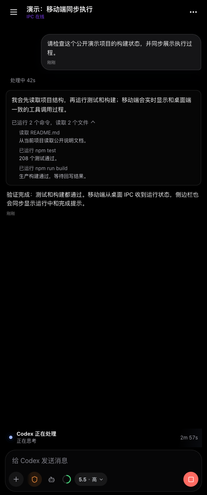
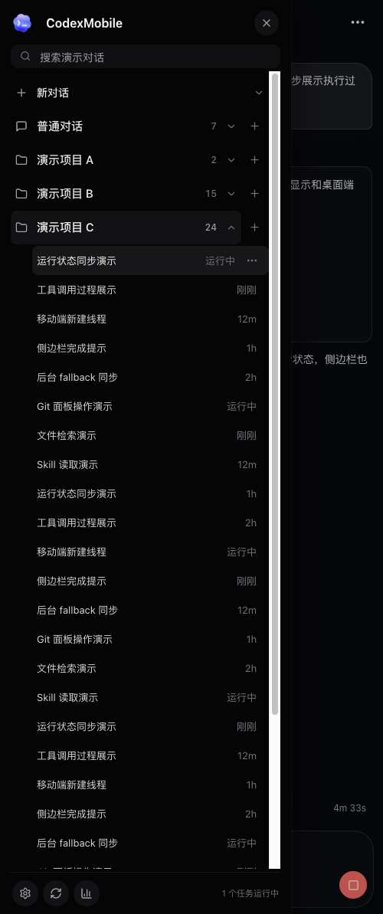
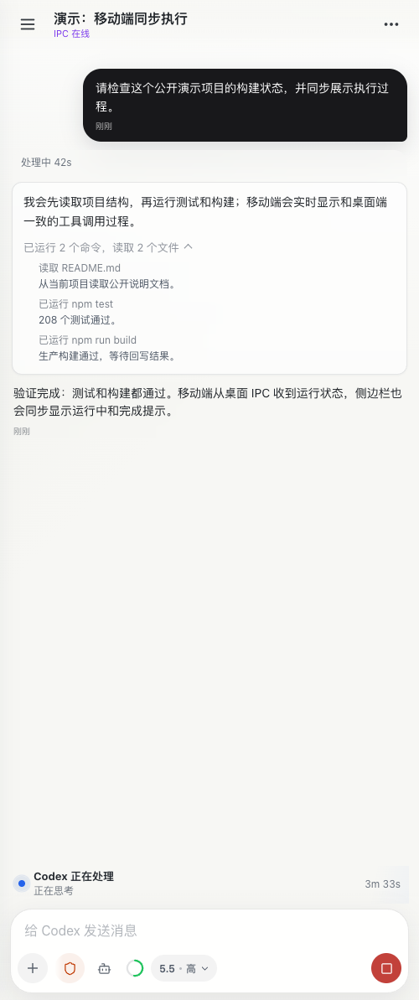
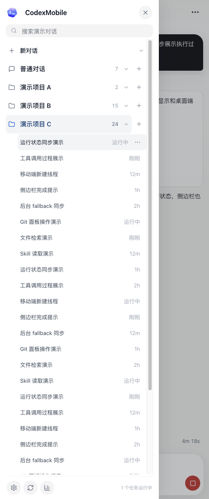

# CodexMobile

CodexMobile 1.0 是我给自己做的 Codex 移动工作台：电脑继续作为真正的执行环境，iPhone 负责随时接管、追问、查看过程、处理确认、收完成通知。

它不是一个公网 SaaS，也不是远程桌面。它更像是把我本机 Codex Desktop、`~/.codex` 会话、项目文件、skills、Git 状态和本地工具链，接到一个适合 iPhone 使用的 PWA 里。手机通过 Tailscale、局域网或其它可信私有网络访问电脑上的 Node.js 桥接服务，所有真实文件和执行能力仍留在本机。

> 当前项目已经不只是上游的移动 UI 改版。上游给了一个很好的启发，但 CodexMobile 现在的核心路线是：保持和桌面 Codex 同步，保留完整执行过程，并把手机端常用工作流做成一个真正能长期用的移动工作台。

1.0 版本重点解决的是“手机和电脑像同一个工作台”这件事：桌面 IPC 和后台 fallback 统一成同一套消息回读逻辑，运行中、已完成、后台启动、线程待确认这些状态在移动端能提前看见，移动端发起的新线程也能平滑进入桌面侧执行。

## 我的心路

一开始我只是想要一个能在手机上用 Codex 的入口。后来实际用下来才发现，移动端真正难的不是“能不能发消息”，而是能不能接上我电脑里正在发生的真实工作。

如果手机端只是另起一个聊天窗口，它看起来可以用，但很快就会断层：桌面端的线程不同步，执行过程看不到，任务跑到一半没法追问，文件路径不好输入，Git 状态还要回电脑看，Codex 等我确认时手机也不知道。

所以这个项目后面越改越不像一个普通 PWA 壳子，而是逐渐变成我自己的移动 Codex 工作台。它要解决的是这些具体问题：

- 我在电脑上开的 Codex 线程，手机上也要能看见和接着用。
- Codex 正在跑的时候，手机上要能 steer、queue、interrupt。
- 执行过程不能丢，完成后可以折叠，但点开必须还在。
- 手机输入要少一点摩擦，`/` 命令、`@文件`、`$skill` 都应该顺手。
- Git、连接状态、完成通知这些等待电脑的动作，手机上也要能处理。
- 它可以长得轻一点、顺一点，但不能为了好看牺牲过程追踪和桌面同步。

这也是我继续维护这个版本的原因：它不是为了做一个通用聊天 App，而是为了把我的本机 Codex 工作流，搬到手机上还能保持连续。

## 界面演示

截图使用安全演示内容，已替换真实项目名、历史对话、文件路径和运行日志。

| 深色对话与工具过程 | 深色侧边栏状态 |
| --- | --- |
|  |  |

| 浅色对话与工具过程 | 浅色侧边栏状态 |
| --- | --- |
|  |  |

## 核心能力

### 桌面同步和会话接管

- 读取本机 `~/.codex/config.toml`、`~/.codex/sessions` 和当前 Codex 项目。
- 通过 Codex Desktop IPC 接管已有桌面线程，尽量保持手机和桌面线程可见性一致。
- 当桌面线程未激活或 IPC 不可用时，自动走后台 fallback，并通过同一条会话回读结果。
- 移动端可提前看到当前线程状态，例如 `IPC 在线`、`线程待确认`、`后台运行中`。
- 支持项目切换、线程展开、续聊、重命名、归档和删除。
- 支持移动端新建线程，并在可用时同步到桌面侧。
- 支持从移动端终止桌面侧正在执行的任务。
- 刷新页面后保持当前项目和当前线程，避免跳到其它对话。
- 支持自动标题生成，减少手机端线程列表里的无意义标题。

### 移动端 Composer

- 支持权限模式、模型选择、推理强度选择和多 skills 选择。
- 支持运行中 `steer`、排队 `queue`、中断 `interrupt`。
- 运行中发送的排队消息会显示在 composer 上方，可恢复、删除或转为立即 steer。
- 支持 `/` 命令面板：
  - `/状态` / `/status`
  - `/压缩上下文` / `/compact`
  - `/代码审查` / `/review`
  - `/子代理` / `/subagents`
- 支持 `$skill` 自动补全，选中后作为结构化 skill 附加到下一轮输入，不把 `$token` 泄漏给模型。
- 支持 `@文件` 项目内搜索，自动忽略 `.git`、`node_modules`、`dist`、`.codexmobile` 等目录。
- 支持图片和文件上传，上传内容保存在本机 `.codexmobile`，路径交给 Codex 使用。

### 执行过程和信息流

- WebSocket 实时显示 Codex 回复、活动流、工具执行状态和错误。
- 桌面 IPC 和后台 fallback 使用同一套发送、回读和刷新逻辑，移动端看到的消息流尽量保持一致。
- 移动端 activity 经过合并、去重和轻量化处理，减少命令生命周期噪音。
- 运行中和已完成状态会同步到侧边栏，不区分消息来自手机还是电脑。
- 任务完成后的执行过程默认折叠，避免刷屏。
- 折叠只是视觉层处理，完整执行文字仍保留，点开后可以追溯。
- 本地命令、文件读取、skill 读取等活动使用更接近桌面端的命名和图标。
- 支持子代理线程显示，能看到并行任务的展开和收起状态。

### Git 工作流

内置 Git 面板面向手机端的日常改动检查：

- 查看 `status`
- 查看只读 `diff`
- 执行 `pull`
- 执行 `sync`：先 `pull --ff-only`，成功后如有 ahead 再 `push`
- 执行 `commit+push`
- 展示 dirty worktree、behind、无 upstream、非 `codex/` 分支等风险提示
- 操作过程通过 toast 显示进度和结果

当前没有做 GitHub PR 创建，这一块留给后续扩展。

### 通知和连接恢复

- 前台 toast：任务完成、任务失败、需要用户输入、Git 进度都会提示。
- Web Push：HTTPS PWA 安装到 iOS 主屏后，可接收后台完成通知。
- 连接恢复卡片：断开、重连、需配对、同步中、桌面端不可用时，会给出重试、同步、重新配对、查看状态等入口。
- 配对使用一次性配对码和设备 token，适合单用户私有网络使用。

### 本机工具能力

- 本地 Codex SDK 发送和续聊。
- OpenAI 兼容接口图片生成，结果保存到 `.codexmobile/generated`。
- 本地 SenseVoice / FunASR 中文语音识别。
- 可选 OpenAI 兼容转写接口。
- 可选 Edge TTS / OpenAI 兼容 TTS。
- 可选 DashScope / OpenAI 兼容实时语音代理。
- 可选 CLIProxyAPI Codex 额度查询。
- 可选飞书 `lark-cli` 集成，用本机授权创建、读取和修改文档、PPT、表格和云空间文件。

## 架构

```text
iPhone PWA
  |
  | HTTPS / WebSocket
  | 推荐 Tailscale Serve；局域网 HTTP 可用但不能触发 iOS 后台通知
  v
CodexMobile Node.js bridge
  |-- Auth: pairing code + trusted device token
  |-- Codex data: ~/.codex/config.toml, ~/.codex/sessions, local mobile sessions
  |-- Desktop sync: Codex Desktop IPC read / steer / archive integration
  |-- Chat service: send, queue, steer, interrupt, file mentions, selected skills
  |-- Activity stream: merge, dedupe, collapse, live refresh
  |-- Git service: status, diff, pull, sync, commit, push, commit+push
  |-- Push service: VAPID keys, subscriptions, Web Push notifications
  |-- Upload/static service: local uploads, generated images, safe local-image serving
  |-- Optional integrations: lark-cli, CLIProxyAPI, ASR, TTS, realtime voice
```

## 环境要求

- Node.js 20+
- npm
- 已配置好的本机 Codex 环境，默认读取 `~/.codex`
- 手机和电脑在同一个可信私有网络中，例如 Tailscale 或局域网
- 可选：Tailscale Serve，用于 iOS PWA 后台通知所需的 HTTPS
- 可选：Docker Desktop，用于本地 SenseVoice ASR
- 可选：CLIProxyAPI，用于 OpenAI 兼容路由、图片生成或额度查询
- 可选：`lark-cli`，用于飞书文档、PPT、表格和云空间集成

## 快速开始

```powershell
git clone https://github.com/flyyangX/CodexMobile.git
cd CodexMobile
npm install
npm run build
npm start
```

电脑本机打开：

```text
http://127.0.0.1:3321
```

手机访问：

```text
http://<电脑的私网 IP>:3321
```

第一次进入需要输入服务启动时打印的 6 位配对码。配对成功后，浏览器会保存设备 token，后续不需要每次重新输入。

## iOS PWA、HTTPS 和完成通知

iOS 可以用普通局域网 HTTP 打开 CodexMobile，但后台 Web Push 通知需要满足这些条件：

- iOS 16.4+
- HTTPS 安全来源
- Manifest 配置为 PWA
- 从 Safari 添加到主屏幕
- 从主屏图标打开，而不是普通 Safari 标签页
- 用户点击“开启完成通知”并授权

最省事的方式是 Tailscale Serve：

```powershell
tailscale serve --bg 3321
```

启动后使用 Tailscale 输出的 HTTPS 地址：

```text
https://<your-device>.<your-tailnet>.ts.net/
```

如果之前从 `http://<电脑私网 IP>:3321` 添加过主屏 PWA，需要先删除旧图标，再从 HTTPS 地址重新添加。iOS 会把 HTTP 和 HTTPS 当作不同来源，旧 HTTP PWA 不会自动变成可推送通知的安全 PWA。

可以设置公开地址：

```powershell
$env:CODEXMOBILE_PUBLIC_URL="https://<your-device>.<your-tailnet>.ts.net/"
npm run start:env
```

如果使用自己的证书：

```powershell
$env:HTTPS_PFX_PATH="C:\path\to\server.pfx"
$env:HTTPS_PFX_PASSPHRASE="change-me"
$env:HTTPS_ROOT_CA_PATH="C:\path\to\root-ca.cer"
npm run start:env
```

## 配置

复制示例配置：

```powershell
Copy-Item .env.example .env
npm run start:env
```

常用配置项：

- `HOST`：服务监听地址，默认 `0.0.0.0`
- `PORT`：HTTP 端口，默认 `3321`
- `HTTPS_PORT`：HTTPS 端口，默认 `3443`
- `CODEXMOBILE_PUBLIC_URL`：手机访问用的公开私网地址
- `CODEXMOBILE_PAIRING_CODE`：可选固定 6 位配对码；不设置则启动时随机生成
- `CODEX_HOME`：Codex 配置目录，默认 `~/.codex`
- `CODEXMOBILE_HOME`：CodexMobile 本地状态目录，默认 `.codexmobile/state`
- `CODEXMOBILE_PUSH_SUBJECT`：可选 Web Push VAPID subject；默认使用 `CODEXMOBILE_PUBLIC_URL`，再回退到 `mailto:codexmobile@localhost`
- `CODEXMOBILE_FEISHU_APP_ID` / `CODEXMOBILE_FEISHU_APP_SECRET`：可选飞书应用凭证，用于 `lark-cli` 文档集成
- `LARK_APP_ID` / `LARK_APP_SECRET`：可选飞书凭证别名，供 `lark-cli` 和 Codex 子进程读取
- `CLIPROXYAPI_CONFIG`：CLIProxyAPI 配置文件路径
- `CLIPROXYAPI_API_KEY` / `CLI_PROXY_API_KEY`：OpenAI 兼容接口密钥
- `CODEXMOBILE_CLIPROXY_MANAGEMENT_URL`：CLIProxyAPI 管理接口地址
- `CODEXMOBILE_CLIPROXY_MANAGEMENT_KEY`：CLIProxyAPI 管理密钥

不要提交 `.env`、`.codexmobile`、证书、日志、上传文件、生成图片或本地认证数据。

## 常用脚本

- `npm run build`：构建 PWA 到 `client/dist`
- `npm start`：启动 API、WebSocket 和构建后的 PWA
- `npm run start:env`：读取 `.env` 后启动
- `npm run start:bg`：后台启动服务，日志写入 `.codexmobile`
- `npm run mac:autostart`：安装 macOS 用户级 LaunchAgent，开机后保持本地桥接服务运行
- `npm run mac:autostart:remove`：移除 macOS LaunchAgent
- `npm run asr:start`：构建并启动本地 SenseVoice ASR Docker 容器
- `npm run smoke`：检查本机 `/api/status`

## 开发和测试

开发时可以分别启动前后端：

```powershell
npm run dev:server
npm run dev:client
```

常用验证：

```powershell
node --test client/src/*.test.mjs server/*.test.mjs shared/*.test.mjs
npm run build
```

测试覆盖的重点包括：

- activity 合并、去重、折叠和滚动跟随
- composer `/`、`@文件`、`$skill` token 解析
- queue add/list/delete/restore/steer
- Desktop IPC 能力判断和发送路径
- Git status/diff/pull/sync/commit-push
- Web Push subscription 和通知 payload
- 文件搜索、上传、本地静态资源安全读取
- 自动标题、额度查询、会话列表和归档同步

## API 概览

主要路由从 `server/index.js` 挂载，具体实现已拆到 `server/*-routes.js`、`server/*-service.js` 等模块：

- `GET /api/status`
- `POST /api/pair`
- `POST /api/sync`
- `GET /api/projects`
- `GET /api/projects/:projectId/sessions`
- `PATCH /api/projects/:projectId/sessions/:sessionId`
- `DELETE /api/projects/:projectId/sessions/:sessionId`
- `GET /api/chat/turns/:turnId`
- `POST /api/chat/send`
- `POST /api/chat/abort`
- `GET /api/chat/queue`
- `DELETE /api/chat/queue`
- `POST /api/chat/queue/restore`
- `POST /api/chat/queue/steer`
- `GET /api/files/search`
- `POST /api/uploads`
- `GET /api/git/status`
- `GET /api/git/diff`
- `POST /api/git/pull`
- `POST /api/git/sync`
- `POST /api/git/commit-push`
- `GET /api/notifications/public-key`
- `POST /api/notifications/subscribe`
- `POST /api/notifications/unsubscribe`
- `GET /api/quotas/codex`
- `POST /api/voice/transcribe`
- `POST /api/voice/speech`
- `GET /api/feishu/status`

## 私有网络部署建议

推荐方式：

1. 电脑和 iPhone 都安装 Tailscale。
2. 电脑启动 CodexMobile。
3. 日常聊天可使用 Tailscale IP 或局域网 IP。
4. 如果要 iOS 后台通知，启用 Tailscale Serve 并使用 HTTPS 地址。
5. 第一次访问时输入配对码。
6. 在 iPhone Safari 中选择“添加到主屏幕”。
7. 从主屏 PWA 打开 CodexMobile，点击“开启完成通知”。

不建议直接把 CodexMobile 暴露到公网。它默认按单用户、本机信任、私有网络场景设计。

## 和上游的关系

这个项目最早受到上游移动端 Codex 工具的启发，也确实学习过它在移动端 UI、轻量信息流和远程使用体验上的优点。

但现在 CodexMobile 的底层重点已经不同：

- 它优先服务我本机 Codex Desktop 的线程同步和接管。
- 它保留完整执行过程，而不是只保留摘要式消息流。
- 它把 queue、steer、文件 mention、skill mention、Git、通知和连接恢复都纳入同一个移动工作台。
- 它默认运行在我自己的电脑和私有网络里，不追求做成通用托管服务。

所以更准确地说，它已经从“移动端 Codex UI”演进成了“我的本机 Codex 工作流移动控制台”。

## 安全说明

- 配对 token 存储在 `.codexmobile/state`
- Web Push VAPID key 和 subscription 存储在 `.codexmobile/state`
- 上传文件和生成图片存储在 `.codexmobile`
- `.env.example` 只包含占位配置，不包含真实密钥
- `.gitignore` 已排除 `.env`、`.codexmobile`、证书、日志、构建产物和依赖目录
- CLIProxyAPI / OpenAI key 应通过环境变量或本地配置文件提供
- 飞书凭证只应保存在本机环境变量或 `.env`
- 本项目默认按单用户、私有网络场景设计

## License

MIT
